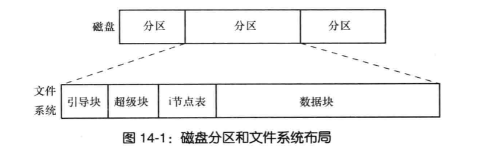
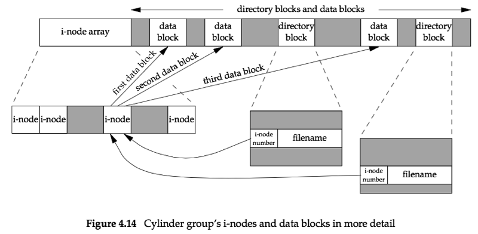
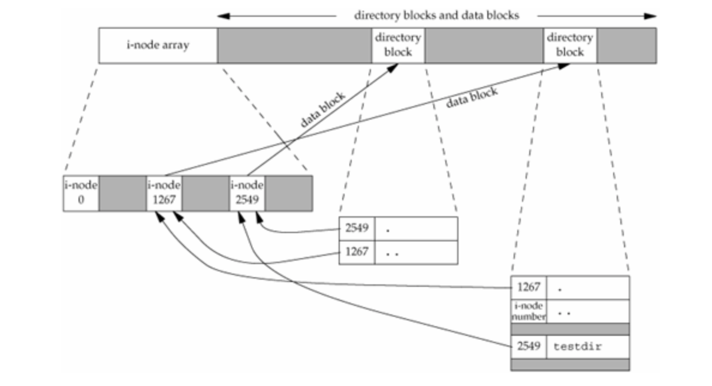

# 文件和目录

---

### 1、UNIX 的文件类型有哪些？

   - 普通文件：最常见的文件类型，这种文件包含了某种形式的数据。至于这种数据是二进制还是文本，对内核无区别。普通文件的内容解释由具体的应用程序进行。
   - 目录文件：这种文件包含了其他文件的名字，以及指向这些文件有关信息的指针。
		
	  - 只有内核可以直接写目录文件（通常用户写目录文件都要通过内核）
	  - 对某个目录文件具有读权限的任何一个进程都可以读取该目录的内容
   - 符号链接：这种类型的文件指向另一个文件
   - 块特殊文件：按数据块处理请求，通常数据块是512字节的整数倍。例如硬盘和磁带。这种类型的文件提供对设备（如磁盘）带缓冲的访问。每次访问以固定长度为单位进行。
   - 字符特殊文件：基于每个字符来处理请求，例如终端和鼠标、键盘。这种类型的文件提供对设备不带缓冲的访问，每次访问长度可变。
	> 系统的所有设备，要么是字符特殊文件，要么是块特殊文件
   - `FIFO`：这种类型的文件用于进程间通信，有时也称为命名管道
   - 套接字：这种类型的文件用于进程间的网络通信（也可用于单机上进程的非网络通信）

---
### 2、什么是实际用户、有效用户？

   - 实际用户 ID 和实际组 ID： 标志我们究竟是谁。当我们登录进操作系统时，这两个值就确定了！
   - 有效用户 ID、有效组ID、附属组 ID： 用于文件访问权限检查。

    > 每个文件都有一个所有者和组所有者，分别有 `stat.st_uid`和`stat.st_gid`指定。当一个文件时可执行文件时，如果执行这个文件，那么进程的有效用户ID就是实际用户ID，有效组ID就是实际组ID，除了下面的情况：
    
    >-  当在`stat.st_mode`中设置了一个特殊标志：设置用户ID位时，则将进程的有效用户ID设置为文件所有者的用户ID
    >-  当在`stat.st_mode`中设置了一个特殊标志：设置组ID位时，则将进程的有效组ID设置为文件所有者的组ID

### 3、进程每次打开、创建、删除一个文件时，内核所进行文件访问权限测试步骤是什么？

   - 若进程的有效用户ID是0（超级用户），则对该文件的任何访问行为都批准
   - 若进程的有效用户ID等于文件的所有者ID（也就是进程拥有此文件）：
	   - 如果该文件的用户读权限开放，则内核允许进程读该文件
	   - 如果该文件的用户写权限开放，则内核允许进程写该文件
	   - 如果该文件的用户执行权限开放，则内核允许进程执行该文件
   - 若进程的有效组ID或者进程的附属组ID之一等于文件的组ID：
	   - 如果该文件的组读权限开放，则内核允许进程读该文件
	   - 如果该文件的组写权限开放，则内核允许进程写该文件
	   - 如果该文件的用户执行权限开放，则内核允许进程执行该文件
   - 否则：
	   - 如果该文件的其他读权限开放，则内核允许进程读该文件
	   - 如果该文件的其他写权限开放，则内核允许进程写该文件
	   - 如果该文件的其他户执行权限开放，则内核允许进程执行该文件

    > 只要有一个权限通过，则不再进行测试。若所有权限都不通过，则不允许访问。

### 4、目录的权限与普通文件有什么不同？

   - 目录读权限：允许读目录，从而获得在该目录中所有文件名的列表
   - 目录可执行权限：允许搜索该目录，从而寻找一个特定的文件名
       
       > 因此目录的执行权限位也称之为搜索位
   - 当用名字`pathname`打开任何一个类型的文件时，对`pathname`中包含的每一个目录，包括`pathname`可能隐含的当前工作目录都应该具有执行权限	
   - 为了在一个目录中新建一个新文件，必须对该目录具有写权限和执行权限
   - 为了删除一个现有文件，必须对包含该文件的目录具有写权限和执行权限。对该文件本身没有权限的限制

### 5、进程新建的文件权限是如何分配的？

   - 新文件的用户ID被设置为进程的有效用户ID
   - 新文件的组ID可以有两个值之一：
	   - 进程的有效组ID
	   - 文件所在目录的组ID	
		   
	 > 具体选择哪个，由具体操作系统决定

### 6、什么是黏着位？

   粘着位：如果对一个目录设置了粘着位，则任何对该目录具有写权限的进程都能够在该目录中创建文件。但是：只有满足下列条件之一的用户才能删除或者重命名该目录下的文件：
	
   - 拥有此文件
   - 拥有此目录
   - 是超级用户

> 对于未设置粘着位的目录，则只要用户对该目录有写权限，那么就有修改和重命名该目录下其他文件的能力

### 7、`stat.st_size` 字段对普通文件、目录文件、符号链接文件的意义分别是什么？

   - 对普通文件：其长度就是文件的大小。长度为0表示该文件为空
   - 对目录文件：其长度通常是个整数（如16或者512）的整数倍
   - 对符号链接：其长度是符号链接本身存放的某个文件名的实际字节数（它并不包含字符串的`null`字节，因为这些字符是存放在文件中，而不是存放在内存中的字符串）

### 8、对于存在空洞的普通文件，`stat.st_blksize`、`stat.st_blocks` 是否记录其空洞大小？

   是。对于普通文件，可能包含空洞。空洞是由于设置的文件偏移量超过了文件末尾，然后写入了某些数据造成的。对于空洞文件：
	
   - 空洞文件的存储需要的磁盘块数量可能远小于文件大小。文件大小是文件末尾到文件头的字节数
   - 读取空洞文件的空洞时，对于没有写过的字节位置`read`返回的是字节0

### 9、`UNIX` 文件系统中什么是磁道、扇区、物理块、分区？

   - 磁道：磁盘表面的信息存储在称为磁道的一组同心圆上。
   - 扇区：磁道被划分为若干扇区。
   - 物理块：扇区包含一系列物理块，物理块的容量一般为512字节，代表了驱动器可以读写的最小信息单位。
   - 分区：可将每块磁盘换分成一个或多个不重叠的分区。内核则将每个分区视为位于 `/dev` 路径下的单独设备。

### 10、分区的构成有哪些？



   一个磁盘可以划分成一个或者多个分区，每个分区可以包含一个文件系统。每个文件系统包含一些柱面组。每个柱面组包括：
   
   - 引导块：总是作为文件系统的首块。引导块不为文件系统所用，只是包含用来引导操作系统的信息。
   - 超级块：紧随引导块之后的一个独立块，包含与文件系统相关的参数信息.
   - 一个 i 节点图：用于指示哪些 i 节点已经被使用，哪些未被使用
   - 一个 块位图：用于指示哪些数据块已经被使用，哪些为被使用
   - 一个 i 节点组。它包含的是许多 i  节点。
   - 一个数据区：存放具体的数据块和目录块
     - 目录块：它的内容是 `<i 节点编号>|<文件名>` 这种格式的记录的列表
	 - 数据块：它的内容就是具体文件的数据



### 11、i 节点是什么？有什么作用？

   i 节点是固定长度的记录项，它包含有关文件的大部分信息
      
   - 每个 i 节点都有一个链接计数，其值是指向 i 节点的目录的项数(这种链接类型称之为硬链接)。只有当该链接计数减少为0时，才可以删除该链接文件（也就是释放该文件占用的数据块）。
	  - 在`stat`结构中，链接计数包含在`st_nlink`成员中（POSIX常量：`LINK_MAX`指定了一个文件链接数的最大值）			 
   - 每个 i 节点包含了文件有关的所有信息：文件类型、文件权限访问位、文件长度和指向文件数据块的指针
	   - `stat`结构中的大多数信息来自于 i  结点。只有两项重要数据存放在目录项中：文件名、i节点编号
	   - 目录项中的 i 节点编号只能指向同一个文件系统中的相应的 i 节点。
			
		> 因此硬链接不能跨文件系统
   - 当在不更换文件系统的情况下重命名一个文件时，该文件的实际内容并未移动。只需要构造一个指向现有 i 节点的新目录项，并删除来的目录项。此时该 i节点的链接计数不会改变

### 12、为什么任何一个目录 `dirxxx` 的硬链接至少为2？
	
- 该目录的内容中有一条名为的`.`记录，该记录的 `<i节点编号>` 指向`dirxxx`目录的节点
- 该目录的父目录的内容中有一条记录，记录的名字`dirxxx`，记录的 `<i节点编号>` 指向`dirxxx`目录的节点
- 若该目录有子目录。`dirxxx` 的任何子目录的内容有一条名为`..`的记录，该记录的 `<i节点编号>` 指向`dirxxx`目录的节点

> 因此父目录中的每个子目录都使得父目录的链接计数加 1




### 13、什么是硬链接？如何实现的？

   硬链接就是多个不在或者同在一个目录下的文件名，实际指向的是同一个 i 节点，其中一个修改后，所有与其有硬链接的文件都一起修改了。
   
### 14、 什么是软链接？与硬链接的区别有哪些？

与硬链接对应的概念是软链接。软链接也称作符号链接，它是一种特殊的文件。该文件的实际内容（在数据块中）包含了该符号链接所指向的文件的名字。同时该文件的 i 节点指示了该文件类型是 `S_IFLNK`，于是系统知道了这个文件是个符号链接。
	
- 硬链接直接指向文件的`i`节点
- 软链接是对一个文件的间接指针
- 引入符号链接的原因是为了避开硬链接的一些限制：
   - 硬链接通常要求链接和文件位于同一个文件系统中
   - 只有超级用户才能创建指向目录的硬链接（在底层文件系统支持的情况下） 

### 15、 `unlink`、`rmdir` 函数删除文件或目录的具体判定规则是什么？

- 如果该文件的硬链接数不为0， 则还可以通过其他链接访问该文件的内容
- 如果该文件的硬链接数为0，而没有进程打开该文件，则该文件的内容才有被删除
- 如果该文件的硬链接数为0，但是有进程打开了该文件，则该文件的内容不能被删除。当进程关闭文件时，内核会检查打开该文件的进程个数；当这个数量为0，内核再去检查其链接计数。如果链接计数也是0，则就删除该文件的内容。
		
>这个特性常用于创建临时文件，先`open,create`一个文件，然后立即调用`unlink`。这样即使程序崩溃，它所创建的临时文件也不会遗留下来

### 16、文件的三个时间属性？

- `st_atim`：文件数据的最后访问时间
- `st_mtim`：文件数据的最后修改时间
- `st_ctim`： i 节点状态的最后更改时间

> 关于这三个时间：
	
>	- 有很多操作，比如修改文件权限，修改文件的所有者等操作，他们只修改 i 节点状态（只影响`st_ctim`），但是并不修改文件数据，也并不访问文件数据
>	- 系统并不维护对 `i` 节点的最后访问时间。因此对于 `access`函数和 `stat`函数，他们并不修改这三个时间中的任何一个
>	- 创建一个文件不仅影响了文件本身的这三个时间，也会影响该文件目录的这三个时间


### API

```
int stat(const char * restrict pathname, struct stat*restrict buf);
int fstat(int fd, struct stat* buf);
int lstat(const char* restrict pathname,struct stat *restrict buf);
int fstatat(int fd,const char*restrict pathname,struct stat*restrict buf,int flag);

struct stat{
	mode_t 		st_mode; 	//文件权限和类型信息
	ino_t 			st_ino;		//i-node 号
	dev_t 			st_dev;		// 设备号
	dev_t 			st_rdev;	// 特殊文件的设备号
	nlink_t 		st_nlink;	// 硬链接数量
	uid_t 			st_uid;		// owner 的用户ID
	gid_t 			st_gid;		// owner 的组ID
	off_t 			st_size;	//对普通文件，它是文件字节大小
	struct timespec st_atime;	// 上次访问时间
	struct timespec st_mtile;	// 上次修改时间
	struct timespec st_ctime;	// 上次文件状态改变的时间
	blksize_t 		st_blksize;	// 最佳的 I/O block 大小
	blkcnt_t 		st_blocks;	//分配的磁盘块数量
}

`S_ISREG()`：测试是否普通文件
`S_ISDIR()`：测试是否目录文件
`S_ISCHR()`：测试是否字符特殊文件
`S_ISBLK()`：测试是否块特殊文件
`S_ISFIFO()`：测试是否`FIFO`
`S_ISLNK()`：测试是否符号链接文件
`S_ISSOCK()`：测试是否套接字
`S_TYPEISMQ()`：测试是否消息队列
`S_TYPEISSEM()`：测试是否信号量
`S_TYPEISSHM()`：测试是否共享存储对象

`S_ISUID()`：测试是否设置了设置用户ID位
`S_ISGID()`：测试是否设置了设置组ID位

int access(const char *pathname,int mode);
int faccess(int fd,const char*pathname,int mode,int flag);

mode_t umask(mode_t cmask);

int chmod(const char*pathname,mode_t mode);
int fchmod(int fd,mode_t mode);
int fchmodat(int fd,const char*pathname,mode_t mode,int flag);

int chown(const char *pathname,uid_t owner,gid_t group);
int fchown(int fd,uid_t owner,gid_t group);
int fchownat(int fd,const char *pathname,uid_t owner,gid_t group,int flag);
int lchown(const char *pathname,uid_t owner,gid_t group);

int truncate(const char*pathname,off_t length);
int ftruncate(int fd,off_t length);

int link(const char *existingpath,const char *newpath);
int linkat(int efd,const char*existingpath,int nfd,const char *newpath,int flag);

int unlink(const char*pathname);
int unlinkat(int fd,const char*pathname,int flag);

int remove(const char *pathname);

int rename(const char*oldname,const char *newname);
int renameat(int oldfd,const char*oldname,int newfd,const char* newname);

int symlink(const char*actualpath,const char *sympath);
int symlinkat(const char*actualpath,int fd,const char*sympath);

ssize_t readlink(const char *restrict pathname,char *restrict buf,size_t bufsize);
ssize_t readlink(const char *restrict pathname,char *restrict buf,size_t bufsize);
ssize_t readlinkat(int fd, const char* restrict pathname,char *restrict buf,size_t bufsize);

int futimens(int fd,const struct timespec times[2]);
int utimensat(int fd,const char*path,const struct timespec times[2],int flag);
int utimes(const char*pathname,const struct timeval times[2]);

int mkdir(const char*pathname,mode_t mode);
int mkdirat(int fd,const char *pathname,mode_t mode);

int rmdir(const char *pathname);

int chdir(const char *pathname);
int fchdir(int fd);
char *getcwd(char *buf,size_t size);
```