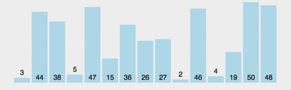
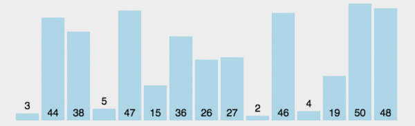
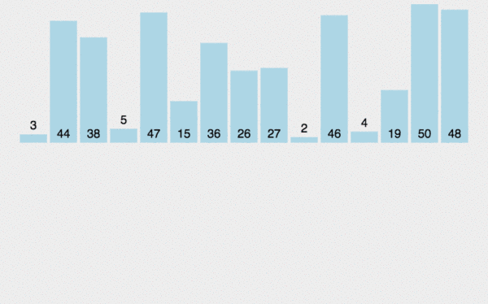
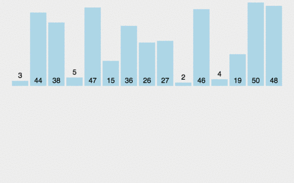
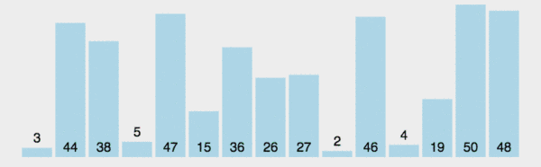
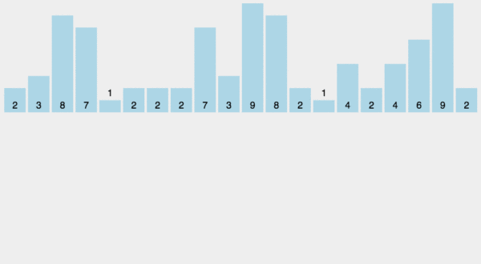
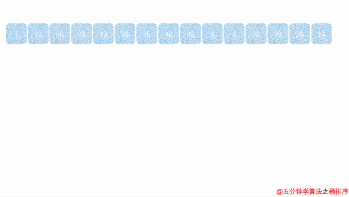
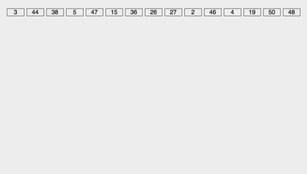
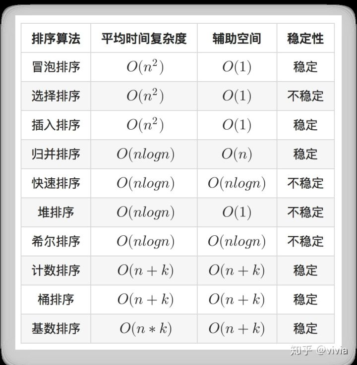

# 经典排序算法

## 冒泡排序

- 代码示例：

```
//优化实现
void bubble_sort_better(int a[],int n)//n为数组a的元素个数
{
    //最多进行N-1轮比较
    for(int i=0; i<n-1; i++)
    {
        bool isSorted = true;
        //每一轮比较前n-1-i个，即已排序好的最后i个不用比较
        for(int j=0; j<n-1-i; j++)
        {
            if(a[j] > a[j+1])
            {
                isSorted = false;
                int temp = a[j];
                a[j] = a[j+1];
                a[j+1]=temp;
            }
        }
        if(isSorted) break; //如果没有发生交换，说明数组已经排序好了
    }
}

// 单链表的冒泡排序法
NODE *bubblesort(NODE *head)
{
    node* pfirst=NULL,pend=NULL;

    while(pHead != pend){
        pfirst=pHead;
        
        while(pfirst->next != pend){
            if(pfirst->date < pfirst->next->date){
                int temp = pfirst->date;
                pfirst->date = pfirst->next->date;
                pfirst->next->date = temp;
            }
            
            pfirst = pfirst->next;
        }
        
        pend = pfirst;
    }
    
    return pHead;
}

NODE *bubblesort(NODE *head)
{
    NODE *q,*tail,*p=(NODE*)malloc(sizeof(NODE));
    p->next=head;
    head=p;
    tail=NULL;
 
    while(tail!=head->next)
    {
	    p=head;
	    q=p->next;
	      
	    while(q->next != tail)
	    {
	        if(q->i < q->next->i)
	        {
	            NODE *tmp1 = q->next;
	            NODE *tmp2 = q->next->next;
	          
	            p->next = tmp1;
	            tmp1->next = q;
	            q->next = tmp2;
	        }
	        
	        p=p->next;
	        q=q->next;
	    }
	    
	    tail = q;
    }
 
    p=head->next;
    free(head);
    return(p)；
}
```

- 动图解释



- 分析

> - 在相邻元素相等时，它们并不会交换位置，所以，冒泡排序是稳定排序。
> - 冒泡排序思路简单，代码也简单，特别适合小数据的排序。但是，由于算法复杂度较高，在数据量大的时候不适合使用。
> - 在数据完全有序的时候展现出最优时间复杂度，为O(n)。其他情况下，几乎总是O( n2 )。因此，算法在数据基本有序的情况下，性能最好。


## 选择排序

- 代码示例

```
void select_sort(int * a, int n)
{ 
    int i, j, min, t;
    for( i = 0; i < n -1; i ++)
    {
        min = i; //查找最小值
        for( j = i +1; j < n; j ++)
        if( a[min] > a[j])
            min = j; //交换
        if(min != i)
        {
           t = a[min];
           a[min] = a[i];
           a[i] = t;
         }
     }
}
```

- 动图演示



- 分析

> - 用数组实现的选择排序是不稳定的
> - 选择排序实现也比较简单，并且由于在各种情况下复杂度波动小，因此一般是优于冒泡排序的。在所有的完全交换排序中，选择排序也是比较不错的一种算法。但是，由于固有的O(n2)复杂度，选择排序在海量数据面前显得力不从心。因此，它适用于简单数据排序。


## 插入排序

- 代码示例

```
void Insertsort(int a[], int n)  
{  
    int i, j;  
    for (i = 1; i < n; i++)  
        if (a[i] < a[i - 1])  
        {  
            int temp = a[i];  
            for (j = i - 1; j >= 0 && a[j] > temp; j--)  
                a[j + 1] = a[j];  
            a[j + 1] = temp;  
        }  
}

```

- 动图演示



- 分析

> - 由于只需要找到不大于当前数的位置而并不需要交换，因此，直接插入排序是稳定的排序方法。
> - 插入排序由于O( n2 )的复杂度，在数组较大的时候不适用。但是，在数据比较少的时候，是一个不错的选择，一般做为快速排序的扩充。例如，在STL的sort算法和stdlib的qsort算法中，都将插入排序作为快速排序的补充，用于少量元素的排序。

## 希尔排序

- 代码示例

```
void ShellSort(int *data,int len)
{
   int d = len;
   while(d > 1)
   {
      d = (d+1)/2;
      for(int i = 0; i < len - d; ++i)
      {
         if(data[i + d] < data[i])
            swap(data[i+d],data[i]);
      }
   }
}

```

- 动画演示


- 分析

> - Shell排序不是一个稳定的算法。
> - Shell排序虽然快，但是毕竟是插入排序，其数量级并没有后起之秀--快速排序O(n㏒n)快。在大量数据面前，Shell排序不是一个好的算法。但是，中小型规模的数据完全可以使用它。

## 归并排序

- 代码示例

```
void merge(int arr[], int l, int m, int r)
{
    int i, j, k;
    int n1 = m - l + 1;
    int n2 =  r - m;

    /* create temp arrays */
    int L[n1], R[n2];

    /* 复制数据到 L[] 和 R[] */
    for(i = 0; i < n1; i++)
       L[i] = arr[l + i];
    for(j = 0; j <= n2; j++)
       R[j] = arr[m + 1+ j];

    /* 将两部分再合并到 arr[l..r]*/
    i = 0;
    j = 0;
    k = l;

    while (i < n1 && j < n2)
    {
        if (L[i] <= R[j])
        {
            arr[k] = L[i];
            i++;
        }
        else
        {
            arr[k] = R[j];
            j++;
        }
        k++;
    }

    /* 复制剩下的部分 L[] */
    while (i < n1)
    {
        arr[k] = L[i];
        i++;
        k++;
    }

    /* 复制剩下的部分 R[] */
    while (j < n2)
    {
        arr[k] = R[j];
        j++;
        k++;
    }
}

/* 对数据arr排序，从l到r */
void mergeSort(int arr[], int l, int r)
{
    if (l < r)
    {
        int m = l+(r-l)/2; //和 (l+r)/2 一样, 但是可以避免溢出在 l 和 r较大时

        mergeSort(arr, l, m);
        mergeSort(arr, m+1, r);
        merge(arr, l, m, r);
    }
}
```

- 动图演示




- 分析

> - 因为我们在遇到相等的数据的时候必然是按顺序“抄写”到辅助数组上的，所以，归并排序同样是稳定算法。
> - 归并排序时间复杂度为 O( nlogn )，在数据量比较大的时候也有较为出色的表现（效率上），但是，其空间复杂度O(n)使得在数据量特别大的时候（例如，1千万数据）几乎不可接受。而且，考虑到有的机器内存本身就比较小，因此，采用归并排序一定要注意。


## 快速排序

- 代码示例

```
public static void quickSort(int[] arr){
    qsort(arr, 0, arr.length-1);
}
private static void qsort(int[] arr, int low, int high){
    if (low >= high)
        return;
    int pivot = partition(arr, low, high);        //将数组分为两部分
    qsort(arr, low, pivot-1);                   //递归排序左子数组
    qsort(arr, pivot+1, high);                  //递归排序右子数组
}
private static int partition(int[] arr, int low, int high){
    int pivot = arr[low];     //基准
    while (low < high){
        while (low < high && arr[high] >= pivot) --high;
        arr[low]=arr[high];             //交换比基准大的记录到左端
        while (low < high && arr[low] <= pivot) ++low;
        arr[high] = arr[low];           //交换比基准小的记录到右端
    }
    //扫描完成，基准到位
    arr[low] = pivot;
    //返回的是基准的位置
    return low;
}

// 链表的快速排序
Node* GetPartion(Node* pBegin, Node* pEnd)  
{  
    int key = pBegin->key;  
    Node* p = pBegin;  
    Node* q = p->next;  

    while(q != pEnd)  
    {  
        if(q->key < key)  
        {  
            p = p->next;  
            swap(p->key,q->key);  
        }  

        q = q->next;  
    }  
    swap(p->key,pBegin->key);  
    return p;  
}  

void QuickSort(Node* pBeign, Node* pEnd)  
{  
    if(pBeign != pEnd)  
    {  
        Node* partion = GetPartion(pBeign,pEnd);  
        QuickSort(pBeign,partion);  
        QuickSort(partion->next,pEnd);  
    }  
}
```

- 动画演示




- 分析

> - 快速排序并不是稳定的。这是因为我们无法保证相等的数据按顺序被扫描到和按顺序存放。
> - 快速排序在大多数情况下都是适用的，尤其在数据量大的时候性能优越性更加明显。但是在必要的时候，需要考虑下优化以提高其在最坏情况下的性能。

## 堆排序

- 示例代码

```
void heapRebuild(int arr[],int root,int size)
{
    int child=2*root+1;
    if(child<=size-1)
    {
        int rightChild=child+1;
        if(rightChild<=size-1)
            if(arr[child]<arr[rightChild])
                child=rightChild;

        if(arr[root]<arr[child])
        {
            int temp=arr[child];
            arr[child]=arr[root];
            arr[root]=temp;
            heapRebuild(arr,child,size);
        }
    }
}
void heapSort(int arr[],int size)
{
    for(int i=size/2-1;i>=0;i--)
    {
        heapRebuild(arr,i,size);
    }
    int last=size-1;
    for(int i=1;i<=size;i++,last--)
    {
        int temp=arr[0];
        arr[0]=arr[last];
        arr[last]=temp;
        heapRebuild(arr,0,last);
    }
}


```

- 动画演示


- 分析

> - 堆排序存在大量的筛选和移动过程，属于不稳定的排序算法。
> - 堆排序在建立堆和调整堆的过程中会产生比较大的开销，在元素少的时候并不适用。但是，在元素比较多的情况下，还是不错的一个选择。尤其是在解决诸如“前n大的数”一类问题时，几乎是首选算法。

## 计数排序

- 代码示例

```
private static void countSort1(int [] A) {
	int min = 0, max = 0;
	int [] C = null;
	for(int index = 0; index < A.length; index++) {
		if(A[index] < min) {
			min = A[index];
			continue;
		}
		
		if(A[index] > max)	max = A[index];
	}
	
	C = new int[max - min + 1];
	for(int index = 0; index < A.length; index++) {
		C[A[index] - min]++;
	}
	
	int a = 0;
	for(int index = 0; index < C.length; index++) {
		for(int count = 0; count < C[index]; count++){
			A[a++] = index + min;
		}
	}

```

- 动画演示



- 分析

> - 最后给 b 数组赋值是倒着遍历的，而且放进去一个就将C数组对应的值（表示前面有多少元素小于或等于A[i]）减去一。如果有相同的数x1,x2，那么相对位置后面那个元素x2放在（比如下标为4的位置），相对位置前面那个元素x1下次进循环就会被放在x2前面的位置3。从而保证了稳定性。
> - 排序目标要能够映射到整数域，其最大值最小值应当容易辨别。例如高中生考试的总分数，显然用0-750就OK啦；又比如一群人的年龄，用个0-150应该就可以了，再不济就用0-200喽。另外，计数排序需要占用大量空间，它比较适用于数据比较集中的情况。


## 桶排序

- 代码示例

```
struct barrel {   
    int node[10];   
    int count;/* the num of node */  
};   

void bucket_sort(int data[], int size)   
{   
    int max, min, num, pos;   
    int i, j, k;   
    struct barrel *pBarrel;   

    max = min = data[0];   
    for (i = 1; i < size; i++) {   
        if (data[i] > max) {   
            max = data[i];   
        } else if (data[i] < min) {   
            min = data[i];   
        }   
    }   
    num = (max - min + 1) / 10 + 1;   
    pBarrel = (struct barrel*)malloc(sizeof(struct barrel) * num);   
    memset(pBarrel, 0, sizeof(struct barrel) * num);   

    /* put data[i] into barrel which it belong to */  
    for (i = 0; i < size; i++) {   
        k = (data[i] - min + 1) / 10;/* calculate the index of data[i] in barrel */  
        (pBarrel + k)->node[(pBarrel + k)->count] = data[i];   
        (pBarrel + k)->count++;   
    }   

    pos = 0;   
    for (i = 0; i < num; i++) {   
        quick_sort((pBarrel+i)->node, 0, (pBarrel+i)->count);/* sort node in every barrel */  

        for (j = 0; j < (pBarrel+i)->count; j++) {   
            data[pos++] = (pBarrel+i)->node[j];   
        }   
    }   
    free(pBarrel);   
}

```

- 动画演示



- 分析

> - 可以看出，在分桶和从桶依次输出的过程是稳定的。但是，由于我们在对每个桶进行排序时使用了其他算法，所以，桶排序的稳定性依赖于这一步。如果我们使用了快排，显然，算法是不稳定的。
> - 桶排序可用于最大最小值相差较大的数据情况，但桶排序要求数据的分布必须均匀，否则可能导致数据都集中到一个桶中。比如[104,150,123,132,20000], 这种数据会导致前4个数都集中到同一个桶中。导致桶排序失效。


## 基数排序

- 代码示例

```

/********************************************************
*函数名称：GetNumInPos
*参数说明：num 一个整形数据
*           pos 表示要获得的整形的第pos位数据
*说明：    找到num的从低到高的第pos位的数据
*********************************************************/
int GetNumInPos(int num,int pos)
{
    int temp = 1;
    for (int i = 0; i < pos - 1; i++)
        temp *= 10;

    return (num / temp) % 10;
}

/********************************************************
*函数名称：RadixSort
*参数说明：pDataArray 无序数组；
*           iDataNum为无序数据个数
*说明：    基数排序
*********************************************************/
#define RADIX_10 10    //整形排序
#define KEYNUM_31 10     //关键字个数，这里为整形位数
void RadixSort(int* pDataArray, int iDataNum)
{
    int *radixArrays[RADIX_10];    //分别为0~9的序列空间
    for (int i = 0; i < 10; i++)
    {
        radixArrays[i] = (int *)malloc(sizeof(int) * (iDataNum + 1));
        radixArrays[i][0] = 0;    //index为0处记录这组数据的个数
    }

    for (int pos = 1; pos <= KEYNUM_31; pos++)    //从个位开始到31位
    {
        for (int i = 0; i < iDataNum; i++)    //分配过程
        {
            int num = GetNumInPos(pDataArray[i], pos);
            int index = ++radixArrays[num][0];
            radixArrays[num][index] = pDataArray[i];
        }

        for (int i = 0, j =0; i < RADIX_10; i++)    //收集
        {
            for (int k = 1; k <= radixArrays[i][0]; k++)
                pDataArray[j++] = radixArrays[i][k];
            radixArrays[i][0] = 0;    //复位
        }
    }
}

```

- 动画演示



- 分析

> - 通过上面的排序过程，我们可以看到，每一轮映射和收集操作，都保持从左到右的顺序进行，如果出现相同的元素，则保持他们在原始数组中的顺序。可见，基数排序是一种稳定的排序
> - 基数排序要求较高，元素必须是整数，整数时长度10W以上，最大值100W以下效率较好，但是基数排序比其他排序好在可以适用字符串，或者其他需要根据多个条件进行排序的场景，例如日期，先排序日，再排序月，最后排序年 ，其它排序算法可是做不了的。





