# 经典数据结构——字符串

## 最长公共子序列LCS

```
#include <iostream>
#include <string>
using namespace std;
int main(int argc, char **argv)
{
   string str1 = "ABCBDAB";
   string str2 = "BDCABA";

   int x_len = str1.length();
   int y_len = str2.length();

   int arr[50][50] = {{0,0}};

   int i = 0;
   int j = 0;

   for(i = 1; i <= x_len; i++)
   {
     for(j = 1; j <= y_len; j++)
     {
        if(str1[i - 1] == str2[j - 1])
        {
           arr[i][j] = arr[i - 1][j - 1] + 1;
        }
        else
        {
           if(arr[i][j - 1] >= arr[i - 1][j])
           {
              arr[i][j] = arr[i][j - 1];
           }
           else
           {
               arr[i][j] = arr[i -1][j];
           }
        }
      }
    }

    for(i = x_len, j = y_len; i >= 1 && j >= 1;)
    {
       if(str1[i - 1] == str2[j - 1])
       {
           cout << str1[i - 1] << " ";//倒序打印的
           i--;
           j--;
       }
       else
       {
       //  if(arr[i][j -1] >= arr[i - 1][j])//打印：B A D B
           if(arr[i][j -1] > arr[i - 1][j])  //打印:A B C B
           {
               j--;
           }
           else
           {
              i--;
           }
        }
     }
     cout << endl;
     return 0;
   }


```

### 最长重复子串

```
#include <iostream>
using namespace std;

const int MAXN = 1000;

int mycmp(const void* p1, const void* p2)
{
 return strcmp(*(char* const*)p1, *(char* const*)p2);
}

int getLen(char* p, char* q)
{
 int ret = 0;
 while (*p && *p++ == *q++)
 {
     ++ret;
 }
 return ret;
}

char* foo(char result[], char s[])
{
 int len = strlen(s);
 char** suffix = new char*[len];
 for (int i = 0; i < len; ++i)
 {
     suffix[i] = s + i;
 }
 qsort(suffix, len, sizeof (char*), mycmp);
 //for (int i = 0; i < len; ++i)
 //{
 //    cout << suffix[i] << endl;
 //}
 int maxlen = 0, maxi = 0, maxj = 0, temp = 0;
 for (int i = 0; i < len - 1; ++i)
 {
     temp = getLen(suffix[i], suffix[i + 1]);
     if (temp > maxlen)
     {
         maxlen = temp;
         maxi = i;
         maxj = i + 1;
     }
 }
 //cout << maxlen << endl;
 //cout << suffix[maxi] << endl;
 //cout << suffix[maxj] << endl;
 //printf("%.*s\n", maxlen, suffix[maxi]);
 for (int i = 0; i < maxlen; ++i)
 {
     result[i] = suffix[maxi][i];
 }
 result[maxlen] = '\0';
 return result;
}

```


## KMP算法

### 原理

  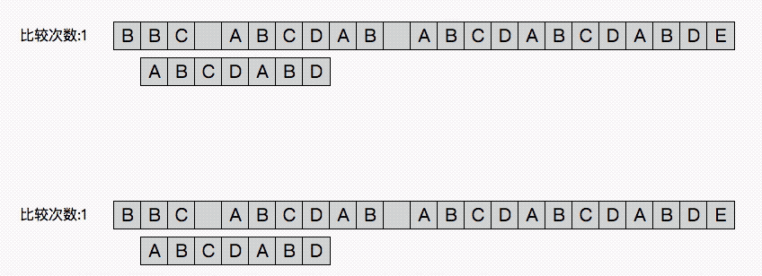

   从上图的效果预览中可以看出使用朴素算法依次比较模式串需要移位13次，而使用kmp需要8次，故可以说kmp的思路是通过避免无效的移位，来快速移动到指定的地点。接下来我们关注一下kmp是如何“跳着”移动的：

  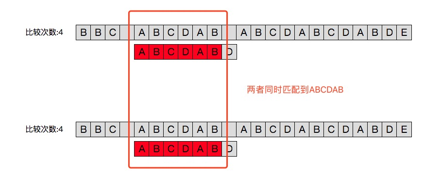
  
  与朴素算法一致，在之前对于主串“BBC ”的匹配中模式串ABCBABD的第一个字符均与之不同故向后移位到现在上图所示的位置。主串通过依次与模式串中的字符比较我们可以看出，模式串的前6个字符与主串相同即ABCDAB；而这也就是kmp算法的关键。
  
  我们先从下图来看朴素算法与kmp中下一次移位的过程：
  
  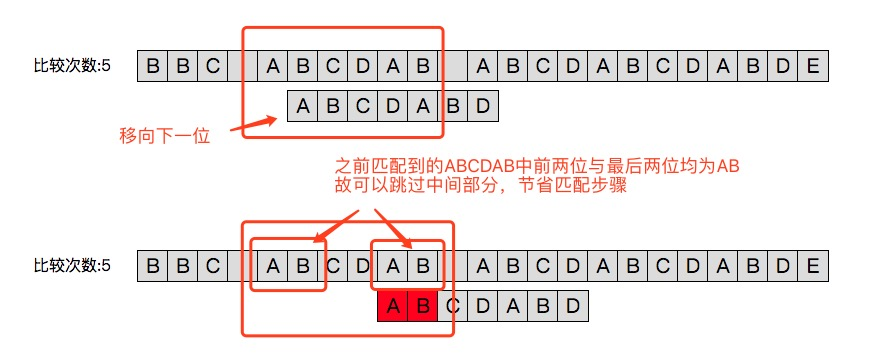

  朴素算法雨打不动得向后移了一位。而kmp跳过了主串的BCD三个字符。从而进行了一次避免无意义的移位比较。那么它是怎么知道我这次要跳过三个而不是两个或者不跳呢？关键在于上一次已经匹配的部分ABCDAB
  
   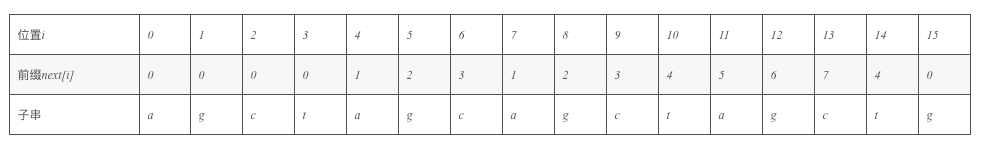

### 代码示例

```
void SetPrefix(const char *Pattern, int prefix[])
{
     int len=CharLen(Pattern);//模式字符串长度。
     prefix[0]=0;
     for(int i=1; i<len; i++)
     {
         //不断递归判断是否存在子对称，k=0说明不再有子对称，Pattern[i] != Pattern[k]说明虽然对称，但是对称后面的值和当前的字符值不相等，
           所以继续递推
         int k=prefix[i-1];
  
         while( Pattern[i] != Pattern[k]  &&  k!=0 )       //继续递归
             k=prefix[k-1];  
 
         if( Pattern[i] == Pattern[k])//找到了这个子对称，或者是直接继承了前面的对称性，这两种都在前面的基础上++
              prefix[i]=k+1;
         else
              prefix[i]=0;       //如果遍历了所有子对称都无效，说明这个新字符不具有对称性，清0
     }
}

int kmp(const char T[],const char P[],int next[])
{
    int n,m;
    int i,q;
    n = strlen(T);
    m = strlen(P);
    makeNext(P,next);
    for (i = 0,q = 0; i < n; )
    {
        while(q > 0 && P[q] != T[i])
            q = next[q-1];
       
        if (P[q] == T[i])
        {
            i++;
            q++;
        }
        else if(q == 0)
        {
           ++i;
        }
        if (q == m)
        {
            printf("Pattern occurs with shift:%d\n",(i-m+1));
        }
    }   
}
```

## Boyer-Moore BM 字符串匹配算法

### 原理解析

- 坏字符算法

    大家来头脑风暴下：如何加快字符串搜索？

    举个很简单的例子，如下图所示，navie 表示一般做法，逐个进行比对，从右向左，最后一个字符 c 与 text 中的 d 不匹配，pattern 右移一位。但大家看一下这个d有什么特征？pattern 中没有 d，因此你不管右移1、2、3、4位肯定还是不匹配，何必花这个功夫呢？直接右移5（strlen(pattern)）位再进行比对不是更好吗？

    好，就这样做，右移5位后，text 中的 b 与 pattern 中的 c 比较，发现还是不同，这时咋办？b 在 pattern 中有所以不能一下右移5位了，难道直接右移一位吗？

    No，可以直接将 pattern 中的 b 右移到 text 中 b 的位置进行比对，但是 pattern 中有两个 b，右移哪个 b 呢？保险的办法是用最右边的 b 与 text 进行比对，为啥？下图说的很清楚了，用最左边的 b 太激进了，容易漏掉真正的匹配，图中用最右边的 b 后发现正好所有的都匹配成功了，如果用最左边的不就错过了这个匹配项吗？这个启发式搜索就是BM算法做的。

    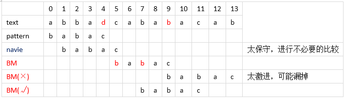

    But, 如果遇到下面这样的情况，开始 pattern 中的 c 和 text 中的 b 不匹配，Ok，按上面的规则将 pattern 右移直至最右边的b与 text 的 b 对齐进行比对。再将 pattern 中的 c 与 text 中的 c 进行比对，匹配继续往左比对，直到位置3处 pattern 中的 a 与 text 中的 b 不匹配了，按上面讲的启发式规则应该将 pattern 中最右边的 b 与 text 的b对齐，可这时发现啥了？pattern 走了回头路，干吗？当然不干，才不要那么傻，针对这种情况，只需要将 pattern 简单的右移一步即可，坚持不走回头路！
 
     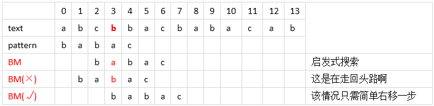
 
    好了，这就是所谓的“坏字符算法”，简单吧，通俗易懂吧，上面用红色粗体字标注出来的b就是“坏字符”，即不匹配的字符，坏字符是针对 text 的。

- 好后缀算法

    BM 难道就这么简单？就一个启发式规则就搞定了？当然不是了，大家再次头脑风暴一下，有没有其他加快字符串搜索的方法呢？比如下面的例子

    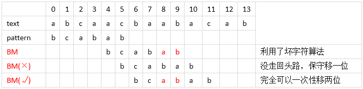

    一开始利用了坏字符算法一下移了4位，不错，接下来遇到了回头路，没办法只能保守移一位，但真的就只能移一位吗？
    
    No，因为 pattern 中前面其他位置也有刚刚匹配成功的后缀 ab，那么将 pattern 前面的 ab 右移到 text 刚匹配成功的 ab 对齐继续往前匹配不是更好吗？这样就可以一次性右移两位了，很好的有一个启发式搜索规则啊。
    
    有人可能想：要是前面没已经匹配成功的后缀咋办？是不是就无效了？不完全是，这要看情况了，比如下面这个例子。
    
    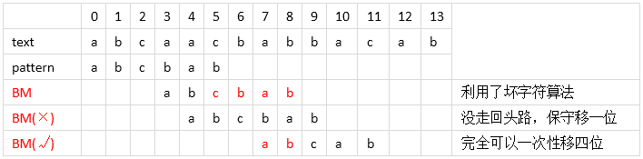
    
    cbab 这个后缀已经成功匹配，然后 b 没成功，而 pattern 前面也没发现 cbab 这样的串，这样就直接保守移一位？
    
    No，前面有 ab 啊，这是 cbab 后缀的一部分，也可以好好利用，直接将 pattern 前面的 ab 右移到 text 已经匹配成功的 ab 位置处继续往前匹配，这样一下子就右移了四位，很好。当然，如果前面完全没已经匹配成功的后缀或部分后缀，比如最前面的 babac，那就真的不能利用了。
    
    但是值得注意的是，完全后缀和部分后缀是有区别的。部分后缀就必须和前缀相互匹配，也就是说，abcbab 中，能和最后的 ab 匹配的必须是最前面的两个字符 ab，如果是字符串 dabcbab，那么就不能使用部分后缀。
    
    原因就在于 abcbab 中完全后缀是 cbab，但是 pattern 中不存在与其匹配的子串，那么我们就可以判定即使存在部分后缀 ab， 那么 ab 前面的字符也必然不是 b，根本没有匹配的必要。但是如果 ab 这个部分后缀匹配到了 pattern 的前缀，那还是很有可能匹配成功的。
    
###  BM算法理论探讨

- 坏字符算法

    当出现一个坏字符时, BM算法向右移动模式串, 让模式串中最靠右的对应字符与坏字符相对，然后继续匹配。坏字符算法有两种情况。
    
    Case1：模式串中有对应的坏字符时，让模式串中最靠右的对应字符与坏字符相对（PS：BM不可能走回头路，因为若是回头路，则移动距离就是负数了，肯定不是最大移动步数了），如下图。
    
    
    
    Case2：模式串中不存在坏字符，很好，直接右移整个模式串长度这么大步数，如下图。
    
    
    
- 好后缀算法

    好后缀算法有三种情况，如下图所示：
    
    Case1：模式串中有子串和好后缀完全匹配，则将最靠右的那个子串移动到好后缀的位置继续进行匹配。
    
    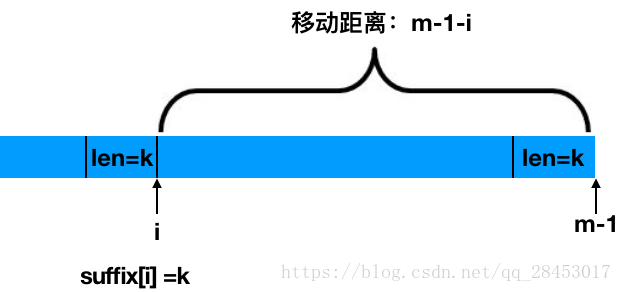
    
    Case2：如果不存在和好后缀完全匹配的子串，则在好后缀中找到具有如下特征的最长子串,使得P[m-s…m]=P[0…s]。
    
    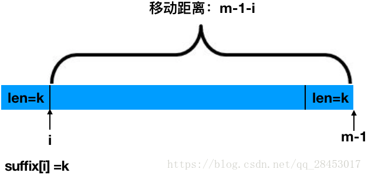
    
    Case3：如果完全不存在和好后缀匹配的子串，则右移整个模式串。

    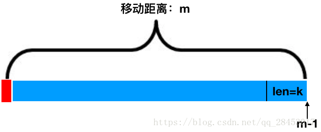
    
    
### BM 算法代码详解

- 后缀匹配

    后缀匹配，是指模式串的比较从右到左，模式串的移动也是从左到右的匹配过程，经典的BM算法其实是对后缀蛮力匹配算法的改进。所以还是先从最简单的后缀蛮力匹配算法开始。

	```
	j = 0；
	
	while (j <= strlen(T) - strlen(P)) {
	
	   for (i = strlen(P) - 1; i >= 0 && P[i] ==T[i + j]; --i)
	
	   if (i < 0)
	
	      match；
	
	   else
	
	      j++；
	
	}
	
	```
	
	注意这一行代码：j++；BM算法所做的唯一的事情就是改进了这行代码，即模式串不是每次移动一步，而是根据已经匹配的后缀信息，从而移动更多的距离。
	
- 坏字符数组

	```
	void preBmBc(char *x, int m, int bmBc[]) {
	
	   int i;
	
	   for (i = 0; i < ASIZE; ++i)
	
	      bmBc[i] = m;
	
	   for (i = 0; i < m - 1; ++i)
	
	      bmBc[x[i]] = m - i - 1;
	
	}
	
	```

- 后缀数组
  
   为了实现好后缀规则，需要定义一个数组suffix[]，其中suffix[i] = s 表示以i为边界，与模式串后缀匹配的最大长度，如下图所示:
   
   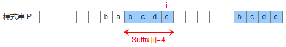

	```
	void suffixes(char *x, int m, int *suff)
	{
	　　   suff[m-1]=m;
		　 for (i=m-2；i>=0；--i){
		        q = 0;
		        while(q <= i && x[i - q] == x[m-1-q])
		            ++q;
		        
		      suff[i] = q;
		   }
	}
	
	```
	
- 好后缀数组

    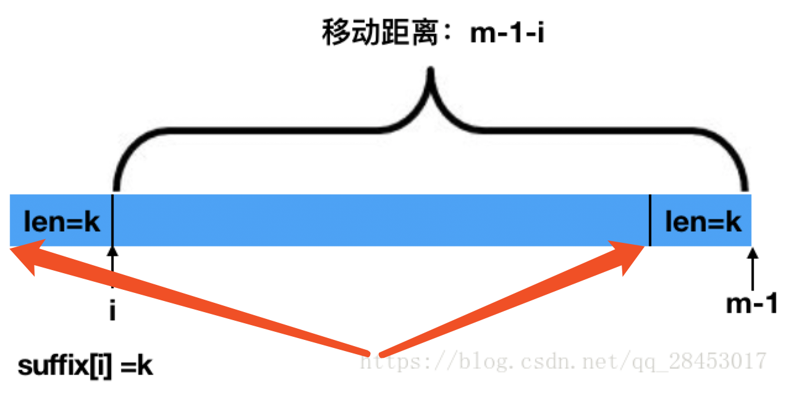

    ```
   void preBmGs(char *x, int m, int bmGs[]) {
	   int i, j, suff[XSIZE];
	   
	   suffixes(x, m, suff);
	   
	   for (i = 0; i < m; ++i)
	      bmGs[i] = m;
	   
	   j = 0;
	   for (i = m - 1; i >= 0; --i)
	      if (suff[i] == i + 1)
	         for (; j < m - 1 - i; ++j)
	            if (bmGs[j] == m)
	               bmGs[j] = m - 1 - i;
	   
	   for (i = 0; i <= m - 2; ++i)
	      bmGs[m - 1 - suff[i]] = m - 1 - i;
   }
    
    ```
    
    >
    代码4-5行对应了第三种情况，7-11行对于第二种情况，12-13对应第三种情况。
    
    >
    第三种情况比较简单直接赋值m，这里就不多提了。
    
    >
    第二种情况有点意思，咱们细细的来品味一下。
    
    >
    > - 为什么从后往前，也就是i从大到小？
    
    >　原因在于如果i,j(i>j)位置同时满足第二种情况，那么m-1-i<m-1-j，而第十行代码保证了每个位置最多只能被修改一次，故而应该赋值为m-1-i，这也说明了为什么要　　　　　从后往前计算。
    
    > -  第8行代码的意思是找到了合适的位置，为什么这么说呢？
    
    > 因为根据suff的定义，我们知道
    
    > x[i+1-suff[i]…i]＝＝x[m-1-siff[i]…m-1],而suff[i]==i+1，我们知道x[i+1-suff[i]…i]=x[0,i],也就是前缀，满足第二种情况。
    
    > - 第9-11行就是在对满足第二种情况下的赋值了。第十行确保了每个位置最多只能被修改一次。
    
    > 第12-13行就是处理第一种情况了。为什么顺序从前到后呢，也就是i从小到大？
    
    > 原因在于如果suff[i]==suff[j]，i<j，那么m-1-i>m-1-j,我们应该取后者作为bmGs[m - 1 - suff[i]]的值。
    
- BM 算法

    ```
    void BM(char *x, int m, char *y, int n) {
	   int i, j, bmGs[XSIZE], bmBc[ASIZE];
	 
	   /* Preprocessing */
	   preBmGs(x, m, bmGs);
	   preBmBc(x, m, bmBc);
	 
	   /* Searching */
	   j = 0;
	   while (j <= n - m) {
	      for (i = m - 1; i >= 0 && x[i] == y[i + j]; --i);
	      if (i < 0) {
	         OUTPUT(j);
	         j += bmGs[0];
	      }
	      else
	         j += MAX(bmGs[i], bmBc[y[i + j]] - m + 1 + i);
	   }
	}
    
    ```
    
## 霍夫曼编码

### 霍夫曼编码构建图例

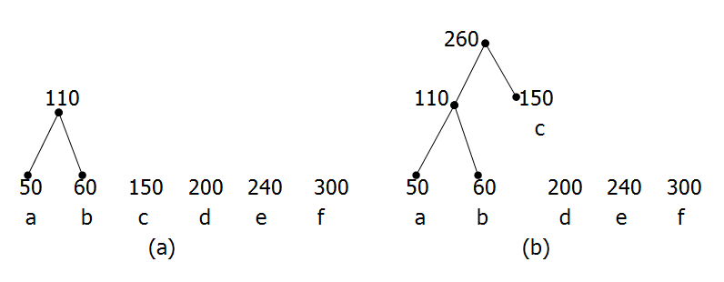

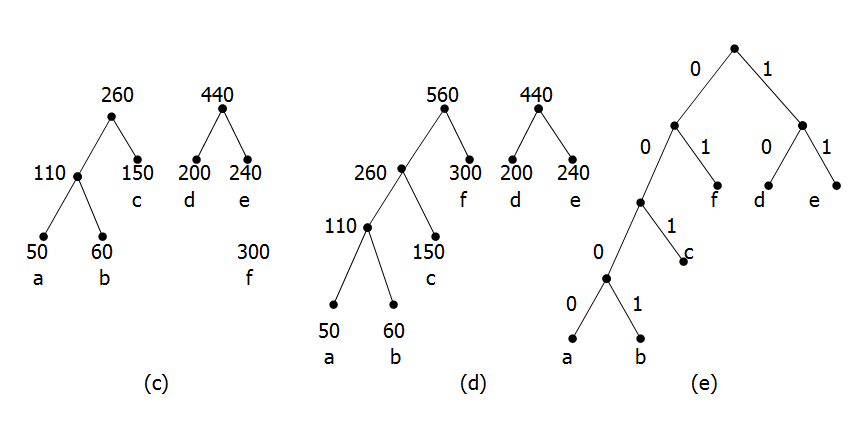

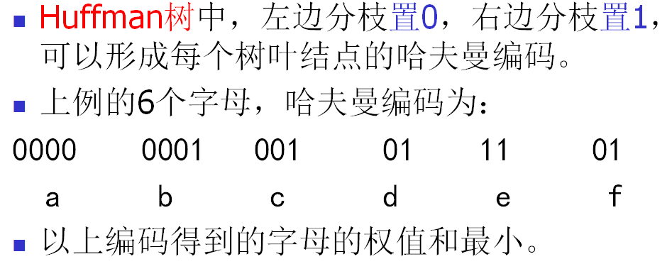

### 代码示例

```
#include<iostream>
#include<string>
using namespace std;

//结点类型
struct element
{
    double weight;    //字符出现的概率为实数
    char ch;
    int lchild, rchild, parent;
};
·

//在HuffTer中找权值最小的两个结点i1和i2
void Select(element huffTree[], int *a, int *b, int n)
{
    int i;
    double weight = 0;
    for(i = 0; i <n; i++)
    {
        if(huffTree[i].parent != - 1)        //如果有父结点的，不进行判断
            continue;
        else
        {
            if(weight == 0)
            {
                weight = huffTree[i].weight;
                *a = i;
            }
            else
            {
                if(huffTree[i].weight < weight)
                {
                    weight = huffTree[i].weight;
                    *a = i;
                }
            }
        }
    }
    weight = 0;
    for(i = 0; i < n; i++)
    {
        if(huffTree[i].parent != -1 || (i == *a))
            continue;
        else
        {
            if(weight == 0)
            {
                weight = huffTree[i].weight;
                *b = i;
            }
            else
            {
                if(huffTree[i].weight  < weight)
                {
                    weight = huffTree[i].weight;
                    *b = i;
                }
            }
        }
    }
    int temp;
    if(huffTree[*a].lchild < huffTree[*b].lchild)        //避免根结点的左右子树混淆
    {
        temp = *a;
        *a = *b;
        *b = temp;
    }
}


//建立霍夫曼树
void HuffmanTree(element huffTree[], int w[], char ch[], int n)
{
    for(int i = 0; i < 2 * n - 1;i++) //霍夫曼树共有2*n - 1个结点
    {
        huffTree[i].parent = -1;    //双亲结点
        huffTree[i].lchild = -1;    //左孩子结点
        huffTree[i].rchild = -1;    //右孩子结点
    }
    for(int i = 0; i < n; i++)        //构造n棵只含有根结点的二叉树
    {
        huffTree[i].weight = w[i];    //给哈夫曼树赋权值
        huffTree[i].ch = ch[i];        //需要编码的字符
    }
    for(int k = n; k < 2 * n - 1; k++)//n-1次合并
    {
        int i1 = 0;
        int i2 = 0;
        Select(huffTree,&i1,&i2,k);    //在HuffTer中找权值最小的两个结点i1和i2
        huffTree[i1].parent = k;    //将i1和i2合并，则i1和i2的双亲是k
        huffTree[i2].parent = k;
        huffTree[k].weight = huffTree[i1].weight + huffTree[i2].weight;
        huffTree[k].lchild = i1;
        huffTree[k].rchild = i2;
    }
}

//霍夫曼编码
void HuffmanCode(element huffTree[], int n)
{
    int i, j,k;
    string s = "";
    for(i = 0; i < n; i++)    //在数组HuffTree中前n个元素是叶子结点，需要编码
    {
        s = "";            //编码s初始化为空串
        j = i;                    //暂存i，不破坏循环变量
        while(huffTree[j].parent != -1)    //结点j存在双亲
        {
            k = huffTree[j].parent;
            if(j == huffTree[k].lchild)    //结点j是其双亲的左孩子
            {
                s = s + "0";
            }
            else                //结点j是其双亲的右孩子
            {
                s = s + "1";
            }
            j = huffTree[j].parent;    //将结点j的双亲赋给j
        }
        cout<<"字符"<<huffTree[i].ch<<"的编码："<<endl;
        for(int i =s.size() - 1; i >= 0; i--)    //将s作为结点i的编码逆序输出
        {
            cout<<s.at(i)<<" ";
        }
        cout<<endl;
    }
}


```

## 后缀树

### 从 trie 树到后缀树

在接触后缀树之前先简单聊聊trie树，也就是字典树。trie 树有三个性质：

- 根节点不包含字符，除根节点外每一个节点都只包含一个字符。
- 从根节点到某一节点，路径上经过的字符连接起来，为该节点对应的字符串。
- 每个节点的所有子节点包含的字符都不相同。

将一系列字符串插入到trie树的过程可以这样来实现：首先，树根不存任何字符；对于每个字符串，从左到右，沿着树从根节点开始往下走直到找不到“路”可以走的时候，“自己开辟一条路”继续往下走。比如往trie树里面存放ana是个字符串的时候（注意一下，$是用来标志字符串末尾），我们会的到这样一棵树：见下左图:

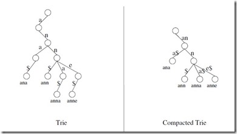

上左图这样存储的时候有点浪费。为了更高效我们把没有分支的路径压缩，于是得到上右图

我们再来看一看后缀，直接列出一个字符串MISSISSIPPI的所有后缀:

```
1. MISSISSIPPI 
2.   ISSISSIPPI 
3.    SSISSIPPI 
4.      SISSIPPI 
5.        ISSIPPI 
6.         SSIPPI 
7.           SIPPI 
8.             IPPI 
9.              PPI 
10.              PI 
11.               I

```

而将这些后缀全部插入前面提到的trie树中并压缩，就得到后缀树:

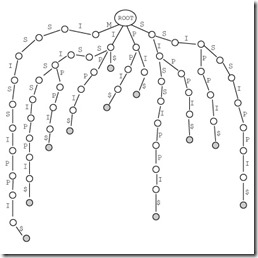 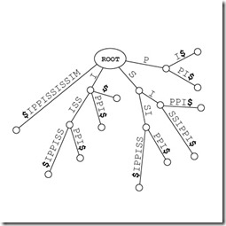

### 后缀树的构建

构造BANANAS的后缀树:

- 首先在根节点上插入B

    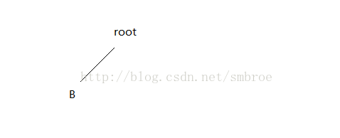


- 在现有的所有节点上插入A，对于叶结点我们直接进行压缩（即不产生新的子节点），对非叶节点生成新的叶结点


    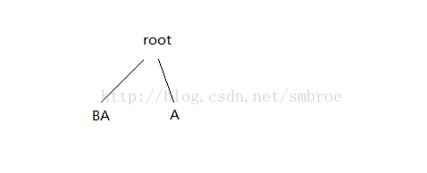

- 插入N，同上一步没什么区别

    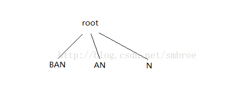


- 插入A，在与现有的后缀子串比较时我们发现已经存在AN中包含A，所以将AN打开

    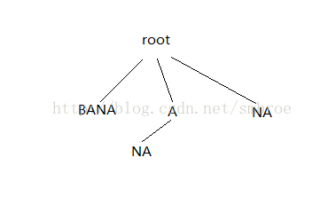


- 插入N，将N插入到A节点时，我们发现形成的新的后缀子串中ANA中存在AN，所以将NA打开，并将AN合并；再插入到根节点时，我们发现NA中包含N所以将NA打开

    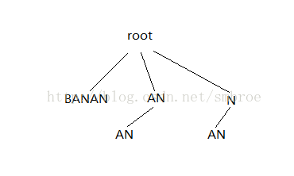

- 插入A：在向根节点插入时，我们发现节点AN中包含A，所以将A打开，形成下图


    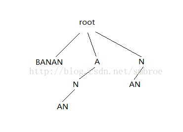
    
    接下来向N（A的子节点）节点插入时，发现NAN中包含NA，所以将AN打开，并将NA压缩；向N（root的子节点）插入A时与刚才的情况相同，所以形成下图
    
    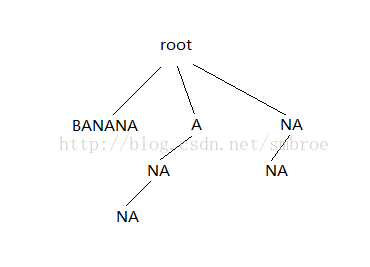
    
    
- 接下来插入S，均不含重复子串

    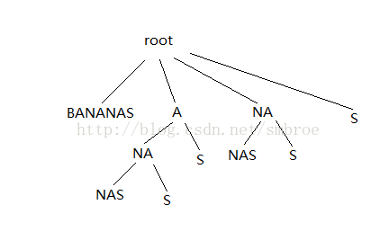
    


### 后缀树的用途

- 查找字符串 O 是否被包含在字符串S中：

    以字符串S构造后缀树，按照字典树的搜索方法去搜索字符串 O

- 求指定字符串 T 在字符串 S 中的重复次数：

    方案：用S+’$'构造后缀树，搜索T节点下的叶节点数目即为重复次数 
    原理：如果T在S中重复了两次，则S应有两个后缀以T为前缀，重复次数就自然统计出来了

- 求字符串S中的最长重复子串

    方案：原理同2，具体做法就是找到最深的非叶节点。 
    这个深是指从root所经历过的字符个数，最深非叶节点所经历的字符串起来就是最长重复子串。

- 求两个字符串S1和S2的最长公共部分：

    方案：将S1#S2$作为字符串压入后缀树，找到最深的非叶节点，且该节点的叶节点既有#也有$(无#)。