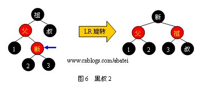

# 经典数据结构——树

## 二叉搜索树

### 查询操作

```
BSTreeNode *BSTreeNodeFindR(BSTreeNode *tree,DataType x) //查找
{
    if (!tree)
        return NULL;

    if (tree->_data > x)
        BSTreeNodeFindR(tree->_left,x);
    else if (tree->_data < x)
        BSTreeNodeFindR(tree->_right,x);
    else
        return tree;
}

```

### 插入操作


```
int BSTreeNodeInsertR(BSTreeNode **tree,DataType x) //搜索树的插入
{
    if(*tree == NULL)
    {
        *tree = BuyTreeNode(x);
        return 0;
    }

    if ((*tree)->_data > x)
        return BSTreeNodeInsertR(&(*tree)->_left,x);
    else if ((*tree)->_data < x)
        return BSTreeNodeInsertR(&(*tree)->_right,x);
    else
        return -1;
}	

```

### 删除操作

- 若Z没有孩子结点，简单删除；
- 若只有一个孩子结点，将这个结点提升到Z结点；
- 若Z有两个孩子结点，查找Z的后继y，y在Z的右子树并且没有左孩子；
	- 若y是Z的右孩子，直接用y替换z；
	- 否则，先用y的右孩子替换y，再用y替换z；

```
//删除rootnode为根的二叉树的最小值，并且把删除后的树的地址返回
node*removemin(node*rootnode){
    if(rootnode->left==NULL){//遍历到了树中最左边的节点，也就是该树中最小的节点
        node* rightroot=rootnode->right;//把要删除的节点的右子树根节点的地址保存好
        delete rootnode;//需要先记录右子树地址在删除节点，否则先删除节点则丢失了右子树根节点的地址
        count--;
        return rightroot;//把右子树的根地址返回到上一层以供连接使用
    }
    rootnode->left=removemin(rootnode->left);//连接记录好的右子树的根地址，重组为父节点的左子树
    return rootnode;
}

node* remove(node*Node,Key key){
    if(Node==NULL){//如果树为空的话
        return NULL;//返回空值
    }
    else if(Node->key==key){//此时找到了需要被删除的节点
 
        if(Node->left==NULL){//待删除节点的左子树为空的话,右子树为空或者不为空都不影响
            node*rightnode=Node->right;//把右子树的根地址保存下来
            delete Node;//节点此时可以被删除了
            count--;//更新计数器
            return rightnode;//右子树为空的话，返回NULL，不为空的话，返回右子树的根节点
        }
        else if(Node->right==NULL){//此时待删除节点的右子树为空的话,左子树为空或者不为空都不影响
            node*leftnode=Node->left;//记录左子树的根地址，可能为空也可能为一个值，但不影响
            delete Node;//此时可以删除节点
            count--;//更新计数器
            return leftnode;//左子树为空的话，返回NULL，不为空的话，返回左子树的根节点
        }
        else{//此时待删除节点的左右子树均不为空的话
            //替换节点可以是该节点右子树中的最小值或者左子树的最大值，这里我们选右子树中的最小值作为替换
            node*replacenode=new node(minmum(Node->right)) ;//复制待删除节点右子树的最小节点作为替换节点
            count++;//增加计数器
            replacenode->right=removemin(Node->right);//删除待删节点的右子树的最小值并把新树的根地址再重新赋值给替代
            //节点的右子树
            replacenode->left=Node->left;//替代节点的左子树就是原来节点的左子树
            delete Node;//替代节点的左右子树都已经更新完毕了，可以删除了
            count--;//更新计数器
            return replacenode;//返回替代节点的地址即新树的根节点地址给上一层连接用
        }
    }

}

```


## AVL 平衡树

### 属性

任一节点对应的两棵子树的最大高度差为1

### 左旋与右旋

- 左旋


- 右旋


### AVL 平衡树的旋转

- 左左情况


- 右右情况


- 右左情况


- 左右情况


- 总结


### 代码示例

```
//定义节点
class AvlNode {
   int data;
   AvlNode lchild;//左孩子
   AvlNode rchild;//右孩子
   int height;//记录节点的高度
}

//在这里定义各种操作
public class AVLTree{
   //计算节点的高度
   static int height(AvlNode T) {
       if (T == null) {
           return -1;
       }else{
           return T.height;
       }
   }

   //左左型，右旋操作
   static AvlNode R_Rotate(AvlNode K2) {
       AvlNode K1;

       //进行旋转
       K1 = K2.lchild;
       K2.lchild = K1.rchild;
       K1.rchild = K2;

       //重新计算节点的高度
       K2.height = Math.max(height(K2.lchild), height(K2.rchild)) + 1;
       K1.height = Math.max(height(K1.lchild), height(K1.rchild)) + 1;

       return K1;
   }

   //进行左旋
   static AvlNode L_Rotate(AvlNode K2) {
       AvlNode K1;

       K1 = K2.rchild;
       K2.rchild = K1.lchild;
       K1.lchild = K2;

       //重新计算高度
       K2.height = Math.max(height(K2.lchild), height(K2.rchild)) + 1;
       K1.height = Math.max(height(K1.lchild), height(K1.rchild)) + 1;

       return K1;
   }

   //右-左型，进行右旋，再左旋
   static AvlNode R_L_Rotate(AvlNode K3) {
       //先对其孩子进行左旋
       K3.rchild = R_Rotate(K3.rchild);
       //再进行右旋
       return L_Rotate(K3);
   }

   //左-右型，先进行左旋，再右旋
   static AvlNode L_R_Rotate(AvlNode K3) {
       //先对孩子进行左旋
       K3.lchild = L_Rotate(K3.lchild);
       //在右旋
       return R_Rotate(K3);
   }

   //插入数值操作
   static AvlNode insert(int data, AvlNode T) {
       if (T == null) {
           T = new AvlNode();
           T.data = data;
           T.lchild = T.rchild = null;
       } else if(data < T.data) {
           //向左孩子递归插入
           T.lchild = insert(data, T.lchild);
           //进行调整操作
           //如果左孩子的高度比右孩子大2
           if (height(T.lchild) - height(T.rchild) == 2) {
               //左-左型
               if (data < T.lchild.data) {
                   T = R_Rotate(T);
               } else {
                   //左-右型
                   T = L_R_Rotate(T);
               }
           }
       } else if (data > T.data) {
           T.rchild = insert(data, T.rchild);
           //进行调整
           //右孩子比左孩子高度大2
           if(height(T.rchild) - height(T.lchild) == 2)
               //右-右型
               if (data > T.rchild.data) {
                   T = L_Rotate(T);
               } else {
                   T = R_L_Rotate(T);
               }
       }
       //否则，这个节点已经在书上存在了，我们什么也不做
       
       //重新计算T的高度
       T.height = Math.max(height(T.lchild), height(T.rchild)) + 1;
       return T;
   }
} 


```

## 红黑树

### 属性

- 列表项结点是红色或黑色。
- 根是黑色。
- 所有叶子都是黑色（叶子是NIL结点）。
- 每个红色结点必须有两个黑色的子结点。（从每个叶子到根的所有路径上不能有两个连续的红色结点。）
- 从任一结点到其每个叶子的所有简单路径都包含相同数目的黑色结点。
- 为了便于处理红黑树中的边界情况，使用一个哨兵来代表所有的NIL结点，也就是说所有指向NIL的指针都指向哨兵T.nil


### 插入操作

- 如果新点的父结点为黑色结点，那么插入一个红点将不会影响红黑树的平衡，此时插入操作完成。
- 由于父结点为红色，此时可以判定，祖父结点必定为黑色。
     - 当叔父结点为红色时，无需进行旋转操作，只要将父和叔结点变为黑色，将祖父结点变为红色即可。但由于祖父结点的父结点有可能为红色，从而违反红黑树性质。此时必须将祖父结点作为新的判定点继续向上进行平衡操作。
     - 当叔父结点为黑色时，
           - 插入点是左孩子。需要进行右旋。
           - 插入点是右孩子。需要进行左旋。 转为插入点是左孩子情况

- 黑黑/黑红


- 红红


- 红黑左


- 红黑右



### 删除操作

- 若旧点为红色结点，则它必定是叶子结点，直接删除即可。
- 当旧点为黑色结点，新点为红色结点时，将新点取代旧点位置后，将新点染成黑色即可
- 当旧点和新点都为黑色时（新点为空结点时，亦属于这种情况），
    - 由于兄弟结点为红色，所以父结点必定为黑色，而旧点被删除后，新点取代了它的位置。红兄的情况需要进行左旋，然后将父结点染成红色，兄结点染成黑色。然后重新以新点为判定点进行平衡操作。
    - 兄弟结点为黑色，两个子节点为黑色，将兄弟结点染成红色，将父节点作为判定点进行平衡操作
    - 黑兄红侄
        - 红侄是右结点，进行左旋
        - 右节点是黑色，左结点是红色，进行右旋，变成红侄是有节点情况