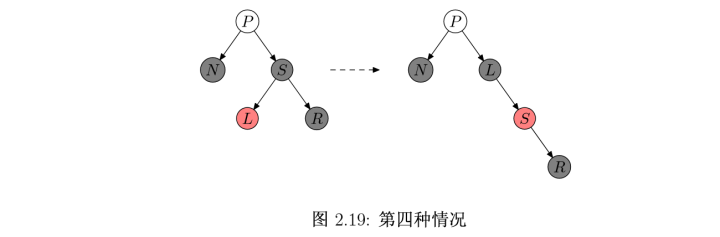
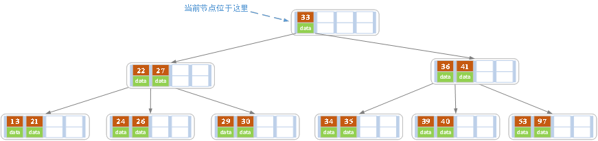
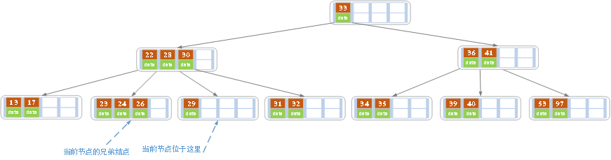
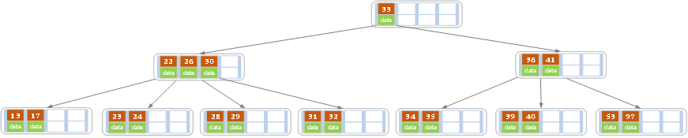
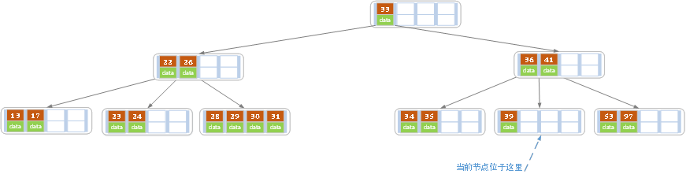
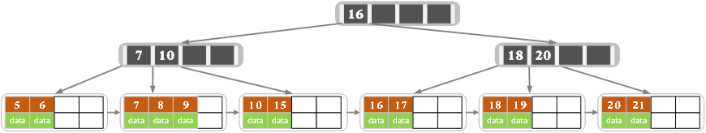

# 经典数据结构——树

[TOC]

## 树的非递归遍历

### 先序遍历

```
#include <iostream>
#include <stack>
using namespace std;

struct TreeNode {
    int val;
    TreeNode *left;
    TreeNode *right;
    TreeNode(int x) : val(x), left(NULL), right(NULL) {}
};

void preOrderTraversal(TreeNode* root) {
    if (!root) return;

    stack<TreeNode*> stk;
    
    // 入栈根节点
    stk.push(root);
    
    while (!stk.empty()) {
        // 弹出栈顶元素并访问
        TreeNode* current = stk.top();
        stk.pop();
        cout << current->val << " ";
        
        // 先右后左入栈
        if (current->right) stk.push(current->right);
        if (current->left) stk.push(current->left);
    }
}

```

### 中序遍历

```
#include <iostream>
#include <stack>
using namespace std;

struct TreeNode {
    int val;
    TreeNode *left;
    TreeNode *right;
    TreeNode(int x) : val(x), left(NULL), right(NULL) {}
};

void inOrderTraversal(TreeNode* root) {
    stack<TreeNode*> stk;
    TreeNode* current = root;

    while (!stk.empty() || current != NULL) {
        // 向左子树深度遍历，直到叶子节点
        while (current != NULL) {
            stk.push(current);
            current = current->left;
        }
        
        // 回溯并访问节点
        current = stk.top();
        stk.pop();
        cout << current->val << " ";
        
        // 转向右子树进行遍历
        current = current->right;
    }
}

```

### 后序遍历

```
#include <iostream>
#include <stack>
using namespace std;

struct TreeNode {
    int val;
    TreeNode *left;
    TreeNode *right;
    TreeNode(int x) : val(x), left(NULL), right(NULL) {}
};

void postOrderTraversal(TreeNode* root) {
    if (!root) return;

    stack<TreeNode*> stk;
    TreeNode* lastVisited = NULL;
    TreeNode* current = root;

    // 入栈根节点
    stk.push(root);
    
    while (!stk.empty()) {
        current = stk.top();
        if ((current->left == NULL && current->right == NULL) ||
            (lastVisited != NULL && (lastVisited == current->left || lastVisited == current->right))) {
            // 访问当前节点
            cout << current->val << " ";
            // 出栈
            stk.pop();
            // 更新访问记录
            lastVisited = current;
        } else {
            // 先入栈右节点再左节点
            if (current->right) stk.push(current->right);
            if (current->left) stk.push(current->left);
        }
    }
}

```

## 二叉搜索树

### 查询操作

```
BSTreeNode *BSTreeNodeFindR(BSTreeNode *tree,DataType x) //查找
{
    if (!tree)
        return NULL;

    if (tree->_data > x)
        BSTreeNodeFindR(tree->_left,x);
    else if (tree->_data < x)
        BSTreeNodeFindR(tree->_right,x);
    else
        return tree;
}

```

### 插入操作


```
int BSTreeNodeInsertR(BSTreeNode **tree,DataType x) //搜索树的插入
{
    if(*tree == NULL)
    {
        *tree = BuyTreeNode(x);
        return 0;
    }

    if ((*tree)->_data > x)
        return BSTreeNodeInsertR(&(*tree)->_left,x);
    else if ((*tree)->_data < x)
        return BSTreeNodeInsertR(&(*tree)->_right,x);
    else
        return -1;
}	

```

### 删除操作

- 若Z没有孩子结点，简单删除；
- 若只有一个孩子结点，将这个结点提升到Z结点；
- 若Z有两个孩子结点，查找Z的后继y，y在Z的右子树并且没有左孩子；
	- 若y是Z的右孩子，直接用y替换z；
	- 否则，先用y的右孩子替换y，再用y替换z；

```
struct TreeNode {
    int val;
    TreeNode *left;
    TreeNode *right;
    TreeNode(int x) : val(x), left(NULL), right(NULL) {}
};

TreeNode* deleteNode(TreeNode* root, int key) {
    if (!root) return NULL;
    
    // 查找需要删除的节点
    if (key < root->val) {
        root->left = deleteNode(root->left, key);
    } else if (key > root->val) {
        root->right = deleteNode(root->right, key);
    } else {
        // 找到需要删除的节点
        if (!root->left) {
            TreeNode* temp = root->right;
            delete root; // 释放内存
            return temp;
        } else if (!root->right) {
            TreeNode* temp = root->left;
            delete root; // 释放内存
            return temp;
        }
        
        // 有两个子节点：用右子树中最小的值（后继节点）来替换当前节点的值
        TreeNode* successor = root->right;
        while (successor->left) {
            successor = successor->left;
        }
        root->val = successor->val;
        
        // 删除后继节点
        root->right = deleteNode(root->right, successor->val);
    }
    

```


## AVL 平衡树

### 属性

任一节点对应的两棵子树的最大高度差为1

### 左旋与右旋

- 左旋


- 右旋


### AVL 平衡树的旋转

- 左左情况


- 右右情况


- 右左情况


- 左右情况


- 总结


### 代码示例

```
//定义节点
class AvlNode {
   int data;
   AvlNode lchild;//左孩子
   AvlNode rchild;//右孩子
   int height;//记录节点的高度
}

//在这里定义各种操作
public class AVLTree{
   //计算节点的高度
   static int height(AvlNode T) {
       if (T == null) {
           return -1;
       }else{
           return T.height;
       }
   }

   //左左型，右旋操作
   static AvlNode R_Rotate(AvlNode K2) {
       AvlNode K1;

       //进行旋转
       K1 = K2.lchild;
       K2.lchild = K1.rchild;
       K1.rchild = K2;

       //重新计算节点的高度
       K2.height = Math.max(height(K2.lchild), height(K2.rchild)) + 1;
       K1.height = Math.max(height(K1.lchild), height(K1.rchild)) + 1;

       return K1;
   }

   //进行左旋
   static AvlNode L_Rotate(AvlNode K2) {
       AvlNode K1;

       K1 = K2.rchild;
       K2.rchild = K1.lchild;
       K1.lchild = K2;

       //重新计算高度
       K2.height = Math.max(height(K2.lchild), height(K2.rchild)) + 1;
       K1.height = Math.max(height(K1.lchild), height(K1.rchild)) + 1;

       return K1;
   }

   //右-左型，进行右旋，再左旋
   static AvlNode R_L_Rotate(AvlNode K3) {
       //先对其孩子进行左旋
       K3.rchild = R_Rotate(K3.rchild);
       //再进行右旋
       return L_Rotate(K3);
   }

   //左-右型，先进行左旋，再右旋
   static AvlNode L_R_Rotate(AvlNode K3) {
       //先对孩子进行左旋
       K3.lchild = L_Rotate(K3.lchild);
       //在右旋
       return R_Rotate(K3);
   }

   //插入数值操作
   static AvlNode insert(int data, AvlNode T) {
       if (T == null) {
           T = new AvlNode();
           T.data = data;
           T.lchild = T.rchild = null;
       } else if(data < T.data) {
           //向左孩子递归插入
           T.lchild = insert(data, T.lchild);
           //进行调整操作
           //如果左孩子的高度比右孩子大2
           if (height(T.lchild) - height(T.rchild) == 2) {
               //左-左型
               if (data < T.lchild.data) {
                   T = R_Rotate(T);
               } else {
                   //左-右型
                   T = L_R_Rotate(T);
               }
           }
       } else if (data > T.data) {
           T.rchild = insert(data, T.rchild);
           //进行调整
           //右孩子比左孩子高度大2
           if(height(T.rchild) - height(T.lchild) == 2)
               //右-右型
               if (data > T.rchild.data) {
                   T = L_Rotate(T);
               } else {
                   T = R_L_Rotate(T);
               }
       }
       //否则，这个节点已经在书上存在了，我们什么也不做
       
       //重新计算T的高度
       T.height = Math.max(height(T.lchild), height(T.rchild)) + 1;
       return T;
   }
} 


```

## 红黑树

### 属性

- 列表项结点是红色或黑色。
- 根是黑色。
- 所有叶子都是黑色（叶子是NIL结点）。
- 每个红色结点必须有两个黑色的子结点。（从每个叶子到根的所有路径上不能有两个连续的红色结点。）
- 从任一结点到其每个叶子的所有简单路径都包含相同数目的黑色结点。
- 为了便于处理红黑树中的边界情况，使用一个哨兵来代表所有的NIL结点，也就是说所有指向NIL的指针都指向哨兵T.nil


### 插入操作

- 如果新点的父结点为黑色结点，那么插入一个红点将不会影响红黑树的平衡，此时插入操作完成。
- 由于父结点为红色，此时可以判定，祖父结点必定为黑色。
     - 当叔父结点为红色时，无需进行旋转操作，只要将父和叔结点变为黑色，将祖父结点变为红色即可。但由于祖父结点的父结点有可能为红色，从而违反红黑树性质。此时必须将祖父结点作为新的判定点继续向上进行平衡操作。
     - 当叔父结点为黑色时，
           - 插入点是左孩子。需要进行右旋。
           - 插入点是右孩子。需要进行左旋。 转为插入点是左孩子情况

### 趣说插入

- 要存粮食，先从地窖里面拿出来(红黑右)
- 将粮食存到叔叔那边去，黑的粮食变成红的仓储(红黑左)
- 叔叔那里已经满了，向上边存粮(红红)

### 图片示例插入操作

- 黑黑/黑红: 

    N 的父节点是黑色，这种情况下，性质4（每个红色节点必须有两个黑色的子节点）和性质5没有受到影响，不需要调整。


- 红红(需变色):

    N 的父节点是红色（节点 P 为红色，其父节点必然为黑色），叔叔节点 U 也是红色。由于 P 和 N 均为红色，所有性质4被打破，此时需要进行调整。这种情况下，先将 P 和 U 的颜色染成黑色，再将 G 的颜色染成红色。此时经过 G 的路径上的黑色节点数量不变，性质5仍然满足。但需要注意的是 G 被染成红色后，可能会和它的父节点形成连续的红色节点，此时需要递归向上调整。


- 红黑右：

    N 的父节点为红色，叔叔节点为黑色。节点 N 是 P 的右孩子，且节点 P 是 G 的左孩子。此时先对节点 P 进行左旋，调整 N 与 P 的位置。接下来按照情况五进行处理，以恢复性质4。
    

    
    
    
   这里需要特别说明一下，上图中的节点 N 并非是新插入的节点。当 P 为红色时，P 有两个孩子节点，且孩子节点均为黑色，这样从 G 出发到各叶子节点路径上的黑色节点数量才能保持一致。既然 P 已经有两个孩子了，所以 N 不是新插入的节点。情况四是由以 N 为根节点的子树中插入了新节点，经过调整后，导致 N 被变为红色，进而导致了情况四的出现。
    


- 红黑左(需变色)：

    N 的父节点为红色，叔叔节点为黑色。N 是 P 的左孩子，且节点 P 是 G 的左孩子。此时对 G 进行右旋，调整 P 和 G 的位置，并互换颜色。经过这样的调整后，性质4被恢复，同时也未破坏性质5。


### 删除操作

- 若旧点为红色结点，则它必定是叶子结点，直接删除即可。
- 当旧点为黑色结点，新点为红色结点时，将新点取代旧点位置后，将新点染成黑色即可
- 当旧点和新点都为黑色时（新点为空结点时，亦属于这种情况），
	 - 兄弟结点为黑色，父亲节点为红色，只需要调换父亲节点和兄弟节点颜色即可。
	 - 兄弟结点为黑色，父亲节点为黑色，两个子节点为黑色，将兄弟结点染成红色，将父节点作为判定点进行平衡操作
	 - 有红色，哪里是红色，转哪里。
    	- 由于兄弟结点为红色，所以父结点必定为黑色，而旧点被删除后，新点取代了它的位置。红兄的情况需要进行左旋，然后将父结点染成红色，兄结点染成黑色。然后重新以新点为判定点进行平衡操作。
    	- 黑兄红侄，红侄是右结点，进行左旋。
      - 黑兄红侄，右节点是黑色，左结点是红色，进行右旋，变成红侄是有节点情况


### 趣说删除

- 还有余粮，不过得先从地窖里去拿(兄左红)
- 还有余粮，红的储藏变成黑的粮食，你们省点用(兄右红)
- 地主家没有余粮，咱们先动一动看看有没有转机(兄红)
- 地主家也没余粮了，只能拆东墙补西墙(兄全黑1)
- 地主家实在没有余粮了，大家一起挨饿，向官府求粮吧(兄全黑2)

### 图片示例删除操作

- 旧红


- 新红


- 兄全黑1

    P为红色，S和S的两个孩子都是黑色的。将P置为黑色，S置为红色。这样，不经过 N 的路径上的黑色结点数目并没有发生变化，而经过N结点的路径上黑色结点的数目增加了1，刚好添补了这条路径上删除的黑色结点。所以红黑树又重新达到了平衡。

    

    > 地主家也没余粮了，只能拆东墙补西墙
   
- 兄全黑2(P 重新判定)

    P、S和S的儿子都是黑色的。在这种情况下，我们简单的重绘S为红色。
    
    结果是通过S的所有路径，它们就是以前不通过N的那些路径，都少了一个黑色节点。 因为删除N的初始的父亲使通过N的所有路径少了一个黑色节点，这使事情都平衡了起来。 
    
    但是，通过P的所有路径现在比不通过P的路径少了一个黑色节点，所以仍然违反属性3。要修正这个问题，我们要从情况一开始，在P上做重新平衡处理。

    
    
    > 地主家实在没有余粮了，大家一起挨饿，向官府求粮吧

- 兄红(变色、N 判定)

    在这种情况下我们在 P 上做左旋转，把红色兄弟转换成N的祖父。我们接着对调N的父亲和祖父的颜色。
    
    尽管所有的路径仍然有相同数目的黑色节点，现在N有了一个黑色的兄弟和一个红色的父亲，所以我们可以接下去按兄全黑、兄左红、兄右红来继续判定。N 它的新兄弟 L 是黑色，因为它未旋转前是红色S的一个儿子。

    
    
    > 地主家没有余粮，咱们先动一动看看有没有转机

- 兄右红(变色，完成)

    - S是黑色，R 是红色，L 是任意颜色，而 N 是它父亲的左儿子。在这种情况下我们在N的父亲上做左旋转，这样S成为N的父亲和S的右儿子的父亲。我们接着交换N的父亲和S的颜色，并使S的右儿子为黑色。子树在它的根上的仍是同样的颜色，所以属性3 没有被违反。但是，N现在增加了一个黑色祖先: 要么N的父亲变成黑色，要么它是黑色而S被增加为一个黑色祖父。所以，通过N的路径都增加了一个黑色节点。此时，如果一个路径不 通过N，则有两种可能性:
        - 它通过N 的新兄弟。那么它以前和现在都必定通过S 和N 的父亲，而它们只是交换了颜色。所以路径保持了同样数目的黑色节点。
        - 它通过N 的新叔父，S 的右儿子。那么它以前通过S、S 的父亲和S的右儿子，但是现在只通过S，它被假定为它以前的父亲的颜色，和 S 的右儿子，它被从红色改变为黑色。合成效果是这个路径通过了同样数目的黑色节点。

    
    
    > 还有余粮，你们省点用

- 兄左红(变色，N 判定)

    S是黑色，L 是红色, R 是黑色，而N是它父亲的左儿子。在 这种情况下我们在S上做右旋转，这样S的左儿子成为S的父亲和N的新兄弟。我们接着交换S和它的新父亲的颜色。所有路径仍有同样数目的黑色节点，但是现在N有了一个右儿子是红色的黑色兄弟，所以我们进入了兄右红的情况。N和它的父亲都不受这个变换的影响

    
    
    > 还有余粮，不过得先从地窖里去拿
    
### 总结

 


## B/B- 树

### 属性

B树也称B-树,它是一颗多路平衡查找树。我们描述一颗B树时需要指定它的阶数，阶数表示了一个结点最多有多少个孩子结点，一般用字母 m 表示阶数。当 m 取2时，就是我们常见的二叉搜索树。

一颗m阶的B树定义如下：

- 每个结点最多有 m 个子树，也就是 m-1 个关键字。
- 根结点最少可以只有 1 个关键字。
- 非根结点至少有 Math.ceil(m/2)-1 个关键字。
- 每个结点中的关键字都按照从小到大的顺序排列，每个关键字的左子树中的所有关键字都小于它，而右子树中的所有关键字都大于它。
- 所有叶子结点都位于同一层，或者说根结点到每个叶子结点的长度都相同。

### 插入操作

   
插入操作是指插入一条记录，即（key, value）的键值对。如果B树中已存在需要插入的键值对，则用需要插入的value替换旧的value。若B树不存在这个key,则一定是在叶子结点中进行插入操作。

- 根据要插入的key的值，找到叶子结点并插入。
- 判断当前结点key的个数是否小于等于m-1，若满足则结束，否则进行第3步。
- 以结点中间的key为中心分裂成左右两部分，然后将这个中间的key插入到父结点中，这个key的左子树指向分裂后的左半部分，这个key的右子支指向分裂后的右半部分，然后将当前结点指向父结点，继续进行第3步。

### 插入图片示例

- 在空树中插入39

    
    
- 继续插入22，97和41

    

- 继续插入53

    
    
    插入后超过了最大允许的关键字个数4，所以以key值为41为中心进行分裂，结果如下图所示，分裂后当前结点指针指向父结点，满足B树条件，插入操作结束。当阶数m为偶数时，需要分裂时就不存在排序恰好在中间的key，那么我们选择中间位置的前一个key或中间位置的后一个key为中心进行分裂即可。
    
    

- 依次插入13，21，40，同样会造成分裂，结果如下图所示。

    

- 依次插入30，27, 33 ；36，35，34 ；24，29，结果如下图所示。

    
    
- 插入key值为26的记录，插入后的结果如下图所示。

    

    当前结点需要以27为中心分裂，并向父结点进位27，然后当前结点指向父结点，结果如下图所示。
    
    
    
    进位后导致当前结点（即根结点）也需要分裂，分裂的结果如下图所示。
    
    
    
- 最后再依次插入key为17,28,29,31,32的记录，结果如下图所示。

    


### b 树的删除

删除操作是指，根据key删除记录，如果B树中的记录中不存对应key的记录，则删除失败。

- 如果当前需要删除的key位于非叶子结点上，则用后继key（这里的后继key均指后继记录的意思）覆盖要删除的key，然后在后继key所在的子支中删除该后继key。此时后继key一定位于叶子结点上，这个过程和二叉搜索树删除结点的方式类似。删除这个记录后执行第2步
- 该结点key个数大于等于Math.ceil(m/2)-1，结束删除操作，否则执行第3步。
- 如果兄弟结点key个数大于Math.ceil(m/2)-1，则父结点中的key下移到该结点，兄弟结点中的一个key上移，删除操作结束。
- 否则，将父结点中的key下移与当前结点及它的兄弟结点中的key合并，形成一个新的结点。原父结点中的key的两个孩子指针就变成了一个孩子指针，指向这个新结点。然后当前结点的指针指向父结点，重复上第2步。


### b 树删除图片示例

- 原始状态

  
  
- 在上面的B树中删除21，删除后结点中的关键字个数仍然大于等2，所以删除结束。

  
  
- 在上述情况下接着删除27。从上图可知27位于非叶子结点中，所以用27的后继替换它。从图中可以看出，27的后继为28，我们用28替换27，然后在28（原27）的右孩子结点中删除28。删除后的结果如下图所示。
  
  
  
  删除后发现，当前叶子结点的记录的个数小于2，而它的兄弟结点中有3个记录（当前结点还有一个右兄弟，选择右兄弟就会出现合并结点的情况，不论选哪一个都行，只是最后B树的形态会不一样而已），我们可以从兄弟结点中借取一个key。所以父结点中的28下移，兄弟结点中的26上移,删除结束。结果如下图所示。
  
  
  
- 在上述情况下接着32，结果如下图。
  
  
  
  当删除后，当前结点中只key，而兄弟结点中也仅有2个key。所以只能让父结点中的30下移和这个两个孩子结点中的key合并，成为一个新的结点，当前结点的指针指向父结点。结果如下图所示。
  
  
  
- 上述情况下，我们接着删除key为40的记录，删除后结果如下图所示。
  
  
  
  同理，当前结点的记录数小于2，兄弟结点中没有多余key，所以父结点中的key下移，和兄弟（这里我们选择左兄弟，选择右兄弟也可以）结点合并，合并后的指向当前结点的指针就指向了父结点。
  
  
  
  同理，对于当前结点而言只能继续合并了，最后结果如下所示。
  
  
  
  合并后结点当前结点满足条件，删除结束。
  

## B+ 树

### 属性

- B+树包含2种类型的结点：内部结点（也称索引结点）和叶子结点。根结点本身即可以是内部结点，也可以是叶子结点。根结点的关键字个数最少可以只有1个。
- B+树与B树最大的不同是内部结点不保存数据，只用于索引，所有数据（或者说记录）都保存在叶子结点中。
- m阶B+树表示了内部结点最多有m-1个关键字（或者说内部结点最多有m个子树），阶数m同时限制了叶子结点最多存储m-1个记录。
- 内部结点中的key都按照从小到大的顺序排列，对于内部结点中的一个key，左树中的所有key都小于它，右子树中的key都大于等于它。叶子结点中的记录也按照key的大小排列。
- 每个叶子结点都存有相邻叶子结点的指针，叶子结点本身依关键字的大小自小而大顺序链接。


### 插入操作

- 针对叶子类型结点：根据key值找到叶子结点，向这个叶子结点插入记录。插入后，若当前结点key的个数小于等于m-1，则插入结束。
- 否则将这个叶子结点分裂成左右两个叶子结点，左叶子结点包含前m/2个记录，右结点包含剩下的记录，将第m/2+1个记录的key进位到父结点中（父结点一定是索引类型结点），进位到父结点的key左孩子指针向左结点,右孩子指针向右结点。将当前结点的指针指向父结点，然后执行第3步。
- 针对索引类型结点：若当前结点key的个数小于等于m-1，则插入结束。
- 否则，将这个索引类型结点分裂成两个索引结点，左索引结点包含前(m-1)/2个key，右结点包含m-(m-1)/2个key，将第m/2个key进位到父结点中，进位到父结点的key左孩子指向左结点, 进位到父结点的key右孩子指向右结点。将当前结点的指针指向父结点，然后重复第3步。


### 插入操作图片示例

- 空树中插入5

  

- 依次插入8，10，15

  

- 插入16

  

    插入16后超过了关键字的个数限制，所以要进行分裂。在叶子结点分裂时，分裂出来的左结点2个记录，右边3个记录，中间key成为索引结点中的key，分裂后当前结点指向了父结点（根结点）。结果如下图所示。

  

    当然我们还有另一种分裂方式，给左结点3个记录，右结点2个记录，此时索引结点中的key就变为15。

- 插入17

  

- 插入18，插入后如下图所示

  
  
    当前结点的关键字个数大于5，进行分裂。分裂成两个结点，左结点2个记录，右结点3个记录，关键字16进位到父结点（索引类型）中，将当前结点的指针指向父结点。

  

    当前结点的关键字个数满足条件，插入结束。
    
- 插入若干数据后

  

- 在上图中插入7，结果如下图所示

  

    当前结点的关键字个数超过4，需要分裂。左结点2个记录，右结点3个记录。分裂后关键字7进入到父结点中，将当前结点的指针指向父结点，结果如下图所示。

  

    当前结点的关键字个数超过4，需要继续分裂。左结点2个关键字，右结点2个关键字，关键字16进入到父结点中，将当前结点指向父结点，结果如下图所示。

  

    当前结点的关键字个数满足条件，插入结束。


### 删除操作

- 删除叶子结点中对应的key。删除后若结点的key的个数大于等于Math.ceil(m-1)/2 – 1，删除操作结束,否则执行第2步。
- 若兄弟结点key有富余（大于Math.ceil(m-1)/2 – 1），向兄弟结点借一个记录，同时用借到的key替换父结（指当前结点和兄弟结点共同的父结点）点中的key，删除结束。否则执行第3步。
- 若兄弟结点中没有富余的key,则当前结点和兄弟结点合并成一个新的叶子结点，并删除父结点中的key（父结点中的这个key两边的孩子指针就变成了一个指针，正好指向这个新的叶子结点），将当前结点指向父结点（必为索引结点），执行第4步（第4步以后的操作和B树就完全一样了，主要是为了更新索引结点）。
- 若索引结点的key的个数大于等于Math.ceil(m-1)/2 – 1，则删除操作结束。否则执行第5步
- 若兄弟结点有富余，父结点key下移，兄弟结点key上移，删除结束。否则执行第6步
- 当前结点和兄弟结点及父结点下移key合并成一个新的结点。将当前结点指向父结点，重复第4步。

注意，通过B+树的删除操作后，索引结点中存在的key，不一定在叶子结点中存在对应的记录。


### 删除操作图片示例

- 初始状态

  

- 删除22,删除后结果如下图

  

    删除后叶子结点中key的个数大于等于2，删除结束

- 删除15，删除后的结果如下图所示

  

    删除后当前结点只有一个key,不满足条件，而兄弟结点有三个key，可以从兄弟结点借一个关键字为9的记录,同时更新将父结点中的关键字由10也变为9，删除结束。

  

- 删除7，删除后的结果如下图所示

  

    当前结点关键字个数小于2，（左）兄弟结点中的也没有富余的关键字（当前结点还有个右兄弟，不过选择任意一个进行分析就可以了，这里我们选择了左边的），所以当前结点和兄弟结点合并，并删除父结点中的key，当前结点指向父结点。

  

    此时当前结点的关键字个数小于2，兄弟结点的关键字也没有富余，所以父结点中的关键字下移，和两个孩子结点合并，结果如下图所示。

  

 
 
 ## B* 树
 
 是 B+ 树的变体，再B+树的非根和非叶子结点再加入指向兄弟的指针
 
     
    

## R 树
 
- 除非它是根结点之外，所有叶子结点包含有m至M个记录索引（条目）。作为根结点的叶子结点所具有的记录个数可以少于m。通常，m=M/2。
- 对于所有在叶子中存储的记录（条目），I是最小的可以在空间中完全覆盖这些记录所代表的点的矩形（注意：此处所说的“矩形”是可以扩展到高维空间的）。
- 每一个非叶子结点拥有m至M个孩子结点，除非它是根结点。
- 对于在非叶子结点上的每一个条目，i是最小的可以在空间上完全覆盖这些条目所代表的店的矩形（同性质2）。
- 所有叶子结点都位于同一层，因此R树为平衡树。

  
