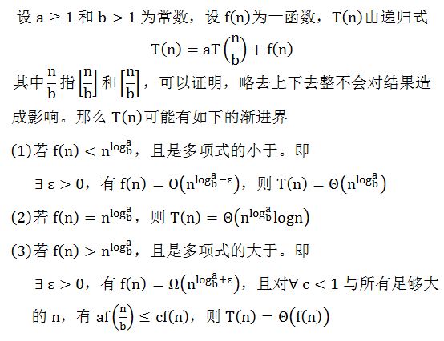

# 经典数据结构——高级数据结构

## 算法复杂度分析

### 主定理



具体样例：


## Segment Tree 线段树

- 概念

    对于每一个子节点而言，都表示整个序列中的一段子区间；对于每个叶子节点而言，都表示序列中的单个元素信息；子节点不断向自己的父亲节点传递信息，而父节点存储的信息则是他的每一个子节点信息的整合。
    
    线段树可以处理很多符合结合律的操作，比如区间max/min、sum、xor。

    
    
- 构建

    线段树是一棵二叉树，他的每个节点包含了两个额外的属性 start 和 end 用于表示该节点所代表的区间。start 和 end 都是整数
    
    给出[3,2,1,4]，线段树将被这样构造
    
    
    
    代码：
    
    ```
    class Solution {
	public:
	    /*
	     * @param A: a list of integer
	     * @return: The root of Segment Tree
	     */
	    SegmentTreeNode * build(vector<int> A) {
	        // write your code here
	        if (A.size() <= 0) {
	            return nullptr;
	        }
	        return build(0, A.size() - 1, A);
	    }
	    SegmentTreeNode * build(int start, int end, vector<int> &nums) {
	        // write your code here
	        if (start > end) {
	            return nullptr;
	        }
	        SegmentTreeNode *root = new SegmentTreeNode(start, end, 0);
	        if (start != end) {
	            root->left = build(start, (start + end) / 2, nums);
	            root->right = build((start + end) / 2 + 1, end, nums);
	            root->max = max(root->left->max, root->right->max);
	        }
	        else {
	            root->max = nums[start];
	        }
	        return root;
	    }
	};
    
    
    ```
    
- 查询

    为SegmentTree设计一个 query 的方法，接受3个参数root, start和end，线段树root所代表的数组中子区间[start, end]内的最大值。
    
    对于数组 [1, 4, 2, 3], 对应的线段树为：
    
    ```
                     [0, 3, max=4]
                 /             \
          [0,1,max=4]        [2,3,max=3]
          /         \        /         \
   [0,0,max=1] [1,1,max=4] [2,2,max=2], [3,3,max=3]
   
    query(root, 1, 1), return 4

	query(root, 1, 2), return 4
	
	query(root, 2, 3), return 3
	
	query(root, 0, 2), return 4
    
    ```
    
    代码：
    
    ```
    class Solution {
	public:
	    /**
	     * @param root: The root of segment tree.
	     * @param start: start value.
	     * @param end: end value.
	     * @return: The maximum number in the interval [start, end]
	     */
	    int query(SegmentTreeNode * root, int start, int end) {
	        // write your code here
	        
	        int mid = root->start + (root->end-root->start) / 2;
	        if (start <= root->start && end >= root->end)
	        {
	            return root->max;
	        }
	        else if (mid < start)
	        {
	            return query(root->right, start, end);
	        }
	        else if (mid + 1 > end) 
	        {
	            return query(root->left, start, end);
	        }
	        else
	        {
	            return max(query(root->left, start, mid), query(root->right, mid + 1, end));
	        }
	    }
	};
    
    
    ```
    
- 更新

    对于一棵 最大线段树, 每个节点包含一个额外的 max 属性，用于存储该节点所代表区间的最大值。

    设计一个 modify 的方法，接受三个参数 root、 index 和 value。该方法将 root 为根的线段树中 [start, end] = [index, index] 的节点修改为了新的 value ，并确保在修改后，线段树的每个节点的 max 属性仍然具有正确的值。

    
	```
	                      [1, 4, max=3]
	                    /                \
	        [1, 2, max=2]                [3, 4, max=3]
	       /              \             /             \
	[1, 1, max=2], [2, 2, max=1], [3, 3, max=0], [4, 4, max=3]
	    
	    
	如果调用 modify(root, 2, 4), 返回:
	    
	                      [1, 4, max=4]
	                    /                \
	        [1, 2, max=4]                [3, 4, max=3]
	       /              \             /             \
	[1, 1, max=2], [2, 2, max=4], [3, 3, max=0], [4, 4, max=3]
	
	
	或 调用 modify(root, 4, 0), 返回:
	
	                      [1, 4, max=2]
	                    /                \
	        [1, 2, max=2]                [3, 4, max=0]
	       /              \             /             \
	[1, 1, max=2], [2, 2, max=1], [3, 3, max=0], [4, 4, max=0]
	    
	```
	
	代码
	
	
	```
	
	class Solution {
	public:
	    /**
	     * @param root: The root of segment tree.
	     * @param index: index.
	     * @param value: value
	     * @return: nothing
	     */
	    void modify(SegmentTreeNode * root, int index, int value) {
	        // write your code here
	        
	        if(!root) return;
	        
	        if(index<root->start || index>root->end) return;
	        
	        if(root->start==root->end && root->end==index) root->max=value;
	        else
	        {
	            modify(root->left,index,value);
	            modify(root->right,index,value);
	            root->max=max(root->left->max,root->right->max);
	        }
	    }
	};
	
	
	```
	
- 区间求和 I 

    给定一个整数数组（下标由 0 到 n-1，其中 n 表示数组的规模），以及一个查询列表。每一个查询列表有两个整数 [start, end] 。 对于每个查询，计算出数组中从下标 start 到 end 之间的数的总和，并返回在结果列表中。
    
    对于数组 [1,2,7,8,5]，查询[(1,2),(0,4),(2,4)], 返回 [9,23,20]
    
    ```
	class SegmentTreeNode33{ 
	public:
	    int start,end; 
	    long long sum; 
	    SegmentTreeNode33* right,*left; 
	    SegmentTreeNode33(int start,int end){ 
	        this->start=start; 
	        this->end=end; 
	        this->sum=0; 
	        this->left=this->right=NULL;
	    } 
	};
	 
	class Solution {
	public:
	    /**
	     * @param A: An integer list
	     * @param queries: An query list
	     * @return: The result list
	     */
	     
	     
	     //线段树构造；
	    SegmentTreeNode33* build(int start,int end,vector<int>& A){
	     
	        //vector<int>& A一定要加引用，否则，每次调用函数都要拷贝容器很耗时！！！
	        if(start>end) 
	            return NULL; 
	        SegmentTreeNode33* root= new SegmentTreeNode33(start,end); 
	        if(start!=end){ 
	            int mid=start+(end-start)/2; 
	            root->left=build(start,mid,A); 
	            root->right=build(mid+1,end,A); 
	            root->sum=root->left->sum+root->right->sum; 
	        }else 
	            root->sum=A[start]; 
	        return root;     
	    }
	    
	    long long query(SegmentTreeNode33* root,int start,int end){ 
	        if(root==NULL||start>end) 
	            return 0; 
	        if(start<=root->start&&end>=root->end) 
	            return root->sum; 
	        int mid=(root->start+root->end)/2; 
	        if(start>mid) 
	            return query(root->right,start,end); 
	        else if(end<mid+1) 
	            return query(root->left,start,end); 
	        else 
	            return query(root->right,mid+1,end)+query(root->left,start,mid);     
	    }
	     
	    vector<long long> intervalSum(vector<int> &A, vector<Interval> &queries) {
	        // write your code here
	        vector<long long> res; 
	        SegmentTreeNode33* root=build(0,A.size()-1,A); 
	        for(Interval q:queries){
	            res.push_back(query(root,q.start,q.end));
	        }
	        return res;      
	        
	    }
	};

    ```
    
-  统计比给定整数小的数的个数

    给定一个整数数组 （下标由 0 到 n-1，其中 n 表示数组的规模，数值范围由 0 到 10000），以及一个 查询列表。对于每一个查询，将会给你一个整数，请你返回该数组中小于给定整数的元素的数量.
    
    对于数组 [1,2,7,8,5] ，查询 [1,8,5]，返回 [0,4,2]
    
    
    ```
    struct SgMtTreeNode {
	    int start, end, count;
	    SgMtTreeNode *left, *right;
	    SgMtTreeNode(int s = 0, int e = 0, int c = 0) : start(s), end(e), count(c) {
	        left = nullptr;
	        right = nullptr;
	    } 
	};
	
	class Solution {
	public:
	    /**
	     * @param A: An integer array
	     * @param queries: The query list
	     * @return: The number of element in the array that are smaller that the given integer
	     */
	    vector<int> countOfSmallerNumber(vector<int> &A, vector<int> &queries) {
	        int n = A.size();
	        int m = queries.size();
	        if (n == 0) return vector<int>(m, 0);
	        vector<int> result;
	        SgMtTreeNode * root = build(0, 10000);
	        for (auto i : A) {
	            insert(root, i);
	        }
	        for (auto i : queries) {
	            result.push_back(query(root, i - 1));   //note: i - 1
	        }
	        return result;
	    }
	    
	private:
	    SgMtTreeNode * build(int start, int end) {
	        if (start > end) return nullptr;
	        SgMtTreeNode * root = new SgMtTreeNode(start, end, 0);
	        if (start == end) {
	            return root;
	        }
	        int mid = start + (end - start) / 2;
	        root->left = build(start, mid);
	        root->right = build(mid + 1, end);
	        return root;
	    }
	    
	    //return the count that is smaller than target
	    int query(SgMtTreeNode * root, int target) {
	        if (!root) return 0;
	        if (root->start > target) return 0;
	        if (root->end <= target) return root->count;
	        
	        return query(root->left, target) + query(root->right, target);
	    }
	    
	    void insert(SgMtTreeNode * root, int value) {
	        if (!root) return;
	        if (root->start == root->end) {
	            root->count++;   //duplicate numbers!!
	            return;
	        }
	        if (root->left && root->left->end >= value) {
	            insert(root->left, value);
	        } else if (root->right && root->right->start <= value) {
	            insert(root->right, value);
	        }
	        root->count++;
	    }
	};
    
    
    ```
    
    
-  218 天际线问题

城市的天际线是从远处观看该城市中所有建筑物形成的轮廓的外部轮廓。现在，假设您获得了城市风光照片（图A）上显示的所有建筑物的位置和高度，请编写一个程序以输出由这些建筑物形成的天际线（图B）。


每个建筑物的几何信息用三元组 [Li，Ri，Hi] 表示，其中 Li 和 Ri 分别是第 i 座建筑物左右边缘的 x 坐标，Hi 是其高度。可以保证 0 ≤ Li, Ri ≤ INT_MAX, 0 < Hi ≤ INT_MAX 和 Ri - Li > 0。您可以假设所有建筑物都是在绝对平坦且高度为 0 的表面上的完美矩形。

例如，图A中所有建筑物的尺寸记录为：[ [2 9 10], [3 7 15], [5 12 12], [15 20 10], [19 24 8] ] 。

输出是以 [ [x1,y1], [x2, y2], [x3, y3], ... ] 格式的“关键点”（图B中的红点）的列表，它们唯一地定义了天际线。关键点是水平线段的左端点。请注意，最右侧建筑物的最后一个关键点仅用于标记天际线的终点，并始终为零高度。此外，任何两个相邻建筑物之间的地面都应被视为天际线轮廓的一部分。

例如，图B中的天际线应该表示为：[ [2 10], [3 15], [7 12], [12 0], [15 10], [20 8], [24, 0] ]。


```
任何输入列表中的建筑物数量保证在 [0, 10000] 范围内。
输入列表已经按左 x 坐标 Li  进行升序排列。
输出列表必须按 x 位排序。
输出天际线中不得有连续的相同高度的水平线。例如 [...[2 3], [4 5], [7 5], [11 5], [12 7]...] 是不正确的答案；三条高度为 5 的线应该在最终输出中合并为一个：[...[2 3], [4 5], [12 7], ...]
```

对于本题来说，最传统的方法是以 0-10000 横坐标范围为基础构建一个线段树，中间非叶子节点没有统计量，叶子节点存放当前横坐标下纵坐标的最大值。遍历题目中的数组，不断更新每个横坐标的纵坐标最大值，其结果只要遍历一遍线段树的叶子节点即可。

本题答案做了一些取巧，最底层叶子节点是一个横坐标范围，只有当更新的时候发现范围过大才会继续更新(否则还不如直接更新 0-10000 数组简单)。这样导致有些非叶子节点也会存在统计量，所以在 query 的时候，返回的结果需要比较父节点和子节点的最大值，这个和传统的线段树是不同的，父节点的统计量最大值无法被直接利用，因为我们要的结果并不是这个范围的最大值，而是这个横坐标上的最大值。

```
class Solution {
public:
    int tree[20000<<2] = {};
    void update(int n, int l, int r, int left, int right, int value) {
        if(l == left && r == right) {
            tree[n] = max(tree[n], value);
        }
        else {
            int m = (l+r)>>1;
            if(right <= m) {
                update(n<<1, l, m, left, right, value);
            }
            else if(left > m) {
                update(n<<1|1, m+1, r, left, right, value);
            }
            else {
                update(n<<1, l, m, left, m, value);
                update(n<<1|1, m+1, r, m+1, right, value);
            }
        }
    }
    int query(int n, int l, int r, int index) {
        if(l == r) {
            return tree[n];
        }
        else {
            int m = (l+r) >> 1;
            int res = (index <= m ? query(n<<1, l, m, index) : query(n<<1|1, m+1, r, index));
            return max(res, tree[n]);
        }
    }
    vector<pair<int, int>> getSkyline(vector<vector<int>>& buildings) {
        unordered_map<int, int> line;
        unordered_map<int, int> rline;
        int n = buildings.size();
        set<int> l;
        int top = -2;
        int pre = -1;
        for(int i = 0; i < n; i++) {
            l.insert(buildings[i][0]);
            l.insert(buildings[i][1]);
        }
        set<int>::iterator it;
        for(it = l.begin(); it != l.end(); it++) {
            if(pre != -1 && *it == pre+1) {
                top++;
            }
            else {
                top+=2;
            }
            line[*it] = top;
            rline[top] = *it;
            pre = *it;
        }
        for(int i = 0; i < n; i++) {
            update(1, 0, top, line[buildings[i][0]], line[buildings[i][1]], buildings[i][2]);
        }
        vector<pair<int, int>> res;
        int ph = 0;
        for(int i = 0; i <= top; i++) {
            int h = query(1, 0, top, i);
            if(h != ph) {
                res.push_back(make_pair(h > ph ? rline[i] : rline[i-1], h));
                ph = h;
            }
        }
        if(n > 0) {
            res.push_back(make_pair((rline[top]), 0));
        }
        return res;
    }
};


```

    
## Binary Indexed Tree BIT 树状数组

### 用途

举例来说，树状数组所能解决的典型问题就是存在一个长度为n的数组，我们如何高效进行如下操作：

- update(idx, delta)：将num加到位置idx的数字上。
- prefixSum(idx)：求从数组第一个位置到第idx（含idx）个位置所有数字的和。
- rangeSum(from_idx, to_idx)：求从数组第from_idx个位置到第to_idx个位置的所有数字的和

对于上述问题，除去每次求和都对原数组相关数字暴力相加求和的解法外，另一种较简单解法为使用O(n)时间构造一个_前缀和数组（cumulative sum）_，即该数组中的第i个位置保存原数组中前i个元素的和。

该简单解法的求和操作非常高效，而单个更新操作为线性时间。如果所需的更新操作的数量远少于求和操作的话，该解法非常合适。反之，如果更新操作较多，我们就需要思考优化的方法。

那么使用树状数组解决该问题的目的就是为了在保证求和操作依然高效的前提下优化update(idx, delta) 操作的时间复杂度。

## 概念

所谓的Binary Indexed Tree，首先需要明确它其实并不是一棵树。Binary Indexed Tree事实上是将根据数字的二进制表示来对数组中的元素进行逻辑上的分层存储。

Binary Indexed Tree求和的基本思想在于，给定需要求和的位置i，例如13，我们可以利用其二进制表示法来进行分段（或者说分层）求和：13 = 2^3 + 2^2 + 2^0，则 prefixSum(13) = RANGE(1, 8) + RANGE(9, 12) + RANGE(13, 13) （注意此处的RANGE(x, y)表示数组中第x个位置到第y个位置的所有数字求和）。

那么如果我们将上述的range sum提前计算好的话，prefixSum(13)可以直接由它们相加得到。那么我们所需要解决的问题就是，根据何种规则来计算和存储这样的二进制表示后所需的range sum呢？规则如下图中所示。


图中第一行为原数组，第二到第四行为依次按层填坑的过程。我们需要从左到右，从上到下依次将相应的值填入对应的位置中。最后一行中即为最终所形成的树状数组。

以图中第二行，也就是构造树状数组第一层的过程为例，我们首先需要填充的是数组中第一个数字开始，长度为__2的指数__个数字的区间内的数字的累加和。所以图中分别填充了从第一个数字开始，长度为2^0, 2^1, 2^2, 2^3的区间的区间和。到此为止这一步就结束了。因为2^4超过了我们原数组的长度范围。

下一步我们构造数组的第二层。与上一层类似，我们依然填充余下的空白中从第空白处一个位置算起长度为__2的指数__的区间的区间和。例如3-3空白，我们只需填充从位置3开始，长度为1的区间的和。再如9-14空白，我们需要填充从9开始，长度为2^0（9-9），2^1（9-10），2^2（9-12）的区间和。

类似地，第三层我们填充7-7，11-11和13-14区间的空白。

到此为止，我们已经完全的构造了对应于输入数组的一个树状数组。将该数组即为BIT（方便起见，此处对此数组的索引为从1开始）

利用图中已构造好的树状数组，则：

```
prefixSum(13) = prefixSum(0b00001101)
= BIT[13] + BIT[12] + BIT[8]
= BIT[0b00001101] + BIT[0b00001100] + BIT[0b00001000]

```


### 利用Binary Indexed Tree求prefix sum或range sum

通过上面的例子我们得知求前缀和的过程事实上是在树状数组所代表的抽象的树形结构中不断移动寻找上一层母结点并求和的过程。上面例子中树状数组所表示的树如下图所示：


那么我们应该如何用代码实现这一向上寻找母结点的过程呢？

观察这个求和的过程：

```
prefixSum(13) = prefixSum(0b00001101)
= BIT[13] + BIT[12] + BIT[8]
= BIT[0b00001101] + BIT[0b00001100] + BIT[0b00001000]

```

可以发现，在这棵抽象的树种向上移动的过程其实就是不断将当前数字的最后一个1翻转为0的过程。基于这一事实，实现在Binary Indexed Tree中向上（在数组中向前）寻找母结点的代码就非常容易了。例如给定一个int x = 13，这个过程可以用如下运算实现：

```
x = 13 = 0b00001101
-x = -13 = 0b11110011
x & (-x) = 0b00000001
x - (x & (-x)) = 0b00001100

```

### 更新数组中的元素

当我们调用update(idx, delta) 更新了原数组中的某一个数字后，显然我们也需要更新Binary Indexed Tree中相应的区间和来应对这一改变。

以update(5, 2)为例，我们想要给原数组中第5个位置的数字加2，基于之前构造好的Binary Indexed Tree，更新的过程如下图中所示：


从图中我们发现，从5开始，应当被更新的位置的坐标为原坐标加上原坐标二进制表示中最后一个1所代表的数字。这一过程和上面求和的过程刚好相反。以int x = 5为例，我们可以用如下运算实现：

```
x = 5 = 0b00000101
-x = -5 = 0b11111011
x & (-x) = 0b00000001
x + (x & (-x)) = 0b00000110

```

### Binary Indexed Tree的建立

Binary Indexed Tree的建立非常简单。我们只需初始化一个全为0的数组，并对原数组中的每一个位置对应的数字调用一次update(i, delta)操作即可。这是一个O(nlogn)的建立过程。

此外，还存在一个O(n)时间简历Binary Indexed Tree的算法，其步骤如下(数组下标从0开始)：

给定一个长度为n的输入数组list。

- 初始化长度为n + 1的Binary Indexed Tree数组bit，并将list中的数字对应地放在bit[1]到bit[n]的各个位置。

- 对于1到n的每一个i，进行如下操作：

    - 令j = i + (i & -i)，若j < n + 1，则bit[j] = bit[j] + bit[i]

```
public class BinaryIndexedTree {
	private int[] bitArr;

	// O(nlogn) initialization
//	public BinaryIndexedTree(int[] list) {
//		this.bitArr = new int[list.length + 1];
//		for (int i = 0; i < list.length; i++) {
//			this.update(i, list[i]);
//		}
//	}
	
	public BinaryIndexedTree(int[] list) {
		// O(n) initialization
		this.bitArr = new int[list.length + 1];
		for (int i = 0; i < list.length; i++) {
			this.bitArr[i + 1] = list[i];
		}
		
		for (int i = 1; i < this.bitArr.length; i++) {
			int j = i + (i & -i);
			if (j < this.bitArr.length) {
				this.bitArr[j] += this.bitArr[i];
			}
		}
	}
	
	/**
	 * Add `delta` to elements in `idx` of original array
	 * @param idx index of the element in original array that is going to be updated
	 * @param delta number that will be added to the original element.
	 */
	public void update(int idx, int delta) {
		idx += 1;
		while (idx < this.bitArr.length) {
			this.bitArr[idx] += delta;
			idx = idx + (idx & -idx);
		}
	}
	
	/**
	 * Get the sum of elements in the original array up to index `idx`
	 * @param idx index of the last element that should be summed. 
	 * @return sum of elements from index 0 to `idx`.
	 */
	public int prefixSum(int idx) {
		idx += 1;
		int result = 0;
		while (idx > 0) {
			result += this.bitArr[idx];
			idx = idx - (idx & -idx);
		}
		
		return result;
	}
	
	/**
	 * Get the range sum of elements from original array from index `from_idx` to `to_idx`
	 * @param from_idx start index of element in original array
	 * @param to_idx end index of element in original array
	 * @return range sum of elements from index `from_idx` to `to_idx`
	 */
	public int rangeSum(int from_idx, int to_idx) {
		return prefixSum(to_idx) - prefixSum(from_idx - 1);
	}
}


```

- 315 计算右侧小于当前元素的个数

给定一个整数数组 nums，按要求返回一个新数组 counts。数组 counts 有该性质： counts[i] 的值是  nums[i] 右侧小于 nums[i] 的元素的数量。

```
输入: [5,2,6,1]
输出: [2,1,1,0] 
解释:
5 的右侧有 2 个更小的元素 (2 和 1).
2 的右侧仅有 1 个更小的元素 (1).
6 的右侧有 1 个更小的元素 (1).
1 的右侧有 0 个更小的元素.

```

此题是动态更新的典型题目，例如当求 `2 的右侧 比 2 更小的元素` 的时候，实际，上可以看做当前树状数组仅仅输入了 [6,1] 两个元素，计算出结果之后，再把 2 这个元素插入的树状数组里面去。


这个树状数组可以数组元素的值作为树状数组的 index，但是数组元素很有可能是负数，或者特别大的数字，因此将数组元素的排序位置作为树状数组的 index 更合适，也更加节省空间。

```
class Solution {
    public List<Integer> countSmaller(int[] nums) {
        // count the freq[rank]
        List<Integer> res = new ArrayList<>();
        if (nums == null || nums.length == 0) {
            return res;
        }
        int[] sorted = nums.clone();
        Arrays.sort(sorted);
        nums = reverse(nums);
        Map<Integer, Integer> map = new HashMap<>();
        // get rank
        for (int i = nums.length - 1; i >= 0; i--) {
            map.put(sorted[i], i);
        }
        int[] bit = new int[nums.length + 1];
        
        for (int i = 0; i < nums.length; i++) {
            int count = getSum(bit, map.get(nums[i]) - 1);
            res.add(0, count);
            update(bit, map.get(nums[i]), 1);
        }
        return res;
    }
    private int getSum(int[] bit, int index) {
        int sum = 0;
        for (int i = index + 1; i > 0; i -= (i & (-i))) {
            sum += bit[i];
        }
        return sum;
    }
    private void update(int[] bit, int index, int diff) {
        for (int i = index + 1; i < bit.length; i += (i & (-i))) {
            bit[i] += diff;
        }
    }
    private int[] reverse(int[] nums) {
        int[] res = new int[nums.length];
        for (int i = 0; i < nums.length; i++) {
            res[nums.length - i - 1] = nums[i];
        }
        return res;
    }
}
```	


## 并查集

### 概念

并查集就是像它名字说的那样， 为了实现快速合并（Union）以及查找 （Find）操作的数据结构。

并查集实现， 就是基于树的组织形式， 把其简化抽象到几乎只剩下 Union 和 Find 两个功能的数据结构。

为了解释并查集的原理，我将举一个更有爱的例子。 话说江湖上散落着各式各样的大侠，有上千个之多。他们没有什么正当职业，整天背着剑在外面走来走去，碰到和自己不是一路人的，就免不了要打一架。但大侠们有一个优点就是讲义气，绝对不打自己的朋友。而且他们信奉“朋友的朋友就是我的朋友”，只要是能通过朋友关系串联起来的，不管拐了多少个弯，都认为是自己人。这样一来，江湖上就形成了一个一个的群落，通过两两之间的朋友关系串联起来。而不在同一个群落的人，无论如何都无法通过朋友关系连起来，于是就可以放心往死了打。但是两个原本互不相识的人，如何判断是否属于一个朋友圈呢？

我们可以在每个朋友圈内推举出一个比较有名望的人，作为该圈子的代表人物，这样，每个圈子就可以这样命名“齐达内朋友之队”“罗纳尔多朋友之队”……两人只要互相对一下自己的队长是不是同一个人，就可以确定敌友关系了。

但是还有问题啊，大侠们只知道自己直接的朋友是谁，很多人压根就不认识队长，要判断自己的队长是谁，只能漫无目的的通过朋友的朋友关系问下去：“你是不是队长？你是不是队长？”这样一来，队长面子上挂不住了，而且效率太低，还有可能陷入无限循环中。于是队长下令，重新组队。队内所有人实行分等级制度，形成树状结构，我队长就是根节点，下面分别是二级队员、三级队员。每个人只要记住自己的上级是谁就行了。遇到判断敌友的时候，只要一层层向上问，直到最高层，就可以在短时间内确定队长是谁了。由于我们关心的只是两个人之间是否连通，至于他们是如何连通的，以及每个圈子内部的结构是怎样的，甚至队长是谁，并不重要。所以我们可以放任队长随意重新组队，只要不搞错敌友关系就好了。于是，门派产生了。


下面我们来看并查集的实现。 int pre[1000]; 这个数组，记录了每个大侠的上级是谁。大侠们从1或者0开始编号（依据题意而定），pre[15]=3就表示15号大侠的上级是3号大侠。如果一个人的上级就是他自己，那说明他就是掌门人了，查找到此为止。也有孤家寡人自成一派的，比如欧阳锋，那么他的上级就是他自己。每个人都只认自己的上级。比如胡青牛同学只知道自己的上级是杨左使。张无忌是谁？不认识！要想知道自己的掌门是谁，只能一级级查上去。 find这个函数就是找掌门用的，意义再清楚不过了（路径压缩算法先不论，后面再说）。

```
int find(int x)                    //查找我（x）的掌门
{
    int r=x;                      //委托 r 去找掌门
    while (pre[r ]!=r)           //如果r的上级不是r自己（也就是说找到的大侠他不是掌门 = =）
    r=pre[r ] ;                 // r 就接着找他的上级，直到找到掌门为止。
    return  r ;                //掌门驾到~~~
}
```

再来看看join函数，就是在两个点之间连一条线，这样一来，原先它们所在的两个板块的所有点就都可以互通了。这在图上很好办，画条线就行了。但我们现在是用并查集来描述武林中的状况的，一共只有一个pre[]数组，该如何实现呢？ 还是举江湖的例子，假设现在武林中的形势如图所示。虚竹小和尚与周芷若MM是我非常喜欢的两个人物，他们的终极boss分别是玄慈方丈和灭绝师太，那明显就是两个阵营了。我不希望他们互相打架，就对他俩说：“你们两位拉拉勾，做好朋友吧。”他们看在我的面子上，同意了。这一同意可非同小可，整个少林和峨眉派的人就不能打架了。这么重大的变化，可如何实现呀，要改动多少地方？其实非常简单，我对玄慈方丈说：“大师，麻烦你把你的上级改为灭绝师太吧。这样一来，两派原先的所有人员的终极boss都是师太，那还打个球啊！反正我们关心的只是连通性，门派内部的结构不要紧的。”玄慈一听肯定火大了：“我靠，凭什么是我变成她手下呀，怎么不反过来？我抗议！”抗议无效，上天安排的，最大。反正谁加入谁效果是一样的，我就随手指定了一个。这段函数的意思很明白了吧？

```

void join(int x,int y)          //我想让虚竹和周芷若做朋友
{
    int fx=find(x),fy=find(y);         //虚竹的老大是玄慈，芷若MM的老大是灭绝
    if(fx!=fy)                         //玄慈和灭绝显然不是同一个人
    pre[fx ]=fy;                       //方丈只好委委屈屈地当了师太的手下啦
}

```

再来看看路径压缩算法。建立门派的过程是用join函数两个人两个人地连接起来的，谁当谁的手下完全随机。最后的树状结构会变成什么胎唇样，我也完全无法预计，一字长蛇阵也有可能。这样查找的效率就会比较低下。最理想的情况就是所有人的直接上级都是掌门，一共就两级结构，只要找一次就找到掌门了。哪怕不能完全做到，也最好尽量接近。这样就产生了路径压缩算法。 设想这样一个场景：两个互不相识的大侠碰面了，想知道能不能揍。 于是赶紧打电话问自己的上级：“你是不是掌门？” 上级说：“我不是呀，我的上级是谁谁谁，你问问他看看。” 一路问下去，原来两人的最终boss都是东厂曹公公。 “哎呀呀，原来是记己人，西礼西礼，在下三营六组白面葫芦娃!” “幸会幸会，在下九营十八组仙子狗尾巴花！” 两人高高兴兴地手拉手喝酒去了。 “等等等等，两位同学请留步，还有事情没完成呢！”我叫住他俩。 “哦，对了，还要做路径压缩。”两人醒悟。 白面葫芦娃打电话给他的上级六组长：“组长啊，我查过了，其习偶们的掌门是曹公公。不如偶们一起及接拜在曹公公手下吧，省得级别太低，以后查找掌门麻环。” “唔，有道理。” 白面葫芦娃接着打电话给刚才拜访过的三营长……仙子狗尾巴花也做了同样的事情。 这样，查询中所有涉及到的人物都聚集在曹公公的直接领导下。每次查询都做了优化处理，所以整个门派树的层数都会维持在比较低的水平上。路径压缩的代码，看得懂很好，看不懂也没关系，直接抄上用就行了。总之它所实现的功能就是这么个意思。


### 并查集的基本实现

```
struct UF {
    UF(int n) {
        nums.resize(n);
        for (int i = 0; i < n; ++i) {
            nums[i] = i;
        }
    }
    bool Union(int a, int b) {
        int ancesterA = Find(a), ancesterB = Find(b);
        if (ancesterA == ancesterB) return false; // need not to union.
        else {
            nums[ancesterB] = ancesterA;
            return true;
        }
    }
    int Find(int k) {
        int i = k;
        while (i != nums[i]) i = nums[i]; //Here i is the root.
        
        while (nums[j] != i) {  // update the whole path to connect to the ancester directly.
            int t = nums[j];
            nums[j] = i;
            j = t;
        }

        return i;
    }
    vector<int> nums;
};

```

### 例题

- 547 Friend Circles 朋友圈

    班上有 N 名学生。其中有些人是朋友，有些则不是。他们的友谊具有是传递性。如果已知 A 是 B 的朋友，B 是 C 的朋友，那么我们可以认为 A 也是 C 的朋友。所谓的朋友圈，是指所有朋友的集合。

    给定一个 N * N 的矩阵 M，表示班级中学生之间的朋友关系。如果M[i][j] = 1，表示已知第 i 个和 j 个学生互为朋友关系，否则为不知道。你必须输出所有学生中的已知的朋友圈总数。


   ```
   输入: 
	[[1,1,0],
	 [1,1,0],
	 [0,0,1]]
	输出: 2 
	说明：已知学生0和学生1互为朋友，他们在一个朋友圈。
	第2个学生自己在一个朋友圈。所以返回2。
   
   ```
   
   
   ```
   //Union Find
	struct UF {
	    UF(int n) {
	        nums.resize(n);
	        for (int i = 0; i < n; ++i) {
	            nums[i] = i;
	        }
	        setNum = n;
	    }
	    bool Union(int a, int b) {
	        int ancesterA = Find(a), ancesterB = Find(b);
	        if (ancesterA == ancesterB) return false; // need not to union.
	        else {
	            nums[ancesterB] = ancesterA;
	            --setNum;
	            return true;
	        }
	    }
	
	    int Find(int k) {
	        int i = k, j = k;
	        while (i != nums[i]) i = nums[i]; //Here i is the ancester.
	        while (nums[j] != i) {  // update the whole path to connect to the ancester 
	            int t = nums[j];
	            nums[j] = i;
	            j = t;
	        }
	        return i;
	    }
	
	    vector<int> nums;
	    int setNum;
	};
	
	
	class Solution {
	public:
	
	    int findCircleNum(vector<vector<int>>& M) {
	        UF uf_set(M.size());
	        for (int i = 0; i < M.size(); ++i) {
	            for (int j = 0; j < M[i].size(); ++j) {
	                if (M[i][j] == 1) uf_set.Union(i, j);
	            }
	        }
	        return uf_set.setNum;
	    }
	};
   
   ```
   
- 737 Sentence Similarity II 

    pairs 中存储了成对的 similar words，similar 关系满足传递性和反向性。对于 words1 和 words2 中的每个相对应的 words，如果根据 pairs 中的关系推断出它们满足 similar（相同则一定similar），则说 words1 和 word2 满足 similar，返回 true，否则返回 false。注意如果 words1 和 words2 长度不同，则直接返回 false。

    ```
    words1 = ["great", "acting", "skills"] and 
    words2 = ["fine", "drama", "talent"] are similar, 
    
    if the similar word pairs are 
    pairs = [["great", "good"], ["fine", "good"], ["acting","drama"], ["skills","talent"]].
    
    ```
    
    ```
    struct UF {
	    UF(int n) {
	        father.resize(n + 1);
	        for (int i = 0; i < father.size(); ++i) {
	            father[i] = i;
	        }
	    }
	    bool Union(int a, int b) {
	        int root1 = Find(a), root2 = Find(b);
	        if (root1 != root2) {
	            father[root2] = root1; //or father[root1] = root2;
	            return true;
	        }
	        return false;
	    }
	    int Find(int k) {
	        int i = k, j = k;
	        while (i != father[i]) i = father[i]; // i is the root of k.
	        //path comdense (to be continued)
	
	        while (j != father[j]) {
	            int tmp = father[j];
	            father[j] = i;
	            j = tmp;
	        }
	        return i;
	    }
	    vector<int> father;
	};
	
	class Solution {
	public:
	    bool areSentencesSimilarTwo(vector<string>& words1, vector<string>& words2, vector<pair<string, string>> pairs) {
	        if (words1.size() != words2.size()) return false;
	        unordered_map<string, int> index;
	        int count = 0;
	        for (int i = 0; i < pairs.size(); ++i) {
	            if (index[pairs[i].first] == 0) {
	                ++count;
	                index[pairs[i].first] = count;
	            }
	            if (index[pairs[i].second] == 0) {
	                ++count;
	                index[pairs[i].second] = count;
	            }
	        }
	
	        UF uf_set(count);
	        for (int i = 0; i < pairs.size(); ++i) {
	            uf_set.Union(index[pairs[i].first], index[pairs[i].second]);
	        }
	        for (int i = 0; i < words1.size(); ++i) {
	            if (words1[i] == words2[i]) continue;
	            int root1 = uf_set.Find(index[words1[i]]), root2 = uf_set.Find(index[words2[i]]);
	            if (root1 == 0 || root2 == 0 || root1 != root2) return false;
	        }
	        return true;
	    }
	};
    
    
    ```
    
    
## 跳表

假如我们要用某种数据结构来维护一组有序的int型数据的集合，并且希望这个数据结构在插入、删除、查找等操作上能够尽可能着快速，那么，你会用什么样的数据结构呢？

### 数组

一种很简单的方法应该就是采用数组了，在查找方面，用数组存储的话，采用二分法可以在 O(logn) 的时间里找到指定的元素，不过数组在插入、删除这些操作中比较不友好，找到目标位置所需时间为 O(logn) ，进行插入和删除这个动作所需的时间复杂度为 O(n) ，因为都需要移动移动元素，所以最终所需要的时间复杂度为 O(n) 。

### 链表

另外一种简单的方法应该就是用链表了，链表在插入、删除的支持上就相对友好，当我们找到目标位置之后，插入、删除元素所需的时间复杂度为 O(1) ，注意，我说的是找到目标位置之后，插入、删除的时间复杂度才为O(1)。

但链表在查找上就不友好了，不能像数组那样采用二分查找的方式，只能一个一个结点遍历，所以加上查找所需的时间，插入、删除所需的总的时间复杂度为O(n)。

假如我们能够提高链表的查找效率，使链表的查找的时间复杂度尽可能接近 O(logn) ，那链表将会是很棒的选择。

### 提高链表的查找速度

那链表的查找速度可以提高吗？

对于下面这个链表


假如我们要查找元素9，按道理我们需要从头结点开始遍历，一共遍历8个结点才能找到元素9。能否采取某些策略，让我们遍历5次以内就找到元素9呢？请大家花一分钟时间想一下如何实现？

由于元素的有序的，我们是可以通过增加一些路径来加快查找速度的。例如


通过这种方法，我们只需要遍历5次就可以找到元素9了（红色的线为查找路径）。


还能继续加快查找速度吗？

答是可以的，再增加一层就行了，这样只需要4次就能找到了，这就如同我们搭地铁的时候，去某个站点时，有快线和慢线几种路线，通过快线 + 慢线的搭配，我们可以更快着到达某个站点。


当然，还能在增加一层，


基于这种方法，对于具有 n 个元素的链表，我们可以采取 ** (logn + 1) 层指针路径的形式，就可以实现在 O(logn) 的时间复杂度内，查找到某个目标元素了，这种数据结构，我们也称之为跳跃表，跳跃表也可以算是链表的一种变形，只是它具有二分查找的功能。

### 插入与删除

上面例子中，9个结点，一共4层，可以说是理想的跳跃表了，不过随着我们对跳跃表进行插入/删除结点的操作，那么跳跃表结点数就会改变，意味着跳跃表的层数也会动态改变。

这里我们面临一个问题，就是新插入的结点应该跨越多少层？

这个问题已经有大牛替我们解决好了，采取的策略是通过抛硬币来决定新插入结点跨越的层数：每次我们要插入一个结点的时候，就来抛硬币，如果抛出来的是正面，则继续抛，直到出现负面为止，统计这个过程中出现正面的次数，这个次数作为结点跨越的层数。

通过这种方法，可以尽可能着接近理想的层数。大家可以想一下为啥会这样呢？

### 插入

例如，我们要插入结点 3，4，通过抛硬币知道3，4跨越的层数分别为 0，2 (层数从0开始算)，则插入的过程如下：

插入 3，跨越0层。


插入 4，跨越2层。


### 删除

解决了插入之后，我们来看看删除，删除就比较简单了，例如我们要删除4，那我们直接把4及其所跨越的层数删除就行了。

### 代码

```
//节点
2class Node{
3    int value = -1;
4    int level;//跨越几层
5    Node[] next;//指向下一个节点
6
7    public Node(int value, int level) {
8        this.value = value;
9        this.level = level;
10        this.next = new Node[level];
11    }
12}
13//跳跃表
14public class SkipList {
15    //允许的最大层数
16    int maxLevel = 16;
17    //头节点，充当辅助。
18    Node head = new Node(-1, 16);
19    //当前跳跃表节点的个数
20    int size = 0;
21    //当前跳跃表的层数,初始化为1层。
22    int levelCount = 1;
23
24
25    public Node find(int value) {
26        Node temp = head;
27        for (int i = levelCount - 1; i >= 0; i--) {
28            while (temp.next[i] != null && temp.next[i].value < value) {
29                temp = temp.next[i];
30            }
31        }
32        //判断是否有该元素存在
33        if (temp.next[0] != null && temp.next[0].value == value) {
34            System.out.println(value + "  查找成功");
35            return temp.next[0];
36        } else {
37            return null;
38        }
39    }
40    // 为了方便，跳跃表在插入的时候，插入的节点在当前跳跃表是不存在的
41    //不允许插入重复数值的节点。
42    public void insert(int value) {
43        int level = getLevel();
44        Node newNode = new Node(value, level);
45        //update用于记录要插入节点的前驱
46        Node[] update = new Node[level];
47
48        Node temp = head;
49        for (int i = level - 1; i >= 0; i--) {
50            while (temp.next[i] != null && temp.next[i].value < value) {
51                temp = temp.next[i];
52            }
53            update[i] = temp;
54        }
55        //把插入节点的每一层连接起来
56        for (int i = 0; i < level; i++) {
57            newNode.next[i] = update[i].next[i];
58            update[i].next[i] = newNode;
59        }
60        //判断是否需要更新跳跃表的层数
61        if (level > levelCount) {
62            levelCount = level;
63        }
64        size++;
65        System.out.println(value + " 插入成功");
66    }
67
68    public void delete(int value) {
69        Node[] update = new Node[levelCount];
70        Node temp = head;
71
72        for (int i = levelCount - 1; i >= 0; i--) {
73            while (temp.next[i] != null && temp.next[i].value < value) {
74                temp = temp.next[i];
75            }
76            update[i] = temp;
77        }
78
79        if (temp.next[0] != null && temp.next[0].value == value) {
80            size--;
81            System.out.println(value + " 删除成功");
82            for (int i = levelCount - 1; i >= 0; i--) {
83                if (update[i].next[i] != null && update[i].next[i].value == value) {
84                    update[i].next[i] = update[i].next[i].next[i];
85                }
86            }
87        }
88    }
89
90    //打印所有节点
91    public void printAllNode() {
92        Node temp = head;
93        while (temp.next[0] != null) {
94            System.out.println(temp.next[0].value + "  ");
95            temp = temp.next[0];
96        }
97    }
98
99    //模拟抛硬币
100    private int getLevel() {
101        int level = 1;
102        while (true) {
103            int t = (int)(Math.random() * 100);
104            if (t % 2 == 0) {
105                level++;
106            } else {
107                break;
108            }
109        }
110        System.out.println("当前的level = " + level);
111        return level;
112    }
113
114    //测试数据
115    public static void main(String[] args) {
116        SkipList list = new SkipList();
117        for (int i = 0; i < 6; i++) {
118            list.insert(i);
119        }
120        list.printAllNode();
121        list.delete(4);
122        list.printAllNode();
123        System.out.println(list.find(3));
124        System.out.println(list.size + " " + list.levelCount);
125    }
126}


```

## 散列表

对于需要动态维护的散列表 冲突是不可避免的，无论你的散列函数设计的有多么精妙。因此我们解决的重要问题就是：一旦发生冲突，我们该如何加以排解？

我们在这里讨论最常见的两种方法：分离链接法和开放定址法。

### 分离链接法

解决冲突的第一种方法通常叫做分离链接法（separatechaining），做法是将散列到同一个值的所有元素保留到一个链表中。

我们先从最初的思路说起，所谓的冲突形象来说就是一山不容二虎，倘若的确有两只老虎呢？答：用铁丝网将这座山分成两部分，两只老虎各居一侧，这是最朴素的办法了，这种思路也就是多槽位法（multipleslots）。如果此前的桶单元对应于山，那么每一个槽位（slot）就对应于在这个山中用铁丝网分割出的一个子区域。

对于这个散列表，每一个横条就是一个一个又一个的桶单元。在这里，我们将每个桶单元都继续细分为ABCD，4个槽位，每个桶内部的这些槽位就可以用来存放彼此冲突的若干个词条。

找到对应的地址之后，遍历到哪算完啊，我还得往前扫描多久啊？问题就在这：每一个桶具体应该细分为多少个槽位，在事先几乎是无法预测的。如果分的过细就会造成空间上的浪费，而反过来，无论分的多细，在极端的情况下，仍有可能在某个特定的桶中发生大规模的冲突。那么面临这一两难的抉择该如何破解呢？

新的策略如这幅图所示：如果这个长条是整个散列表，那么其中的每一个单元都将各自拥有一个对应的列表，而每一个列表都可以用来存放一组彼此冲突的词条。那么答案就水落石出了——将相互冲突的词条串接起来，也就是所谓的separate chaining。

当然，这种方法的缺点也同样是很明显的，比如需要引入额外的指针，而为了生成或销毁节点，也需要借助动态内存的申请。相对于常规的操作，此类动态申请操作的时间成本大致要高出两个数量级。然而这种方法最大的缺陷还不仅于此，还有系统的缓存功能，在这里每个桶内部的查找都是沿着对应的列表顺序进行的，然而在此之前，不同列表中各节点的插入和销毁次序完全是随机的。因此对于任何一个列表而言，其中的节点在物理空间上，往往不是连续分布的。那系统很难预测你的访问方向了，无法通过有效的缓存加速查找过程。当散列表的规模非常之大，以至于不得不借助IO时，这一矛盾就显得更加突出了。

优点：

- 无需为每个桶预留多个槽位
- 可解决任意多次冲突
- 删除操作简单、统一

缺点：

- 指针需要额外空间
- 节点需要动态申请，开销比正常高2个数量级
- 空间未必连续分布，系统缓存几乎失效

第三个缺点是极其致命的，那么为了有效的激活并充分利用系统的缓存功能，

### 开放定址法——线性探测(Linear Probing)

之前我们所采用的那种方法，也被称之为封闭定址法。每个桶单元里存的都是那些与这个桶地址比如K相冲突的词条。也就是说每个词条应该属于哪个桶所对应的列表，都是在事先已经注定的。经过一个确定的哈希函数，这些绿色方块只会掉到K这个桶里，它不可能被散列到其他的桶单元。

与此同时，分离链接散列算法还有一个亟待解决的缺点：需要指针，由于给新单元分配地址需要时间，这就导致了速度减慢，所以不太好。还有，因为链表是次第关联的结构，实现算法的代码自身的复杂程度和出错概率会大大增加。而只要采用这种策略，就很难保证每组冲突的词条在空间上能够彼此毗邻，因为动态分配的节点在内存里不一定是连续的，这样一来会导致一个致命缺陷（上篇文章末尾提到过）：对于稍大规模的词条集合，查找中将做大量的I／O操作，无法利用系统预先缓存，导致效率低下。

因此或许我们应该放弃这种策略，并反其道而行之，仅仅依靠基本的散列表结构，就地排解冲突反而是更好的选择。也就是采用所谓的开放定址策略，它的特点在于：散列表所占用的空间在物理上始终是地址连续的一块，相应的所有的冲突都在这块连续空间中加以排解。而无需向分离链接那样申请额外的空间。对！所有的散列以及冲突排解都在这样一块封闭的空间内完成。

因此相应地，这种策略也可以称作为闭散列。如果有冲突发生，就要尝试选择另外的单元，直到找到一个可供存放的空单元。具体存放在哪个单元，是有不同优先级的，优先级最高的是他原本归属的那个单元。从这个单元往后，都按照某种优先级规则排成一个序列，而在查找的时候也是按着这个序列行进，每个词条对应的这个序列被称为探测序列or查找链。

 

抽象来说，就是我们遇到冲突后，会相继尝试h0(x),h1(x),h2(x)这些单元，其中hi(x)= ( Hash( x ) + F ( I ) ) % TableSize，并且约定F(0)=0，F（x）是解决冲突的方法，就是刚才说的那个“优先级规则”。因为所有的数据都要放在这块空间，所以开放定址所需要的表规模比分离链接要大。通常而言开放定址法的装填因子lambda应该低于0.5。而根据对不同F(x)的选择，学界划分出三种常用的探测序列：线性探测法、平方探测法、双散列

在线性探测法中，函数F是关于i的线性函数，典型的情形是F(i)=i。这相当于逐个探测每个单元（必要时可以绕回）以查找出一个空单元。下面显示了将{89,18,49,58,69}插入到一个散列表中的情况（竖着看），使用了和之前一样的散列函数hash(x)=x%size，他们有冲突怎么办？用F(i)=i这个方法，每次从i=0开始尝试，那么根据hi(x)= ( Hash( x ) + F ( I ) ) % TableSize就可以计算出各自不相冲突的地址了。完美！（暂时的）


我们脑内单步调试一下：第一个冲突在49产生:（49%10+0）%10=9，被89占了，那接着往后试，i=1，（49%10+1）%10=0，空的，放入这个空闲地址，这个地址是开放的。58依次和18,89,49产生冲突，试选三次后才找到一个空单元。对69的冲突也如此解决，一旦冲突，试探紧邻其后的单元，直至找到空单元or抵达散列表末尾。线性探测序列0->1->2->3在物理上保持连贯性的，具有局部性，这样一来系统的缓存作用将得到充分发挥，而对于大规模的数据集，这样一来更是可以减少I/O的次数。只要表足够大，总能找到一个空闲单元，但是这太费时间了。更糟的是——就算一开始空闲区域多，经过多次排解冲突后，数据所占据的单元也会开始形成一些区块，聚集在一起，被称为一次聚集(primary clustering)，但在前面动机篇里说过，散列函数的初衷是避免数据扎堆，所以后面必须改进。

那么总体看来散列到区块的任何关键字都需要多次试选单元才能解决冲突，然后被放到对应的那个区块里。下面做一个总结

优点：

- 无需附加空间（指针、链表、溢出区）
- 探测序列具有局部性，可以利用系统缓存，减少IO

缺点：

- 耗费时间>O(1)
- 冲突增多——以往的冲突会导致后续的连环冲突，发生惨烈的车祸


### 开放定址法——平方探测(Quadratic Probing)

为了消除一次聚集，我们使用一种新的方法：平方探测法。顾名思义就是冲突函数F(i)是二次函数的探测方法。通常会选择f(i)=i2。和上次一样，把{89,18,49,58,69}插入到一个散列表中，这次用平方探测看看效果


脑内调试一下：49和89冲突时，下一个空闲位置是0号单元。58和18冲突时，i=1也冲突，再试i=2，h2(58)=(8+4)%10=2是空的可以放。69同理。

 
对于线性探测法而言，我们得避免元素几乎填满的情况，因为这时候性能会急剧降低。对于平方探测法，这会更糟：如果表超过一半被填满，那当表的规模不是素数时，甚至在表被填满一般之前就已经不能一下找到空单元了，需要试探好几次才能找到一个空单元。原因是表最多有一半位置可以用来解决冲突。


虽然平方探测法排除了一次聚集，但是散列到同一位置上的元素将探测相同的备选单元，这么说有点抽象，就是探测的时候都会踩同样的坑，比如说89，49，69这三个数往散列表里放，h0(49)撞到89了，试试i=1，可以了。69撞到89了然后试试i=1,算完之后h1(69)=0和h1(49)又撞了，这就叫“探测到相同的备选单元”，再试一次69才被安置。想想规模更大的表，相撞次数会更多，用f(i)=i2探测的时候分批扎堆，这就叫二次聚集，和之前相比，不是0，1，2，3这样连着一整块扎堆，而是在i=1，4，9，16附近扎堆。这是这两种聚集的区别。

### 双散列和再散列

先说明一下，她们两个属于不同的范畴，双散列属于开放定址法，仍是一种解决冲突的策略。而再散列是为了解决插入操作运行时间过长、插入失败问题的策略。简而言之，她们的区别在于：前者让散列表做的“对”（把冲突元素按规则安排到合理位置），后者让散列表具有了可扩充性，可以动态调整（不用担心填满了怎么办）。

#### 双散列

我们来考察最后一个冲突解决方法，双散列（double hashing）。常用的方法是让F（i）= i * hash2( x )，这意思是用第二个散列函数算出x的散列值，然后在距离hash2( x )，2hash2( x )的地方探测。hash2( x )作为关键，必须要合理选取，否则会引起灾难性的后果——各种撞车。这个策略暂时不做过多分析了。


#### 再散列 

之前说过，对于使用平方探测法的闭散列里，如果元素填的太满的话后续插入将耗费过长的时间，甚至可能Insert失败，因为这里面会有太多的移动和插入混合操作。怎么办呢？一种解决方法是建立另外一个大约两倍大的表，再用一个新的散列函数，扫描整个原始表然后按照新的映射插入到新的表里。

 
再散列的目的是为了后续的插入方便。

这一顿操作就是再散列。可以看出这会付出很昂贵的代价：运行时间O（N），不过庆幸的是实际情况里并不会经常需要我们再散列，都是等快填满了才做一次，所以还没那么差。得说明一下，这种技术是对程序员友好而对用户不友好的。因为如果我们把这种结构应用于某个程序，那并不会有什么显著的效果，另一方面，如果再散列作为交互系统的一部分运行，可能使用户感到系统变慢。所以到底用不用还是要权衡一番的，运行速度不敏感的场景就可以用，方便自己，因为这个技术把程序员从对表规模的担心中解放出来了。

 

具体实现可以用平方探测以很多种方式实现

- 只要表有一半满了就做
- 只有当插入失败时才做（这种比较极端）
- 途中策略：当表到达某个装填因子时再做。

由于随着装填因子的增加，表的性能会有所下降，所以第三个方法或许是最好的。再散列把程序员从对表规模的担心中解放出来了，这一点的重要之处在于在复杂程序中散列表不可能一开始就做得很大，然后高枕无忧。因为我们也不知道多大才够用，所以能使她动态调整这个特性就很有必要了。实现的时候也比较简单

### 完全哈希

当键值是static(即固定不变)的时候，我们可以涉及方案使得最差情况下的查询性能也很出色，这就是完美哈希。实际上，很多地方都会用到静态关键字集合。比如一种语言的保留字集合，一张CD-ROM里的文件名集合。 而完美哈希可以在最坏情况下以O(1)复杂度查找，性能非常出色的。完美哈希的思想就是采用两级的框架，每一级上都用全域哈希。 


我们可以看到前端存储了一些哈希表的基本性质：m 哈希表槽数；a,b 全域哈希函数要确定的两个值(一般是随机选然后确定下来的)，后面跟着哈希表。为了保证不冲突，每个二级哈希表的数量是第一级映射到这个槽中元素个数的平方（在第 1 级，如果有 Ni 个元素映射到第 i 个槽，那么第 Ni 个槽对应的 2 级哈希表采用全域哈希。表的长度取 Mi = Ni^2 ），这样可以保证整个哈希表非常的稀疏。


## 最小生成树

### 什么是最小生成树

在给定一张无向图，如果在它的子图中，任意两个顶点都是互相连通，并且是一个树结构，那么这棵树叫做生成树。当连接顶点之间的图有权重时，权重之和最小的树结构为最小生成树！

在实际中，这种算法的应用非常广泛，比如我们需要在n个城市铺设电缆，则需要n-1条通信线路，那么我们如何铺设可以使得电缆最短呢？最小生成树就是为了解决这个问题而诞生的！


如上图所示，一幅两两相连的图中，找到一个子图，连接到所有的节点，并且连接边的权重最小（也就是说边的数量也是最小的，这也保证了其是树结构）.

### Kruskal算法（克鲁斯卡算法）

Kruskal算法是一种贪心算法，我们将图中的每个edge按照权重大小进行排序，每次从边集中取出权重最小且两个顶点都不在同一个集合的边加入生成树中！注意：如果这两个顶点都在同一集合内，说明已经通过其他边相连，因此如果将这个边添加到生成树中，那么就会形成环！这样反复做，直到所有的节点都连接成功！


在这个算法中，最重要的一环就是判断两个节点在不在同一个集合内，很多人想，那你直接用一个set来保存不就好了？这是思路显然不行，因为假设A和其他三个节点相连，同属一个集合，而B和另外三个节点相连，同属一个集合，那么我们将A和B取并集时，是将这两组数据合并一起的，如果使用set，那么当数据量大时还需要遍历，复杂度就会很高，因此使用并查集就会效率快很多了！


- 对所有节点遍历建立并查集，按照边的权重建立最小堆
- 取出最小堆堆顶数据，并判断两端节点是否在同一集合
- 如不在，则将这两个节点添加到同一集合，接着将边加入生成边，如在，则不进行操作，为无效边
- 重复上面的操作，直到所有的边都检查完


### Prim算法（普里姆算法）

Prim算法是另一种贪心算法，和Kuskral算法的贪心策略不同，Kuskral算法主要对边进行操作，而Prim算法则是对节点进行操作，每次遍历添加一个点，这时候我们就不需要使用并查集了。具体步骤为：


- 建立边set用来存放结果，建立节点set用来存放节点同时用于标记是否被访问过，建立边的最小堆
- 开始遍历所有节点，如果没有访问，则添加到节点set，然后将其相连的边入堆。
- 从堆中取最小的边，然后判断to节点是否被访问过，如果没有，将这个边加入生成树（我们想要的边），并标记该节点访问。
- 然后将to节点所相连的边添加到最小堆中，不然这个网络就不会向外扩展了（这个步骤是必须的）。
- 循环上面的操作，直到所有的节点遍历完。


由于Kruksal算法是对边进行操作，先取出边，然后判断边的两个节点，这样的话，如果一个图结构非常的稠密，那么Kruksal算法就比较慢了，而Prim算法只是对节点进行遍历，并使用set进行标记，因此会相对于Kruksal算法，在稠密图方面好很多，因此Kruksal算法常用于稀疏图，而Prim算法常用于稠密图！


## 布隆过滤器

如果想判断一个元素是不是在一个集合里，一般想到的是将集合中所有元素保存起来，然后通过比较确定。链表、树、散列表（又叫哈希表，Hash table）等等数据结构都是这种思路。但是随着集合中元素的增加，我们需要的存储空间越来越大。同时检索速度也越来越慢，上述三种结构的检索时间复杂度分别为 { O(n),O(\log n),O(1)} {O(n),O(\log n),O(1)}。

布隆过滤器的原理是，当一个元素被加入集合时，通过K个散列函数将这个元素映射成一个位数组中的K个点，把它们置为1。检索时，我们只要看看这些点是不是都是1就（大约）知道集合中有没有它了：如果这些点有任何一个0，则被检元素一定不在；如果都是1，则被检元素很可能在。这就是布隆过滤器的基本思想。

