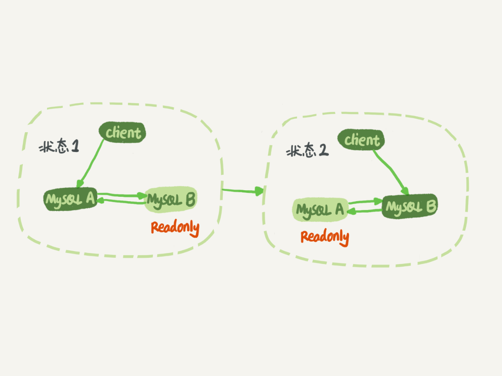
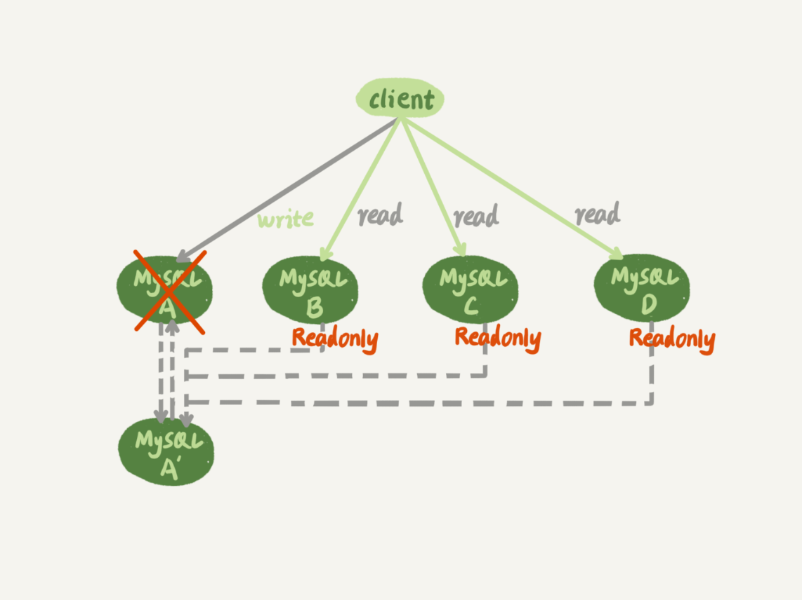

# 多机数据库

## MySQL 主备的基本原理


在状态 1 中，虽然节点 B 没有被直接访问，但是我依然建议你把节点 B(也就是备库)设置成只读(readonly)模式。这样做，有以下⼏几个考 虑:

- 有时候⼀一些运营类的查询语句句会被放到备库上去查，设置为只读可以 防⽌止误操作;
- 防⽌止切换逻辑有 bug，⽐比如切换过程中出现双写，造成主备不不⼀一致;
- 可以⽤用 readonly 状态，来判断节点的⻆角⾊色。

你可能会问，我把备库设置成只读了了，还怎么跟主库保持同步更更新呢? 这个问题，你不不⽤用担⼼心。因为 readonly 设置对超级 (super) 权限⽤用户是⽆无 效的，⽽而⽤用于同步更更新的线程，就拥有超级权限。

### binlog 为什么不建议用 statement 格式？

```
mysql> delete from t /*comment*/ where a>=4 and t_modified<='2018-11-10'
limit 1;

```

可以看到，运⾏行行这条 delete 命令产⽣生了了⼀一个 warning，原因是当前 binlog 设置的是 statement 格式，并且语句句中有 limit，所以这个命令可能是 unsafe 的。

为什什么这么说呢?这是因为 delete 带 limit，很可能会出现主备数据不不⼀一 致的情况。⽐比如上⾯面这个例例⼦子:

- 如果 delete 语句句使⽤用的是索引 a，那么会根据索引 a 找到第⼀一个满⾜足 条件的⾏行行，也就是说删除的是 a=4 这⼀一⾏行行;
- 但如果使⽤用的是索引 t_modified，那么删除的就是 t_modified='2018- 11-09’也就是 a=5 这⼀一⾏行行。

基于上⾯面的信息，我们来讨论⼀一个问题:为什什么会有 mixed 这种 binlog 格式的存在场景?推论过程是这样的:

- 因为有些 statement 格式的 binlog 可能会导致主备不不⼀一致，所以要使 ⽤用 row 格式。
- 但 row 格式的缺点是，很占空间。⽐比如你⽤用⼀一个 delete 语句句删掉 10 万⾏行行数据，⽤用 statement 的话就是⼀一个 SQL 语句句被记录到 binlog 中，占⽤用⼏几⼗十个字节的空间。但如果⽤用 row 格式的 binlog，就要把这 10 万条记录都写到 binlog 中。这样做，不不仅会占⽤用更更⼤大的空间，同 时写 binlog 也要耗费 IO 资源，影响执⾏行行速度。
- 所以，MySQL 就取了了个折中⽅方案，也就是有了了 mixed 格式的 binlog。mixed 格式的意思是，MySQL ⾃自⼰己会判断这条 SQL 语句句是 否可能引起主备不不⼀一致，如果有可能，就⽤用 row 格式，否则就⽤用 statement 格式。

### 主备延迟

主备切换可能是⼀一个主动运维动作，⽐比如软件升级、主库所在机器器按计划 下线等，也可能是被动操作，⽐比如主库所在机器器掉电。

与数据同步有关的时间点主要包括以下三个:

- 主库 A 执⾏行行完成⼀一个事务，写⼊入 binlog，我们把这个时刻记为 T1;
- 之后传给备库 B，我们把备库 B 接收完这个 binlog 的时刻记为 T2;
- 备库 B 执⾏行行完成这个事务，我们把这个时刻记为 T3。

所谓主备延迟，就是同⼀一个事务，在备库执⾏行行完成的时间和主库执⾏行行完成 的时间之间的差值，也就是 T3-T1。

你可以在备库上执⾏行行 show slave status 命令，它的返回结果⾥里里⾯面会显示 seconds_behind_master，⽤用于表示当前备库延迟了了多少秒。

seconds_behind_master 的计算⽅方法是这样的:

- 每个事务的 binlog ⾥里里⾯面都有⼀一个时间字段，⽤用于记录主库上写⼊入的
时间;
- 备库取出当前正在执⾏行行的事务的时间字段的值，计算它与当前系统时
间的差值，得到 seconds_behind_master。

如果主备库机器器的系统时间设置不不⼀一致，会不不会导致主备延 迟的值不不准? 其实不不会的。因为，备库连接到主库的时候，会通过执⾏行行 SELECT UNIX_TIMESTAMP() 函数来获得当前主库的系统时间。如果这时候发现主 库的系统时间与⾃自⼰己不不⼀一致，备库在执⾏行行 seconds_behind_master 计算的 时候会⾃自动扣掉这个差值。

所以说，主备延迟最直接的表现是，备库消费中转⽇日志(relay log)的速 度，⽐比主库⽣生产 binlog 的速度要慢。

### 主备延迟的来源

#### 备库机器性能

更更新请求对 IOPS 的压⼒力力，在主库和备库上是⽆无差别 的。

#### 备库压⼒大

备库上的查询耗费了了⼤大 量量的 CPU 资源，影响了了同步速度，造成主备延迟。

我们⼀一般可以这么处理理:

- ⼀一主多从。除了了备库外，可以多接⼏几个从库，让这些从库来分担读的 压⼒力力。
- 通过 binlog 输出到外部系统，⽐比如 Hadoop 这类系统，让外部系统 提供统计类查询的能⼒力力。

#### ⼤事务

主库上必须等事务执⾏行行完成才会写⼊入 binlog，再传给备库。所以，如果⼀一个主库上的语句句执⾏行行 10 分钟，那这 个事务很可能就会导致从库延迟 10 分钟。

例如：

- 一次性地⽤ delete 语句句删除太多数据。
- ⼤表 DDL

### 备库并⾏复制能⼒

⽇日志在备库上的执⾏行行，就是图中备库上 sql_thread 更更新数据 (DATA) 的 逻辑。如果是⽤用单线程的话，就会导致备库应⽤用⽇日志不不够快，造成主备延 迟。在官⽅方的 5.6 版本之前，MySQL 只⽀支持单线程复制，由此在主库并发 ⾼高、TPS ⾼高时就会出现严重的主备延迟问题。

其实说到底，所有的多线程复制机制，都是要把图 1 中只有⼀一个线程的 sql_thread，拆成多个线程.


图 2 中，coordinator 就是原来的 sql_thread, 不不过现在它不不再直接更更新数 据了了，只负责读取中转⽇日志和分发事务。真正更更新⽇日志的，变成了了 worker 线程。⽽而 work 线程的个数，就是由参数 slave_parallel_workers 决 定的。

事务能不不能按照轮询的⽅方式分发给各个 worker，也就是第⼀一个事务分给 worker_1，第⼆二个事务发给 worker_2 呢?

其实是不不⾏行行的。因为，事务被分发给 worker 以后，不不同的 worker 就独⽴立 执⾏行行了了。但是，由于 CPU 的调度策略略，很可能第⼆二个事务最终⽐比第⼀一个 事务先执⾏行行。⽽而如果这时候刚好这两个事务更更新的是同⼀一⾏行行，也就意味 着，同⼀一⾏行行上的两个事务，在主库和备库上的执⾏行行顺序相反，会导致主备 不不⼀一致的问题。

同⼀一个事务的多个更更新语句句，能 不不能分给不不同的 worker 来执⾏行行呢? 答案是，也不不⾏行行。举个例例⼦子，⼀一个事务更更新了了表 t1 和表 t2 中的各⼀一⾏行行， 如果这两条更更新语句句被分到不不同 worker 的话，虽然最终的结果是主备⼀一 致的，但如果表 t1 执⾏行行完成的瞬间，备库上有⼀一个查询，就会看到这个 事务“更更新了了⼀一半的结果”，破坏了了事务逻辑的隔离性。两个worker是两个线程，没办法约好“同时提交”，这样就有可能出现一个先提交一个后提交。这两个提交之间的时间差，就能被用户看到“一半事务”.

coordinator 在分发的时候，需要满⾜足以下这两个基本要求:

- 不不能造成更更新覆盖。这就要求更更新同⼀一⾏行行的两个事务，必须被分发到同⼀一个 worker 中。
- 同⼀一个事务不不能被拆开，必须放到同⼀一个 worker 中。

#### 按表分发策略略

按表分发事务的基本思路路是，如果两个事务更更新不不同的表，它们就可以并 ⾏行行。当然，如果有跨表的事务，还是要把两张表放在⼀一起考虑的。


每个事务在分发的时候，跟所有 worker 的冲突关系包括以下
三种情况:

- 如果跟所有 worker 都不不冲突，coordinator 线程就会把这个事务分配给最空闲的 woker;
- 如果跟多于⼀一个 worker 冲突，coordinator 线程就进⼊入等待状态，直到和这个事务存在冲突关系的 worker 只剩下 1 个;
- 如果只跟⼀一个 worker 冲突，coordinator 线程就会把这个事务分配给这个存在冲突关系的 worker。

这个按表分发的⽅方案，在多个表负载均匀的场景⾥里里应⽤用效果很好。但是， 如果碰到热点表，⽐比如所有的更更新事务都会涉及到某⼀一个表的时候，所有 事务都会被分配到同⼀一个 worker 中，就变成单线程复制了了。

#### 按⾏行行分发策略略

按⾏行行复制和按表复制的数据结构差不不多，也是为每个 worker，分配⼀一个 hash 表。只是要实现按⾏行行分发，这时候的 key，就必须是“库名 + 表名 + 唯⼀一键的值”。

但是，这个“唯⼀一键”只有主键 id 还是不不够的，事务 hash 表中还需要考虑唯⼀一键.

相⽐于按表并⾏行行分发策略略，按⾏并⾏策略略在决定线程分发的时候， 需要消耗更更多的计算资源。

如果是要操作很多⾏行行的⼤大事务的话，按⾏行行分发的策略略有两个问题:

- 耗费内存。⽐比如⼀一个语句句要删除 100 万⾏行行数据，这时候 hash 表就要 记录 100 万个项。
- 耗费 CPU。解析 binlog，然后计算 hash 值，对于⼤大事务，这个成本 还是很⾼高的。

#### MariaDB commit_id 并行策略

redo log 组提交特性:

- 能够在同⼀一组⾥里里提交的事务，⼀一定不不会修改同⼀一⾏行行;
- 主库上可以并⾏行行执⾏行行的事务，备库上也⼀一定是可以并⾏行行执⾏行行的。

MariaDB 是这么做的:

- 在⼀一组⾥里里⾯面⼀一起提交的事务，有⼀一个相同的 commit_id，下⼀一组就是
commit_id+1;
- commit_id 直接写到 binlog ⾥里里⾯面;
- 传到备库应⽤用的时候，相同 commit_id 的事务分发到多个 worker 执 ⾏行行;
- 这⼀一组全部执⾏行行完成后，coordinator再去取下⼀一批。

这个策略略有⼀一个问题，它并没有实现“真正的模拟主库并发度”这个 ⽬目标。在主库上，⼀一组事务在 commit 的时候，下⼀一组事务是同时处于“执⾏行行中”状态的。

这个⽅方案很容易易被⼤大事务拖后腿。假设 trx2 是⼀一个超⼤大事务，那 么在备库应⽤用的时候，trx1 和 trx3 执⾏行行完成后，就只能等 trx2 完全执⾏行行 完成，下⼀一组才能开始执⾏行行。这段时间，只有⼀一个 worker 线程在⼯工作， 是对资源的浪费。

#### MySQL 5.7 prepare 并行策略

其实，不不⽤用等到 commit 阶段，只要能够到达 redo log prepare 阶段，就 表示事务已经通过锁冲突的检验了了。

因此，MySQL 5.7 并⾏行行复制策略略的思想是:

- 同时处于 prepare 状态的事务，在备库执⾏行行时是可以并⾏行行的;
- 处于 prepare 状态的事务，与处于 commit 状态的事务之间，在备库 执⾏行行时也是可以并⾏行行的。

因此，在binlog write的时候，引擎就会把 binlog 发送给从库来执行，而这个时候主库还在阻塞在 redo log 的 fsync 中和 binlog 的 fsync 中，也就是 commit 还没有完成，客户端还没有返回。语句的响应时间变长，也就是故意延迟主库的事件提交，利用主库提交的时间去从库复制更新。

#### MySQL 5.7.22 WRITESET 并行策略

对于事务涉及更更新的每⼀一⾏行行，计算出这⼀一⾏行行的 hash 值，组成集合 writeset。如果两个事务没有操作相同的⾏行行，也就 是说它们的 writeset 没有交集，就可以并⾏行行。

当然为了了唯⼀一标识，这个 hash 值是通过“库名 + 表名 + 索引名 + 值”计算 出来的。如果⼀一个表上除了了有主键索引外，还有其他唯⼀一索引，那么对于 每个唯⼀一索引，insert 语句句对应的 writeset 就要多增加⼀一个 hash 值。

MySQL 官⽅方的这个实现还是有很⼤大的优势:

- writeset 是在主库⽣生成后直接写⼊入到 binlog ⾥里里⾯面的，这样在备库执⾏行行 的时候，不不需要解析 binlog 内容(event ⾥里里的⾏行行数据)，节省了了很多 计算量量;
- 不不需要把整个事务的 binlog 都扫⼀一遍才能决定分发到哪个 worker， 更更省内存;
- 由于备库的分发策略略不不依赖于 binlog 内容，所以 binlog 是 statement 格式也是可以的。

## 双 M 结构切换

### 循环复制问题

实 际⽣生产上使⽤用⽐比较多的是双 M 结构，也就是图 9 所示的主备切换流程。



对⽐比图 9 和图 1，你可以发现，双 M 结构和 M-S 结构，其实区别只是多 了了⼀一条线，即:节点 A 和 B 之间总是互为主备关系。这样在切换的时候 就不不⽤用再修改主备关系。

但是，双 M 结构还有⼀一个问题需要解决。

业务逻辑在节点 A 上更更新了了⼀一条语句句，然后再把⽣生成的 binlog 发给节点 B，节点 B 执⾏行行完这条更更新语句句后也会⽣生成 binlog。(我建议你把参数 log_slave_updates 设置为 on，表示备库执⾏行行 relay log 后⽣生成 binlog)。
那么，如果节点 A 同时是节点 B 的备库，相当于⼜又把节点 B 新⽣生成的 binlog 拿过来执⾏行行了了⼀一次，然后节点 A 和 B 间，会不不断地循环执⾏行行这个更更新语句句，也就是循环复制了了。这个要怎么解决呢?

从上⾯面的图 6 中可以看到，MySQL 在 binlog 中记录了了这个命令第⼀一次执 ⾏行行时所在实例例的 server id。因此，我们可以⽤用下⾯面的逻辑，来解决两个节 点间的循环复制的问题:

- 规定两个库的 server id 必须不不同，如果相同，则它们之间不不能设定 为主备关系;
- ⼀一个备库接到 binlog 并在重放的过程中，⽣生成与原 binlog 的 server id 相同的新的 binlog;
- 每个库在收到从⾃自⼰己的主库发过来的⽇日志后，先判断 server id，如果 跟⾃自⼰己的相同，表示这个⽇日志是⾃自⼰己⽣生成的，就直接丢弃这个⽇日志。

按照这个逻辑，如果我们设置了了双 M 结构，⽇日志的执⾏行行流就会变成这 样:

- 从节点 A 更更新的事务，binlog ⾥里里⾯面记的都是 A 的 server id;
- 传到节点 B 执⾏行行⼀一次以后，节点 B ⽣生成的 binlog 的 server id 也是 A
的 server id;
- 再传回给节点 A，A 判断到这个 server id 与⾃自⼰己的相同，就不不会再处
理理这个⽇日志。所以，死循环在这⾥里里就断掉了了。

### 可靠性优先策略略

双 M 结构下，详细过程是这样的:

- 判断备库 B 现在的 seconds_behind_master，如果⼩小于某个值(⽐比如秒)继续下⼀一步，否则持续重试这⼀一步;
- 把主库 A 改成只读状态，即把 readonly 设置为 true;
- 判断备库 B 的 seconds_behind_master 的值，直到这个值变成 0 为 ⽌止;
- 把备库 B 改成可读写状态，也就是把 readonly 设置为 false;
- 把业务请求切到备库 B。

可以看到，这个切换流程中是有不不可⽤用时间的。因为在步骤 2 之后，主库 A 和备库 B 都处于 readonly 状态，也就是说这时系统处于不不可写状态， 直到步骤 5 完成后才能恢复。


### 可⽤用性优先策略略

如果我强⾏行行把步骤 4、5 调整到最开始执⾏行行，也就是说不不等主备数据同 步，直接把连接切到备库 B，并且让备库 B 可以读写，那么系统⼏几乎就没 有不不可⽤用时间了了。

我们把这个切换流程，暂时称作可⽤用性优先流程。这个切换流程的代价， 就是可能出现数据不不⼀一致的情况。

例如：

```
insert into t(c) values(1),(2),(3);

insert into t(c) values(4);
insert into t(c) values(5);

```

现在主库上其他的数据表有⼤大量量的更更新，导致主备延迟达到 5 秒。在插⼊入⼀一条 c=4 的语句句后，发起了了主备切换。


binlog_format=mixed时的切换流程:

- 步骤 2 中，主库 A 执⾏行行完 insert 语句句，插⼊入了了⼀一⾏行行数据(4,4)，之 后开始进⾏行行主备切换。
- 步骤 3 中，由于主备之间有 5 秒的延迟，所以备库 B 还没来得及应 ⽤用“插⼊入 c=4”这个中转⽇日志，就开始接收客户端“插⼊入 c=5”的命令。
- 步骤 4 中，备库 B 插⼊入了了⼀一⾏行行数据(4,5)，并且把这个 binlog 发给 主库 A。
- 步骤 5 中，备库 B 执⾏行行“插⼊入 c=4”这个中转⽇日志，插⼊入了了⼀一⾏行行数据 (5,4)。⽽而直接在备库 B 执⾏行行的“插⼊入 c=5”这个语句句，传到主库 A，就插⼊入了了⼀一⾏行行新数据(5,5)。

最后的结果就是，主库 A 和备库 B 上出现了了两⾏行行不不⼀一致的数据。

设置 binlog_format=row，情况 ⼜又会怎样呢? 最后只会有⼀一⾏行行不不⼀一致。⽽而且，两边的主备同步的应⽤用线程会报错 duplicate key error 并停⽌止。也就是说，这种情况下，备库 B 的 (5,4) 和 主库 A 的 (5,5) 这两⾏行行数据，都不不会被对⽅方执⾏。

## ⼀一主多从切换



### 基于位点的主备切换

两个参数 MASTER_LOG_FILE 和 MASTER_LOG_POS 表示，要从 主库的 master_log_name ⽂文件的 master_log_pos 这个位置的⽇日志继 续同步。⽽而这个位置就是我们所说的同步位点，也就是主库对应的⽂文 件名和⽇日志偏移量量。

节点 B 要设置成 A’的从库，就要执⾏行行 change master 命令，就不不可避免地要设置位点的这两个参数，但是这两 个参数到底应该怎么设置呢?

原来节点 B 是 A 的从库，本地记录的也是 A 的位点。但是相同的⽇日志，A 的位点和 A’的位点是不不同的。因此，从库 B 要切换的时候，就需要先经 过“找同步位点”这个逻辑。

⼀一种取同步位点的⽅方法是这样的:

- 等待新主库 A’把中转⽇日志(relay log)全部同步完成;
- 在 A’上执⾏行行 show master status 命令，得到当前 A’上最新的 File 和 Position;
- 取原主库 A 故障的时刻 T;
- ⽤用 mysqlbinlog ⼯工具解析 A’的 File，得到 T 时刻的位点。

这时候系统的状态是这样的:

- 在从库 B 上，由于同步了了 binlog， R 这⼀一⾏行行已经存在;
- 在新主库 A’上， R 这⼀一⾏行行也已经存在，⽇日志是写在 123 这个位置之 后的;
- 我们在从库 B 上执⾏行行 change master 命令，指向 A’的 File ⽂文件的 123 位置，就会把插⼊入 R 这⼀一⾏行行数据的 binlog ⼜又同步到从库 B 去执 ⾏行行。

这时候，从库 B 的同步线程就会报告 Duplicate entry ‘id_of_R’ for key ‘PRIMARY’ 错误，提示出现了了主键冲突，然后停⽌止同步。

通常情况下，我们在切换任务的时候，要先主动跳过这些错误，有 两种常⽤用的⽅方法。

- ⼀一种做法是，主动跳过⼀一个事务。
- 另外⼀一种⽅方式是，通过设置 slave_skip_errors 参数，直接设置跳过指定的 错误。(1062 错误是插⼊入数据时唯⼀一键冲突;/032 错误是删除数据时找不不到⾏行行。)

等到主 备间的同步关系建⽴立完成，并稳定执⾏行行⼀一段时间之后，我们还需要把这个设置为空，以免之后真的出现了了主从数据不不⼀一致，也跳过了了。

### GTID

GTID 的全称是 Global Transaction Identifier，也就是全局事务 ID，是⼀一 个事务在提交的时候⽣生成的，是这个事务的唯⼀一标识。它由两部分组成， 格式是:

```
GTID=server_uuid:gno

```

其中:

- server_uuid 是⼀一个实例例第⼀一次启动时⾃自动⽣生成的，是⼀一个全局唯⼀一 的值;
- gno 是⼀一个整数，初始值是 1，每次提交事务的时候分配给这个事 务，并加 1。

在 MySQL ⾥里里⾯面我们说 transaction_id 就是指事务 id，事务 id 是在 事务执⾏行行过程中分配的，如果这个事务回滚了了，事务 id 也会递增，⽽而 gno 是在事务提交的时候才会分配。从效果上看，GTID 往往是连续的，因此我们⽤用 gno 来表示更更容易易理理解。

在 GTID 模式下，每个事务都会跟⼀一个 GTID ⼀一⼀一对应。

- 如果 gtid_next=automatic，代表使⽤用默认值。这时，MySQL 就会把 server_uuid:gno 分配给这个事务。
- 如果 gtid_next 是⼀一个指定的 GTID 的值，⽐比如通过 set gtid_next='current_gtid’指定为 current_gtid，那么就有两种可能: 
	- 如果 current_gtid 已经存在于实例例的 GTID 集合中，接下来执⾏行行的 这个事务会直接被系统忽略略;
	- 如果 current_gtid 没有存在于实例例的 GTID 集合中，就将这个 current_gtid 分配给接下来要执⾏行行的事务，也就是说系统不不需要给这 个事务⽣生成新的 GTID，因此 gno 也不不⽤用加 1。

	
这样，每个 MySQL 实例例都维护了了⼀一个 GTID 集合，⽤用来对应“这个实例例执 ⾏行行过的所有事务”。

### 基于 GTID 的主备切换

我们把现在这个时刻，实例例 A’的 GTID 集合记为 set_a，实例例 B 的 GTID 集合记为 set_b。接下来，我们就看看现在的主备切换逻辑。

我们在实例例 B 上执⾏行行 start slave 命令，取 binlog 的逻辑是这样的: 

- 实例例 B 指定主库 A’，基于主备协议建⽴立连接。
- 实例例B把set_b发给主库A’。
- 实例例 A’算出 set_a 与 set_b 的差集，也就是所有存在于 set_a，但是 不不存在于 set_b 的 GTID 的集合，判断 A’本地是否包含了了这个差集需 要的所有 binlog 事务。
	- 如果不不包含，表示 A’已经把实例例 B 需要的 binlog 给删掉了了，直接返回错误; 
	- 如果确认全部包含，A’从⾃自⼰己的 binlog ⽂文件⾥里里⾯面，找出第⼀一个不不 在 set_b 的事务，发给 B;
- 之后就从这个事务开始，往后读⽂文件，按顺序取 binlog 发给 B 去执 ⾏行行。

这跟基于位点的主备协议不不同。基于位点的协议，是由备库决定的，备库 指定哪个位点，主库就发哪个位点，不不做⽇日志的完整性判断。

基于上⾯面的介绍，我们再来看看引⼊入 GTID 后，⼀一主多从的切换场景下， 主备切换是如何实现的。由于不不需要找位点了了，所以从库 B、C、D 只需要分别执⾏行行 change master 命令指向实例例 A’即可。

其实，严谨地说，主备切换不不是不不需要找位点了了，⽽而是找位点这个⼯工作， 在实例例 A’内部就已经⾃自动完成了了。但由于这个⼯工作是⾃自动的，所以对 HA 系统的开发⼈人员来说，⾮非常友好。

之后这个系统就由新主库 A’写⼊入，主库 A’的⾃自⼰己⽣生成的 binlog 中的 GTID 集合格式是:server_uuid_of_A’:1-M。

如果之前从库 B 的 GTID 集合格式是 server_uuid_of_Ac1-N， 那么切换之 后 GTID 集合的格式就变成了了 server_uuid_of_Ac1-N, server_uuid_of_A’:1- M。


## 过期读问题如何解决

### 强制⾛走主库

3. 对于必须要拿到最新结果的请求，强制将其发到主库上。⽐比如，在⼀一 个交易易平台上，卖家发布商品以后，⻢马上要返回主⻚页⾯面，看商品是否 发布成功。那么，这个请求需要拿到最新的结果，就必须⾛走主库。
7. 对于可以读到旧数据的请求，才将其发到从库上。在这个交易易平台 上，买家来逛商铺⻚页⾯面，就算晚⼏几秒看到最新发布的商品，也是可以 接受的。那么，这类请求就可以⾛走从库。

### Sleep 

具体的⽅方案就是，类似于执⾏行行⼀条 select sleep(1) 命令。这个⽅方案的假设是，⼤大多数情况下主备延迟在 1 秒之内，做⼀一个 sleep 可以有很⼤大概率拿到最新的数据。

### 判断主备无延迟

- 判断 seconds_behind_master 是否已经等于 0，单位是秒，精度可能不够
- 对⽐比位点确保主备⽆无延迟：Master_Log_File 和 Read_Master_Log_Pos，Relay_Master_Log_File 和 Exec_Master_Log_Pos，这两组值完全相同，就表示接收到的⽇日志已经同 步完成。
- ⽐比 GTID 集合确保主备⽆无延迟：Retrieved_Gtid_Set，是备库收到的所有⽇日志的 GTID 集合;Executed_Gtid_Set，是备库所有已经执⾏行行完成的 GTID 集合。

我们上⾯面判断主备⽆无延迟的逻辑，是“备库收到的⽇日志都执⾏行行完成了了”。但 是，从 binlog 在主备之间状态的分析中，不不难看出还有⼀一部分⽇日志，处于 客户端已经收到提交确认，⽽而备库还没收到⽇日志的状态。

### semi-sync

semi-sync 做了了这样的设计:

- 事务提交的时候，主库把 binlog 发给从库;
- 从库收到 binlog 以后，发回给主库⼀一个 ack，表示收到了了;
- 主库收到这个 ack 以后，才能给客户端返回“事务完成”的确认。

但是，semi-sync+ 位点判断的⽅方案，只对⼀一主⼀一备的场景是成⽴立的。在 ⼀一主多从场景中，主库只要等到⼀一个从库的 ack，就开始给客户端返回确 认。如果是查询落到其他从库上，它们可能还没有收到最新的⽇日志，就 会产⽣生过期读的问题。

### 等主库位点

#### `master_pos_wait`

```
select master_pos_wait(file, pos[, timeout]);

```

这条命令的逻辑如下:

- 它是在从库执⾏行行的;
- 参数 file 和 pos 指的是主库上的⽂文件名和位置;
- timeout 可选，设置为正整数 N 表示这个函数最多等待 N 秒。

这个命令正常返回的结果是⼀一个正整数 M，表示从命令开始执⾏行行，到应⽤用 完 file 和 pos 表示的 binlog 位置，执⾏行行了了多少事务。

- trx1事务更更新完成后，⻢马上执⾏行行showmasterstatus得到当前主库执
⾏行行到的 File 和 Position;
- 选定⼀一个从库执⾏行行查询语句句;
- 在从库上执⾏行行 select master_pos_wait(File, Position, 1);
- 如果返回值是 >=0 的正整数，则在这个从库执⾏行行查询语句句; 
- 否则，到主库执⾏行行查询语句句。

#### GTID ⽅方案

```
select wait_for_executed_gtid_set(gtid_set, 1);

```

在前⾯面等位点的⽅方案中，我们执⾏行行完事务后，还要主动去主库执⾏行行 show master status。⽽而 MySQL 5.7.6 版本开始，允许在执⾏行行完更更新类事务后， 把这个事务的 GTID 返回给客户端，这样等 GTID 的⽅方案就可以减少⼀一次 查询。

这时，等 GTID 的执⾏行行流程就变成了了:

- trx1 事务更更新完成后，从返回包直接获取这个事务的 GTID，记为
gtid1;
- 选定⼀一个从库执⾏行行查询语句句;
- 在从库上执⾏行行 select wait_for_executed_gtid_set(gtid1, 1); \. 如果返回值是 0，则在这个从库执⾏行行查询语句句;
- 否则，到主库执⾏行行查询语句句。

## 如何判断⼀一个数据库是不是出问题了?

### select 1 判断

select 1 成功返回，只能说明这个库的进程还在，并不不能说明主 库没问题。

我们设置 innodb_thread_concurrency 参数的⽬目的是，控制 InnoDB 的并 发线程上限。也就是说，⼀一旦并发线程数达到这个值，InnoDB 在接收到 新请求的时候，就会进⼊入等待状态，直到有线程退出。通常情况下，我们建议把 innodb_thread_concurrency 设置为 64~128 之间的值。

实际上，在线程进⼊入锁等待以后，并发线程的计数会减⼀一，也就是说等⾏行行 锁(也包括间隙锁)的线程是不不算在 128 ⾥里里⾯面的。

这⾥里里，我把 innodb_thread_concurrency 设置成 3，表示 InnoDB 只允许 3 个线程并⾏行行执⾏行行。⽽而在我们的例例⼦子中，前三个 session 中的 sleep(100)， 使得这三个语句句都处于“执⾏行行”状态，以此来模拟⼤大查询。

session D ⾥里里⾯面，select 1 是能执⾏行行成功的，但是查询表 t 的语 句句会被堵住。也就是说，如果这时候我们⽤用 select 1 来检测实例例是否正常 的话，是检测不不出问题的。


### 查表判断 

使⽤用这个⽅方法，我们可以检测出由于并发线程过多导致的数据库不不可⽤用的情况。

但是，我们⻢马上还会碰到下⼀一个问题，即:空间满了了以后，这种⽅方法⼜又会 变得不不好使。

### 更新判断

更更新判断是⼀一个相对⽐比较常⽤用的⽅方案了了，不不过依然存在⼀一些问题。其 中，“判定慢”⼀一直是让 DBA 头疼的问题。

你⼀一定会疑惑，更更新语句句，如果失败或者超时，就可以发起主备切换了了， 为什什么还会有判定慢的问题呢?

⾸首先，所有的检测逻辑都需要⼀一个超时时间 N。执⾏行行⼀一条 update 语句句，超过 N 秒后还不不返回，就认为系统不不可⽤用。

你可以设想⼀一个⽇日志盘的 IO 利利⽤用率已经是 100% 的场景。这时候，整个系统响应⾮非常慢，已经需要做主备切换了了。

但是你要知道，IO 利利⽤用率 100% 表示系统的 IO 是在⼯工作的，每个请求都 有机会获得 IO 资源，执⾏行行⾃自⼰己的任务。⽽而我们的检测使⽤用的 update 命 令，需要的资源很少，所以可能在拿到 IO 资源的时候就可以提交成功， 并且在超时时间 N 秒未到达之前就返回给了了检测系统。

检测系统⼀一看，update 命令没有超时，于是就得到了了“系统正常”的结 论。

### 内部统计

MySQL 5.6 版本以后提供的 performance_schema 库，就在 file_summary_by_event_name 表⾥里里统计了了每次 IO 请求的时间。


