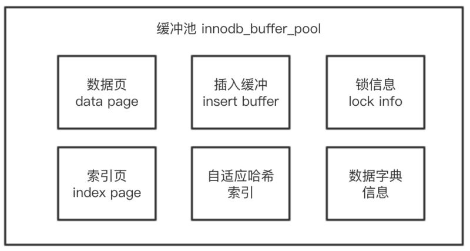

# 数据库基础架构

## 数据库基础架构

MySQL 的基本架构示意图:

⼤大体来说，MySQL 可以分为 Server 层和存储引擎层两部分。

Server 层包括连接器器、查询缓存、分析器器、优化器器、执⾏行行器器等，涵盖 MySQL 的⼤大多数核⼼心服务功能，以及所有的内置函数(如⽇日期、时间、 数学和加密函数等)，所有跨存储引擎的功能都在这⼀一层实现，⽐比如存储 过程、触发器器、视图等。

⽽而存储引擎层负责数据的存储和提取。其架构模式是插件式的，⽀支持 InnoDB、MyISAM、Memory 等多个存储引擎。现在最常⽤用的存储引擎是 InnoDB，它从 MySQL 5.5.5 版本开始成为了了默认存储引擎。

### 连接器

第⼀步，你会先连接到这个数据库上，这时候接待你的就是连接器器。连接 器器负责跟客户端建⽴立连接、获取权限、维持和管理理连接。

连接完成后，如果你没有后续的动作，这个连接就处于空闲状态，你可以 在 show processlist 命令中看到它。⽂本中这个图是 show processlist 的 结果，其中的 Command 列列显示为“Sleep”的这⼀⾏，就表示现在系统⾥里里 ⾯面有⼀个空闲连接。

客户端如果太长时间没动静，连接器器就会⾃自动将它断开。这个时间是由参 数 wait_timeout 控制的，默认值是 8 ⼩小时。

建⽴立连接的过程通常是⽐比较复杂的，所以我建议你在使⽤中要尽量减少建立连接的动作，也就是尽量量使⽤用⻓长连接。

但是全部使⽤用⻓长连接后，你可能会发现，有些时候 MySQL 占⽤用内存涨得 特别快，这是因为 MySQL 在执⾏行行过程中临时使⽤用的内存是管理理在连接对象⾥⾯的。这些资源会在连接断开的时候才释放。所以如果⻓连接累积下来，可能导致内存占⽤用太⼤，被系统强⾏杀掉(OOM)，从现象看就是 MySQL 异常重启了了。

怎么解决这个问题呢?你可以考虑以下两种⽅方案。

- 定期断开⻓长连接。使⽤用⼀一段时间，或者程序⾥里里⾯面判断执⾏行行过⼀一个占⽤用内存的⼤大查询后，断开连接，之后要查询再重连。
- 如果你⽤用的是 MySQL 5.7 或更更新版本，可以在每次执⾏行行⼀一个⽐比较⼤大 的操作后，通过执⾏行行 mysql_reset_connection 来重新初始化连接资 源。这个过程不不需要重连和重新做权限验证，但是会将连接恢复到刚 刚创建完时的状态。

### 分析器

⾸首先，MySQL 需要 知道你要做什什么，因此需要对 SQL 语句句做解析。

分析器器先会做“词法分析”。你输⼊入的是由多个字符串串和空格组成的⼀条 SQL 语句句，MySQL 需要识别出里⾯的字符串分别是什么，代表什什么。

MySQL 从你输⼊入的"select"这个关键字识别出来，这是⼀个查询语句。它 也要把字符串串“T”识别成“表名 T”，把字符串串“ID”识别成“列列 ID”。

做完了这些识别以后，就要做“语法分析”。根据词法分析的结果，语法分 析器器会根据语法规则，判断你输⼊入的这个 SQL 语句句是否满⾜足 MySQL 语 法。

如果你的语句句不对，就会收到“You have an error in your SQL syntax”的 错误提醒，

### 优化器

经过了了分析器器，MySQL 就知道你要做什什么了了。在开始执⾏行行之前，还要先 经过优化器器的处理理。

优化器器是在表⾥里里⾯面有多个索引的时候，决定使⽤用哪个索引;或者在⼀一个语 句句有多表关联(join)的时候，决定各个表的连接顺序。

### 执⾏器

开始执⾏行行的时候，要先判断⼀一下你对这个表 T 有没有执⾏行行查询的权限，如 果没有，就会返回没有权限的错误，

如果有权限，就打开表继续执⾏行行。打开表的时候，执⾏行行器器就会根据表的引擎定义，去使⽤用这个引擎提供的接⼝口。

⽐比如我们这个例例⼦子中的表 T 中，ID 字段没有索引，那么执⾏行行器器的执⾏行行流 程是这样的:

- 调⽤用 InnoDB 引擎接⼝口取这个表的第⼀一⾏行行，判断 ID 值是不不是 10，如 果不不是则跳过，如果是则将这⾏行行存在结果集中;
- 调⽤用引擎接⼝口取“下⼀⾏”，重复相同的判断逻辑，直到取到这个表的 最后⼀⾏。
- 执⾏器器将上述遍历过程中所有满⾜足条件的⾏行行组成的记录集作为结果集 返回给客户端。

至此，这个语句句就执⾏行行完成了了。

对于有索引的表，执⾏行行的逻辑也差不不多。第⼀一次调⽤用的是“取满⾜足条件的 第⼀一⾏行行”这个接⼝口，之后循环取“满⾜足条件的下⼀一⾏行行”这个接⼝口，这些接⼝口 都是引擎中已经定义好的。

你会在数据库的慢查询⽇日志中看到⼀一个 rows_examined 的字段，表示这个 语句句执⾏过程中扫描了多少⾏。这个值就是在执⾏器每次调⽤用引擎获取数据⾏的时候累加的。

在有些场景下，执⾏器调⽤⼀次，在引擎内部则扫描了多⾏，因此引擎扫描⾏数跟 rows_examined 并不是完全相同的。

## 全表扫描对 server 层的影响

你已经知道了了，InnoDB 的数据是保存在主键索引上的，所以全表扫描实 际上是直接扫描表 t 的主键索引。这条查询语句句由于没有其他的判断条 件，所以查到的每⼀一⾏行行都可以直接放到结果集⾥里里⾯面，然后返回给客户端。

实际上，服务端并不不需要保存⼀一个完整的结果集。取数据和发数据的流程 是这样的:

- 获取⼀一⾏行行，写到 net_buffer 中。这块内存的⼤大⼩小是由参数 net_buffer_length 定义的，默认是 16k。
- 重复获取⾏行行，直到 net_buffer 写满，调⽤用⽹网络接⼝口发出去。
- 如果发送成功，就清空 net_buffer，然后继续取下⼀一⾏行行，并写⼊入 net_buffer。
- 如果发送函数返回 EAGAIN 或 WSAEWOULDBLOCK，就表示本地⽹网 络栈(socket send buffer)写满了了，进⼊入等待。直到⽹网络栈重新可 写，再继续发送。

也就是说，MySQL 是“边读边发的”,如果你看到 State 的值⼀一直处于“Sending to client”，就表示服务器器端的网络栈写满了了。

实际上，⼀一个查询语句句的状态变化是这样的(注意:这⾥里里，我略略去了了其他 ⽆无关的状态):
          
- MySQL 查询语句句进⼊入执⾏行行阶段后，⾸先把状态设置成“Sending data”;
- 然后，发送执⾏行行结果的列列相关的信息(meta data) 给客户端;
-  再继续执⾏行行语句句的流程; 
-  执⾏行行完成后，把状态设置成空字符串串。

也就是说，仅当⼀一个线程处于“等待客户端接收结果”的状态，才会显 示"Sending to client";⽽而如果显示成“Sending data”，它的意思只是“正 在执⾏行行”。

### InnoDB 的 LRU

在 InnoDB 实现上，按照 5c3 的⽐比例例把整个 LRU 链表分成了了 young 区域 和 old 区域。图中 LRU_old 指向的就是 old 区域的第⼀一个位置，是整个链 表的 5/8 处。也就是说，靠近链表头部的 5/8 是 young 区域，靠近链表尾 部的 3/8 是 old 区域。

## Innodb 基础架构

### 后台线程

- Master Thread

    Master Thread 主要负责将缓存池中的数据异步刷新到磁盘，保证数据的一致性，包括脏页的刷新、合并插入缓冲（INSERT BUFFER）、UNDO页的回收。

- IO Thread

    IO Thread 主要负责 Async IO 请求的回调处理，包含 write、read、insert buffer 和 log IO thread。

- Purge Thread

    Purge Thread 负责回收已经使用并分配的 undo 页，减轻 Master Thread 的工作。
    
    full purge 操作：删除无用的 undo 页，对表进行 update、delete 操作时，原先的行被标记为删除，但是因为一致性读的关系，需要保留这些版本的信息。但是在 full purge 的过程中，引擎会判断当前的事务已被删除的行是否可以删除。

- Page Cleaner Thread

    Page Cleaner Thread 作用是将之前版本中脏页的刷新操作都放入到单独的线程中来完成，减轻 Master Thread 的工作及对于用户查询线程的阻塞。
    
### 内存

#### 缓冲区

缓冲池中缓存的而数据页类型有：索引页，数据页，undo页，插入缓冲(insert buffer)，自适应哈希索引(adaptive hash index) 等等。

#### LRU list,Free list,Flush list

数据库中的缓冲池是通过LRU(Lastest Recent Used,最近最少使用)算法进行管理的。

当数据库刚启动时，LRU列表是空的，即没有任何的页，这时的页都存放在Free列表中。

在LRU列表中的页被修改后，该页称为脏页(dirty page),即缓冲池中的页和磁盘上的页的数据产生了不一致。这时，数据库会通过checkpoint机制将脏页刷新回磁盘，而Flush列表中的页即为脏页列表。

### InnoDB 关键特性

#### 插入缓冲（insert buffer）

对于【非聚集索引】的更新或插入操作，不是直接插入到索引页中，而是先判断插入的非聚集索引页是否在缓冲池中，若在，则直接插入，否则先放入到一个 Insert Buffer 中。再以一定频率和情况进行 Insert Buffer 和辅助索引页子节点的merge操作，合并插入操作，提高非聚集索引的插入性能。

#### 两次写（double write）

#### 自适应哈希索引

nnoDB 会监控对表上各索引页的查询。如果观察到建议哈希索引可以带来速度的提升，则建立哈希索引，称之为自适应哈希索引（AHI）。AHI 是通过缓冲池的 B+ 树构造来的，因此建立的速度非常快，而且不需要对整张表构建哈希索引，InnoDB 会根据访问频率和模式来自动创建自适应哈希索引，无需人为设置干预。

自适应哈希索引只适用于等值查询，比如 where smsId = 'XXXXXX'，不支持范围查找。

## InnoDB 存储引擎文件

InnoDB 存储引擎独有的文件，与InnoDB 存储引擎密切相关，包括表空间文件、重做日志文件。

### 表空间文件

InnoDB 采用将存储的数据按表空间进行存放的设计。默认配置下有一个初始化大小为 10MB 的 ibdata1 文件，可自动增长。可以通过参数 innodb_data_file_path 对其进行设置。若设置了参数 innodb_file_per_table，则用户可以将每个基于 InnoDB 存储引擎的表产生一个独立表空间。独立表空间命名规则：表名.ibd

需要注意的是，这些单独的表空间文件仅存储该表的数据、索引和插入缓冲 BITMAP 等信息，其余信息例如undo、插入缓冲索引页、双写缓冲等等还是存放在默认表空间中。

### 重做日志文件

- redo log type 重做日志的类型
- space 表空间 id
- page no 页偏移
- redo log body 重做日志数据

### 数据字典

在InnoDB中，系统表实际上是看不到的，不像Oracle那样可以方便地通过一个查询语句就能得到其中的内容。因为MySQL是一个插件式的数据库管理系统。它的结构分为两层，分别是Server层和存储引擎层。最早的存储引擎是MyISAM，它是没有数据字典的，关于表结构，它拥有的只有.frm文件，所以这导致了InnoDB也必须要有这个文件才使得Server层识别并管理它。对于Server层，一个表是什么存储引擎，这是表的属性。具体深入到每一个存储引擎内部，数据字典就不被Server层来管理了，这就导致数据字典不能被用户感知了。

InnoDB有四个最基本的系统表，用来存储用户定义的表，列，索引及索引列等信息，这些表分别为SYS_TABLES，SYS_COLUMNS，SYS_INDEXES，SYS_FIELDS。

SYS_TABLES：用来存储所有InnoDB为存储引擎的表

>
>NAME：表示一个表的表名
>
>ID：表示这个表的ID号
>
>N_COLS：表示这个表的列的个数，建表指定的列数。
>
>SPACE：表示这个表所在表空间ID号。这个表对应的主键列为NAME，同时还有一个在ID号上的唯一索引。

SYS_COLUMNS：用来存储InnoDB中定义的所有表中所有列的信息，每一列对应这个表的一条记录。

>
>TABLE_ID：表示这个列所属的表的ID号
>
>NAME：表示这个列名。
>
>MTYPE：表示这个列的主数据类型。
>

SYS_INDEXES：用来存储InnoDB中所有表的索引信息，每一条记录对应一个索引

>
>TABLE_ID：表示这个索引所属的表的ID号。
>
>NAME：表示这个索引的索引名
>
>ID：表示这个索引的索引ID号
>
>PAGE_NO：表示这个索引对应的B+树根页面。

SYS_FIEDS：用来存储所有索引中定义的索引列，每一条记录对应一个索引列。

>
>INDEX_ID：这个列所在的索引
>
>POS：这个列在某个索引中是第几个索引列
>
>COL_NAME：这个索引列的列名。

InnoDB启动的时候，如果是新建数据库，则需要初始化库，索引需要创建字典管理的B+树信息。因为InnoDB中的系统表的结构，个数等都是固定的，所以在初始化库的时候只需要创建这几个表的存储B+树即可。同时把将这几个B+树的根页号存储在一个固定位置，就不需要将这几个表自身的信息存储在系统表中了。对于一个B树，只要找到其根页面，就可以找检索其数据了。
对于数据字典表根页面位置的存储方式，InnoDB用了一个专门的页面（0号表空间0号文件的7号页面）来管理数据字典信息。这个页面用来存储4个系统表的五个根页面号(有5个索引)。

普通用户表的加载过程，当用户访问一个表时，系统首先会从表对象缓冲池中查找这个表SHARE对象，如果找到，则直接从其实例化表对象空间链表中拿一个空闲的实例化的表对象使用，如果没有一个可用的实例化对象，则需要重新打开(实例化这个表)，在实例化这个表的时候，需要找到这个表的字典信息，包括这个表本身，列信息及索引信息等，这些信息很多都是从SHARE对象处获得。如果没有SHARE对象，则需要从系统表中构造SHARE对象。

## Innodb 逻辑存储结构

