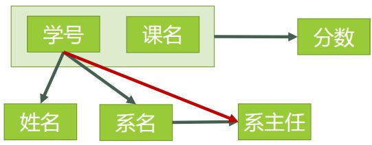

# 数据库基础概念

## 数据库范式

### 第一范式（1NF）

1NF的定义为：符合1NF的关系中的每个属性都不可再分。表1所示的情况，就不符合1NF的要求。


实际上，1NF是所有关系型数据库的最基本要求。

### 第二范式（2NF）

2NF在1NF的基础之上，消除了非主属性对于码的部分函数依赖。


#### 函数依赖

若在一张表中，在属性（或属性组）X的值确定的情况下，必定能确定属性Y的值，那么就可以说Y函数依赖于X，写作 X → Y。也就是说，在数据表中，不存在任意两条记录，它们在X属性（或属性组）上的值相同，而在Y属性上的值不同。

例如： 

- 姓名函数依赖于学号，写作 学号 → 姓名
- 系名 → 系主任
- 学号 → 系主任
- （学号，课名） → 分数

#### 完全函数依赖

在一张表中，若 X → Y，且对于 X 的任何一个真子集（假如属性组 X 包含超过一个属性的话），X ' → Y 不成立，那么我们称 Y 对于 X 完全函数依赖。

例如：

- 学号 F→ 姓名 
- （学号，课名） F→ 分数 （注：因为同一个的学号对应的分数不确定，同一个课名对应的分数也不确定）

#### 部分函数依赖

假如 Y 函数依赖于 X，但同时 Y 并不完全函数依赖于 X，那么我们就称 Y 部分函数依赖于 X

例如：

- （学号，课名） P→ 姓名

#### 传递函数依赖

假如 Z 函数依赖于 Y，且 Y 函数依赖于 X ，那么我们就称 Z 传递函数依赖于 X

例如：

- 学号->系名->系主任

#### 码

设 K 为某表中的一个属性或属性组，若除 K 之外的所有属性都完全函数依赖于 K（这个“完全”不要漏了），那么我们称 K 为候选码，简称为码。

在实际中我们通常可以理解为：假如当 K 确定的情况下，该表除 K 之外的所有属性的值也就随之确定，那么 K 就是码。一张表中可以有超过一个码。

例如：

- 对于表3，（学号、课名）这个属性组就是码。该表中有且仅有这一个码。（假设所有课没有重名的情况）

#### 非主属性

包含在任何一个码中的属性成为主属性。


#### 找出 2NF



- 表3的码只有一个，就是（学号、课名）。
- 主属性有两个：学号 与 课名
- 非主属性有四个：姓名、系名、系主任、分数
- 对于（学号，课名） → 姓名，有 学号 → 姓名，存在非主属性 姓名 对码（学号，课名）的部分函数依赖。对于（学号，课名） → 系名，有 学号 → 系名，存在非主属性 系名 对码（学号，课名）的部分函数依赖。对于（学号，课名） → 系主任，有 学号 → 系主任，存在非主属性  对码（学号，课名）的部分函数依赖。

### 第三范式 3NF


第三范式（3NF） 3NF在2NF的基础之上，消除了非主属性对于码的传递函数依赖。

对于学生表，主码为学号，主属性为学号，非主属性为姓名、系名和系主任。因为 学号 → 系名，同时 系名 → 系主任，所以存在非主属性系主任对于码学号的传递函数依赖，所以学生表的设计，不符合3NF的要求。


### BCNF 范式

BC 范式既检查非主属性，又检查主属性。

当只检查非主属性时，就成了第三范式。满足BC范式的关系都必然满足第三范式。

还可以这么说：若一个关系达到了第三范式，并且它只有一个候选码，或者它的每个候选码都是单属性，则该关系自然达到BC范式。

要了解 BCNF 范式，那么先看这样一个问题：

- 某公司有若干个仓库；
- 每个仓库只能有一名管理员，一名管理员只能在一个仓库中工作；
- 一个仓库中可以存放多种物品，一种物品也可以存放在不同的仓库中。每种物品在每个仓库中都有对应的数量。

已知函数依赖集：仓库名 → 管理员，管理员 → 仓库名，（仓库名，物品名）→ 数量

- 码：（管理员，物品名），（仓库名，物品名）
- 主属性：仓库名、管理员、物品名
- 非主属性：数量

不存在非主属性对码的部分函数依赖和传递函数依赖,此关系模式属于3NF。

存在着主属性对于码的部分函数依赖与传递函数依赖。

解决办法就是要在 3NF 的基础上消除主属性对于码的部分与传递函数依赖。

- 仓库（仓库名，管理员）
- 库存（仓库名，物品名，数量）

### 第四范式 4NF

职工表(职工编号，职工孩子姓名，职工选修课程)，在这个表中，同一个职工可能会有多个职工孩子姓名，同样，同一个职工也可能会有多个职工选修课程，即这里存在着多值事实，不符合第四范式。

如果要符合第四范式，只需要将上表分为两个表，使它们只有一个多值事实，例如职工表一(职工编号，职工孩子姓名)，职工表二(职工编号，职工选修课程)，两个表都只有一个多值事实，所以符合第四范式。


## SQL 语句


### 插入语句

```
insert into student(学号,姓名,出生日期,性别) 
values('0001' , '猴子' , '1989-01-01' , '男');

insert into student(学号,姓名,出生日期,性别) 
values('0002' , '猴子' , '1990-12-21' , '女');

```

### 简单查询

- 查询姓“孟”老师的个数

```
select count(教师号)
from teacher
where 教师姓名 like '孟%';

```

### 汇总分析

- 查询课程编号为“0002”的总成绩

```
select sum(成绩)
from score
where 课程号 = '0002';

```

- 查询各科成绩最高和最低的分

```
select 课程号,max(成绩) as 最高分,min(成绩) as 最低分
from score
group by 课程号;

```

- 查询平均成绩大于60分学生的学号和平均成绩

```
select 学号, avg(成绩)
from score
group by 学号
having avg(成绩)>60;

```


- 查询两门以上不及格课程的同学的学号及其平均成绩

```
select 学号, avg(成绩) as 平均成绩
from score
where 成绩 <60
group by 学号
having count(课程号)>=2;

```

### 复杂查询

- 查询所有课程成绩小于60分学生的学号、姓名

```
select 学号,姓名
from student
where  学号 in (
select 学号 
from student
where 成绩 < 60
);

```

- 查询没有学全所有课的学生的学号、姓名

```
select 学号,姓名
from student
where 学号 in(
select 学号 
from score
group by 学号
having count(课程号) < (select count(课程号) from course)
);

```

### 多表查询

- 查询所有学生的学号、姓名、选课数、总成绩

```
selecta.学号,a.姓名,count(b.课程号) as 选课数,sum(b.成绩) as 总成绩
from student as a left join score as b
on a.学号 = b.学号
group by a.学号;

```

- 查询平均成绩大于85的所有学生的学号、姓名和平均成绩

```
select a.学号,a.姓名, avg(b.成绩) as 平均成绩
from student as a left join score as b
on a.学号 = b.学号
group by a.学号
having avg(b.成绩)>85;

```