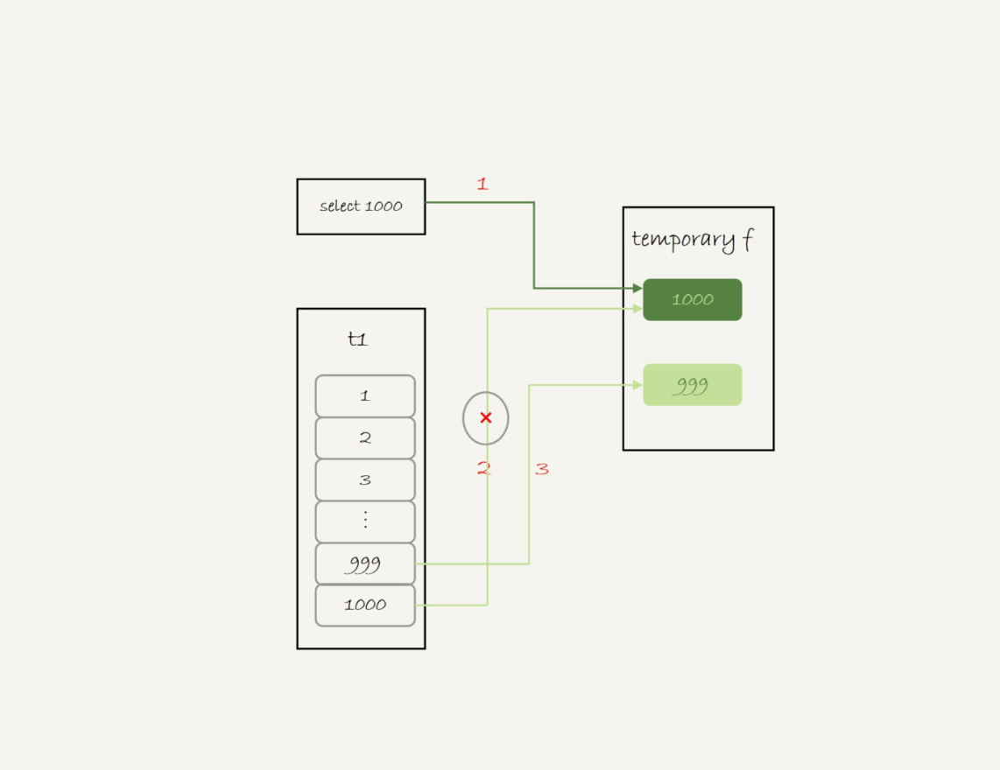
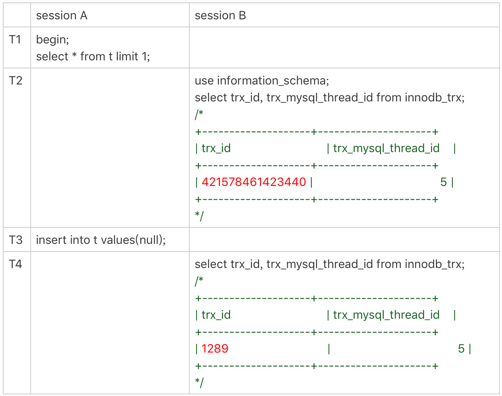
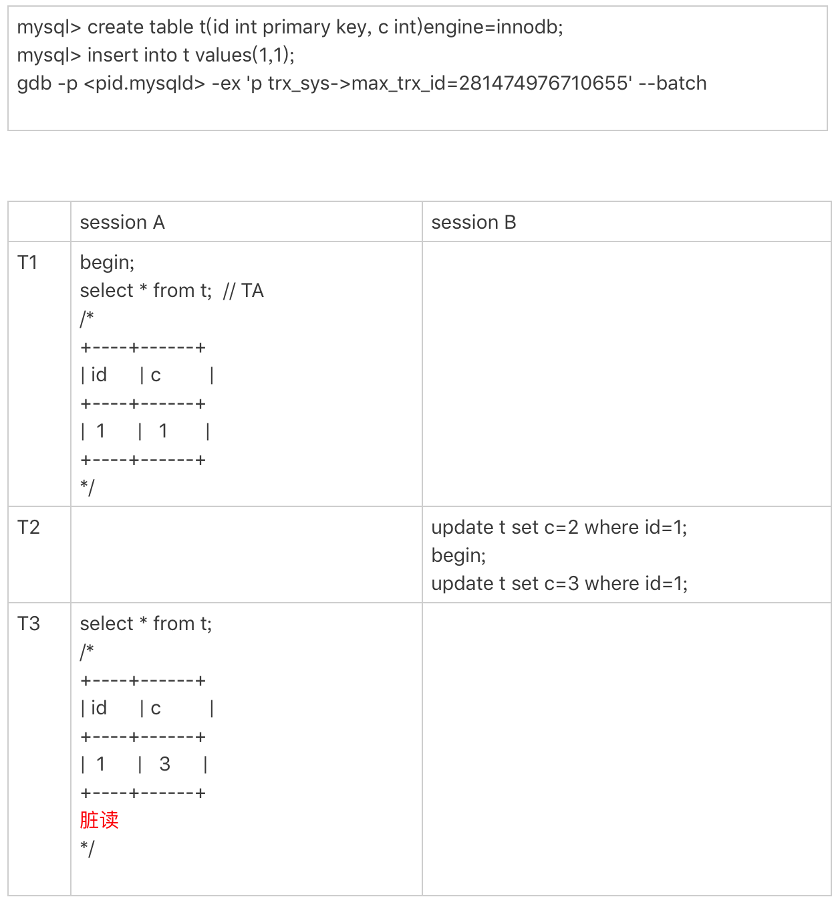

# 数据库工作流程

## 数据库基础架构

MySQL 的基本架构示意图:


⼤大体来说，MySQL 可以分为 Server 层和存储引擎层两部分。

Server 层包括连接器器、查询缓存、分析器器、优化器器、执⾏行行器器等，涵盖 MySQL 的⼤大多数核⼼心服务功能，以及所有的内置函数(如⽇日期、时间、 数学和加密函数等)，所有跨存储引擎的功能都在这⼀一层实现，⽐比如存储 过程、触发器器、视图等。

⽽而存储引擎层负责数据的存储和提取。其架构模式是插件式的，⽀支持 InnoDB、MyISAM、Memory 等多个存储引擎。现在最常⽤用的存储引擎是 InnoDB，它从 MySQL 5.5.5 版本开始成为了了默认存储引擎。

### 连接器

第⼀步，你会先连接到这个数据库上，这时候接待你的就是连接器器。连接 器器负责跟客户端建⽴立连接、获取权限、维持和管理理连接。

连接完成后，如果你没有后续的动作，这个连接就处于空闲状态，你可以 在 show processlist 命令中看到它。⽂本中这个图是 show processlist 的 结果，其中的 Command 列列显示为“Sleep”的这⼀⾏，就表示现在系统⾥里里 ⾯面有⼀个空闲连接。

客户端如果太长时间没动静，连接器器就会⾃自动将它断开。这个时间是由参 数 wait_timeout 控制的，默认值是 8 ⼩小时。

建⽴立连接的过程通常是⽐比较复杂的，所以我建议你在使⽤中要尽量减少建立连接的动作，也就是尽量量使⽤用⻓长连接。

但是全部使⽤用⻓长连接后，你可能会发现，有些时候 MySQL 占⽤用内存涨得 特别快，这是因为 MySQL 在执⾏行行过程中临时使⽤用的内存是管理理在连接对象⾥⾯的。这些资源会在连接断开的时候才释放。所以如果⻓连接累积下来，可能导致内存占⽤用太⼤，被系统强⾏杀掉(OOM)，从现象看就是 MySQL 异常重启了了。

怎么解决这个问题呢?你可以考虑以下两种⽅方案。

- 定期断开⻓长连接。使⽤用⼀一段时间，或者程序⾥里里⾯面判断执⾏行行过⼀一个占⽤用内存的⼤大查询后，断开连接，之后要查询再重连。
- 如果你⽤用的是 MySQL 5.7 或更更新版本，可以在每次执⾏行行⼀一个⽐比较⼤大 的操作后，通过执⾏行行 mysql_reset_connection 来重新初始化连接资 源。这个过程不不需要重连和重新做权限验证，但是会将连接恢复到刚 刚创建完时的状态。

### 分析器

⾸首先，MySQL 需要 知道你要做什什么，因此需要对 SQL 语句句做解析。

分析器器先会做“词法分析”。你输⼊入的是由多个字符串串和空格组成的⼀条 SQL 语句句，MySQL 需要识别出里⾯的字符串分别是什么，代表什什么。

MySQL 从你输⼊入的"select"这个关键字识别出来，这是⼀个查询语句。它 也要把字符串串“T”识别成“表名 T”，把字符串串“ID”识别成“列列 ID”。

做完了这些识别以后，就要做“语法分析”。根据词法分析的结果，语法分 析器器会根据语法规则，判断你输⼊入的这个 SQL 语句句是否满⾜足 MySQL 语 法。

如果你的语句句不对，就会收到“You have an error in your SQL syntax”的 错误提醒，


### 优化器

经过了了分析器器，MySQL 就知道你要做什什么了了。在开始执⾏行行之前，还要先 经过优化器器的处理理。

优化器器是在表⾥里里⾯面有多个索引的时候，决定使⽤用哪个索引;或者在⼀一个语 句句有多表关联(join)的时候，决定各个表的连接顺序。

### 执⾏器

开始执⾏行行的时候，要先判断⼀一下你对这个表 T 有没有执⾏行行查询的权限，如 果没有，就会返回没有权限的错误，

如果有权限，就打开表继续执⾏行行。打开表的时候，执⾏行行器器就会根据表的引擎定义，去使⽤用这个引擎提供的接⼝口。


⽐比如我们这个例例⼦子中的表 T 中，ID 字段没有索引，那么执⾏行行器器的执⾏行行流 程是这样的:

- 调⽤用 InnoDB 引擎接⼝口取这个表的第⼀一⾏行行，判断 ID 值是不不是 10，如 果不不是则跳过，如果是则将这⾏行行存在结果集中;
- 调⽤用引擎接⼝口取“下⼀⾏”，重复相同的判断逻辑，直到取到这个表的 最后⼀⾏。
- 执⾏器器将上述遍历过程中所有满⾜足条件的⾏行行组成的记录集作为结果集 返回给客户端。

至此，这个语句句就执⾏行行完成了了。

对于有索引的表，执⾏行行的逻辑也差不不多。第⼀一次调⽤用的是“取满⾜足条件的 第⼀一⾏行行”这个接⼝口，之后循环取“满⾜足条件的下⼀一⾏行行”这个接⼝口，这些接⼝口 都是引擎中已经定义好的。

你会在数据库的慢查询⽇日志中看到⼀一个 rows_examined 的字段，表示这个 语句句执⾏过程中扫描了多少⾏。这个值就是在执⾏器每次调⽤用引擎获取数据⾏的时候累加的。

在有些场景下，执⾏器调⽤⼀次，在引擎内部则扫描了多⾏，因此引擎扫描⾏数跟 rows_examined 并不是完全相同的。


## 全表扫描对 server 层的影响

你已经知道了了，InnoDB 的数据是保存在主键索引上的，所以全表扫描实 际上是直接扫描表 t 的主键索引。这条查询语句句由于没有其他的判断条 件，所以查到的每⼀一⾏行行都可以直接放到结果集⾥里里⾯面，然后返回给客户端。

实际上，服务端并不不需要保存⼀一个完整的结果集。取数据和发数据的流程 是这样的:

- 获取⼀一⾏行行，写到 net_buffer 中。这块内存的⼤大⼩小是由参数 net_buffer_length 定义的，默认是 16k。
- 重复获取⾏行行，直到 net_buffer 写满，调⽤用⽹网络接⼝口发出去。
- 如果发送成功，就清空 net_buffer，然后继续取下⼀一⾏行行，并写⼊入 net_buffer。
- 如果发送函数返回 EAGAIN 或 WSAEWOULDBLOCK，就表示本地⽹网 络栈(socket send buffer)写满了了，进⼊入等待。直到⽹网络栈重新可 写，再继续发送。

也就是说，MySQL 是“边读边发的”,如果你看到 State 的值⼀一直处于“Sending to client”，就表示服务器器端的网络栈写满了了。

实际上，⼀一个查询语句句的状态变化是这样的(注意:这⾥里里，我略略去了了其他 ⽆无关的状态):
          
- MySQL 查询语句句进⼊入执⾏行行阶段后，⾸先把状态设置成“Sending data”;
- 然后，发送执⾏行行结果的列列相关的信息(meta data) 给客户端;
-  再继续执⾏行行语句句的流程; 
-  执⾏行行完成后，把状态设置成空字符串串。

也就是说，仅当⼀一个线程处于“等待客户端接收结果”的状态，才会显 示"Sending to client";⽽而如果显示成“Sending data”，它的意思只是“正 在执⾏行行”。

### InnoDB 的 LRU

在 InnoDB 实现上，按照 5c3 的⽐比例例把整个 LRU 链表分成了了 young 区域 和 old 区域。图中 LRU_old 指向的就是 old 区域的第⼀一个位置，是整个链 表的 5/8 处。也就是说，靠近链表头部的 5/8 是 young 区域，靠近链表尾 部的 3/8 是 old 区域。

## Order By 工作流程

SQL 语句:

```
select city,name,age from t where city='杭州' order by name limit 1000 ;

```

### 全字段排序

为避免全表扫描，我们需 要在 city 字段加上索引。

在 city 字段上创建索引之后，我们⽤用 explain 命令来看看这个语句句的执⾏行行 情况。


Extra 这个字段中的“Using filesort”表示的就是需要排序，MySQL 会给每个线程分配⼀一块内存⽤用于排序，称为 sort_buffer。

通常情况下，这个语句句执⾏行行流程如下所示 :

- 初始化 sort_buffer，确定放⼊入 name、city、age 这三个字段;
- 从索引 city 找到第⼀一个满⾜足 city='杭州’条件的主键 id，也就是图中的
ID_X;
- 到主键 id 索引取出整⾏行行，取 name、city、age 三个字段的值，存⼊入
sort_buffer 中;
- 从索引 city 取下⼀一个记录的主键 id;
- 重复步骤 3、4 直到 city 的值不不满⾜足查询条件为⽌止，对应的主键 id 也 就是图中的 ID_Y;
- 对 sort_buffer 中的数据按照字段 name 做快速排序;
- 按照排序结果取前 1000 ⾏行行返回给客户端。


按 name 排序”这个动作，可能在内存中完成，也可能需要使⽤用外部排序，这取决于排序所需的内存和参数 sort_buffer_size。

sort_buffer_size，就是 MySQL 为排序开辟的内存(sort_buffer)的⼤大 ⼩小。如果要排序的数据量量⼩小于 sort_buffer_size，排序就在内存中完成。但 如果排序数据量量太⼤大，内存放不不下，则不不得不不利利⽤用磁盘临时⽂文件辅助排 序。

通过查看 OPTIMIZER_TRACE 的结果来确认的，你可以从 number_of_tmp_files 中看到是否使⽤用了了临时⽂文件. number_of_tmp_files 就是 0，表示排序可以直接在内存中完成。

### rowid 排序

在上⾯面这个算法过程⾥里里⾯面，只对原表的数据读了了⼀一遍，剩下的操作都是在 sort_buffer 和临时⽂文件中执⾏行行的。但这个算法有⼀一个问题，就是如果查询 要返回的字段很多的话，那么 sort_buffer ⾥里里⾯面要放的字段数太多，这样 内存⾥里里能够同时放下的⾏行行数很少，要分成很多个临时⽂文件，排序的性能会 很差。

所以如果单⾏行行很⼤大，这个⽅方法效率不不够好。

那么，如果 MySQL 认为排序的单⾏行行⻓长度太⼤大会怎么做呢?max_length_for_sort_data，是 MySQL 中专⻔门控制⽤用于排序的⾏行行数据的⻓长 度的⼀一个参数。它的意思是，如果单⾏行行的⻓长度超过这个值，MySQL 就认 为单⾏行行太⼤大，要换⼀一个算法。

新的算法放⼊入 sort_buffer 的字段，只有要排序的列列(即 name 字段)和 主键 id。

但这时，排序的结果就因为少了了 city 和 age 字段的值，不不能直接返回 了了，整个执⾏行行流程就变成如下所示的样⼦子:

- 初始化 sort_buffer，确定放⼊入两个字段，即 name 和 id;
- 从索引 city 找到第⼀一个满⾜足 city='杭州’条件的主键 id，也就是图中的
ID_X;
- 到主键 id 索引取出整⾏行行，取 name、id 这两个字段，存⼊入 sort_buffer
中;
- 从索引 city 取下⼀一个记录的主键 id;
- 重复步骤 3、4 直到不不满⾜足 city='杭州’条件为⽌止，也就是图中的 ID_Y;
- 对 sort_buffer 中的数据按照字段 name 进⾏行行排序;
- 遍历排序结果，取前 1000 ⾏行行，并按照 id 的值回到原表中取出 city、 name 和 age 三个字段返回给客户端。


对⽐比图 3 的全字段排序流程图你会发现，rowid 排序多访问了了⼀一次表 t 的主键索引，就是步骤 7。

### 优化排序

MySQL 做排序是⼀一个成本⽐比较⾼高的操作。那么 你会问，是不不是所有的 order by 都需要排序操作呢?如果不不排序就能得到 正确的结果，那对系统的消耗会⼩小很多，语句句的执⾏行行时间也会变得更更短。

其实，并不不是所有的 order by 语句句，都需要排序操作的。从上⾯面分析的执 ⾏行行过程，我们可以看到，MySQL 之所以需要⽣生成临时表，并且在临时表 上做排序操作，其原因是原来的数据都是⽆无序的。

你可以设想下，如果能够保证从 city 这个索引上取出来的⾏行行，天然就是按 照 name 递增排序的话，是不不是就可以不不⽤用再排序了了呢?

所以，我们可以在这个市⺠民表上创建⼀一个 city 和 name 的联合索引，

在这个索引⾥里里⾯面，我们依然可以⽤用树搜索的⽅方式定位到第⼀一个满⾜足 city='杭州’的记录，并且额外确保了了，接下来按顺序取“下⼀一条记录”的遍 历过程中，只要 city 的值是杭州，name 的值就⼀一定是有序的。

这样整个查询过程的流程就变成了了:

- 从索引 (city,name) 找到第⼀一个满⾜足 city='杭州’条件的主键 id;
- 到主键 id 索引取出整⾏行行，取 name、city、age 三个字段的值，作为 结果集的⼀一部分直接返回;
- 从索引 (city,name) 取下⼀一个记录主键 id;
- 重复步骤 2、3，直到查到第 1000 条记录，或者是不不满⾜足 city='杭 州’条件时循环结束。

可以看到，这个查询过程不不需要临时表，也不不需要排序。接下来，我们⽤用explain 的结果来印证.

从图中可以看到，Extra 字段中没有 Using filesort 了了，也就是不不需要排序 了了。⽽而且由于 (city,name) 这个联合索引本身有序，所以这个查询也不不⽤用 把 4000 ⾏行行全都读⼀一遍，只要找到满⾜足条件的前 1000 条记录就可以退出 了了。

按照覆盖索引的概念，我们可以再优化⼀一下这个查询语句句的执⾏行行流程。 针对这个查询，我们可以创建⼀一个 city、name 和 age 的联合索引.

这时，对于 city 字段的值相同的⾏行行来说，还是按照 name 字段的值递增排 序的，此时的查询语句句也就不不再需要排序了了。这样整个查询语句句的执⾏行行流 程就变成了了:

- 从索引 (city,name,age) 找到第⼀一个满⾜足 city='杭州’条件的记录，取 出其中的 city、name 和 age 这三个字段的值，作为结果集的⼀一部分 直接返回;
- 从索引 (city,name,age) 取下⼀一个记录，同样取出这三个字段的值， 作为结果集的⼀一部分直接返回;
- 重复执⾏行行步骤 2，直到查到第 1000 条记录，或者是不不满⾜足 city='杭 州’条件时循环结束。

然后，我们再来看看 explain 的结果。可以看到，Extra 字段⾥里里⾯面多了了“Using index”，表示的就是使⽤用了了覆盖索
引，性能上会快很多。

### 临时表上的排序

```
mysql> select word from words order by rand() limit 3;

```

我们先⽤用 explain 命令来看看这个语句句的执⾏行行情况。Extra 字段显示 Using temporary，表示的是需要使⽤用临时表;Using
filesort，表示的是需要执⾏行行排序操作。因此这个 Extra 的意思就是，需要临时表，并且需要在临时表上排序。

对于内存表，回表过程只是简单 地根据数据⾏行行的位置，直接访问内存得到数据，根本不不会导致多访问磁 盘。优化器器没有了了这⼀一层顾虑，那么它会优先考虑的，就是⽤用于排序的⾏行行 越⼩小越好了了，所以，MySQL 这时就会选择 rowid 排序。

那么，是不不是所有的临时表都是内存表呢?

其实不不是的。tmp_table_size 这个配置限制了了内存临时表的⼤大⼩小，默认值 是 16M。如果临时表⼤大⼩小超过了了 tmp_table_size，那么内存临时表就会转 成磁盘临时表。磁盘临时表使⽤用的引擎默认是 InnoDB，是由参数 internal_tmp_disk_storage_engine 控制的。

这个 SQL 语句虽然超过了 sort_buffer_size 的字节, 但是排序确实没有⽤用到临时⽂文件，采⽤用是 MySQL 5.6 版本引⼊入的⼀一个新的排序算法，即:优先队列列排序算法。接下来，我们就看看为 什什么没有使⽤用临时⽂文件的算法，也就是归并排序算法，⽽而是采⽤用了了优先队 列列排序算法。

其实，我们现在的 SQL 语句句，只需要取 R 值最⼩小的 3 个 rowid。但是， 如果使⽤用归并排序算法的话，虽然最终也能得到前 3 个值，但是这个算法 结束后，已经将 10000 ⾏行行数据都排好序了了。

也就是说，后⾯面的 9997 ⾏行行也是有序的了了。但，我们的查询并不不需要这些 数据是有序的。所以，想⼀一下就明⽩白了了，这浪费了了⾮非常多的计算量量。

⽽而优先队列列算法，就可以精确地只得到三个最⼩小值，执⾏行行流程如下:

- 对于这 10000 个准备排序的 (R,rowid)，先取前三⾏行行，构造成⼀一个 堆;
(对数据结构印象模糊的同学，可以先设想成这是⼀一个由三个元素组成的 数组)
- 取下⼀一个⾏行行 (R’,rowid’)，跟当前堆⾥里里⾯面最⼤大的 R ⽐比较，如果 R’⼩小于 R，把这个 (R,rowid) 从堆中去掉，换成 (R’,rowid’);
- 重复第 2 步，直到第 10000 个 (R’,rowid’) 完成⽐比较。


## join 工作原理

### Index Nested-Loop Join

```
select * from t1 straight_join t2 on (t1.a=t2.a);

```

在这条语句句⾥里里，被驱动表 t2 的字段 a 上有索引，join 过程⽤上了这个索引，因此这个语句句的执⾏行行流程是这样的:

- 从表 t1 中读⼊入⼀一⾏行行数据 R;
- 从数据⾏行行 R 中，取出 a 字段到表 t2 ⾥里里去查找;
- 取出表 t2 中满⾜足条件的⾏行行，跟 R 组成⼀一⾏行行，作为结果集的⼀一部分; C. 重复执⾏行行步骤 1 到 3，直到表 t1 的末尾循环结束。

在这个流程⾥里里:

- 对驱动表 t1 做了了全表扫描，这个过程需要扫描 100 ⾏行行;
- ⽽而对于每⼀一⾏行行 R，根据 a 字段去表 t2 查找，⾛走的是树搜索过程。由 于我们构造的数据都是⼀一⼀一对应的，因此每次的搜索过程都只扫描⼀一 ⾏行行，也是总共扫描 100 ⾏行行;
- 所以，整个执⾏行行流程，总扫描⾏行行数是 200。

通过上⾯面的分析我们得到了了两个结论:

- 使⽤用 join 语句句，性能⽐比强⾏行行拆成多个单表执⾏行行 SQL 语句句的性能要 好;              
- 如果使⽤用 join 语句句的话，需要让⼩小表做驱动表。

### Simple Nested-Loop Join

```
select * from t1 straight_join t2 on (t1.a=t2.b);

```

由于表 t2 的字段 b 上没有索引，因此再执行流程时，每次到 t2 去匹配的时候，就要做⼀一次全表扫描。

但是，这样算来，这个 SQL 请求就要扫描表 t2 多达 100 次，总共扫描 100*1000=10 万⾏。

MySQL 也没有使⽤用这个 Simple Nested-Loop Join 算法，⽽而是使⽤用 了了另⼀一个叫作“Block Nested-Loop Join”的算法，简称 BNL。

### Block Nested-Loop Join

这时候，被驱动表上没有可⽤用的索引，算法的流程是这样的:

- 把表 t1 的数据读⼊入线程内存 join_buffer 中，由于我们这个语句句中写 的是 select *，因此是把整个表 t1 放⼊入了了内存;
           
- 扫描表 t2，把表 t2 中的每⼀一⾏行行取出来，跟 join_buffer 中的数据做对 ⽐比，满⾜足 join 条件的，作为结果集的⼀一部分返回。

在这个过程中，对表 t1 和 t2 都做了了⼀一次全表扫描，因此总的 扫描⾏行行数是 1100。由于 join_buffer 是以⽆无序数组的⽅方式组织的，因此对 表 t2 中的每⼀一⾏，都要做 100 次判断，总共需要在内存中做的判断次数 是:100*1000=10 万次。

前⾯面我们说过，如果使⽤用 Simple Nested-Loop Join 算法进⾏行行查询，扫描 ⾏行行数也是 10 万⾏行行。因此，从时间复杂度上来说，这两个算法是⼀一样的。 但是，Block Nested-Loop Join 算法的这 10 万次判断是内存操作，速度 上会快很多，性能也更更好。

join_buffer 的⼤大⼩小是由参数 join_buffer_size 设定的，默认值是 256k。如 果放不不下表 t1 的所有数据话，策略略很简单，就是分段放,执⾏行行过程就变成了了:

- 扫描表 t1，顺序读取数据⾏行行放⼊入 join_buffer 中，放完第 88 ⾏行行 join_buffer 满了了，继续第 2 步;
- 扫描表 t2，把 t2 中的每⼀一⾏行行取出来，跟 join_buffer 中的数据做对 ⽐比，满⾜足 join 条件的，作为结果集的⼀一部分返回;
- 清空 join_buffer;
- 继续扫描表 t1，顺序读取最后的 12 ⾏行行数据放⼊入 join_buffer 中，继续 执⾏行行第 2 步。

可以看到，这时候由于表 t1 被分成了了两次放⼊入 join_buffer 中，导致表 t2 会被扫描两次。虽然分成两次放⼊入 join_buffer，但是判断等值条件的次数 还是不不变的，依然是 (88+12)*1000=10 万次。

### Multi-Range Read MRR 优化

因为⼤大多数的数据都是按照主键递增顺序插⼊入得到的，所以我们可以认 为，如果按照主键的递增顺序查询的话，对磁盘的读⽐比较接近顺序读，能 够提升读性能。

这，就是 MRR 优化的设计思路路。此时，语句句的执⾏行行流程变成了了这样:

- 根据索引 a，定位到满⾜足条件的记录，将 id 值放⼊入 read_rnd_buffer 中;
- 将 read_rnd_buffer 中的 id 进⾏行行递增排序;
- 排序后的 id 数组，依次到主键 id 索引中查记录，并作为结果返回。

read_rnd_buffer 的⼤大⼩小是由 read_rnd_buffer_size 参数控制的。如 果步骤 1 中，read_rnd_buffer 放满了了，就会先执⾏行行完步骤 2 和 3，然后清 空 read_rnd_buffer。之后继续找索引 a 的下个记录，并继续循环。

### Batched Key Access BKA 算法

理理解了了 MRR 性能提升的原理理，我们就能理理解 MySQL 在 5.6 版本后开始引 ⼊入的 Batched Key Acess(BKA) 算法了了。这个 BKA 算法，其实就是对 NLJ 算法的优化。

从驱动表 t1，⼀一⾏行行⾏行行地取出 a 的值，再到被驱动 表 t2 去做 join。也就是说，对于表 t2 来说，每次都是匹配⼀一个值。这 时，MRR 的优势就⽤用不不上了了。

那怎么才能⼀一次性地多传些值给表 t2 呢?⽅方法就是，从表 t1 ⾥里里⼀一次性地 多拿些⾏行行出来，⼀一起传给表 t2。

我们知道 join_buffer 在 BNL 算法⾥里里的作⽤用，是暂存驱 动表的数据。但是在 NLJ 算法⾥里里并没有⽤用。那么，我们刚好就可以复⽤用 join_buffer 到 BKA 算法中。

### BNL 转 BKA

⼀一些情况下，我们可以直接在被驱动表上建索引，这时就可以直接转成 BKA 算法了了。

但是，有时候你确实会碰到⼀一些不不适合在被驱动表上建索引的情况。这时候，我们可以考虑使⽤用临时表。使⽤用临时表的⼤大致思路路是:

- 把表 t2 中满⾜足条件的数据放在临时表 tmp_t 中;
- 为了了让 join 使⽤用 BKA 算法，给临时表 tmp_t 的字段 b 加上索引; 
- 让表t1和tmp_t做join操作。

### hash join

如果 join_buffer ⾥里里⾯面维护的不不是⼀一个⽆无序数组，⽽而是⼀一个哈希表的 话，那么就不不是 10 亿次判断，⽽而是 100 万次 hash 查找。这样的话，整 条语句句的执⾏行行速度就快多了了吧?

实际上，这个优化思路路，我们可以⾃自⼰己实现在业务端。实现流程⼤大致如 下:

- select * from t1;取得表 t1 的全部 1000 ⾏行行数据，在业务端存⼊入⼀一 个 hash 结构，⽐比如 C++ ⾥里里的 set、PHP 的数组这样的数据结构。
- select * from t2 where b>=1 and b<=2000; 获取表 t2 中满⾜足条件 的 2000 ⾏行行数据。
- 把这 2000 ⾏行行数据，⼀一⾏行行⼀一⾏行行地取到业务端，到 hash 结构的数据表 中寻找匹配的数据。满⾜足匹配的条件的这⾏行行数据，就作为结果集的⼀一 ⾏行行。

### left join 与 join、on 与 where

```
select * from a left join b on(a.f1=b.f1) and (a.f2=b.f2); /*Q1*/
select * from a left join b on(a.f1=b.f1) where (a.f2=b.f2);/*Q2*/

```

使⽤用 left join 时，左边的表不不⼀一定是 驱动表。

如果需要 left join 的语义，就不不能把被驱动表的字段放在 where 条件⾥里里⾯面做等值判断或不不等值判断，必须都写在 on ⾥里里⾯面。
 
 


## 临时表

### 临时表的特点

- 建表语法是createtemporarytable...。
- ⼀一个临时表只能被创建它的 session 访问，对其他线程不不可⻅见。所以，图中 session A 创建的临时表 t，对于 session B 就是不不可⻅见的。
- 由于临时表只能被创建它的 session 访问，所以在这个 session 结束的时候，会⾃自动删除临时表。
- 临时表可以与普通表同名。
- sessionA 内有同名的临时表和普通表的时候，showcreate语句句，以 及增删改查语句句访问的是临时表。
- showtables命令不不显示临时表。

### 为什什么临时表可以重名？

```
create temporary table temp_t(id int primary key)engine=innodb;

```

这个语句句的时候，MySQL 要给这个 InnoDB 表创建⼀一个 frm ⽂文件保存表结
构定义，还要有地⽅方保存表数据。

这个 frm ⽂文件放在临时⽂文件⽬目录下，⽂文件名的后缀是.frm，前缀 是`#sql{进程 id}_{线程 id}_ 序列列号`。你可以使⽤用 select @@tmpdir 命 令，来显示实例例的临时⽂文件⽬目录。

⽽而关于表中数据的存放⽅方式，在不不同的 MySQL 版本中有着不不同的处理理⽅方 式:

- 在 5.6 以及之前的版本⾥里里，MySQL 会在临时⽂文件⽬目录下创建⼀一个相 同前缀、以.ibd 为后缀的⽂文件，⽤用来存放数据⽂文件;
- ⽽从 5.7 版本开始，MySQL 引⼊入了了⼀一个临时⽂文件表空间，专⻔门⽤用来 存放临时⽂文件的数据。因此，我们就不不需要再创建 ibd ⽂文件了了。

从⽂文件名的前缀规则，我们可以看到，其实创建⼀一个叫作 t1 的 InnoDB 临 时表，MySQL 在存储上认为我们创建的表名跟普通表 t1 是不不同的，因此 同⼀一个库下⾯面已经有普通表 t1 的情况下，还是可以再创建⼀一个临时表 t1 的。

MySQL 维护数据表，除了了物理理上要有⽂文件外，内存⾥里里⾯面也有⼀一套机制区 别不不同的表，每个表都对应⼀一个 table_def_key。

- ⼀一个普通表的 table_def_key 的值是由“库名 + 表名”得到的，所以如 果你要在同⼀一个库下创建两个同名的普通表，创建第⼆二个表的过程中 就会发现 table_def_key 已经存在了了。
- 而对于临时表，table_def_key 在“库名 + 表名”基础上，⼜又加⼊入 了了“server_id+thread_id”。

也就是说，session A 和 sessionB 创建的两个临时表 t1，它们的 table_def_key 不不同，磁盘⽂文件名也不不同，因此可以并存。

在实现上，每个线程都维护了了⾃自⼰己的临时表链表。这样每次 session 内操 作表的时候，先遍历链表，检查是否有这个名字的临时表，如果有就优先 操作临时表，如果没有再操作普通表;在 session 结束的时候，对链表⾥里里 的每个临时表，执⾏行行 “DROP TEMPORARY TABLE + 表名”操作。


## union 执⾏行行流程

```
(select 1000 as f) union (select id from t1 order by id desc limit 2);

```

这个语句句的执⾏行行流程是这样的:

- 创建⼀一个内存临时表，这个临时表只有⼀一个整型字段 f，并且 f 是主 键字段。
- 执⾏行行第⼀一个⼦子查询，得到 1000 这个值，并存⼊入临时表中。 
- 执⾏行行第⼆二个⼦子查询:
    - 拿到第⼀一⾏行行 id=1000，试图插⼊入临时表中。但由于 1000 这个值 已经存在于临时表了了，违反了了唯⼀一性约束，所以插⼊入失败，然后 继续执⾏行行;
    - 取到第⼆二⾏行行 id=999，插⼊入临时表成功。
- 从临时表中按⾏行行取出数据，返回结果，并删除临时表，结果中包含两 ⾏行行数据分别是 1000 和 999。



可以看到，这⾥里里的内存临时表起到了了暂存数据的作⽤用，⽽而且计算过程还⽤用上了了临时表主键 id 的唯⼀一性约束，实现了了 union 的语义。

## group by 执⾏流程

```
select id%10 as m, count(*) as c from t1 group by m;

```

这个语句句的执⾏行行流程是这样的:

- 创建内存临时表，表⾥里里有两个字段 m 和 c，主键是 m;
- 扫描表 t1 的索引 a，依次取出叶⼦子节点上的 id 值，计算 id%10 的结 果，记为 x;
    - 如果临时表中没有主键为 x 的⾏行行，就插⼊入⼀一个记录 (x,1); 
    - 如果表中有主键为 x 的⾏行行，就将 x 这⼀一⾏行行的 c 值加 1;
- 遍历完成后，再根据字段 m 做排序，得到结果集返回给客户端。


把内存临时表的⼤大⼩小限制为最⼤大 1024 字节，并把语句句改成 id % 100，这 样返回结果⾥里里有 100 ⾏行行数据。但是，这时的内存临时表⼤大⼩小不不够存下这 100 ⾏行行数据，也就是说，执⾏行行过程中会发现内存临时表⼤大⼩小到达了了上限 (1024 字节)。
那么，这时候就会把内存临时表转成磁盘临时表，磁盘临时表默认使⽤用的 引擎是 InnoDB。

### group by 优化⽅方法 -- 索引

可以看到，不不论是使⽤用内存临时表还是磁盘临时表，group by 逻辑都需要 构造⼀一个带唯⼀一索引的表，执⾏行行代价都是⽐比较⾼高的。如果表的数据量量⽐比较 ⼤大，上⾯面这个 group by 语句句执⾏行行起来就会很慢，我们有什什么优化的⽅方法 呢?

要解决 group by 语句句的优化问题，你可以先想⼀一下这个问题:执⾏行行 group by 语句句为什什么需要临时表?

group by 的语义逻辑，是统计不不同的值出现的个数。但是，由于每⼀一⾏行行的 id%100 的结果是⽆无序的，所以我们就需要有⼀一个临时表，来记录并统计 结果。

那么，如果扫描过程中可以保证出现的数据是有序的，是不不是就简单了了 呢?


如果可以确保输⼊入的数据是有序的，那么计算 group by 的时候，就只需要从左到右，顺序扫描，依次累加。也就是下⾯面这个过程:

- 当碰到第⼀一个 1 的时候，已经知道累积了了 X 个 0，结果集⾥里里的第⼀一⾏行行 就是 (0,X);
- 当碰到第⼀一个 2 的时候，已经知道累积了了 Y 个 1，结果集⾥里里的第⼆二⾏行行 就是 (1,Y);

按照这个逻辑执⾏行行的话，扫描到整个输⼊入的数据结束，就可以拿到 group by 的结果，不不需要临时表，也不不需要再额外排序。

在 MySQL 5.7 版本⽀支持了了 generated column 机制，⽤用来实现列列数据的关 联更更新。你可以⽤用下⾯面的⽅方法创建⼀一个列列 z，然后在 z 列列上创建⼀一个索引 (如果是 MySQL 5.6 及之前的版本，你也可以创建普通列列和索引，来解决这个问题)。

```
alter table t1 add column z int generated always as(id % 100), add index(z);

```

这样，索引 z 上的数据就是类似图 10 这样有序的了了。上⾯面的 group by 语句句就可以改成:

```
select z, count(*) as c from t1 group by z;

```

这个语句句的执⾏行行不不再需要临时表，也不不需要排序了。

### group by 优化⽅方法 -- 直接排序

如果碰上不不适合创建索引的场景，我们还是要⽼老实实做排序的。

在 group by 语句句中加⼊入 SQL_BIG_RESULT 这个提示(hint)，就可以告 诉优化器器:这个语句句涉及的数据量量很⼤大，请直接⽤用磁盘临时表。

MySQL 的优化器器⼀一看，磁盘临时表是 B+ 树存储，存储效率不不如数组来得 ⾼高。所以，既然你告诉我数据量量很⼤大，那从磁盘空间考虑，还是直接⽤用数 组来存吧。

```
select SQL_BIG_RESULT id%100 as m, count(*) as c from t1 group by m;

```

执⾏行行流程就是这样的:

- 初始化 sort_buffer，确定放⼊入⼀一个整型字段，记为 m;
- 扫描表 t1 的索引 a，依次取出⾥里里⾯面的 id 值, 将 id%100 的值存⼊入 sort_buffer 中;
- 扫描完成后，对 sort_buffer 的字段 m 做排序(如果 sort_buffer 内存 不不够⽤用，就会利利⽤用磁盘临时⽂文件辅助排序);
- 排序完成后，就得到了了⼀一个有序数组。

根据有序数组，得到数组⾥里里⾯面的不不同值，以及每个值的出现次数。

## Memory引擎

### 内存表的数据组织结构

与 InnoDB 引擎不不同，Memory 引擎的数据和索引是分开的。我们来看⼀一 下表 t1 中的数据内容。


可以看到，内存表的数据部分以数组的⽅方式单独存放，⽽而主键 id 索引 ⾥里里，存的是每个数据的位置。主键 id 是 hash 索引，可以看到索引上的 key 并不不是有序的。

- InnoDB 引擎把数据放在主键索引上，其他索引上保存的是主键 id。 这种⽅方式，我们称之为索引组织表(Index Organizied Table)。
- ⽽而 Memory 引擎采⽤用的是把数据单独存放，索引上保存数据位置的数 据组织形式，我们称之为堆组织表(Heap Organizied Table)。

实际上，内存表也是⽀支 B-Tree 索引的m其实，⼀一般在我们的印象中，内存表的优势是速度快，其中的⼀一个原因就 是 Memory 引擎⽀支持 hash 索引。当然，更更重要的原因是，内存表的所有 数据都保存在内存，⽽而内存的读写速度总是⽐比磁盘快。

### 内存表的锁

内存表不不⽀支持⾏行行锁，只⽀支持表锁。因此，⼀一张表只要有更更新，就会堵住其 他所有在这个表上的读写操作。

### 数据持久性问题

数据放在内存中，是内存表的优势，但也是⼀一个劣势。因为，数据库重启 的时候，所有的内存表都会被清空。

基于上⾯面的分析，你可以看到，内存表并不不适合在⽣生产环境上作为普通数 据表使⽤用。

内存临时表刚好可以⽆无视内存表的两个不不⾜足，主要是下⾯面的三个原因: F. 临时表不不会被其他线程访问，没有并发性的问题;

- 临时表重启后也是需要删除的，清空数据这个问题不不存在;
- 备库的临时表也不不会影响主库的⽤用户线程。

了了解了了内存表的特性，你就知道了了， 其实这⾥里里使⽤用内存临时表的效果更更
好，原因有三个:

- 相⽐比于 InnoDB 表，使⽤用内存表不不需要写磁盘，往表 temp_t 的写数 据的速度更更快;
- 索引 b 使⽤用 hash 索引，查找的速度⽐比 B-Tree 索引快;
- 临时表数据只有 2000 ⾏行行，占⽤用的内存有限。


## 分区表

```
CREATE TABLE `t` (
`ftime` datetime NOT NULL,
`c` int(11) DEFAULT NULL,
KEY (`ftime`)
) ENGINE=InnoDB DEFAULT CHARSET=latin1
PARTITION BY RANGE (YEAR(ftime))
(PARTITION p_2017 VALUES LESS THAN (2017) ENGINE = InnoDB,
PARTITION p_2018 VALUES LESS THAN (2018) ENGINE = InnoDB,
PARTITION p_2019 VALUES LESS THAN (2019) ENGINE = InnoDB,
PARTITION p_others VALUES LESS THAN MAXVALUE ENGINE = InnoDB);
insert into t values('2017-4-1',1),('2018-4-1',1);

```

在表 t 中初始化插⼊入了了两⾏行行记录，按照定义的分区规则，这两⾏行行记录分别落在 p_2018 和 p_2019 这两个分区上。

可以看到，这个表包含了了⼀一个.frm ⽂文件和 4 个.ibd ⽂文件，每个分区对应⼀一个.ibd ⽂文件。也就是说: 

- 对于引擎层来说，这是 4 个表;
- 对于 Server 层来说，这是 1 个表。

### 分区表的引擎层⾏行行为

#### InnoDB 引擎


我们初始化表 t 的时候，只插⼊入了了两⾏行行数据， ftime 的值分别是，‘2017- 4-1’ 和’2018-4-1’ 。session A 的 select 语句句对索引 ftime 上这两个记录 之间的间隙加了了锁。

间隙锁加锁范围：


由于分区表的规则，session A 的 select 语句句其实只操作了了分区 p_2018，
因此加锁范围就是图 4 中深绿⾊色的部分。

所以，session B 要写⼊入⼀一⾏行行 ftime 是 2018-2-1 的时候是可以成功的，⽽要写⼊入 2017-12-1 这个记录，就要等 session A 的间隙锁。

#### MyISAM 引擎


MyISAM 的表锁是在引擎层实现的，session A 加的表锁，其 实是锁在分区 p_2018 上。因此，只会堵住在这个分区上执⾏行行的查询，落 到其他分区的查询是不不受影响的。

### 分区策略

每当第⼀一次访问⼀一个分区表的时候，MySQL 需要把所有的分区都访问⼀一 遍。⼀一个典型的报错情况是这样的:如果⼀一个分区表的分区很多，⽐比如超 过了了 1000 个，⽽而 MySQL 启动的时候，open_files_limit 参数使⽤用的是默 认值 1024，那么就会在访问这个表的时候，由于需要打开所有的⽂文件， 导致打开表⽂文件的个数超过了了上限⽽而报错。

#### 通⽤用分区策略略

MyISAM 分区表使⽤用的分区策略略，我们称为通⽤用分区策略略(generic partitioning)，每次访问分区都由 server 层控制。通⽤用分区策略略，是 MySQL ⼀一开始⽀支持分区表的时候就存在的代码，在⽂文件管理理、表管理理的 实现上很粗糙，因此有⽐比较严重的性能问题。

#### 本地分区策略略

从 MySQL 5.7.9 开始，InnoDB 引擎引⼊入了了本地分区策略略(native partitioning)。这个策略略是在 InnoDB 内部⾃自⼰己管理理打开分区的⾏行行为。

从 MySQL 8.0 版本开始，就不不允许创建 MyISAM 分区表了了，只允许创建 已经实现了了本地分区策略略的引擎。⽬目前来看，只有 InnoDB 和 NDB 这两 个引擎⽀支持了了本地分区策略略。

### 分区表的 server 层⾏为

如果从 server 层看的话，⼀一个分区表就只是⼀一个表。


可以看到，虽然 session B 只需要操作 p_2107 这个分区，但是由于 session A 持有整个表 t 的 MDL 锁，就导致了了 session B 的 alter 语句句被堵 住。

分区表，在做 DDL 的时候，影响会更更⼤大。如 果你使⽤用的是普通分表，那么当你在 truncate ⼀一个分表的时候，肯定不不会 跟另外⼀一个分表上的查询语句句，出现 MDL 锁冲突。


## ⾃增主键

### ⾃增值保存在哪⼉

- MyISAM 引擎的⾃自增值保存在数据⽂文件中。
- InnoDB 引擎的⾃自增值，其实是保存在了了内存⾥里里，并且到了了 MySQL 8.0 版本后，才有了了“⾃自增值持久化”的能⼒力力，也就是才实现了了“如果 发⽣生重启，表的⾃自增值可以恢复为 MySQL 重启前的值”，具体情况 是:
    - 在 MySQL 5.7 及之前的版本，⾃自增值保存在内存⾥里里，并没有持 久化。每次重启后，第⼀一次打开表的时候，都会去找⾃自增值的最 ⼤大值 max(id)，然后将 max(id)+1 作为这个表当前的⾃自增值。​
    - 在 MySQL 8.0 版本，将⾃自增值的变更更记录在了了 redo log 中，重 启的时候依靠 redo log 恢复重启之前的值。

### ⾃增值修改机制

在 MySQL ⾥里里⾯面，如果字段 id 被定义为 AUTO_INCREMENT，在插⼊入⼀一⾏行行 数据的时候，⾃自增值的⾏行行为如下:

- 如果插⼊入数据时 id 字段指定为 0、null 或未指定值，那么就把这个表 当前的 AUTO_INCREMENT 值填到⾃自增字段;
R. 
- 如果插⼊入数据时 id 字段指定了了具体的值，就直接使⽤用语句句⾥里里指定的值。

根据要插⼊入的值和当前⾃自增值的⼤大⼩小关系，⾃自增值的变更更结果也会有所不不 同。假设，某次要插⼊入的值是 X，当前的⾃自增值是 Y。

- 如果 X<Y，那么这个表的⾃自增值不不变;
- 如果 X≥Y，就需要把当前⾃自增值修改为新的⾃自增值。

### ⾃自增值为什什么不不能回退？

假设有两个并⾏行行执⾏行行的事务，在申请⾃自增值的时候，为了了避免两个事务申 请到相同的⾃自增 id，肯定要加锁，然后顺序申请。

- 假设事务 A 申请到了了 id=2， 事务 B 申请到 id=3，那么这时候表 t 的 ⾃自增值是 4，之后继续执⾏行行。
- 事务 B 正确提交了了，但事务 A 出现了了唯⼀一键冲突。
- 如果允许事务 A 把⾃自增 id 回退，也就是把表 t 的当前⾃自增值改回 2， 那么就会出现这样的情况:表⾥里里⾯面已经有 id=3 的⾏行行，⽽而当前的⾃自增 id 值是 2。
- 接下来，继续执⾏行行的其他事务就会申请到 id=2，然后再申请到 id=3。这时，就会出现插⼊入语句句报错“主键冲突”。

⽽而为了了解决这个主键冲突，有两种⽅方法:

- 每次申请 id 之前，先判断表⾥里里⾯面是否已经存在这个 id。如果存在， 就跳过这个 id。但是，这个⽅方法的成本很⾼高。因为，本来申请 id 是 ⼀一个很快的操作，现在还要再去主键索引树上判断 id 是否存在。
- 把⾃自增 id 的锁范围扩⼤大，必须等到⼀一个事务执⾏行行完成并提交，下⼀一 个事务才能再申请⾃自增 id。这个⽅方法的问题，就是锁的粒度太⼤大，系 统并发能⼒力力⼤大⼤大下降。


可⻅见，这两个⽅方法都会导致性能问题。因此，InnoDB 放弃了了这个设计，语句句执⾏行行失败也不不回退⾃自增 id。

### ⾃增锁设计

可以看到，⾃自增 id 锁并不不是⼀一个事务锁，⽽而是每次申请完就⻢马上释放， 以便便允许别的事务再申请。

MySQL 5.1.22 版本，新增参数 innodb_autoinc_lock_mode，默认值是 1。

- 这个参数的值被设置为 0 时，表示采⽤用之前 MySQL 5.0 版本的策 略略，即语句句执⾏行行结束后才释放锁;
- 这个参数的值被设置为 1 时:
	- 普通 insert 语句句，⾃自增锁在申请之后就⻢马上释放;
	- 类似 insert ... select 这样的批量量插⼊入数据的语句句，⾃自增锁还是要 等语句句结束后才被释放;
- 这个参数的值被设置为 2 时，所有的申请⾃自增主键的动作都是申请后 就释放锁。


如果 session B 是申请了了⾃自增值以后⻢马上就释放⾃自增锁，那么就可能出现这样的情况: 

- session B 先插⼊入了了两个记录，(1,1,1)、(2,2,2); 
- 然后，session A 来申请⾃自增 id 得到 id=3，插⼊入了了(3,5,5); 
- 之后，session B 继续执⾏行行，插⼊入两条记录 (4,3,3)、 (5,4,4)。

如果我们现在的 binlog_format=statement，你可以设想下，binlog 会怎么记录呢?

由于两个 session 是同时执⾏行行插⼊入数据命令的，所以 binlog ⾥里里⾯面对表 t2 的更更新⽇日志只有两种情况:要么先记 session A 的，要么先记 session B 的。

但不不论是哪⼀一种，这个 binlog 拿去从库执⾏行行，或者⽤用来恢复临时实例例，备 库和临时实例例⾥里里⾯面，session B 这个语句句执⾏行行出来，⽣生成的结果⾥里里⾯面，id 都是连续的。这时，这个库就发⽣生了了数据不不⼀一致。

在⽣生产上，尤其是有 insert ... select 这种批量量插⼊入数据的场景 时，从并发插⼊入数据性能的⻆角度考虑，我建议你这样设置: innodb_autoinc_lock_mode=2 ，并且 binlog_format=row.

### ⾃自增值不连续的原因	

#### 唯⼀键冲突

个表的⾃自增值改成 3，是在真正执⾏行行插⼊入数据的操作之前。 这个语句句真正执⾏行行的时候，因为碰到唯⼀一键 c 冲突，所以 id=2 这⼀一⾏行行并 没有插⼊入成功，但也没有将⾃自增值再改回去。

所以，在这之后，再插⼊入新的数据⾏行行时，拿到的⾃自增 id 就是 3。也就是 说，出现了了⾃自增主键不不连续的情况。

#### 事务回滚

#### insert...select

```
insert into t values(null, 1,1);
insert into t values(null, 2,2);
insert into t values(null, 3,3);
insert into t values(null, 4,4);
create table t2 like t;
insert into t2(c,d) select c,d from t;
insert into t2 values(null, 5,5);

```

insert...select，实际上往表 t2 中插⼊入了了 4 ⾏行行数据。但是，这四⾏行行数据是 分三次申请的⾃自增 id，第⼀一次申请到了了 id=1，第⼆二次被分配了了 id=2 和 id=3， 第三次被分配到 id=4 到 id=7。

由于这条语句句实际只⽤用上了了 4 个 id，所以 id=5 到 id=7 就被浪费掉了了。之 后，再执⾏行行 insert into t2 values(null, 5,5)，实际上插⼊入的数据就是 (8,5,5)。

## ⾃增id

### 表定义⾃增值 id/AUTO_INCREMENT

```
create table t(id int unsigned auto_increment primary key)
auto_increment=4294967295;
insert into t values(null);
// 成功插⼊入⼀一⾏行行 4294967295
show create table t;
/* CREATE TABLE `t` (
`id` int(10) unsigned NOT NULL AUTO_INCREMENT,
PRIMARY KEY (`id`)
) ENGINE=InnoDB AUTO_INCREMENT=4294967295;
*/
insert into t values(null);
//Duplicate entry '4294967295' for key 'PRIMARY'

```

表定义的⾃自增值达到上限后的逻辑是:再申请下⼀一个 id 时，得到的值保 持不不变。

会导致了了第⼆个 insert 语句⼜又拿到相同的⾃自增 id 值，再试图执行行插⼊入语句句，报主键冲突错 误。


### InnoDB 系统⾃自增 row_id

如果你创建的 InnoDB 表没有指定主键，那么 InnoDB 会给你创建⼀一个不不 可⻅见的，⻓长度为 6 个字节的 row_id。InnoDB 维护了了⼀一个全局的 dict_sys.row_id 值，所有⽆无主键的 InnoDB 表，每插⼊入⼀一⾏行行数据，都将当 前的 dict_sys.row_id 值作为要插⼊入数据的 row_id，然后把 dict_sys.row_id 的值加 1。

实际上，在代码实现时 row_id 是⼀一个⻓长度为 8 字节的⽆无符号⻓长整型 (bigint unsigned)。但是，InnoDB 在设计时，给 row_id 留留的只是 6 个字节的⻓长度，这样写到数据表中时只放了了最后 6 个字节，所以 row_id 能写 到数据表中的值，就有两个特征:

- row_id 写⼊入表中的值范围，是从 0 到 248-1;
- 当 dict_sys.row_id=248时，如果再有插⼊入数据的⾏行行为要来申请row_id，拿到以后再取最后 6 个字节的话就是 0。

也就是说，写⼊入表的 row_id 是从 0 开始到 248-1。达到上限后，下⼀一个值
就是 0，然后继续循环。

当然，248-1 这个值本身已经很⼤大了了，但是如果⼀一个 MySQL 实例例跑得⾜足 够久的话，还是可能达到这个上限的。在 InnoDB 逻辑⾥里里，申请到 row_id=N 后，就将这⾏行行数据写⼊入表中;如果表中已经存在 row_id=N 的 ⾏行行，新写⼊入的⾏行行就会覆盖原有的⾏行行。

从这个⻆角度看，我们还是应该在 InnoDB 表中主动创建⾃自增主键。因为， 表⾃自增 id 到达上限后，再插⼊入数据时报主键冲突错误，是更更能被接受 的。

### Xid

redo log 和 binlog 相配合的时候，提到了了它们有⼀一个共同的字段叫作 Xid

MySQL 内部维护了了⼀一个全局变量量 global_query_id，每次执⾏行行语句句的时候 将它赋值给 Query_id，然后给这个变量量加 1。如果当前语句句是这个事务执 ⾏行行的第⼀一条语句句，那么 MySQL 还会同时把 Query_id 赋值给这个事务的 Xid。

⽽而 global_query_id 是⼀一个纯内存变量量，重启之后就清零了了。所以你就知道了了，在同⼀一个数据库实例例中，不不同事务的 Xid 也是有可能相同的。 但是 MySQL 重启之后会重新⽣生成新的 binlog ⽂文件，这就保证了了，同⼀一个 binlog ⽂文件⾥里里，Xid ⼀一定是惟⼀一的。

虽然 MySQL 重启不不会导致同⼀一个 binlog ⾥里里⾯面出现两个相同的 Xid，但是 如果 global_query_id 达到上限后，就会继续从 0 开始计数。从理理论上 讲，还是就会出现同⼀一个 binlog ⾥里里⾯面出现相同 Xid 的场景。

必须是下⾯面这样的过程:

- 执⾏行行⼀一个事务，假设 Xid 是 A;
- 接下来执⾏行行 264次查询语句句，让 global_query_id 回到 A; 
- 再启动⼀一个事务，这个事务的 Xid 也是 A。

### Innodb trx_id

Xid 和 InnoDB 的 trx_id 是两个容易易混淆的概念。

Xid 是由 server 层维护的。InnoDB 内部使⽤用 Xid，就是为了了能够在 InnoDB 事务和 server 之间做关联。但是，InnoDB ⾃自⼰己的 trx_id，是另外 维护的。

nnoDB 内部维护了了⼀一个 max_trx_id 全局变量量，每次需要申请⼀一个新的 trx_id 时，就获得 max_trx_id 的当前值，然后并将 max_trx_id 加 1。
             
InnoDB 数据可⻅见性的核⼼心思想是:每⼀一⾏行行数据都记录了了更更新它的 trx_id， 当⼀一个事务读到⼀一⾏行行数据的时候，判断这个数据是否可⻅见的⽅方法，就是通 过事务的⼀一致性视图与这⾏行行数据的 trx_id 做对⽐比。



实际上，在 T1 时刻，session A 还没有涉及到更更新，是⼀一个只读事务。⽽而 对于只读事务，InnoDB 并不不会分配 trx_id。也就是说:

-  在 T1 时刻，trx_id 的值其实就是 0。⽽而这个很⼤大的数，只是显示⽤用 的。
-  直到 session A 在 T3 时刻执⾏行行 insert 语句句的时候，InnoDB 才真正分 配了了 trx_id。所以，T4 时刻，session B 查到的这个 trx_id 的值就是 1289。

由于只读事务不不分配 trx_id，⼀一个⾃自然⽽而然的结果就是 trx_id 的增加速度 变慢了了。

trx_id 发现每个事务不⽌止加 1。这是因 为:

- update 和 delete 语句句除了了事务本身，还涉及到标记删除旧数据，也 就是要把数据放到 purge 队列列⾥里里等待后续物理理删除，这个操作也会把 max_trx_id+1， 因此在⼀一个事务中⾄至少加 2;
- InnoDB的后台操作，⽐比如表的索引信息统计这类操作，也是会启动 内部事务的，因此你可能看到，trx_id 值并不不是按照加 1 递增的。

max_trx_id 会持久化存储，重启也不不会重置为 0，那么从理理论上 讲，只要⼀一个 MySQL 服务跑得⾜足够久，就可能出现 max_trx_id 达到 248- 1 的上限，然后从 0 开始的情况。

当达到这个状态后，MySQL 就会持续出现⼀一个脏读的 bug，我们来复现 ⼀一下这个 bug。



⾸首先我们需要把当前的 max_trx_id 先修改成 248-1。

在 T2 时刻，session B 执⾏行行第⼀一条 update 语句句的事务 id 就是 248-1，⽽而 第⼆二条 update 语句句的事务 id 就是 0 了了，这条 update 语句句执⾏行行后⽣生成的 数据版本上的 trx_id 就是 0。

在 T3 时刻，session A 执⾏行行 select 语句句的时候，判断可⻅见性发现，c=3 这个数据版本的 trx_id，⼩小于事务 TA 的低⽔水位，因此认为这个数据可⻅见。 但，这个是脏读。

由于低⽔水位值会持续增加，⽽而事务 id 从 0 开始计数，就导致了了系统在这 个时刻之后，所有的查询都会出现脏读的。

并且，MySQL 重启时 max_trx_id 也不不会清 0，也就是说重启 MySQL，这 个 bug 仍然存在。


