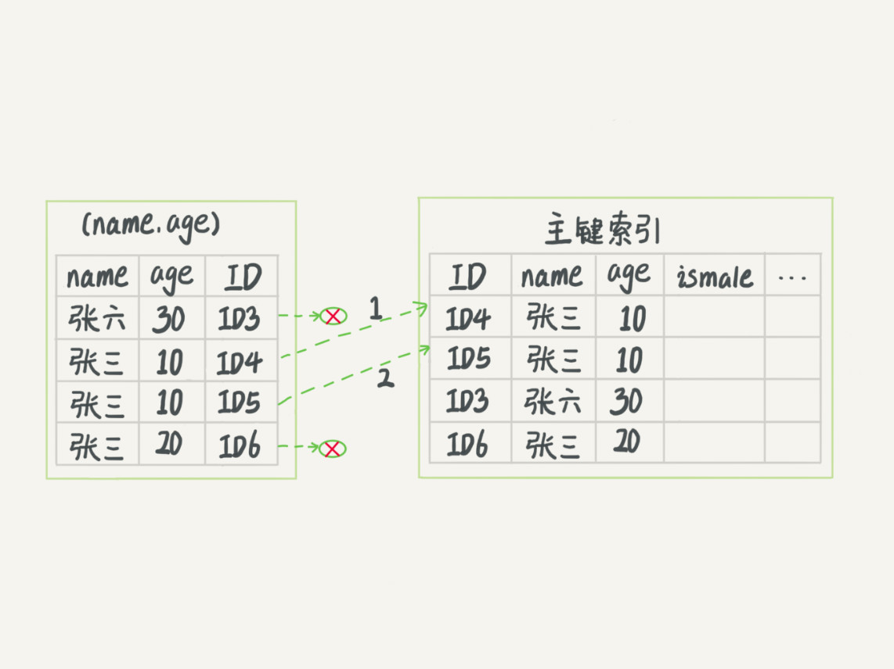

# 数据库索引

## 索引模型

### 常用索引模型

索引的出现是为了了提⾼高查询效率，但是实现索引的⽅方式却有很多种，所以 这⾥里里也就引⼊入了了索引模型的概念。可以⽤用于提⾼高读写效率的数据结构很多，这⾥里里我先给你介绍三种常⻅见、也⽐比较简单的数据结构，它们分别是哈 希表、有序数组和搜索树。

- 哈希

    哈希表是⼀一种以键 - 值(key-value)存储数据的结构，我们只要输⼊入待查 找的值即 key，就可以找到其对应的值即 Value。
    
    缺点是，因为不不是有 序的，所以哈希索引做区间查询的速度是很慢的。你可以设想下，如果你现在要找身份证号在 [ID_card_X, ID_card_Y] 这个区 间的所有⽤用户，就必须全部扫描⼀一遍了了。
    
- 有序数组

    ⽽而有序数组在等值查询和范围查询场景中的性能就都⾮非常优秀。但是，在需要更更 新数据的时候就麻烦了了，你往中间插⼊入⼀一个记录就必须得挪动后⾯面所有的 记录，成本太⾼高。
    
- 搜索树

    树可以有⼆二叉，也可以有多叉。多叉树就是每个节点有多个⼉儿⼦子，⼉儿⼦子之 间的⼤大⼩小保证从左到右递增。⼆二叉树是搜索效率最⾼高的，但是实际上⼤大多 数的数据库存储却并不不使⽤用⼆二叉树。其原因是，索引不不⽌止存在内存中，还 要写到磁盘上。
  
    你可以想象⼀一下⼀一棵 100 万节点的平衡⼆二叉树，树⾼高 20。⼀一次查询可能 需要访问 20 个数据块。
    
    为了了让⼀一个查询尽量量少地读磁盘，就必须让查询过程访问尽量量少的数据 块。那么，我们就不不应该使⽤用⼆二叉树，⽽而是要使⽤用“N 叉”树。这⾥里里，“N 叉”树中的“N”取决于数据块的⼤大⼩小。

### InnoDB 的索引模型

在 InnoDB 中，表都是根据主键顺序以索引的形式存放的，这种存储⽅方式 的表称为索引组织表。⼜又因为前⾯面我们提到的，InnoDB 使⽤用了了 B+ 树索引 模型，所以数据都是存储在 B+ 树中的。

每⼀一个索引在 InnoDB ⾥里里⾯面对应⼀一棵 B+ 树。B+树非叶子结点只存储键值，单个节点占空间小，索引块能够存储更多的节点，从磁盘读索引时所需的索引块更少，所以索引查找时I/O次数较B-Tree索引少，效率更高。而且B+Tree在叶子节点存放的记录以链表的形式链接，范围查找或遍历效率更高。

假设，我们有⼀一个主键列列为 ID 的表，表中有字段 k，并且在 k 上有索引。


从图中不不难看出，根据叶⼦子节点的内容，索引类型分为主键索引和⾮非主键索引。

主键索引的叶⼦子节点存的是整⾏行行数据。在 InnoDB ⾥里里，主键索引也被称为聚簇索引(clustered index)。 

⾮非主键索引的叶⼦子节点内容是主键的值。在 InnoDB ⾥里里，⾮非主键索引也被称为⼆二级索引(secondary index)。

根据上⾯面的索引结构说明，我们来讨论⼀一个问题:基于主键索引和普通索 引的查询有什什么区别?

- 如果语句句是 select * from T where ID=500，即主键查询⽅方式，则只 需要搜索 ID 这棵 B+ 树;
- 如果语句句是 select * from T where k=5，即普通索引查询⽅方式，则需 要先搜索 k 索引树，得到 ID 的值为 500，再到 ID 索引树搜索⼀一次。 这个过程称为回表。

也就是说，基于⾮非主键索引的查询需要多扫描⼀一棵索引树。因此，我们在 应⽤用中应该尽量量使⽤用主键查询。

### 索引维护

B+ 树为了了维护索引有序性，在插⼊入新值的时候需要做必要的维护。以上 ⾯面这个图为例例，如果插⼊入新的⾏行行 ID 值为 700，则只需要在 R5 的记录后⾯面 插⼊入⼀一个新记录。如果新插⼊入的 ID 值为 400，就相对麻烦了了，需要逻辑 上挪动后⾯面的数据，空出位置。

⽽而更更糟的情况是，如果 R5 所在的数据⻚页已经满了了，根据 B+ 树的算法， 这时候需要申请⼀一个新的数据⻚页，然后挪动部分数据过去。这个过程称为 ⻚页分裂。在这种情况下，性能⾃自然会受影响。

除了了性能外，⻚页分裂操作还影响数据⻚页的利利⽤用率。原本放在⼀一个⻚页的数 据，现在分到两个⻚页中，整体空间利利⽤用率降低⼤大约 50%。

当然有分裂就有合并。当相邻两个⻚页由于删除了了数据，利利⽤用率很低之后， 会将数据⻚页做合并。合并的过程，可以认为是分裂过程的逆过程。

#### 为什么不推荐使用业务字段做主键？

⾃自增主键是指⾃自增列列上定义的主键，在建表语句句中⼀一般是这么定义的: NOT NULL PRIMARY KEY AUTO_INCREMENT。
插⼊入新记录的时候可以不不指定 ID 的值，系统会获取当前 ID 最⼤大值加 1 作 为下⼀一条记录的 ID 值。
              
也就是说，⾃自增主键的插⼊入数据模式，正符合了了我们前⾯面提到的递增插⼊入 的场景。每次插⼊入⼀一条新记录，都是追加操作，都不不涉及到挪动其他记 录，也不不会触发叶⼦子节点的分裂。

⽽而有业务逻辑的字段做主键，则往往不不容易易保证有序插⼊入，这样写数据成 本相对较⾼高。

除了了考虑性能外，我们还可以从存储空间的⻆角度来看。假设你的表中确实 有⼀一个唯⼀一字段，⽐比如字符串串类型的身份证号，那应该⽤用身份证号做主 键，还是⽤用⾃自增字段做主键呢?

由于每个⾮非主键索引的叶⼦子节点上都是主键的值。如果⽤用身份证号做主 键，那么每个⼆二级索引的叶⼦子节点占⽤用约 20 个字节，⽽而如果⽤用整型做主 键，则只要 4 个字节，如果是⻓长整型(bigint)则是 8 个字节。

显然，主键⻓长度越⼩小，普通索引的叶⼦子节点就越⼩小，普通索引占⽤用的空间 也就越⼩小。

所以，从性能和存储空间⽅方⾯面考量量，⾃自增主键往往是更更合理理的选择

有没有什什么场景适合⽤用业务字段直接做主键的呢?还是有的。⽐比如，有些 业务的场景需求是这样的:

- 只有⼀一个索引;
- 该索引必须是唯⼀一索引。

你⼀定看出来了了，这就是典型的 KV 场景。由于没有其他索引，所以也就不不⽤用考虑其他索引的叶⼦子节点⼤大⼩小的问题。


## 索引的查询

在下⾯面这个表 T 中，如果我执⾏行行 select * from T where k between 3 and 5，需要执⾏行行⼏几次树的搜索操作，会扫描多少⾏?


现在，我们⼀一起来看看这条 SQL 查询语句句的执⾏行行流程:

- 在 k 索引树上找到 k=3 的记录，取得 ID = 300; C. 再到 ID 索引树查到 ID=300 对应的 R3;
- 在 k 索引树取下⼀一个值 k=5，取得 ID=500;
- 再回到 ID 索引树查到 ID=500 对应的 R4;
- 在 k 索引树取下⼀一个值 k=6，不不满⾜足条件，循环结束。

在这个过程中，回到主键索引树搜索的过程，我们称为回表。可以看到， 这个查询过程读了了 k 索引树的 3 条记录(步骤 1、3 和 5)，回表了了两次 (步骤 2 和 4)。

在这个例例⼦子中，由于查询结果所需要的数据只在主键索引上有，所以不不得不不回表。那么，有没有可能经过索引优化，避免回表过程呢?


### 覆盖索引

如果执⾏行行的语句句是 select ID from T where k between 3 and 5，这时只需 要查 ID 的值，⽽而 ID 的值已经在 k 索引树上了了，因此可以直接提供查询结 果，不不需要回表。也就是说，在这个查询⾥里里⾯面，索引 k 已经“覆盖了了”我们 的查询需求，我们称为覆盖索引。

由于覆盖索引可以减少树的搜索次数，显著提升查询性能，所以使⽤用覆盖 索引是⼀一个常⽤用的性能优化⼿手段。

>需要注意的是，在引擎内部使⽤用覆盖索引在索引 k 上其实读了了三个记录， R3~R5(对应的索引 k 上的记录项)，但是对于 MySQL 的 Server 层来 说，它就是找引擎拿到了了两条记录，因此 MySQL 认为扫描⾏行行数是 2。
>

于上⾯面覆盖索引的说明，我们来讨论⼀一个问题:在⼀一个市⺠民信息表上， 是否有必要将身份证号和名字建⽴立联合索引?

我们知道，身份证号是市⺠民的唯⼀一标识。也就是说，如果有根据身份证号 查询市⺠民信息的需求，我们只要在身份证号字段上建⽴立索引就够了了。⽽而再 建⽴立⼀一个(身份证号、姓名)的联合索引，是不不是浪费空间?

如果现在有⼀一个⾼高频请求，要根据市⺠民的身份证号查询他的姓名，这个联 合索引就有意义了了。它可以在这个⾼高频请求上⽤用到覆盖索引，不不再需要回 表查整⾏行行记录，减少语句句的执⾏行行时间。

当然，索引字段的维护总是有代价的。因此，在建⽴立冗余索引来⽀支持覆盖 索引时就需要权衡考虑了了。

### 最左前缀原则

如果为每⼀一种查询都设计⼀一个索引，索引是 不不是太多了了。如果我现在要按照市⺠民的身份证号去查他的家庭地址呢?虽 然这个查询需求在业务中出现的概率不不⾼高，但总不不能让它⾛走全表扫描吧? 反过来说，单独为⼀一个不不频繁的请求创建⼀一个(身份证号，地址)的索引 ⼜又感觉有点浪费。应该怎么做呢?

这⾥里里，我先和你说结论吧。B+ 树这种索引结构，可以利利⽤用索引的“最左前 缀”，来定位记录。

不只是索引的全部定义，只要满⾜足最左前缀，就可以利利⽤用索引 来加速检索。这个最左前缀可以是联合索引的最左 N 个字段，也可以是 字符串串索引的最左 M 个字符。

基于上⾯面对最左前缀索引的说明，我们来讨论⼀一个问题:在建⽴立联合索引 的时候，如何安排索引内的字段顺序。

这⾥里里我们的评估标准是，索引的复⽤用能⼒力力。因为可以⽀支持最左前缀，所以当已经有了了 (a,b) 这个联合索引后，⼀一般就不不需要单独在 a 上建⽴立索引 了了。因此，第⼀一原则是，如果通过调整顺序，可以少维护⼀一个索引，那么 这个顺序往往就是需要优先考虑采⽤用的。

么，如果既有联合查询，⼜又有基于 a、b 各⾃自的查询呢?查询条件⾥里里⾯面 只有 b 的语句句，是⽆无法使⽤用 (a,b) 这个联合索引的，这时候你不不得不不维护 另外⼀一个索引，也就是说你需要同时维护 (a,b)、(b) 这两个索引。

这时候，我们要考虑的原则就是空间了了。⽐比如上⾯面这个市⺠民表的情况， name 字段是⽐比 age 字段⼤大的 ，那我就建议你创建⼀一个(name,age) 的联 合索引和⼀一个 (age) 的单字段索引。

### 索引下推

我们还是以市⺠民表的联合索引(name, age)为例例。如果现在有⼀一个需 求:检索出表中“名字第⼀一个字是张，⽽而且年年龄是 10 岁的所有男孩”。

前缀索引规则，所以这个语句句在搜索索引树的时候，只能⽤用 “张”，找到第⼀一个满⾜足条件的记录 ID3。当然，这还不不错，总⽐比全表扫描 要好。然后呢? 当然是判断其他条件是否满⾜足。

在 MySQL 5.6 之前，只能从 ID3 开始⼀一个个回表。到主键索引上找出数 据⾏行行，再对⽐比字段值。

⽽而 MySQL 5.6 引⼊入的索引下推优化(index condition pushdown)， 可以 在索引遍历过程中，对索引中包含的字段先做判断，直接过滤掉不不满⾜足条 件的记录，减少回表次数。




在图 3 和 4 这两个图⾥里里⾯面，每⼀一个虚线箭头表示回表⼀一次。

图 3 中，在 (name,age) 索引⾥里里⾯面我特意去掉了了 age 的值，这个过程 InnoDB 并不不会去看 age 的值，只是按顺序把“name 第⼀一个字是’张’”的记 录⼀一条条取出来回表。因此，需要回表 4 次。

图 4 跟图 3 的区别是，InnoDB 在 (name,age) 索引内部就判断了了 age 是 否等于 10，对于不不等于 10 的记录，直接判断并跳过。在我们的这个例例⼦子 中，只需要对 ID4、ID5 这两条记录回表取数据判断，就只需要回表 2 次。


## 唯⼀索引与change buffer

假设你在维护⼀一个市⺠民系统，每个⼈人都有⼀一个唯⼀一的身份证号，⽽而且业务 代码已经保证了了不不会写⼊入两个重复的身份证号。如果市⺠民系统需要按照身 份证号查姓名，所以，你⼀一定会考虑在 id_card 字段上建索引。


由于身份证号字段⽐比较⼤大，我不不建议你把身份证号当做主键，那么现在你 有两个选择，要么给 id_card 字段创建唯⼀一索引，要么创建⼀一个普通索 引。如果业务代码已经保证了了不不会写⼊入重复的身份证号，那么这两个选择 逻辑上都是正确的。

### 查询过程

- 对于普通索引来说，查找到满⾜足条件的第⼀一个记录 (5,500) 后，需要 查找下⼀一个记录，直到碰到第⼀一个不不满⾜足 k=5 条件的记录。
- 对于唯⼀一索引来说，由于索引定义了了唯⼀一性，查找到第⼀一个满⾜足条件 的记录后，就会停⽌止继续检索。

性能差距会有多少呢?答案是，微乎其微。

你知道的，InnoDB 的数据是按数据⻚页为单位来读写的。也就是说，当需 要读⼀一条记录的时候，并不不是将这个记录本身从磁盘读出来，⽽而是以⻚页为 单位，将其整体读⼊入内存。在 InnoDB 中，每个数据⻚页的⼤大⼩小默认是 16KB。

因为引擎是按⻚页读写的，所以说，当找到 k=5 的记录的时候，它所在的数 据⻚页就都在内存⾥里里了了。那么，对于普通索引来说，要多做的那⼀一次“查找 和判断下⼀一条记录”的操作，就只需要⼀一次指针寻找和⼀一次计算。

当然，如果 k=5 这个记录刚好是这个数据⻚页的最后⼀一个记录，那么要取下 ⼀一个记录，必须读取下⼀一个数据⻚页，这个操作会稍微复杂⼀一些。

但是，我们之前计算过，对于整型字段，⼀一个数据⻚页可以放近千个 key， 因此出现这种情况的概率会很低。所以，我们计算平均性能差异时，仍可 以认为这个操作成本对于现在的 CPU 来说可以忽略略不不计。

### change buffer

当需要更更新⼀一个数据⻚页时，如果数据⻚页在内存中就直接更更新，⽽而如果这个 数据⻚页还没有在内存中的话，在不不影响数据⼀一致性的前提下，InooDB 会 将这些更更新操作缓存在 change buffer 中，这样就不不需要从磁盘中读⼊入这 个数据⻚页了了。在下次查询需要访问这个数据⻚页的时候，将数据⻚页读⼊入内 存，然后执⾏行行 change buffer 中与这个⻚页有关的操作。通过这种⽅方式就能 保证这个数据逻辑的正确性。

需要说明的是，虽然名字叫作 change buffer，实际上它是可以持久化的 数据。也就是说，change buffer 在内存中有拷⻉贝，也会被写⼊入到磁盘 上。

将 change buffer 中的操作应⽤用到原数据⻚页，得到最新结果的过程称为 merge。除了了访问这个数据⻚页会触发 merge 外，系统有后台线程会定期 merge。在数据库正常关闭(shutdown)的过程中，也会执⾏行行 merge 操 作。

显然，如果能够将更更新操作先记录在 change buffer，减少读磁盘，语句句 的执⾏行行速度会得到明显的提升。⽽而且，数据读⼊入内存是需要占⽤用 buffer pool 的，所以这种⽅方式还能够避免占⽤用内存，提⾼高内存利利⽤用率。

那么，什什么条件下可以使⽤用 change buffer 呢?

对于唯⼀一索引来说，所有的更更新操作都要先判断这个操作是否违反唯⼀一性 约束。⽐比如，要插⼊入 (4,400) 这个记录，就要先判断现在表中是否已经存 在 k=4 的记录，⽽而这必须要将数据⻚页读⼊入内存才能判断。如果都已经读 ⼊入到内存了了，那直接更更新内存会更更快，就没必要使⽤用 change buffer 了了。

因此，唯⼀一索引的更更新就不不能使⽤用 change buffer，实际上也只有普通索 引可以使⽤用。
c
hange buffer ⽤用的是 buffer pool ⾥里里的内存，因此不不能⽆无限增⼤大。change buffer 的⼤大⼩小，可以通过参数 innodb_change_buffer_max_size 来动态设 置。这个参数设置为 50 的时候，表示 change buffer 的⼤大⼩小最多只能占 ⽤用 buffer pool 的 50%。

### 更新过程

第⼀一种情况是，这个记录要更更新的⽬目标⻚页在内存中。这时，InnoDB 的处 理理流程如下:

- 对于唯⼀一索引来说，找到 3 和 5 之间的位置，判断到没有冲突，插 ⼊入这个值，语句句执⾏行行结束;
- 对于普通索引来说，找到 3 和 5 之间的位置，插⼊入这个值，语句句执 ⾏行行结束。

这样看来，普通索引和唯⼀一索引对更更新语句句性能影响的差别，只是⼀一个判 断，只会耗费微⼩小的 CPU 时间。

第⼆二种情况是，这个记录要更更新的⽬目标⻚页不不在内存中。这时，InnoDB 的 处理理流程如下:

- 对于唯⼀一索引来说，需要将数据⻚页读⼊入内存，判断到没有冲突，插⼊入 这个值，语句句执⾏行行结束;
- 对于普通索引来说，则是将更更新记录在 change buffer，语句句执⾏行行就 结束了了。

将数据从磁盘读⼊入内存涉及随机 IO 的访问，是数据库⾥里里⾯面成本最⾼高的操 作之⼀一。change buffer 因为减少了了随机磁盘访问，所以对更更新性能的提 升是会很明显的。

### change buffer 的使⽤用场景

普通索引的所有场景，使⽤用 change buffer 都可以起到加速作⽤用吗?

对于写多读少的业务来说，⻚页⾯面在写完以后⻢马上被访问到的概率⽐比 较⼩小，此时 change buffer 的使⽤用效果最好。这种业务模型常⻅见的就是账 单类、⽇日志类的系统。

反过来，假设⼀一个业务的更更新模式是写⼊入之后⻢马上会做查询，那么即使满 ⾜足了了条件，将更更新先记录在 change buffer，但之后由于⻢马上要访问这个 数据⻚页，会⽴立即触发 merge 过程。这样随机访问 IO 的次数不不会减少，反 ⽽而增加了了 change buffer 的维护代价。所以，对于这种业务模式来说， change buffer 反⽽而起到了了副作⽤用。

### change buffer 和 redo log

这⾥里里，我们假设当前 k 索引树的状态，查找到位置后，k1 所在的数据⻚页 在内存 (InnoDB buffer pool) 中，k2 所在的数据⻚页不不在内存中。如图 2 所 示是带 change buffer 的更更新状态图。


分析这条更更新语句句，你会发现它涉及了了四个部分:内存、redo log(ib_log_fileX)、 数据表空间(t.ibd)、系统表空间(ibdata1)。 

这条更更新语句句做了了如下的操作(按照图中的数字顺序):

- Page1在内存中，直接更更新内存;
- Page2没有在内存中，就在内存的changebuffer区域，记录下“我
要往 Page 2 插⼊入⼀一⾏行行”这个信息
- 将上述两个动作记⼊入 redo log 中(图中 3 和 4)。

做完上⾯面这些，事务就可以完成了了。所以，你会看到，执⾏行行这条更更新语句句的成本很低，就是写了了两处内存，然后写了了⼀一处磁盘(两次操作合在⼀一起 写了了⼀一次磁盘)，⽽而且还是顺序写的。

同时，图中的两个虚线箭头，是后台操作，不不影响更更新的响应时间。

那在这之后的读请求，要怎么处理理呢?

- 读 Page 1 的时候，直接从内存返回。有⼏几位同学在前⾯面⽂文章的评论中问到，WAL 之后如果读数据，是不不是⼀一定要读盘，是不不是⼀一定要 从 redo log ⾥里里⾯面把数据更更新以后才可以返回?其实是不不⽤用的。你可以 看⼀一下图 3 的这个状态，虽然磁盘上还是之前的数据，但是这⾥里里直接 从内存返回结果，结果是正确的。
- 要读 Page 2 的时候，需要把 Page 2 从磁盘读⼊入内存中，然后应⽤用 change buffer ⾥里里⾯面的操作⽇日志，⽣生成⼀一个正确的版本并返回结果。

可以看到，直到需要读 Page 2 的时候，这个数据⻚页才会被读⼊入内存。

所以，如果要简单地对⽐比这两个机制在提升更更新性能上的收益的话，redo log 主要节省的是随机写磁盘的 IO 消耗(转成顺序写)，⽽而 change buffer 主要节省的则是随机读磁盘的 IO 消耗。

merge 的执⾏行行流程是这样的:

-  从磁盘读⼊入数据⻚页到内存(⽼老老版本的数据⻚页);
- 从 change buffer ⾥里里找出这个数据⻚页的 change buffer 记录 (可能有多 个)，依次应⽤用，得到新版数据⻚页;
- 写 redo log。这个 redo log 包含了了数据的变更更和 change buffer 的变 更更。

## 前缀索引

### 前缀索引的长度选择

这两个在 email 字段上创建索引的语句句:

```
mysql> alter table SUser add index index1(email);
或
mysql> alter table SUser add index index2(email(6));

```

第⼀一个语句句创建的 index1 索引⾥里里⾯面，包含了了每个记录的整个字符串串;⽽而 第⼆二个语句句创建的 index2 索引⾥里里⾯面，对于每个记录都是只取前 6 个字 节。

由于 email(6) 这个索引结构中每个邮箱字段都只取前 6 个字节(即:zhangs)，所以占⽤用的空间会更更⼩小，这就是使⽤用前缀索引 的优势。但，这同时带来的损失是，可能会增加额外的记录扫描次数。

```
select id,name,email from SUser where email='zhangssxyz@xxx.com';

```

如果使⽤用的是 index1(即 email 整个字符串串的索引结构)，执⾏行行顺序是这 样的:

- 从 index1 索引树找到满⾜足索引值是’zhangssxyz@xxx.com’的这条记 录，取得 ID2 的值;
- 到主键上查到主键值是 ID2 的⾏行行，判断 email 的值是正确的，将这⾏行行 记录加⼊入结果集;
- 取 index1 索引树上刚刚查到的位置的下⼀一条记录，发现已经不不满⾜足 email='zhangssxyz@xxx.com’的条件了了，循环结束。

这个过程中，只需要回主键索引取⼀一次数据，所以系统认为只扫描了了⼀一 ⾏行行。

如果使⽤用的是 index2(即 email(6) 索引结构)，执⾏行行顺序是这样的:

- 从 index2 索引树找到满⾜足索引值是’zhangs’的记录，找到的第⼀一个
是 ID1;
- 到主键上查到主键值是 ID1 的⾏行行，判断出 email 的值不不
是’zhangssxyz@xxx.com’，这⾏行行记录丢弃;
- 取 index2 上刚刚查到的位置的下⼀一条记录，发现仍然是’zhangs’， 取出 ID2，再到 ID 索引上取整⾏行行然后判断，这次值对了了，将这⾏行行记 录加⼊入结果集;
- 重复上⼀一步，直到在 idxe2 上取到的值不不是’zhangs’时，循环结束。

在这个过程中，要回主键索引取 4 次数据，也就是扫描了了 4 ⾏行行。

通过这个对⽐比，你很容易易就可以发现，使⽤用前缀索引后，可能会导致查询 语句句读数据的次数变多。

但是，对于这个查询语句句来说，如果你定义的 index2 不不是 email(6) ⽽而是 email(7)，也就是说取 email 字段的前 7 个字节来构建索引的话，即满⾜足 前缀’zhangss’的记录只有⼀一个，也能够直接查到 ID2，只扫描⼀一⾏行行就结束 了了。

实际上，我们在建⽴立索引时关注的是区分度，区分度越⾼高越好。因为区分 度越⾼高，意味着重复的键值越少。因此，我们可以通过统计索引上有多少 个不不同的值来判断要使⽤用多⻓长的前缀。

### 前缀索引对覆盖索引的影响

```
select id,name,email from SUser where email='zhangssxyz@xxx.com';

```

相⽐比，这个语句句只要求返回 id 和 email 字段。

所以，如果使⽤用 index1(即 email 整个字符串串的索引结构)的话，可以利利 ⽤用覆盖索引，从 index1 查到结果后直接就返回了了，不不需要回到 ID 索引再 去查⼀一次。⽽而如果使⽤用 index2(即 email(6) 索引结构)的话，就不不得不不 回到 ID 索引再去判断 email 字段的值。

即使你将 index2 的定义修改为 email(18) 的前缀索引，这时候虽然 index2 已经包含了了所有的信息，但 InnoDB 还是要回到 id 索引再查⼀一下，因为系 统并不不确定前缀索引的定义是否截断了了完整信息。
也就是说，使⽤用前缀索引就⽤用不不上覆盖索引对查询性能的优化了了，这也是 你在选择是否使⽤用前缀索引时需要考虑的⼀一个因素。

## 选错索引的原因?

### 扫描⾏数

MySQL 在真正开始执⾏行行语句句之前，并不不能精确地知道满⾜足这个条件的记录有多少条，⽽而只能根据统计信息来估算记录数。

这个统计信息就是索引的“区分度”。显然，⼀一个索引上不不同的值越多，这 个索引的区分度就越好。⽽而⼀一个索引上不不同的值的个数，我们称之为“基 数”(cardinality)。也就是说，这个基数越⼤大，索引的区分度越好。

我们可以使⽤用 show index ⽅方法，看到⼀一个索引的基数。


那么，MySQL 是怎样得到索引的基数的呢? 是 MySQL 采样统计的⽅方法。

采样统计的时候，InnoDB 默认会选择 N 个数据⻚页，统计这些⻚页⾯面上的不不 同值，得到⼀一个平均值，然后乘以这个索引的⻚页⾯面数，就得到了了这个索引 的基数。

⽽而数据表是会持续更更新的，索引统计信息也不不会固定不不变。所以，当变更更的数据⾏行行数超过 1/M 的时候，会⾃自动触发重新做⼀一次索引统计。

在 MySQL 中，有两种存储索引统计的⽅方式，可以通过设置参数 innodb_stats_persistent 的值来选择:

- 设置为 on 的时候，表示统计信息会持久化存储。这时，默认的 N 是 20，M 是 10。
- 设置为 off 的时候，表示统计信息只存储在内存中。这时，默认的 N 是 8，M 是 16。

由于是采样统计，所以不不管 N 是 20 还是 8，这个基数都是很容易易不不准 的。

统计信息不不对，那就修正。analyze table t 命令，可以⽤用来重新统 计索引信息。

### 回表

优化器器为什什么放着扫描 37000 ⾏行行的执⾏行行计划不不⽤用，却选择了了扫描⾏行行数是 100000 的执⾏行行计划 呢?

这是因为，如果使⽤用索引 a，每次从索引 a 上拿到⼀一个值，都要回到主键 索引上查出整⾏行行数据，这个代价优化器器也要算进去的。

⽽如果选择扫描 10 万行，是直接在主键索引上扫描的，没有额外的代价。

### 排序

```
mysql> select * from t where (a between 1 and 1000) and (b between 50000 and 100000) order by b limit 1;

```


如果使⽤用索引 a 进⾏行行查询，那么就是扫描索引 a 的前 1000 个值，然后取 到对应的 id，再到主键索引上去查出每⼀一⾏行行，然后根据字段 b 来过滤。显然这样需要扫描 1000 ⾏行行。
  
如果使⽤用索引 b 进⾏行行查询，那么就是扫描索引 b 的最后 50001 个值，与 上⾯面的执⾏行行过程相同，也是需要回到主键索引上取值再判断，所以需要扫 描 50001 ⾏行行。

优化器器选择使⽤用索引 b，是因为它认为使⽤用索引 b 可以避免排序(b 本身是索引，已经是有序的了了，如果选择索引 b 的话，不不需要再做排序， 只需要遍历)，所以即使扫描⾏行行数多，也判定为代价更更⼩小。


## 表数据重建

### 为什么要进行数据重建

#### `innodb_file_per_table`

⼀个 InnoDB 表包含两部分，即:表结构定义和数据。在 MySQL 8.0 版本以 前，表结构是存在以.frm 为后缀的⽂文件⾥里里。⽽而 MySQL 8.0 版本，则已经 允许把表结构定义放在系统数据表中了了。因为表结构定义占⽤用的空间很小，所以我们今天主要讨论的是表数据。

表数据既可以存在共享表空间⾥里里，也可以是单独的⽂文件。这个⾏行行为是由参 数 innodb_file_per_table 控制的:

- 这个参数设置为 OFF 表示的是，表的数据放在系统共享表空间，也 就是跟数据字典放在⼀一起;
- 这个参数设置为 ON 表示的是，每个 InnoDB 表数据存储在⼀一个以 .ibd 为后缀的⽂文件中。

从 MySQL 5.6.6 版本开始，它的默认值就是 ON 了了。

我建议你不不论使⽤用 MySQL 的哪个版本，都将这个值设置为 ON。因为， ⼀一个表单独存储为⼀一个⽂文件更更容易易管理理，⽽而且在你不不需要这个表的时候， 通过 drop table 命令，系统就会直接删除这个⽂文件。⽽而如果是放在共享表 空间中，即使表删掉了了，空间也是不不会回收的。

我们在删除整个表的时候，可以使⽤用 drop table 命令回收表空间。但是， 我们遇到的更更多的删除数据的场景是删除某些⾏行行，这时就遇到了了我们⽂文章 开头的问题:表中的数据被删除了了，但是表空间却没有被回收。

#### 数据删除流程


假设，我们要删掉 R4 这个记录，InnoDB 引擎只会把 R4 这个记录标记为 删除。如果之后要再插⼊入⼀一个 ID 在 300 和 600 之间的记录时，可能会复 ⽤用这个位置。但是，磁盘⽂文件的⼤大⼩小并不不会缩⼩小。

现在，你已经知道了了 InnoDB 的数据是按⻚页存储的，那么如果我们删掉了了 ⼀一个数据⻚页上的所有记录，会怎么样?

答案是，整个数据⻚页就可以被复⽤用了了。

但是，数据⻚页的复⽤用跟记录的复⽤用是不不同的。

记录的复⽤用，只限于符合范围条件的数据。⽐比如上⾯面的这个例例⼦子，R4 这 条记录被删除后，如果插⼊入⼀一个 ID 是 400 的⾏行行，可以直接复⽤用这个空 间。但如果插⼊入的是⼀一个 ID 是 800 的⾏行行，就不不能复⽤用这个位置了了。

⽽而当整个⻚页从 B+ 树⾥里里⾯面摘掉以后，可以复⽤用到任何位置。以图 1 为例例， 如果将数据⻚页 page A 上的所有记录删除以后，page A 会被标记为可复⽤用。这时候如果要插⼊入⼀一条 ID=50 的记录需要使⽤用新⻚页的时候，page A 是可以被复⽤用的。

如果相邻的两个数据⻚页利利⽤用率都很⼩小，系统就会把这两个⻚页上的数据合到 其中⼀一个⻚页上，另外⼀一个数据⻚页就被标记为可复⽤用。

进⼀一步地，如果我们⽤用 delete 命令把整个表的数据删除呢?结果就是， 所有的数据⻚页都会被标记为可复⽤用。但是磁盘上，⽂文件不不会变⼩小。

你现在知道了了，delete 命令其实只是把记录的位置，或者数据⻚页标记为 了了“可复⽤用”，但磁盘⽂文件的⼤大⼩小是不不会变的。也就是说，通过 delete 命 令是不不能回收表空间的。这些可以复⽤用，⽽而没有被使⽤用的空间，看起来就 像是“空洞洞”。

实际上，不不⽌止是删除数据会造成空洞洞，插⼊入数据也会。

如果数据是按照索引递增顺序插⼊入的，那么索引是紧凑的。但如果数据是随机插⼊入的，就可能造成索引的数据⻚页分裂。

假设图 1 中 page A 已经满了了，这时我要再插⼊入⼀一⾏行行数据，会怎样呢?


另外，更更新索引上的值，可以理理解为删除⼀一个旧的值，再插⼊入⼀一个新值。不不难理理解，这也是会造成空洞洞的。

也就是说，经过⼤大量量增删改的表，都是可能是存在空洞洞的。所以，如果能 够把这些空洞洞去掉，就能达到收缩表空间的⽬目的。

⽽而重建表，就可以达到这样的⽬目的。

### 重建表

可以新建⼀一个与表 A 结构相同的表 B，然后按照主键 ID 递增的顺序， 把数据⼀一⾏行行⼀一⾏行行地从表 A ⾥里里读出来再插⼊入到表 B 中。

由于表 B 是新建的表，所以表 A 主键索引上的空洞洞，在表 B 中就都不不存 在了了。显然地，表 B 的主键索引更更紧凑，数据⻚页的利利⽤用率也更更⾼高。如果我 们把表 B 作为临时表，数据从表 A 导⼊入表 B 的操作完成后，⽤用表 B 替换 A，从效果上看，就起到了了收缩表 A 空间的作⽤用。

这⾥里里，你可以使⽤用 alter table A engine=InnoDB 命令来重建表。在 MySQL 5.5 版本之前，这个命令的执⾏行行流程跟我们前⾯面描述的差不不多，区 别只是这个临时表 B 不不需要你⾃自⼰己创建，MySQL 会⾃自动完成转存数据、 交换表名、删除旧表的操作。

显然，花时间最多的步骤是往临时表插⼊入数据的过程，如果在这个过程 中，有新的数据要写⼊入到表 A 的话，就会造成数据丢失。因此，在整个 DDL 过程中，表 A 中不不能有更更新。也就是说，这个 DDL 不不是 Online 的。

⽽而在MySQL 5.6 版本开始引⼊入的 Online DDL，对这个操作流程做了了优 化。


我给你简单描述⼀一下引⼊入了了 Online DDL 之后，重建表的流程:

- 建⽴立⼀一个临时⽂文件，扫描表 A 主键的所有数据⻚页;
- ⽤用数据⻚页中表 A 的记录⽣生成 B+ 树，存储到临时⽂文件中;
- ⽣生成临时⽂文件的过程中，将所有对 A 的操作记录在⼀一个⽇日志⽂文件 (row log)中，对应的是图中 state2 的状态;
- 临时⽂文件⽣生成后，将⽇日志⽂文件中的操作应⽤用到临时⽂文件，得到⼀一个逻辑数据上与表 A 相同的数据⽂文件，对应的就是图中 state3 的状态; 
- ⽤用临时⽂文件替换表 A 的数据⽂文件。

可以看到，与图 3 过程的不不同之处在于，由于⽇日志⽂文件记录和重放操作这 个功能的存在，这个⽅方案在重建表的过程中，允许对表 A 做增删改操作。 这也就是 Online DDL 名字的来源。

alter 语句句在启动的时候需要获取 MDL 写锁，但是 这个写锁在真正拷⻉贝数据之前就退化成读锁了了。

为什什么要退化呢?为了了实现 Online，MDL 读锁不不会阻塞增删改操作。

那为什什么不不⼲干脆直接解锁呢?为了了保护⾃自⼰己，禁⽌止其他线程对这个表同时 做 DDL。

⽽而对于⼀一个⼤大表来说，Online DDL 最耗时的过程就是拷⻉贝数据到临时表 的过程，这个步骤的执⾏行行期间可以接受增删改操作。所以，相对于整个 DDL 过程来说，锁的时间⾮非常短。对业务来说，就可以认为是 Online 的。

### Online 和 inplace

我们把表 A 中的数据导出来的存放位置叫作 tmp_table。这是⼀一个临时表，是在 server 层创建的。

在图 4 中，根据表 A 重建出来的数据是放在“tmp_file”⾥里里的，这个临时⽂文 件是 InnoDB 在内部创建出来的。整个 DDL 过程都在 InnoDB 内部完成。 对于 server 层来说，没有把数据挪动到临时表，是⼀一个“原地”操作，这 就是“inplace”名称的来源。

所以，我现在问你，如果你有⼀一个 1TB 的表，现在磁盘间是 1.2TB，能不不 能做⼀一个 inplace 的 DDL 呢? 答案是不不能。因为，tmp_file 也是要占⽤用临时空间的。

跟 inplace 对应的就是拷⻉贝表的⽅方式了，表示的是强制拷⻉贝表，对应的流程就是图 3 的操作过程。


## count(*) 的优化

### MyISAM 引擎

MyISAM 引擎把⼀一个表的总⾏行行数存在了了磁盘上，因此执⾏行行 count(*) 的 时候会直接返回这个数，效率很⾼高;

### InnoDB 引擎

这是因为即使是在同⼀一个时刻的多个查询，由于多版本并发控制 (MVCC)的原因，InnoDB 表“应该返回多少⾏行行”也是不不确定的。

这和 InnoDB 的事务设计有关系，可重复读是它默认的隔离级别，在代码 上就是通过多版本并发控制，也就是 MVCC 来实现的。每⼀一⾏行行记录都要 判断⾃自⼰己是否对这个会话可⻅见，因此对于 count(*) 请求来说，InnoDB 只 好把数据⼀一⾏行行⼀一⾏行行地读出依次判断，可⻅见的⾏行行才能够⽤用于计算“基于这个 查询”的表的总⾏行行数。

InnoDB 是索引组织表，主键索引树的叶⼦子节点是数据，⽽而普 通索引树的叶⼦子节点是主键值。所以，普通索引树⽐比主键索引树⼩小很多。 对于 count(*) 这样的操作，遍历哪个索引树得到的结果逻辑上都是⼀一样 的。因此，MySQL 优化器器会找到最⼩小的那棵树来遍历。在保证逻辑正确 的前提下，尽量量减少扫描的数据量量，是数据库系统设计的通⽤用法则之⼀一。


## 类型转化对索引的影响

### 条件字段函数

```
mysql> select count(*) from tradelog where month(t_modified)=7;

```

对索引字段做函数操作，可能会破坏索引值的有序性，因此优 化器器就决定放弃⾛走树搜索功能。

需要注意的是，优化器器并不不是要放弃使⽤用这个索引。

在这个例例⼦子⾥里里，放弃了了树搜索功能，优化器器可以选择遍历主键索引，也可 以选择遍历索引 t_modified，优化器器对⽐比索引⼤大⼩小后发现，索引 t_modified 更更⼩小，遍历这个索引⽐比遍历主键索引来得更更快。因此最终还是 会选择索引 t_modified。

也就是说，由于在 t_modified 字段加了了 month() 函数操作，导致了了全索引 扫描。

### 隐式类型转换

```
mysql> select * from tradelog where tradeid=110717;

```
交易易编号 tradeid 这个字段上，本来就有索引，但是 explain 的结果却显 示，这条语句句需要⾛走全表扫描。你可能也发现了了，tradeid 的字段类型是 varchar(32)，⽽而输⼊入的参数却是整型，所以需要做类型转换。

### 隐式字符编码转换

```
mysql> select d.* from tradelog l, trade_detail d where d.tradeid=l.tradeid and l.id=2;

```

这两个表的字符集不不 同，⼀一个是 utf8，⼀一个是 utf8mb4，所以做表连接查询的时候⽤用不不上关联 字段的索引。

