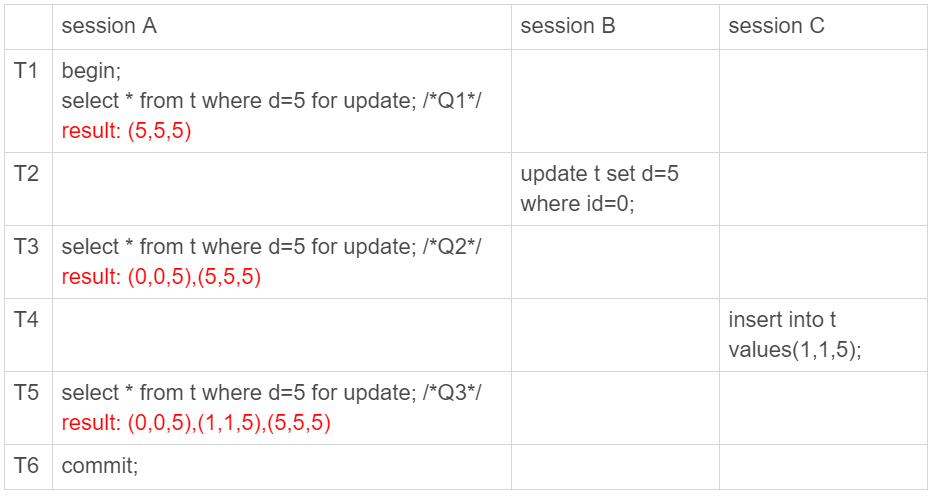
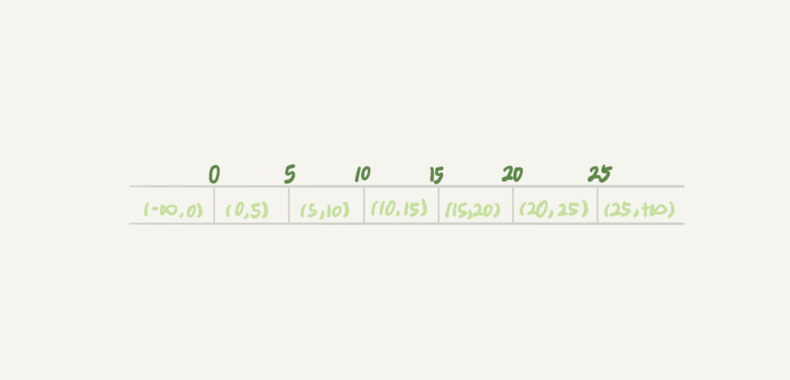

# 数据库锁

## 锁

根据加锁的范围，MySQL ⾥里里⾯面的锁⼤大致可以分成全局锁、表级锁和⾏锁 三类。

### 全局锁

顾名思义，全局锁就是对整个数据库实例例加锁。MySQL 提供了了⼀一个加全 局读锁的⽅方法，命令是 Flush tables with read lock (FTWRL)。当你需要让 整个库处于只读状态的时候，可以使⽤用这个命令，之后其他线程的以下语 句句会被阻塞:数据更更新语句句(数据的增删改)、数据定义语句句(包括建 表、修改表结构等)和更更新类事务的提交语句句。

全局锁的典型使⽤用场景是，做全库逻辑备份。也就是把整库每个表都 select 出来存成⽂文本。

以前有⼀一种做法，是通过 FTWRL 确保不不会有其他线程对数据库做更更新， 然后对整个库做备份。注意，在备份过程中整个库完全处于只读状态。

官⽅方⾃自带的逻辑备份⼯工具是 mysqldump。当 mysqldump 使⽤用参数– single-transaction 的时候，导数据之前就会启动⼀一个事务，来确保拿到⼀致性视图。⽽而由于 MVCC 的⽀支持，这个过程中数据是可以正常更更新 的。

你⼀定在疑惑，有了了这个功能，为什什么还需要 FTWRL 呢?⼀一致性读是 好，但前提是引擎要⽀支持这个隔离级别。⽐比如，对于 MyISAM 这种不不⽀支持 事务的引擎，如果备份过程中有更更新，总是只能取到最新的数据，那么就 破坏了了备份的⼀一致性。这时，我们就需要使⽤用 FTWRL 命令了了。

业务的更更新不不只是增删改数据(DML)，还有可能是加字段等修改表结构 的操作(DDL)。不不论是哪种⽅方法，⼀一个库被全局锁上以后，你要对⾥里里⾯面 任何⼀一个表做加字段操作，都是会被锁住的。

### 表级锁

MySQL ⾥里里⾯面表级别的锁有两种:⼀一种是表锁，⼀一种是元数据锁(meta data lock，MDL)。

表锁的语法是 lock tables ... read/write。与 FTWRL 类似，可以⽤用 unlock tables 主动释放锁，也可以在客户端断开的时候⾃自动释放。需要注 意，lock tables 语法除了了会限制别的线程的读写外，也限定了了本线程接下 来的操作对象。

举个例例⼦子, 如果在某个线程 A 中执⾏行行 lock tables t1 read, t2 write; 这个语 句句，则其他线程写 t1、读写 t2 的语句句都会被阻塞。同时，线程 A 在执⾏行行 unlock tables 之前，也只能执⾏行行读 t1、读写 t2 的操作。连写 t1 都不不允 许，⾃自然也不不能访问其他表。

在还没有出现更更细粒度的锁的时候，表锁是最常⽤用的处理理并发的⽅方式。⽽而 对于 InnoDB 这种⽀支持⾏行行锁的引擎，⼀一般不不使⽤用 lock tables 命令来控制并 发，毕竟锁住整个表的影响⾯面还是太⼤大。

另⼀一类表级的锁是 MDL(metadata lock)。MDL 不不需要显式使⽤用，在访 问⼀一个表的时候会被⾃自动加上。MDL 的作⽤用是，保证读写的正确性。你 可以想象⼀一下，如果⼀一个查询正在遍历⼀一个表中的数据，⽽而执⾏行行期间另⼀一 个线程对这个表结构做变更更，删了了⼀一列列，那么查询线程拿到的结果跟表结 构对不不上，肯定是不不⾏行行的。

因此，在 MySQL 5.5 版本中引⼊入了了 MDL，当对⼀一个表做增删改查操作的 时候，加 MDL 读锁;当要对表做结构变更更操作的时候，加 MDL 写锁。

- 读锁之间不不互斥，因此你可以有多个线程同时对⼀一张表增删改查。
- 读写锁之间、写锁之间是互斥的，⽤用来保证变更更表结构操作的安全 性。因此，如果有两个线程要同时给⼀一个表加字段，其中⼀一个要等另 ⼀一个执⾏行行完才能开始执⾏行行。

虽然 MDL 锁是系统默认会加的，但却是你不不能忽略略的⼀一个机制。⽐比如下 ⾯面这个例例⼦子，我经常看到有⼈人掉到这个坑⾥里里:给⼀一个⼩小表加个字段，导致 整个库挂了了。

我们可以看到 session A 先启动，这时候会对表 t 加⼀一个 MDL 读锁。由于 session B 需要的也是 MDL 读锁，因此可以正常执⾏行行。

之后 session C 会被 blocked，是因为 session A 的 MDL 读锁还没有释 放，⽽而 session C 需要 MDL 写锁，因此只能被阻塞。
如果只有 session C ⾃自⼰己被阻塞还没什什么关系，但是之后所有要在表 t 上 新申请 MDL 读锁的请求也会被 session C 阻塞。前⾯面我们说了了，所有对 表的增删改查操作都需要先申请 MDL 读锁，就都被锁住，等于这个表现 在完全不不可读写了了。

如果某个表上的查询语句句频繁，⽽而且客户端有重试机制，也就是说超时后 会再起⼀一个新 session 再请求的话，这个库的线程很快就会爆满。

你现在应该知道了了，事务中的 MDL 锁，在语句句执⾏行行开始时申请，但是语 句句结束后并不不会⻢马上释放，⽽而会等到整个事务提交后再释放。

基于上⾯面的分析，我们来讨论⼀一个问题，如何安全地给⼩小表加字段?

⾸首先我们要解决⻓长事务，事务不不提交，就会⼀一直占着 MDL 锁。在 MySQL 的 information_schema 库的 innodb_trx 表中，你可以查到当前执⾏行行中的 事务。如果你要做 DDL 变更更的表刚好有⻓长事务在执⾏行行，要考虑先暂停 DDL，或者 kill 掉这个⻓长事务。
但考虑⼀一下这个场景。如果你要变更更的表是⼀一个热点表，虽然数据量量不不 ⼤大，但是上⾯面的请求很频繁，⽽而你不不得不不加个字段，你该怎么做呢?

这时候 kill 可能未必管⽤用，因为新的请求⻢马上就来了了。⽐比较理理想的机制 是，在 alter table 语句句⾥里里⾯面设定等待时间，如果在这个指定的等待时间⾥里里 ⾯面能够拿到 MDL 写锁最好，拿不不到也不不要阻塞后⾯面的业务语句句，先放 弃。之后开发⼈人员或者 DBA 再通过重试命令重复这个过程。

### ⾏锁

MySQL 的⾏行行锁是在引擎层由各个引擎⾃自⼰己实现的。但并不不是所有的引擎 都⽀支持⾏行行锁，⽐比如 MyISAM 引擎就不不⽀支持⾏行行锁。不不⽀支持⾏行行锁意味着并发控 制只能使⽤用表锁，对于这种引擎的表，同⼀一张表上任何时刻只能有⼀一个更更 新在执⾏行行，这就会影响到业务并发度。InnoDB 是⽀支持⾏行行锁的，这也是 MyISAM 被 InnoDB 替代的重要原因之⼀。

#### 两阶段锁

这个问题的结论取决于事务 A 在执⾏行行完两条 update 语句句后，持有哪些 锁，以及在什什么时候释放。你可以验证⼀一下:实际上事务 B 的 update 语 句句会被阻塞，直到事务 A 执⾏行行 commit 之后，事务 B 才能继续执⾏行行。

知道了了这个答案，你⼀一定知道了了事务 A 持有的两个记录的⾏行行锁，都是在 commit 的时候才释放的。

也就是说，在 InnoDB 事务中，⾏行行锁是在需要的时候才加上的，但并不不是 不不需要了了就⽴立刻释放，⽽而是要等到事务结束时才释放。这个就是两阶段锁 协议。

知道了了这个设定，对我们使⽤用事务有什什么帮助呢?那就是，如果你的事务 中需要锁多个⾏行行，要把最可能造成锁冲突、最可能影响并发度的锁尽量量往后放。

#### 死锁和死锁检测

当并发系统中不不同线程出现循环资源依赖，涉及的线程都在等待别的线程 释放资源时，就会导致这⼏几个线程都进⼊入⽆无限等待的状态，称为死锁。这⾥里里我⽤用数据库中的⾏行行锁举个例例⼦子。

这时候，事务 A 在等待事务 B 释放 id=2 的⾏行行锁，⽽而事务 B 在等待事务 A 释放 id=1 的⾏行行锁。 事务 A 和事务 B 在互相等待对⽅方的资源释放，就是进 ⼊入了了死锁状态。当出现死锁以后，有两种策略略:

- ⼀种策略略是，直接进⼊入等待，直到超时。这个超时时间可以通过参数 innodb_lock_wait_timeout 来设置。
- 另⼀一种策略略是，发起死锁检测，发现死锁后，主动回滚死锁链条中的 某⼀一个事务，让其他事务得以继续执⾏行行。将参数 innodb_deadlock_detect 设置为 on，表示开启这个逻辑。

在 InnoDB 中，innodb_lock_wait_timeout 的默认值是 50s，意味着如果采 ⽤用第⼀一个策略略，当出现死锁以后，第⼀一个被锁住的线程要过 50s 才会超时 退出，然后其他线程才有可能继续执⾏行行。对于在线服务来说，这个等待时 间往往是⽆无法接受的。
  
但是，我们⼜又不不可能直接把这个时间设置成⼀一个很⼩小的值，⽐比如 1s。这样当出现死锁的时候，确实很快就可以解开，但如果不不是死锁，⽽而是简单的 锁等待呢?所以，超时时间设置太短的话，会出现很多误伤。

所以，正常情况下我们还是要采⽤用第⼆二种策略略，即:主动死锁检测，⽽而且 innodb_deadlock_detect 的默认值本身就是 on。主动死锁检测在发⽣生死 锁的时候，是能够快速发现并进⾏行行处理理的，但是它也是有额外负担的。

你可以想象⼀一下这个过程:每当⼀一个事务被锁的时候，就要看看它所依赖 的线程有没有被别⼈人锁住，如此循环，最后判断是否出现了了循环等待，也 就是死锁。

那如果是我们上⾯面说到的所有事务都要更更新同⼀一⾏行行的场景呢?

每个新来的被堵住的线程，都要判断会不不会由于⾃自⼰己的加⼊入导致了了死锁， 这是⼀一个时间复杂度是 O(n) 的操作。假设有 1000 个并发线程要同时更更新 同⼀一⾏行行，那么死锁检测操作就是 100 万这个量量级的。虽然最终检测的结果 是没有死锁，但是这期间要消耗⼤大量量的 CPU 资源。因此，你就会看到 CPU 利利⽤用率很⾼高，但是每秒却执⾏行行不不了了⼏几个事务。

根据上⾯面的分析，我们来讨论⼀一下，怎么解决由这种热点⾏行行更更新导致的性 能问题呢?问题的症结在于，死锁检测要耗费⼤大量量的 CPU 资源。

⼀种头痛医头的⽅方法，就是如果你能确保这个业务⼀一定不不会出现死锁，可 以临时把死锁检测关掉。但是这种操作本身带有⼀一定的⻛风险，因为业务设 计的时候⼀一般不不会把死锁当做⼀一个严重错误，毕竟出现死锁了了，就回滚， 然后通过业务重试⼀一般就没问题了了，这是业务⽆无损的。⽽而关掉死锁检测意 味着可能会出现⼤大量量的超时，这是业务有损的。

另⼀个思路路是控制并发度。根据上⾯面的分析，你会发现如果并发能够控制 住，⽐比如同⼀一⾏行行同时最多只有 10 个线程在更更新，那么死锁检测的成本很 低，就不不会出现这个问题。⼀一个直接的想法就是，在客户端做并发控制。 但是，你会很快发现这个⽅方法不不太可⾏行行，因为客户端很多。我⻅见过⼀一个应 ⽤用，有 600 个客户端，这样即使每个客户端控制到只有 5 个并发线程， 汇总到数据库服务端以后，峰值并发数也可能要达到 3000。

因此，这个并发控制要做在数据库服务端。如果你有中间件，可以考虑在 中间件实现;如果你的团队有能修改 MySQL 源码的⼈人，也可以做在
MySQL ⾥里里⾯面。基本思路路就是，对于相同⾏行行的更更新，在进⼊入引擎之前排 队。这样在 InnoDB 内部就不不会有⼤大量量的死锁检测⼯工作了了。

可能你会问，如果团队⾥里里暂时没有数据库⽅方⾯面的专家，不不能实现这样的⽅方 案，能不不能从设计上优化这个问题呢?

你可以考虑通过将⼀一⾏行行改成逻辑上的多⾏行行来减少锁冲突。还是以影院账户 为例例，可以考虑放在多条记录上，⽐比如 10 个记录，影院的账户总额等于 这 10 个记录的值的总和。这样每次要给影院账户加⾦金金额的时候，随机选 其中⼀一条记录来加。这样每次冲突概率变成原来的 1/10，可以减少锁等待 个数，也就减少了了死锁检测的 CPU 消耗。

这个⽅方案看上去是⽆无损的，但其实这类⽅方案需要根据业务逻辑做详细设计。如果账户余额可能会减少，⽐比如退票逻辑，那么这时候就需要考虑当⼀一部分⾏行行记录变成 0 的时候，代码要有特殊处理理。

## 事务中的锁

我们需要注意的是事务的启动时机。

begin/start transaction 命令并不不是⼀一个事务的起点，在执⾏行行到它们之后 的第⼀一个操作 InnoDB 表的语句句，事务才真正启动。如果你想要⻢马上启动 ⼀一个事务，可以使⽤用 start transaction with consistent snapshot 这个命 令。

>
>第⼀种启动⽅方式，⼀致性视图是在第执⾏行行第⼀个快照读语句句时创建的;
>
>第⼆种启动⽅方式，⼀致性视图是在执⾏行行 start transaction with consistent snapshot 时创建的。

在这个例例⼦子中，事务 C 没有显式地使⽤用 begin/commit，表示这个 update 语句句本身就是⼀一个事务，语句句完成的时候会⾃自动提交。事务 B 在更更新了了⾏行行 之后查询 ; 事务 A 在⼀一个只读事务中查询，并且时间顺序上是在事务 B 的 查询之后。

这时，如果我告诉你事务 B 查到的 k 的值是 3，⽽而事务 A 查到的 k 的值是 1，你是不不是感觉有点晕呢?

“视图”的概念: InnoDB 在实现 MVCC 时⽤用到的⼀一致性读视图，即 consistent read view，⽤用于⽀支持 RC(Read Committed，读提交)和 RR(Repeatable Read，可重复读)隔离级别的实现。

它没有物理理结构，作⽤用是事务执⾏行行期间⽤用来定义“我能看到什什么数据”。

### “快照”在 MVCC ⾥里里是怎么⼯工作的?

在可重复读隔离级别下，事务在启动的时候就“拍了了个快照”。注意，这个快照是基于整库的。

这时，你会说这看上去不不太现实啊。如果⼀一个库有 100G，那么我启动⼀一 个事务，MySQL 就要拷⻉贝 100G 的数据出来，这个过程得多慢啊。可 是，我平时的事务执⾏行行起来很快啊。

实际上，我们并不不需要拷⻉贝出这 100G 的数据。我们先来看看这个快照是 怎么实现的。

InnoDB ⾥里里⾯面每个事务有⼀一个唯⼀一的事务 ID，叫作 transaction id。它是在 事务开始的时候向 InnoDB 的事务系统申请的，是按申请顺序严格递增 的。

⽽而每⾏行行数据也都是有多个版本的。每次事务更更新数据的时候，都会⽣生成⼀一 个新的数据版本，并且把 transaction id 赋值给这个数据版本的事务 ID， 记为 row trx_id。同时，旧的数据版本要保留留，并且在新的数据版本中， 能够有信息可以直接拿到它。

也就是说，数据表中的⼀一⾏行行记录，其实可能有多个版本 (row)，每个版本 有⾃自⼰己的 row trx_id。

图中虚线框⾥里里是同⼀一⾏行行数据的 4 个版本，当前最新版本是 V4，k 的值是 22，它是被 transaction id 为 25 的事务更更新的，因此它的 row trx_id 也是 25。

你可能会问，前⾯面的⽂文章不不是说，语句句更更新会⽣生成 undo log(回滚⽇日志) 吗?那么，undo log 在哪呢?

实际上，图 2 中的三个虚线箭头，就是 undo log;⽽而 V1、V2、V3 并不不是 物理理上真实存在的，⽽而是每次需要的时候根据当前版本和 undo log 计算 出来的。⽐比如，需要 V2 的时候，就是通过 V4 依次执⾏行行 U3、U2 算出 来。

明⽩白了了多版本和 row trx_id 的概念后，我们再来想⼀一下，InnoDB 是怎么定 义那个“100G”的快照的。

按照可重复读的定义，⼀一个事务启动的时候，能够看到所有已经提交的事务结果。但是之后，这个事务执⾏行行期间，其他事务的更更新对它不不可⻅见。

因此，⼀一个事务只需要在启动的时候声明说，“以我启动的时刻为准，如 果⼀一个数据版本是在我启动之前⽣生成的，就认;如果是我启动以后才⽣生成 的，我就不不认，我必须要找到它的上⼀一个版本”。

当然，如果“上⼀一个版本”也不不可⻅见，那就得继续往前找。还有，如果是这 个事务⾃自⼰己更更新的数据，它⾃自⼰己还是要认的。

在实现上， InnoDB 为每个事务构造了了⼀一个数组，⽤用来保存这个事务启动 瞬间，当前正在“活跃”的所有事务 ID。“活跃”指的就是，启动了了但还没 提交。

数组⾥里里⾯面事务 ID 的最⼩小值记为低⽔水位，当前系统⾥里里⾯面已经创建过的事务 ID 的最⼤大值加 1 记为⾼高⽔水位。

视图数组和⾼高⽔水位，就组成了了当前事务的⼀一致性视图(read- view)。

⽽而数据版本的可⻅见性规则，就是基于数据的 row trx_id 和这个⼀一致性视图 的对⽐比结果得到的。

这个视图数组把所有的 row trx_id 分成了了⼏几种不不同的情况。

这样，对于当前事务的启动瞬间来说，⼀一个数据版本的 row trx_id，有以下⼏几种可能:

- 如果落在绿⾊色部分，表示这个版本是已提交的事务或者是当前事务⾃自 ⼰己⽣生成的，这个数据是可⻅见的;
- 如果落在红⾊色部分，表示这个版本是由将来启动的事务⽣生成的，是肯 定不不可⻅见的;
- 如果落在⻩黄⾊色部分，那就包括两种情况
	- 若 row trx_id 在数组中，表示这个版本是由还没提交的事务⽣生成 的，不不可⻅见;
	- 若 row trx_id 不不在数组中，表示这个版本是已经提交了了的事务⽣生成 的，可⻅见。

图片有些误导，简单的说，黄色区域由已提交事务和未提交事务构成，只是有些未提交事务占据的时间比较长，trx_id 比它大的事务都提交了，但是它还没有提交，导致它成为了低水位。因此超过低水位的事务有些提交了，有些未提交，引擎为此特地保存了一个数组，这个数组里面包括了黄色区域所有未提交的事务 id，只要在这个数组里面，那么就是未提交事务，就是不可见状态。

所以你现在知道了了，InnoDB 利利⽤用了了“所有数据都有多个版本”的这个特 性，实现了了“秒级创建快照”的能⼒力力。

接下来，我们继续看⼀一下图 1 中的三个事务，分析下事务 A 的语句句返回的 结果，为什什么是 k=1。

这⾥里里，我们不不妨做如下假设:

- 事务 A 开始前，系统⾥里里⾯面只有⼀一个活跃事务 ID 是 99;
- 事务 A、B、C 的版本号分别是 100、101、102，且当前系统⾥里里只有 这四个事务;
- 三个事务开始前，(1,1)这⼀一⾏行行数据的 row trx_id 是 90。

这样，事务 A 的视图数组就是 [99,100], 事务 B 的视图数组是[99,100,101], 事务 C 的视图数组是[99,100,101,102]。

从图中可以看到，第⼀一个有效更更新是事务 C，把数据从 (1,1) 改成了了 (1,2)。这时候，这个数据的最新版本的 row trx_id 是 102，⽽而 90 这个版 本已经成为了了历史版本。

第⼆二个有效更更新是事务 B，把数据从 (1,2) 改成了了 (1,3)。这时候，这个数 据的最新版本(即 row trx_id)是 101，⽽而 102 ⼜又成为了了历史版本。

你可能注意到了了，在事务 A 查询的时候，其实事务 B 还没有提交，但是 它⽣生成的 (1,3) 这个版本已经变成当前版本了了。但这个版本对事务 A 必须 是不不可⻅见的，否则就变成脏读了了。

好，现在事务 A 要来读数据了了，它的视图数组是 [99,100]。当然了了，读数 据都是从当前版本读起的。所以，事务 A 查询语句句的读数据流程是这样 的:

- 找到 (1,3) 的时候，判断出 row trx_id=101，⽐比⾼高⽔水位⼤大，处于红⾊色区域，不不可⻅见;
- 接着，找到上⼀一个历史版本，⼀一看 row trx_id=102，⽐比⾼高⽔水位⼤大，处 于红⾊色区域，不不可⻅见;
- 再往前找，终于找到了了(1,1)，它的 row trx_id=90，⽐比低⽔水位⼩小，处 于绿⾊色区域，可⻅见。

这样执⾏行行下来，虽然期间这⼀一⾏行行数据被修改过，但是事务 A 不不论在什什么时 候查询，看到这⾏行行数据的结果都是⼀一致的，所以我们称之为⼀一致性读。

所以，我来给你翻译⼀一下。⼀一个数据版本，对于⼀一个事务视图来说，除了了 ⾃自⼰己的更更新总是可⻅见以外，有三种情况:

- 版本未提交，不不可⻅见;
- 版本已提交，但是是在视图创建后提交的，不不可⻅见; 
- 版本已提交，⽽而且是在视图创建前提交的，可⻅见。

### 更新逻辑

细⼼心的同学可能有疑问了了:事务 B 的 update 语句句，如果按照⼀一致性读， 好像结果不不对哦?
                
你看图 5 中，事务 B 的视图数组是先⽣生成的，之后事务 C 才提交，不不是应该看不不⻅见 (1,2) 吗，怎么能算出 (1,3) 来?

是的，如果事务 B 在更更新之前查询⼀一次数据，这个查询返回的 k 的值确实
是 1。

但是，当它要去更更新数据的时候，就不不能再在历史版本上更更新了了，否则事 务 C 的更更新就丢失了了。因此，事务 B 此时的 set k=k+1 是在(1,2)的基 础上进⾏行行的操作。

所以，这⾥里里就⽤用到了了这样⼀一条规则:更更新数据都是先读后写的，⽽而这个 读，只能读当前的值，称为“当前读”(current read)。

因此，在更更新的时候，当前读拿到的数据是 (1,2)，更更新后⽣生成了了新版本 的数据 (1,3)，这个新版本的 row trx_id 是 101。

所以，在执⾏行行事务 B 查询语句句的时候，⼀一看⾃自⼰己的版本号是 101，最新数 据的版本号也是 101，是⾃自⼰己的更更新，可以直接使⽤用，所以查询得到的 k的值是 3。

这⾥里里我们提到了了⼀一个概念，叫作当前读。其实，除了了 update 语句句外，select 语句句如果加锁，也是当前读。

所以，如果把事务 A 的查询语句句 select * from t where id=1 修改⼀一下，加 上 lock in share mode 或 for update，也都可以读到版本号是 101 的数 据，返回的 k 的值是 3。下⾯面这两个 select 语句句，就是分别加了了读锁(S 锁，共享锁)和写锁(X 锁，排他锁)。

再往前⼀一步，假设事务 C 不不是⻢马上提交的，⽽而是变成了了下⾯面的事务 C’， 会怎么样呢?

事务 C’的不不同是，更更新后并没有⻢马上提交，在它提交前，事务 B 的更更新 语句句先发起了了。前⾯面说过了了，虽然事务 C’还没提交，但是 (1,2) 这个版本 也已经⽣生成了了，并且是当前的最新版本。那么，事务 B 的更更新语句句会怎么 处理理呢?

这时候，我们在上⼀一篇⽂文章中提到的“两阶段锁协议”就要上场了了。事务 C’没提交，也就是说 (1,2) 这个版本上的写锁还没释放。⽽而事务 B 是当前 读，必须要读最新版本，⽽而且必须加锁，因此就被锁住了了，必须等到事务 C’释放这个锁，才能继续它的当前读。

到这⾥里里，我们把⼀一致性读、当前读和⾏行行锁就串串起来了。

现在，我们再回到⽂文章开头的问题:事务的可重复读的能⼒力力是怎么实现 的?
            
可重复读的核⼼心就是⼀一致性读(consistent read);⽽而事务更更新数据的时候，只能⽤用当前读。如果当前的记录的⾏行行锁被其他事务占⽤用的话，就需要 进⼊入锁等待。

⽽而读提交的逻辑和可重复读的逻辑类似，它们最主要的区别是:

- 在可重复读隔离级别下，只需要在事务开始的时候创建⼀一致性视图， 之后事务⾥里里的其他查询都共⽤用这个⼀一致性视图; 
- 在读提交隔离级别下，每⼀一个语句句执⾏行行前都会重新算出⼀一个新的视 图。

## 幻读与间隙锁

### 什么是幻读

其中，Q3 读到 id=1 这⼀一⾏行行的现象，被称为“幻读”。也就是说，幻读指的 是⼀一个事务在前后两次查询同⼀一个范围的时候，后⼀一次查询看到了了前⼀一次 查询没有看到的⾏行行。

这⾥里里，我需要对“幻读”做⼀一个说明:

-  在可重复读隔离级别下，普通的查询是快照读，是不不会看到别的事务 插⼊入的数据的。因此，幻读在“当前读”下才会出现。        
- 上⾯面 session B 的修改结果，被 session A 之后的 select 语句句⽤用“当前 读”看到，不不能称为幻读。幻读仅专指“新插⼊入的⾏行行”

### 幻读有什什么问题

⾸首先是语义上的。session A 在 T1 时刻就声明了了，“我要把所有 d=5 的⾏行行
锁住，不不准别的事务进⾏行行读写操作”。⽽而实际上，这个语义被破坏了了。

其次，是数据⼀一致性的问题。

我们再来看看这时候 binlog ⾥里里⾯面的内 容。

- T2时刻，sessionB事务提交，写⼊入了了两条语句句;
- T4时刻，sessionC事务提交，写⼊入了了两条语句句;
- T6时刻，sessionA事务提交，写⼊入了了 updatet set d=100 whered=5 这条语句句。

好，你应该看出问题了了。这个语句句序列列，不不论是拿到备库去执⾏行行，还是以 后⽤用 binlog 来克隆隆⼀一个库，这三⾏行行的结果，都变成了了 (0,5,100)、 (1,5,100) 和 (5,5,100)。

也就是说，id=0 和 id=1 这两⾏行行，发⽣生了了数据不不⼀一致。这个问题很严重， 是不不⾏行行的。

那怎么改呢?我们把扫描过程中碰到的⾏行行，也都加上写锁，再来看看执⾏行行 效果。

由于 session A 把所有的⾏行行都加了了写锁，所以 session B 在执⾏行行第⼀一个 update 语句句的时候就被锁住了了。需要等到 T6 时刻 session A 提交以后， session B 才能继续执⾏行行。

可以看到，按照⽇日志顺序执⾏行行，id=0 这⼀一⾏行行的最终结果也是 (0,5,5)。所 以，id=0 这⼀一⾏行行的问题解决了了。

但同时你也可以看到，id=1 这⼀一⾏行行，在数据库⾥里里⾯面的结果是 (1,5,5)，⽽而根 据 binlog 的执⾏行行结果是 (1,5,100)，也就是说幻读的问题还是没有解决。

原因很简单。在 T3 时刻，我们给所有⾏行行加锁的时候，id=1 这⼀一⾏行行还不不存 在，不不存在也就加不不上锁。

因此，为了了解决幻读问题， InnoDB 只好引⼊入新的锁，也就是间隙锁 (Gap Lock)。

这样，当你执⾏行行 select * from t where d=5 for update 的时候，就不不⽌止是 给数据库中已有的 6 个记录加上了了⾏行行锁，还同时加了了 7 个间隙锁。这样就 确保了了⽆无法再插⼊入新的记录。

间隙锁和⾏行行锁合称 next-key lock，每个 next-key lock 是前开后闭区间。 也就是说，我们的表 t 初始化以后，如果⽤用 select * from t for update 要 把整个表所有记录锁起来，就形成了了 7 个 next-key lock，分别是 (- ∞,0]、(0,5]、(5,10]、(10,15]、(15,20]、(20, 25]、(25, +supremum]。

间隙锁的引⼊入，可能会导致同样的语句句锁住更更⼤大的范围， 这其实是影响了了并发度的。

- session B 试图插⼊入⼀一⾏行行 (9,9,9)，被 session A 的间隙锁挡住了了，只
好进⼊入等待;
- session A 试图插⼊入⼀一⾏行行 (9,9,9)，被 session B 的间隙锁挡住了了。

### 间隙锁的加锁

- 原则 1:加锁的基本单位是 next-key lock。希望你还记得，next-key lock 是前开后闭区间。
- 原则 2:查找过程中访问到的对象才会加锁。
- 优化 1:索引上的等值查询，给唯⼀一索引加锁的时候，next-key lock退化为⾏行行锁。
- 优化 2:索引上的等值查询，向右遍历时且最后⼀一个值不不满⾜足等值条件的时候，next-key lock 退化为间隙锁。
- ⼀个 bug:唯⼀一索引上的范围查询会访问到不不满⾜足条件的第⼀一个值为⽌止。

#### 等值查询间隙锁

由于表 t 中没有 id=7 的记录，所以⽤用我们上⾯面提到的加锁规则判断⼀一下的话:

-  根据原则 1，加锁单位是 next-key lock，session A 加锁范围就是(5,10];
-  同时根据优化 2，这是⼀一个等值查询 (id=7)，⽽而 id=10 不不满⾜足查询条件，next-key lock 退化成间隙锁，因此最终加锁的范围是 (5,10)。

#### ⾮唯⼀一索引等值锁

- 根据原则 1，加锁单位是 next-key lock，因此会给 (0,5] 加上 next- key lock。
- 要注意 c 是普通索引，因此仅访问 c=5 这⼀一条记录是不不能⻢马上停下 来的，需要向右遍历，查到 c=10 才放弃。根据原则 2，访问到的都 要加锁，因此要给 (5,10] 加 next-key lock。
- 但是同时这个符合优化 2:等值判断，向右遍历，最后⼀一个值不不满⾜足 c=5 这个等值条件，因此退化成间隙锁 (5,10)。
- 根据原则 2 ，只有访问到的对象才会加锁，这个查询使⽤用覆盖索引， 并不不需要访问主键索引，所以主键索引上没有加任何锁，这就是为什什 么 session B 的 update 语句句可以执⾏行行完成。

#### 主键索引范围锁

- 开始执⾏行行的时候，要找到第⼀一个 id=10 的⾏行行，因此本该是 next-key lock(5,10]。 根据优化 1， 主键 id 上的等值条件，退化成⾏行行锁，只加了了 id=10 这⼀一⾏行行的⾏行行锁。
- 范围查找就往后继续找，找到 id=15 这⼀一⾏行行停下来，因此需要加
next-key lock(10,15]。

#### 非唯一索引范围锁

这次 session A ⽤用字段 c 来判断，加锁规则跟案例例三唯⼀一的不不同是:在第 ⼀一次⽤用 c=10 定位记录的时候，索引 c 上加了了 (5,10] 这个 next-key lock 后，由于索引 c 是⾮非唯⼀一索引，没有优化规则，也就是说不不会蜕变为⾏行行 锁，因此最终 sesion A 加的锁是，索引 c 上的 (5,10] 和 (10,15] 这两个 next-key lock。

#### 唯⼀一索引范围锁 bug

session A 是⼀一个范围查询，按照原则 1 的话，应该是索引 id 上只加 (10,15] 这个 next-key lock，并且因为 id 是唯⼀一键，所以循环判断到 id=15 这⼀一⾏行行就应该停⽌止了了。

但是实现上，InnoDB 会往前扫描到第⼀一个不不满⾜足条件的⾏行行为⽌止，也就是 id=20。⽽而且由于这是个范围扫描，因此索引 id 上的 (15,20] 这个 next- key lock 也会被锁上。

