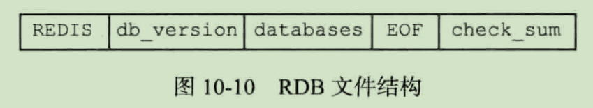
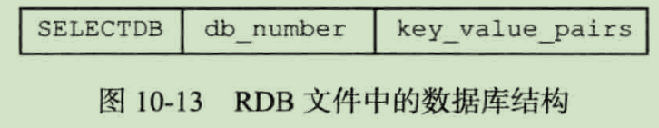
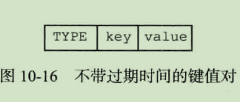
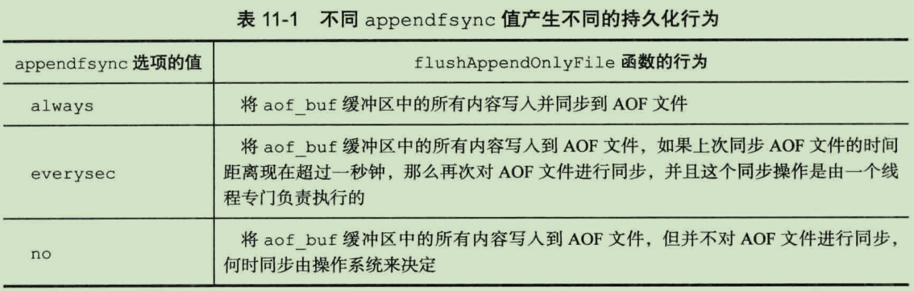

# Redis 单机数据库

## 数据库

### 数据库数据结构

```
struct redisServer {

    redisDb *db;
    int dbnum;

}

```

默认下，Redis客户端的目标数据库为0号数据库。`SELECT 2` 可以切换到2号数据库.

### 数据库键空间

```
typedef redisDb {

    dict *dict

}

```

dict 的键就是数据库的键值，每个键都是一个字符串对象

dict 的值是数据库的值，每个值可以是字符串、列表、字典、集合、有序集合对象。

### 键空间的过期

```
typedef redisDb {

    dict *expires;

}

```

通过EXPIRE或者PEXPIRE，可以以秒或者毫秒为键设置生存时间。服务器会自动删除生存时间为0的键。

过期字典的键是一个指针，这个指针指向键空间中的某个键对象。
过期对象的值是一个long long类型的整数，这个整数保存了键所指向的数据库键的过期时间-----一个毫秒精度的UNIX时间戳。

### 过期键删除策略

三种不同的删除策略：

- 定时删除：在设置键的过期时间的同时，创建一个定时器（timer），让定时器在键的过期时间来临时，立即执行对键的删除操作。
- 惰性删除：放任键过期不管，但是每次从键空间中获取键时，都检查取得的键是否过期，如果过期的话，就删除该键；如果没有过期，就返回该键。
- 定期删除：每隔一段时间，程序就对数据库进行一次检查，删除里面的过期键。至于要删除多少过期键，以及要检查多少个数据库，则由算法决定。

Redis服务器使用地是惰性删除和定期删除两种策略。

过期键的惰性删除策略由db.c/expireIfNeeded函数实现，所有读写数据库的Redis命令在执行之前都会调用expireIfNeeded函数对输入键进行检查

过期键的定期删除策略由redis.c/activeExpireCycle函数实现，每当Redis的服务器周期性操作redis.c/serverCron函数执行时，activeExpireCycle函数就会被调用，它在规定的时间内，分多次遍历服务器中的各个数据库，从数据库的expires字典中随机检查一部分键的过期时间，并删除其中的过期键。


### AOF、RDB和复制功能对过期键的处理

- 生存RDB文件

    在执行SAVE命令或者BGSAVE命令创建一个新的RDB文件时，程序会对数据库的键进行检查，已过期的键不会被保存到新创建的RDB文件中。
    
- 载入RDB文件

    如果服务器以主服务器模式运行，那么在载入RDB文件时，程序会对文件中保存的键进行检查，未过期的键会被载入到数据库中，而过期键则会被忽略，所以过期键对载入RDB文件的主服务器不会造成影响。
    
    如果服务器以从服务器模式运行，那么在载入RDB文件时，文件中保存的所有键，都会被载入到数据库中。
    
- AOF文件写入

    当服务器以AOF持久化模式运行时，如果数据库中的某个键已经过期，但它还没有被惰性删除或定期删除，那么AOF文件不会因为这个过期键而产生任何影响。

    当过期键被惰性删除或者定期删除之后，程序会向AOF文件追加（append）一条DEL命令，来显示地记录键已被删除。
    
    在执行AOF重写的过程中，程序会对数据库中的键进行检查，已过期的键不会被保存到重写后的AOF文件中。
    
- 复制

    主服务器在删除一个过期键之后，会显示地向所有从服务器发送一个DEL命令，告知从服务器删除这个过期键。
    
    从服务器在执行客户端发送的读命令时，即使碰到过期键也不会将过期键删除，而是继续像处理未过期的键一样来处理过期键。
    
    从服务器只有在接到主服务器发来的DEL命令之后，才会删除过期键。
    
    
## RDB 持久化

### RDB文件的创建和载入

AVE命令会阻塞Redis服务器进程，直到RDB文件创建完毕为止，在服务器进程阻塞期间，服务器不能处理任何命令请求。
 
BGSAVE命令会派生出一个子进程，然后由子进程负责创建RDB文件，服务器进程继续处理命令请求。

因为AOF文件的更新频率通常比RDB文件的更新频率高，所以：

- 如果服务器开启了AOF持久化功能，那么服务器会优先使用AOF文件来还原数据库状态。
- 只有在AOF持久化功能处于关闭状态时，服务器才会使用RDB文件来还原数据库状态。

### 自动间隔性保存

用户可以通过save选项设置多个保存条件，但只要其中任意一个条件被满足，服务器就会执行BGSAVE命令。
 
当Redis服务器启动时，用户可以通过指定配置文件或者传入启动参数的方式设置save选项，如果用户没有主动设置save选项，那么服务器会为save选项设置默认条件。

```
struct redisServer {
    saveparam *saveparams;
}

struct saveparams {
    time_t seconds;
    int changes;
}

```

出了saveparams数组外，服务器状态还维持着一个dirty计数器，以及一个lastsave属性：

dirty计数器记录距离上一次成功执行SAVE命令或者BGSAVE命令之后，服务器对数据库状态（服务器中的所有数据库）进行了多少次修改。

lastsave属性时一个UNIX时间戳，记录了服务器上一次成功执行SAVE命令或者BGSAVE命令的时间。

```
struct redisServer {
    long long dirty;
    time_t lastsave;
}

```

### RDB文件结构








## AOF 

### AOF持久化的实现

AOF持久化功能的实现可以分为命令追加（append）、文件写入、文件同步（sync）三个步骤。

#### 命令追加

当AOF持久化功能处于打开状态时，服务器在执行完一个写命令之后，会以协议格式将被执行的写命令追加到服务器状态的aof_buf缓冲区的末尾。

#### AOF文件的写入与同步

时间事件则负责执行像serverCron函数这样需要定时运行的函数。



redis 使用的策略就是 everysec

#### AOF重写

首先从数据库中读取键现在的值，然后用一条命令去记录键值对，代替之前记录这个键值对的多条命令，这就是AOF重写功能的实现原理。

因为aof_rewrite函数会进行大量的写入操作，所以调用这个函数的线程将被长时间阻塞，因为Redis服务器使用单个线程来处理命令请求，所以如果由服务器直接调用aof_rewrite函数的话，那么在重写AOF文件期间，服务器将无法处理客户端发来的命令请求。

Redis决定将AOF重写程序放到子进程里执行，子进程进行AOF重写期间，服务器进程可以继续处理命令请求，为了解决数据不一致问题，Redis服务器设置了一个AOF重写缓冲区，这个缓冲区在服务器创建子进程之后开始使用，当Redis服务器执行完一个写命令之后，会同时将这个命令发送给AOF缓冲区和AOF重写缓冲区。

当子进程完成AOF重写工作之后，它会向父进程发送一个信号，父进程在接到该信号之后，会调用一个信号处理函数，并执行以下工作：

- 将AOF重写缓冲区中的所有内容重写到新AOF文件中，这时新AOF文件保存的数据库状态将和服务器当前的数据库状态一致。
- 对新的AOF文件进行改名，原子地(atomic)覆盖现有地AOF文件，完成新旧两个AOF文件地替换。


