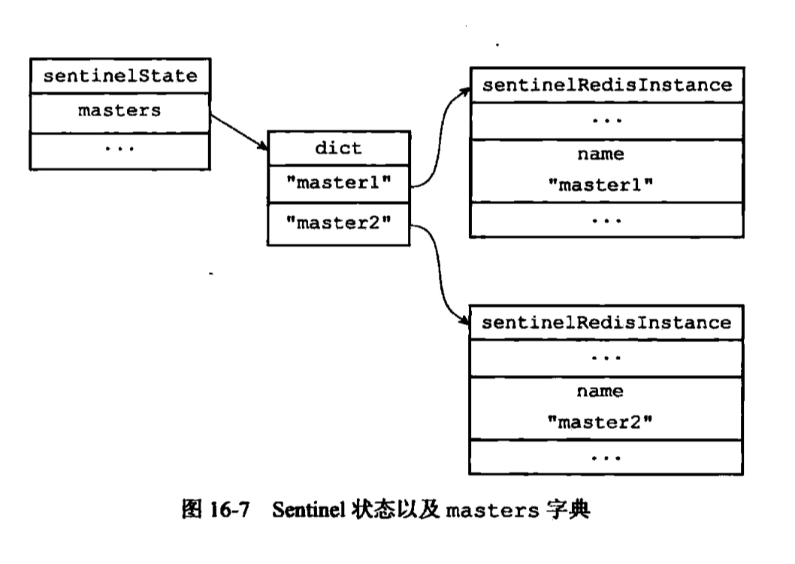
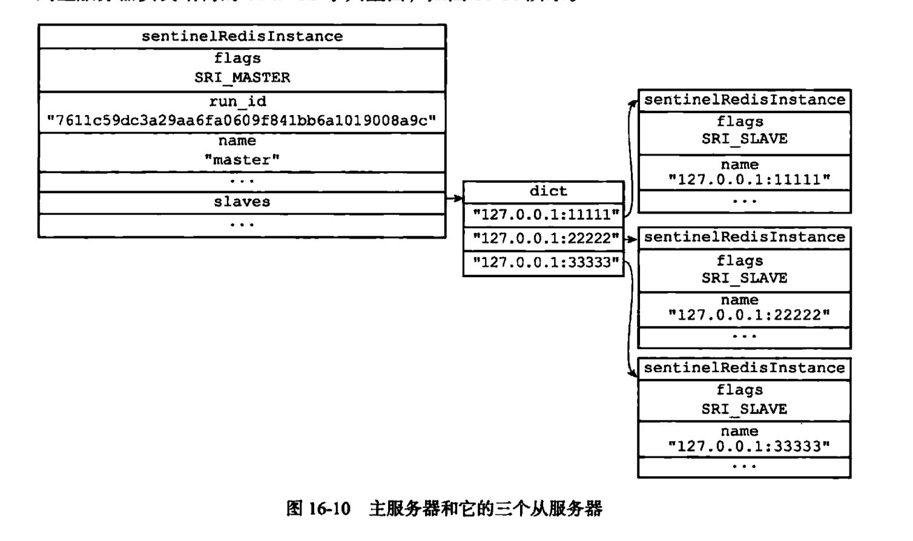
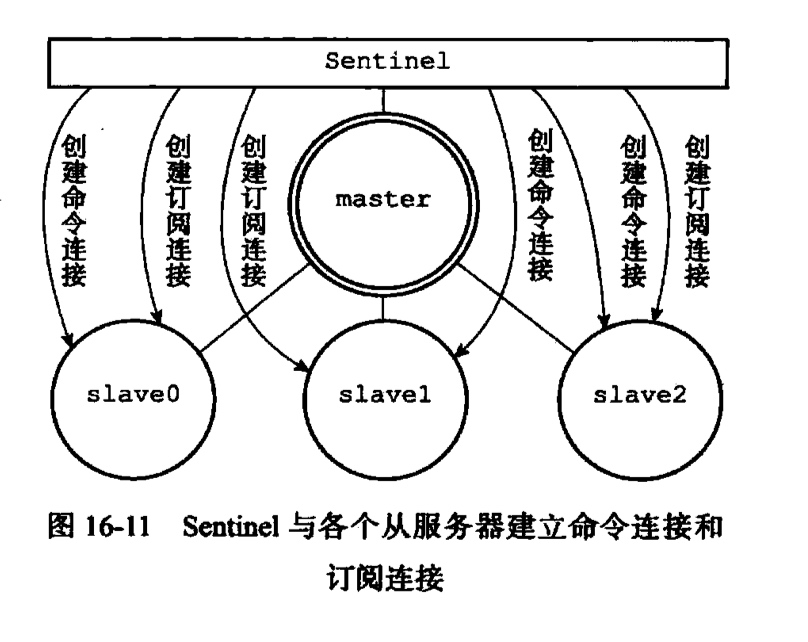
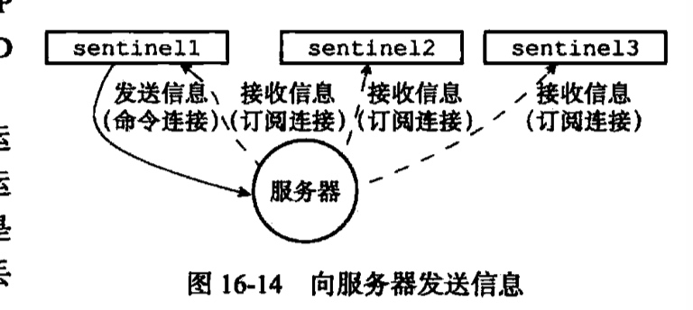
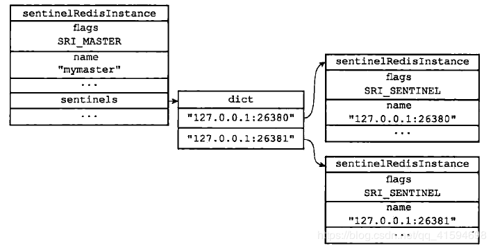
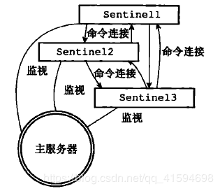
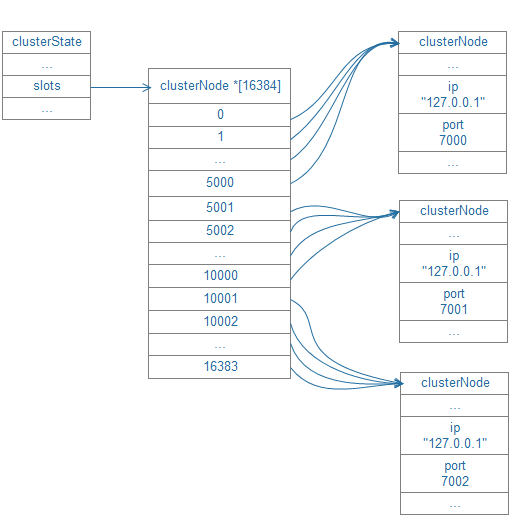

# Redis 多机数据库实现

## 复制

### SYNC 命令

在Redis中， 用户可以通过执行SLAVEOF命令或者设置slaveof选项，让一个服务器去复制(replicate)另一个服务器。

Redis的复制功能分为同步(sync)和命令传播(command propagate)两个操作：

- 同步操作：用于将从服务器的数据库状态更新至主服务器当前所处的数据库状态。
- 命令传播操作：用于在主服务器的数据库状态被修改，导致主从服务器的数据库状态出现不一致时，让主从服务器的数据库重新回到一致状态。

从服务器对主服务器的同步操作需要通过向主服务器发送SYNC命令来完成， 以下是SYNC命令的执行步骤：

- 从服务器向主服务器发送SYNC命令。
- 收到SYNC命令的主服务器执行BGSAVE命令，在后台生成一个RDB文件，并使用一个缓冲区记录从现在开始执行的所有写命令。
- 当主服务器的BGSAVE命令执行完毕时，主服务器会将BGSAVE命令生成的RDB 文件发送给从服务器，从服务器接收并载人这个RDB文件，将自己的数据库状态更新至主服务器执行BGSAVE命令时的数据库状态。
- 主服务器将记录在缓冲区里面的所有写命令发送给从服务器，从服务器执行这些写命令，将自己的数据库状态更新至主服务器数据库当前所处的状态。

在同步操作执行完毕之后， 主从服务器两者的数据库将达到一致状态，但这种一致并不是一成不变的， 每当主服务器执行客户端发送的写命令时， 主服务器的数据库就有可能会被修改， 并导致主从服务器状态不再一致。

为了让主从服务器再次回到一致状态， 主服务器需要对从服务器执行命令传播操作：

- 主服务器会将自己执行的写命令， 也即是造成主从服务器不一致的那条写命令，发送给从服务器执行
- 从服务器执行了相同的写命令之后，主从服务器将再次回到一致状态。

### PSYNC 命令

在Redis中，从服务器对主服务器的复制可以分为以下两种情况：

- 初次复制：从服务器以前没有复制过任何主服务器，或者从服务器当前要复制的主 服务器和上一次复制的主服务器不同。
- 断线后重复制：处千命令传播阶段的主从服务器因为网络原因而中断了复制，但从服务器通过自动重连接重新连上了主服务器，并继续复制主服务器。

缺陷：初次复制可很好地完成任务，但对于断线后重复制来说，旧版复制功能虽然也能让主从服务器重新回到一致状态，但效率却非常低-为了执行断电期间少量的写命令，让主服务器重新执行一次sync命令，非常耗资源

为了解决旧版复制功能在处理断线重复制情况时的低效问题，Redis从2.8版本开始，使用PSYNC命令代替SYNC命令来执行复制时的同步操作。

PSYNC命令具有完整重同步(full resynchronization)和部分重同步(partialresynchronization) 两种模式。

- 完整重同步：用于处理初次复制情况，执行步骤和SYNC命令的执行步骤基本一样，它们都是通过让主服务器创建并发送RDB文件，以及向从服务器 发送保存在缓冲区里面的写命令来进行同步。
- 部分重同步：则用于处理断线后重复制情况：当从服务器在断线后重新连接主服务器时，如果条件允许，主服务器可以将主从服务器连接断开期间执行的写命令发送给从服务器，从服务器只要接收并执行这些写命令，就可以将数据库更新至主服务 器当前所处的状态。

部分重同步功能由以下三个部分构成：

- 主服务器的复制偏移量(replication offset) 和从服务器的复制偏移量。
- 主服务器的复制积压缓冲区(replication backlog)。
- 服务器的运行ID (run ID)。

#### 复制偏移量

执行复制的双方一主服务器和从服务器会分别维护一个复制偏移量：

- 主服务器：每次向从服务器传播N 个字节的数据时，就将自己的复制偏移量的值加上N。
- 从服务器：每次收到主服务器传播来的N个字节的数据时， 就将自己的复制偏移量的值加上N。

通过对比主从服务器的复制偏移量，程序可以很容易地知道主从服务器是否处于一致状态，如果主从服务器处于一致状态，那么主从服务器两者的偏移量总是相同的。

相反，如果主从服务器两者的偏移量并不相同， 那么说明主从服务器并未处于一致状态。

#### 复制积压缓冲区

复制积压缓冲区是由主服务器维护的一个固定长度(fixed-size)先进先出(FIFO)队列， 默认大小为1MB。

当主服务器进行命令传播时，它不仅会将写命令发送给所有从服务器，还会将写命令入队到 复制积压缓冲区里面

#### 服务器运行ID

每个Redis服务器， 不论主服务器还是从服务，都会有自己的运行1D。

运行1D在服务器启动时自动生成，由40个随机的十六进制字符组成，例如53b9b 28df8042fdc9ab5e3fcbbbabffld5dce2b3。

- 当从服务器对主服务器进行初次复制时，主服务器会将自己的运行1D传送给从服务器， 而从服务器则会将这个运行1D保存起来。
- 当从服务器断线并重新连上 个主服务器时，从服务器将向当前连接的主服务器发送之前保存的运行ID。
- 如果从服务器保存的运行ID和当前连接的主服务器的运行ID相同，那么说明从服务器断线之前复制的就是当前连接的这个主服务器，主服务器可以继续尝试执行部分重同步操作。相反地， 如果从服务器保存的运行1D和当前连接的主服务器的运行1D并不相同，那么说明从服务器断线之前复制的主服务器并不是当前连接的这个主服务器，主服务器将对从服务器执行完整重同步操作。

#### PSYNC 流程

当从服务器重新连上主服务器时，从服务器会通过PSYNC命令将自己的复制偏移量 offset发送给主服务器，主服务器会根据这个复制偏移量来决定对从服务器执行何种同步操作:

1. 如果offset偏移量之后的数据（也即是偏移量offset+1开始的数据）仍然存在于复制积压缓冲区里面，主服务器向从服务器发送+CONTINUE回复,那么主服务器将对从服务器执行部分重同步操作。

2. 相反，如果offset偏移量之后的数据已经不存在于复制积压缓冲区， 那么主服务器将对从服务器执行完整重同步操作。

3. 接着主服务器会将复制积压缓冲区 10086 偏移址之后的所有数据（偏移量为 10087 至 10119) 都发送给从服务器。

PSYNC命令的调用方法有两种：

1. 如果从服务器以前没有复制过任何主服务器， 或者之前执行过SLAVEOF no one命令， 那么从服务器在开始一次新的复制时将向主服务器发送PSYNC ? -1命令， 主动请求主服务器进行完整重同步（因为这时不可能执行部分重同步）。
2. 相反地，如果从服务器已经复制过某个主服务器，那么从服务器在开始一次新的复制时将向主服务器发送PSYNC <runid> <offset>命令：其中runid是上一次复制的主服务器的运行ID,而offset则是从服务器当前的复制偏移量，接收到这个命令的主服务器会通过这两个参数来判断应该对从服务器执行哪种同步操作 。

根据情况，接收到PSYNC命令的主服务器会向从服务器返回以下三种回复的其中一种：

- 如果主服务器返回+FULLRESYNC <runid> <offset>回复，那么表示主服务器将与从服务器执行完整重同步操作：其中runid是这个主服务器的运行ID, 从服务器会将这个ID保存起来，在下一次发送PSYNC命令时使用；而offse七则是主服务器当前的复制偏移量，从服务器会将这个值作为自己的初始化偏移量。
- 如果主服务器返回+CONTINUE 回复，那么表示主服务器将与从服务器执行部分重同步操作，从服务器只要等着主服务器将自己缺少的那部分数据发送过来就可以了。
- 如果主服务器返回-ERR 回复，那么表示主服务器的版本低千Redis2.8, 它识别不了PSYNC命令，从服务器将向主服务器发送SYNC命令，并与主服务器执行完整同步操作。


## sentinel 哨兵

redis主从复制可将主节点数据同步给从节点，一旦主节点宕机，从节点作为主节点的备份可以随时顶上来。这个过程如果人工介入，效果肯定没有自动的高可用机制好。sentinel 哨兵机制就是为了解决这个问题。是redis的高可用HA方案：有一个或多个Sentinel实例（instance）组成的Sentinel系统（system）可以监视任意多个主服务器，以及这些主服务器属下的所有从服务器，并在被监视的主服务器进入下线状态时，自动将下线主服务器属下的某个从服务器升级为主服务器，然后由新的主服务器代替已下线的主服务器继续处理命令请求。

### 初始化服务器

Sentinel的本质是一个运行在特殊模式下的Redis服务器，因此启动时必须对其进行初始化，但是由于Sentinel与普通的服务器不同，它的初始化需要执行的操作也不同。

服务器会初始化一个 sentinel.c/sentinelState 结构

```
struct sentinelState {
    uint64_t current_epoch;
    dict *masters; 
}

```

Sentinel 状态中的 masters 字典记录了所有被 Sentinel 监视的主服务器的相关信息， 其中：

- 字典的键是被监视主服务器的名字。
- 而字典的值则是被监视主服务器对应的 sentinel.c/sentinelRedisInstance 结构。

每个 sentinelRedisInstance 结构（后面简称“实例结构”）代表一个被 Sentinel 监视的 Redis 服务器实例（instance）， 这个实例可以是主服务器、从服务器、或者另外一个 Sentinel 。

```
typedef struct sentinelRedisInstance {
    int flags;  
    sentinelAddr *addr; 
}

```

其中addr 属性是一个指向 sentinel.c/sentinelAddr 结构的指针，这个结构保存实例的IP地址和端口号.



### 创建连向主服务器的网络连接

每个被Sentinel监视的主服务器，Sentinel会创建两个连向主服务器的异步网络连接：

- 命令连接，用于向主服务器发送命令，并接收命令回复
- 订阅连接，用于订阅主服务器的 `__sentinel__:hello` 频道

>
>为了不丢失 __sentinel__:hello 频道的任何信息， Sentinel 必须专门用一个订阅连接来接收该频道的信息。
>
而另一方面， 除了订阅频道之外， Sentinel 还又必须向主服务器发送命令， 以此来与主服务器进行通讯， 所以 Sentinel 还必须向主服务器创建命令连接。

### 获取从服务器信息

Sentinel 默认每十秒一次，通过命令连接向被监视的主服务器发送 INFO 命令，并通过分析 INFO 命令回复来获取主服务器当前信息。两方面信息：

- 关于服务器本身的信息: 包括 run_id 域记录的服务器运行ID，以及 role 域记录的服务器角色
- 关于主服务器属下的所有从服务器信息

根据 run_id 域和 role 域的信息，Sentinel将对主服务器的实例结构进行更新。而主服务器返回的从服务器信息，将会被用于更新主服务器实例结构的 slaves 字典(记录了属下从服务器的名单)。

Sentinel 分析 INFO 命令中包含的从服务器信息时，会检查从服务器对应的实例结构是否已经存在于 slaves 字典： 如果存在，就对从服务器的实例结构进行更新，如果不存在(表明这个从服务器是新发现的从服务器)，Sentinel会在 slaves 字典中为这个从服务器创建一个新的实例结构。



- 主服务器实例结构的 flags 值为 SRI_MASTER,从服务器是 SRI_SLAVE
- 主服务器实例结构的 name 由用户使用Sentinel配置文件设置，从服务器的name 是由Sentinel根据服务器ip+port自动设置的

当Sentinel发现主服务器有新的服务器出现时，除了会为这个新从服务器创建相应的实例结构之外，还会创建连接到从服务器的命令连接和订阅连接。



默认情况下，sentinel每两秒一次，通过命令连接向所有被监视的主服务器和从服务器发送以下格式的命令：

```
PUBLISH __sentinel__:hello "<s_ip>,<s_port>,<s_runid>,s_epoch>, <m_name>,<m_ip>,<m_port>,<m_epoch>"

```


对于监视同一服务器的多个Sentinel来说，一个Sentinel发送的信息会被其他的Sentinel接收到，并用于更新其他Sentinel对发送信息Sentinel的认知，和被用于更新其他Sentinel对被监视服务器的认知（收到自己发送的会被忽略掉）。



### 更新 sentinels 字典

当一个Sentinel接收到其他Sentinel发来的信息时(称发送信息的Sentinel为源Sentinel，接收信息的Sentinel为目标Sentinel)，目标Sentinel会从信息中分析出以下信息：

-  与Sentinel相关的参数：源Sentinel的IP、port、run_id、配置纪元
-  与主服务器相关参数：源Sentinel 正在监视的主服务器的名字、IP、port、配置纪元




当Sentinel通过频道信息发现了一个新的Sentinel时，它不仅会为新的Sentinel在 sentinels 字典中创建相应的实例结构，还会创建一个连向新Sentinel的命令连接。新的Sentinel同样会创建连向这个Sentinel的命令连接，最终监视同一主服务器的多个Sentinel将形成相互连接的网络：SentinelA有连向SentinelB的命令连接，SentinelB也有连向SentinelA的命令连接。

Sentinel之间不会创建订阅连接：靠订阅主、从服务器的频道信息，已经能获取未知sentinel。而sentinel之间通信靠命令通信足够。



### 检测主观下线状态

Sentinel默认以每秒一次的频率向所有与它创建了命令连接的实例，包括主服务器、从服务器、其他Sentinel在内发送PING命令，并通过实例返回的PING命令回复来判断实例是否在线。

Sentinel配置文件中的 down-after-millseconds 选项指定了Sentinel判断实例进入主观下线所需的时间长度：如果一个实例在 down-after-millseconds 毫秒内，连续向Sentinel返回无效回复，那么Sentinel会修改这个实例所对应的实例结构，在结构的 flags 属性中打开 SRI_S_DOWN 标识，用于表示这个实例已经进入主观下线状态。

当Sentinel将一个主服务器判断为主观下线之后，为确定这个服务器是否真的下线，它会向同样监视这个主服务器的其它Sentinel进行询问，当接收到足够数量的已下线判断之后，Sentinel就会将从服务器判定为客观下线，并对主服务器进行故障转移操作。

- 发送 SENTINEL is-master-down-by-addr 命令
- 接收 SENTINEL is-master-down-by-addr 命令
- 接收 SENTINEL is-master-down-by-addr 命令的回复：根据其他Sentinel发回的 SENTINEL is-master-down-by-addr 回复，Sentinel将统计同意主服务器下线的数量，当这个值达到配置指定的判断客观下线所需的数量时(即 quorum 属性的值)，Sentinel会将主服务器实例结构中 flags 属性的 SRI_O_DOWN 标识打开，标识主服务器已经进入客观下线状态。

### 选举领头sentinel

当一个主服务器被判断为客观下线时，监视这个下线主服务器的各个Sentinel会进行协商，选举出一个领头Sentinel，并由领头Sentinel对下线主服务器进行故障转移操作。

如何选举领头Sentinel的规则和方法：

1.每个做主观下线的sentinel节点向其他sentinel节点发送上面那条命令，要求将它设置为领导者。

2.收到命令的sentinel节点如果还没有同意过其他的sentinel发送的命令（还未投过票），那么就会同意，否则拒绝。

3.如果该sentinel节点发现自己的票数已经过半且达到了quorum的值，就会成为领导者

4.如果这个过程出现多个sentinel成为领导者，则会等待一段时间重新选举。


### 故障转移

- 在已下线的主服务器属下的所有从服务器中，挑选一个从服务器作为主服务器
    
    挑选一个状态良好、数据完整的从服务器，然后发送 SLAVEOF no one 命令，然后将这个从服务器转换成主服务器
- 让已下线的主服务器的所有从服务器改为复制新的主服务器
- 将已下线主服务器设置为新的主服务器的从服务器，这个旧的主服务器重新上线时，就会成为新的主服务器的从服务器。


## 集群

### 节点 Node

在单机版的Redis中，每个Master之间是没有任何通信的，要组件一个真正可工作的集群，我们必须将各个独立的节点连接起来，构成一个包含多个节点的集群.

连接各个节点的工作可以使用CLUSTER MEET命令来完成

向一个节点node发送CLUSTER MEET命令，可以让node节点与ip和port所指定的节点进行握手（handshake），当握手成功时，node节点就会将ip和port所指定的节点添加到当前所在的集群中。


#### 集群数据结构

```
typedef struct clusterState {
    clusterNode *myself;
    dict *nodes; 
    clusterNode *slots[CLUSTER_SLOTS];
    zskiplist *slots_to_keys;
}

typedef struct clusterNode {
    unsigned char slots[CLUSTER_SLOTS/8];

}

```

#### 槽指派



Redis集群通过分片的方式来保存数据库中的键值对：集群的整个数据库被分为16384个槽（slot），数据库中每个键都属于这16384个槽的其中一个，集群中的每个节点可以处理0个或最多16384个槽。

当数据库总的16384个槽都有节点在处理时，集群处于上线状态（ok）；相反地，如果数据库中有任何一个槽没有得到处理，那么集群处于下线状态（fail）。

通过向节点发送CLUSTER ADDSLOTS命令，我们可以将一个或多个槽指派（assign）给节点负责

```
typedef struct clusterNode {
    // 节点的槽位图
    unsigned char slots[CLUSTER_SLOTS/8]; /* slots handled by this node */
    // 当前节点复制槽的数量
    int numslots;   /* Number of slots handled by this node */
} clusterNode;

```

如果slots数组在索引i上的二进制位的值为1，那么表示节点负责处理槽i；

一个节点除了会将自己负责处理的槽记录在clusterNode结构的slots属性和numslots属性之外，它还会将自己的slots数组通过消息发送给集群中的其他节点，以此来告知其他节点自己目前负责处理哪些槽。

因为集群中的每个节点都会将自己的slots数组通过消息发送给集群中的其他节点，并且每个接收到slots数组的节点都会将数组保存到相应节点的clusterNode结构里面，因此，集群中的每个节点都会知道数据库中的16384个槽分别被指派给了集群中的哪些节点。

```
typedef struct clusterState {
    // 槽和负责槽节点的映射
    clusterNode *slots[CLUSTER_SLOTS];
    // 槽映射到键的跳跃表
    zskiplist *slots_to_keys;
} clusterState;

```

计算键属于哪个槽:

```
return crc16(key,keylen) & 16383;

```

当节点计算出键所属的槽i之后，节点就会检查自己在clusterState.slots数组中的项i，判断键所在的槽是否由自己负责：

- 如果clusterState.slots[i]等于clusterState.myself，那么说明槽i由当前节点负责，节点可以执行客户端发送的命令。
- 如果clusterState.slots[i]不等于clusterState.myself，那么说明槽i并非由当前节点负责，节点会根据clusterState.slots[i]指向的clusterNode结构所记录的节点IP和端口号，向客户端返回MOVED错误，指引客户端转向至正在处理槽i的节点。

`slots_to_keys` 跳跃表每个节点的分值都是一个槽号，而每个节点的成员都是一个数据库键。

- 每个节点向数据库中添加一个新的键值对时，节点就会将这个键关联到 `slots_to_keys` 跳跃表中。


`slots_to_keys` 跳跃表可以很方便的对属于某个或某些槽的所有数据库键进行批量处理。

#### MOVED 错误

当节点发现键所在的槽并非由自己负责处理的时候，节点就会向客户端返回一个MOVED错误，指引客户端转向至正在负责槽的节点。

当客户端接收到节点返回的MOVED错误时，客户端会根据MOVED错误中提供的IP地址和端口号，转向至负责处理槽slot的节点，并向该节点重新发送之前想要执行的命令。


### 重新分片

```
typedef struct clusterState {
    clusterNode *importing_slots_from[CLUSTER_SLOTS];

    clusterNode *migrating_slots_to[CLUSTER_SLOTS];
} clusterState;

```

由 redis-trib 负责执行，redis-trib 通过向源节点和目标节点发送命令来进行重新分片。

redis-trib对集群的单个槽 slot 进行重新分片的步骤如下：

- redis-trib 对目标节点发送 CLUSTER SETSLOT <slot> IMPORTING <source_id> 命令，让目标节点准备好从源节点导入槽 slot 的键值对
- redis-trib 对源节点发送 CLUSTER SETSLOT <slot> MIGRATING <source_id> 命令，让源节点准备好将属于槽 slot的键值对迁移至目标节点
- redis-trib 对源节点发送 CLUSTER GETKEYSINSLOT<slot> <count> 命令，获得最多 count 个属于槽 slot 的键值对的键名。
- 对于步骤三获得的每个键名，redis-trib 都向源节点发送一个MIGRATE <target_ip> <target_port> <key_name> 0 <timeout> 命令，将被选中的键原子的从源节点迁移至目标节点.
- 重复步骤3和4，直到源节点保存的所有属于槽slot的键值对都被迁移到目标节点为止。
- redis-trib向集群中的任意一个节点发送 CLUSTER SETSLOT <slot> NODE <target_id> 命令，将槽slot指派给目标节点的信息发送给整个集群。

#### ASK 错误

在重新分片期间，源节点向目标节点迁移一个槽的过程中，可能会出现这样一种情况：属于被迁移槽的一部分键值对保存在源节点里面，而另一部分键值对保存在目标节点中。

大致原理就是，当客户端向源节点发送关于键key的命令，源节点先在自己的数据库里查找这个键，如果找到就直接返回执行客户端命令，如果没找到，这个键可能已经被迁移到了目标节点，源节点向客户端返回一个 ASK 错误，指引客户端转向正在导入槽的目标节点，并再次发送之前要执行的命令。

接到ASK 错误的客户端会根据错误提供的IP地址和端口号，转向至正在导入槽的目标节点，然后向目标节点发送一个 ASKING 命令， 之后再重新发送原本想要执行的命令。

ASKING命令要做的就是打开发送该命令的客户端的 REDIS_ASKING 标识。如果该客户端的 REDIS_ASKING 标识未打开，直接发送请求，由于槽的迁移过程还未完成，请求的键还属于源节点，此时直接请求目标节点，目标节点会返回一个MOVED错误。 但是，如果节点的 clusterState.importing_slots_from[i] 显示节点正在导入槽 i ,并且发送命令的客户端带有 REDIS_ASKING 标识，那么节点将破例执行这个关于槽 i 的命令一次。

ASK错误和MOVED错误的区别：

- MOVED错误代表槽的负责全已经从一个结点转移到了另一个节点
- ASK错误只是两个节点在迁移槽的过程中使用的一种临时措施

### 复制与故障转移

#### 设置从节点

向一个节点发送命令：CLUSTER REPLICATE <node_id>

这个命令可以让接收命令的节点成为 node_id 所指定的从节点，并开始对主节点进行复制：

- 这个节点会先在自己的 clusterState.nodes 字典中找到 node_id 所对应节点的 clusterNode 结构，并将自己的 clusterState.myself.slaveof 指针指向这个结构，以此来记录这个节点正在复制的主节点
- 然后节点修改自己在 clusterState.myself.flags 中的属性，关闭原本的 REDIS_NODE_MASTER 标识，打开 REDIS_NODE_SLAVE 标识，表示这个节点由原来的主节点变成了从节点
- 最后，节点调用复制代码，并跟据 clusterState.myself.slaveof 指向的 clusterNode 结构所保存的IP地址和端口号，对主节点进行复制。就是相当于向从节点发送命令 SLAVEOF <master_ip> <maste_port>

#### 故障检测

集群中的每个节点都会定期地想集群中的其他节点发送 PING 消息，以此来检测对方是否在线，如果接受 PING 消息的节点没有在规定时间内返回 PONG ，那么发送 PING 的节点就会将接受 PING 消息的节点标记为意思下线(PFAIL)。

当一个主节点A通过消息得知主节点B认为主节点C进入疑似下线状态，主节点A会在自己的 clusterState.nodes 字典中找到主节点C所对应的 clusterNode 结构，并将主节点B的下线报告添加到这个结构的 fail_reports 链表里面

如果一个集群里，半数以上负责处理槽的主节点都将某个主节点X报告为疑似下线，那么这个主节点X将被标记为已下线(FAIL)，将主节点X标记为已下线的节点会向集群广播一条关于主节点X的FAIL消息，所有收到这条FAIL消息的节点都会立即将主节点X标记为已下线。

#### 故障转移

当一个从节点发现自己正在复制的主节点进入了已下线状态，从节点将开始对下线主节点进行故障转移:

- 复制下线主节点的所有从节点里面，会有一个从节点被选中
- 被选中的从节点将执行 slaveof no one 命令，成为新的主节点
- 新的主节点撤销已下线主节点对指派槽的管理，并将这些槽全部指派给自己
- 新的主节点向集群广播一条PONG消息，告诉集群中的其他节点自己成为了新的主节点。
- 新的主节点开始接收和自己负责处理的槽有关的命令请求，故障转移完成。

#### 选举新的主节点

- 当从节点发现自己正在复制的主节点进入已下线状态时，从节点会向集群广播一条 CLUSTERMSG_TYPE_FAILOVER_AUTH_REQUEST 消息，要求所有收到这条消息、并具有投票权的主节点向这个从节点投票
- 如果一个主节点具有投票权(它正在负责处理槽),并且这个主节点尚未投票给其他从节点，那么主节点将向要求投票的从节点返回一条 CLUSTERMSG_TYPE_FAILOVER_AUTH_ACK 消息，表示这个主节点支持从节点成为新的主节点
- 每个参与选举的从节点都会接受 CLUSTERMSG_TYPE_FAILOVER_AUTH_ACK 消息，并根据自己受到了多少条这种消息来统计自己获得了多少主节点 的支持
- 如果集群库有N个具有投票权的朱及诶单，那么当一个从节点收集到大于等于N/2+1张支持票，这个从节点当选为新的主节点
- 因为在每个配置纪元里面，每个具有投票权的主节点只能投一次票，所以如果有N个节点进行投票，那么具有大于等于N/2+1张支持票的从节点只会有一个，这确保了新的主节点只会有一个
- 如果在一个配置纪元里没有从节点能手机到足够多的支持票，那么集群进入一个新的配置纪元，并再次进行选举，直到选出新的主节点为止。

#### 消息

- MEET 消息：当发送者接到客户端发送的 CLUSTER MEET 命令时，发送者会向接收者发送 MEET 消息，请求接收者加入发送者当前所处的集群中。
- PING 消息：集群里的每个节点默认每隔一秒钟就会从已知节点列表中随机选出五个节点，然后对这五个节点中最长时间没有发送过 PING 消息的节点发送 PING 消息，以此来检测选中的节点是否在线
- PONG 消息：当接收者收到发送者发来的 MEET 消息或者 PING 消息时，为了向发送者确认这条MEET消息或者PING消息已到达，接收者会向发送者返回一条 PONG 消息
- FAIL 消息：当一个主节点A判断另一个主节点B已经进入FAIL 状态时，节点A会向集群广播一条关于B的FAIL 消息，所有收到这条消息的节点都会立即将节点B标记为已下线。
- PUBLISH 消息：当节点接收到一个 PUBLISH 命令时，节点会执行这个命令，并向集群广播一条PUBLISH 消息，所有接收到这条 PUBLISH 消息的节点都会执行相同的 PUBLISH 消息。

#### Gossip 协议

节点通过消息头的 type 判断是三种消息中的哪一种。每次发送 MEET、PING、PONG 消息时，发送者都会从自己的已知节点中随机选出两个节点（可以是主节点或者从节点），并将这两个被选中节点的信息分别保存到两个clusterMsgDataGossip中。接收者收到消息，会取出这两个 clusterMsgDataGossip结构 ，并根据其中的信息对自己的 clusterState.nodes 进行更新。

如果被选中节点不存在与接收者的已知节点列表，那么表明接收者第一次接触到被选中节点，接收者将根据结构中的IP地址和端口号等信息，与被选中节点进行握手

如果在列表中，那么说明接收者之前已经与被选中节点进行过接触，接收者将根据 clusterMsgDataFossip结构记录的信息，对被选中节点所对应的 clusterNode 结构进行更新。

clusterMsgDataGossip(记录了被选中节点的名字，发送者和被选中节点最后一次发送和接收 PING 消息和 PONG 消息的时间戳，被选中节点的IP地址和端口号，以及被选中节点的标识值)

#### FAIL 消息的实现

在集群的节点数量比较大的情况下，单纯用 Gossip 协议来传播节点的已下线信息会给节点的信息更新带来一定延迟，，而FAIL消息对实时性要求比较高。

因而 FAIL 消息是通过向集群广播来实现的。

## 事务

Redis 通过 MULTI 、 DISCARD 、 EXEC 和 WATCH 四个命令来实现事务功能

事务提供了一种“将多个命令打包， 然后一次性、按顺序地执行”的机制， 并且事务在执行的期间不会主动中断 —— 服务器在执行完事务中的所有命令之后， 才会继续处理其他客户端的其他命令。

```
redis> MULTI
OK

redis> SET book-name "Mastering C++ in 21 days"
QUEUED

redis> GET book-name
QUEUED

redis> SADD tag "C++" "Programming" "Mastering Series"
QUEUED

redis> SMEMBERS tag
QUEUED

redis> EXEC
1) OK
2) "Mastering C++ in 21 days"
3) (integer) 3
4) 1) "Mastering Series"
   2) "C++"
   3) "Programming"

```

一个事务从开始到执行会经历以下三个阶段：

- 开始事务。
- 命令入队。
- 执行事务。

MULTI 命令的执行标记着事务的开始,这个命令唯一做的就是， 将客户端的 REDIS_MULTI 选项打开， 让客户端从非事务状态切换到事务状态。

当客户端处于非事务状态下时， 所有发送给服务器端的命令都会立即被服务器执行.但是， 当客户端进入事务状态之后， 服务器在收到来自客户端的命令时， 不会立即执行命令， 而是将这些命令全部放进一个事务队列里， 然后返回 QUEUED ， 表示命令已入队.

并不是所有的命令都会被放进事务队列， 其中的例外就是 EXEC 、 DISCARD 、 MULTI 和 WATCH 这四个命令 —— 当这四个命令从客户端发送到服务器时， 它们会像客户端处于非事务状态一样， 直接被服务器执行

如果客户端正处于事务状态， 那么当 EXEC 命令执行时， 服务器根据客户端所保存的事务队列， 以先进先出（FIFO）的方式执行事务队列中的命令： 最先入队的命令最先执行， 而最后入队的命令最后执行。

### WATCH

WATCH 命令用于在事务开始之前监视任意数量的键： 当调用 EXEC 命令执行事务时， 如果任意一个被监视的键已经被其他客户端修改了， 那么整个事务不再执行， 直接返回失败。

```
redis> WATCH name
OK

redis> MULTI
OK

redis> SET name peter
QUEUED

redis> EXEC
(nil)

```

在时间 T4 ，客户端 B 修改了 name 键的值， 当客户端 A 在 T5 执行 EXEC 时，Redis 会发现 name 这个被监视的键已经被修改， 因此客户端 A 的事务不会被执行，而是直接返回失败。

在每个代表数据库的 redis.h/redisDb 结构类型中， 都保存了一个 watched_keys 字典， 字典的键是这个数据库被监视的键， 而字典的值则是一个链表， 链表中保存了所有监视这个键的客户端。

WATCH 命令的作用， 就是将当前客户端和要监视的键在 watched_keys 中进行关联。

在任何对数据库键空间（key space）进行修改的命令成功执行之后 （比如 FLUSHDB 、 SET 、 DEL 、 LPUSH 、 SADD 、 ZREM ，诸如此类）， multi.c/touchWatchedKey 函数都会被调用 —— 它检查数据库的 watched_keys 字典， 看是否有客户端在监视已经被命令修改的键， 如果有的话， 程序将所有监视这个/这些被修改键的客户端的 REDIS_DIRTY_CAS 选项打开

当客户端发送 EXEC 命令、触发事务执行时， 服务器会对客户端的状态进行检查:如果客户端的 REDIS_DIRTY_CAS 选项已经被打开，那么说明被客户端监视的键至少有一个已经被修改了，事务的安全性已经被破坏。服务器会放弃执行这个事务，直接向客户端返回空回复，表示事务执行失败。

### 事务的 ACID 性质

Redis 事务保证了其中的一致性（C）和隔离性（I），但并不保证原子性（A）和持久性（D）。

- 原子性（Atomicity）

	单个 Redis 命令的执行是原子性的，但 Redis 没有在事务上增加任何维持原子性的机制，所以 Redis 事务的执行并不是原子性的。
	
	如果 Redis 服务器进程在执行事务的过程中被停止 —— 比如接到 KILL 信号、宿主机器停机，等等，那么事务执行失败。
	
	当事务失败时，Redis 也不会进行任何的重试或者回滚动作。

- 一致性（Consistency）

    Redis 的一致性问题可以分为三部分来讨论：入队错误、执行错误、Redis 进程被终结。
    
    在命令入队的过程中，如果客户端向服务器发送了错误的命令，比如命令的参数数量不对，等等， 那么服务器将向客户端返回一个出错信息， 并且将客户端的事务状态设为 REDIS_DIRTY_EXEC 。当客户端执行 EXEC 命令时， Redis 会拒绝执行状态为 REDIS_DIRTY_EXEC 的事务， 并返回失败信息。
    
    如果命令在事务执行的过程中发生错误，比如说，对一个不同类型的 key 执行了错误的操作， 那么 Redis 只会将错误包含在事务的结果中， 这不会引起事务中断或整个失败，不会影响已执行事务命令的结果，也不会影响后面要执行的事务命令， 所以它对事务的一致性也没有影响。
    
    如果 Redis 服务器进程在执行事务的过程中被其他进程终结，或者被管理员强制杀死，那么根据 Redis 所使用的持久化模式，可能有以下情况出现：
    
    - 内存模式：如果 Redis 没有采取任何持久化机制，那么重启之后的数据库总是空白的，所以数据总是一致的。
    - RDB 模式：在执行事务时，Redis 不会中断事务去执行保存 RDB 的工作，只有在事务执行之后，保存 RDB 的工作才有可能开始。
    - 如果事务语句未写入到 AOF 文件，或 AOF 未被 SYNC 调用保存到磁盘，那么还原后的数据库总是一致的，但其中的数据不一定是最新的。
    - 如果事务的部分语句被写入到 AOF 文件，并且 AOF 文件被成功保存，那么不完整的事务执行信息就会遗留在 AOF 文件里，当重启 Redis 时，程序会检测到 AOF 文件并不完整，Redis 会退出，并报告错误。需要使用 redis-check-aof 工具将部分成功的事务命令移除之后，才能再次启动服务器。还原之后的数据总是一致的，而且数据也是最新的（直到事务执行之前为止）。

- 隔离性（Isolation）

    Redis 是单进程程序，并且它保证在执行事务时，不会对事务进行中断，事务可以运行直到执行完所有事务队列中的命令为止。因此，Redis 的事务是总是带有隔离性的。
    
- 持久性（Durability）

    因为事务不过是用队列包裹起了一组 Redis 命令，并没有提供任何额外的持久性功能，所以事务的持久性由 Redis 所使用的持久化模式决定。