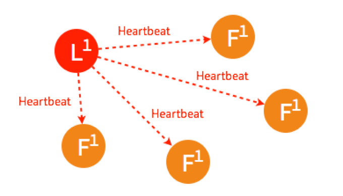
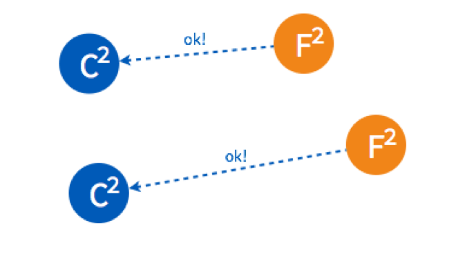

# Redis 扩展知识

## 一致性哈希与哈希槽

### 一致性哈希

一致性哈希用于解决分布式缓存系统中的数据选择节点存储问题和数据选择节点读取问题以及在增删节点后减少数据缓存的消失范畴，防止雪崩的发生。

一致性hash是一个0-2^32的闭合圆，（拥有2^23个桶空间，每个桶里面可以存储很多数据，可以理解为s3的存储桶）所有节点存储的数据都是不一样的。计算一致性哈希是采用的是如下步骤：

- 对节点进行hash,通常使用其节点的ip或者是具有唯一标示的数据进行hash(ip),将其值分布在这个闭合圆上。
- 将存储的key进行hash(key),然后将其值要分布在这个闭合圆上。
- 从hash(key)在圆上映射的位置开始顺时针方向找到的一个节点即为存储key的节点。如果到圆上的0处都未找到节点，那么0位置后的顺时针方向的第一个节点就是key的存储节点。

#### 添加节点带来的影响

如果现在node2和node4节点中间增加一个node5节点，那么在node4和node2之间的这些数据要存储的节点就会有所变化。在图中的黄色区域的数据将会从原来的node4节点挪到node5节点。

#### 删除节点带来的影响

以图1为基准，删除了node2节点后，原本在node2节点上的数据就会被重新定位node4上。这样就产生一个影响：原来node2的数据转移到node4上，这样node4的内存使用率会骤增，如果node2上存在热点数据，node4会扛不住甚至会可能挂掉，挂掉之后数据又转移给node3,如此循环会造成所有节点崩溃，也就是前面所说的雪崩的情况。

#### 节点太少造成的影响

节点太少的话可能造成数据倾斜的情况，如图中中只有俩节点，可能会造成大量数据存放在node A节点上，而node B节点存储很少的数据。

#### 虚拟节点

为了解决雪崩现象和数据倾斜现象，提出了虚拟节点这个概念。就是将真实节点计算多个哈希形成多个虚拟节点并放置到哈希环上，定位算法不变，只是多了一步虚拟节点到真实节点映射的过程
以雪崩现象来说明:如下图节点real1节点又俩个虚拟节点v100和v101,real2有俩个虚拟节点v200和v201，real3节点有v300和v301俩个虚拟节点。

当real1节点挂掉后，v100和v101节点也会随即消失，这时k1数据就会被分配到v301上，k4就会被分配到了v200上，这就解决了雪崩的问题，当某个节点宕机后，其数据并没有全部分配给某一个节点，而是被分到了多个节点。

因为加入了虚拟节点机制，数据倾斜的问题也随之解决

注意：真实节点不放置到哈希环上，只有虚拟节点才会放上去。

### 哈希槽

redis cluster采用数据分片的哈希槽来进行数据存储和数据的读取。redis cluster一共有2^14（16384）个槽，所有的master节点都会有一个槽区比如0～1000，槽数是可以迁移的。master节点的slave节点不分配槽，只拥有读权限。但是注意在代码中redis cluster执行读写操作的都是master节点，并不是你想 的读是从节点，写是主节点。第一次新建redis cluster时，16384个槽是被master节点均匀分布的。

一致性哈希是创建虚拟节点来实现节点宕机后的数据转移并保证数据的安全性和集群的可用性的。redis cluster是采用master节点有多个slave节点机制来保证数据的完整性的,master节点写入数据，slave节点同步数据。当master节点挂机后，slave节点会通过选举机制选举出一个节点变成master节点，实现高可用。

## 缓存问题

### 缓存穿透

正常情况下，我们去查询数据都是存在。那么请求去查询一条压根儿数据库中根本就不存在的数据，也就是缓存和数据库都查询不到这条数据，但是请求每次都会打到数据库上面去。这种查询不存在数据的现象我们称为缓存穿透。

- 缓存空值

    之所以会发生穿透，就是因为缓存中没有存储这些空数据的key。从而导致每次查询都到数据库去了。
    
    那么我们就可以为这些key对应的值设置为null 丢到缓存里面去。后面再出现查询这个key 的请求的时候，直接返回null 。
    
    这样，就不用在到数据库中去走一圈了，但是别忘了设置过期时间。
    
- BloomFilter

    BloomFilter 类似于一个hbase set 用来判断某个元素（key）是否存在于某个集合中。

    这种方式在大数据场景应用比较多，比如 Hbase 中使用它去判断数据是否在磁盘上。还有在爬虫场景判断url 是否已经被爬取过。

    这种方案可以加在第一种方案中，在缓存之前在加一层 BloomFilter ，在查询的时候先去 BloomFilter 去查询 key 是否存在，如果不存在就直接返回，存在再走查缓存 -> 查 DB。
    
- 如何选择

    针对于一些恶意攻击，攻击带过来的大量key 是不存在的，那么我们采用第一种方案就会缓存大量不存在key的数据。

    此时我们采用第一种方案就不合适了，我们完全可以先对使用第二种方案进行过滤掉这些key。

    针对这种key异常多、请求重复率比较低的数据，我们就没有必要进行缓存，使用第二种方案直接过滤掉。

    而对于空数据的key有限的，重复率比较高的，我们则可以采用第一种方式进行缓存。
    
### 缓存击穿

在平常高并发的系统中，大量的请求同时查询一个 key 时，此时这个key正好失效了，就会导致大量的请求都打到数据库上面去。这种现象我们称为缓存击穿。

上面的现象是多个线程同时去查询数据库的这条数据，那么我们可以在第一个查询数据的请求上使用一个 互斥锁来锁住它。

其他的线程走到这一步拿不到锁就等着，等第一个线程查询到了数据，然后做缓存。后面的线程进来发现已经有缓存了，就直接走缓存。

### 热点数据集中失效

我们在设置缓存的时候，一般会给缓存设置一个失效时间，过了这个时间，缓存就失效了。

对于一些热点的数据来说，当缓存失效以后会存在大量的请求过来，然后打到数据库去，从而可能导致数据库崩溃的情况。

- 设置不同的失效时间
- 互斥锁

### 缓存雪崩

缓存雪崩的情况是说，当某一时刻发生大规模的缓存失效的情况，比如你的缓存服务宕机了，会有大量的请求进来直接打到DB上面。结果就是DB 称不住，挂掉。

- 使用集群缓存，保证缓存服务的高可用

    这种方案就是在发生雪崩前对缓存集群实现高可用，如果是使用 Redis，可以使用 主从+哨兵 ，Redis Cluster 来避免 Redis 全盘崩溃的情况。
    
- ehcache本地缓存 + Hystrix限流&降级,避免MySQL被打死

    使用 ehcache 本地缓存的目的也是考虑在 Redis Cluster 完全不可用的时候，ehcache 本地缓存还能够支撑一阵。
使用 Hystrix进行限流 & 降级 ，比如一秒来了5000个请求，我们可以设置假设只能有一秒 2000个请求能通过这个组件，那么其他剩余的 3000 请求就会走限流逻辑。

    然后去调用我们自己开发的降级组件（降级），比如设置的一些默认值呀之类的。以此来保护最后的 MySQL 不会被大量的请求给打死。
    
    
    
## Raft 算法

「拜占庭将军问题」：多个拜占庭将军要如何在可能有叛徒、信使可能被策反或者暗杀的情况下达成是否要进攻的一致性决定？

所以将拜占庭将军问题根据常见的工作上的问题进行简化：假设将军中没有叛军，信使的信息可靠但有可能被暗杀的情况下，将军们如何达成一致性决定？

Raft 的解决方案大概可以理解成 先在所有将军中选出一个大将军，所有的决定由大将军来做。选举环节：比如说现在一共有3个将军 A, B, C，每个将军都有一个随机时间的倒计时器，倒计时一结束，这个将军就会把自己当成大将军候选人，然后派信使去问其他几个将军，能不能选我为总将军？假设现在将军A倒计时结束了，他派信使传递选举投票的信息给将军B和C，如果将军B和C还没把自己当成候选人（倒计时还没有结束），并且没有把选举票投给其他，他们把票投给将军A，信使在回到将军A时，将军A知道自己收到了足够的票数，成为了大将军。在这之后，是否要进攻就由大将军决定，然后派信使去通知另外两个将军，如果在一段时间后还没有收到回复（可能信使被暗杀），那就再重派一个信使，直到收到回复。

### Raft 节点状态

从拜占庭将军的故事映射到分布式系统上，每个将军相当于一个分布式网络节点，每个节点有三种状态：Follower，Candidate，Leader

每个节点上都有一个倒计时器 (Election Timeout)，时间随机在 150ms 到 300ms 之间。有几种情况会重设 Timeout：

- 收到选举的请求
- 收到 Leader 的 Heartbeat

在 Raft 运行过程中，最主要进行两个活动：

- 选主 Leader Election
- 复制日志 Log Replication

### 选主 Leader Election

#### 正常情况下选主

假设现在有如图5个节点，5个节点一开始的状态都是 Follower:

在一个节点倒计时结束 (Timeout) 后，这个节点的状态变成 Candidate 开始选举，它给其他几个节点发送选举请求 (RequestVote):

其他四个节点都返回成功，这个节点的状态由 Candidate 变成了 Leader，并在每个一小段时间后，就给所有的 Follower 发送一个 Heartbeat 以保持所有节点的状态，Follower 收到 Leader 的 Heartbeat 后重设 Timeout:

这是最简单的选主情况，只要有超过一半的节点投支持票了，Candidate 才会被选举为 Leader，5个节点的情况下，3个节点 (包括 Candidate 本身) 投了支持就行。    

#### Leader 出故障情况下的选主

一开始已经有一个 Leader，所有节点正常运行:

Leader 出故障挂掉了，其他四个 Follower 将进行重新选主:

4个节点的选主过程和5个节点的类似，在选出一个新的 Leader 后，原来的 Leader 恢复了又重新加入了，这个时候怎么处理？在 Raft 里，第几轮选举是有记录的，重新加入的 Leader 是第一轮选举 (Term 1) 选出来的，而现在的 Leader 则是 Term 2，所有原来的 Leader 会自觉降级为 Follower:

#### 多个 Candidate 情况下的选主

假设一开始有4个节点，都还是 Follower, 有两个 Follower 同时 Timeout，都变成了 Candidate 开始选举，分别给一个 Follower 发送了投票请求:

两个 Follower 分别返回了ok，这时两个 Candidate 都只有2票，要3票才能被选成 Leader:

两个 Candidate 会分别给另外一个还没有给自己投票的 Follower 发送投票请求:

但是因为 Follower 在这一轮选举中，都已经投完票了，所以都拒绝了他们的请求。所以在 Term 2 没有 Leader 被选出来:

这时，两个节点的状态是 Candidate，两个是 Follower，但是他们的倒计时器仍然在运行，最先 Timeout 的那个节点会进行发起新一轮 Term 3 的投票:

两个 Follower 在 Term 3 还没投过票，所以返回 OK，这时 Candidate 一共有三票，被选为了 Leader。

如果 Leader Heartbeat 的时间晚于另外一个 Candidate timeout 的时间，另外一个 Candidate 仍然会发送选举请求。

两个 Follower 已经投完票了，拒绝了这个 Candidate 的投票请求。

Leader 进行 Heartbeat， Candidate 收到后状态自动转为 Follower，完成选主。

### 复制日志 Log Replication

#### 正常情况下复制日志

Raft 在实际应用场景中的一致性更多的是体现在不同节点之间的数据一致性，客户端发送请求到任何一个节点都能收到一致的返回，当一个节点出故障后，其他节点仍然能以已有的数据正常进行。在选主之后的复制日志就是为了达到这个目的。

一开始，Leader 和 两个 Follower 都没有任何数据。

客户端发送请求给 Leader，储存数据 “sally”，Leader 先将数据写在本地日志，这时候数据还是 Uncommitted (还没最终确认，红色表示)

Leader 给两个 Follower 发送 AppendEntries 请求，数据在 Follower 上没有冲突，则将数据暂时写在本地日志，Follower 的数据也还是 Uncommitted。

Follower 将数据写到本地后，返回 OK。Leader 收到后成功返回，只要收到的成功的返回数量超过半数 (包含Leader)，Leader 将数据 “sally” 的状态改成 Committed。( 这个时候 Leader 就可以返回给客户端了)

Leader 再次给 Follower 发送 AppendEntries 请求，收到请求后，Follower 将本地日志里 Uncommitted 数据改成 Committed。这样就完成了一整个复制日志的过程，三个节点的数据是一致的，

#### Network Partition 情况下进行复制日志

在 Network Partition 的情况下，部分节点之间没办法互相通信，Raft 也能保证在这种情况下数据的一致性。

一开始有 5 个节点处于同一网络状态下。

Network Partition 将节点分成两边，一边有两个节点，一边三个节点。

两个节点这边已经有 Leader 了，来自客户端的数据 “bob” 通过 Leader 同步到 Follower。

因为只有两个节点，少于3个节点，所以 “bob” 的状态仍是 Uncommitted。所以在这里，服务器会返回错误给客户端

另外一个 Partition 有三个节点，进行重新选主。客户端数据 “tom” 发到新的 Leader，通过和上节网络状态下相似的过程，同步到另外两个 Follower。

因为这个 Partition 有3个节点，超过半数，所以数据 “tom” 都 Commit 了。

网络状态恢复，5个节点再次处于同一个网络状态下。但是这里出现了数据冲突 “bob" 和 “tom"

三个节点的 Leader 广播 AppendEntries

两个节点 Partition 的 Leader 自动降级为 Follower，因为这个 Partition 的数据 “bob” 没有 Commit，返回给客户端的是错误，客户端知道请求没有成功，所以 Follower 在收到 AppendEntries 请求时，可以把 “bob“ 删除，然后同步 ”tom”，通过这么一个过程，就完成了在 Network Partition 情况下的复制日志，保证了数据的一致性。

## CAP理论

### Consistency 一致性

一致性指“all nodes see the same data at the same time”，即更新操作成功并返回客户端完成后，所有节点在同一时间的数据完全一致，所以，一致性，说的就是数据一致性。

对于一致性，可以分为从客户端和服务端两个不同的视角。从客户端来看，一致性主要指的是多并发访问时更新过的数据如何获取的问题。从服务端来看，则是更新如何复制分布到整个系统，以保证数据最终一致。

一致性是因为有并发读写才有的问题，因此在理解一致性的问题时，一定要注意结合考虑并发读写的场景。

从客户端角度，多进程并发访问时，更新过的数据在不同进程如何获取的不同策略，决定了不同的一致性。

#### 三种一致性策略

- 对于关系型数据库，要求更新过的数据能被后续的访问都能看到，这是强一致性。

- 如果能容忍后续的部分或者全部访问不到，则是弱一致性。

- 如果经过一段时间后要求能访问到更新后的数据，则是最终一致性。

CAP中说，不可能同时满足的这个一致性指的是强一致性。

### Availability 可用性

可用性指“Reads and writes always succeed”，即服务一直可用，而且是正常响应时间。

对于一个可用性的分布式系统，每一个非故障的节点必须对每一个请求作出响应。所以，一般我们在衡量一个系统的可用性的时候，都是通过停机时间来计算的。

通常我们描述一个系统的可用性时，我们说淘宝的系统可用性可以达到5个9，意思就是说他的可用水平是99.999%，即全年停机时间不超过 (1-0.99999)*365*24*60 = 5.256 min，这是一个极高的要求。

好的可用性主要是指系统能够很好的为用户服务，不出现用户操作失败或者访问超时等用户体验不好的情况。一个分布式系统，上下游设计很多系统如负载均衡、WEB服务器、应用代码、数据库服务器等，任何一个节点的不稳定都可以影响可用性。

### Partition Tolerance分区容错性

分区容错性指“the system continues to operate despite arbitrary message loss or failure of part of the system”，即分布式系统在遇到某节点或网络分区故障的时候，仍然能够对外提供满足一致性和可用性的服务。

分区容错性和扩展性紧密相关。在分布式应用中，可能因为一些分布式的原因导致系统无法正常运转。好的分区容错性要求能够使应用虽然是一个分布式系统，而看上去却好像是在一个可以运转正常的整体。比如现在的分布式系统中有某一个或者几个机器宕掉了，其他剩下的机器还能够正常运转满足系统需求，或者是机器之间有网络异常，将分布式系统分隔未独立的几个部分，各个部分还能维持分布式系统的运作，这样就具有好的分区容错性。

简单点说，就是在网络中断，消息丢失的情况下，系统如果还能正常工作，就是有比较好的分区容错性。

### CAP的证明

如上图，是我们证明CAP的基本场景，网络中有两个节点N1和N2，可以简单的理解N1和N2分别是两台计算机，他们之间网络可以连通，N1中有一个应用程序A，和一个数据库V，N2也有一个应用程序B2和一个数据库V。现在，A和B是分布式系统的两个部分，V是分布式系统的数据存储的两个子数据库。

在满足一致性的时候，N1和N2中的数据是一样的，V0=V0。在满足可用性的时候，用户不管是请求N1或者N2，都会得到立即响应。在满足分区容错性的情况下，N1和N2有任何一方宕机，或者网络不通的时候，都不会影响N1和N2彼此之间的正常运作。

如上图，是分布式系统正常运转的流程，用户向N1机器请求数据更新，程序A更新数据库Vo为V1，分布式系统将数据进行同步操作M，将V1同步的N2中V0，使得N2中的数据V0也更新为V1，N2中的数据再响应N2的请求。

这里，可以定义N1和N2的数据库V之间的数据是否一样为一致性；外部对N1和N2的请求响应为可用行；N1和N2之间的网络环境为分区容错性。这是正常运作的场景，也是理想的场景，然而现实是残酷的，当错误发生的时候，一致性和可用性还有分区容错性，是否能同时满足，还是说要进行取舍呢？

作为一个分布式系统，它和单机系统的最大区别，就在于网络，现在假设一种极端情况，N1和N2之间的网络断开了，我们要支持这种网络异常，相当于要满足分区容错性，能不能同时满足一致性和响应性呢？还是说要对他们进行取舍。

假设在N1和N2之间网络断开的时候，有用户向N1发送数据更新请求，那N1中的数据V0将被更新为V1，由于网络是断开的，所以分布式系统同步操作M，所以N2中的数据依旧是V0；这个时候，有用户向N2发送数据读取请求，由于数据还没有进行同步，应用程序没办法立即给用户返回最新的数据V1，怎么办呢？

有二种选择，第一，牺牲数据一致性，保证可用性。响应旧的数据V0给用户；

第二，牺牲可用性，保证数据一致性。阻塞等待，直到网络连接恢复，数据更新操作M完成之后，再给用户响应最新的数据V1。

这个过程，证明了要满足分区容错性的分布式系统，只能在一致性和可用性两者中，选择其中一个。

### CAP权衡

通过CAP理论及前面的证明，我们知道无法同时满足一致性、可用性和分区容错性这三个特性，那要舍弃哪个呢？

我们分三种情况来阐述一下。

#### CA without P

这种情况在分布式系统中几乎是不存在的。首先在分布式环境下，网络分区是一个自然的事实。因为分区是必然的，所以如果舍弃P，意味着要舍弃分布式系统。那也就没有必要再讨论CAP理论了。这也是为什么在前面的CAP证明中，我们以系统满足P为前提论述了无法同时满足C和A。

比如我们熟知的关系型数据库，如My Sql和Oracle就是保证了可用性和数据一致性，但是他并不是个分布式系统。一旦关系型数据库要考虑主备同步、集群部署等就必须要把P也考虑进来。

其实，在CAP理论中。C，A，P三者并不是平等的，CAP之父在《Spanner，真时，CAP理论》一文中写到：

> 如果说Spanner真有什么特别之处，那就是谷歌的广域网。Google通过建立私有网络以及强大的网络工程能力来保证P，在多年运营改进的基础上，在生产环境中可以最大程度的减少分区发生，从而实现高可用性。
> 

从Google的经验中可以得到的结论是，无法通过降低CA来提升P。要想提升系统的分区容错性，需要通过提升基础设施的稳定性来保障。

所以，对于一个分布式系统来说。P是一个基本要求，CAP三者中，只能在CA两者之间做权衡，并且要想尽办法提升P。

#### CP without A

如果一个分布式系统不要求强的可用性，即容许系统停机或者长时间无响应的话，就可以在CAP三者中保障CP而舍弃A。

一个保证了CP而一个舍弃了A的分布式系统，一旦发生网络故障或者消息丢失等情况，就要牺牲用户的体验，等待所有数据全部一致了之后再让用户访问系统。

设计成CP的系统其实也不少，其中最典型的就是很多分布式数据库，他们都是设计成CP的。在发生极端情况时，优先保证数据的强一致性，代价就是舍弃系统的可用性。如Redis、HBase等，还有分布式系统中常用的Zookeeper也是在CAP三者之中选择优先保证CP的。

无论是像Redis、HBase这种分布式存储系统，还是像Zookeeper这种分布式协调组件。数据的一致性是他们最最基本的要求。一个连数据一致性都保证不了的分布式存储要他有何用？

ZooKeeper是个CP（一致性+分区容错性）的，即任何时刻对ZooKeeper的访问请求能得到一致的数据结果，同时系统对网络分割具备容错性。但是它不能保证每次服务请求的可用性，也就是在极端环境下，ZooKeeper可能会丢弃一些请求，消费者程序需要重新请求才能获得结果。ZooKeeper是分布式协调服务，它的职责是保证数据在其管辖下的所有服务之间保持同步、一致。所以就不难理解为什么ZooKeeper被设计成CP而不是AP特性的了。

#### AP wihtout C

要高可用并允许分区，则需放弃一致性。一旦网络问题发生，节点之间可能会失去联系。为了保证高可用，需要在用户访问时可以马上得到返回，则每个节点只能用本地数据提供服务，而这样会导致全局数据的不一致性。

这种舍弃强一致性而保证系统的分区容错性和可用性的场景和案例非常多。前面我们介绍可用性的时候说到过，很多系统在可用性方面会做很多事情来保证系统的全年可用性可以达到N个9，所以，对于很多业务系统来说，比如淘宝的购物，12306的买票。都是在可用性和一致性之间舍弃了一致性而选择可用性。

你在12306买票的时候肯定遇到过这种场景，当你购买的时候提示你是有票的（但是可能实际已经没票了），你也正常的去输入验证码，下单了。但是过了一会系统提示你下单失败，余票不足。这其实就是先在可用性方面保证系统可以正常的服务，然后在数据的一致性方面做了些牺牲，会影响一些用户体验，但是也不至于造成用户流程的严重阻塞。

但是，我们说很多网站牺牲了一致性，选择了可用性，这其实也不准确的。就比如上面的买票的例子，其实舍弃的只是强一致性。退而求其次保证了最终一致性。也就是说，虽然下单的瞬间，关于车票的库存可能存在数据不一致的情况，但是过了一段时间，还是要保证最终一致性的。

对于多数大型互联网应用的场景，主机众多、部署分散，而且现在的集群规模越来越大，所以节点故障、网络故障是常态，而且要保证服务可用性达到N个9，即保证P和A，舍弃C（退而求其次保证最终一致性）。虽然某些地方会影响客户体验，但没达到造成用户流程的严重程度。

#### 适合的才是最好的

面介绍了如何CAP中权衡及取舍以及典型的案例。孰优孰略，没有定论，只能根据场景定夺，适合的才是最好的。

对于涉及到钱财这样不能有一丝让步的场景，C必须保证。网络发生故障宁可停止服务，这是保证CP，舍弃A。比如前几年支付宝光缆被挖断的事件，在网络出现故障的时候，支付宝就在可用性和数据一致性之间选择了数据一致性，用户感受到的是支付宝系统长时间宕机，但是其实背后是无数的工程师在恢复数据，保证数数据的一致性。

对于其他场景，比较普遍的做法是选择可用性和分区容错性，舍弃强一致性，退而求其次使用最终一致性来保证数据的安全。这其实是分布式领域的另外一个理论——BASE理论。

## BASE理论

BASE是指基本可用（Basically Available）、软状态（ Soft State）、最终一致性（ Eventual Consistency）。

- 基本可用（Basically Available）

基本可用是指分布式系统在出现故障的时候，允许损失部分可用性，即保证核心可用。

电商大促时，为了应对访问量激增，部分用户可能会被引导到降级页面，服务层也可能只提供降级服务。这就是损失部分可用性的体现。

- 软状态（ Soft State）

软状态是指允许系统存在中间状态，而该中间状态不会影响系统整体可用性。分布式存储中一般一份数据至少会有三个副本，允许不同节点间副本同步的延时就是软状态的体现。mysql replication的异步复制也是一种体现。

- 最终一致性（ Eventual Consistency）

最终一致性是指系统中的所有数据副本经过一定时间后，最终能够达到一致的状态。弱一致性和强一致性相反，最终一致性是弱一致性的一种特殊情况。

## 分布式系统的2PC和3PC

### 协调者

在分布式系统中，每一个机器节点虽然都能明确的知道自己执行的事务是成功还是失败，但是却无法知道其他分布式节点的事务执行情况。因此，当一个事务要跨越多个分布式节点的时候（比如，淘宝下单流程，下单系统和库存系统可能就是分别部署在不同的分布式节点中），为了保证该事务可以满足ACID，就要引入一个协调者（Cooradinator）。其他的节点被称为参与者（Participant）。协调者负责调度参与者的行为，并最终决定这些参与者是否要把事务进行提交。

### 二阶段提交协议（2PC）

二阶段提交协议主要分为来个阶段：准备阶段和提交阶段。

在日常生活中其实是有很多事都是这种二阶段提交的，比如西方婚礼中就经常出现这种场景：

>
>牧师：”你愿意娶这个女人吗?爱她、忠诚于她，无论她贫困、患病或者残疾，直至死亡。Doyou(你愿意吗)?”
>
新郎：”Ido(我愿意)!”
>
牧师：”你愿意嫁给这个男人吗?爱他、忠诚于他，无论他贫困、患病或者残疾，直至死亡。Doyou(你愿意吗)?”
>
新娘：”Ido(我愿意)!”
>
牧师：现在请你们面向对方，握住对方的双手，作为妻子和丈夫向对方宣告誓言。

上面这个比较经典的桥段就是一个典型的二阶段提交过程。

首先协调者（牧师）会询问两个参与者（二位新人）是否能执行事务提交操作（愿意结婚）。如果两个参与者能够执行事务的提交，先执行事务操作，然后返回YES，如果没有成功执行事务操作，就返回NO。

当协调者接收到所有的参与者的反馈之后，开始进入事务提交阶段。如果所有参与者都返回YES，那就发送COMMIT请求，如果有一个人返回NO，那就返送roolback请求。

>
>值得注意的是，二阶段提交协议的第一阶段准备阶段不仅仅是回答YES or NO，还是要执行事务操作的，只是执行完事务操作，并没有进行commit还是roolback。和上面的结婚例子不太一样。如果非要举例的话可以理解为男女双方交换定情信物的过程。信物一旦交给对方了，这个信物就不能挪作他用了。也就是说，一旦事务执行之后，在没有执行commit或者roolback之前，资源是被锁定的。这会造成阻塞。
>

### 2PC存在的问题

2PC在执行过程中可能发生协调者或者参与者突然宕机的情况，在不同时期宕机可能有不同的现象。

- 情况一：协调者挂了，参与者没挂

    这种情况其实比较好解决，只要找一个协调者的替代者。当他成为新的协调者的时候，询问所有参与者的最后那条事务的执行情况，他就可以知道是应该做什么样的操作了。所以，这种情况不会导致数据不一致。
    
- 参与者挂了，协调者没挂

    这种情况其实也比较好解决。如果协调者挂了。那么之后的事情有两种情况：
    
    - 第一个是挂了就挂了，没有再恢复。那就挂了呗，反正不会导致数据一致性问题。
    - 第二个是挂了之后又恢复了，这时如果他有未执行完的事务操作，直接取消掉，然后询问协调者目前我应该怎么做，协调者就会比对自己的事务执行记录和该参与者的事务执行记录，告诉他应该怎么做来保持数据的一致性。

- 参与者挂了，协调者也挂了

    这种情况比较复杂，我们分情况讨论。
    
    - 其他参与者执行了操作

        当新的协调者被选出来之后，他同样是询问所有的参与者的情况。只要有机器执行了abort（roolback）操作或者第一阶段返回的信息是No的话，那就直接执行roolback操作。如果没有人执行abort操作，但是有机器执行了commit操作，那么就直接执行commit操作。

    - 其他参与者没有任何操作
   
        假设coordinator和voter3都在Commit这个阶段crash了, 而voter1和voter2没有收到commit消息. 这时候voter1和voter2就陷入了一个困境. 因为他们并不能判断现在是两个场景中的哪一种: (1)上轮全票通过然后voter3第一个收到了commit的消息并在commit操作之后crash了, (2)上轮voter3反对所以干脆没有通过.
    
        
        
        
2PC在这种fail-stop情况下会失败是因为voter在得知Propose Phase结果后就直接commit了, 而并没有在commit之前告知其他voter自己已收到Propose Phase的结果. 从而导致在coordinator和一个voter双双掉线的情况下, 其余voter不但无法复原Propose Phase的结果, 也无法知道掉线的voter是否打算甚至已经commit. 

二阶段提交还是有几个缺点的：

- 同步阻塞问题。执行过程中，所有参与节点都是事务阻塞型的。当参与者占有公共资源时，其他第三方节点访问公共资源不得不处于阻塞状态。

- 单点故障。由于协调者的重要性，一旦协调者发生故障。参与者会一直阻塞下去。尤其在第二阶段，协调者发生故障，那么所有的参与者还都处于锁定事务资源的状态中，而无法继续完成事务操作。（如果是协调者挂掉，可以重新选举一个协调者，但是无法解决因为协调者宕机导致的参与者处于阻塞状态的问题）

- 数据不一致。在二阶段提交的阶段二中，当协调者向参与者发送commit请求之后，发生了局部网络异常或者在发送commit请求过程中协调者发生了故障，这回导致只有一部分参与者接受到了commit请求。而在这部分参与者接到commit请求之后就会执行commit操作。但是其他部分未接到commit请求的机器则无法执行事务提交。于是整个分布式系统便出现了数据部一致性的现象。

- 二阶段无法解决的问题：协调者再发出commit消息之后宕机，而唯一接收到这条消息的参与者同时也宕机了。那么即使协调者通过选举协议产生了新的协调者，这条事务的状态也是不确定的，没人知道事务是否被已经提交。

### 3PC (三阶段提交)协议

3PC最关键要解决的就是协调者和参与者同时挂掉的问题，所以3PC把2PC的准备阶段再次一分为二，这样三阶段提交就有CanCommit、PreCommit、DoCommit三个阶段。在第一阶段，只是询问所有参与者是否可可以执行事务操作，并不在本阶段执行事务操作。当协调者收到所有的参与者都返回YES时，在第二阶段才执行事务操作，然后在第三阶段在执行commit或者rollback。

这里再举一个生活中类似三阶段提交的例子：

>
>班长要组织全班同学聚餐，由于大家毕业多年，所以要逐个打电话敲定时间，时间初定10.1日。然后开始逐个打电话。
>
班长：小A，我们想定在10.1号聚会，你有时间嘛？有时间你就说YES，没有你就说NO，然后我还会再去问其他人，具体时间地点我会再通知你，这段时间你可先去干你自己的事儿，不用一直等着我。（协调者询问事务是否可以执行，这一步不会锁定资源）
>
小A：好的，我有时间。（参与者反馈）
>
班长：小B，我们想定在10.1号聚会……不用一直等我。
>
班长收集完大家的时间情况了，一看大家都有时间，那么就再次通知大家。（协调者接收到所有YES指令）
>
班长：小A，我们确定了10.1号聚餐，你要把这一天的时间空出来，这一天你不能再安排其他的事儿了。然后我会逐个通知其他同学，通知完之后我会再来和你确认一下，还有啊，如果我没有特意给你打电话，你就10.1号那天来聚餐就行了。对了，你确定能来是吧？（协调者发送事务执行指令，这一步锁住资源。如果由于网络原因参与者在后面没有收到协调者的命令，他也会执行commit）
>
小A顺手在自己的日历上把10.1号这一天圈上了，然后跟班长说，我可以去。（参与者执行事务操作，反馈状态）
>
班长：小B，我们觉得了10.1号聚餐……你就10.1号那天来聚餐就行了。
>
班长通知完一圈之后。所有同学都跟他说：”我已经把10.1号这天空出来了”。于是，他在10.1号这一天又挨个打了一遍电话告诉他们：嘿，现在你们可以出门拉。。。。（协调者收到所有参与者的ACK响应，通知所有参与者执行事务的commit）
>
小A，小B：我已经出门拉。（执行commit操作，反馈状态）

换言之, 3PC在2PC的Commit阶段里增加了一个barrier(即相当于告诉其他所有voter, 我收到了Propose的结果啦). 

我们假设挂掉的那台参与者执行的操作是commit。那么其他没挂的操作者的状态应该是什么？他们的状态要么是prepare-commit要么是commit。因为3PC的第三阶段一旦有机器执行了commit，那必然第一阶段大家都是同意commit。所以，这时，新选举出来的协调者一旦发现未挂掉的参与者中有人处于commit状态或者是prepare-commit的话，那就执行commit操作。否则就执行rollback操作。这样挂掉的参与者恢复之后就能和其他机器保持数据一致性了。

### 3PC的缺陷

3PC可以有效的处理fail-stop的模式, 但不能处理网络划分(network partition)的情况---节点互相不能通信. 假设在PreCommit阶段所有节点被一分为二, 收到preCommit消息的voter在一边, 而没有收到这个消息的在另外一边. 在这种情况下, 两边就可能会选出新的coordinator而做出不同的决定.

除了网络划分以外, 3PC也不能处理fail-recover的错误情况. 简单说来当coordinator收到preCommit的确认前crash, 于是其他某一个voter接替了原coordinator的任务而开始组织所有voter commit. 而与此同时原coordinator重启后又回到了网络中, 开始继续之前的回合---发送abort给各位voter因为它并没有收到preCommit. 此时有可能会出现原coordinator和继任的coordinator给不同节点发送相矛盾的commit和abort指令, 从而出现个节点的状态分歧.

## 柔性事务

### 柔性事务

在业内，主要用来解决分布式事务的方案是使用柔性事务。所谓柔性事务，相比较与数据库事务中的ACID这种刚性事务来说，柔性事务保证的事“基本可用，最终一致。”这其实就是基于BASE理论，保证数据的最终一致性。

### 柔性事务的基础

前面介绍过了柔性事务的定义，目前，在业内，关于柔性事务，最主要的有以下三种类型：异步确保型、补偿型、最大努力通知型。

这三种类型的柔性事务基本都有对应的实现，不同的场景需要使用不同的柔性事务类型。而这几种柔性事务类型，其实还是依赖一些基础模式的，或者叫做基础接口，基础功能。

比如，要想使用可靠消息最终一致来实现异步确保型柔性事务，就依赖接幂等操作和可查询操作。关于具体实现，我们在后面的文章中介绍，本文简单介绍下这些实现柔性事务依赖的基础模式。

注意，下面要介绍的柔性事务的模式，并不是柔性事务的方案。这些是做柔性事务的基础。也就是说，如果你想做柔性事务，你的接口和功能要满足下面的几个要求。不一定要都满足，因为不同的方案的要求不一样。但是都不满足的话，是不可能做柔性事务的。

- 可查询操作

    可查询操作，几乎是所有的分布式解决方案都需要的。
    
    在分布式事务执行过程中，如果某一个步骤执行出错，就需要明确的知道其他几个操作的处理情况，这就需要其他的服务都能够提供查询接口，保证可以通过查询来判断操作的处理情况。
    
- 幂等操作

    在编程中一个幂等操作的特点是其任意多次执行所产生的影响均与一次执行的影响相同。也就是说，同一个方法，使用同样的参数，调用多次产生的业务结果与调用一次产生的业务结果相同。
    
    这一个要求其实也比较好理解，因为要保证数据的最终一致性，很多解决防范都会有很多重试的操作，如果一个方法不保证幂等，那么将无法被重试。

    幂等操作的实现方式有多种，如在系统中缓存所有的请求与处理结果、检测到重复操作后，直接返回上一次的处理结果等。
    
- 可补偿操作

    提到事务，为了保证原子性，就可能发生commit和rollback，那么在分布式事务中，要想进行rollback，就需要提供可补偿操作。

    比如上面的订单处理的例子中，在调用积分服务给积分帐户增加积分操作执行之后，经过分布式事务协调，最终决定回滚整个事务，那么就需要提供一个调用积分服务给积分帐户扣减积分的操作。
    
### 柔性事务的实现

#### 补偿型

CC（Try/Confirm/Cancel）型事务。
在一个长事务中，一个由两台服务器一起参与的事务，服务器A发起事务，服务器B参与事务，B的事务需要人工参与，所以处理时间可能很长。如果按照ACID的原则，要保持事务的隔离性、一致性，服务器A中发起的事务中使用到的事务资源将会被锁定，不允许其他应用访问到事务过程中的中间结果，直到整个事务被提交或者回滚。这就造成事务A中的资源被长时间锁定，系统的可用性将不可接受。
WS-BusinessActivity提供了一种基于补偿的long-running的事务处理模型。还是上面的例子，服务器A的事务如果执行顺利，那么事务A就先行提交，如果事务B也执行顺利，则事务B也提交，整个事务就算完成。但是如果事务B执行失败，事务B本身回滚，这时事务A已经被提交，所以需要执行一个补偿操作，将已经提交的事务A执行的操作作反操作，恢复到未执行前事务A的状态。这样的SAGA事务模型，是牺牲了一定的隔离性和一致性的，但是提高了long-running事务的可用性。

#### 异步确保型

将一些同步阻塞的事务操作变为异步的操作，避免对数据库事务的争用。比如热点资源的批量更新、异步更新的处理。

#### 最大努力型

通过通知服务器（消息通知）进行，允许失败，有补偿机制（或重发机制）。

