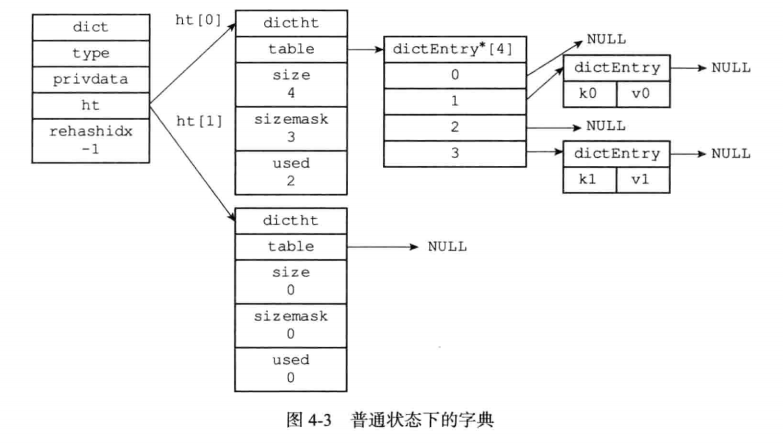
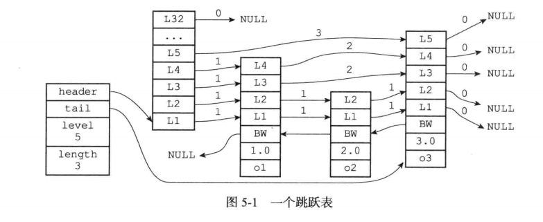
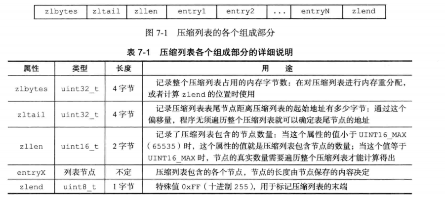
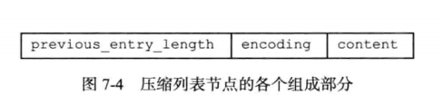
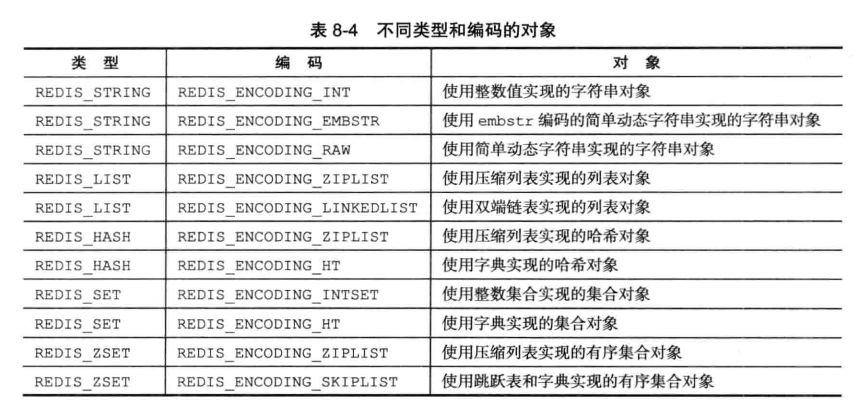

# Redis 数据结构与对象

## 简单动态字符串（SDS）

### 数据结构

```
struct sdshdr {

    // buf 中已占用空间的长度
    int len;

    // buf 中剩余可用空间的长度
    int free;

    // 数据空间
    char buf[];
};

```

SDS遵循C字符串以空字符结尾的惯例，但是那1个字节不计算在len中。

### 优点

- 常数复杂度获取字符串长度
- 杜绝缓冲区溢出：在执行操作之前，其会先检查空间是否足够。如果free的值不够，会再申请内存空间，避免溢出。
- 减少内存分配次数：通过未使用空间大小，实现了空间预分配和惰性空间释放。当需要增长字符串时，sds不仅会分配足够的空间用于增长，还会预分配未使用空间。当需要缩短sds的长度时，并不立即释放空间，而是使用free来保存剩余可用长度，并等待将来使用。当redis内存空间不足时，会自动释放sds中未使用的空间，因此也不需要担心内存泄漏问题。
- 二进制安全：所有 SDS API 都会以处理二进制的方式来处理 SDS 存放在 buf 数组里的数据， 程序不会对其中的数据做任何限制、过滤、或者假设 —— 数据在写入时是什么样的， 它被读取时就是什么样。
- 兼容部分C语言字符串函数


## 链表

### 数据结构

```
typedef struct listNode {

    // 前置节点
    struct listNode *prev;

    // 后置节点
    struct listNode *next;

    // 节点的值
    void *value;

} listNode;

typedef struct list {

    // 表头节点
    listNode *head;

    // 表尾节点
    listNode *tail;

    // 节点值复制函数
    void *(*dup)(void *ptr);

    // 节点值释放函数
    void (*free)(void *ptr);

    // 节点值对比函数
    int (*match)(void *ptr, void *key);

    // 链表所包含的节点数量
    unsigned long len;

} list;

```

## 哈希字典

### 数据结构

```
/*
 * 哈希表
 *
 * 每个字典都使用两个哈希表，从而实现渐进式 rehash 。
 */
typedef struct dictht {
    
    // 哈希表数组
    dictEntry **table;

    // 哈希表大小
    unsigned long size;
    
    // 哈希表大小掩码，用于计算索引值
    // 总是等于 size - 1
    unsigned long sizemask;

    // 该哈希表已有节点的数量
    unsigned long used;

} dictht;

/*
 * 哈希表节点
 */
typedef struct dictEntry {
    
    // 键
    void *key;

    // 值
    union {
        void *val;
        uint64_t u64;
        int64_t s64;
    } v;

    // 指向下个哈希表节点，形成链表
    struct dictEntry *next;

} dictEntry;

/*
 * 字典
 */
typedef struct dict {

    // 类型特定函数
    dictType *type;

    // 私有数据
    void *privdata;

    // 哈希表
    dictht ht[2];

    // rehash 索引
    // 当 rehash 不在进行时，值为 -1
    int rehashidx; /* rehashing not in progress if rehashidx == -1 */

    // 目前正在运行的安全迭代器的数量
    int iterators; /* number of iterators currently running */

} dict;
```



### 哈希算法

要将新的键值对加到字典，程序要先对键进行哈希算法，算出哈希值和索引值，再根据索引值，把包含新键值对的哈希表节点放到哈希表数组指定的索引上。

```
hash =dict->type->hashFunction(key);
index = hash& dict->ht[x].sizemask;

```

其中，redis的hashFunction，采用的是murmurhash2算法，是一种非加密型hash算法，其具有高速的特点。

### rehash（重新散列）

随着操作进行，哈希表保存的键值对会增加或减少，为了让哈希表的负载因子（load factor）维持在一个合理范围，当一个哈希表保存的键太多或者太少，需要对哈希表进行扩展或者收缩。扩展或收缩哈希表的过程，就称为rehash。

当以下任一条件满足，哈希表会自动进行扩展操作：

- 服务器目前没有在执行BGSAVE或者BGREWRITEAOF命令，且负载因子大于等于1。
- 服务器目前正在在执行BGSAVE或者BGREWRITEAOF命令，且负载因子大于等于5。

收缩：

- 当负载因子小于0.1时，redis自动开始哈希表的收缩工作。


rehash步骤如下：

- 给字典的ht[1]申请存储空间，大小取决于要进行的操作，以及ht[0]当前键值对的数量（ht[0].used）。假设当前ht[0].used=x。

	>如果是扩展，则ht[1]的值是第一个大于等于 `x * 2` 的 2^n 的值。例如x是30，则ht[1]的大小是第一个大于等于30*2的2n的值，即64。
	
	>如果是收缩，则ht[1]的值是第一个大于等于 x 的 2^n 的值。例如x是30，则ht[1]的大小是第一个大于等于30的2n的值，即32。
	
	> 之所以一定要 2^n，原因是只有对 2 的整数幂求模才能用二进制 hash&(n-1) 来替代

- 将保存在ht[0]上面的所有键值对，rehash 到 ht[1]，即对每个键重新采用哈希算法的方式计算哈希值和索引值，再放到相应的ht[1]的表格指定位置。
- 当ht[0]的所有键值对都rehash到ht[1]后，释放ht[0]，并将ht[1]设置为ht[0]，再新建一个空的ht[1]，用于下一次rehash。

### 渐进式 rehash

redis对ht[0]扩展或收缩到ht[1]的过程，并不是一次性完成的，而是渐进式、分多次的完成，以避免如果哈希表中存有大量键值对，一次性复制过程中，占用资源较多，会导致redis服务停用的问题。

渐进式rehash过程如下：

- 为ht[1]分配空间，让字典同时持有ht[0]和ht[1]两张哈希表。
- 将字典中的rehashidx设置成0，表示正在rehash。rehashidx的值默认是-1，表示没有在rehash。
- 在rehash进行期间，程序处理正常对字典进行增删改查以外，还会顺带将ht[0]哈希表上，rehashidx索引上，所有的键值对数据rehash到ht[1]，并且rehashidx的值加1。
- 当某个时间节点，全部的ht[0]都迁移到ht[1]后，rehashidx的值重新设定为-1，表示rehash完成。


渐进式rehash采用分而治之的工作方式，将哈希表的迁移工作所耗费的时间，平摊到增删改查中，避免集中rehash导致的庞大计算量。

在rehash期间，对哈希表的查找、修改、删除，会先在ht[0]进行。

如果ht[0]中没找到相应的内容，则会去ht[1]查找，并进行相关的修改、删除操作。而增加的操作，会直接增加到ht[1]中，目的是让ht[0]只减不增，加快迁移的速度。


## 跳跃表

### 数据结构

```
/* ZSETs use a specialized version of Skiplists */
/*
 * 跳跃表节点
 */
typedef struct zskiplistNode {

    // 成员对象
    robj *obj;

    // 分值
    double score;

    // 后退指针
    struct zskiplistNode *backward;

    // 层
    struct zskiplistLevel {

        // 前进指针
        struct zskiplistNode *forward;

        // 跨度
        unsigned int span;

    } level[];

} zskiplistNode;

/*
 * 跳跃表
 */
typedef struct zskiplist {

    // 表头节点和表尾节点
    struct zskiplistNode *header, *tail;

    // 表中节点的数量
    unsigned long length;

    // 表中层数最大的节点的层数
    int level;

} zskiplist;

```



## 整数集合

### 数据结构

```
typedef struct intset {
    // 编码方式
    uint32_t encoding;
    // 集合包含的元素数量
    uint32_t length;
    // 保存元素的数组
    int8_t contents[];
} intset;

```

### 升级

每当我们要将一个新元素添加到整数集合里面，并且新元素的类型比整数集合现有所有元素的的类型都要长时，整数集合需要先进行升级，然后才能将新元素添加到整数集合里面。

根据新元素的类型，扩展整数集合底层数组的空间大小，并为新元素分配空间。

将底层数组现有的所有元素都转换成与新元素相同的类型，并将类型转换后的元素放置到正确的位上（从后往前），而且在放置元素的过程中，需要继续位置底层数组的有序性质不变。

将新元素添加到底层数组里面。

将encoding属性更改。

升级的好处：提升整数集合的灵活性，可以随意将int16，int32，int64的值放入集合; 尽可能地节约内存


## 压缩列表

### 数据结构



每个压缩列表节点可以保存一个字节数组或者一个整数值，而每个节点都由previous_entry_length、encoding、content三个部分组成。



### 连锁更新

由于previous_entry_length可能是一个(前一个节点小于 254 字节)或者五个字节(前一个节点大于 254 字节)，所有插入和删除操作带来的连锁更新在最坏情况下需要对压缩列表执行N次空间重分配操作，而每次空间重分配的最坏复杂度为O(N)，所有连锁更新的最坏复杂度为O(N^2)。

但连锁更新的条件比较苛刻，而且压缩列表中的数据量也不会太多，因此不需要注意性能问题，平均复杂度仍然是O(N)。


## 对象

### 数据结构

```
/* 
 * Redis 对象 
 */  
typedef struct redisObject {  
  
    // 类型  
    unsigned type:4;          
  
    // 不使用(对齐位)  
    unsigned notused:2;  
  
    // 编码方式  
    unsigned encoding:4;  
  
    // LRU 时间（相对于 server.lruclock）  
    unsigned lru:22;  
  
    // 引用计数  
    int refcount;  
  
    // 指向对象的值  
    void *ptr;  
  
} robj;

```



### 字符串对象

符串对象的编码可以是int、raw、embstr

如果值是字符串对象，且长度大于32字节，那么编码为raw

如果值是字符串对象，且长度小于等于32字节，那么编码为embstr

embstr的创建只需分配一次内存，而raw为两次，分别创建redisObject结构和sdshdr结构。

redis并未提供任何修改embstr的方式，即embstr是只读的形式。对embstr的修改实际上是先转换为raw再进行修改。

命令：

- set
- get
- append

### 列表对象

列表对象的编码可以是ziplist或者linkedlist。

命令：
- lpush
- rpush
- lpop
- rpop

### 哈希对象

哈希对象的底层实现可以是ziplist或者hashtable。

命令：

- hset
- hget
- hdel

### 集合对象

集合对象的编码可以是intset或者hashtable。

hashtable 的键为集合对象，值为空指针。

命令：

- sadd
- spop:随机取出一个元素

### 有序集合对象

有序集合的编码可能两种，一种是ziplist，另一种是skiplist与dict的结合。

dict字典为有序集合创建了一个成员到分值的映射。给一用O(1)的时间查到分值。

```
typedef struct zset{
  //跳跃表指针
  zskiplist *zsl;
  //字典
  dict *dict;
}zset;

```

命令：

- zadd
- zrange:返回给定索引范围内的所有元素
- zscore:从字典取出给定成员的分值