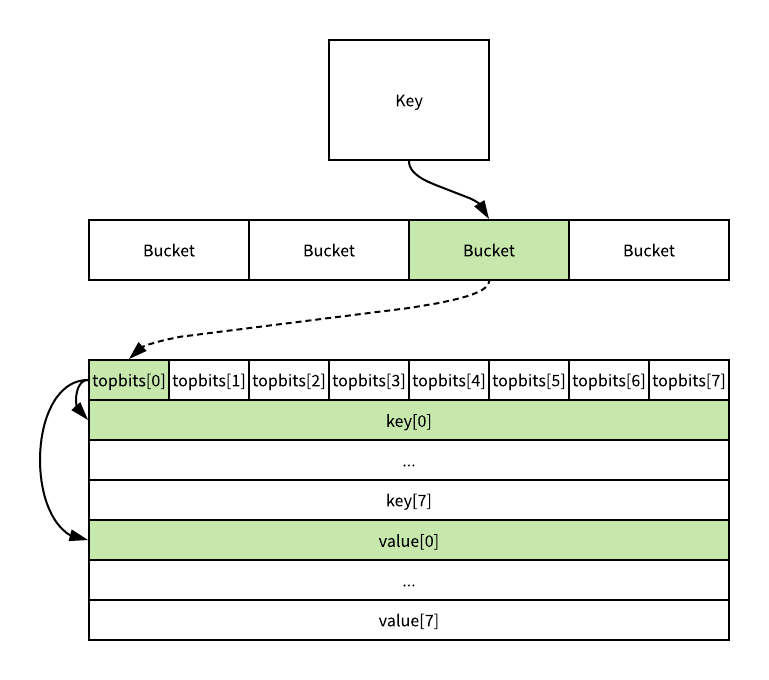
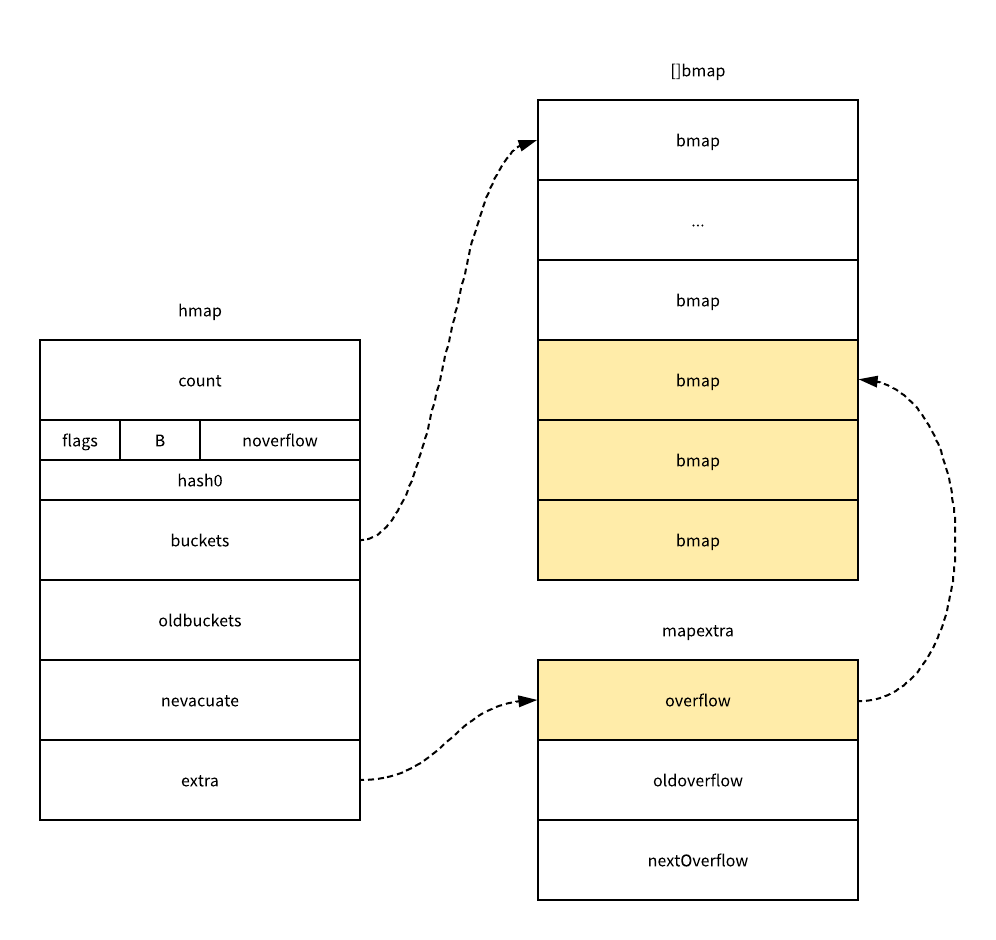
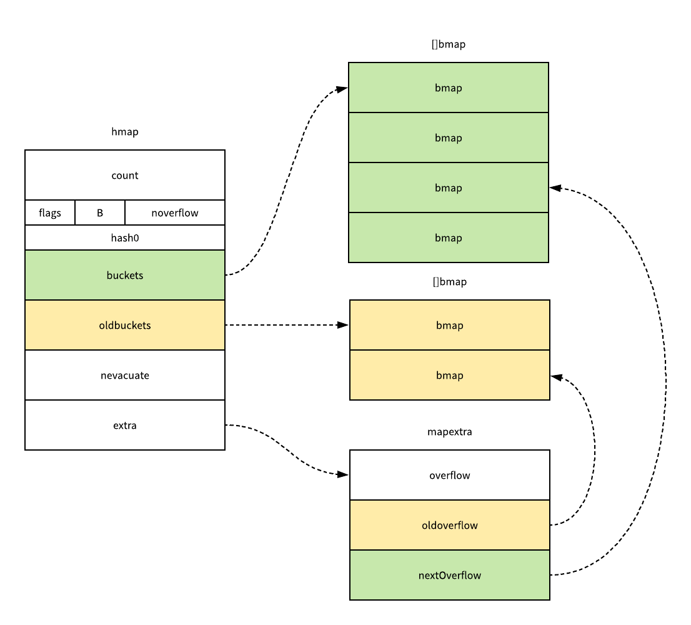
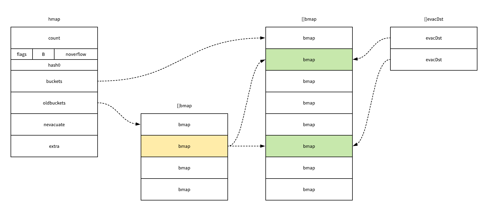

# Go Map

[TOC]

## 数据结构

### hmap

```
// A header for a Go map.
type hmap struct {
    count     int // map 中的元素个数，必须放在 struct 的第一个位置，因为 内置的 len 函数会从这里读取
    flags     uint8
    B         uint8  // log_2 of # of buckets (最多可以放 loadFactor * 2^B 个元素，再多就要 hashGrow 了)
    noverflow uint16 // overflow 的 bucket 的近似数
    hash0     uint32 // hash seed

    buckets    unsafe.Pointer // 2^B 大小的数组，如果 count == 0 的话，可能是 nil
    oldbuckets unsafe.Pointer // 一半大小的之前的 bucket 数组，只有在 growing 过程中是非 nil
    nevacuate  uintptr        // progress counter for evacuation (buckets less than this have been evacuated)

    extra *mapextra // 当 key 和 value 都可以 inline 的时候，就会用这个字段
}

type mapextra struct {
    // 如果 key 和 value 都不包含指针，并且可以被 inline(<=128 字节)
    // 使用 extra 来存储 overflow bucket，这样可以避免 GC 扫描整个 map
    // 然而 bmap.overflow 也是个指针。这时候我们只能把这些 overflow 的指针
    // 都放在 hmap.extra.overflow 和 hmap.extra.oldoverflow 中了
    // overflow 包含的是 hmap.buckets 的 overflow 的 bucket
    // oldoverflow 包含扩容时的 hmap.oldbuckets 的 overflow 的 bucket
    overflow    *[]*bmap
    oldoverflow *[]*bmap

    // 指向空闲的 overflow bucket 的指针
    nextOverflow *bmap
}
```

- count 用于记录当前哈希表元素数量，这个字段让我们不再需要去遍历整个哈希表来获取长度；
- B 表示了当前哈希表持有的 buckets 数量，但是因为哈希表的扩容是以 2 倍数进行的，所以这里会使用对数来存储，我们可以简单理解成 len(buckets) == 2^B；
- hash0 是哈希的种子，这个值会在调用哈希函数的时候作为参数传进去，它的主要作用就是为哈希函数的结果引入一定的随机性；
- oldbuckets 是哈希在扩容时用于保存之前 buckets 的字段，它的大小都是当前 buckets 的一半；

### bmap

哈希表的类型其实都存储在每一个桶中，这个桶的结构体 bmap 其实在 Go 语言源代码中的定义只包含一个简单的 tophash 字段：

```
type bmap struct {
    tophash [bucketCnt]uint8
}
```

哈希表中桶的真正结构其实是在编译期间运行的函数 bmap 中被『动态』创建的,我们可以根据上面这个函数的实现对结构体 bmap 进行重建：

```
type bmap struct {
    topbits  [8]uint8
    keys     [8]keytype
    values   [8]valuetype
    pad      uintptr
    overflow uintptr
}

```
0.0.0.0:33306-
每一个哈希表中的桶最多只能存储 8 个元素，如果桶中存储的元素超过 8 个，那么这个哈希表的执行效率一定会急剧下降，不过在实际使用中如果一个哈希表存储的数据逐渐增多，我们会对哈希表进行扩容或者使用额外的桶存储溢出的数据，不会让单个桶中的数据超过 8 个。



## 初始化


```
// make(map[k]v, hint)
// 如果编译器认为 map 和第一个 bucket 可以直接创建在栈上，h 和 bucket 可能都是非空
// h != nil，可以直接在 h 内创建 map
// 如果 h.buckets != nil，其指向的 bucket 可以作为第一个 bucket 来使用
func makemap(t *maptype, hint int, h *hmap) *hmap {
    // 初始化 hmap
    if h == nil {
        h = (*hmap)(newobject(t.hmap))
    }
    h.hash0 = fastrand()

    // 按照提供的元素个数，找一个可以放得下这么多元素的 B 值
    B := uint8(0)
    for overLoadFactor(hint, B) {
        B++
    }
    h.B = B

    // 分配初始的 hash table
    // 如果 B == 0，buckets 字段会由 mapassign 来 lazily 分配
    // 因为如果 hint 很大的话，对这部分内存归零会花比较长时间
    if h.B != 0 {
        var nextOverflow *bmap
        h.buckets, nextOverflow = makeBucketArray(t, h.B)
        if nextOverflow != nil {
            h.extra = new(mapextra)
            h.extra.nextOverflow = nextOverflow
        }
    }

    return h
}

```

这个函数会通过 fastrand 创建一个随机的哈希种子，然后根据传入的 hint 计算出需要的最小需要的桶的数量，最后再使用 makeBucketArray创建用于保存桶的数组，这个方法其实就是根据传入的 B 计算出的需要创建的桶数量在内存中分配一片连续的空间用于存储数据，在创建桶的过程中还会额外创建一些用于保存溢出数据的桶，数量是 2^(B-4) 个。



## 元素访问

赋值语句左侧接受参数的个数也会影响最终调用的运行时参数，当接受参数仅为一个时，会使用 mapaccess1 函数，同时接受键对应的值以及一个指示键是否存在的布尔值时就会使用 mapaccess2 函数，mapaccess1 函数仅会返回一个指向目标值的指针：

```
func mapaccess2(t *maptype, h *hmap, key unsafe.Pointer) (unsafe.Pointer, bool) {
    // map 为空，或者元素数为 0，直接返回未找到
    if h == nil || h.count == 0 {
        return unsafe.Pointer(&zeroVal[0]), false
    }
    if h.flags&hashWriting != 0 {
        throw("concurrent map read and map write")
    }
    alg := t.key.alg
    // 不同类型的 key，所用的 hash 算法是不一样的
    // 具体可以参考 algarray
    hash := alg.hash(key, uintptr(h.hash0))
    // 如果 B = 3，那么结果用二进制表示就是 111
    // 如果 B = 4，那么结果用二进制表示就是 1111
    m := bucketMask(h.B)
    // 按位 &，可以 select 出对应的 bucket
    b := (*bmap)(unsafe.Pointer(uintptr(h.buckets) + (hash&m)*uintptr(t.bucketsize)))
    // 会用到 h.oldbuckets 时，说明 map 发生了扩容
    // 这时候，新的 buckets 里可能还没有老的内容
    // 所以一定要在老的里面找，否则有可能发生“消失”的诡异现象
    if c := h.oldbuckets; c != nil {
        if !h.sameSizeGrow() {
            // 说明之前只有一半的 bucket，需要除 2
            m >>= 1
        }
        oldb := (*bmap)(unsafe.Pointer(uintptr(c) + (hash&m)*uintptr(t.bucketsize)))
        if !evacuated(oldb) { // 如果当前的 bucket 并没有进行数据迁移，那么访问旧的 bucket
            b = oldb
        }
    }
    // tophash 取其高 8bit 的值
    top := tophash(hash)
    for ; b != nil; b = b.overflow(t) {
        // 一个 bucket 在存储满 8 个元素后，就再也放不下了
        // 这时候会创建新的 bucket
        // 挂在原来的 bucket 的 overflow 指针成员上
        for i := uintptr(0); i < bucketCnt; i++ {
            // 循环对比 bucket 中的 tophash 数组
            // 如果找到了相等的 tophash，那说明就是这个 bucket 了
            if b.tophash[i] != top {
                continue
            }
            k := add(unsafe.Pointer(b), dataOffset+i*uintptr(t.keysize))
            if t.indirectkey {
                k = *((*unsafe.Pointer)(k))
            }
            if alg.equal(key, k) {
                v := add(unsafe.Pointer(b), dataOffset+bucketCnt*uintptr(t.keysize)+i*uintptr(t.valuesize))
                if t.indirectvalue {
                    v = *((*unsafe.Pointer)(v))
                }
                return v, true
            }
        }
    }

    // 所有 bucket 都没有找到，返回零值和 false
    return unsafe.Pointer(&zeroVal[0]), false
}

```

## 赋值


```
// 和 mapaccess 函数差不多，但在没有找到 key 时，会为 key 分配一个新的槽位
func mapassign(t *maptype, h *hmap, key unsafe.Pointer) unsafe.Pointer {
    // 调用对应类型的 hash 算法
    alg := t.key.alg
    hash := alg.hash(key, uintptr(h.hash0))

    // 调用 alg.hash 设置 hashWriting 的 flag，因为 alg.hash 可能会 panic
    // 这时候我们没法完成一次写操作
    h.flags |= hashWriting

    if h.buckets == nil {
        // 分配第一个 buckt
        h.buckets = newobject(t.bucket) // newarray(t.bucket, 1)
    }

again:
    // 计算低 8 位 hash，根据计算出的 bucketMask 选择对应的 bucket
    // mask : 1111111
    bucket := hash & bucketMask(h.B)
    if h.growing() {    // 如果正在进行扩容操作
        growWork(t, h, bucket)  // 对 bucket 进行增量迁移数据
    }
    // 计算出存储的 bucket 的内存位置
    // pos = start + bucketNumber * bucetsize
    b := (*bmap)(unsafe.Pointer(uintptr(h.buckets) + bucket*uintptr(t.bucketsize)))
    // 计算高 8 位 hash
    top := tophash(hash)

    var inserti *uint8
    var insertk unsafe.Pointer
    var val unsafe.Pointer
    for {
        for i := uintptr(0); i < bucketCnt; i++ {
            // 遍历 8 个 bucket 中的元素
            // 这里的 bucketCnt 是全局常量
            if b.tophash[i] != top {
                // 在 b.tophash[i] != top 的情况下
                // 理论上有可能会是一个空槽位
                // 一般情况下 map 的槽位分布是这样的，e 表示 empty:
                // [h1][h2][h3][h4][h5][e][e][e]
                // 但在执行过 delete 操作时，可能会变成这样:
                // [h1][h2][e][e][h5][e][e][e]
                // 所以如果再插入的话，会尽量往前面的位置插
                // [h1][h2][e][e][h5][e][e][e]
                //          ^
                //          ^
                //       这个位置
                // 所以在循环的时候还要顺便把前面的空位置先记下来
                if b.tophash[i] == empty && inserti == nil {
                    // 如果真的在 bucket 里面找不到 key，那么就要在 val 里面插入新值
                    // 如果这个槽位没有被占，说明可以往这里塞 key 和 value
                    inserti = &b.tophash[i] // tophash 的插入位置
                    insertk = add(unsafe.Pointer(b), dataOffset+i*uintptr(t.keysize))
                    val = add(unsafe.Pointer(b), dataOffset+bucketCnt*uintptr(t.keysize)+i*uintptr(t.valuesize))
                }
                continue  // 由于还没有遍历完毕，继续遍历，查找是否有 key 这个元素
            }
            
            // tophash 相同，key 不一定相同
            k := add(unsafe.Pointer(b), dataOffset+i*uintptr(t.keysize))
            if t.indirectkey {
                k = *((*unsafe.Pointer)(k))
            }
            
            // 如果相同的 hash 位置的 key 和要插入的 key 字面上不相等
            // 如果两个 key 的首八位后最后八位哈希值一样，就会进行其值比较
            // 算是一种哈希碰撞吧
            if !alg.equal(key, k) {
                continue
            }
            
            // key 也相同，说明找到了元素
            // 对应的位置已经有 key 了，直接更新就行
            if t.needkeyupdate {
                typedmemmove(t.key, k, key)
            }
            
            val = add(unsafe.Pointer(b), dataOffset+bucketCnt*uintptr(t.keysize)+i*uintptr(t.valuesize))
            goto done
        }
        
        // bucket 的 8 个槽没有满足条件的能插入或者能更新的，去 overflow 里继续找
        ovf := b.overflow(t)
        // 如果 overflow 为 nil，说明到了 overflow 链表的末端了
        if ovf == nil {
            break
        }
        // 赋值为链表的下一个元素，继续循环
        b = ovf
    }

    // 没有找到 key，分配新的空间

    // 如果触发了最大的 load factor，或者已经有太多 overflow buckets
    // 并且这个时刻没有在进行 growing 的途中，那么就开始 growing
    if !h.growing() && (overLoadFactor(h.count+1, h.B) || tooManyOverflowBuckets(h.noverflow, h.B)) {
        hashGrow(t, h)
        // hashGrow 的时候会把当前的 bucket 放到 oldbucket 里
        // 但还没有开始分配新的 bucket，所以需要到 again 重试一次
        // 重试的时候在 growWork 里会把这个 key 的 bucket 优先分配好
        goto again // Growing the table invalidates everything, so try again
    }

    if inserti == nil {
        // 前面在桶里找的时候，没有找到能塞这个 tophash 的位置
        // 说明当前所有 buckets 都是满的，分配一个新的 bucket
        newb := h.newoverflow(t, b)
        inserti = &newb.tophash[0]
        insertk = add(unsafe.Pointer(newb), dataOffset)
        val = add(insertk, bucketCnt*uintptr(t.keysize))
    }

    // 没有找到元素，但是找到了可以插入的地方
    // 把新的 key 和 value 存储到应插入的位置
    if t.indirectkey {
        kmem := newobject(t.key)
        *(*unsafe.Pointer)(insertk) = kmem
        insertk = kmem
    }
    if t.indirectvalue {
        vmem := newobject(t.elem)
        *(*unsafe.Pointer)(val) = vmem
    }
    typedmemmove(t.key, insertk, key)
    *inserti = top
    h.count++

done:
    if h.flags&hashWriting == 0 {
        throw("concurrent map writes")
    }
    h.flags &^= hashWriting
    if t.indirectvalue {
        val = *((*unsafe.Pointer)(val))
    }
    return val
}

```

## 删除

哈希表的删除逻辑与写入逻辑非常相似.

```
func mapdelete(t *maptype, h *hmap, key unsafe.Pointer) {
    if h == nil || h.count == 0 {
        return
    }
    if h.flags&hashWriting != 0 {
        throw("concurrent map writes")
    }

    alg := t.key.alg
    hash := alg.hash(key, uintptr(h.hash0))

    // 调用 alg.hash 设置 hashWriting 的 flag，因为 alg.hash 可能会 panic
    // 这时候我们没法完成一次写操作
    h.flags |= hashWriting

    // 按低 8 位 hash 值选择 bucket
    bucket := hash & bucketMask(h.B)
    if h.growing() {
        growWork(t, h, bucket)
    }
    // 按上面算出的桶的索引，找到 bucket 的内存地址
    // 并强制转换为需要的 bmap 结构
    b := (*bmap)(add(h.buckets, bucket*uintptr(t.bucketsize)))
    // 高 8 位 hash 值
    top := tophash(hash)
search:
    for ; b != nil; b = b.overflow(t) {
        for i := uintptr(0); i < bucketCnt; i++ {
            // 和上面的差不多，8 个槽位，分别对比 tophash
            // 没找到的话就去外围 for 循环的 overflow 链表中继续查找
            if b.tophash[i] != top {
                continue
            }

            // b.tophash[i] == top
            // 计算 k 所在的槽位的内存地址
            k := add(unsafe.Pointer(b), dataOffset+i*uintptr(t.keysize))
            k2 := k
            // 如果 key > 128 字节
            if t.indirectkey {
                k2 = *((*unsafe.Pointer)(k2))
            }

            // 当高 8 位哈希值相等时，还需要对具体值进行比较
            // 以避免哈希冲突时值覆盖
            if !alg.equal(key, k2) {
                continue
            }

            // 如果 key 中是指针，那么清空 key 的内容
            if t.indirectkey {
                *(*unsafe.Pointer)(k) = nil
            } else if t.key.kind&kindNoPointers == 0 {
                memclrHasPointers(k, t.key.size)
            }

            // 计算 value 所在的内存地址
            v := add(unsafe.Pointer(b), dataOffset+bucketCnt*uintptr(t.keysize)+i*uintptr(t.valuesize))
            // 和上面 key 的逻辑差不多
            if t.indirectvalue {
                *(*unsafe.Pointer)(v) = nil
            } else if t.elem.kind&kindNoPointers == 0 {
                memclrHasPointers(v, t.elem.size)
            } else {
                memclrNoHeapPointers(v, t.elem.size)
            }
            // 设置 tophash[i] = 0
            b.tophash[i] = empty
            // hmap 的大小计数 -1
            h.count--
            break search
        }
    }

    if h.flags&hashWriting == 0 {
        throw("concurrent map writes")
    }
    h.flags &^= hashWriting
}

```

## 扩容

扩容触发在 mapassign 中，我们之前注释过了，主要是两点:

- 是不是已经到了 load factor 的临界点，即元素个数 >= 桶个数 * 6.5，这时候说明大部分的桶可能都快满了，如果插入新元素，有大概率需要挂在 overflow 的桶上。
- overflow 的桶是不是太多了，当 bucket 总数 < 2 ^ 15 时，如果 overflow 的 bucket 总数 >= bucket 的总数，那么我们认为 overflow 的桶太多了。当 bucket 总数 >= 2 ^ 15 时，那我们直接和 2 ^ 15 比较，overflow 的 bucket >= 2 ^ 15 时，即认为溢出桶太多了。为啥会导致这种情况呢？是因为我们对 map 一边插入，一边删除，会导致其中很多桶出现空洞，这样使得 bucket 使用率不高，值存储得比较稀疏。在查找时效率会下降。

两种情况官方采用了不同的解决方法:

- 针对 1，将 B + 1，进而 hmap 的 bucket 数组扩容一倍；
- 针对 2，通过移动 bucket 内容，使其倾向于紧密排列从而提高 bucket 利用率。

实际上这里还有一种麻烦的情况，如果 map 中有某个键存在大量的哈希冲突的话，也会导致落入 2 中的判断，这时候对 bucket 的内容进行移动其实没什么意义，反而是纯粹的无用功，所以理论上存在对 Go 的 map 进行 hash 碰撞攻击的可能性。


```
func hashGrow(t *maptype, h *hmap) {
    // 如果已经超过了 load factor 的阈值，那么需要对 map 进行扩容，即 B = B + 1，bucket 总数会变为原来的二倍
    // 如果还没到阈值，那么只需要保持相同数量的 bucket，横向拍平就行了

    bigger := uint8(1)
    if !overLoadFactor(h.count+1, h.B) {
        bigger = 0
        h.flags |= sameSizeGrow
    }
    oldbuckets := h.buckets
    newbuckets, nextOverflow := makeBucketArray(t, h.B+bigger, nil)

    flags := h.flags &^ (iterator | oldIterator)
    if h.flags&iterator != 0 {
        flags |= oldIterator
    }

    // 提交扩容结果
    h.B += bigger
    h.flags = flags
    h.oldbuckets = oldbuckets
    h.buckets = newbuckets
    h.nevacuate = 0
    h.noverflow = 0

    if h.extra != nil && h.extra.overflow != nil {
        // 把当前的 overflow 赋值给 oldoverflow
        if h.extra.oldoverflow != nil {
            throw("oldoverflow is not nil")
        }
        h.extra.oldoverflow = h.extra.overflow
        h.extra.overflow = nil
    }
    if nextOverflow != nil {
        if h.extra == nil {
            h.extra = new(mapextra)
        }
        h.extra.nextOverflow = nextOverflow
    }

    // 实际的哈希表元素的拷贝工作是在 growWork 和 evacuate 中增量慢慢地进行的
}
```

在哈希表扩容的过程中，我们会通过 makeBucketArray 创建新的桶数组和一些预创建的溢出桶，随后对将原有的桶数组设置到 oldbuckets 上并将新的空桶设置到 buckets 上，原有的溢出桶也使用了相同的逻辑进行更新。



我们在上面的函数中还看不出来 sameSizeGrow 导致的区别，因为这里其实只是创建了新的桶并没有对数据记性任何的拷贝和转移，哈希表真正的『数据迁移』的执行过程其实是在 evacuate 函数中进行的，evacuate 函数会对传入桶中的元素进行『再分配』。

```
func growWork(t *maptype, h *hmap, bucket uintptr) {
    // 确保我们移动的 oldbucket 对应的是我们马上就要用到的那一个
    evacuate(t, h, bucket&h.oldbucketmask())

    // 如果还在 growing 状态，再多移动一个 oldbucket
    if h.growing() {
        evacuate(t, h, h.nevacuate)
    }
}

func evacuate(t *maptype, h *hmap, oldbucket uintptr) {
    b := (*bmap)(add(h.oldbuckets, oldbucket*uintptr(t.bucketsize)))
    newbit := h.noldbuckets()
    if !evacuated(b) {
        // TODO: reuse overflow buckets instead of using new ones, if there
        // is no iterator using the old buckets.  (If !oldIterator.)

        // xy 包含的是移动的目标
        // x 表示新 bucket 数组的前(low)半部分
        // y 表示新 bucket 数组的后(high)半部分
        var xy [2]evacDst
        x := &xy[0]
        x.b = (*bmap)(add(h.buckets, oldbucket*uintptr(t.bucketsize)))
        x.k = add(unsafe.Pointer(x.b), dataOffset)
        x.v = add(x.k, bucketCnt*uintptr(t.keysize))

        if !h.sameSizeGrow() {
            // 如果 map 大小(hmap.B)增大了，那么我们只计算 y
            // 否则 GC 可能会看到损坏的指针
            y := &xy[1]
            y.b = (*bmap)(add(h.buckets, (oldbucket+newbit)*uintptr(t.bucketsize)))
            y.k = add(unsafe.Pointer(y.b), dataOffset)
            y.v = add(y.k, bucketCnt*uintptr(t.keysize))
        }

        for ; b != nil; b = b.overflow(t) {
            k := add(unsafe.Pointer(b), dataOffset)
            v := add(k, bucketCnt*uintptr(t.keysize))
            for i := 0; i < bucketCnt; i, k, v = i+1, add(k, uintptr(t.keysize)), add(v, uintptr(t.valuesize)) {
                top := b.tophash[i]
                if top == empty {
                    b.tophash[i] = evacuatedEmpty
                    continue
                }
                if top < minTopHash {
                    throw("bad map state")
                }
                k2 := k
                if t.indirectkey {
                    k2 = *((*unsafe.Pointer)(k2))
                }
                var useY uint8
                if !h.sameSizeGrow() {
                    // 计算哈希，以判断我们的数据要转移到哪一部分的 bucket
                    // 可能是 x 部分，也可能是 y 部分
                    hash := t.key.alg.hash(k2, uintptr(h.hash0))
                    if h.flags&iterator != 0 && !t.reflexivekey && !t.key.alg.equal(k2, k2) {
                        // 为什么要加 reflexivekey 的判断，可以参考这里:
                        // https://go-review.googlesource.com/c/go/+/1480
                        // key != key，只有在 float 数的 NaN 时会出现
                        // 比如:
                        // n1 := math.NaN()
                        // n2 := math.NaN()
                        // fmt.Println(n1, n2)
                        // fmt.Println(n1 == n2)
                        // 这种情况下 n1 和 n2 的哈希值也完全不一样
                        // 这里官方表示这种情况是不可复现的
                        // 需要在 iterators 参与的情况下才能复现
                        // 但是对于这种 key 我们也可以随意对其目标进行发配
                        // 同时 tophash 对于 NaN 也没啥意义
                        // 还是按正常的情况下算一个随机的 tophash
                        // 然后公平地把这些 key 平均分布到各 bucket 就好
                        useY = top & 1 // 让这个 key 50% 概率去 Y 半区
                        top = tophash(hash)
                    } else {
                        // 这里写的比较 trick
                        // 比如当前有 8 个桶
                        // 那么如果 hash & 8 != 0
                        // 那么说明这个元素的 hash 这种形式
                        // xxx1xxx
                        // 而扩容后的 bucketMask 是
                        //    1111
                        // 所以实际上这个就是
                        // xxx1xxx & 1000 > 0
                        // 说明这个元素在扩容后一定会去上半区
                        // 所以就是 useY 了
                        if hash&newbit != 0 {
                            useY = 1
                        }
                    }
                }

                if evacuatedX+1 != evacuatedY {
                    throw("bad evacuatedN")
                }

                b.tophash[i] = evacuatedX + useY // evacuatedX + 1 == evacuatedY
                dst := &xy[useY]                 // 移动目标

                if dst.i == bucketCnt {
                    dst.b = h.newoverflow(t, dst.b)
                    dst.i = 0
                    dst.k = add(unsafe.Pointer(dst.b), dataOffset)
                    dst.v = add(dst.k, bucketCnt*uintptr(t.keysize))
                }
                dst.b.tophash[dst.i&(bucketCnt-1)] = top // mask dst.i as an optimization, to avoid a bounds check
                if t.indirectkey {
                    *(*unsafe.Pointer)(dst.k) = k2 // 拷贝指针
                } else {
                    typedmemmove(t.key, dst.k, k) // 拷贝值
                }
                if t.indirectvalue {
                    *(*unsafe.Pointer)(dst.v) = *(*unsafe.Pointer)(v)
                } else {
                    typedmemmove(t.elem, dst.v, v)
                }
                dst.i++
                // These updates might push these pointers past the end of the
                // key or value arrays.  That's ok, as we have the overflow pointer
                // at the end of the bucket to protect against pointing past the
                // end of the bucket.
                dst.k = add(dst.k, uintptr(t.keysize))
                dst.v = add(dst.v, uintptr(t.valuesize))
            }
        }
        // Unlink the overflow buckets & clear key/value to help GC.
        if h.flags&oldIterator == 0 && t.bucket.kind&kindNoPointers == 0 {
            b := add(h.oldbuckets, oldbucket*uintptr(t.bucketsize))
            // Preserve b.tophash because the evacuation
            // state is maintained there.
            ptr := add(b, dataOffset)
            n := uintptr(t.bucketsize) - dataOffset
            memclrHasPointers(ptr, n)
        }
    }

    if oldbucket == h.nevacuate {
        advanceEvacuationMark(h, t, newbit)
    }
}

```

evacuate 函数在最开始时会创建一个用于保存分配目的 evacDst 结构体数组，其中保存了目标桶的指针、目标桶存储的元素数量以及当前键和值存储的位置。



如果这是一次不改变大小的扩容，这两个 evacDst 结构体只会初始化一个，当哈希表的容量翻倍时，一个桶中的元素会被分流到新创建的两个桶中，这两个桶同时会被 evacDst 数组引用.

如果新的哈希表中有八个桶，在大多数情况下，原来经过桶掩码结果为一的数据会因为桶掩码增加了一位而被分留到了新的一号桶和五号桶，所有的数据也都会被 typedmemmove 拷贝到目标桶的键和值所在的内存空间.

该函数的最后会调用 advanceEvacuationMark 函数，它会增加哈希的 nevacuate 计数器，然后在所有的旧桶都被分流后删除这些无用的数据，然而因为 Go 语言数据的迁移过程不是一次性执行完毕的，它只会在写入或者删除时触发 evacuate 函数增量完成的，所以不会瞬间对性能造成影响。
