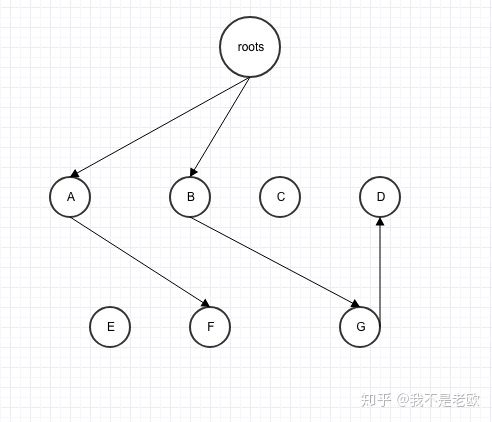
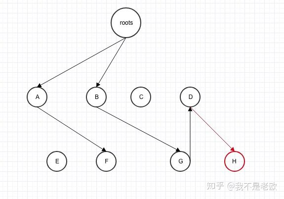
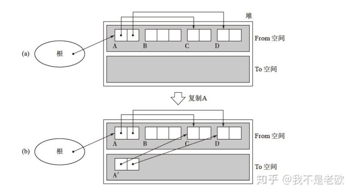
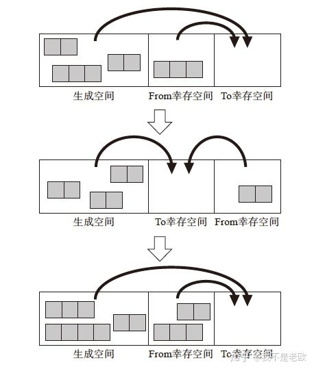
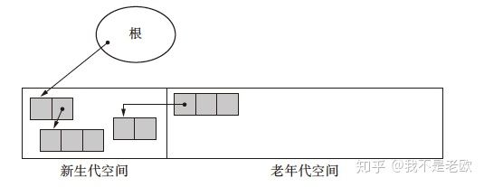
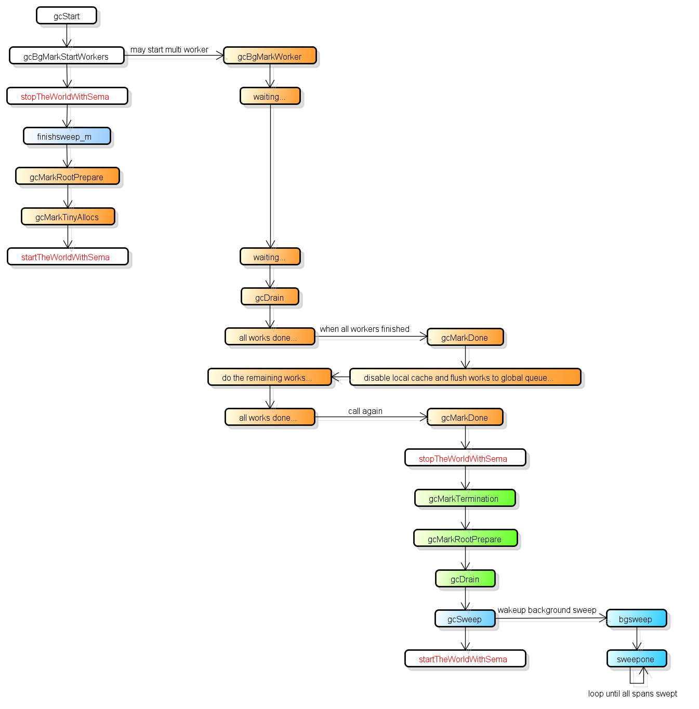

# Go 垃圾回收

## 常见的GC算法

### 标记-清除算法 STW

标记清除是最简单的也是最古老的垃圾回收算法。 它的思想很简单：

- 先从根对象开始扫描，当我们的根对象指向了某个堆上的对象，我们就认为这个对象是可达的。

- 可达对象指向的对象也是可达对象。

- 从根对象开始遍历，采用深度遍历或者广度遍历



如上图，根对象指向了A、B，说明A、B是可达的，同理F、G、D都是可达的对象，但是C、E就是不可达的对象，它们是要被清理的。

我们再来看看它的整个流程：

- 触发垃圾回收事件发生，一般是当申请堆内存的时候，做一个检测机制，或者定时回收 2.STW（Stop The World），挂起整个程序，等待GC
- 从根对象开始扫描，在每个可达的对象的header做一个标记
- 清除阶段，扫描整个堆，发现是活跃对象的话（根据header的标志），则清除掉它的标志位即可。如果发现是非活跃对象即不可达对象，则把对象作为分块，连接到被称为“空闲链表”的单向链表。在之后进行分配时只要遍历这个空闲链表，就可以找到分块了。
- 清除完成，继续程序。

记清楚最大的一个缺点就是STW，这个很多场景下不能容忍的，我们先来分析下为什么要STW，想象一下，当你的标记阶段正在进行中，而你的程序也在跑，突然创建了一个新对象，也是可达的，比如如下图所示:



当我已经标记完D之后，认为到它这就完事了，但是我们创建的新对象H就会在清除节点被认为是不可达的，最终被清理掉。在清除阶段也会遇到同样的问题。

### 引用计数

- 我们给每个对象都分配一个计数器，代表有多少其他的对象引用我
- 当没有对象再引用我的时候，就代表我没用了，就是垃圾可以被回收了 我们来张图看看

### 节点复制

节点复制的想法比较的奇特，我们想想，标记清除算法中有两个阶段，第一步找到活跃的对象给它标记上，第二步扫描整个堆，把其余未标记的对象清除掉，这两个步骤能不能节省一个步骤呢？再有就是我们的对象申请的时候，都是从空闲链表上获取的，找到一个合适大小的内存块这个速度是比较慢的，我们知道栈内存的申请是很快，为什么呢？因为栈是一块连续的空间，申请的时候只需要按照地址增长的申请即可，是O(1)的，堆我觉得至少得O(logN)。 ok，节点复制其实就是为了解决我们提到的以上两个问题。先来看看它是怎么做的吧:

- 首先它是把堆的内存分为两个部分，并且是均分。一个叫From，一个To。
- From内存块就是我们内存分配的时候用的。
- 当我们要进行GC的时候，我们把活跃的对象直接复制到To内存空间中去，然后直接把To空间换做我们的程序使用的空间，再把From整体清空，然后再把From作为To。




优缺点：

- 分配速度快，既然它没有空闲链表的概念，直接当成一个栈内存分配即可，速度飞起，相应的就没有碎片化的苦恼了。

- 吞吐量高，其实就是GC速度快，如同我们之前所说，它不像标记清除那样进行第二个阶段去扫描所有的堆。

- 还有一个比较有意思的地方，通过老空间的内容复制到新空间之后，相互有引用的对象会被分配在距离较近的地方，还记得程序的局部性原理吗？这会提升我们的缓存命中率

- 优点那么好，肯定优缺点，第一个就是太浪费内存了，我们只能用一半！！！

- 这里面也有递归的操作，效率可能会降低，或者有可能引起栈溢出的问题。

- 同样的，它也有STW的时间，复制清除的过程需要暂停程序。

### 分代收集

分代收集只是一种思想，并非一个专门的垃圾回收算法，不过这个想法真妙，值得学习，在平常的性能优化过程中应该很有用。 所谓分代，谜底就在字面上，就是把我们堆分配的对象，给他分代（上一代，下一代的意思），我们这里只说分成新旧两代的算法，那么分代按照什么分呢？按照我们的垃圾的生命周期来分，意思就是很快编程垃圾的那种对象被分为年轻的一代，相应的很长时间才变成垃圾的对象被称为老的一代，我们每次只对年轻一代的对象进行GC即可，每次GC都会给对象增加一个年龄，当到达老一代的对象的年龄的限制的时候，再把它升级为老对象，放到老对象的空间中，当老对象的空间满的时候，我们再去GC老对象即可。

这种算法基于这样的认知，大部分对象创建后很快就变成垃圾，其余的就是很长时间才会变成垃圾，那么我们没必要对这种长时间才变成垃圾的对象进行GC，浪费时间。 ok，我们来看下David Ungar研究的分代GC算法：

- 该算法把堆空间划分为四个部分，分别是生成空间，幸存空间1，幸存空间2，老年代空间。并且我们把前三者合并成为新生代空间。

- 当对象刚创建的时候，分配的空间就是在生成空间。

- 当生成空间满的时候，我们就对新生代空间进行GC，这里是是对整个新生代空间进行GC，采用的GC的算法就是节点复制。我们看图说话：



看上图，我们把幸存空间其中一个作为一个To空间。

- 另外，我们每次GC的时候，都会对对象的“年龄”加1，当判断对象的年龄到达一定阈值的时候，就把对象移动到老年代空间。

-  当我们对新生代对象进行GC的时候，我们注意一点，之前看节点复制的时候，我们知道是从根节点开始扫描，但是注意一有可能我们的老年代的对象也会指向新生代，所以如果我们把这点漏掉了，会多清除一些活跃的对象（至于为什么我们稍后解释）。为了解决这个问题，我们需要把老年代的对象扫描一遍，但是想想如果这样做的话我们岂不是每次要GC新生代对象的时候，都要把新、老都扫描了？这样的话我们的分代GC就没有优点了，如下图。



- 为了解决第5步的问题，David Ungar想到了一个方法，用一个记录集来记录那些老年代的对象指向新生代的情况。这样的话，当我们的GC新生代的时候，从根对象与记录集中就行，那么这个记录怎么做到呢，采用的写入屏障（write barrier）的方法。

- 那么我们什么时候GC老年代对象的呢？当我们发现新生代的对象的年龄到了之后，要晋升为老年代对象的时候，会先检查老年代空间是否满了，满的话我们就开始老年代GC，老年代对象GC采用的就是标记清除的方法，注意这里应该是把整个堆都进行了GC。


## Go 的三色标记法

在golang1.5之前，golang主要是采用标记清除的方法，这样的话STW时间会很长，1.5出来后采用了三色标记法，也是我们今天主要说的。 golang为何要选择三色标记算法呢？我们知道golang比较适合网络高并发的服务场景，那么如果使用STW时间较长的GC算法，对服务来说是致命的，故而要选用STW时间较少的算法，在标记清除的基础上发展来的三色标记出现了。 三色标记的思想其实是尽量把标记阶段、清除阶段与程序同时跑，它其实是一种增量式GC算法，所谓增量式其实就是把GC过程拆分出来的意思，跟我们要把最大的STW时间减少的思想吻合。

在看整个过程之前，我们先同步几件事情：

- 在三色标记算法中，我们给对象进行了标记颜色，分别是白色、灰色、黑色，在GC开始的时候，所有的对象默认都是白色，标记完成之后，所有的可达的对象都会被标记为黑色，而灰色就是我们的中间状态

- 我们Golang的GC的根对象，都在栈上，所谓栈其实就是协程栈。

我们来看下其整个过程：

- root_scan：首先，当要GC触发的时候，首先，我们会初始化写屏障（Write barrier），我们的垃圾回收器从根对象开始扫描，把所有的垃圾根对象压入一个栈当中，并且把对象都会标记为灰色

- mark：从栈中pop出一个对象，把该对象所有指向的子对象都入栈，并且标记为灰色，并且把该对象标记为黑色，然后放入黑色的对象集合中。mark 是分多次运行的，即增量式的 mark，不需要 STW，它和 mutator 交替运行。它主要是弹出栈里面的对象，将其子对象涂成灰色，压入栈，然后把这个对象涂成黑色。重复这个过程，直到栈为空。

- 无限的重复第二个步骤，直到栈为空。

- mark termination：在第一步骤中我们看到有写屏障，这个写屏障其实就是记录我们进行第一次扫描的时候漏掉的那些对内存的操作，我们会再次遍历这些记录（稍后细说），注意这个过程会进行STW，但是时间会很短。

- sweep：sweep也是分多次的，增量式的回收垃圾，跟mutator交替运行。跟标记-清除算法的实现基本一致，也是需要遍历整个堆，将白色对象挂到空闲链表上，黑色对象取消mark标记。

```
简单的说主要分为四个阶段：

root_scan：STW
mark...mark...mark...mark...
mark termination：STW
sweep...sweep...sweep...

```

注意：

- 还记得我们在说golang的堆内存管理与协程栈管理吗？首先栈的管理中有一个stackmap可以帮助我们寻找到到协程栈上的指针，这其实就是我们的根对象

- Edsger W. Dijkstra提出的三色标记法中，有一个地方需要注意，在标记阶段如果出现以下情况我们是要进行特殊处理的：

    - a.如果有新创建的对象，而指向该对象的是黑色的对象，或者指向该对象的恰好也是刚创建的根对象，这样这个刚创建的对象会被漏标记

    - b.如果有如下图的情况，某个白色对象在被灰色对象引用的情况下，被改为被黑色对象引用了，而我们知道黑色的对象其实已经被扫描过了，这样这个白色的对象就不会被标记到。

    

    这个时候我们就要用到写屏障了,这里看到，只要我们指向的对象是白色的，我们就把它标记为灰色的，这样的话，新创建的对象以及黑色对象指向白色对象的情况就能被解决，如下图所示。
    
    
    
    - 我们说过三色标记是增量式的，具体体现在哪呢？从灰色的栈集合中，每次最多扫描MARK_MAX个灰色对象。也就是说把扫描阶段拆开了，一次一部分，所以叫增量式。


## Golang的内存逃逸

我们在写C++或者C的时候都知道一个事实，你自己申请的堆内存需要自己释放，因为它们存储在堆上，而且一般自己malloc或者new出来的内存，都是在堆上的，那么golang是否也这样呢？

答案不是的，之前我们也说到过一些，就是程序开发人员在程序中申请的变量或者说内存，是存储在堆上还是栈上，是golang的编译器来决定的，那么何谓内存逃逸呢，举一个最简单的例子，看如下的代码

```
func add (a int) *int{
    b := a + 1
    return &b
}

```

如果这段代码在C++程序中，该函数返回的b的地址，由于b是局部变量，存储在栈上，当函数执行完成后栈上的资源释放那么如果其他地方再用b的地址去访问b的话，就会出现访问空指针，或者访问到错误内容。 但是，如上的代码它是golang的，就不会出现这样的问题，为何呢？其实golang编译器在编译这段代码的时候，发现该函数返回了局部变量的地址，它就认为该变量不太适合存储在栈上，于是它命令申请该变量的时候存储到堆上，这样的话函数执行完，也不会释放掉b的内容，我们就可以在其他地方开心的使用b的内容了。 明白了如上的原因，我们来再次说明下编译器的作用：编译器来决定变量是存储在堆上还是栈上。 比如，你在golang中New一个对象或者make一个对象，对象不一定会存储在堆上。 那么我们再解释下内存逃逸的定义：变量突破了自己的作用范围，在作用范围外能被访问的现象就叫内存逃逸，即为通过逃逸把栈上的内存分配到堆上了。

优缺点：

1.这样做的好处是，不用程序开发人员太多的关注局部变量作用范围的问题，尤其是如上的问题。

2.那么它有坏处吗，必然是有的，想象下，如上这种情况，本应该在栈存储的变量最后都跑到堆上了，这势必会使得堆上的内存变多，带来的就是GC的压力，另外，申请堆上的内存与申请栈内存的速度是没发比的，那么我们怎么解决呢？这就是逃逸分析。


## Go 内存回收总体设计



在GC过程中会有两种后台任务(G), 一种是标记用的后台任务, 一种是清扫用的后台任务.

标记用的后台任务会在需要时启动, 可以同时工作的后台任务数量大约是P的数量的25%, 也就是go所讲的让25%的cpu用在GC上的根据.

清扫用的后台任务在程序启动时会启动一个, 进入清扫阶段时唤醒.

目前整个GC流程会进行两次STW(Stop The World), 第一次是Mark阶段的开始, 第二次是Mark Termination阶段.

第一次STW会准备根对象的扫描, 启动写屏障(Write Barrier)和辅助GC(mutator assist).

第二次STW会重新扫描部分根对象, 禁用写屏障(Write Barrier)和辅助GC(mutator assist).

需要注意的是, 不是所有根对象的扫描都需要STW, 例如扫描栈上的对象只需要停止拥有该栈的G.

从go 1.9开始, 写屏障的实现使用了Hybrid Write Barrier, 大幅减少了第二次STW的时间.

### GC的触发条件

GC在满足一定条件后会被触发, 触发条件有以下几种:

- gcTriggerHeap: 当前分配的内存达到一定值就触发GC
- gcTriggerTime: 当一定时间没有执行过GC就触发GC
- gcTriggerCycle: 要求启动新一轮的GC, 已启动则跳过, 手动触发GC的runtime.GC()会使用这个条件

#### mallocgc 触发 gcTriggerHeap

mallocgc 在分配大对象或者 mspan 中所有对象都已经被用尽的时候，会进行 GC 测试，验证 heap 是否已经达到 GC 的条件。

```
func mallocgc(size uintptr, typ *_type, needzero bool) unsafe.Pointer {
    ...
    
    shouldhelpgc := false
    ...
    if size <= maxSmallSize {
        if noscan && size < maxTinySize {
            ...
            v := nextFreeFast(span)
			  if v == 0 {
			      v, _, shouldhelpgc = c.nextFree(tinySpanClass)
			  }
			  ....
        }
        else {
            ....
            v := nextFreeFast(span)
			  if v == 0 {
				  v, _, shouldhelpgc = c.nextFree(tinySpanClass)
			  }
            ....
        }
    } else {
		shouldhelpgc = true
	}

   if shouldhelpgc {
		if t := (gcTrigger{kind: gcTriggerHeap}); t.test() {
			gcStart(t)
		}
	}
}

func (c *mcache) nextFree(spc spanClass) (v gclinkptr, s *mspan, shouldhelpgc bool) {
    ...
    shouldhelpgc = false
    if freeIndex == s.nelems {
        shouldhelpgc = true
    }
    ...

    return
}
```

#### forcegchelper 触发强制 GC gcTriggerTime

强制2分钟触发。

```
func init() {
	go forcegchelper()
}

func forcegchelper() {
	forcegc.g = getg()
	for {
		lock(&forcegc.lock)
		if forcegc.idle != 0 {
			throw("forcegc: phase error")
		}
		atomic.Store(&forcegc.idle, 1)
		goparkunlock(&forcegc.lock, waitReasonForceGGIdle, traceEvGoBlock, 1)
		// this goroutine is explicitly resumed by sysmon
		if debug.gctrace > 0 {
			println("GC forced")
		}
		// Time-triggered, fully concurrent.
		gcStart(gcTrigger{kind: gcTriggerTime, now: nanotime()})
	}
}

```

#### runtime.GC() 触发 gcTriggerCycle

用户主动触发。同一时间只有一个触发条件可以触发一轮GC。

```
func GC() {
    ...
    gcStart(gcTrigger{kind: gcTriggerCycle, n: n + 1})
    ...
}

```

#### gcTrigger.test 条件检查函数

触发条件的判断在gctrigger的test函数.
其中gcTriggerHeap和gcTriggerTime这两个条件是自然触发的, 代码如下:

```
var forcegcperiod int64 = 2 * 60 * 1e9

func (t gcTrigger) test() bool {
	if !memstats.enablegc || panicking != 0 || gcphase != _GCoff {
		return false
	}
	switch t.kind {
	case gcTriggerHeap:
		return memstats.heap_live >= memstats.gc_trigger
	case gcTriggerTime:
		if gcpercent < 0 {
			return false
		}
		lastgc := int64(atomic.Load64(&memstats.last_gc_nanotime))
		return lastgc != 0 && t.now-lastgc > forcegcperiod
	case gcTriggerCycle:
		// t.n > work.cycles, but accounting for wraparound.
		return int32(t.n-work.cycles) > 0
	}
	return true
}

```

heap_live的增加在上面对分配器的代码分析中可以看到, 当值达到gc_trigger就会触发GC, 那么gc_trigger是如何决定的?

gc_trigger的计算在 gcSetTriggerRatio 函数中, 公式是:

```
// heap_marked is the number of bytes marked by the previous
// GC. After mark termination, heap_live == heap_marked, but
// unlike heap_live, heap_marked does not change until the
// next mark termination.

trigger = uint64(float64(memstats.heap_marked) * (1 + triggerRatio))

```

heap_marked 上一个周期 gc 的时候 heap_live 的值，当前标记存活的大小乘以1+系数 triggerRatio, 就是下次出发GC需要的分配量.

triggerRatio在每次GC后都会调整, 简单的说，它和目标 heap 增长率、实际 heap 增长率、CPU 占用时间相关，计算 triggerRatio 的函数是 endCycle：

```
const triggerGain = 0.5
// 目标Heap增长率, 默认是1.0
goalGrowthRatio := gcEffectiveGrowthRatio()
// 实际Heap增长率, 等于总大小/存活大小-1
actualGrowthRatio := float64(memstats.heap_live)/float64(memstats.heap_marked) - 1
// GC标记阶段的使用时间(因为endCycle是在Mark Termination阶段调用的)
assistDuration := nanotime() - c.markStartTime
// GC标记阶段的CPU占用率, 目标值是0.25
utilization := gcGoalUtilization
if assistDuration > 0 {
    // assistTime是G辅助GC标记对象所使用的时间合计
    // (nanosecnds spent in mutator assists during this cycle)
    // 额外的CPU占用率 = 辅助GC标记对象的总时间 / (GC标记使用时间 * P的数量)
    utilization += float64(c.assistTime) / float64(assistDuration*int64(gomaxprocs))
}
// 触发系数偏移值 = 目标增长率 - 原触发系数 - CPU占用率 / 目标CPU占用率 * (实际增长率 - 原触发系数)
// 参数的分析:
// 实际增长率越大, 触发系数偏移值越小, 小于0时下次触发GC会提早
// CPU占用率越大, 触发系数偏移值越小, 小于0时下次触发GC会提早
// 原触发系数越大, 触发系数偏移值越小, 小于0时下次触发GC会提早
triggerError := goalGrowthRatio - memstats.triggerRatio - utilization/gcGoalUtilization*(actualGrowthRatio-memstats.triggerRatio)
// 根据偏移值调整触发系数, 每次只调整偏移值的一半(渐进式调整)
triggerRatio := memstats.triggerRatio + triggerGain*triggerError


func gcEffectiveGrowthRatio() float64 {
	egogc := float64(memstats.next_gc-memstats.heap_marked) / float64(memstats.heap_marked)

	return egogc
}
```
目标Heap增长率"可以通过设置环境变量"GOGC"调整, 默认值是100, 增加它的值可以减少GC的触发.设置"GOGC=off"可以彻底关掉GC.

### 三色的定义

在go内部对象并没有保存颜色的属性, 三色只是对它们的状态的描述,

白色的对象在它所在的span的gcmarkBits中对应的bit为0,

灰色的对象在它所在的span的gcmarkBits中对应的bit为1, 并且对象在标记队列中,

黑色的对象在它所在的span的gcmarkBits中对应的bit为1, 并且对象已经从标记队列中取出并处理.

gc完成后, gcmarkBits会移动到allocBits然后重新分配一个全部为0的bitmap, 这样黑色的对象就变为了白色.

### 混合写屏障

#### 屏障技术

当回收器满足下面两种情况之一时，即可保证不会出现对象丢失问题。

弱三色不变式：所有被黑色对象引用的白色对象都处于灰色保护状态（直接或间接从灰色对象可达）。 

强三色不变式：不存在黑色对象到白色对象的指针。强三色不变式很好理解，强制性的不允许黑色对象引用白色对象即可。而弱三色不变式中，黑色对象可以引用白色对象，但是这个白色对象仍然存在其他灰色对象对它的引用，或者可达它的链路上游存在灰色对象。

三色抽象除了可以用于描述对象的状态的，还可用来描述赋值器的状态，如果一个赋值器已经被回收器扫描完成，则认为它是黑色的赋值器，如果尚未扫描过或者还需要重新扫描，则认为它是灰色的赋值器。

在强三色不变式中，黑色赋值器只存在到黑色对象或灰色对象的指针，因为此时所有黑色对象到白色对象的引用都是被禁止的。 在弱三色不变式中，黑色赋值器允许存在到白色对象的指针，但这个白色对象是被保护的。上述这些可以通过屏障技术来保证。

#### 插入屏障

插入屏障拦截将白色指针插入黑色对象的操作，标记其对应对象为灰色状态，这样就不存在黑色对象引用白色对象的情况了，满足强三色不变式。伪代码如下：

```
writePointer(slot, ptr):
    shade(ptr)
    *slot = ptr

```

伪代码中，ptr 是新的白色对象，而 slot 是堆上黑色对象的指针。

试想下面的情况:

```
[go] a = ptr
[go] b = obj
[gc] scan b... // gc 开始扫描
[go] b.x = a // 写屏障应该标记b.x的新值
[go] a = nil
[gc] scan a...

```

开始时，obj 是堆上的白色对象，b 同样也是堆上的白色对象，a 是栈上的白色对象，ptr 也是白色对象。

当 gc 开始之后，b 被标记为黑色，gc 阶段性结束。

gc 阶段性结束之后，ptr 这个白色对象从栈上转移到堆上的黑色对象指针上，这个时候 Dijkstra 插入屏障就需要发挥作用，将 ptr 置灰。

否则，栈上的对象 a 将会被重置为 nil，gc 再进行扫描的时候，ptr 就无法被标记而被删除。

#### 删除屏障

删除屏障也是拦截写操作的，但是是通过保护灰色对象到白色对象的路径不会断来实现的。如上图例中，在删除指针e时将对象C标记为灰色，这样C下游的所有白色对象，即使会被黑色对象引用，最终也还是会被扫描标记的，满足了弱三色不变式。这种方式的回收精度低，一个对象即使被删除了最后一个指向它的指针也依旧可以活过这一轮，在下一轮GC中被清理掉。Yuasa屏障伪代码如下：

```
writePointer(slot, ptr):
    if (isGery(slot) || isWhite(slot))
        shade(*slot)
    *slot = ptr

```

伪代码中，slot 是堆上的灰色对象的指针，*slot 是堆上灰色对象的指针所引用的白色对象。因此白色对象在被 ptr 替换之前需要先被标记，否则一旦它被栈上的黑色对象的指针引用的话，它就不会被扫描。

在这种实现方式中，回收器悲观的认为所有被删除的对象都可能会被栈上的黑色对象引用。

试想下面的情况:

```
[go] b = obj
[go] oldx = nil
[gc] scan oldx...// gc 开始扫描 oldx
[go] oldx = b.x // 复制b.x到本地变量, 不进过写屏障
[go] b.x = ptr // 写屏障应该标记b.x的原值
[gc] scan b...

```

刚刚开始的时候，obj 是堆上的白色对象，ptr 是堆上的白色对象，b 也是堆上的白色对象，oldx 是栈上的白色对象。

刚刚开始 gc 的时候，oldx 这个栈上的白色对象被标记为黑色，gc 阶段性结束。

然后堆上的白色对象 b 指针将其引用的白色对象赋值给栈上的黑色对象 oldx。由于栈上的黑色对象赋值不会经过写屏障，会导致 obj.x 这个引用的白色对象无法被扫描。

因此在下一步，b.x 这个堆上白色对象的指针重新赋值的时候，删除屏障需要将 b.x 之前引用的白色对象置灰。

如果不标记原值的话，最后扫描 b 对象的时候，b.x 已经变成了 ptr，而 b.x 的之前值 oldx 并不会扫描到，从而会被 gc 清除。

#### 混合写屏障

混合写屏障会同时标记指针写入目标的"原指针"和“新指针".

标记原指针的原因是, 其他运行中的线程有可能会同时把这个指针的值复制到寄存器或者栈上的本地变量。

在Golang中，对栈上指针的写入添加插入写屏障的成本很高，所以Go选择仅对堆上的指针插入增加写屏障，这样就会出现在扫描结束后，栈上仍存在引用白色对象的情况，这时的栈是灰色的，不满足三色不变式，所以需要对栈进行重新扫描使其变黑，完成剩余对象的标记，这个过程需要STW。这期间会将所有goroutine挂起，当有大量应用程序时，时间可能会达到10～100ms。

按照之前的写屏障规则，复制指针到寄存器或者栈上的本地变量不会经过写屏障, 所以有可能会导致指针不被标记。

简单的说，写屏障仅仅针对堆上的对象，假如一个白色对象被分配到了一个堆上的黑色对象的指针上之后，该白色对象就会被置为灰色，这就是典型的写屏障。

但是如果一个白色对象被分配到一个栈上的黑色对象的指针上后，由于对栈上指针的写入添加写屏障的成本很高，因此不会经过写屏障，而是采用对栈进行重新扫描使其变黑，完成剩余对象的标记，这个过程需要STW。

混合写屏障解决了这种问题，假如有一个白色对象，它被堆上的灰色对象的指针引用，这时候需要转移到栈上的黑色对象的指针上。那么在灰色对象的指针解除白色对象引用的过程中，混合写屏障开始发挥作用，它记录了这个删除过程中的白色对象，并且将其置灰。伪代码如下：

```
writePointer(slot, ptr):
    shade(*slot)
    if current stack is grey:
        shade(ptr)
    *slot = ptr

```

这里使用了两个shade操作，shade(*slot)是删除写屏障的变形，例如，一个堆上的灰色对象B，引用白色对象C，在GC并发运行的过程中，如果栈已扫描置黑，而赋值器将指向C的唯一指针从B中删除，并让栈上其他对象引用它，这时，写屏障会在删除指向白色对象C的指针的时候就将C对象置灰，就可以保护下来了，且它下游的所有对象都处于被保护状态。 如果对象B在栈上，引用堆上的白色对象C，将其引用关系删除，且新增一个黑色对象到对象C的引用，那么就需要通过shade(ptr)来保护了，在指针插入黑色对象时会触发对对象C的置灰操作。如果栈已经被扫描过了，那么栈上引用的对象都是灰色或受灰色保护的白色对象了，所以就没有必要再进行这步操作。Golang中的混合写屏障满足的是变形的弱三色不变式，同样允许黑色对象引用白色对象，白色对象处于灰色保护状态，但是只由堆上的灰色对象保护。由于结合了Yuasa的删除写屏障和Dijkstra的插入写屏障的优点，只需要在开始时并发扫描各个goroutine的栈，使其变黑并一直保持，这个过程不需要STW，而标记结束后，因为栈在扫描后始终是黑色的，也无需再进行re-scan操作了，减少了STW的时间。


总的来说，b.x 被赋值的时候，既要保留原值，还要保留新值。

混合写屏障可以让GC在并行标记结束后不需要重新扫描各个G的堆栈, 可以减少Mark Termination中的STW时间.

除了写屏障外, 在GC的过程中所有新分配的对象都会立刻变为黑色, 在上面的mallocgc函数中可以看到.

```
func mallocgc(size uintptr, typ *_type, needzero bool) unsafe.Pointer {
    ...
    // 内存屏障,汇编
    publicationBarrier()
    ...
}

```

### 辅助GC(mutator assist)

为了防止heap增速太快, 在GC执行的过程中如果同时运行的G分配了内存, 那么这个G会被要求辅助GC做一部分的工作.
在GC的过程中同时运行的G称为"mutator", "mutator assist"机制就是G辅助GC做一部分工作的机制.

辅助GC做的工作有两种类型, 一种是标记(Mark), 另一种是清扫(Sweep).

#### 辅助 mark

辅助标记的触发可以查看上面的mallocgc函数,

```
func mallocgc(size uintptr, typ *_type, needzero bool) unsafe.Pointer {
    ...
    
    // 判断是否要辅助GC工作
    // gcBlackenEnabled在GC的标记阶段会开启
    var assistG *g
    if gcBlackenEnabled != 0 {
        // Charge the current user G for this allocation.
        assistG = getg()

        assistG.gcAssistBytes -= int64(size)

        // 会按分配的大小判断需要协助GC完成多少工作
        // 具体的算法将在下面讲解收集器时说明
        if assistG.gcAssistBytes < 0 {
            // This G is in debt. Assist the GC to correct
            // this before allocating. This must happen
            // before disabling preemption.
            gcAssistAlloc(assistG)
        }
    }
    ...
}

func gcAssistAlloc(gp *g) {
retry:
	debtBytes := -gp.gcAssistBytes
	scanWork := int64(gcController.assistWorkPerByte * float64(debtBytes))
	if scanWork < gcOverAssistWork {
		scanWork = gcOverAssistWork
		debtBytes = int64(gcController.assistBytesPerWork * float64(scanWork))
	}

	bgScanCredit := atomic.Loadint64(&gcController.bgScanCredit)
	stolen := int64(0)
	if bgScanCredit > 0 {
		if bgScanCredit < scanWork {
			stolen = bgScanCredit
			gp.gcAssistBytes += 1 + int64(gcController.assistBytesPerWork*float64(stolen))
		} else {
			stolen = scanWork
			gp.gcAssistBytes += debtBytes
		}
		atomic.Xaddint64(&gcController.bgScanCredit, -stolen)

		scanWork -= stolen
	}

	// Perform assist work
	systemstack(func() {
		gcAssistAlloc1(gp, scanWork)
	})
	
	...

   // 如果无法扫描足够多的对象，那么就要先采取一些措施防止分配过多的内存
	if gp.gcAssistBytes < 0 {
		// 如果是由于当前 G 被抢占
		if gp.preempt {
			Gosched()
			goto retry
		}

		//排队列等待标记，或者重试
		if !gcParkAssist() {
			goto retry
		}
	}
}

func gcAssistAlloc1(gp *g, scanWork int64) {
	...
	
	// drain own cached work first in the hopes that it
	// will be more cache friendly.
	gcw := &getg().m.p.ptr().gcw
	workDone := gcDrainN(gcw, scanWork)

	casgstatus(gp, _Gwaiting, _Grunning)

	gp.gcAssistBytes += 1 + int64(gcController.assistBytesPerWork*float64(workDone))

	...
	
	_p_.gcAssistTime += duration
	if _p_.gcAssistTime > gcAssistTimeSlack {
		atomic.Xaddint64(&gcController.assistTime, _p_.gcAssistTime)
		_p_.gcAssistTime = 0
	}
	
	...
}
```

普通的 goroutine 是有自己的计数 gcAssistBytes, 分配时会减去相应的size, 这个小于0时, 会进行检查是否需要辅助gc. 至少stole 64KB的额度, 平摊损耗. 

如果bgScanCredit满足, 那就直接从bgScanCredit减去(有一个assistBytesPerWork比例转换)

如果bgScanCredit不够, 那就尝试进行辅助 gc mark。

如果由于 g 在辅助 gc 的时候被抢占，那就退出辅助 gc，然后被调度。

如果无法扫描到足够多的对象，那就把这个g添加到work.assistQueue等待.

在bgmarker mark grain的时候, 积累了一定量, 会flush到credit去(gcFlushBgCredit), 这时候会检查assistQueue中是否有g, 进行唤醒(ready).
 gc结束时也会把assistQueue中所有的g唤醒()gcWakeAllAssists)

辅助标记是每次分配对象时都会检查，触发时G会帮助扫描"工作量"个对象, 工作量的计算公式是:

```
debtBytes * assistWorkPerByte

```

意思是分配的大小乘以系数assistWorkPerByte, assistWorkPerByte的计算与 gc 待扫描对象数量和距离下次 gc heap 大小有关, 公式是:

```
// 等待扫描的对象数量 = 未扫描的对象数量 - 已扫描的对象数量
scanWorkExpected := int64(memstats.heap_scan) - c.scanWork

// 距离触发GC的Heap大小 = 期待触发GC的Heap大小 - 当前的Heap大小
// 注意next_gc的计算跟gc_trigger不一样, next_gc等于heap_marked * (1 + gcpercent / 100)
heapDistance := int64(memstats.next_gc) - int64(atomic.Load64(&memstats.heap_live))

// 每分配1 byte需要辅助扫描的对象数量 = 等待扫描的对象数量 / 距离触发GC的Heap大小
c.assistWorkPerByte = float64(scanWorkExpected) / float64(heapDistance)
c.assistBytesPerWork = float64(heapDistance) / float64(scanWorkExpected)

```

#### 辅助 sweep

辅助清扫申请新span时才会检查，辅助清扫的触发可以看上面的cacheSpan函数

```
func (c *mcentral) cacheSpan() *mspan {
    spanBytes := uintptr(class_to_allocnpages[c.spanclass.sizeclass()]) * _PageSize
	deductSweepCredit(spanBytes, 0)
	
	...
}

func deductSweepCredit(spanBytes uintptr, callerSweepPages uintptr) {
retry:
	sweptBasis := atomic.Load64(&mheap_.pagesSweptBasis)

	// Fix debt if necessary.
	newHeapLive := uintptr(atomic.Load64(&memstats.heap_live)-mheap_.sweepHeapLiveBasis) + spanBytes
	pagesTarget := int64(mheap_.sweepPagesPerByte*float64(newHeapLive)) - int64(callerSweepPages)
	for pagesTarget > int64(atomic.Load64(&mheap_.pagesSwept)-sweptBasis) {
		if sweepone() == ^uintptr(0) {
			mheap_.sweepPagesPerByte = 0
			break
		}
		if atomic.Load64(&mheap_.pagesSweptBasis) != sweptBasis {
			// Sweep pacing changed. Recompute debt.
			goto retry
		}
	}
}
```


触发时G会帮助回收"工作量"页的对象, 工作量的计算公式是:

```
spanBytes * sweepPagesPerByte // 不完全相同, 具体看deductSweepCredit函数

```

sweepPagesPerByte的计算在函数gcSetTriggerRatio中, 公式是:

```
// 当前的Heap大小
heapLiveBasis := atomic.Load64(&memstats.heap_live)
// 距离触发GC的Heap大小 = 下次触发GC的Heap大小 - 当前的Heap大小
heapDistance := int64(trigger) - int64(heapLiveBasis)
heapDistance -= 1024 * 1024

// 已清扫的页数
pagesSwept := atomic.Load64(&mheap_.pagesSwept)
// 未清扫的页数 = 使用中的页数 - 已清扫的页数
sweepDistancePages := int64(mheap_.pagesInUse) - int64(pagesSwept)
if sweepDistancePages <= 0 {
    mheap_.sweepPagesPerByte = 0
} else {
    // 每分配1 byte(的span)需要辅助清扫的页数 = 未清扫的页数 / 距离触发GC的Heap大小
    mheap_.sweepPagesPerByte = float64(sweepDistancePages) / float64(heapDistance)
}

```

### 根对象

在GC的标记阶段首先需要标记的就是"根对象", 从根对象开始可到达的所有对象都会被认为是存活的.

- Fixed Roots: 特殊的扫描工作
	- fixedRootFinalizers: 扫描析构器队列
	- fixedRootFreeGStacks: 释放已中止的G的栈
- Flush Cache Roots: 释放mcache中的所有span, 要求STW
- Data Roots: 扫描可读写的全局变量
- BSS Roots: 扫描只读的全局变量
- Span Roots: 扫描各个span中特殊对象(析构器列表)
- Stack Roots: 扫描各个G的栈

标记阶段(Mark)会做其中的"Fixed Roots", "Data Roots", "BSS Roots", "Span Roots", "Stack Roots".
完成标记阶段(Mark Termination)会做其中的"Fixed Roots", "Flush Cache Roots".

## GO 垃圾回收源码

### gcStart


```
func gcStart(trigger gcTrigger) {
    ...
    
    // 判断当前G是否可抢占, 不可抢占时不触发GC
    mp := acquirem()
    if gp := getg(); gp == mp.g0 || mp.locks > 1 || mp.preemptoff != "" {
        releasem(mp)
        return
    }
   releasem(mp)
	mp = nil

   //并行清扫上一轮GC未清扫的span
   for trigger.test() && sweepone() != ^uintptr(0) {
		sweep.nbgsweep++
	}
	
	//上锁, 然后重新检查gcTrigger的条件是否成立, 不成立时不触发GC
	semacquire(&work.startSema)
	if !trigger.test() {
        semrelease(&work.startSema)
        return
    }
    
    gcBgMarkStartWorkers()
    
    ...
    
    // 停止所有运行中的G, 并禁止它们运行
    systemstack(stopTheWorldWithSema)
    
    // !!!!!!!!!!!!!!!!
    // 世界已停止(STW)...
    // !!!!!!!!!!!!!!!!
    
    // 清扫上一轮GC未清扫的span, 确保上一轮GC已完成
    systemstack(func() {
		finishsweep_m()
	})
	
	...
	
	setGCPhase(_GCmark)
	
   // 计算扫描根对象的任务数量
   gcMarkRootPrepare()
   
   // 标记所有tiny alloc等待合并的对象
   gcMarkTinyAllocs()
   
   // 启用辅助GC
   atomic.Store(&gcBlackenEnabled, 1)
   
   // 重新启动世界
   // 前面创建的后台标记任务会开始工作, 所有后台标记任务都完成工作后, 进入完成标记阶段
   systemstack(startTheWorldWithSema)
   
   // !!!!!!!!!!!!!!!
   // 世界已重新启动...
   // !!!!!!!!!!!!!!!

   semrelease(&work.startSema)
}

```

值得注意的是 `setGCPhase(_GCmark)` 开启了新一轮的 gc 循环，自此之后到 `_GCmarktermination` 阶段结束，任何新申请内存的操作都会自动将对象置黑：

```
func mallocgc(size uintptr, typ *_type, needzero bool) unsafe.Pointer {
    ...
    
    if gcphase != _GCoff {
		gcmarknewobject(uintptr(x), size, scanSize)
	}
	
	...
}

```

再加上混合写屏障的作用，因此，goroutine 的栈扫描只需要在 mark 阶段执行一次即可。

### gcBgMarkStartWorkers

函数gcBgMarkStartWorkers用于启动后台标记任务, 先分别对每个P启动一个:

```
func gcBgMarkStartWorkers() {
	// Background marking is performed by per-P G's. Ensure that
	// each P has a background GC G.
	for _, p := range allp {
		if p.gcBgMarkWorker == 0 {
			go gcBgMarkWorker(p)
			
			// 启动后等待该任务通知信号量bgMarkReady再继续
			notetsleepg(&work.bgMarkReady, -1)
			noteclear(&work.bgMarkReady)
		}
	}
}

```

这里虽然为每个P启动了一个后台标记任务, 但是可以同时工作的只有25%, 这个逻辑在协程M获取G时调用的findRunnableGCWorker中:

```
func (c *gcControllerState) findRunnableGCWorker(_p_ *p) *g {
    ...
    decIfPositive := func(ptr *int64) bool {
		if *ptr > 0 {
			if atomic.Xaddint64(ptr, -1) >= 0 {
				return true
			}
			// We lost a race
			atomic.Xaddint64(ptr, +1)
		}
		return false
	}
	
	// 减少dedicatedMarkWorkersNeeded, 成功时后台标记任务的模式是Dedicated
    // dedicatedMarkWorkersNeeded是当前P的数量的25%去除小数点
    // 详见startCycle函数
    if decIfPositive(&c.dedicatedMarkWorkersNeeded) {
        _p_.gcMarkWorkerMode = gcMarkWorkerDedicatedMode
    } else {
        // 减少fractionalMarkWorkersNeeded, 成功是后台标记任务的模式是Fractional
        // 上面的计算如果小数点后有数值(不能够整除)则fractionalMarkWorkersNeeded为1, 否则为0
        // 详见startCycle函数
        // 举例来说, 4个P时会执行1个Dedicated模式的任务, 5个P时会执行1个Dedicated模式和1个Fractional模式的任务
        if !decIfPositive(&c.fractionalMarkWorkersNeeded) {
            // No more workers are need right now.
            return nil
        }

        _p_.gcMarkWorkerMode = gcMarkWorkerFractionalMode
    }
    ...
    
}

```
### stopTheWorldWithSema

stopTheWorldWithSema函数会停止整个世界, 这个函数必须在g0中运行:

```
func stopTheWorldWithSema() {
    ...
    // 抢占所有运行中的G
    preemptall()
    ...
    // 抢占所有在Psyscall状态的P, 防止它们重新参与调度
    // try to retake all P's in Psyscall status
    for i := 0; i < int(gomaxprocs); i++ {
        p := allp[i]
        s := p.status
        if s == _Psyscall && atomic.Cas(&p.status, s, _Pgcstop) {
            sched.stopwait--
        }
    }
    
    // 防止所有空闲的P重新参与调度
    for {
        p := pidleget()
        if p == nil {
            break
        }
        p.status = _Pgcstop
        sched.stopwait--
    }
    
    // 如果仍有需要停止的P, 则等待它们停止
    if wait {
        for {
            // 循环等待 + 抢占所有运行中的G
            // wait for 100us, then try to re-preempt in case of any races
            if notetsleep(&sched.stopnote, 100*1000) {
                noteclear(&sched.stopnote)
                break
            }
            preemptall()
        }
    }
}

func preemptall() bool {
	res := false
	for _, _p_ := range allp {
		if _p_.status != _Prunning {
			continue
		}
		if preemptone(_p_) {
			res = true
		}
	}
	return res
}

func preemptone(_p_ *p) bool {
	mp := _p_.m.ptr()
	
	gp := mp.curg
	gp.preempt = true
	gp.stackguard0 = stackPreempt

	return true
}

```

当 G 调用新的函数时，stackPreempt 会触发 G 的调度，而在调度函数 schedule 中会调用 gcstopm，将 P 设置为 _Pgcstop 状态，并将 M 进行睡眠，放入空闲 M 队列：

```
func schedule() {
    ...
top:
	if sched.gcwaiting != 0 {
		gcstopm()
		goto top
	}
	...
}

func gcstopm() {
	_g_ := getg()

	if sched.gcwaiting == 0 {
		throw("gcstopm: not waiting for gc")
	}
	if _g_.m.spinning {
		_g_.m.spinning = false
		// OK to just drop nmspinning here,
		// startTheWorld will unpark threads as necessary.
		if int32(atomic.Xadd(&sched.nmspinning, -1)) < 0 {
			throw("gcstopm: negative nmspinning")
		}
	}
	_p_ := releasep()
	lock(&sched.lock)
	_p_.status = _Pgcstop
	sched.stopwait--
	if sched.stopwait == 0 {
		notewakeup(&sched.stopnote)
	}
	unlock(&sched.lock)
	stopm()
}

func stopm() {
	_g_ := getg()

	if _g_.m.locks != 0 {
		throw("stopm holding locks")
	}
	if _g_.m.p != 0 {
		throw("stopm holding p")
	}
	if _g_.m.spinning {
		throw("stopm spinning")
	}

	lock(&sched.lock)
	mput(_g_.m)
	unlock(&sched.lock)
	notesleep(&_g_.m.park)
	noteclear(&_g_.m.park)
	acquirep(_g_.m.nextp.ptr())
	_g_.m.nextp = 0
}
```

### finishsweep_m

finishsweep_m函数会清扫上一轮GC未清扫的span, 确保上一轮GC已完成:

```
func finishsweep_m() {
    //sweepone会取出一个未sweep的span然后执行sweep
	for sweepone() != ^uintptr(0) {
		sweep.npausesweep++
	}

    // 所有span都sweep完成后, 启动一个新的markbit时代
    // 这个函数是实现span的gcmarkBits和allocBits的分配和复用的关键, 流程如下
    // - span分配gcmarkBits和allocBits
    // - span完成sweep
    //   - 原allocBits不再被使用
    //   - gcmarkBits变为allocBits
    //   - 分配新的gcmarkBits
    // - 开启新的markbit时代
    // - span完成sweep, 同上
    // - 开启新的markbit时代
    //   - 2个时代之前的bitmap将不再被使用, 可以复用这些bitmap
	nextMarkBitArenaEpoch()
}

```

### gcMarkRootPrepare

gcMarkRootPrepare函数会计算扫描根对象的任务数量:

```
func gcMarkRootPrepare() {
	work.nFlushCacheRoots = 0

	// Compute how many data and BSS root blocks there are.
	nBlocks := func(bytes uintptr) int {
		return int((bytes + rootBlockBytes - 1) / rootBlockBytes)
	}

	work.nDataRoots = 0
	work.nBSSRoots = 0

	// 计算扫描可读写的全局变量的任务数量
	for _, datap := range activeModules() {
		nDataRoots := nBlocks(datap.edata - datap.data)
		if nDataRoots > work.nDataRoots {
			work.nDataRoots = nDataRoots
		}
	}

    // 计算扫描只读的全局变量的任务数量
	for _, datap := range activeModules() {
		nBSSRoots := nBlocks(datap.ebss - datap.bss)
		if nBSSRoots > work.nBSSRoots {
			work.nBSSRoots = nBSSRoots
		}
	}

    // span中的finalizer和各个G的栈每一轮GC只扫描一次
	work.nSpanRoots = mheap_.sweepSpans[mheap_.sweepgen/2%2].numBlocks()

    // 计算扫描各个G的栈的任务数量
	work.nStackRoots = int(atomic.Loaduintptr(&allglen))

    // 计算总任务数量
    // 后台标记任务会对markrootNext进行原子递增, 来决定做哪个任务
	work.markrootNext = 0
	work.markrootJobs = uint32(fixedRootCount + work.nFlushCacheRoots + work.nDataRoots + work.nBSSRoots + work.nSpanRoots + work.nStackRoots)
}

```
### gcMarkTinyAllocs

gcMarkTinyAllocs函数会标记所有tiny alloc等待合并的对象:

```
func gcMarkTinyAllocs() {
    for _, p := range &allp {
        if p == nil || p.status == _Pdead {
            break
        }
        c := p.mcache
        if c == nil || c.tiny == 0 {
            continue
        }
        // 标记各个P中的mcache中的tiny
        // 在上面的mallocgc函数中可以看到tiny是当前等待合并的对象
        _, hbits, span, objIndex := heapBitsForObject(c.tiny, 0, 0)
        gcw := &p.gcw
        // 标记一个对象存活, 并把它加到标记队列(该对象变为灰色)
        greyobject(c.tiny, 0, 0, hbits, span, gcw, objIndex)
        // gcBlackenPromptly变量表示当前是否禁止本地队列, 如果已禁止则把标记任务flush到全局队列
        if gcBlackenPromptly {
            gcw.dispose()
        }
    }
}

```

### startTheWorldWithSema

startTheWorldWithSema函数会重新启动世界:

```
func startTheWorldWithSema() {
    ...    
    // 判断收到的网络事件(fd可读可写或错误)并添加对应的G到待运行队列
    gp := netpoll(false) // non-blocking
    injectglist(gp)
    
    ...
    
    // 取消GC等待标记
    sched.gcwaiting = 0
    
    // 如果sysmon在等待则唤醒它
    if sched.sysmonwait != 0 {
        sched.sysmonwait = 0
        notewakeup(&sched.sysmonnote)
    }
    unlock(&sched.lock)
    
    // 唤醒有可运行任务的P
    p1 := procresize(procs)
    for p1 != nil {
        p := p1
        p1 = p1.link.ptr()
        if p.m != 0 {
            mp := p.m.ptr()
            p.m = 0
            
            mp.nextp.set(p)
            notewakeup(&mp.park)
        } else {
            // Start M to run P.  Do not start another M below.
            newm(nil, p)
            add = false
        }
    }
    
    // 如果有空闲的P，并且没有自旋中的M则唤醒或者创建一个M
    if atomic.Load(&sched.npidle) != 0 && atomic.Load(&sched.nmspinning) == 0 {
        wakep()
    }
    
    ...
}

```


重启世界后各个M会重新开始调度, 调度时会优先使用上面提到的findRunnableGCWorker函数查找任务, 之后就有大约25%的P运行后台标记任务.


## 后台标记

后台标记任务的函数是gcBgMarkWorker

有三种工作模式：

- gcMarkWorkerDedicatedMode 无视抢占，一直工作，直到无更多任务
- gcMarkWorkerFractionalMode 适当工作
- gcMarkWorkerIdleMode 这个模式下P只在空闲时执行标记

```
func gcBgMarkWorker(_p_ *p) {
	...

	for {
	    // 让当前G进入休眠
		// Go to sleep until woken by gcController.findRunnable.
		// We can't releasem yet since even the call to gopark
		// may be preempted.
		gopark(func(g *g, parkp unsafe.Pointer) bool {
			    // 设置关联的P
              // 把当前的G设到P的gcBgMarkWorker成员, 下次findRunnableGCWorker会使用
              // 设置失败时不休眠
				if !p.gcBgMarkWorker.cas(0, guintptr(unsafe.Pointer(g))) {
					return false
				}
			}
			return true
		}, unsafe.Pointer(park), waitReasonGCWorkerIdle, traceEvGoBlock, 0)

		...

		systemstack(func() {
			// 判断后台标记任务的模式
			switch _p_.gcMarkWorkerMode {
			default:
				throw("gcBgMarkWorker: unexpected gcMarkWorkerMode")
			case gcMarkWorkerDedicatedMode:
			    // 这个模式下P应该专心执行标记
			    // 执行标记, 直到被抢占, 并且需要计算后台的扫描量来减少辅助GC和唤醒等待中的G
				gcDrain(&_p_.gcw, gcDrainUntilPreempt|gcDrainFlushBgCredit)
				
				if gp.preempt {
					// 被抢占时把本地运行队列中的所有G都踢到全局运行队列
					lock(&sched.lock)
					for {
						gp, _ := runqget(_p_)
						if gp == nil {
							break
						}
						globrunqput(gp)
					}
					unlock(&sched.lock)
				}
				
				// 继续执行标记, 直到无更多任务, 并且需要计算后台的扫描量来减少辅助GC和唤醒等待中的G
				gcDrain(&_p_.gcw, gcDrainFlushBgCredit)
			case gcMarkWorkerFractionalMode:
			    // 这个模式下P应该适当执行标记
				gcDrain(&_p_.gcw, gcDrainFractional|gcDrainUntilPreempt|gcDrainFlushBgCredit)
			case gcMarkWorkerIdleMode:
			    // 这个模式下P只在空闲时执行标记
				gcDrain(&_p_.gcw, gcDrainIdle|gcDrainUntilPreempt|gcDrainFlushBgCredit)
			}
			casgstatus(gp, _Gwaiting, _Grunning)
		})

       // 判断是否所有后台标记任务都完成, 并且没有更多的任务
		if incnwait == work.nproc && !gcMarkWorkAvailable(nil) {
			// 取消和P的关联
			_p_.gcBgMarkWorker.set(nil)
			releasem(park.m.ptr())

          // 准备进入完成标记阶段
			gcMarkDone()

			...
		}
	}
}

```

### gcDrain

gcDrain函数用于执行标记:

```
func gcDrain(gcw *gcWork, flags gcDrainFlags) {
	gp := getg().m.curg
	
	// 看到抢占标志时是否要返回
	preemptible := flags&gcDrainUntilPreempt != 0
	
	// 是否计算后台的扫描量来减少辅助GC和唤醒等待中的G
	flushBgCredit := flags&gcDrainFlushBgCredit != 0
	
	// 是否只执行一定量的工作
	idle := flags&gcDrainIdle != 0

    // 记录初始的已扫描数量
	initScanWork := gcw.scanWork

	// checkWork is the scan work before performing the next
	// self-preempt check.
	checkWork := int64(1<<63 - 1)
	var check func() bool
	if flags&(gcDrainIdle|gcDrainFractional) != 0 {
		checkWork = initScanWork + drainCheckThreshold
		if idle {
			check = pollWork
		} else if flags&gcDrainFractional != 0 {
			check = pollFractionalWorkerExit
		}
	}

	// 如果根对象未扫描完, 则先扫描根对象
	if work.markrootNext < work.markrootJobs {
	
	    // 如果标记了preemptible, 循环直到被抢占
		for !(preemptible && gp.preempt) {
		
		    // 从根对象扫描队列取出一个值(原子递增)
			job := atomic.Xadd(&work.markrootNext, +1) - 1
			if job >= work.markrootJobs {
				break
			}
			
			// 执行根对象扫描工作
			markroot(gcw, job)
			
			// 如果是idle模式并且有其他工作, 则返回
			if check != nil && check() {
				goto done
			}
		}
	}

	// 根对象已经在标记队列中, 消费标记队列
	for !(preemptible && gp.preempt) {
		// 如果全局标记队列为空, 把本地标记队列的一部分工作分过去
		if work.full == 0 {
			gcw.balance()
		}

       // 从本地标记队列中获取对象, 获取不到则从全局标记队列获取
		b := gcw.tryGetFast()
		if b == 0 {
			b = gcw.tryGet()
			if b == 0 {
				wbBufFlush(nil, 0)
				b = gcw.tryGet()
			}
		}
		
		// 获取不到对象, 标记队列已为空, 跳出循环
		if b == 0 {
			// Unable to get work.
			break
		}
		
		// 扫描获取到的对象
		scanobject(b, gcw)

		...
	}
}
```

### markroot

markroot 函数用于执行根对象扫描工作:

```
func markroot(gcw *gcWork, i uint32) {
	// 判断取出的数值对应哪种任务
	baseFlushCache := uint32(fixedRootCount)
	baseData := baseFlushCache + uint32(work.nFlushCacheRoots)
	baseBSS := baseData + uint32(work.nDataRoots)
	baseSpans := baseBSS + uint32(work.nBSSRoots)
	baseStacks := baseSpans + uint32(work.nSpanRoots)
	end := baseStacks + uint32(work.nStackRoots)

	// Note: if you add a case here, please also update heapdump.go:dumproots.
	switch {
	// 释放mcache中的所有span, 要求STW，这一部分在第一次 mark root 的时候，baseFlushCache = baseData
	// 只有 mark done 阶段才会真正操作
	case baseFlushCache <= i && i < baseData:
		flushmcache(int(i - baseFlushCache))

    // 扫描可读写的全局变量
    // 这里只会扫描i对应的block, 扫描时传入包含哪里有指针的bitmap数据
	case baseData <= i && i < baseBSS:
		for _, datap := range activeModules() {
			markrootBlock(datap.data, datap.edata-datap.data, datap.gcdatamask.bytedata, gcw, int(i-baseData))
		}

    // 扫描只读的全局变量
    // 这里只会扫描i对应的block, 扫描时传入包含哪里有指针的bitmap数据
	case baseBSS <= i && i < baseSpans:
		for _, datap := range activeModules() {
			markrootBlock(datap.bss, datap.ebss-datap.bss, datap.gcbssmask.bytedata, gcw, int(i-baseBSS))
		}

    // 扫描析构器队列
	case i == fixedRootFinalizers:
		for fb := allfin; fb != nil; fb = fb.alllink {
			cnt := uintptr(atomic.Load(&fb.cnt))
			scanblock(uintptr(unsafe.Pointer(&fb.fin[0])), cnt*unsafe.Sizeof(fb.fin[0]), &finptrmask[0], gcw, nil)
		}

    // 释放已中止的G的栈
	case i == fixedRootFreeGStacks:
		// Switch to the system stack so we can call
		// stackfree.
		systemstack(markrootFreeGStacks)

    // 扫描各个span中特殊对象(析构器列表)
	case baseSpans <= i && i < baseStacks:
		// mark mspan.specials
		markrootSpans(gcw, int(i-baseSpans))

    // 扫描各个G的栈
	default:
		// 获取需要扫描的G
		var gp *g
		if baseStacks <= i && i < end {
			gp = allgs[i-baseStacks]
		} else {
			throw("markroot: bad index")
		}

		// 切换到g0运行(有可能会扫到自己的栈)
		systemstack(func() {
			// 扫描G的栈
			scang(gp, gcw)
		})
	}
}
```

### scang

scang 函数负责扫描G的栈，设置preemptscan后, 在抢占G成功时会调用scanstack扫描它自己的栈。

```
func scang(gp *g, gcw *gcWork) {
	gp.gcscandone = false

	// See https://golang.org/cl/21503 for justification of the yield delay.
	const yieldDelay = 10 * 1000
	var nextYield int64

	// 循环直到扫描完成
loop:
	for i := 0; !gp.gcscandone; i++ {
	    // 判断G的当前状态
		switch s := readgstatus(gp); s {
		...
		
		// G不是运行中, 首先需要防止它运行
		case _Grunnable, _Gsyscall, _Gwaiting:
			// 原子切换状态成功时扫描它的栈
			if castogscanstatus(gp, s, s|_Gscan) {
				if !gp.gcscandone {
					scanstack(gp, gcw)
					gp.gcscandone = true
				}
				restartg(gp)
				break loop
			}

       // G正在运行
		case _Grunning:
			
			// 如果已经有抢占请求, 则抢占成功时会帮我们处理
			if gp.preemptscan && gp.preempt && gp.stackguard0 == stackPreempt {
				break
			}

			/// 抢占G, 抢占成功时G会扫描它自己
			if castogscanstatus(gp, _Grunning, _Gscanrunning) {
				if !gp.gcscandone {
					gp.preemptscan = true
					gp.preempt = true
					gp.stackguard0 = stackPreempt
				}
				casfrom_Gscanstatus(gp, _Gscanrunning, _Grunning)
			}
		}

		if i == 0 {
			nextYield = nanotime() + yieldDelay
		}
		if nanotime() < nextYield {
			procyield(10)
		} else {
			osyield()
			nextYield = nanotime() + yieldDelay/2
		}
	}

	gp.preemptscan = false // cancel scan request if no longer needed
}

```

### scanstack

扫描栈用的函数

```
func scanstack(gp *g, gcw *gcWork) {
	...

	// Scan the saved context register. This is effectively a live
	// register that gets moved back and forth between the
	// register and sched.ctxt without a write barrier.
	if gp.sched.ctxt != nil {
		scanblock(uintptr(unsafe.Pointer(&gp.sched.ctxt)), sys.PtrSize, &oneptrmask[0], gcw, &state)
	}

	// Scan the stack. Accumulate a list of stack objects.
	scanframe := func(frame *stkframe, unused unsafe.Pointer) bool {
	    // scanframeworker会根据代码地址(pc)获取函数信息
        // 然后找到函数信息中的stackmap.bytedata, 它保存了函数的栈上哪些地方有指针
        // 再调用scanblock来扫描函数的栈空间, 同时函数的参数也会这样扫描
		scanframeworker(frame, &state, gcw)
		return true
	}
	
	// 枚举所有调用帧, 分别调用scanframe函数
	gentraceback(^uintptr(0), ^uintptr(0), 0, gp, 0, nil, 0x7fffffff, scanframe, nil, 0)

	// 枚举所有defer的调用帧, 分别调用scanframe函数
	tracebackdefers(gp, scanframe, nil)

	...
}
```

### scanblock

scanblock函数是一个通用的扫描函数, 扫描全局变量和栈空间都会用它, 和scanobject不同的是bitmap需要手动传入:

```
func scanblock(b0, n0 uintptr, ptrmask *uint8, gcw *gcWork, stk *stackScanState) {
	// Use local copies of original parameters, so that a stack trace
	// due to one of the throws below shows the original block
	// base and extent.
	b := b0
	n := n0

    // 枚举扫描的地址
	for i := uintptr(0); i < n; {
		// 找到bitmap中对应的byte
		bits := uint32(*addb(ptrmask, i/(sys.PtrSize*8)))
		if bits == 0 {
			i += sys.PtrSize * 8
			continue
		}
		
		for j := 0; j < 8 && i < n; j++ {
			if bits&1 != 0 {
				// 如果该地址包含指针
				p := *(*uintptr)(unsafe.Pointer(b + i))
				if p != 0 {
				    // 找到该对象对应的span
					if obj, span, objIndex := findObject(p, b, i); obj != 0 {
					    // 标记一个对象存活, 并把它加到标记队列(该对象变为灰色)
						greyobject(obj, b, i, span, gcw, objIndex)
					} else if stk != nil && p >= stk.stack.lo && p < stk.stack.hi {
						stk.putPtr(p)
					}
				}
			}
			bits >>= 1
			i += sys.PtrSize
		}
	}
}

```

### greyobject

greyobject用于标记一个对象存活, 并把它加到标记队列(该对象变为灰色):

```
func greyobject(obj, base, off uintptr, span *mspan, gcw *gcWork, objIndex uintptr) {
	mbits := span.markBitsForIndex(objIndex)

    ...
	{
		// 如果对象所在的span中的gcmarkBits对应的bit已经设置为1则可以跳过处理
		if mbits.isMarked() {
			return
		}
		
		// 设置对象所在的span中的gcmarkBits对应的bit为1
		mbits.setMarked()

		// Mark span.
		arena, pageIdx, pageMask := pageIndexOf(span.base())
		if arena.pageMarks[pageIdx]&pageMask == 0 {
			atomic.Or8(&arena.pageMarks[pageIdx], pageMask)
		}

		// 如果确定对象不包含指针(所在span的类型是noscan), 则不需要把对象放入标记队列
		if span.spanclass.noscan() {
			gcw.bytesMarked += uint64(span.elemsize)
			return
		}
	}

	// 把对象放入标记队列
    // 先放入本地标记队列, 失败时把本地标记队列中的部分工作转移到全局标记队列, 再放入本地标记队列
	if !gcw.putFast(obj) {
		gcw.put(obj)
	}
}

```


## gcMarkDone 完成标记

在所有后台标记任务都把标记队列消费完毕时, 会执行gcMarkDone函数准备进入完成标记阶段(mark termination).

- 某个时刻这个assist或bg worker执行完了, 发现没有assist在运行, 没有bg worker在运行, 且当前P本地没有mark work, 全局的 work 中 full 队列 mark 工作也完成了，这个时候可能所有的标记结束了, 就进入gcMarkDone检查, 否则退出gcMarkDone检查.


```
func gcAssistAlloc(gp *g) {
    ...
    
    // Perform assist work
	systemstack(func() {
		gcAssistAlloc1(gp, scanWork)
		// The user stack may have moved, so this can't touch
		// anything on it until it returns from systemstack.
	})

	completed := gp.param != nil
	gp.param = nil
	if completed {
		gcMarkDone()
	}
    ...
}

func gcAssistAlloc1(gp *g, scanWork int64) {
    ...
    
    if incnwait == work.nproc && !gcMarkWorkAvailable(nil) {
		// This has reached a background completion point. Set
		// gp.param to a non-nil value to indicate this. It
		// doesn't matter what we set it to (it just has to be
		// a valid pointer).
		gp.param = unsafe.Pointer(gp)
	}
}

func gcBgMarkWorker(_p_ *p) {
    ...

    if incnwait == work.nproc && !gcMarkWorkAvailable(nil) {
			// Make this G preemptible and disassociate it
			// as the worker for this P so
			// findRunnableGCWorker doesn't try to
			// schedule it.
			_p_.gcBgMarkWorker.set(nil)
			releasem(park.m.ptr())

			gcMarkDone()

			// Disable preemption and prepare to reattach
			// to the P.
			//
			// We may be running on a different P at this
			// point, so we can't reattach until this G is
			// parked.
			park.m.set(acquirem())
			park.attach.set(_p_)
		}
}

// gcMarkWorkAvailable reports whether executing a mark worker
// on p is potentially useful. p may be nil, in which case it only
// checks the global sources of work.
func gcMarkWorkAvailable(p *p) bool {
	if p != nil && !p.gcw.empty() {
		return true
	}
	if !work.full.empty() {
		return true // global work available
	}
	if work.markrootNext < work.markrootJobs {
		return true // root scan work available
	}
	return false
}

```

- 在并行GC中gcMarkDone会被执行两次, 第一次会禁止本地标记队列然后重新开始后台标记任务, 第二次会进入完成标记阶段(mark termination)。
- 在第一阶段，进行 markDone 检查, forEachP 使得所有P抢占，并且执行安全点函数. 遍历所有的P, 告诉每个P运行到safePoint函数 wbBufFlush1 (flush write barrier, 并把本地的work flush到global, 如果有任何flush, 就设置该p flushed标记为true).由于在这一阶段并没有 stw，因此其他的 P 上可能不断的有对象刷到写屏障，也有可能不断的申请堆上的内存。因此这个阶段需要不断循环，直到所有的 P 的工作队列完成任务。
- 所有P执行safePoint没有任何flushed, 就表示这个时候所有的标记完了. 可以进入termination, 完成gc了.


```
func gcMarkDone() {
	// Ensure only one thread is running the ragged barrier at a
	// time.
	semacquire(&work.markDoneSema)

top:
	// 循环直到所有的标记队列中的对象都标记完毕
	gcMarkDoneFlushed = 0
	systemstack(func() {
		casgstatus(gp, _Grunning, _Gwaiting)
		forEachP(func(_p_ *p) {
			// Flush the write barrier buffer, since this may add
			// work to the gcWork.
			wbBufFlush1(_p_)
			
			// 把所有本地标记队列中的对象都推到全局标记队列
			_p_.gcw.dispose()
			
			if _p_.gcw.flushedWork {
				atomic.Xadd(&gcMarkDoneFlushed, 1)
				_p_.gcw.flushedWork = false
			}
			...
		})
		casgstatus(gp, _Gwaiting, _Grunning)
	})

    // 继续循环
	if gcMarkDoneFlushed != 0 {
		goto top
	}

	// 停止所有运行中的G, 并禁止它们运行
	systemstack(stopTheWorldWithSema)
	
	{
		// For unknown reasons (see issue #27993), there is
		// sometimes work left over when we enter mark
		// termination. Detect this and resume concurrent
		// mark. This is obviously unfortunate.
		//
		// Switch to the system stack to call wbBufFlush1,
		// though in this case it doesn't matter because we're
		// non-preemptible anyway.
		restart := false
		systemstack(func() {
			for _, p := range allp {
				wbBufFlush1(p)
				if !p.gcw.empty() {
					restart = true
					break
				}
			}
		})
		if restart {
			getg().m.preemptoff = ""
			systemstack(func() {
				now := startTheWorldWithSema(true)
				work.pauseNS += now - work.pauseStart
			})
			goto top
		}
	}
	
	// 禁止辅助GC和后台标记任务的运行
	atomic.Store(&gcBlackenEnabled, 0)

	// 唤醒所有因为辅助GC而休眠的G
	gcWakeAllAssists()

	// Likewise, release the transition lock. Blocked
	// workers and assists will run when we start the
	// world again.
	semrelease(&work.markDoneSema)

	// In STW mode, re-enable user goroutines. These will be
	// queued to run after we start the world.
	schedEnableUser(true)

	// 计算下一次触发gc需要的heap大小
	nextTriggerRatio := gcController.endCycle()

	// 进入完成标记阶段, 会重新启动世界
	gcMarkTermination(nextTriggerRatio)
}
```

### gcMarkTermination

stw 之后，各个协程 goroutine 均被抢占，栈已经不会再增长，也不会再申请堆内存，这个时候需要做的事情很简单，那就是检查各个 P 已经不存在本地的 work 任务，然后关闭写屏障，顺便开启后台 sweep 清扫工作。

```
func gcMarkTermination(nextTriggerRatio float64) {
	...

	systemstack(func() {
	    // 开始STW中的标记
		gcMark(startTime)
	})

	systemstack(func() {
		work.heap2 = work.bytesMarked

		// 设置当前GC阶段到关闭, 并禁用写屏障
		setGCPhase(_GCoff)
		
		// 唤醒后台清扫任务, 将在STW结束后开始运行
		gcSweep(work.mode)
	})

	_g_.m.traceback = 0
	casgstatus(gp, _Gwaiting, _Grunning)

	// Update GC trigger and pacing for the next cycle.
	gcSetTriggerRatio(nextTriggerRatio)

	systemstack(func() { startTheWorldWithSema(true) })

	// Free stack spans. This must be done between GC cycles.
	systemstack(freeStackSpans)

	systemstack(func() {
		forEachP(func(_p_ *p) {
			_p_.mcache.prepareForSweep()
		})
	})

	semrelease(&worldsema)
	// Careful: another GC cycle may start now.

	releasem(mp)
	mp = nil
	
	...
}

func gcMark(start_time int64) {
    ...

	// Clear out buffers and double-check that all gcWork caches
	// are empty. This should be ensured by gcMarkDone before we
	// enter mark termination.
	//
	// TODO: We could clear out buffers just before mark if this
	// has a non-negligible impact on STW time.
	for _, p := range allp {
		// The write barrier may have buffered pointers since
		// the gcMarkDone barrier. However, since the barrier
		// ensured all reachable objects were marked, all of
		// these must be pointers to black objects. Hence we
		// can just discard the write barrier buffer.
		if debug.gccheckmark > 0 || throwOnGCWork {
			// For debugging, flush the buffer and make
			// sure it really was all marked.
			wbBufFlush1(p)
		} else {
			p.wbBuf.reset()
		}

		gcw := &p.gcw
		if !gcw.empty() {
			printlock()
			print("runtime: P ", p.id, " flushedWork ", gcw.flushedWork)
			if gcw.wbuf1 == nil {
				print(" wbuf1=<nil>")
			} else {
				print(" wbuf1.n=", gcw.wbuf1.nobj)
			}
			if gcw.wbuf2 == nil {
				print(" wbuf2=<nil>")
			} else {
				print(" wbuf2.n=", gcw.wbuf2.nobj)
			}
			print("\n")
			throw("P has cached GC work at end of mark termination")
		}
		// There may still be cached empty buffers, which we
		// need to flush since we're going to free them. Also,
		// there may be non-zero stats because we allocated
		// black after the gcMarkDone barrier.
		gcw.dispose()
	}

}

```

## gcSweep

增加 sweepgen 这个动作非常重要，增加 sweepgen 之后，再申请堆内存，其内存 sweepgen 不会被列入清扫的目标，而之前的 sweepgen 全部被列入待清扫目标，只有黑色对象才会免除被删除。

```
func gcSweep(mode gcMode) {
    // 增加sweepgen, 这样sweepSpans中两个队列角色会交换, 所有span都会变为"待清扫"的span
	lock(&mheap_.lock)
	mheap_.sweepgen += 2
	mheap_.sweepdone = 0
	if mheap_.sweepSpans[mheap_.sweepgen/2%2].index != 0 {
		throw("non-empty swept list")
	}
	
	mheap_.pagesSwept = 0
	mheap_.sweepArenas = mheap_.allArenas
	mheap_.reclaimIndex = 0
	mheap_.reclaimCredit = 0
	unlock(&mheap_.lock)
	
	...

	// 唤醒后台清扫任务
	lock(&sweep.lock)
	if sweep.parked {
		sweep.parked = false
		ready(sweep.g, 0, true)
	}
	unlock(&sweep.lock)
}

```
每次从 mheap 中获取一个新的 free mspan 后，都会被放入 h.sweepSpans 中，等待着 gc 的清扫工作。

```
func (h *mheap) alloc_m(npage uintptr, spanclass spanClass, large bool) *mspan {
    ...
    
    s := h.allocSpanLocked(npage, &memstats.heap_inuse)
	if s != nil {
	    ...
	    h.sweepSpans[h.sweepgen/2%2].push(s) // Add to swept in-use list.
		s.state = mSpanInUse
		...
    }

```

### bgsweep

后台清扫任务的函数是bgsweep:

```
func bgsweep(c chan int) {
	sweep.g = getg()

	lock(&sweep.lock)
	sweep.parked = true
	c <- 1
	goparkunlock(&sweep.lock, waitReasonGCSweepWait, traceEvGoBlock, 1)

	for {
	    // 清扫一个span, 然后进入调度(一次只做少量工作)
		for sweepone() != ^uintptr(0) {
			sweep.nbgsweep++
			Gosched()
		}
		
		// 释放一些未使用的标记队列缓冲区到heap
		for freeSomeWbufs(true) {
			Gosched()
		}
		
		// 如果清扫未完成则继续循环
		lock(&sweep.lock)
		if !isSweepDone() {
			// This can happen if a GC runs between
			// gosweepone returning ^0 above
			// and the lock being acquired.
			unlock(&sweep.lock)
			continue
		}
		
		// 否则让后台清扫任务进入休眠, 当前M继续调度
		sweep.parked = true
		goparkunlock(&sweep.lock, waitReasonGCSweepWait, traceEvGoBlock, 1)
	}
}

```

### sweepone


```
func sweepone() uintptr {
	...

	// Find a span to sweep.
	var s *mspan
	sg := mheap_.sweepgen
	for {
	    // 从sweepSpans中取出一个span
		s = mheap_.sweepSpans[1-sg/2%2].pop()
		
		// 全部清扫完毕时跳出循环
		if s == nil {
			atomic.Store(&mheap_.sweepdone, 1)
			break
		}
		
		// 原子增加span的sweepgen, 成功表示已经成功更改状态，跳出循环，开始清扫
		if s.sweepgen == sg-2 && atomic.Cas(&s.sweepgen, sg-2, sg-1) {
			break
		}
	}
	
	// 清扫这个span, 然后跳出循环
	npages := ^uintptr(0)
	if s != nil {
		npages = s.npages
		if s.sweep(false) {
			// Whole span was freed. Count it toward the
			// page reclaimer credit since these pages can
			// now be used for span allocation.
			atomic.Xadduintptr(&mheap_.reclaimCredit, npages)
		} else {
			// Span is still in-use, so this returned no
			// pages to the heap and the span needs to
			// move to the swept in-use list.
			npages = 0
		}
	}

	...
	
	_g_.m.locks--
	return npages
}

```

### sweep


```
func (s *mspan) sweep(preserve bool) bool {
	...

	// 计算释放的对象数量
	// s.countAlloc 会根据 gcmarkBits 返回 mspan 活跃的对象个数
	nalloc := uint16(s.countAlloc())
	if spc.sizeclass() == 0 && nalloc == 0 {
	    // 如果span的类型是0(大对象)并且其中的对象已经不存活则释放到heap
		s.needzero = 1
		freeToHeap = true
	}
	nfreed := s.allocCount - nalloc

    // 设置新的allocCount
	s.allocCount = nalloc
	
	// 判断span是否无未分配的对象
	wasempty := s.nextFreeIndex() == s.nelems
	
	// 重置freeindex, 下次分配从0开始搜索
	s.freeindex = 0 // reset allocation index to start of span.

	// gcmarkBits变为新的allocBits
    // 然后重新分配一块全部为0的gcmarkBits
    // 下次分配对象时可以根据allocBits得知哪些元素是未分配的
	s.allocBits = s.gcmarkBits
	s.gcmarkBits = newMarkBits(s.nelems)

	// 更新freeindex开始的allocCache
	s.refillAllocCache(0)

    // 如果span中已经无存活的对象则更新sweepgen到最新
    // 下面会把span加到mcentral或者mheap
	if freeToHeap || nfreed == 0 {
		atomic.Store(&s.sweepgen, sweepgen)
	}

	if nfreed > 0 && spc.sizeclass() != 0 {
	    // 把span加到mcentral, res等于是否添加成功
		c.local_nsmallfree[spc.sizeclass()] += uintptr(nfreed)
		res = mheap_.central[spc].mcentral.freeSpan(s, preserve, wasempty)
		// mcentral.freeSpan updates sweepgen
	} else if freeToHeap {
		// 把span释放到mheap

		mheap_.freeSpan(s, true)
		c.local_nlargefree++
		c.local_largefree += size
		res = true
	}
	
	// 如果span未加到mcentral或者未释放到mheap, 则表示span仍在使用
	if !res {
		// The span has been swept and is still in-use, so put
		// it on the swept in-use list.
		mheap_.sweepSpans[sweepgen/2%2].push(s)
	}
	return res
}


```

### mcentral.freeSpan

本函数查看 mspan 中的对象是否已经完全释放，如果已经完全释放，那么将其放回到 heap 中，否则还是放到 nonempty 链表中去。

```
func (c *mcentral) freeSpan(s *mspan, preserve bool, wasempty bool) bool {
	if sg := mheap_.sweepgen; s.sweepgen == sg+1 || s.sweepgen == sg+3 {
		throw("freeSpan given cached span")
	}
	s.needzero = 1

	if preserve {
		// preserve is set only when called from (un)cacheSpan above,
		// the span must be in the empty list.
		if !s.inList() {
			throw("can't preserve unlinked span")
		}
		atomic.Store(&s.sweepgen, mheap_.sweepgen)
		return false
	}

	lock(&c.lock)

	// Move to nonempty if necessary.
	if wasempty {
		c.empty.remove(s)
		c.nonempty.insert(s)
	}

	// delay updating sweepgen until here. This is the signal that
	// the span may be used in an mcache, so it must come after the
	// linked list operations above (actually, just after the
	// lock of c above.)
	atomic.Store(&s.sweepgen, mheap_.sweepgen)

	if s.allocCount != 0 {
		unlock(&c.lock)
		return false
	}

	c.nonempty.remove(s)
	unlock(&c.lock)
	mheap_.freeSpan(s, false)
	return true
}
```


