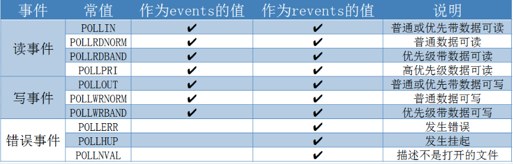

# IO 复用：select 和 poll 函数

## 1、什么是 IO 复用？

内核一旦发现进程所指定的一个或多个 IO 条件就绪（输入已经准备好，或者描述符可以承接更多的输出），内核就通知进程，这个能力被称为 IO 复用。

## UNIX 下的 IO 模型有哪些？

- 阻塞式 IO

- 非阻塞式 IO

- IO 复用

- 信号驱动式 IO

- 异步 IO

## 3、信号驱动 IO 与 异步 IO 的区别是什么？

- 信号驱动式 IO 是由内核告诉我们，何时进行 IO 操作
- 异步 IO 是由内核告诉我们， IO 操作何时完成

## 6、select 函数的缺陷有哪些？

- 最大并发数限制：`select` 对打开的文件描述符是有限制的,由FD_SETSIZE(1024)设置, 如果要改变FD_SIZE的大小需要重新编译内核
- 效率低：调用 `select` 时，需要将 `readfds`, `writefds`, `exceptfds` 从用户层拷贝到内核。`select` 返回后，需要线性遍历套接字集合（`readfds, writefds, exceptfds`）。
- select()调用的内部，需要用轮询的方式去完整遍历每一个 fd，如果遍历完所有 fd 后没有发现就绪 fd，则挂起当前进程，直到有 fd 就绪或者主动超时（使用 schedule_timeout 实现睡一会儿，判断一次(被定时器唤醒，注意与 select() 函数里面的 timeout 参数区分作用)的效果），被唤醒后它又要再次遍历 fd （直到有 fd 就绪或 select() 函数超时）。这个过程经历了多次无谓的遍历。CPU的消耗会随着监视 fd 的数量的增长而线性增加。
- 函数返回后，程序必须检查返回的数据结构中的每个元素
- 由于 select 参数输入和输出使用同样的 fd_set ，导致每次 select()  之前都要重新初始化要监视的 fd_set，开销也会比较大。
- 如果其中某个描述符被关闭了，`select` 并不会告诉我们是哪个描述符，我们需要在描述符上进行 IO 操作并检查错误来判断

## 11、select 和 poll 的缺点

- 每次调用 `select` 和 `poll`，内核都要检查所有的文件描述符
- 需要将 `readfds`, `writefds`, `exceptfds` 从用户层拷贝到内核。`select` 返回后，需要线性遍历套接字集合（`readfds, writefds, exceptfds`）。
- 函数返回后，程序必须检查返回的数据结构中的每个元素

## 14、epoll 的优点？

- 支持一个进程打开大数目的socket描述符
-  IO效率不随FD数目增加而线性下降. 传统select/poll的另一个致命弱点就是当你拥有一个很大的socket集合，由于网络得延时，使得任一时间只有部分的socket是"活跃" 的，而select/poll每次调用都会线性扫描全部的集合，导致效率呈现线性下降。但是epoll不存在这个问题，它只会对"活跃"的socket进 行操作---这是因为在内核实现中epoll是根据每个fd上面的callback函数实现的。于是，只有"活跃"的socket才会主动去调用 callback函数，其他idle状态的socket则不会，在这点上，epoll实现了一个"伪"AIO，因为这时候推动力在os内核。在一些 benchmark中，如果所有的socket基本上都是活跃的---比如一个高速LAN环境，epoll也不比select/poll低多少效率，但若 过多使用的调用epoll_ctl，效率稍微有些下降。然而一旦使用idle connections模拟WAN环境，那么epoll的效率就远在select/poll之上了。
- epoll 的解决方案在 epoll_ctl() 函数中。每次注册新的事件到 epoll 描述符中时，会把该 fd 拷贝进内核，而不是在epoll_wait的时候重复拷贝。epoll 保证了每个fd在整个过程中只会拷贝一次。
- select() 和 poll() 函数返回后， 处理就绪 fd 的方法还是轮询，而 epoll() 只需要从就绪链表中处理就绪的 fd

## 8、`pselect` 函数与 `select` 函数有什么区别？

- 超时值使用的结构不一样，`pselect` 使用的是 `timespec` 结构

- `pselect` 可使用可选信号屏蔽字，在调用 `pselect` 时，以原子操作的方式安装该信号屏蔽字。在返回时，恢复以前的信号屏蔽字。

## 4、select 函数返回后如何获取已就绪的描述符？

```
int select(int maxfdp1, fd_set *readset, fd_set *writeset, fd_set *exceptset, const struct timeval *timeout)

```

- `select` 函数会返回所有描述符集的已就绪的总数。如果定时器到时，则返回 0.出错返回 -1
- `select` 函数返回后，我们可以使用 `FD_ISSET` 来测试 `fd_set` 描述符。描述符集内任何与未就绪描述符对应的位返回时均清成 0。因此，每次重新调用 `select` 函数，我们都得重新把所有描述符集内所关心的位均置为 1

## 5、select 描述符就绪的条件是什么？

- 读就绪
    - 套接字接受缓存区中的数据字节大于等于套接字接受缓冲区低水位大小
    - 连接的读半部关闭（接受了 FIN 的 TCP 连接）
    - 套接字是一个监听套接字并且已完成的连接数不为 0 （accept 不会阻塞）
    - 有一个套接字错误要处理

- 写就绪
    - 套接字的发送缓冲区中可用空间字节数大于套接字发送缓冲区低水位
    - 连接的写半部已关闭。对这样的套接字写操作会造成 `SIGPIPE` 信号
    - 使用非阻塞 connect 的套接字已建立连接，或者 connect 已经失败
    - 套接字错误 

## select 的超时设置

- 设置为空指针，那么 select 就是永远等下去
- 设置为 0，就是不等待，立刻返回
- 设置固定时间

## 9、`poll` 函数的 `events/revents` 参数选项有哪些？



## 10、`poll` 函数描述符就绪之后，`revents` 会返回什么状态？

```
int poll(struct pollfd fdarray[],nfds_t nfds,int timeout);

```

- 非阻塞式 `connect` 的完成被认为是套接字可写
- 监听套接字上有新的连接可用 accept 既可认为是普通数据，也可认为是优先级数据
- 正规 TCP 数据和 UDP 数据都被认为是普通数据
- TCP 读半部关闭时，被认为是普通数据
- TCP 连接错误既可认为是普通数据，也可认为是错误
- TCP 带外数据被认为是优先级带数据

## poll 的超时设置

- 设置为 -1，那么 poll 就是永远等下去
- 设置为 0，就是不等待，立刻返回
- 设置固定时间的毫秒数

## 12、如何为套接字的 IO 操作设置超时？

- 调用 alarm
- 在 select 中阻塞等待 IO
- 使用 `SO_RCVTIMEO` 和 `SO_SNDTIMEO` 套接字选项

以上三种办法均可适用于输入与输出操作，`select` 函数适用于非阻塞的 `connect` 操作，对于阻塞式，只要第一种方法适用，而且

- alarm 设置超时只能指定一个小于 75s 的数值
- 注意信号处理的自动重启功能


## 13、什么是水平触发和边缘触发？在 IO 处理中有什么不同？

```
int epoll_create(int size)
int epoll_ctl(int epfd, int op, int fd, struct epoll_event *ev)
int epoll_wait(int epfd, struct epoll_event *evlist, int maxevents, int timeout)

```

- 水平触发：如果文件描述符上可以无阻塞地进行 IO 系统调用，此时认为它已经就绪
- 边缘触发：如果文件描述符自上次状态检查以来发生了新的 IO 活动，此时需要触发通知

对于水平触发：

- 我们可以在任何时刻来检查文件描述符的就绪状态，这表明当我们确定文件描述符处于就绪态时，就可以执行一些 IO 操作，然后重复检查，看看是否仍然处于就绪态，没有必要尽可能多的执行 IO

对于边缘触发：

- 在接收到一个 IO 就绪的事件通知后，程序在某个时刻应该在相应的文件描述符上尽可能多地执行 IO（比如尽可能多读取字节）
- 每个被检查的文件描述符都应该设置为非阻塞模式

`epoll` 的帮助中指出，使用 `ET` 模式，可以便捷的处理 `EPOLLOUT` 事件，省去打开与关闭 `EPOLLOUT` 的`epoll_ctl`（`EPOLL_CTL_MOD`）调用。从而有可能让你的性能得到一定的提升。  例如你需要写出1M的数据，写出到`socket` 256k时，返回了`EAGAIN`，`ET` 模式下，当再次返回 `EPOLLOUT` 时，继续写出待写出的数据，当没有数据需要写出时，不处理直接略过即可。而 `LT` 模式则需要先打开 `EPOLLOUT`，当没有数据需要写出时，再关闭 `EPOLLOUT`（否则会一直会返回 `EPOLLOUT` 事件）  总体来说，`ET` 处理 `EPOLLOUT` 方便高效些，`LT` 不容易遗漏事件、不易产生 `bug`

## 15、`epoll_ctl` 函数中 `op` 参数的选项有哪些？

- `EPOLL_CTL_ADD` 将描述符 fd 添加到 epfd 中的兴趣列表中
- `EPOLL_CTL_MOD` 修改描述符 fd 上设定的事件
- `EPOLL_CTL_DEL` 将 fd 从 epfd 的兴趣列表中删除

## 16、`epoll_event` 中的 `events` 选项有哪些？

- EPOLLIN：表示对应的文件描述符可以读；
- EPOLLOUT：表示对应的文件描述符可以写；
- EPOLLPRI：表示对应的文件描述符有紧急的数据可读；
- EPOLLERR：表示对应的文件描述符发生错误；
- EPOLLHUP：表示对应的文件描述符被挂断；
- EPOLLRDHUP：表示对应的文件描述符对端关闭；

- EPOLLET: 采用边缘触发通知模式。
- EPOLLONESHOT: 在完成事件通知之后禁用检测，即我们希望在某个特定的文件描述符上只得到一次通知

注意一下，EPOLLHUP并不代表对端结束了连接，这一点需要和EPOLLRDHUP区分。通常情况下EPOLLHUP表示的是本端挂断

## 17、`epoll_event` 中的 `epoll_data_t` 选项有哪些？

```
struct union epoll_data {
    void *ptr;
    int fd;
    uint32_t u32;
    uint64_t u64;
}

```

## 18、采用边缘触发模式时如何避免文件描述符饥饿现象？

当我们尝试通过非阻塞式的读操作将所有的输入都读取的时候，其他的文件描述符将会有处于饥饿状态的风险存在。解决方案是让应用程序维护一个列表，存放着已经被通知为就绪态的文件描述符：

- 调用 `epoll_wait` 监视文件描述符，并将处于就绪态的文件描述符添加到程序维护的列表中去。如果这个文件描述符已经存在，那么这次监视操作的超时时间应该设置为较小值或者是 0。这样如果没有新的文件描述符就绪，应用程序就可以迅速进行到下一步，去处理那些已经处于就绪态的文件描述符
- 在应用程序维护的列表中，在那些列表中的文件描述符上进行一定限度的 IO 操作，例如轮转调度。当文件描述符出现 EAGAIN 或者 EWOULDBLOCK 错误时，就可以将其从列表中移除

## 为什么要使用 shutdown ？

```
int shutdown(int sockfd,int howto)//SHUT_RD、SHUT_WD、SHUT_RDWR

```

在客户端基础程序中可以看到，我们假设输入文件有 9 行。最后一行在时刻 8 发出，写完这个请求后，我们并不能立刻关闭连接，因为管道中还有其他的请求和应答。我们需要的是一种关闭 TCP 连接其中一半的方法

## 7、`str_cli` 基础程序中，为什么不能用 `Readline`、`Fgets` 等函数？

- `Fgets` 函数在客户端输入 `EOF` 后，立刻返回到 `main` 函数，随即进程终止。然而，标准输入中的 `EOF` 并不意味着我们完成了套接字的读入：可能仍有请求在去往服务器的路上，或者仍有应答在返回客户的路上。（需要 `shutdown` 函数告诉服务端已完成了数据传送）
- `Readline`、`Fgets` 等函数存在缓存，用户很可能有不完整的输入行，也可能有一个或多个完整的输入行。（需要替换为 `read` 无缓存函数）

## 拒绝服务型攻击

在服务端代码中，直接 read 很可能会发生阻塞导致服务器无法为其他客户提供服务，解决办法有：

- 使用非阻塞 IO
- 使用多线程
- 设置超时

此外，服务端的 read 函数调用与 write 函数调用都要注意判断返回值是否是 -1，检查 error 的值，出现错误需要 close 套接字。

## Reactor 模式

### 单进程单线程：redis

只有一个进程，监听套接字和连接套接字上的事件都由 Select 来处理。

过程

(1) 如果有建立连接的请求过来，Acceptor 负责接受并与之建立连接，同时将连接套接字加入 Select 进行监听。

(2) 如果某个连接上有读事件则进行 Read->业务处理->Write 等操作。

(3) 如此循环反复。

缺点：会有阻塞，在进行业务处理的时候不能进行其他操作：如建立连接，读取其他套接字上的数据等。

### 单进程多线程：tomcat

与单进程单线程类似，不同的是该模型将业务处理放在线程中，进程就不会阻塞在业务处理上。

优点：比较完美的进程-线程模型，在 Java 实现中复杂度也不高，很多网络库都是基于此，比如 Netty 。

### 多进程单线程：nginx

与非 Reactor 模式中的多进程单线程相似，只是本模式在子进程中使用了 IO 多路复用，实用性一下就上来了。大名鼎鼎的 nginx 就采用这种进程-线程模型。

缺点：子进程还是会阻塞在业务处理上。

### 主从进程多线程：netty

前面几种 Reactor 模式的进程-线程模型中，连接的建立和连接的读写都是在同一进程中。本模型中将连接的建立和连接读写放在不同的进程中。

过程

(1) 主进程在监听套接字上 Select 阻塞，一旦有请求过来则与之建立连接，并将连接套接字传递给从线程。

(2) 从线程在连接套接字上 Select 阻塞，一旦连接上有数据过来则进行 Read，并将业务通过线程来处理。如果有必要还会向连接 Write 数据。


## 惊群效应

### 惊群效应是什么？

惊群效应也有人叫做雷鸣群体效应，不过叫什么，简言之，惊群现象就是多进程（多线程）在同时阻塞等待同一个事件的时候（休眠状态），如果等待的这个事件发生，那么他就会唤醒等待的所有进程（或者线程），但是最终却只可能有一个进程（线程）获得这个时间的“控制权”，对该事件进行处理，而其他进程（线程）获取“控制权”失败，只能重新进入休眠状态，这种现象和性能浪费就叫做惊群。

为了更好的理解何为惊群，举一个很简单的例子，当你往一群鸽子中间扔一粒谷子，所有的各自都被惊动前来抢夺这粒食物，但是最终注定只可能有一个鸽子满意的抢到食物，没有抢到的鸽子只好回去继续睡觉，等待下一粒谷子的到来。这里鸽子表示进程（线程），那粒谷子就是等待处理的事件。

### 惊群效应到底消耗了什么？

我想你应该也会有跟我一样的问题，那就是惊群效应到底消耗了什么？

（1）、系统对用户进程/线程频繁地做无效的调度，上下文切换系统性能大打折扣。

（2）、为了确保只有一个线程得到资源，用户必须对资源操作进行加锁保护，进一步加大了系统开销。

是不是还是觉得不够深入，概念化？看下面：

1、上下文切换（context  switch）过高会导致cpu像个搬运工，频繁地在寄存器和运行队列之间奔波，更多的时间花在了进程（线程）切换，而不是在真正工作的进程（线程）上面。直接的消耗包括cpu寄存器要保存和加载（例如程序计数器）、系统调度器的代码需要执行。间接的消耗在于多核cache之间的共享数据。
看一下：wiki上下文切换

2、通过锁机制解决惊群效应是一种方法，在任意时刻只让一个进程（线程）处理等待的事件。但是锁机制也会造成cpu等资源的消耗和性能损耗。目前一些常见的服务器软件有的是通过锁机制解决的，比如nginx（它的锁机制是默认开启的，可以关闭）；还有些认为惊群对系统性能影响不大，没有去处理，比如lighttpd。

### accept（）惊群

首先让我们先来考虑一个场景：
	
主进程创建了socket、bind、listen之后，fork()出来多个进程，每个子进程都开始循环处理（accept）这个listen_fd。每个进程都阻塞在accept上，当一个新的连接到来时候，所有的进程都会被唤醒，但是其中只有一个进程会接受成功，其余皆失败，重新休眠。
	
那么这个问题真的存在吗？
	
历史上，Linux的accpet确实存在惊群问题，但现在的内核都解决该问题了。即，当多个进程/线程都阻塞在对同一个socket的接受调用上时，当有一个新的连接到来，内核只会唤醒一个进程，其他进程保持休眠，压根就不会被唤醒。

其实在linux2.6版本以后，linux内核已经解决了accept（）函数的“惊群”现象，大概的处理方式就是，当内核接收到一个客户连接后，只会唤醒等待队列上的第一个进程（线程）,所以如果服务器采用accept阻塞调用方式，在最新的linux系统中已经没有“惊群效应”了

### epoll惊群

概述：

如果多个进程/线程阻塞在监听同一个监听socket fd的epoll_wait上，当有一个新的连接到来时，所有的进程都会被唤醒。

同样让我们假设一个场景：

主进程创建socket，bind，listen后，将该socket加入到epoll中，然后fork出多个子进程，每个进程都阻塞在epoll_wait上，如果有事件到来，则判断该事件是否是该socket上的事件如果是，说明有新的连接到来了，则进行接受操作。为了简化处理，忽略后续的读写以及对接受返回的新的套接字的处理，直接断开连接。

那么，当新的连接到来时，是否每个阻塞在epoll_wait上的进程都会被唤醒呢？

很多博客中提到，测试表明虽然epoll_wait不会像接受那样只唤醒一个进程/线程，但也不会把所有的进程/线程都唤醒。

### 怎么解决“惊群”呢？SO_REUSEPORT

Linux内核的3.9版本带来了SO_REUSEPORT特性，该特性支持多个进程或者线程绑定到同一端口，提高服务器程序的性能，允许多个套接字bind()以及listen()同一个TCP或UDP端口，并且在内核层面实现负载均衡。

在使用SO_REUSEPORT后，多个进程可以同时监听同一个IP：端口，然后由内核决定将新链接发送给哪个进程，显然会降低每个工人接收新链接时锁竞争

## `str_cli` 函数基础程序

```

void str_cli(FILE *fp, int sockfd)
{
    int            maxfdp1;
    fd_set        rset;
    char        sendline[MAXLINE], recvline[MAXLINE];

    FD_ZERO(&rset);
    for ( ; ; ) {
        FD_SET(fileno(fp), &rset);
        FD_SET(sockfd, &rset);
        maxfdp1 = max(fileno(fp), sockfd) + 1;
        Select(maxfdp1, &rset, NULL, NULL, NULL);

        if (FD_ISSET(sockfd, &rset)) {    /* socket is readable */
            if (Readline(sockfd, recvline, MAXLINE) == 0)
                err_quit("str_cli: server terminated prematurely");
            Fputs(recvline, stdout);
        }

        if (FD_ISSET(fileno(fp), &rset)) {  /* input is readable */
            if (Fgets(sendline, MAXLINE, fp) == NULL)
                return;        /* all done */
            Writen(sockfd, sendline, strlen(sendline));
        }
    }
}

```

## `str_cli` 函数改进版

```
#include    "unp.h"

void
str_cli(FILE *fp, int sockfd)
{
    int            maxfdp1, stdineof;
    fd_set        rset;
    char        buf[MAXLINE];
    int        n;

    stdineof = 0;
    FD_ZERO(&rset);
    for ( ; ; ) {
        if (stdineof == 0)
            FD_SET(fileno(fp), &rset);
        FD_SET(sockfd, &rset);
        maxfdp1 = max(fileno(fp), sockfd) + 1;
        Select(maxfdp1, &rset, NULL, NULL, NULL);

        if (FD_ISSET(sockfd, &rset)) {    /* socket is readable */
            if ( (n = Read(sockfd, buf, MAXLINE)) == 0) {
                if (stdineof == 1)
                    return;        /* normal termination */
                else
                    err_quit("str_cli: server terminated prematurely");
            }

            Write(fileno(stdout), buf, n);
        }

        if (FD_ISSET(fileno(fp), &rset)) {  /* input is readable */
            if ( (n = Read(fileno(fp), buf, MAXLINE)) == 0) {
                stdineof = 1;
                Shutdown(sockfd, SHUT_WR);    /* send FIN */
                FD_CLR(fileno(fp), &rset);
                continue;
            }

            Writen(sockfd, buf, n);
        }
    }
}

```

## 回射服务端程序

```
int main(int argc, char **argv)
{
    int                    i, maxi, maxfd, listenfd, connfd, sockfd;
    int                    nready, client[FD_SETSIZE];
    ssize_t                n;
    fd_set                rset, allset;
    char                buf[MAXLINE];
    socklen_t            clilen;
    struct sockaddr_in    cliaddr, servaddr;

    listenfd = Socket(AF_INET, SOCK_STREAM, 0);

    bzero(&servaddr, sizeof(servaddr));
    servaddr.sin_family      = AF_INET;
    servaddr.sin_addr.s_addr = htonl(INADDR_ANY);
    servaddr.sin_port        = htons(SERV_PORT);

    Bind(listenfd, (SA *) &servaddr, sizeof(servaddr));

    Listen(listenfd, LISTENQ);

    maxfd = listenfd;            /* initialize */
    maxi = -1;                    /* index into client[] array */
    for (i = 0; i < FD_SETSIZE; i++)
        client[i] = -1;            /* -1 indicates available entry */
    FD_ZERO(&allset);
    FD_SET(listenfd, &allset);
/* end fig01 */

/* include fig02 */
    for ( ; ; ) {
        rset = allset;        /* structure assignment */
        nready = Select(maxfd+1, &rset, NULL, NULL, NULL);

        if (FD_ISSET(listenfd, &rset)) {    /* new client connection */
            clilen = sizeof(cliaddr);
            connfd = Accept(listenfd, (SA *) &cliaddr, &clilen);
#ifdef    NOTDEF
            printf("new client: %s, port %d\n",
                    Inet_ntop(AF_INET, &cliaddr.sin_addr, 4, NULL),
                    ntohs(cliaddr.sin_port));
#endif

            for (i = 0; i < FD_SETSIZE; i++)
                if (client[i] < 0) {
                    client[i] = connfd;    /* save descriptor */
                    break;
                }
            if (i == FD_SETSIZE)
                err_quit("too many clients");

            FD_SET(connfd, &allset);    /* add new descriptor to set */
            if (connfd > maxfd)
                maxfd = connfd;            /* for select */
            if (i > maxi)
                maxi = i;                /* max index in client[] array */

            if (--nready <= 0)
                continue;                /* no more readable descriptors */
        }

        for (i = 0; i <= maxi; i++) {    /* check all clients for data */
            if ( (sockfd = client[i]) < 0)
                continue;
            if (FD_ISSET(sockfd, &rset)) {
                if ( (n = Read(sockfd, buf, MAXLINE)) == 0) {
                        /*4connection closed by client */
                    Close(sockfd);
                    FD_CLR(sockfd, &allset);
                    client[i] = -1;
                } else
                    Writen(sockfd, buf, n);

                if (--nready <= 0)
                    break;                /* no more readable descriptors */
            }
        }
    }
}
/* end fig02 */

```

## `poll` 改进版服务端程序

```
int main(int argc, char **argv)
{
    int                    i, maxi, listenfd, connfd, sockfd;
    int                    nready;
    ssize_t                n;
    char                buf[MAXLINE];
    socklen_t            clilen;
    struct pollfd        client[OPEN_MAX];
    struct sockaddr_in    cliaddr, servaddr;

    listenfd = Socket(AF_INET, SOCK_STREAM, 0);

    bzero(&servaddr, sizeof(servaddr));
    servaddr.sin_family      = AF_INET;
    servaddr.sin_addr.s_addr = htonl(INADDR_ANY);
    servaddr.sin_port        = htons(SERV_PORT);

    Bind(listenfd, (SA *) &servaddr, sizeof(servaddr));

    Listen(listenfd, LISTENQ);

    client[0].fd = listenfd;
    client[0].events = POLLRDNORM;
    for (i = 1; i < OPEN_MAX; i++)
        client[i].fd = -1;        /* -1 indicates available entry */
    maxi = 0;                    /* max index into client[] array */
/* end fig01 */

/* include fig02 */
    for ( ; ; ) {
        nready = Poll(client, maxi+1, INFTIM);

        if (client[0].revents & POLLRDNORM) {    /* new client connection */
            clilen = sizeof(cliaddr);
            connfd = Accept(listenfd, (SA *) &cliaddr, &clilen);
#ifdef    NOTDEF
            printf("new client: %s\n", Sock_ntop((SA *) &cliaddr, clilen));
#endif

            for (i = 1; i < OPEN_MAX; i++)
                if (client[i].fd < 0) {
                    client[i].fd = connfd;    /* save descriptor */
                    break;
                }
            if (i == OPEN_MAX)
                err_quit("too many clients");

            client[i].events = POLLRDNORM;
            if (i > maxi)
                maxi = i;                /* max index in client[] array */

            if (--nready <= 0)
                continue;                /* no more readable descriptors */
        }

        for (i = 1; i <= maxi; i++) {    /* check all clients for data */
            if ( (sockfd = client[i].fd) < 0)
                continue;
            if (client[i].revents & (POLLRDNORM | POLLERR)) {
                if ( (n = read(sockfd, buf, MAXLINE)) < 0) {
                    if (errno == ECONNRESET) {
                            /*4connection reset by client */
#ifdef    NOTDEF
                        printf("client[%d] aborted connection\n", i);
#endif
                        Close(sockfd);
                        client[i].fd = -1;
                    } else
                        err_sys("read error");
                } else if (n == 0) {
                        /*4connection closed by client */
#ifdef    NOTDEF
                    printf("client[%d] closed connection\n", i);
#endif
                    Close(sockfd);
                    client[i].fd = -1;
                } else
                    Writen(sockfd, buf, n);

                if (--nready <= 0)
                    break;                /* no more readable descriptors */
            }
        }
    }
}
/* end fig02 */

```

## epoll 样例程序

```

int main (int argc, char *argv[]) {
    int sfd, s;
    int efd;
    struct epoll_event event;
    struct epoll_event *events;
    int port = read_param(argc, argv);
    /* 创建并绑定socket */
    sfd = create_and_bind (port);
    if (sfd == -1) {
        perror("create_and_bind");
        abort ();
    }
    /* 设置sfd为非阻塞 */
    s = make_socket_non_blocking (sfd);
    if (s == -1) {
        perror("make_socket_non_blocking");
        abort ();
    }
    /* SOMAXCONN 为系统默认的backlog */
    s = listen (sfd, SOMAXCONN);
    if (s == -1) {
        perror ("listen");
        abort ();
    }
    efd = epoll_create1 (0);
    if (efd == -1) {
        perror ("epoll_create");
        abort ();
    }
    event.data.fd = sfd;
    /* 设置ET模式 */
    event.events = EPOLLIN | EPOLLET;
    s = epoll_ctl (efd, EPOLL_CTL_ADD, sfd, &event);
    if (s == -1) {
        perror ("epoll_ctl");
        abort ();
    }
    /* 创建事件数组并清零 */
    events = calloc (MAXEVENTS, sizeof event);
    /* 开始事件循环 */
    while (1) {
        int n, i;
        n = epoll_wait (efd, events, MAXEVENTS, -1);
        for (i = 0; i < n; i++) {
            if (events[i].events & (EPOLLERR | EPOLLHUP)) {
                /* 监控到错误或者挂起 */
                fprintf (stderr, "epoll error\n");
                close (events[i].data.fd);
                continue;
            } 
            if(events[i].events & EPOLLIN) {
                if (sfd == events[i].data.fd) {
                    /* 处理新接入的socket */
                    while (1) {
                        struct sockaddr_in sa;
                        socklen_t len = sizeof(sa);
                        char hbuf[INET_ADDRSTRLEN];
                        int infd = accept (sfd, (struct sockaddr*)&sa, &len);
                        if (infd == -1) {
                            if ((errno == EAGAIN) || (errno == EWOULDBLOCK)) {
                                /* 资源暂时不可读，再来一遍 */
                                break;
                            } else {
                                perror ("accept");
                                break;
                            }
                        }
                        inet_ntop(AF_INET, &sa.sin_addr, hbuf, sizeof(hbuf));
                        printf("Accepted connection on descriptor %d "
                                    "(host=%s, port=%d)\n", infd, hbuf, sa.sin_port);
                        /* 设置接入的socket为非阻塞 */
                        s = make_socket_non_blocking (infd);
                        if (s == -1) abort ();
                        /* 为新接入的socket注册事件 */
                        event.data.fd = infd;
                        event.events = EPOLLIN | EPOLLET;
                        s = epoll_ctl (efd, EPOLL_CTL_ADD, infd, &event);
                        if (s == -1) {
                            perror ("epoll_ctl");
                            abort ();
                        }
                    }
                    //continue;
                } else {
                    /* 接入的socket有数据可读 */
                    while (1) {
                        ssize_t count;
                        char buf[512];
                        count = read (events[i].data.fd, buf, sizeof buf);
                        if (count == -1) {
                            if (errno != EAGAIN) {
                                perror ("read");
                                close(events[i].data.fd);
                            }
                            break;
                        } else if (count == 0) {
                            /* 数据读取完毕，结束 */
                            close(events[i].data.fd);
                            printf ("Closed connection on descriptor %d\n", events[i].data.fd);
                            break;
                        }
                        /* 输出到stdout */
                        s = write (1, buf, count);
                        if (s == -1) {
                            perror ("write");
                            abort ();
                        }
                        event.events = EPOLLOUT | EPOLLET;
                        epoll_ctl(efd, EPOLL_CTL_MOD, events[i].data.fd, &event);
                    }
                }
            } else if((events[i].events & EPOLLOUT) && (events[i].data.fd != sfd)) {
                /* 接入的socket有数据可写 */
                write(events[i].data.fd, "it's echo man\n", 14);
                event.events = EPOLLET | EPOLLIN;
                epoll_ctl(efd, EPOLL_CTL_MOD, events[i].data.fd, &event);
            }
        }
    }
    free (events);
    close (sfd);
    return EXIT_SUCCESS;
}

```

## API

```
int select(int maxfdp1, fd_set *readset, fd_set *writeset, fd_set *exceptset, const struct timeval *timeout)

void FD_ZERO(fd_set *fdset)
void FD_SET(fd_set *fdset)
void FD_CLR(fd_set *fdset)
void FD_ISSET(fd_set *fdset)

int shutdown(int sockfd,int howto)//SHUT_RD、SHUT_WD

int pselect(int maxfdp1,fd_set *restrict readfds,fd_set *restrict writefds,fd_set *restrict exceptfds,const struct timespec *restrict tsptr,const sigset_t *restrict sigmask);

int poll(struct pollfd fdarray[],nfds_t nfds,int timeout);
struct pollfd {
        int   fd;         /* file descriptor */
        short events;     /* requested events */
        short revents;    /* returned events */
};

int epoll_create(int size)
int epoll_ctl(int epfd, int op, int fd, struct epoll_event *ev)
int epoll_wait(int epfd, struct epoll_event *evlist, int maxevents, int timeout)
struct epoll_event {
    __uint32_t   events; /* Epoll events */
    epoll_data_t data;   /* User data variable */
};
struct union epoll_data {
    void *ptr;
    int fd;
    uint32_t u32;
    uint64_t u64;
}
``` 