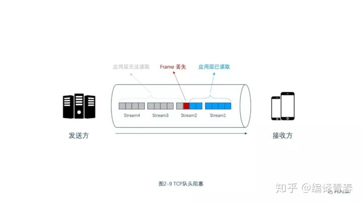
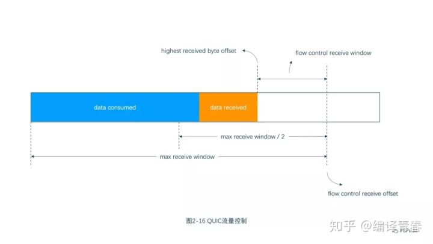
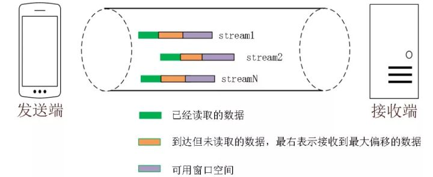
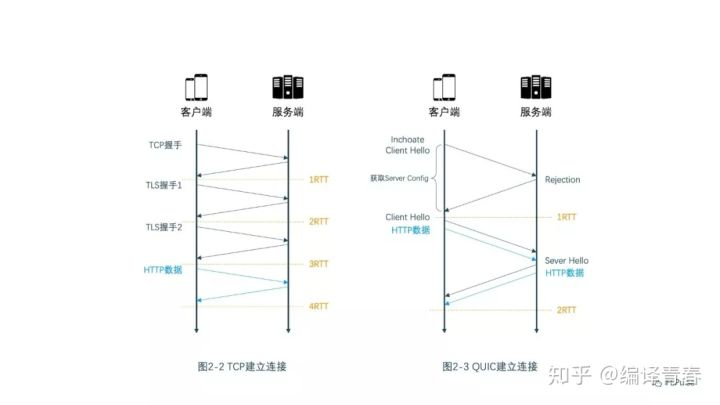
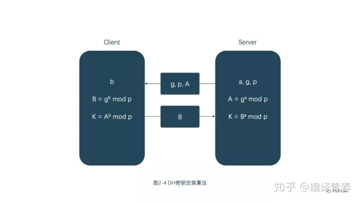

# http 协议

## http2 协议

### HTTP/1 的缺陷

- 连接无法复用：连接无法复用会导致每次请求都经历三次握手和慢启动。三次握手在高延迟的场景下影响较明显，慢启动则对大量小文件请求影响较大（没有达到最大窗口请求就被终止）。
	- HTTP/1.0 传输数据时，每次都需要重新建立连接，增加延迟。
	- HTTP/1.1 虽然加入 keep-alive 可以复用一部分连接，但域名分片等情况下仍然需要建立多个 connection，耗费资源，给服务器带来性能压力。

- Head-Of-Line Blocking（HOLB，队头阻塞）：这会导致带宽无法被充分利用，以及后续健康请求被阻塞。HOLB 是指一系列包（package）因为第一个包被阻塞；当页面中需要请求很多资源的时候，HOLB 会导致在达到最大请求数量时，剩余的资源需要等待其它资源请求完成后才能发起请求。
	- HTTP 1.0：下个请求必须在前一个请求返回后才能发出，request-response对按序发生。显然，如果某个请求长时间没有返回，那么接下来的请求就全部阻塞了。
	- HTTP 1.1：尝试使用 pipeling 来解决，即浏览器可以一次性发出多个请求（同个域名、同一条 TCP 链接）。但 pipeling 要求返回是按序的，那么前一个请求如果很耗时（比如处理大图片），那么后面的请求即使服务器已经处理完，仍会等待前面的请求处理完才开始按序返回。所以，pipeling 只部分解决了 HOLB。

### 多路复用

HTTP/2 通过让所有数据流共用同一个连接，可以更有效地使用 TCP 连接，让高带宽也能真正的服务于 HTTP 的性能提升。

在 HTTP/2 中，有了二进制分帧之后，HTTP /2 不再依赖 TCP 链接去实现多流并行了，在 HTTP/2中：

- 同域名下所有通信都在单个连接上完成。
- 单个连接可以承载任意数量的双向数据流。
- 数据流以消息的形式发送，而消息又由一个或多个帧组成，多个帧之间可以乱序发送，因为根据帧首部的流标识可以重新组装。

这一特性，使性能有了极大提升：

- 同个域名只需要占用一个 TCP 连接，消除了因多个 TCP 连接而带来的延时和内存消耗。
- 单个连接上可以并行交错的请求和响应，之间互不干扰。
- 在HTTP/2中，每个请求都可以带一个31bit的优先值，0表示最高优先级， 数值越大优先级越低。有了这个优先值，客户端和服务器就可以在处理不同的流时采取不同的策略，以最优的方式发送流、消息和帧。

### 二进制传输

HTTP/2 采用二进制格式传输数据，而非 HTTP/1 的文本格式，二进制协议解析起来更高效。

HTTP/1 的请求和响应报文，都是由起始行、首部和实体正文（可选）组成，各部分之间以文本换行符分隔。HTTP/2 将请求和响应数据分割为更小的帧，并且它们采用二进制编码。

接下来我们介绍几个重要的概念：

- 流（stream）：流是连接中的一个虚拟信道，可以承载双向的消息；每个流都有一个唯一的整数标识符（1、2…N）
- 消息（message）：指逻辑上的 HTTP 消息，比如请求、响应等，由一或多个帧组成
- 帧（frame）：HTTP/2 通信的最小单位，每个帧包含帧首部，至少也会标识出当前帧所属的流，承载着特定类型的数据，如 HTTP 首部、负荷等

HTTP/2 中，同域名下所有通信都在单个连接上完成，该连接可以承载任意数量的双向数据流。每个数据流都以消息的形式发送，而消息又由一个或多个帧组成。多个帧之间可以乱序发送，根据帧首部的流标识可以重新组装

### Header 压缩

在 HTTP/1 中，我们使用文本的形式传输 header，在 header 携带 cookie 的情况下，可能每次都需要重复传输几百到几千字节。

为了减少这块的资源消耗并提升性能， HTTP/2 对这些首部采取了压缩策略：

- HTTP/2 在客户端和服务器端使用“首部表”来跟踪和存储之前发送的键－值对，对于相同的数据，不再通过每次请求和响应发送
- 首部表在 HTTP/2 的连接存续期内始终存在，由客户端和服务器共同渐进地更新
- 每个新的首部键-值对要么被追加到当前表的末尾，要么替换表中之前的值

### Server Push

Server Push 即服务端能通过 push 的方式将客户端需要的内容预先推送过去，也叫“cache push”。

可以想象以下情况：某些资源客户端是一定会请求的，这时就可以采取服务端 push 的技术，提前给客户端推送必要的资源，这样就可以相对减少一点延迟时间。当然在浏览器兼容的情况下你也可以使用 prefetch。

例如服务端可以主动把 JS 和 CSS 文件推送给客户端，而不需要客户端解析 HTML 时再发送这些请求。

## Http3

### TCP 队头阻塞

HTTP/2 的每个请求都会被拆分成多个 Frame，不同请求的 Frame 组合成 Stream，Stream 是 TCP 上的逻辑传输单元，这样 HTTP/2 就达到了一条连接同时发送多条请求的目标，这就是多路复用的原理。如图2-9 所示，我们看一个例子，在一条 TCP 连接上同时发送 4 个 Stream，其中 Stream1 已正确送达，Stream2 中的第 3 个 Frame 丢失，TCP 处理数据时有严格的前后顺序，先发送的 Frame 要先被处理，这样就会要求发送方重新发送第 3 个 Frame，Stream3 和 Stream4 虽然已到达但却不能被处理，那么这时整条连接都被阻塞。

不仅如此，由于 HTTP/2 必须使用 HTTPS，而 HTTPS 使用的 TLS 协议也存在队头阻塞问题。TLS 基于 Record 组织数据，将一堆数据放在一起（即一个 Record）加密，加密完后又拆分成多个 TCP 包传输。一般每个 Record 16K，包含 12 个 TCP 包，这样如果 12 个 TCP 包中有任何一个包丢失，那么整个 Record 都无法解密。

那 QUIC 是如何解决队头阻塞问题的呢？主要有两点。

- QUIC 的传输单元是 Packet，加密单元也是 Packet，整个加密、传输、解密都基于 Packet，这样就能避免 TLS 的队头阻塞问题；
- QUIC 基于 UDP，UDP 的数据包在接收端没有处理顺序，即使中间丢失一个包，也不会阻塞整条连接，其他的资源会被正常处理。

### 流量控制

TCP 会对每个 TCP 连接进行流量控制，流量控制的意思是让发送方不要发送太快，要让接收方来得及接收，不然会导致数据溢出而丢失，TCP 的流量控制主要通过滑动窗口来实现的。可以看出，拥塞控制主要是控制发送方的发送策略，但没有考虑到接收方的接收能力，流量控制是对这部分能力的补齐。

QUIC 只需要建立一条连接，在这条连接上同时传输多条 Stream，好比有一条道路，两头分别有一个仓库，道路中有很多车辆运送物资。QUIC 的流量控制有两个级别：连接级别（Connection Level）和 Stream 级别（Stream Level），好比既要控制这条路的总流量，不要一下子很多车辆涌进来，货物来不及处理，也不能一个车辆一下子运送很多货物，这样货物也来不及处理。

那 QUIC 是怎么实现流量控制的呢？我们先看单条 Stream 的流量控制。Stream 还没传输数据时，接收窗口（flow control receive window）就是最大接收窗口（flow control receive window），随着接收方接收到数据后，接收窗口不断缩小。在接收到的数据中，有的数据已被处理，而有的数据还没来得及被处理。如图2-16 所示，蓝色块表示已处理数据，黄色块表示未处理数据，这部分数据的到来，使得 Stream 的接收窗口缩小。

随着数据不断被处理，接收方就有能力处理更多数据。当满足 (flow control receive offset - consumed bytes) < (max receive window / 2) 时，接收方会发送 WINDOW_UPDATE frame 告诉发送方你可以再多发送些数据过来。这时 flow control receive offset 就会偏移，接收窗口增大，发送方可以发送更多数据到接收方.

Stream 级别对防止接收端接收过多数据作用有限，更需要借助 Connection 级别的流量控制。理解了 Stream 流量那么也很好理解 Connection 流控。Stream 中，接收窗口(flow control receive window) = 最大接收窗口(max receive window) - 已接收数据(highest received byte offset)，而对 Connection 来说：接收窗口 = Stream1接收窗口 + Stream2接收窗口 + ... + StreamN接收窗口。

### 零 RTT 建立连接

HTTP/2 的连接需要 3 RTT，如果考虑会话复用，即把第一次握手算出来的对称密钥缓存起来，那么也需要 2 RTT，更进一步的，如果 TLS 升级到 1.3，那么 HTTP/2 连接需要 2 RTT，考虑会话复用则需要 1 RTT。有人会说 HTTP/2 不一定需要 HTTPS，握手过程还可以简化。这没毛病，HTTP/2 的标准的确不需要基于 HTTPS，但实际上所有浏览器的实现都要求 HTTP/2 必须基于 HTTPS，所以 HTTP/2 的加密连接必不可少。而 HTTP/3 首次连接只需要 1 RTT，后面的连接更是只需 0 RTT，意味着客户端发给服务端的第一个包就带有请求数据。

Step1：首次连接时，客户端发送 Inchoate Client Hello 给服务端，用于请求连接；

Step2：服务端生成 g、p、a，根据 g、p 和 a 算出 A，然后将 g、p、A 放到 Server Config 中再发送 Rejection 消息给客户端；

Step3：客户端接收到 g、p、A 后，自己再生成 b，根据 g、p、b 算出 B，根据 A、p、b 算出初始密钥 K。B 和 K 算好后，客户端会用 K 加密 HTTP 数据，连同 B 一起发送给服务端；

Step4：服务端接收到 B 后，根据 a、p、B 生成与客户端同样的密钥，再用这密钥解密收到的 HTTP 数据。为了进一步的安全（前向安全性），服务端会更新自己的随机数 a 和公钥，再生成新的密钥 S，然后把公钥通过 Server Hello 发送给客户端。连同 Server Hello 消息，还有 HTTP 返回数据；

Step5：客户端收到 Server Hello 后，生成与服务端一致的新密钥 S，后面的传输都使用 S 加密。

DH 算法的核心就是服务端生成 a、g、p 3 个随机数，a 自己持有，g 和 p 要传输给客户端，而客户端会生成 b 这 1 个随机数，通过 DH 算法客户端和服务端可以算出同样的密钥。在这过程中 a 和 b 并不参与网络传输，安全性大大提高。因为 p 和 g 是大数，所以即使在网络中传输的 p、g、A、B 都被劫持，那么靠现在的计算机算力也没法破解密钥。

### 连接迁移

TCP 连接基于四元组（源 IP、源端口、目的 IP、目的端口），切换网络时至少会有一个因素发生变化，导致连接发生变化。当连接发生变化时，如果还使用原来的 TCP 连接，则会导致连接失败，就得等原来的连接超时后重新建立连接，所以我们有时候发现切换到一个新网络时，即使新网络状况良好，但内容还是需要加载很久。如果实现得好，当检测到网络变化时立刻建立新的 TCP 连接，即使这样，建立新的连接还是需要几百毫秒的时间。

QUIC 的连接不受四元组的影响，当这四个元素发生变化时，原连接依然维持。那这是怎么做到的呢？道理很简单，QUIC 连接不以四元组作为标识，而是使用一个 64 位的随机数，这个随机数被称为 Connection ID，即使 IP 或者端口发生变化，只要 Connection ID 没有变化，那么连接依然可以维持。

### 单调递增的 Packet Number

TCP 为了保证可靠性，使用了基于字节序号的 Sequence Number 及 Ack 来确认消息的有序到达。

QUIC 同样是一个可靠的协议，它使用 Packet Number 代替了 TCP 的 sequence number，并且每个 Packet Number 都严格递增，也就是说就算 Packet N 丢失了，重传的 Packet N 的 Packet Number 已经不是 N，而是一个比 N 大的值。而 TCP 呢，重传 segment 的 sequence number 和原始的 segment 的 Sequence Number 保持不变，也正是由于这个特性，引入了 Tcp 重传的歧义问题。

超时事件 RTO 发生后，客户端发起重传，然后接收到了 Ack 数据。由于序列号一样，这个 Ack 数据到底是原始请求的响应还是重传请求的响应呢？不好判断。

如果算成原始请求的响应，但实际上是重传请求的响应（上图左），会导致采样 RTT 变大。如果算成重传请求的响应，但实际上是原始请求的响应，又很容易导致采样 RTT 过小。

由于 Quic 重传的 Packet 和原始 Packet 的 Pakcet Number 是严格递增的，所以很容易就解决了这个问题。

但是单纯依靠严格递增的 Packet Number 肯定是无法保证数据的顺序性和可靠性。QUIC 又引入了一个 Stream Offset 的概念。

即一个 Stream 可以经过多个 Packet 传输，Packet Number 严格递增，没有依赖。但是 Packet 里的 Payload 如果是 Stream 的话，就需要依靠 Stream 的 Offset 来保证应用数据的顺序。如错误! 未找到引用源。所示，发送端先后发送了 Pakcet N 和 Pakcet N+1，Stream 的 Offset 分别是 x 和 x+y。

假设 Packet N 丢失了，发起重传，重传的 Packet Number 是 N+2，但是它的 Stream 的 Offset 依然是 x，这样就算 Packet N + 2 是后到的，依然可以将 Stream x 和 Stream x+y 按照顺序组织起来，交给应用程序处理。

### 加密认证的报文

TCP 协议头部没有经过任何加密和认证，所以在传输过程中很容易被中间网络设备篡改，注入和窃听。比如修改序列号、滑动窗口。这些行为有可能是出于性能优化，也有可能是主动攻击。

但是 QUIC 的 packet 可以说是武装到了牙齿。除了个别报文比如 PUBLIC_RESET 和 CHLO，所有报文头部都是经过认证的，报文 Body 都是经过加密的。

这样只要对 QUIC 报文任何修改，接收端都能够及时发现，有效地降低了安全风险。

