# 网络原理(下)

## 网络层

### 网络层功能

- 转发

- 路由选择：当分组从发送方流向接收方时，网络层必须决定这些分组所采用的路由或路径。计算这些路径的算法被称为选路算法，一个选路算法将决定分组从源主机到目的主机所遵循的路径。

    每台路由器具有一张转发表，就像立交桥上的指示牌。路由器通过检查到达分组首部中的一个目的地地址字段，然后使用该值在转发表中查询来转发一个分组。根据查询结果 将分组将被转发的路由器的链路接口。

- 连接建立：在计算机网络发展过程中，曾经有些网络层体系结构(如 ATM、帧中继)，要求从源到目的地沿着所选择的路径彼此协作，以便在网络层数据分组能够开始流动之前，给定的源到目的地连接之间建立起连接状态。在网络层，这个过程被称为连接建立。但是因特网不需要这样的连接建立过程。

### IP 报文

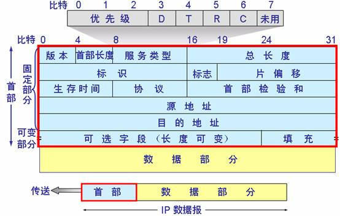

- 版本：IP报文的版本号，为一个四位字段，常用的版本为 IPV4 和 IPV6
- 报头长度：IP报头的长度
- 服务类型：指定特殊的报文处理方式
- 标识符：IP报文分片时作为相同报文的标识符，为１６位二进制数，同标记字段和分片偏移字段一起使用；
- 标记字段：作为IP报文的分片标志，由三位二进制数表示，其中，第一位没有使用；第二位为不分片位（DF），当其为1时，表示IP报文不能进行分片，如果报文因为不能分片而不能完成转发，那们路由器会丢弃该报文，并向源点发送错误信息，我们可以通过这种方法来去计算网络中的MTU（Maximum Transmission Unit　网络中最大传输单元）；第三位位后继分片（MF），当路由器对IP报文进行分片时，最后一个分片将该位设置为0，表示没有后继分片，其余个分片均设置为1；
- 分片偏移：表示分片起始点相对于报头起始点的偏移量
- 生存时间（TTL）
- 协议：指定报文中信息的类型，长度为8位，给出了主机到主机层或传输层协议的”地址“或协议号；字段值指明了 IP 数据报的数据部分应交给哪个传输层协议。例如，值为 6 表明数据部分要交给 TCP，而值为 17 表明数据要交给 UDP。 注意，数据报中的协议号所起的作用类似于传输层报文段中端口号字段所起的作用。
- 报头校验和
- 源地址和目的地址

### IPV6 报文

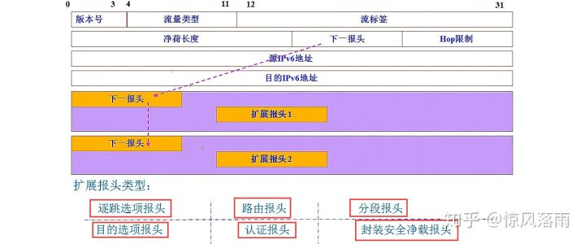

- 版本号：6
- 流量类型：对应于IPv4中的TOS
- 流量标签：用于指示流，与“QOS”联用，在IPv4中常用五元组确定一个报文流，现在IP+flow直接可以确定流
- 净荷长度：IPv6数据包上层负载长度
- 下一个包头
- hop limit： 等于IPv4中的TTL

相比较IPv4的报文格式，IPv6的报文格式比较简单，根本原因是IPv6报文格式中引入了IPv6扩展报文头的概念。

IPv6扩展报文头的引入简化了IPv6基本报文头的格式，一个IPv6报文中可以包含0个及以上扩展报文头。当需要有多个IPv6扩展报文头的时候，IPv6的基本报文头的Next Header字段将会指明下一个扩展报文头的类型，IPv6扩展报文头的Next Header字段将会指明下一个扩展报文头的类型，以此类推，如果后续没有IPv6扩展报文头，那么此字段将指明上层协议类型。IPv6的扩展报文头分为：

逐跳选项扩展报头、目的选项扩展报头、路由扩展报头、分片扩展报头、认证扩展报头、封装安全有效载荷扩展报头以及上层协议数据报文。此外，值得注意的是：扩展报文的出现顺序也必须为上面所列出的顺序一样。

### 数据分片

井不是所有的链路层协议都能承载相同长度的网络层分组。有的协议能承载大分组，而有的协议只能承载小分组。例如，以太网帧可承载不超过 1500 字节的数据，而某些广域网链路的帧可承载不超过 576 字节的数据。

一个链路层帧能承载的最大数据量叫做最大传输单元 MTU。

假设有一个互连几条链路的路由器，且每条链路运行具有不同 MTU 的链路层协议。假定你从某条链路收到一个 IP 数据报，通过检查转发表决定出链路，但该出链路的 MTU 比该 IP数据报的长度小。

如何将这个过大的 IP 数据报封装成链路层帧呢?

解决该问题的方法是将 IP 数据报中的数据分片成两个或更多个较小的数据报，用单独的链路层帧封装这些较小的 IP 数据报，然后向输出链路上发送这些帧。这些较小的数据报叫做分片。

在其到达目的地传输层以前需要被重新组装。数据报的重新组装工作在端系统中，而不是在途径的路由器中。

因此，一个具有长度较大的数据报流经具有较小 MTU 的链路时需要分片，分片的重组中在目的端系统中进行。

例子，一个 4000 字节的数据报(20 字节 IP 首部加上 3980 字节 IP 有效载荷)到达一台路由器，被转发到一条 MTU 为 1500 字节的链路上。这就意味着初始数据报中的 3980 字节数据必须被分成 3 个独立的片(每个片也是一个 IP 数据报)。假定初始数据报附加上的标识号为 777。三个片的特点如表所示。

除了最后一片外所有初始有效载荷数据的数量应当是 8 字节的倍数，并且偏移值应当被规定以 8 字节块为单位(片偏移的表示范围比数据报长度字段小了 8 倍，所以以 8 字节为单位)。

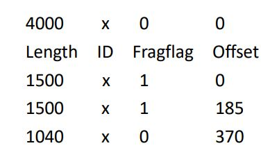

### IP 编址

#### IP 地址类型

IP地址类型分为A、B、C、D、E

A、B、C类：我们生活中常用的类型的 IP 地址

D类：组播地址在路由协议的时候会讲到几个常用的几个，用户组播地址在CCIE中学习。

E类：仅供Internet实验和开发

> 注：A类前一位为0，B类前两位为10（其他位任意）；C类前三位为110（其他位任意）；D类前四位为1110（其他位任意）；E类前五位为11110（其他位任意），其中127和0开头的为特殊地址；

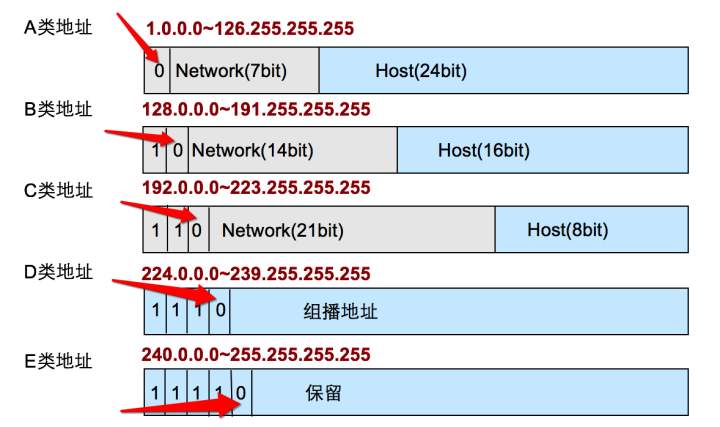

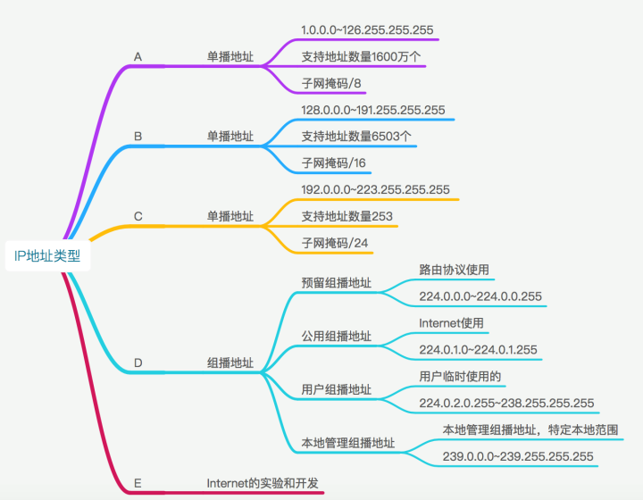

#### 公网地址和私网地址

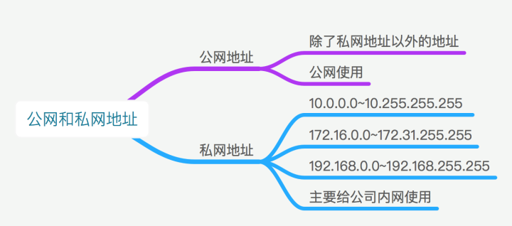

#### 有类和无类 IP 地址

有类（主类）IP地址：主要分为A、B、C类，每种类型固定的掩码。

无类IP地址：无论哪种类型的IP地址都没有固定掩码。

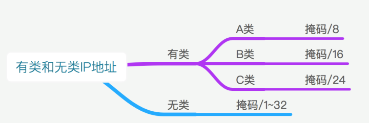

#### 什么是掩码（子网掩码）？

子网掩码不能单独存在，它必须结合IP地址一起使用。子网掩码只有一个作用，就是将某个IP地址划分成网络地址和主机地址两部分。

简单点说就像隔房间的墙，把大房间分割成一个个小房间。

#### 掩码的表示方式

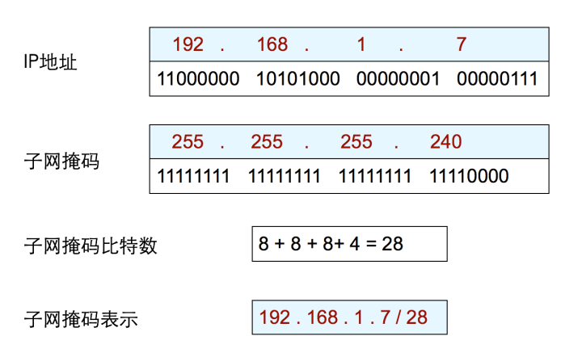

#### 无类的IP地址规划

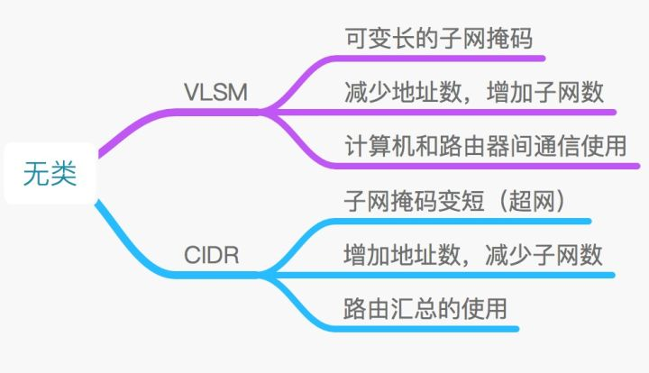

#### 无类地址进行划分 VLSM

例子:B类地址子网变长

B类地址从原来的/16变为/24，掩码进行变长，这时候使用的是VLSM（可变长的子网掩码）；

掩码边长使网段的主机数减少，但增加了子网数量；

举个例子，在现实生活中买100平米的房子，大多数人都会将房子分割成一个个功能区房间，餐厅，厨房等，虽然每个房间面积变小但是功能区分割清楚。这个跟我们IP地址进行VLSM意思一样，在/16的时候地址空间是很大，但是没法进行细分各个网段的功能

比如172.16.0.0/16变长为/24这时候，地址范围、网络地址、广播地址产生变化，可以将容纳更多的网段，但减少每个网段承载的主机数量。


#### 子网掩码变长路由汇总 CIDR

子网掩码变长以后使路由更容易进行汇总，比如右侧有多个192.168.1.x的网段，这时候只需要发布一条192.168.1.0/24路由就可以进行汇总，而且大大降低了地址的浪费，在后面讲到路由和现网地址规划内容就可知道汇总的重要性。


#### CIDR的使用

在现实网络中路由条目数决定了设备的运行效率，就跟电脑开应用程序一样，太多的运用程序占用大量的内容，使机器变慢。路由也是一样会占用设备的内存，路由条目数越多设备运行越慢。所以有效的路由汇总可以大大的减少设备的运行压力。

比如以下右侧的有3条C类路由，这时候在通告个周围的邻居的时候，正常情况下要3条路由。这时候如果使用CIDR将3条路由汇总为1条路由发布，可以减少设备的压力。


#### CIDR 与连续性

四个IP号段如下：
1111 1111.1110 0111/16
1111 1111.1110 0011/16
1111 1111.1110 0001/16
1111 1111.1110 0110/16

这四个IP号段有共同特征：从左到右数一数有 13 位是相同：

255.224.0.0/13

这个归纳后的IP号段还把另外一些IP号段囊括其中，其中还有12个：

1111 1111.1110 0000/16
1111 1111.1110 0010/16
1111 1111.1110 0100/16
…
1111 1111.1110 0101/16

有同学会说，囊括它们又如何？不是按照最长匹配原则吗？如果别人的路由表有以下两条路由，肯定选择前者，因为它16位，后者13位。1111 1111.1110 0100/161111 1111.1110 0/13看似很有道理，但万一路由1111 1111.1110 0100/16由于接口down，从全球路由表消失了，但我们的归纳路由1111 1111.1110 0/13不会消失，所以发往1111 1111.1110 0100/16的流量全部被归纳路由吸引了过来，流量吸引过来还不算最坏的状况，甚至能造成路由的环路，因为流量过来了，全球的路由表不能及时同步，会将流量继续发给1111 1111.1110 0100/16，而有一些及时得到同步的路由器会使用1111 1111.1110 0/13，将流量发送回来，于是一个环路就形成了。

因此：归纳路由要保证子路由是连续的

依据此原则，以上四条路由只有
1111 1111.1110 0111/16
1111 1111.1110 0110/16

是可以归纳的，归纳为
1111 1111.1110 011/15

#### 主机数计算

在一个网段中能够支持多少个主机使用呢？下面我们来计算下主机数。在主机数的计算中我们要注意减去2个地址，这两个地址分别是网络地址和广播地址。

主机数为：2^n

可用主机数为 : 2^n-2

>
例如192.168.1.0/24能够支持多少个主机？
>
2^8-2=254
>
所以能支持254个IP地址
>
例如192.168.0.0/22能够支持多少个主机？
>
2^10-2=1022
>
所以能支持1022个IP地址


#### 子网数计算

a能够支持最大的主机的子网掩码

b能够支持最小的主机的子网掩码

2^(b-a)=子网数

>
比如192.168.1.0/24能够分配多少个/27子网掩码的网段？
>
2^(27-24)=8
>
能够支持8个子网数。

#### 某公司分配到C类地址201.222.5.0。假设需要20个子网，每个子网有5台主机，我们该如何划分？

- 首先要5台主机


    > 2^n-2>5
    
    >所以n最小取值为3，掩码为29

-  能够支持多少个子网？

    > 首先C类地址那掩码为/24位，然后进行无类掩码/29位，计算2^(29-24)=32

    > 能够支持32个子网数。


### DHCP原理

- 第一步：DHCP服务器发现。广播地址255.255.255.255，源地址0.0.0.0
- 第二步：DHCP服务器提供。DHCP 服务器收到一个 DHCP 发现消息时，用一个 DHCP 提供消息对客户机做出响应， 仍然使用 IP 广播地址 255.255.255.255。子网中可能有多个 DHCP 服务器，所以该客户机可以选择其中的一个 DHCP 服务器。每个服务器提供消息中含有客户机请求的事务 ID、向客户机推荐的 IP 地址、网络掩码以及 IP 地址租用期、DNS服务器IP地址，默认网关IP地址、
- 第三步：DHCP请求：DHCP客户端选择它所接收到的第一个DHCPOFFER报文提供的IP地址。之后，它把这一信息广播至网络。该报文中，客户端请求服务器提供给它的IP地址。这是因为客户端可能收到不止一个DHCP服务器发送的offer。通过广播这一请求，客户端告知其他DHCP服务器不会再接受其他offer。
- 第四步：DHCP ACK：服务器用这个消息对 DHCP 请求消息进行响应，确认所要求的参数。 一旦客户机收到 DHCP ACK 后，交互便完成了，该客户机就能够在租用期内使用 DHCP 分配给它的IP 地址。

### 网络地址转换 NAT

NAT技术让少数公有IP地址被使用私有地址的大量主机所共享。这一机制允许远多于IP地址空间所支持的主机共享网络。同时，由于NAT屏蔽了内部网络，也为局域网内的机器提供了安全保障。

NAT的基本实施过程包括使用一个预留给本地IP网络的私有地址成立组织的内部网络，同时分配给组织一个或多个公网IP地址，并在本地网络与公网之间安装一个或多个具有NAT功能的路由器。

NAT路由器实现的功能包括将数据报中私网地址转换成公网地址，反向亦然。当有报文通过时，网络地址转换其不仅检查报文信息，还将报文头中的IP地址和端口信息进行修改，以使处于NAT之后的机器共享少数公网IP地址。

- 网络地址转换类型：

    静态NAT：此类NAT在本地和全局地址之间做一到一的永久映射。须注意静态NAT要求用户对每一台主机都有一个真实的Internet IP地址。静态转换是一对一的转换，有多少内网地址需要转换，就需要相应的公网地址；用得很少；

    动态NAT：动态转换是多对多的转换，通常需要转换的内网地址略多于相应的公网地址；将公网地址放在一个地址池里，当有内网地址需要访问外部网站时，从地址池中取出一个公网地址，用于内网地址到公网地址的转换；该方式适用于内网地址略多于给定的公网地址，如果内网地址远大于公网地址，当多台内网机器需要访问公网时，会出现地址池枯竭，无法获得对应的公网地址；

    端口NAT（PAT）：最为流行的NAT配置类型。通过多个源端口，将多个未登记的IP地址映射到一个合法IP地址（多到一）。使用PAT能够使上千个用户仅使用一个全局IP地址连接到Internet。
    
    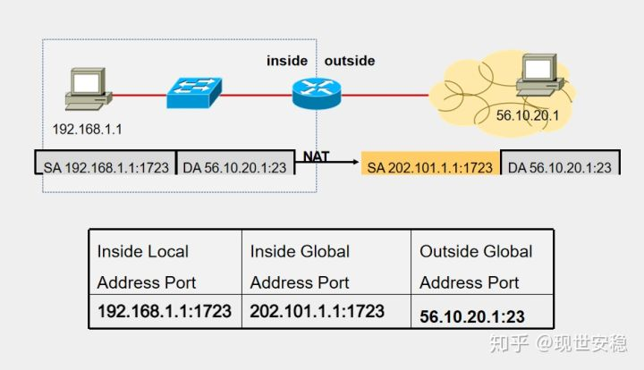
    
### 互联网控制报文协议 ICMP

ICMP 用于主机和路由器彼此交互网络层信息。ICMP 最典型的用途是差错报告。

Internet操作是由路由器严密监控的。当路由器端处理报文时如有意外发生，事件通过ICMP报告给发送端。ICMP也用来测试Internet。ICMP信息封装在IP报文中

ICMP 通常被认为是 IP 的一部分，但从体系结构上讲它是位于 IP 之上，因为 ICMP 报文 是承载在 IP 分组中的。

ICMP 报文有一个类型字段和一个编码字段，并且包含引起该 ICMP 报文首次生成的 IP 数据报(以便发送方能确定引发该差错的数据报)的首部和前 8 字节内容。

- ICMP 主要报文

    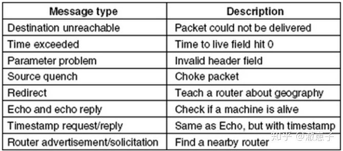


	DESTINATION UNREACHABLE消息用于当路由器无法找到目标地址或当设置了DF位的报文无法递送，因为路径上存在“小报文”网络。
	
	TIME EXCEEDED消息是由于报文TTL（Time to live）计数器到达0时。该事件是报文在回环，或计数器值设置过低的迹象。对于这一错误信息的聪明的应用是traceroute工具，traceroute发现从主机到目的IP地址路径上的路由器。它向目的地发送IP包，第一次的时候，将TTL设置为1，引发第一个路由器的Time Exceeded错误。这样，第一个路由器回复ICMP包，从而让出发主机知道途径的第一个路由器的信息。随后TTL被设置为2、3、4，...，直到到达目的主机。这样，沿途的每个路由器都会向出发主机发送ICMP包来汇报错误。traceroute将ICMP包的信息打印在屏幕上，就是接力路径的信息了。这并不是TIME EXCEEDED信息的本意，但却是非常有用的故障排查工具。
	
	PARAMETER PROBLEM信息表示报文头字段发现了非法值。这一问题表明发送主机的IP软件或可能是途经的路由器发生了bug。
	
	SOURCE QUENCH信息以前用来节制发送太多报文的主机。当主机接收到该信息，它预计将放缓发送报文。现在很少使用，因为当拥塞发生时，这类报文会起到火上浇油的作用，而且也不清楚如何做出回应。Internet中的拥塞控制现在大部分在传输层完成，使用报文丢失作为拥塞信号。
	
	REDIRECT信息用于路由器发现报文被错误路由的时候。路由器用该信息告知发送主机更新合适的路径。
	
	主机发送ECHO和ECHO REPLY信息以查看目前的目的地址是否可到达或是否alive。接收到ECHO信息之后，目的地址预计会发回一条ECHO REPLY信息。这些信息用在ping工具中来查看主机是否up以及是否挂在网上。
	
	TIMESTAMP REQUEST和TIME REPLY信息是类似的，除了信息的到达时间以及回复的离开时间是记录在回复中的。这一工具可用于衡量网络性能。
	
	ROUTER ADVERTISEMENT和ROUTER SOLICITATION信息用于主机发现附近的路由器。主机需要从至少一个路由器学习IP地址来发送报文。
	
### 路由选择算法

一台主机通常直接与一台路由器相连接，该路由器即为该主机的默认路由器，又称为该主机的默认网关。每当某主机向外部网络发送一个分组时，该分组都被传送给它的默认网关。

如果将源主机的默认网关称为源路由器,把目的主机的默认网关称为目的路由器。为一个分组从源主机到目的主机选路的问题于是可归结为从源路由器到目的路由器的选路问题。

全局选路算法：用完整的、全局性的网络信息来计算从源到目的之间的最低费用路径。具有全局状态信息的算法常被称作链路状态 LS 算法，因为该算法必须知道网络中每条链路的费用。

分布式选路算法：以迭代的、分布式的方式计算出最低费用路径。通过迭代计算并与相邻节点交换信息，逐渐计算出到达某目的节点或一组目的节点的最低费用路径。

DV 算法是分布式选路算法，因为每个节点维护到网络中的所有其他节点的费用(距离)估计的矢量。

- 链路状态选路算法 LS
    
    在链路状态算法中，通过让每个节点向所有其他路由器广播链路状态分组，每个链路状态分组包含它所连接的链路的特征和费用，从而网络中每个节点都建立了关于整个网络的拓扑。

    Dijkstra 算法计算从源节点到网络中所有其他节点的最低费用路径.
    
- 距离矢量选路算法 DV

-  LS 与 DV 选路算法的比较

    在 DV 算法中，每个节点仅与它的直接相连邻居交换信息，但它为它的邻居提供了从其 自己到网络中(它所知道的)所有其他节点的最低费用估计。

    在 LS 算法中，每个节点(经广播)与所有其他节点交换信息，但它仅告诉它们与它直接 相连链路的费用。
	
### 分层次的路由选择协议

#### 互联网采用分层次的路由选择协议

- 互联网的规模非常大。如果让所有的路由器知道所有的网络应怎样到达，则这种路由表将非常大，处理起来也太花时间。

- 许多单位不愿意外界了解自己单位网络的布局细节和本部门所采用的路由选择协议（这属于本部门内部的事情），但同时还希望连接到互联网上。
	
#### 自治系统 AS (Autonomous System)

在单一的技术管理下的一组路由器，而这些路由器使用一种 AS 内部的路由选择协议和共同的度量以确定分组在该 AS 内的路由，同时还使用一种 AS 之间的路由选择协议用以确定分组在 AS之间的路由。

尽管一个 AS 使用了多种内部路由选择协议和度量，但重要的是一个 AS 对其他 AS 表现出的是一个单一的和一致的路由选择策略。

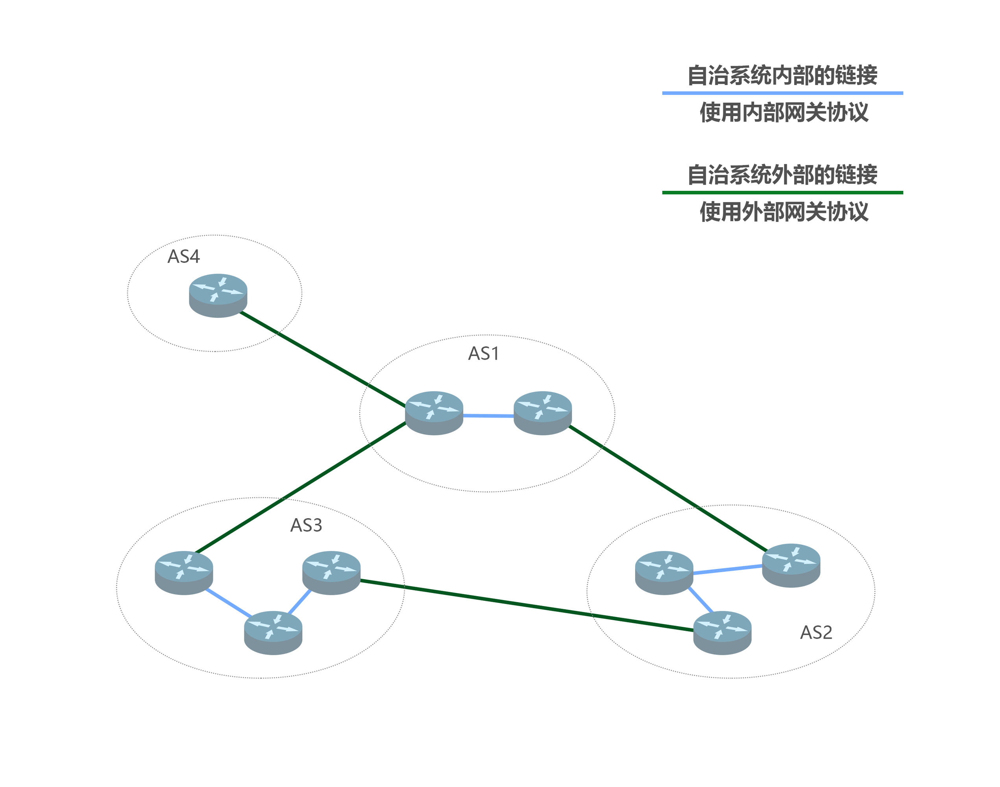

#### 两大类路由选择协议

- 内部网关协议 IGP (Interior Gateway Protocol)

    - 在一个自治系统内部使用的路由选择协议
    - 具体的协议有多种，如接下来会介绍的RIP和OSPF

- 外部网关协议 EGP (External Gateway Protocol)

    - 用于将路由选择信息传递到另一个自治系统中
    - 目前使用的最多的是 BGP-4
	
### 因特网自治系统内部路由选择协议：RIP（DV 算法）

路由信息协议 RIP (Routing Information Protocol) 是内部网关协议 IGP 中最先得到广泛使用的协议。
RIP 是一种分布式的、基于距离向量的路由选择协议。

RIP 协议中的“距离”也称为“跳数”(hop count)，因为每经过一个路由器，跳数就加 1。（这里的“距离”实际上就是指“最短距离”）

#### RIP协议的特点

- 仅和相邻路由器交换信息

- 交换的信息是当前本路由器所知道的全部信息，即自己的路由表

- 按固定的时间间隔交换路由信息

- *“好消息传播得快，坏消息传播得慢”

#### 路由表的建立与更新

```
路由器收到相邻路由器（其地址为 X）的一个 RIP 报文：

(1) 先修改此 RIP 报文中的所有项目：把“下一跳”字段中的地址都改为 X，并把所有的“距离”字段的值加 1。

(2) 对修改后的 RIP 报文中的每一个项目，重复以下步骤：
若项目中的目的网络不在路由表中，则把该项目加到路由表中。
否则
若下一跳字段给出的路由器地址是同样的，则把收到的项目替换原路由表中的项目。
否则
若收到项目中的距离小于路由表中的距离，则进行更新，
否则，什么也不做。

(3) 若 3 分钟还没有收到相邻路由器的更新路由表，则把此相邻路由器记为不可达路由器，即将距离置为 16（表示不可达）。

(4) 返回。


```

文字叙述看着有点累，不过理解了“不同路径选短的，同样路径选新的”的思路就会很容易。

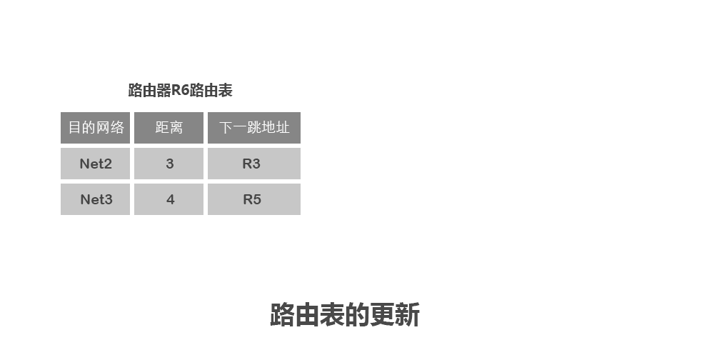

#### 好消息传得快，坏消息传得慢

```
“好消息传得快，坏消息传得慢”实际上是信息传送延迟造成路由器的“误判”

例如:

R1原本直接连接NET-A（可直接交付），但NET-A突然出故障，变为不可达。

R1中关于NET-A不可达的更新还没有传递给连接着R1的路由R2，此时R2仍以为可以通过R1达到NET-A，便向R1发送<NET-A,2,R2>的路由表；

R1收到后以为R2可以到达NET-A(其实已经不行了)，便更新自己的路由表为<NET-A,3,R2>，并将更新发送出去；

R2收到更新后将自己的路由表更新为<NET-A,4,R1>，并将更新发送出去；

如此来来回回直到两个路由器的路由表跳数都更新至16才确定了NET-A不可达。

```

### 因特网自治系统内部路由选择协议：OSPF(LS 算法)

#### OSPF 基本原理

链路状态路由协议出现的目的是为了克服距离矢量路由协议的缺点。


链路状态路由协议仅在网络拓扑发生变化时才会生成路由更新。链路的状态发生变化后，检测到变化的设备将生成一个针对该链路状态通告（LSA)

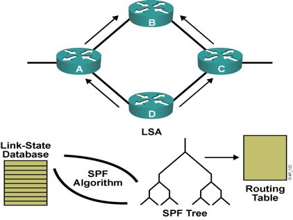

链路状态路由器对LSDB应用Dijkstra算法（即SPF算法）以建立SPF树。每台路由器都从其SPF树中选择最佳路径，并将其加入到路由表中。设备都更新其数据库，然后更新路由表以反映新的拓扑。如上图所示，LSDB用于计算穿越网络的最佳路径。

链路状态路由器对LSDB应用Dijkstra算法（即SPF算法）以建立SPF树。每台路由器都从其SPF树中选择最佳路径，并将其加入到路由表中。

我们可以将LSDB视为一个城市的地图，城市中的每幅地图都相同，就像同一个区域内所有路由器的LSDB都相同一样。我们在城市中各个地点，各幅地图之间唯一的差别就是“当前位置”。根据当前位置，我们可以确定前往每个地点的最佳路线；前往特定地点的最佳路线随着我们当前所处的位置而异。链路状态路由器的功能与此类似，它们从自己的角度出发，使用LSDB计算前往区域内每个网络的最佳路径。

分发路由信息和计算路由的方式，OSPF和IS-IS都属于链路状态路由协议。

运行链路状态路由协议的路由器从网络或网络的指定区域内的所有路由器那里收集路由信息，然后每台路由器都使用Dijkatar（SPF）算法分别计算其前往网络中各个目的地的最佳路径。来自某台路由器的错误信息导致混乱的可能性较低，因为每台路由器都有其对网络的认识。

为确保网络中所有的路由器都作出一致的路由选择决策，每台路由器都必须记录下述信息。

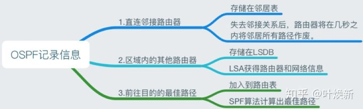

1）直接相连的邻接路由器：失去与邻接路由器的关系后，路由器将在几秒钟之内将该邻居提供的所有路径作废，并重新计算路径。在OSPF中，有关邻居的信息存储在邻居表中，这个表也被称为邻接关系数据库。

2）网络或区域内的其他路由器及其连接的网路：路由器通过LSA来获得其他路由器和网络，LSA被扩散到整个网络，它存储在拓扑表或数据库（即LSDB）中。

3）前往每个目的地的最佳路径：每台路由器都使用Dijkstra（SPF）算法独立地计算前往网络中心每个目的地的最佳路径。所有路径都存储在LSDB中。最佳路径被加入到路由表（也称为转发数据库）中。路由器收到分组后，将根据路由表中的信息对其进行转发。

OSPF多种表叫法:

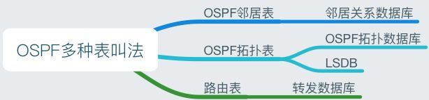

为保存这些表，需要占用内存资源，这是链路状态协议的一个缺点。然而，在同一个区域内，所有OSPF路由器的拓扑表（LSDB）都相同，其中包含有关区域中所有路由器和链路的完整信息，因此每台路由器都能根据开销独立地选择前往区域中每个网络的无环路高效路径。还克服了距离矢量路由协议“根据流言选择路由”的缺点。

运行距离矢量路由协议的路由器依赖于邻居的路由抉择。路由器并不完全知道网络拓扑；而运行链路状态路由协议的每台路由器都完全了解网络拓扑，能够根据准确的网络拓扑信息独立地做出决策。

#### OSPF 的区域结构

在小型网络中，路由器链路构成的结构并不复杂，很容易确定前往各个目的地的路径。然而，在大型网络中，路由器链路组成的结构极其复杂，前往每个目的地的潜在路径为数众多。因此对所有可能路由进行比较的SPF算法非常复杂，需要很长时间。


链路状态路由协议通常将网络划分成区域如下图所示，以减少SPF算法的计算量。区域内的路由器数量以及在区域内扩散的LSA数量较少，这一位置区域内的LSDB（拓扑数据库）较小。其结果是，SPF算法的计算量更小，需要的时间更短。在这种情况下，仍可进行区域间路由选择，但很多内部路由操作（如SPF计算）实在各个区域内进行的。例如，如果区域1存储链路时好时坏的问题，不会导致其他区域内的路由器不断运行SPF算法，因为它们不受区域1内这种问题的影响。

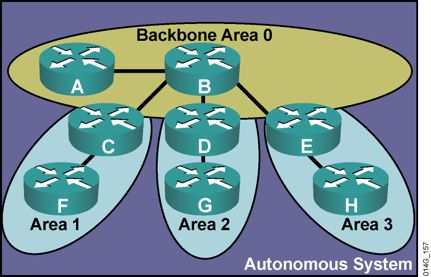

OSPF多区域优点:

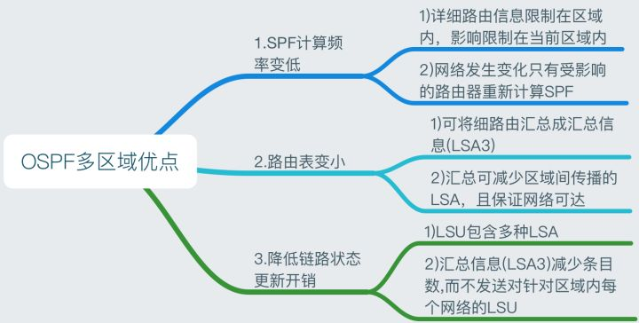

OPSF的两层次区域结构:

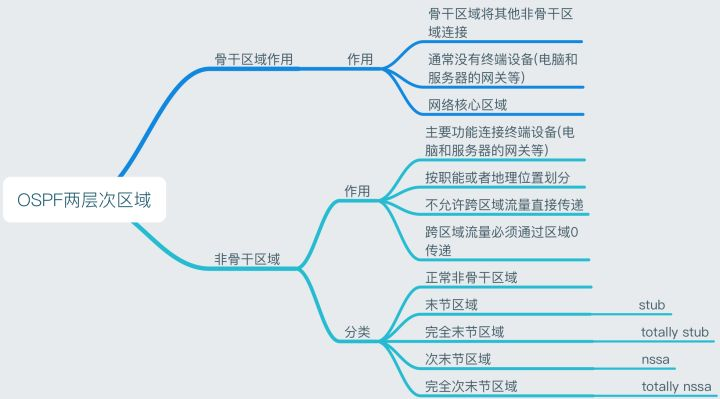

OSPF路由器的角色:


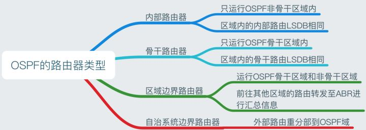

#### OSPF 的邻接关系与邻居关系


运行链路状态路由协议的路由器必须首先与选定的邻居路由器建立邻接关系，这是通过与邻居路由器交换Hello分组来实现的。

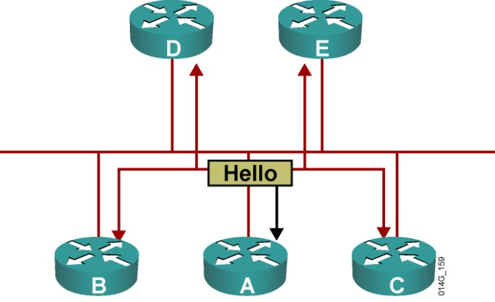

路由器建立邻接关系的步骤如下:

```
1）路由器将Hello分组发送给邻居路由器，并接收来自邻居路由器的Hello分组。Hello分组的目标地址通常是组播地址。

2）路由器通过交换Hello分组来获悉协议特定的参数，如检查邻居是否位于同一个区域中，Hello间隔是否相等。交换完Hello分组后，路由器宣称邻居处于正常运行状态。

3）两台路由器使用Hello分组建立邻接关系后，它们通过LSA来同步LSDB，并确认已收到邻接路由器的LSA。至此，两台邻接路由器知道它们的LSDB已经同步。对OSPF而言，这意味着两台路由器已经处于完全邻接状态。

4）必要时，路由器将新的LSA转发给其他邻接路由器，确保在整个区域内，链路状态信息都是完全同步的。
```

点到点邻接：

>
点到点串行链路上的两台路由器之间建立完全邻接的关系，它们使用的封装类型通常是高级数据链路控制（HDLC）或点到点协议（PPP）。然而，在LAN链路等广播网络上，将选举一个指定路由器（DR）和一个备用指定路由器(BDR)。其他的路由器都与这两台路由器建立邻接关系，却只将LSA通告给它们。DR从邻居那里收到更新后，将其转发给LAN上的其他所有邻居。DR的主要功能之一是确保同一个LAN中所有路由器的LSDB都相同。因此，在广播网络中，DROTHER(不属于DR或者BDR的路由器)与DR和BDR同步LSDB。

LAN链路中的邻居：

>
LAN中不属于DR或BDR的路由器（DROTHER）之间维护部分邻居关系，这被称为双向邻居状态。例如，在上图中，路由器A为DR，路由器B为BDR，因此路由器C将与路由器A和B建立邻接关系，并与路由器D和E建立双向邻居关系。

#### OSPF 的 五种包、七个状态

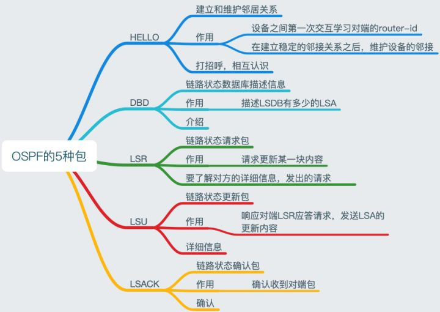

我们用微信加好友，建群的方式通俗解释下 OSPF 详细过程。

- DOWN

    刚开始大家都相互不认识，也没有兴趣认识对方。(这时就是Down 状态)
    
- INIT

    这时候你想要加对方的微信号，肯定要备注上你是谁谁谁。(这时OSPF进入Init)
    
- TWO WAY

    对方看你备注的信息，也同意你的好友请求，这时候双方也知道各自的微信号啥啥的(router-id)。(这时就进入Two way状态)

    然后接着呢，有20个人想要一起沟通，那就组建一个群吧，那谁当群主(DR/BDR)呢，所有人都想当群主，大家都得亮出你们的能力(优先级越大越优)谁牛逼？如果大家的能力都差不多该如何是好呢？那么就比比微信号(router-id越大越优)，通过这样就把群主选出来了。
    
    注意:群主确定后就算后续有更牛逼的人加入，也不会成为群主(DR不抢占)。
    
    >
    比如没有群主，现在微信群有20个人，所有人都要知道其他人的手机号该怎么办？20个人都发送一遍自己的手机号信息到微信群里面，每个人也就是20个人，都得记录除了自己以外的19个人的的手机号，那这时所有人的总记录次数是20✖️19=380，对应的公式就是N✖️(N-1)，随着人数增多每个人所需要记录的次数就越多。

    >
    如果有群主，群里现在20个人，还是一样群里所有人都要知道其他人的的手机号，20个人都发送一遍自己的手机号信息到微信群里面，只有群主(DR/BDR)负责统一收集除自己以外的19个人的手机号，然后把手机号进行收集打包发送给非群主的(DRother)19个人，那么群主一共收集了19次，剩下19人只接收群主整理后的信息1次，那这时所有人的总记录次数是 19+19=38次，人数越多选举群主优势越明显。这就是在多人群(广播型多路访问环境)内交流选出群主的好处。
    
- EXSTART

    该选的群主也已选好，该直接沟通也确定了。(这时OSPF 进入到 Exstart 状态)
    
    这时候群里面的人要相互自我介绍(DBD)，那谁来确定先从谁开始呢？这可不是群主 (DR/BDR) 的任务，要选出一个管理员(master)去管理大家自我介绍发言顺序，那这个管理员怎么选？反正都知道大家的微信号(router-id越大越优)那就比微信号吧。

    如果就两个人呢?虽然不用拉群，但这时候要确定谁先发。好吧那个人PK下微信号(router-id越大越优)，谁牛逼谁就是管理员(master)。

    注:这个管理员(master)是可以抢占的，如果后面加入进来的微信号(router-id)更优就会抢占成为管理员。
    
- EXCHANGE

    好吧，这时候群主管理员(master)都完活了。(这时OSPF进入Exchange状态)

    群里面大家需要相互了解各自，前面已经确定发言顺序，就从自我介绍(DBD)开始，按照管理员(master)安排的顺序开始发送。
    
- LOADING

    大家的自我介绍(DBD)都发送完成了。(这时OSPF进入Loading)

    这时大家都有了群里面人的自我介绍，比如有些土豪自我介绍的时候说有三套房子，多本IE证书。这时候群里就有人就询问三套房子在哪、多大啊(LSR)，(PS：IE证书是啥，房子才是关键)，土豪知无不言言无不尽将回复内容发送给群主(DR):"上海三套房，每套150平米(LSU)"，这些信息都经过群主(DR)收集，同一样其他人回复的信息也经过群主(DR)收集，群主收集后打包一次性发送给所有人，接收到信息的人回复:"好厉害啊(LSack)"，大家通过询问、回答、回复确认这种方式相互了解各自信息，并把回答的信息(LSU)进行记录在本子上(LSDB)。
    
- FULL

    终于要修正正果....

    当群里所有人都知道大家的信息之后。(这时OSPF进入FULL也就是邻接)

    群里关系开始稳定，开始冷清，除非这时候又有谁又买了房啊，更新了手机号啊(LSU)，这时候又开始发送询问(LSR)、回答(LSU)、回复确认(LSack)。

    正常的时候没啥事大家只在群里每天(10秒)都发我还活着的信息(hello)，群里还规定如果有人4天(40秒)都不发活着的信息，就把他T出(down)微信群。

    比较长的周期之后担心大家遗忘了其他人的信息(LSU)，群里规定在30天(30分钟防洪LSA)时间每个人都要重新发一遍自己所有信息(LSDB)，然后又开始询问(LSR)、回答(LSU)、回复确定(LAack)。如果群里有人每天都发存活的信息(hello)，但就是懒得更新信息(LSU)，大家忍耐了60天(60分钟)，这时就果断的把他从群T出(down)。

### 边界网关协议: BGP

先看看几个相关的概念：

- IGP（Interior Gateway Protocol）：内部网关协议，在一个AS内部所使用的一种路由协议。一个AS内部也可以有多个路由器管理多个网络。各个路由器之间需要路由信息以知道子网络的可达信息。IGP就是用来管理这些路由。代表的实现有RIP和OSPF。

- EGP（Exterior Gateway Protocol）：外部网关协议，在多个AS之间使用的一种路由协议，现在已经淘汰，被BGP取而代之。

由于BGP就是为了替换EGP而创建，它的地位与EGP相似。但是BGP也可以应用在一个AS内部。因此BGP又可以分为IBGP（Interior BGP ：同一个AS之间的连接）和EBGP（Exterior BGP：不同AS之间的BGP连接）。既然EGP已经被替代了，那EBGP的存在比较好理解，但是IGP协议都还活得好好的（这里指的是OSPF），那IBGP的意义何在？IGP的协议是针对同一个AS网络来设计的，一个自治网络的规模一般都不大，所以设计的时候就没有考虑大规模网络的情况。而当一个自治网络足够大时，OSPF存在性能瓶颈（后面会说明）。BGP本身就是为了在Internet工作，其设计就是为了满足大型网络的要求，所以大型私有IP网络内部可以使用IBGP。总的来说，这几类路由协议，小规模私有网络IGP，大规模私有网络IBGP，互联网EBGP。

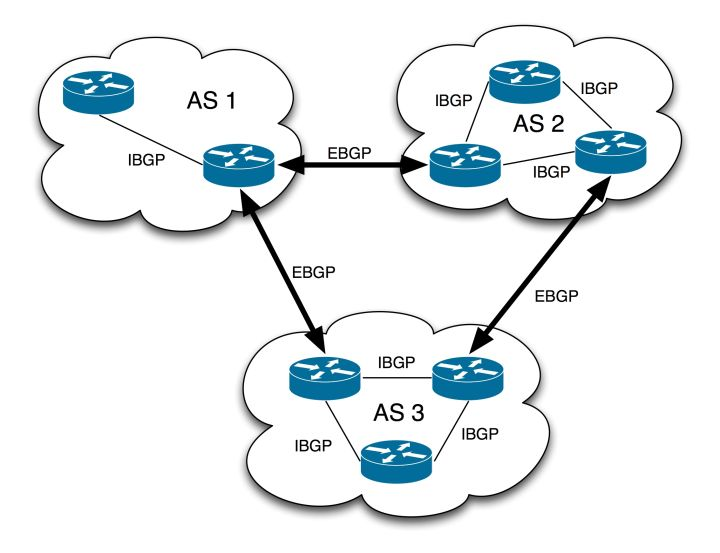

>为什么需要 BGP？
>
>联通的IP毕竟是有限的，而且联通还老是断线。这都发布3个版本了，小明决定干一票大的。
首先，小明向IANA（Internet Assigned Numbers Authority）申请了自己的公网IP池。因为有了自己的公网IP，也必须要考虑申请AS号。AS号是一个16bit的数字，全球共用这60000多个编号。1 – 64511 是全球唯一的，而 64512 – 65535 是可以自用的，类似于私网网段。每个自治网络都需要申请自己的AS编号，联通的AS号是9800。
>
然后，小明分别向联通和电信买了线路，这样就算联通断线还能用电信。
>
那现在问题来了：
>
联通或者电信怎么知道小明申请的公网IP是什么。换言之，我现在拨号拨进了联通宽带，我怎么才能访问到小明云的公网IP？
小明的云中路由器的默认路由该设置到联通的ISP路由器，还是电信的？
>
终于，在小明的4.0版本云上，小明需要用BGP了。通过BGP，小明可以将自己云中的路由信息发送到联通，电信，这样ISP就知道了改如何访问小明的公网虚拟机，也就是说我们普通的使用者通过ISP，能访问到小明的网络。另一方面，通过在云中运行BGP服务，小明可以管理云中路由器的默认路由。


#### 四种分组类型

- 打开 (OPEN) 报文，用来与相邻的另一个BGP发言人建立关系。

- 更新 (UPDATE) 报文，用来发送某一路由的信息，以及列出要撤消的多条路由。

- 保活 (KEEPALIVE) 报文，用来确认打开报文和周期性地证实邻站关系。

- 通知 (NOTIFICATION) 报文，用来发送检测到的差错。

BGP的工作机制也可以通过这四种报文描述：

1）通过TCP建立BGP连接时，发送OPEN报文

2）连接建立后，如果有路由器需要发送路由或路由发生变化时，发送UPDATE报文

3）稳定后，周期发送KEEPALIVE报文，维持连接有效性

4）当本地BGP运行中发生错误时，发送NOTIFICATION报文通告BGP对端

#### BGP 路由注入

在初始状态下，BGP的路由表为空，没有任何路由，要让BGP传递相应的路由，只能先将该路由注入BGP路由表，之后才能在BGP邻居之间传递。注入的方式有多种，1）动态注入 2）半动态路由注入：通过IGP协议(如OSPF)学习到的路由 3）静态路由注入：工配置的静态路由，

在BGP路由表注入路由后，BGP路由器之间会将这些路由在BGP路由器间进行通告。通告要遵守以下规则

- BGP 路由器只把自己使用的路由通告给相邻体
- BGP 路由器从EBGP获得的路由会向它的所有BGP相邻体通告（包括EBGP和IBGP）
- BGP路由器从IBGP获得的路由不会向它的IBGP相邻体通告（避免内部产生环路）
- BGP 路由器从IBGP获得的路由是否通告给它的EBGP相邻体要依IGP和BGP同步的情况而定

对于最后一条，只有当 IGP 与 BGP 同步时（也就是该路由可以通过 IGP 获得），才能通告，反之不通告，这样做的目的是为了避免路由黑洞。

#### BGP 路径属性

BGP路由必须携带的公认强制属性有三个：Origin，Next_Hop，AS-path

- origin属性

    origin属性为起源属性，描述路由是以何种方式注入到BGP路由表中的，主要有以下两种情况
    
    1）以 network 命令注入到BGP路由表中，origin 属性为 IGP

    2）以 redistribute 命令注入到BGP路由表中，origin 属性为 Incomplete
其中，IGP优先级比Incomplete的要高。

- AS Path属性

    描述了该路由经过的AS组成的路径，AS路径中不能算上自己的AS，从离自己最近的AS开始，以目的网络的AS结束。
    
    借助路由的AS Path属性，可以避免环路，具体操作就是收到一条AS Path属性中含有自己AS的路由的时候丢弃该路由。

    在选路的时候，优先选AS PATH最短的那条，如果AS PATH距离相等，则优选本AS内到出口路由器最短的那根，如果还相等，则选择Router_ID（发送路由的路由器）最小的那根
    
- Next Hop属性

    指示下一个AS的路由器入口的网段，同一个AS内Next hop的值不变,如下图所示
    
- local pref属性
    
    可选的属性，用于引导流量，local pref的缺省值是100
    
#### BGP 路由选择

- 路由被指派一个本地偏好值作为它们的属性之一，通俗地说就是由该 AS 的网络管理员设定一种策略。

- 在剩下的路由(所有都具有相同的本地偏好值)中，将选择具有最短 AS-PATH 的路由。

- 在剩下的路由(所有都具有相同的本地偏好和相同的 AS-PATH 长度)中，将选择最靠近 NEXT-HOP 路由器的路由。

- 如果仍余下多条路由，路由器使用 BGP 标识符来选择路由。

### 广播选路算法

#### 无限制洪泛

实现广播的最显而易见的技术是使用洪泛(flooding)方法，该方法要求源节点向它的所有邻居发送一个分组的拷贝。当某节点接收了一个广播分组时，它复制该分组并向它的所有邻居转发。

#### 受控洪泛

避免广播风暴的关键是每个节点明智地选择何时洪泛分组，何时不洪泛分组。 在实践中，这可以通过序号控制洪泛实现，源节点将其地址(或其他的唯一标识符)以及广播序号放人广播分组，再向它的所有邻居发送该分组。每个节点维护它已经收到的、复制的和转发的源地址和每个广播分组的序号列表。当一个节点接收到一个广播分组时，它首先检查该分组是否在该列表中。如果在，丢弃该分组;如果不在，复制该分组并向该节点的所有邻居转发。

受控洪泛的第二种方法称为反向路径转发，有时也称为反向路径广播(Reverse Path Broadcasting，RPB)。RPB 的基本思想是当一台路由器接收到具有给定源地址的广播分组时， 仅当该分组到达的链路正好是位于它自己到其源的最短单播路径上，它才向其所有出链路 (除了它接收分组的那个)传输分组。否则，该路由器丢弃入分组。

#### 生成树广播

虽然序号控制洪泛和 RPB 避免了广播风暴，但它们不能完全避免冗余广播分组的传输。 另一种提供广播的方法是首先对网络节点构造出一棵生成树。当一个源节点要发送一个广播分组时，它向所有属于该生成树的特定链路发送分组。接收广播分组的节点则向生成树中的所有邻居转发该分组(它接收该分组的邻居除外)。生成树不仅消除了冗余广播分组，而且能够被任何节点用于开始广播分组。

STP协议的基本思想十分简单。大家知道，自然界中生长的树是不会出现环路的，如果网络也能够像一棵树一样生长就不会出现环路。于是，STP协议中定义了根桥(RootBridge)、根端口(RootPort)、指定端口(DesignatedPort)、路径开销(PathCost)等概念，目的就在于通过构造一棵自然树的方法达到裁剪冗余环路的目的，同时实现链路备份和路径最优化。用于构造这棵树的算法称为生成树算法SPA(Spanning TreeAlgorithm)。

要实现这些功能，网桥之间必须要进行一些信息的交流，这些信息交流单元就称为配置消息 BPDU(BridgeProtocol Data Unit)。STP BPDU是一种二层报文，目的MAC是多播地址01-80-C2-00-00-00，所有支持STP协议的网桥都会接收并处理收到的BPDU报文。该报文的数据区里携带了用于生成树计算的所有有用信息。

要了解生成树协议的工作过程也不难，首先进行根桥的选举。选举的依据是网桥优先级和网桥MAC地址组合成的桥ID(Bridge ID)，桥ID最小的网桥将成为网络中的根桥。在图1所示的网络中，各网桥都以默认配置启动，在网桥优先级都一样(默认优先级是32768)的情况下，MAC地址最小的网桥成为根桥，例如图1中的SW1，它的所有端口的角色都成为指定端口，进入转发状态。

接下来，其他网桥将各自选择一条 “最粗壮”的树枝作为到根桥的路径，相应端口的角色就成为根端口。假设图1中SW2和SW2、SW3之间的链路是千兆GE链路，SW1和SW3之间的链路是百兆FE链路，SW3从端口1到根桥的路径开销的默认值是19，而从端口2经过SW2到根桥的路径开销是4+4=8，所以端口2成为根端口，进入转发状态。同理，SW2的端口2成为根端口，端口1成为指定端口，进入转发状态。

根桥和根端口都确定之后一棵树就生成了，如图中实线所示。下面的任务是裁剪冗余的环路。这个工作是通过阻塞非根桥上相应端口来实现的，例如SW3的端口1的角色成为禁用端口，进入阻塞状态(图中用“×”表示)。

生成树经过一段时间(默认值是30秒左右)稳定之后，所有端口要么进入转发状态，要么进入阻塞状态。STPBPDU仍然会定时从各个网桥的指定端口发出，以维护链路的状态。如果网络拓扑发生变化，生成树就会重新计算，端口状态也会随之改变。

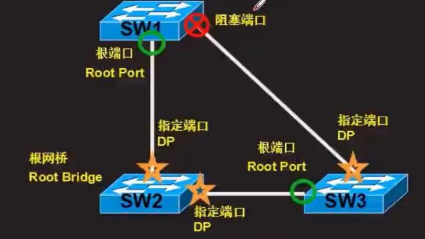


### 多播

多播服务可以将多播分组仅交付给网络节点的一个子集。

在多播通信中，面临两个问题，即怎样标识多播分组的接收方，以及怎样为发送到这些接收方的分组编址。

在因特网体系结构中，多播数据报使用间接地址来编址。

在因特网中，表示一组接收方的单一标识就是一个 D 类多播地址。与一个 D 类地址相关联的多个接收方称为一个多播组。

这个我们可以这样理解，多播地址就类似于 QQ 群号，多播组相当于 QQ 群，一个个的主机就相当于群里面的成员。

在以太网单播（Unicast ) 世界，如果主机A、B需要通信，需要知道彼此的MAC地址以完成以太网封装，众所周知ARP可以完成这个任务。

组播的参与者使用相同的方法，计算出组播IP对应的MAC地址，这个计算公式很简单，举个例子，比如组播IP 239.1.1.1，根据以下公式可以很容易算出其对应的MAC地址：

01:00:5e + 组播IP低23位 = 01:00:5e:01:01:01

IANA规定，IPv4 组播MAC地址的高24 位为0x01005E，第25 位为0，低23 位为IPv4 组播地址的低23 位。IPv4 组播地址与MAC地址的映射关系如下图所示。

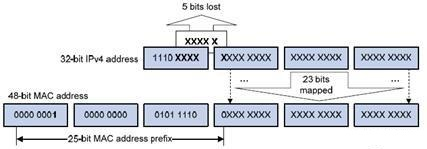

由于IPv4 组播地址的高4 位是1110，代表组播标识，而低28 位中只有23 位被映射到IPv4 组播MAC 地址，这样IPv4 组播地址中就有5 位信息丢失。

以此方法，组播的发送者可以计算出组播的MAC地址，完成以太网帧头部的封装，然后从网络接口发送出去，组播的接受者的网卡使用组播MAC地址做过滤器，将组播过滤为自己感兴趣流量，接收到缓冲区并提交给上层协议。

### 互联网组管理协议：IGMP

IGMP(Internet Group Management Protocol)互联网组管理协议是TCP/IP 协议族中负责IP组播成员管理的协议，用来在IP主机和与其直接相邻的组播路由器之间建立、维护组播组成员关系。

#### IGMPv1 工作机制

这是全面的IGMP协议总结，没有之一！
IGMP互联网组管理协议是TCP/IP 协议族中负责IP组播成员管理的协议，用来在IP主机和与其直接相邻的组播路由器之间建立、维护组播组成员关系。

一、IGMP 简介

IGMP(Internet Group Management Protocol)互联网组管理协议是TCP/IP 协议族中负责IP组播成员管理的协议，用来在IP主机和与其直接相邻的组播路由器之间建立、维护组播组成员关系。

IGMP

到目前为止，IGMP 有三个版本：

IGMPv1(由RFC 1112 定义)
IGMPv2(由RFC 2236 定义)
IGMPv3(由RFC 3376 定义)
所有版本的IGMP 都支持ASM(Any-Source Multicast，任意信源组播)模型;IGMPv3 可以直接应用于SSM(Source-Specific Multicast，指定信源组播)模型，而IGMPv1 和IGMPv2 则需要在IGMP SSM Mapping 技术的支持下才能应用于SSM 模型。

二、IGMP 工作机制

1. IGMPv1 工作机制

IGMPv1 主要基于查询和响应机制来完成对组播组成员的管理。当一个网段内有多台组播路由器时，由于它们都能从主机那里收到IGMP 成员关系报告报文(Membership Report Message)。

因此，只需其中一台路由器发送IGMP 查询报文(Query Message)就足够了。这时就需要有一个查询器(Querier)的选举机制来确定由哪台路由器作为IGMP查询器。

对于IGMPv1 来说，由组播路由协议(如PIM)选举出唯一的组播信息转发者DR(Designated Router，指定路由器)作为IGMP 查询器。

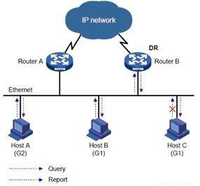


如上图所示，假设Host B与Host C想要收到发往组播组G1 的组播数据，而Host A想要收到发往组播组G2 的组播数据，那么主机加入组播组以及IGMP查询器(Router B)维护组播组成员关系的基本过程如下：

1)主机将主动发送IGMP 成员关系报告报文到其要加入的组播组，以声明加入，而不必等待IGMP查询器发来的IGMP 查询报文;

2)IGMP 查询器周期性地以组播方式，向本地网段内的所有主机与路由器发送IGMP 查询报文(目的地址为224.0.0.1);

3)在收到该查询报文后，关注G1 的Host B 与Host C 其中之一(这取决于谁的延迟定时器先超时)，譬如Host B 会首先以组播方式向G1 发送IGMP 成员关系报告报文，以宣告其属于G1。

由于本地网段中的所有主机和路由器都能收到Host B 发往G1 的报告报文，因此当Host C 收到该报告报文后，将不再发送同样针对G1的报告报文，因为IGMP 路由器(Router A和Router B)已知道本地网段中有对G1 感兴趣的主机了。

这个机制称为主机上的IGMP 成员关系报告抑制机制，该机制有助于减少本地网段的信息流量;

4)与此同时，由于Host A 关注的是G2，所以它仍将以组播方式向G2 发送报告报文，以宣告其属于G2;

5)经过以上的查询和响应过程，IGMP 路由器了解到本地网段中有G1 和G2 的成员，于是由组播路由协议(如PIM)生成(*，G1)和(*，G2)组播转发项作为组播数据的转发依据，其中的“*”代表任意组播源;

6)当由组播源发往G1 或G2 的组播数据经过组播路由到达IGMP 路由器时，由于IGMP 路由器上存在(*，G1)和(*，G2)组播转发项，于是将该组播数据转发到本地网段，接收者主机便能收到该组播数据了。

IGMPv1 没有专门定义离开组播组的报文。当运行IGMPv1 的主机离开某组播组时，将不会向其要离开的组播组发送报告报文。当网段中不再存在该组播组的成员后，IGMP 路由器将收不到任何发往该组播组的报告报文，于是IGMP 路由器在一段时间之后便删除该组播组所对应的组播转发项。


#### IGMPv2 的改进

与IGMPv1 相比，IGMPv2 增加了查询器选举机制和离开组机制。

(1) 查询器选举机制

在IGMPv1 中，当某共享网段上存在多个组播路由器时，由组播路由协议(如PIM)选举的指定路由器充当查询器。

>
在IGMPv2 中，增加了独立的查询器选举机制，其选举过程如下：
>
- 所有IGMPv2 路由器在初始时都认为自己是查询器，并向本地网段内的所有主机和路由器发送IGMP 普遍组查询(General Query)报文(目的地址为224.0.0.1);
>
- 本地网段中的其它IGMPv2 路由器在收到该报文后，将报文的源IP地址与自己的接口地址作比较。通过比较， IP 地址最小的路由器将成为查询器， 其它路由器成为非查询器(Non-Querier);
>
- 所有非查询器上都会启动一个定时器(即其它查询器存在时间定时器Other Querier Present Timer)。在该定时器超时前，如果收到了来自查询器的IGMP 查询报文，则重置该定时器;否则，就认为原查询器失效，并发起新的查询器选举过程。


(2) 离开组机制

在IGMPv1 中，主机离开组播组时不会向组播路由器发出任何通知，导致组播路由器只能依靠组播组成员查询的响应超时来获知组播组成员的离开。

>
而在IGMPv2 中，当一个主机离开某组播组时：

>
- 该主机向本地网段内的所有组播路由器(目的地址为224.0.0.2)发送离开组(Leave Group)报文;
>
- 当查询器收到该报文后， 向该主机所声明要离开的那个组播组发送特定组查询(Group-Specific Query)报文(目的地址字段和组地址字段均填充为所要查询的组播组地址);
>
- 如果该网段内还有该组播组的其它成员，则这些成员在收到特定组查询报文后，会在该报文中所设定的***响应时间(Max Response Time)内发送成员关系报告报文;
>
- 如果在***响应时间内收到了该组播组其它成员发送的成员关系报告报文，查询器就会继续维护该组播组的成员关系;否则，查询器将认为该网段内已无该组播组的成员，于是不再维护这个组播组的成员关系。

### 组播路由协议

#### 组播模型分类

根据接收者对组播源处理方式的不同，组播模型分为以下三类：

(1) ASM 模型：Any-Source Multicast，任意信源组播

在ASM 模型中，任意一个发送者都可以作为组播源向某组播组地址发送信息。众多接收者通过加入由该组播组地址标识的组播组以获得发往该组播组的组播信息。

在ASM 模型中，接收者无法预先知道组播源的位置，但可以在任意时间加入或离开该组播组。

(2) SFM 模型：Source-Filtered Multicast，信源过滤组播

该模型继承了ASM 模型，从发送者角度来看，两者的组播组成员关系完全相同。SFM 模型在功能上对ASM 模型进行了扩展。

在SFM 模型中，上层软件对收到的组播报文的源地址进行检查，允许或禁止来自某些组播源的报文通过。

因此，接收者只能收到来自部分组播源的组播数据。从接收者的角度来看，只有部分组播源是有效的，组播源被经过了筛选。

(3) SSM 模型：Source-Specific Multicast，指定信源组播

在现实生活中，用户可能只对某些组播源发送的组播信息感兴趣，而不愿接收其它源发送的信息。该模型为用户提供了一种能够在客户端指定组播源的传输服务。

SSM 模型与ASM 模型的根本区别在于：SSM 模型中的接收者已经通过其它手段预先知道了组播源的具体位置。SSM 模型使用与ASM/SFM 模型不同的组播地址范围，直接在接收者与其指定的组播源之间建立专用的组播转发路径。

#### 组播路由协议

对于ASM 模型，可以将组播路由分为域内和域间两大类：

- 域内组播路由用来在AS 内部发现组播源并构建组播分发树，从而将组播信息传递到接收者。在众多域内组播路由协议中，PIM(Protocol Independent Multicast，协议无关组播)是目前较为典型的一个。按照转发机制的不同，PIM 可以分为DM(Dense Mode，密集模式)和SM(Sparse Mode，稀疏模式)两种模式。

- 域间组播路由用来实现组播信息在AS 之间的传递，目前比较成型的解决方案有：MSDP(Multicast Source Discovery Protocol，组播源发现协议)能够跨越AS 传播组播源的信息;而MP-BGP(MultiProtocol Border Gateway Protocol，多协议边界网关协议)的组播扩展MBGP(Multicast BGP)则能够跨越AS 传播组播路由。

对于SSM 模型，没有域内和域间的划分。由于接收者预先知道组播源的具体位置，因此只需要借助PIM-SM 构建的通道即可实现组播信息的传输。


### 互联网组管理协议窥探:IGMP Snooping

是运行在二层设备上的组播约束机制，通过窥探和分析主机与三层组播设备之间交互的 IGMP 报文来管理和控制组播组，从而可以有效抑制组播数据在二层网络中的扩散。

### 虚电路和数据报网络

虚电路的概念来源于电话领域，它采用了真正的电路，使用 VC 号转发分组。

因特网作为一种数据报网络，是由互连计算机的需求发展而来的，使用 IP 地址转发分组。

- 曾经的许多网络体系结构(包括 ATM、帧中继)都是虚电路网络，在网络层使用连接，这 些网络层连接被称为虚电路。

    在网络层的虚电路建立与传输层的连接建立之间的区别：
    
    - 传输层的连接建立仅涉及两个端系统。
    - 虚电路网络中，沿两个端系统之间路径土的路由器都要参与虚电路的建立，且每台路由 器都完全知道经过它的所有虚电路。
    
- 在数据报网络中，每当一个端系统要发送分组时，它就为该分组加上目的地端系统的地址，然后将该分组推进网络中。
    
    在数据报网络中，路由器没有虚电路的概念，当然不维护任何类似虚电路的状态信息。

    分组从源向目的地传输通过一系列路由器。路由器中的每个都使用该分组的目的地址来 转发该分组。

    路由器有一个将目的地址映射到链路接口的转发表，当分组到达路由器时，该路由器使用该分组的目的地址在该转发表中查找适当的输出链路接口。然后，路由器有意识地将该分 组向该输出链路接口转发。


## 数据链路层

### 链路层提供的服务

- 成帧
- 链路接入
- 可靠交付
- 流量控制
- 差错检测
- 差错纠正

### MAC地址与IP地址

在数据发送传输的过程中，目的 IP 地址与源 IP 地址是永远不会变的，这是这个数据的起始与终点，而 MAC 地址是一直在变化的，由于数据在传输的过程中会经历很多的主机等，所以在这个过程中 MAC 地址一直在变。类似于我们坐车，要坐车从 A 出发，目的地是 D。这个过程中我们会经过 B C，在到达 B 的时候，此时的 MAC 地址相当于我们上一站是 A ， 下一站是 C。而目的 IP 地址与 源 IP 地址 分别是 D 与 A，这样说的话就很好理解了。

MAC 地址与 IP 地址，一个代表的目的与终点，一个代表着途中的经过。所以在到达目的局域网后，数据包并不知道要传输给哪台主机，因为 MAC 地址的变化，但是目的 IP 地址一直没有变化，所以此时就需要 ARP 协议来确定目的主机的 MAC 地址。

### 地址解析协议: ARP

- 内网ABR寻址
    - 发送方在ABR表查找目的主机IP地址对应的MAC地址，若未找到，发送ARP分组（广播帧）
    - 发送方构造ARP分组，包括发送和接受IP地址和MAC地址，目的MAC地址使用广播MAC地址
    - 子网所有适配器接受分组，由ARP模块确认分组中IP地址是否相匹配，若匹配，则给发送方发送回响应ARP分组（标准帧）
- 子网外ABR寻址
    - 子网A主机m对子网B主机n发送报文，报文中应包括源IP地址、目的IP地址、源MAC地址、默认网关MAC地址（若未知，需通过A-P获取）
    - 主机m适配器创建帧，并根据MAC地址将帧发送到默认网关的子网A接口处
    - 默认网关的子网A接口处适配器解析帧，并利用网络层IP地址转发到子网B对应接口处
    - 默认网关子网B接口处适配器利用IP地址和ARP，找到主机n的MAC地址
    - 默认网关子网B接口处适配器穿件帧，并根据MAC地址将帧发送到主机n处

### RARP的工作过程

- 网络上的每台设备都会有一个独一无二的硬件地址，通常是由设备厂商分配的MAC地址。PC1从网卡上读取MAC地址，然后在网络上发送一个RARP请求的广播数据包，请求RARP服务器回复该PC的IP地址。
- RARP服务器收到了RARP请求数据包，为其分配IP地址，并将RARP回应发送给PC1。
- PC1收到RARP回应后，就使用得到的IP地址进行通讯。

### 链路层的主流协议有哪些？

- 以太网协议 IEEE 802.3
- 802.11 无线 WIFI 
- PPP 点对点协议
- HDLC协议

### 以太网帧结构

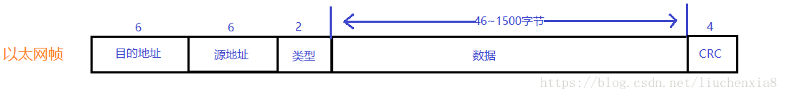

### 交换机的转发和过滤过程

- 表中没有目标MAC地址，向其他所有接口转发
- 表中有目标MAC地址，但是是源接口方向，丢弃
- 表中有目标MAC地址，且非源接口方向，转发

### 交换机的自学习性

- 交换机表初始为空
- 对于在每个接口接收到的每个入帧，交换机在表中存储
- 一段时间后，删除此地址

### 交换机、集线器、路由器
    
- 冲突域和广播域
  
    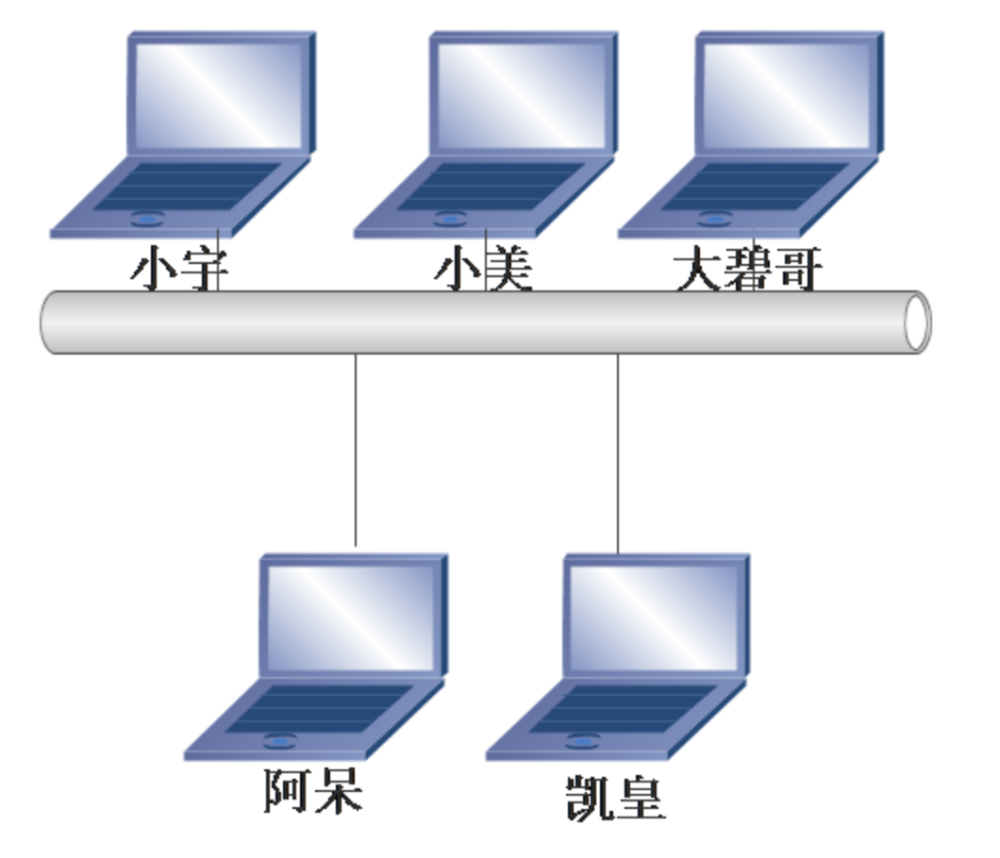
    
    我们把上图的以太网想象为走廊，各个主机想象为每个人的卧室。有一天，小宇想去找凯皇玩儿，同时大碧哥想去找阿呆玩儿，但是走廊（以太网通道）一次只能容纳一个人。于是小宇谦让的让大碧哥先去，等到大碧哥进入了阿呆的房间，小宇再出发去找凯皇。 通道只能过一个人，小宇和大碧哥在通道里不期而遇这就是冲突

    冲突域：连接在同一导线上的所有工作站的集合，或者说是同一物理网段上所有节点的集合或以太网上竞争同一带宽的节点集合。这个域代表了冲突在其中发生并传播的区域。在OSI模型中，冲突域被看作是第一层的概念，连接同一冲突域的设备有Hub，Reperter或者其他进行简单复制信号的设备。也就是说，用Hub（集线器）或者Repeater（中继器）连接的所有节点可以被认为是在同一个冲突域内，它不会划分冲突域。而第二层设备（网桥，交换机）第三层设备（路由器）都可以划分冲突域的，当然也可以连接不同的冲突域。简单的说，可以将Repeater等看成是一根电缆，而将网桥等看成是一束电缆。

    广播域：接收同样广播消息的节点的集合。

- 集线器
    
    集线器(hub)是一种物理层设备，它处理比特而不是帧。当表示一个 0 或一个 1 的比特 到达一个接口时，集线器只是广播这个比特，将该比特向其他所有接口传输出去。因此，具有星型拓扑的集线器以太网是一个广播 LAN。
    
    集线器最大的特点就是采用共享型模式，就是指在有一个端口在向另一个端口发送数据时，其他端口就处于“等待”状态。为什么会“等待”呢？举个例子来说，其实在单位时间内A向B发送数据包时，A是发送给B、C、D三个端口的（该现象即紧接下文介绍的IP广播），但是只有B接收，其他的端口在第一单位时间判断不是自己需要的数据后将不会再去接收A发送来的数据。直到A再次发送IP广播，在A再次发送IP广播之前的单位时间内，C，D是闲置的，或者CD之间可以传输数据。如图1，我们可以理解为集线器内部只有一条通道（即公共通道），然后在公共通道下方就连接着所有端口。
    
- 交换机

    我们使用hub连接局域网的时候，如果局域网内的主机高达上千台，那么会变得冲突域就会很大，很容易造成网络的堵塞。所以就有人设想能不能找个设备来阻断这个大的冲突域，将其划分为各个小的冲突域。这样就能优化网络性能了。
    
    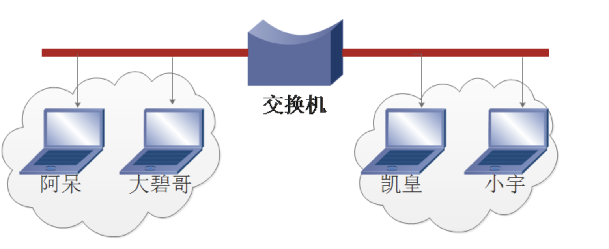
    
    我们把上图左边的网段成为网段A（包含阿呆和大碧哥），右边的网段成为网段B(包含凯皇和小宇)。 

    - 网段A的主机阿呆想要给大碧哥发消息，交换机不会转发这个MAC帧，因为他识别到了这是网段A内部之间的通信。同理，网段B凯皇发给小宇也是一样的。也就是说，我们利用交换机将一个冲突域划分为两个冲突域，并且这两个冲突域共享自己的总信道带宽。
    - 如果主机阿呆发送了一个目标是所有主机的广播类型数据包时，交换机要转发这样的数据包。交换机两侧的两个网段总线上的所有主机都要接收该广播数据包。因此，网段A和网段B仍属于同一个广播域。 
简单来说，也就是使用交换机切割了冲突域，没有切割广播域。

- 路由器(route)

    工作在OSI第三层(网络层)上、并且有连接不同类型网络的能力并能够选择数据传送路径的网络设备。
    
    路由器工作在网络层，可以识别网络层的地址-IP地址，有能力过滤第3层的广播消息。实际上，除非做特殊配置，否则路由器从不转发广播类型的数据包。因此，路由器的每个端口所连接的网络都独自构成一个广播域。 
    
    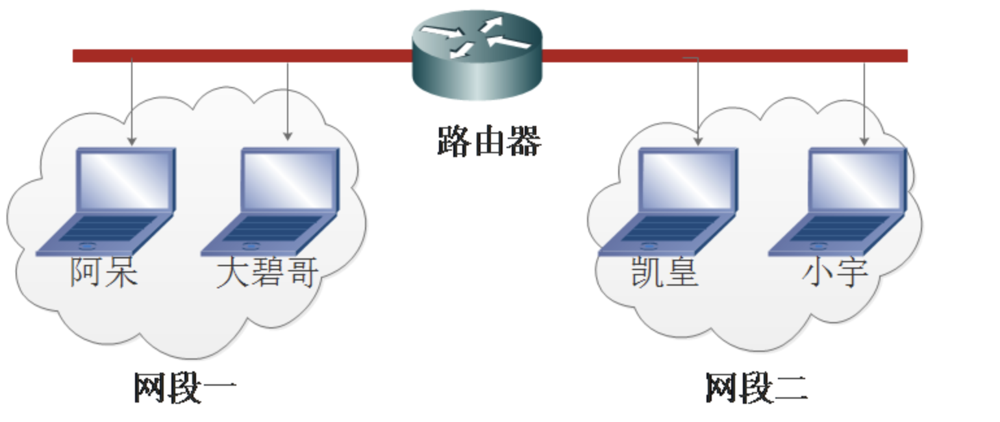
    
    图中是用路由器连接了网段一和网段二，路由器的每个端口所连接的网络都独自构成一个广播域。所以我们可以知道路由器切分了冲突域和广播域。
    
- 三者的异同

	1. 工作层次不同
	路由器工作在网络层（第三层）
	交换机一般工作在数据链路层（第二层）
	集线器一般工作在物理层（第一层）
	
	2. 数据转发依据对象不同
	交换机是利用物理地址或者说MAC地址来确定转发数据的目的地址。MAC地址通常是硬件自带的，由网卡生产商来分配的，而且已经固化到了网卡中去，一般来说是不可更改的。
	路由器则是利用不同网络的IP地址来确定数据转发的地址。IP地址是在软件中实现的，描述的是设备所在的网络，有时这些第三层的地址也称为协议地址或者网络地址。
	
	3. 分割冲突域，广播域
	集线器既不能分割冲突域也不能分割广播域，它就像一根接口比较多的网线一样。
	交换机只能分割冲突域不能分割广播域。交换机连接的网段仍属于同一个广播域，广播数据包会在交换机连接的所有网段上传播，在某些情况会导致通信拥堵和安全漏洞。
	路由器既分割了冲突域又分割了广播域。连接到路由器上的网段会被分配成不同的广播域，广播数据不会穿过路由器。
	
	4. 防火墙功能
	路由器利用自己强大的功能可以实现流量控制和上网功能控制而交换机和集线器没有防火墙这么强大的功能。

### VLAN

### 什么是VLAN

VLAN(Virtual LAN)，翻译成中文是“虚拟局域网”。LAN可以是由少数几台家用计算机构成的网络，也可以是数以百计的计算机构成的企业网络。VLAN所指的LAN特指使用路由器分割的网络——也就是广播域。

那么，为什么需要分割广播域呢?那是因为，如果仅有一个广播域，有可能会影响到网络整体的传输性能。

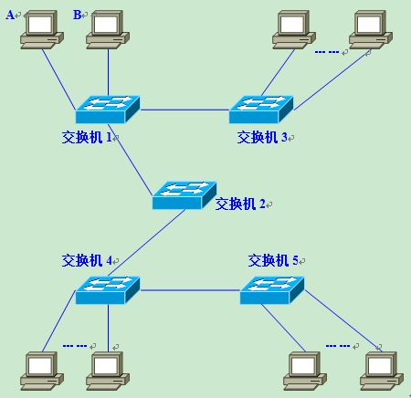

图中，是一个由5台二层交换机(交换机1～5)连接了大量客户机构成的网络。假设这时，计算机A需要与计算机B通信。在基于以太网的通信中，必须在数据帧中指定目标MAC地址才能正常通信，因此计算机A必须先广播“ARP请求(ARP Request)信息”，来尝试获取计算机B的MAC地址。

交换机1收到广播帧(ARP请求)后，会将它转发给除接收端口外的其他所有端口，也就是Flooding了。接着，交换机2收到广播帧后也会Flooding。交换机3、4、5也还会Flooding。最终ARP请求会被转发到同一网络中的所有客户机上。

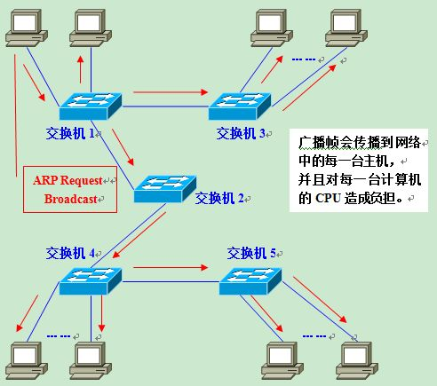

请大家注意一下，这个ARP请求原本是为了获得计算机B的MAC地址而发出的。也就是说：只要计算机B能收到就万事大吉了。可是事实上，数据帧却传遍整个网络，导致所有的计算机都收到了它。如此一来，一方面广播信息消耗了网络整体的带宽，另一方面，收到广播信息的计算机还要消耗一部分CPU时间来对它进行处理。造成了网络带宽和CPU运算能力的大量无谓消耗。

分割广播域时，一般都必须使用到路由器。使用路由器后，可以以路由器上的网络接口(LAN Interface)为单位分割广播域。

但是，通常情况下路由器上不会有太多的网络接口，其数目多在1～4个左右。随着宽带连接的普及，宽带路由器(或者叫IP共享器)变得较为常见，但是需要注意的是，它们上面虽然带着多个(一般为4个左右)连接LAN一侧的网络接口，但那实际上是路由器内置的交换机，并不能分割广播域。

况且使用路由器分割广播域的话，所能分割的个数完全取决于路由器的网络接口个数，使得用户无法自由地根据实际需要分割广播域。

与路由器相比，二层交换机一般带有多个网络接口。因此如果能使用它分割广播域，那么无疑运用上的灵活性会大大提高。

用于在二层交换机上分割广播域的技术，就是VLAN。通过利用VLAN，我们可以自由设计广播域的构成，提高网络设计的自由度。

#### 实现VLAN的机制

首先，在一台未设置任何VLAN的二层交换机上，任何广播帧都会被转发给除接收端口外的所有其他端口(Flooding)。例如，计算机A发送广播信息后，会被转发给端口2、3、4。

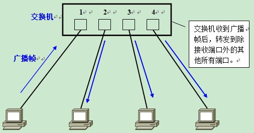

这时，如果在交换机上生成红、蓝两个VLAN;同时设置端口1、2属于红色VLAN、端口3、4属于蓝色VLAN。再从A发出广播帧的话，交换机就只会把它转发给同属于一个VLAN的其他端口——也就是同属于红色VLAN的端口2，不会再转发给属于蓝色VLAN的端口。

同样，C发送广播信息时，只会被转发给其他属于蓝色VLAN的端口，不会被转发给属于红色VLAN的端口。

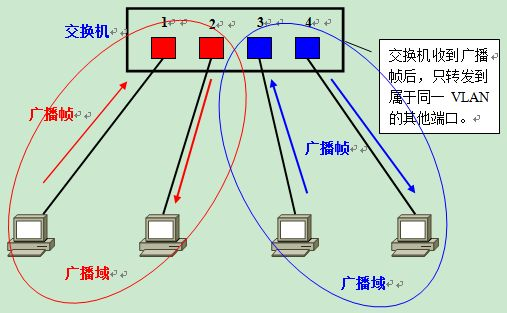

就这样，VLAN通过限制广播帧转发的范围分割了广播域。上图中为了便于说明，以红、蓝两色识别不同的VLAN，在实际使用中则是用“VLAN ID”来区分的。

#### VLAN的链接接口

交换机的端口，可以分为以下两种：

- 访问链接

    访问链接，指的是“只属于一个VLAN，且仅向该VLAN转发数据帧”的端口。在大多数情况下，访问链接所连的是客户机。
    
    设定访问链接的手法，可以是事先固定的、也可以是根据所连的计算机而动态改变设定。前者被称为“静态VLAN”、后者自然就是“动态VLAN”了。
    
    - 静态VLAN又被称为基于端口的VLAN(PortBased VLAN)。顾名思义，就是明确指定各端口属于哪个VLAN的设定方法。
    
    - 动态VLAN则是根据每个端口所连的计算机，随时改变端口所属的VLAN。这就可以避免上述的更改设定之类的操作。动态VLAN可以大致分为3类：(1)基于MAC地址的VLAN(MAC Based VLAN) (2)基于子网的VLAN(Subnet Based VLAN) (3)基于用户的VLAN(User Based VLAN)

- VLAN 的汇聚链接(Trunk Link)

    到此为止，我们学习的都是使用单台交换机设置VLAN时的情况。那么，如果需要设置跨越多台交换机的VLAN时又如何呢?

    在规划企业级网络时，很有可能会遇到隶属于同一部门的用户分散在同一座建筑物中的不同楼层的情况，这时可能就需要考虑到如何跨越多台交换机设置VLAN的问题了。假设有如下图所示的网络，且需要将不同楼层的A、C和B、D设置为同一个VLAN。

    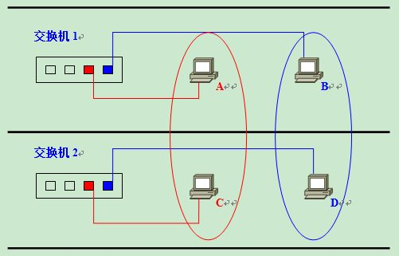
    
    这时最关键的就是“交换机1和交换机2该如何连接才好呢?”

    最简单的方法，自然是在交换机1和交换机2上各设一个红、蓝VLAN专用的接口并互联了。
    
    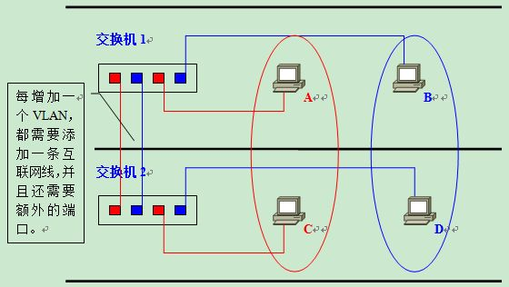
    
    但是，这个办法从扩展性和管理效率来看都不好。例如，在现有网络基础上再新建VLAN时，为了让这个VLAN能够互通，就需要在交换机间连接新的网线。建筑物楼层间的纵向布线是比较麻烦的，一般不能由基层管理人员随意进行。并且，VLAN越多，楼层间(严格地说是交换机间)互联所需的端口也越来越多，交换机端口的利用效率低是对资源的一种浪费、也限制了网络的扩展。

    为了避免这种低效率的连接方式，人们想办法让交换机间互联的网线集中到一根上，这时使用的就是汇聚链接(Trunk Link)。
    
    汇聚链接(Trunk Link)指的是能够转发多个不同VLAN的通信的端口。

    汇聚链路上流通的数据帧，都被附加了用于识别分属于哪个VLAN的特殊信息。
    
    
    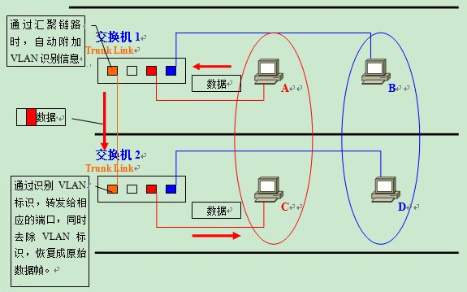
    
    接下来，让我们具体看看汇聚链接是如何实现跨越交换机间的VLAN的。

    A发送的数据帧从交换机1经过汇聚链路到达交换机2时，在数据帧上附加了表示属于红色VLAN的标记。

    交换机2收到数据帧后，经过检查VLAN标识发现这个数据帧是属于红色VLAN的，因此去除标记后根据需要将复原的数据帧只转发给其他属于红色VLAN的端口。这时的转送，是指经过确认目标MAC地址并与MAC地址列表比对后只转发给目标MAC地址所连的端口。只有当数据帧是一个广播帧、多播帧或是目标不明的帧时，它才会被转发到所有属于红色VLAN的端口。

    蓝色VLAN发送数据帧时的情形也与此相同。

#### 需要VLAN间通信时怎么办

但是，VLAN生成的逻辑上的交换机是互不相通的。因此，在交换机上设置VLAN后，如果未做其他处理，VLAN间是无法通信的。

明明接在同一台交换机上，但却偏偏无法通信——这个事实也许让人难以接受。但它既是VLAN方便易用的特征，又是使VLAN令人难以理解的原因。

请大家再次回忆一下：VLAN是广播域。而通常两个广播域之间由路由器连接，广播域之间来往的数据包都是由路由器中继的。因此，VLAN间的通信也需要路由器提供中继服务，这被称作“VLAN间路由”。

路由功能，一般主要由路由器提供。但在今天的局域网里，我们也经常利用带有路由功能的交换机——三层交换机(Layer 3 Switch)来实现。接下来就让我们分别看看使用路由器和三层交换机进行VLAN间路由时的情况。

- 使用路由器进行VLAN间路由

    在使用路由器进行VLAN间路由时，与构建横跨多台交换机的VLAN时的情况类似，我们还是会遇到“该如何连接路由器与交换机”这个问题。路由器和交换机的接线方式，大致有以下两种：

    (1)将路由器与交换机上的每个VLAN分别连接

    (2)不论VLAN有多少个，路由器与交换机都只用一条网线连接

    最容易想到的，当然还是“把路由器和交换机以VLAN为单位分别用网线连接”了。将交换机上用于和路由器互联的每个端口设为访问链接(Access Link)，然后分别用网线与路由器上的独立端口互联。如下图所示，交换机上有2个VLAN，那么就需要在交换机上预留2个端口用于与路由器互联;路由器上同样需要有2个端口;两者之间用2条网线分别连接。
    
    如果采用这个办法，大家应该不难想象它的扩展性很成问题。每增加一个新的VLAN，都需要消耗路由器的端口和交换机上的访问链接，而且还需要重新布设一条网线。而路由器，通常不会带有太多LAN接口的。新建VLAN时，为了对应增加的VLAN所需的端口，就必须将路由器升级成带有多个LAN接口的高端产品，这部分成本、还有重新布线所带来的开销，都使得这种接线法成为一种不受欢迎的办法。

    那么，第二种办法“不论VLAN数目多少，都只用一条网线连接路由器与交换机”呢?当使用一条网线连接路由器与交换机、进行VLAN间路由时，需要用到汇聚链接。
    
    具体实现过程为：首先将用于连接路由器的交换机端口设为汇聚链接(Trunk Link)，而路由器上的端口也必须支持汇聚链路。双方用于汇聚链路的协议自然也必须相同。接着在路由器上定义对应各个VLAN的“子接口”(Sub Interface)。尽管实际与交换机连接的物理端口只有一个，但在理论上我们可以把它分割为多个虚拟端口。

    VLAN将交换机从逻辑上分割成了多台，因而用于VLAN间路由的路由器，也必须拥有分别对应各个VLAN的虚拟接口。
    
    采用这种方法的话，即使之后在交换机上新建VLAN，仍只需要一条网线连接交换机和路由器。用户只需要在路由器上新设一个对应新VLAN的子接口就可以了。与前面的方法相比，扩展性要强得多，也不用担心需要升级LAN接口数不足的路由器或是重新布线。

    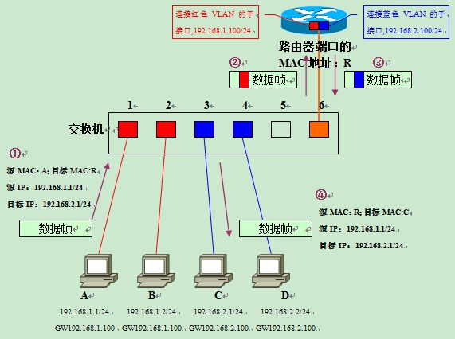
    
    接下来是这一讲的核心内容，不同VLAN间的通信。让我们来考虑一下计算机A与计算机C之间通信时的情况。
    
    计算机A从通信目标的IP地址(192.168.2.1)得出C与本机不属于同一个网段。因此会向设定的默认网关(DefaultGateway，GW)转发数据帧。在发送数据帧之前，需要先用ARP获取路由器的MAC地址。

    得到路由器的MAC地址R后，接下来就是按图中所示的步骤发送往C去的数据帧。①的数据帧中，目标MAC地址是路由器的地址R、但内含的目标IP地址仍是最终要通信的对象C的地址。这一部分的内容，涉及到局域网内经过路由器转发时的通信步骤，有机会再详细解说吧。

    交换机在端口1上收到①的数据帧后，检索MAC地址列表中与端口1同属一个VLAN的表项。由于汇聚链路会被看作属于所有的VLAN，因此这时交换机的端口6也属于被参照对象。这样交换机就知道往MAC地址R发送数据帧，需要经过端口6转发。

    从端口6发送数据帧时，由于它是汇聚链接，因此会被附加上VLAN识别信息。由于原先是来自红色VLAN的数据帧，因此如图中②所示，会被加上红色VLAN的识别信息后进入汇聚链路。路由器收到②的数据帧后，确认其VLAN识别信息，由于它是属于红色VLAN的数据帧，因此交由负责红色VLAN的子接口接收。

    接着，根据路由器内部的路由表，判断该向哪里中继。

    由于目标网络192.168.2.0/24是蓝色VLAN，，且该网络通过子接口与路由器直连，因此只要从负责蓝色VLAN的子接口转发就可以了。这时，数据帧的目标MAC地址被改写成计算机C的目标地址;并且由于需要经过汇聚链路转发，因此被附加了属于蓝色VLAN的识别信息。这就是图中③的数据帧。
    
    交换机收到③的数据帧后，根据VLAN标识信息从MAC地址列表中检索属于蓝色VLAN的表项。由于通信目标——计算机C连接在端口3上、且端口3为普通的访问链接，因此交换机会将数据帧去除VLAN识别信息后(数据帧④)转发给端口3，最终计算机C才能成功地收到这个数据帧。

    进行VLAN间通信时，即使通信双方都连接在同一台交换机上，也必须经过：“发送方——交换机——路由器——交换机——接收方”这样一个流程。
    
- 三层交换机

    现在，我们知道只要能提供VLAN间路由，就能够使分属不同VLAN的计算机互相通信。但是，如果使用路由器进行VLAN间路由的话，随着VLAN之间流量的不断增加，很可能导致路由器成为整个网络的瓶颈。
    
    交换机使用被称为ASIC(ApplicationSpecified Integrated Circuit)的专用硬件芯片处理数据帧的交换操作，在很多机型上都能实现以缆线速度(Wired Speed)交换。而路由器，则基本上是基于软件处理的。即使以缆线速度接收到数据包，也无法在不限速的条件下转发出去，因此会成为速度瓶颈。就VLAN间路由而言，流量会集中到路由器和交换机互联的汇聚链路部分，这一部分尤其特别容易成为速度瓶颈。并且从硬件上看，由于需要分别设置路由器和交换机，在一些空间狭小的环境里可能连设置的场所都成问题。
    
    为了解决上述问题，三层交换机应运而生。三层交换机，本质上就是“带有路由功能的(二层)交换机”。路由属于OSI参照模型中第三层网络层的功能，因此带有第三层路由功能的交换机才被称为“三层交换机”。

    关于三层交换机的内部结构，可以参照下面的简图。

    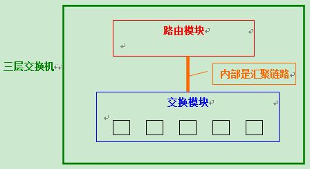
    
    在一台本体内，分别设置了交换机模块和路由器模块;而内置的路由模块与交换模块相同，使用ASIC硬件处理路由。因此，与传统的路由器相比，可以实现高速路由。并且，路由与交换模块是汇聚链接的，由于是内部连接，可以确保相当大的带宽。
    
    在三层交换机内部数据究竟是怎样传播的呢?基本上，它和使用汇聚链路连接路由器与交换机时的情形相同。

    假设有如下图所示的4台计算机与三层交换机互联。当使用路由器连接时，一般需要在LAN接口上设置对应各VLAN的子接口;而三层交换机则是在内部生成“VLAN接口”(VLAN Interface)。VLAN接口，是用于各VLAN收发数据的接口。
    
    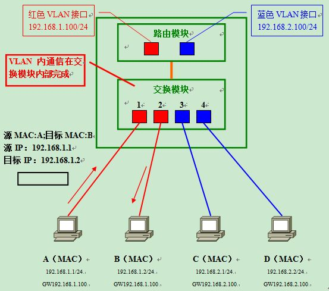
    
    接下来设想一下计算机A与计算机C间通信时的情形。针对目标IP地址，计算机A可以判断出通信对象不属于同一个网络，因此向默认网关发送数据(Frame 1)。

    交换机通过检索MAC地址列表后，经由内部汇聚链接，将数据帧转发给路由模块。在通过内部汇聚链路时，数据帧被附加了属于红色VLAN的VLAN识别信息(Frame 2)。

    路由模块在收到数据帧时，先由数据帧附加的VLAN识别信息分辨出它属于红色VLAN，据此判断由红色VLAN接口负责接收并进行路由处理。因为目标网络192.168.2.0/24是直连路由器的网络、且对应蓝色VLAN;因此，接下来就会从蓝色VLAN接口经由内部汇聚链路转发回交换模块。在通过汇聚链路时，这次数据帧被附加上属于蓝色VLAN的识别信息(Frame 3)。

    交换机收到这个帧后，检索蓝色VLAN的MAC地址列表，确认需要将它转发给端口3。由于端口3是通常的访问链接，因此转发前会先将VLAN识别信息去除(Frame 4)。最终，计算机C成功地收到交换机转发来的数据帧。

### 多路访问协议

有两种类型的网络链路:点对点链路和广播链路。 点对点链路是由链路一端的单个发送方和另一端的单个接收方组成。 广播链路能够让多个发送和接收节点都连接到相同的、单一的、共享的广播信道上。

点对点链路的协议最著名的是 PPP 协议，广播链路协议最出名的是以太网协议。

其中多路访问协议的划分类型如下：

- 信道划分协议
	- 时分多路复用(TDM)：时间上共享广播信道
	- 频分多路复用(FDM) ：将 Rbps 信道划分为不同的频段，在频率上共享信道
	- 码分复用(CDMA)：对每个节点分配一种不同的编码。然后每个节点用不同的编码方式来 对它发送的数据进行编码。如果精心选择这些编码，不同的节点能够同时传输，并且它们各 自的接收方仍然正确接收发送方编码后的数据 (假设接收方知道发送方的编码)，而不怕其 他节点的干扰传输。
- 随机接入协议
	
	在随机接入协议中，一个传输节点总是以信道的全部速率进行发送。当有碰撞时，涉及 碰撞的每个节点反复地重发它的帧，直到该帧顺利发送为止。但是当一个节点经受一次碰撞 时，它不会立刻重发该帧。相反，它在等待一个随机时延后重发该帧。涉及碰撞的每个节点 独立地选择时延。因为该时延是独立选择的，最终能够无碰撞地将它的数据在信道中发出。
	- 时隙 ALOHA
	- 纯 ALOHA
	- CSMA/CD(Carrier Sense Multiple Access with Collision Detection)

    >
	其中CSMA/CD采用：
	>
	发送前侦听信道。在网络中，这被称为载波侦听，即一个节点在传输前先听信道。如果 来自另一个节点的帧正向信道上发送，节点则等待(“后退”)一段随机时间，然后再侦听信 道。如果侦听到该信道是空闲的，该节点则开始帧传输。否则，该节点等待另一段随机时间， 继续重复这个过程。
    >
    如果与他人同时开始发送，则停止发送。在网络中，这被称为碰撞检测, 即一个传输节 点在传输时一直在侦听信道。如果它检测到另一个节点正在传输干扰帧，它就停止传输，用 指数回退算法来确定它应该在什么时候再尝试下一次传输。
    >
    以太网用了 CSMA/CD 技术，但是现在大家都用以太网交换机，交换机消除了冲突
- 轮流协议
    - 轮询协议。轮询协议要求这些节点之一要被指定为主节点。主节点以循环的方 式轮询每个节点, 主节点首先向节点 1 发送一个报文，告诉它(节点 1)能够发送的最大帧数。 在节点 2 传输了某些帧后，主节点告诉节点 2 能够传输的最大帧数。缺点是引人了轮询时延;如果主节点有故障，整个信道会出现问题。
    - 令牌传递协议。在这种协议中没有主节点。一个称为令牌(token)的帧在节点之 间以某种固定的次序进行交换。当一个节点收到令牌时，当它有一些帧要发送时，它才持有 这个令牌。否则，它立即向下一个节点转发该令牌。令牌传递协议是一种已经废弃的技术。缺点是节点的故障可能会使整个信道崩溃。