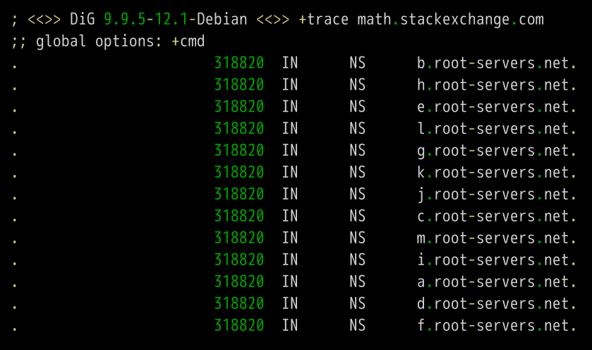
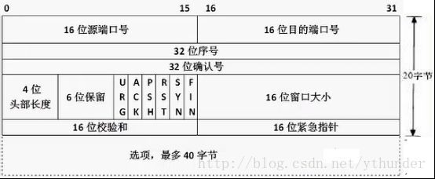
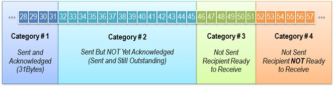
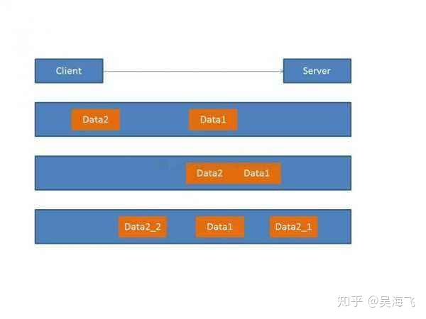

# 网络原理

[TOC]

## 概论

### 因特网的协议栈层次

- 应用层: 网络应用程序及其应用层协议留存的地方（报文）
- 运输层: 提供应用层端点之间传送应用层报文的服务(TCP/UDP)（报文段）
- 网络层: 将数据报的网络层分组从一台主机移动到另一台主机(IP协议族)（数据报）
- 链路层: 将帧从一个网络元素移动到临近的网络元素,数据报从源到目的地,经过不同链路上不同链路层协议处理, 提供的服务取决于应用于该链路的特定链路层协议.(以太网/WiFi/PPP)（帧）
- 物理层: 将帧一个一个比特从一个节点移动到下一个节点
- 表示层：对数据进行翻译、加密和压缩
- 会话层：建立、管理和终止会话

### TCP/IP分层（4层）

网络接口层、 网际层、运输层、 应用层。

### 电路交换和分组交换

数据通过网络有两种基本方式:电路交换和分组交换。在电路交换网络中，沿着通信路径，为端系统之间通信所提供的资源(缓存、传输速率) 在通信会话期间会被预留，传统的电话网络是电路交换网络的例子。
在分组交换网络中，则没有预留带宽等通信资源，数据分组按需使用这些资源。 Internet 是分组交换网络。

- 电路交换

    电路交换网络中，当两台主机要通信时，网络在两台主机之间创建一条专用的端到端 连接，这个过程需要专门的信令协议(Signalling Protocol)。由于预留了资源，用户通话过程 中能够达到电路级性能。

- 电路交换网络中的多路复用

    电路交换中的链路通过频分多路复用或者时分多路复用实现带宽在多个用户之间分配。

    FDMA(Frequency Division Multiple Access)链路在连接期间为每条连接分配一个专用频 段。

    TDMA(Time Division Multiple Access)链路中时间被划分为固定区间的帧，并且每帧又被 划分为固定数量的时隙。TDMA 链路在每个帧中为一个连接指定一个时隙。
    
- 分组交换

    在计算机网络中，源主机将长报文划分为较小的数据块，称为分组。在源和目的地之间， 这些分组通过通信链路和分组交换机传送。    
    
    端系统通过通信链路和分组交换机连接到一起。 通信链路的物理介质主要包括同轴电缆、双绞线、光纤和无线电。
    
    分组交换机从输入端口接收到达的分组，并从它的输出端口转发该分组。路由器和链路层交换机是最常见的两种分组交换机。
    多数分组交换机使用存储转发传输机制。存储转发传输机制是指在交换机能够开始向 输出链路传输该分组的第一个比特之前，必须接收到整个分组。对于每条相连的链路，该分 组交换机具有一个输出缓存，它用于存储路由器准备发往那条链路的分组。
    
- 分组交换与电路交换比较

    分组交换是统计多路复用。 电路交换中如果用户没有通信，已分配频率或时间会被浪费。 由于一个特定用户一般不会持续处于活跃状态，因此分组交换可以通过同时转发多个用户的数据而最大化通信链路的传输性能，表现出优于电路交换的性能。这时链路传输能力将 在所有需要传输分组的用户中，以分组为单位进行分配。这种按需(而不是预分配)共享资源的方式被称为统计多路复用。

### 分组交换网中的时延

- 节点处理时延

    检查分组首部、检查分组比特级差错和决定将该分组发到何处所需要的时间是处理时延。 处理时延取决于路由器处理能力。高速路由器的处理时延通常是微秒或更低的数至级。
    
- 排队时延

    分组中输出端口队列中，等待传输时，它经厉排队时延。 一个分组的排队时延将取决于队列的长度，或者说取决于网络中的流量。实际的排队时延通常在毫秒到微秒级。
    
- 传输时延

    将分组传送到链路需要的时间。传输时延等于分组长度除以链路传输速率(网卡工作速率)。实际的传输时延通常在毫秒 到微秒级。
    
- 传播时延

    分组的一个比特从该链路的起点到终点所需要的时间是传播时延。 传播时延等于两台路由器之间的距离除以传播速率。在广域网中传播时延在毫秒的量级。
    

### ISP

（Internet Service Provider）就是因特网服务提供者的英文缩写。
    
- IXP

    (Internet eXchange Point,互联网交换点)就是这样一个方案，相当于在地区ISP之间直接相连进行交换分组，不需要走主干ISP。
    
    
    


### 网络类型


### 网络拓扑类型


    
    
    
## 应用层

### 套接字

同一台主机内应用层和运输层的接口，套接字需要客户端地址（由操作系统提供） 、客户端端口号（由操作系统提供）、服务器端地址、服务器端口号（套接字编程提供）

### RTT

指一个短分组从客户到服务器再返还客户所化的时间

### HTTP报文内容

- 状态行：版本/状态/状态信息（200-301-400-404-505）
- 请求行：方法字段（GET-POST-HEAD-PUT-DELETE）/URL/版本
- 首部行
- 实体体

### Get和POST的区别

- 根据HTTP规范，GET用于信息获取，而且应该是安全的和幂等的。
- 根据HTTP规范，POST表示可能修改变服务器上的资源的请求。
- GET请求的数据会附在URL之后
- GET方式提交的数据最多只能是1024字节，理论上POST没有限制，可传较大量的数据
- POST的安全性要比GET的安全性高

### DNS 提供的服务

- 解析 IP 地址
- 主机别名：主机别名比主机规范名更容易记忆，例如http://www.mit.edu，其真实的服务器名字(主机规范名)并不是http://www.mit.edu
- 邮件服务器别名：电子邮件应用程序可以调用 DNS，对提供的邮件服务别名进行解析，以获得该主机的规范主机名及其 IP。事实上，MX 记录允许一个公司的邮件服务器和 WEB 服务器拥有相同的主机名，例如一个公司的 WEB 服务器和邮件服务器都能叫做 ENTERPRISE.COM
- 负载均衡：一个IP地址集合对应于同一个规范主机名。DNS数据库中存储着这些IP地址集合。当客户机为映射到这个IP地址集合的名字发出一个DNS请求时，该服务器用包含全部这些地址的消息进行回答，但在每个回答中轮回这些地址排放的顺序。

### 域名的层级

DNS服务器怎么会知道每个域名的IP地址呢？答案是分级查询。

请仔细看前面的例子，每个域名的尾部都多了一个点。

比如，域名math.stackexchange.com显示为math.stackexchange.com.。这不是疏忽，而是所有域名的尾部，实际上都有一个根域名。

举例来说，www.example.com真正的域名是www.example.com.root，简写为www.example.com.。因为，根域名.root对于所有域名都是一样的，所以平时是省略的。

根域名的下一级，叫做"顶级域名"（top-level domain，缩写为TLD），比如.com、.net；再下一级叫做"次级域名"（second-level domain，缩写为SLD），比如www.example.com里面的.example，这一级域名是用户可以注册的；再下一级是主机名（host），比如www.example.com里面的www，又称为"三级域名"，这是用户在自己的域里面为服务器分配的名称，是用户可以任意分配的。

总结一下，域名的层级结构如下。

```
主机名.次级域名.顶级域名.根域名

# 即

host.sld.tld.root

```

### DNS服务器类型

- 根ONS服务器。在因特网上有13个根DNS服务器(标号为A到M)，其中大部分位于北美洲。
- 顶级域(TLD)服务器。这些服务器负责顶级域名(如COM,ORG,GOV和所有国家的顶级域名(如CN)。
- 权威DNS服务器。将主机的名字映射为IP地址，由一个单位的权威DNS服务器负责保存这些记录。另一种方法是支付费用将这些记录存储在某个ISP的权威DNS服务器中。
- 本地DNS服务器。严格来说并不属于DNS服务器的层次结构，本地DNS服务器通常与主机相隔不超过几个路由器。当主机发出DNS请求时，该请求被发往本地DNS服务器，它起着代理的作用，并将域名简析请求转发到DNS服务器层次结构中。

### DNS 查询原理

假定一个DNS客户机要确定主机名http://www.mit.edu的 IP 地址。

- 域名查询主机的 DNSClient 向本地域名服务器发起一个查询，当主机与某个 ISP 连接时，该 ISP 会提供本地 DNS 服务器的IP地址。这一步是递归查询，因为本地 DNS 服务器没有立即返回，而是自己作为客户端和其他 DNS 服务器沟通。

- 本地域名服务器首先获取 url 最后一个域名 .root, 因而开始与根服务器之一联系。根服务器根据域名倒数第二个地址 edu, 取得顶级域名 edu 的 TLD 服务器的 IP 地址。这一步是迭代查询，因为根服务器立刻向本地 DNS 服务器返回了结果。

- 本地域名服务器然后与这些 TLD 服务器之一联系，顶级域 DNS 服务器获取了倒数第三地址 mid，取得 http://mit.edu 权威服务器的 IP 地址。这一步仍然为迭代查询。

- 本地域名服务器为联系权威服务器，权威 DNS 服务器根据 www，返回 www 主机的 IP 地址。

- 最后，本地域名服务器将结果返还给 DNSClient，操作系统将结果作为函数调用返回值给应用程序。

### DNS 报文

- A：地址记录（Address），返回域名指向的IP地址。
- NS：域名服务器记录（Name Server），返回保存下一级域名信息的服务器地址。该记录只能设置为域名，不能设置为IP地址。
- MX：邮件记录（Mail eXchange），返回接收电子邮件的服务器地址。
- CNAME：规范名称记录（Canonical Name），返回另一个域名，即当前查询的域名是另一个域名的跳转，详见下文。
- PTR：逆向查询记录（Pointer Record），只用于从IP地址查询域名，详见下文。

### DNS 查询实例

dig命令的+trace参数可以显示DNS的整个分级查询过程。

```
 dig +trace math.stackexchange.com

```

上面命令的第一段列出根域名.的所有NS记录，即所有根域名服务器。




根据内置的根域名服务器IP地址，DNS服务器向所有这些IP地址发出查询请求，询问 math.stackexchange.com 的顶级域名服务器 com. 的 NS 记录。最先回复的根域名服务器将被缓存，以后只向这台服务器发请求。

值得注意的是 NS 记录的仍然是域名，是顶级域的域名，并没有真正的 IP 地址。这些顶级域域名的 IP 是存放在 A 记录里面的。

也正是因为这个，添加 DNS 服务器的时候，需要同时添加两条记录，NS 记录与 A 记录。

接着是第二段。


上面结果显示.com域名的13条NS记录，同时返回的还有每一条记录对应的IP地址。

```
;; ADDITIONAL SECTION:
i.gtld-servers.net.	51470	IN	A	192.43.172.30
i.gtld-servers.net.	51470	IN	AAAA	2001:503:39c1::30
l.gtld-servers.net.	51470	IN	A	192.41.162.30
l.gtld-servers.net.	51470	IN	AAAA	2001:500:d937::30
d.gtld-servers.net.	51470	IN	A	192.31.80.30
d.gtld-servers.net.	51470	IN	AAAA	2001:500:856e::30
b.gtld-servers.net.	51470	IN	A	192.33.14.30
b.gtld-servers.net.	51470	IN	AAAA	2001:503:231d::2:30
a.gtld-servers.net.	51470	IN	A	192.5.6.30
a.gtld-servers.net.	51470	IN	AAAA	2001:503:a83e::2:30
h.gtld-servers.net.	51470	IN	A	192.54.112.30
h.gtld-servers.net.	51470	IN	AAAA	2001:502:8cc::30

```

然后，DNS服务器向这些顶级域名服务器发出查询请求，询问math.stackexchange.com的次级域名stackexchange.com的NS记录。


上面结果显示stackexchange.com有四条NS记录，同时返回的还有每一条NS记录对应的IP地址。

然后，DNS服务器向上面这四台NS服务器查询math.stackexchange.com的主机名。


上面结果显示，math.stackexchange.com有4条A记录，即这四个IP地址都可以访问到网站。并且还显示，最先返回结果的NS服务器是ns-463.awsdns-57.com，IP地址为205.251.193.207。


### DNS缓存

为了改善时延性能并减少在因特网上传输的DNS消息数量，DNS广泛使用了缓存技术。DNS缓存的原理非常简单。在请求链中，当一个DNS服务器接收一个DNS回答时，服

务器能将回答中的信息缓存在本地存储器。

## 运输层

### 运输层协议提供哪些服务？

- 可靠数据传输。分组可能在计算机网络中丢失。确保应用程序一端发送的数据正确地、完全地交付给该应用程序的另一端。
- 吞吐量：有些应用例如网络电话对话音传输有最小的带宽要求，当话音以32kbps的速率进行编码，那么在通话过程中一直以这个速率向网络发送数据，并向接收应用程序交付数据。如果传输层不能提供这种吞吐量保证，那么该应用程序或以较低速率进行编码，或者放弃发送。而弹性应用能够根据需要充分利用可供使用的吞吐量。电子邮件、文件传输以及Web传输都属于弹性应用。
- 定时：因特网电话中较长的时延会导致会话中不自然的停顿。在网络游戏和虚拟互动环境中，在动作及响应之间较长的时延会使游戏失去真实感。在非实时的应用中，对端到端的时延没有严格的约束。
- 安全：能够为应用程序提供一种或多种安全性服务。


如果网络层无法提供时延或带宽保障，那运输层也无法保证。

即使网络层分组丢失、篡改和冗余，运输层可以提供数据可靠服务和安全服务


### UDP 和 TCP 的区别

- 可以提供的服务：UDP 只能提供数据交付和差错检查，而 TCP 可以提供数据交付、差错检查、可靠性数据交付、安全性、流量控制、拥塞控制
- TCP提供面向连接的，UDP提供的是非面向连接的
- TCP是一种流模式的协议，UDP是一种数据报模式的协议，TCP 传输单位称为 TCP 报文段，UDP 传输单位称为用户数据报，基于流的数据没有边界（长度）限制，而基于数据报的服务，每个 UDP 数据报都有一个长度，接收端必须以该长度为最小单位将其所有内容一次性读出。TCP 模块发出的 TCP 报文段的个数与应用程序执行的写操作次数是没有固定数量关系的。对于 UDP 连接，发送端写的次数据与读的次数是一致的，这也是基于数据报的服务的特点。
- 运行的协议：DNS/DHCP/TFTP

### UDP 的优点

立即发送、无需连接建立、无连接状态、分组首部开销小

### UDP 报文结构


### 数据流和数据报模式的区别

TCP和UDP都是传输层的协议，TCP协议的数据传输单位是报文段（segment），UDP协议的数据传输单位是用户数据报（datagram），上面应用层的数据单位是报文（message）

TCP的segment就是段的意思，也就是说TCP是把数据看成一连串字节流，当应用层传下来的报文（message）太长了，TCP是会把报文切片的，所以TCP的segment的意思是说：我的segment可能是报文（message）的某一段。UDP的单位是datagram，UDP拿到应用层传下来的报文，不会切分，应用层给UDP的数据多大，UDP不切分，加个首部就往下面的网络层传。

有人管IP协议的数据单位叫IP数据报（IP datagram)，其实叫分组（packet)更合适。IP协议跟TCP协议一样，也是面向数据流的（把数据看作一连串字节流）。如果网络层的IP协议拿到UDP传给自己的用户数据报（datagram），发现UDP给的报文太大了，就切分。切分后的东西叫IP分片（IP fragment）。

>
打个比方比喻TCP，你家里有个蓄水池，你可以里面倒水，蓄水池上有个龙头，你可以通过龙头将水池里的水放出来，然后用各种各样的容器装（杯子、矿泉水瓶、锅碗瓢盆）接水。上面的例子中，往水池里倒几次水和接几次水是没有必然联系的，也就是说你可以只倒一次水，然后分10次接完。另外，水池里的水接多少就会少多少；往里面倒多少水，就会增加多少水，但是不能超过水池的容量，多出的水会溢出。结合TCP的概念，水池就好比接收缓存，倒水就相当于发送数据，接水就相当于读取数据。好比你通过TCP连接给另一端发送数据，你只调用了一次write， 发送了100个字节，但是对方可以分10次收完，每次10个字节；你也可以调用10次write，每次10个字节，但是对方可以一次就收完。（假设数据都 能到达）但是，你发送的数据量不能大于对方的接收缓存（流量控制），如果你硬是要发送过量数据，则对方的缓存满了就会把多出的数据丢弃。

>
UDP 和TCP不同，发送端调用了几次write，接收端必须用相同次数的read读完。UPD是基于报文的，在接收的时候，每次最多只能读取一个报文，报文和 报文是不会合并的，如果缓冲区小于报文长度，则多出的部分会被丢弃。也就说，如果不指定MSG_PEEK标志，每次读取操作将消耗一个报文。

>
其实，这种不同是由TCP和UDP的特性决定的。TCP是面向连接的，也就是说，在连接持续的过程中，socket中收到的数据都是由同一台主机发出的（劫持什么的不考虑），因此，知道保证数据是有序的到达就行了，至于每次读取多少数据自己看着办。而 

>
UDP是无连接的协议，也就是说，只要知道接收端的IP和端口，且网络是可达的，任何主机都可以向接收端发送数据。这时候，如果一次能读取超过一个报文的 数据，则会乱套。比如，主机A向发送了报文P1，主机B发送了报文P2，如果能够读取超过一个报文的数据，那么就会将P1和P2的数据合并在了一起，这样 的数据是没有意义的。

>


### TCP 报文结构



- 窗口大小：16位字段，这个字段定义的是发送TCP的窗口大小，以字节为单位。窗口最大长度是65535字节，这个值通常被称为接收窗口（rwnd）,并由接收方来决定。这种情况下，发送方必须服从接收方的指示。
- 该字段占用2字节，与URG代码位一起使用并且申明及时使存在着缓冲区溢出也必须紧急接收的数据末端。因此，如果有些数据需要不按照顺序被送往目的应用程序，那么发送端的应用程序必须利用紧急数据参数通知TCP。
- URG 紧急数据（urgent data）---这是一条紧急信息
- ACK 确认已收到段
- PSH 请求在缓冲区尚未填满时发送消息，注意TCP可以等待缓冲区填满之后再发送段，如果需要立即传送，应用程序必须利用push参数来通知协议。
- RST 申请重置连接
- SYN 此消息用于在建立连接时同步传输数据的计时器。
- FIN 该属性申明发送端已经发送出被传输数据的最后一个字节。

### TCP 可靠性数据传输原理

- 最大允许数N（窗口长度）/基序号SF/下一个序号SN/接受基序号RF/接受下一个序号RN累计确认
- 发送方：
    - 上层调用：窗口是否满（SN = SF + N）/启动定时器
    - 超时事件：重传引起超时的一个分组/重启定时器
    - 收到ACK（SF<ACK<=SN）：表明接受到了n以前所有分组/SF = ACK/重启定时器/终止定时器
    - 收到ACK（ACK<=SF or ACK>SN） || 错误ACK：丢弃
    - 快速重传：得到3个冗余ACK，重传丢失报文段
* 接收方：
    - 收到正确分组 && 分组 = RF：更新RF，将RF更新至没有接受的分组上（可能会有失序分组在缓存）/等待500ms，若没有分组，则发送ACK = RF + 1
    - 收到正确分组 && t < 500ms && 分组 = RF: 立即发送ACK = RF +1
    - 收到正确分组 && 分组 > RF && 分组 < RN:立即发送ACK = RF
    - 收到错误分组 || 分组 < RF || 分组 >= RN :丢弃

### TCP三次握手

- 第一步：客户端TCP首先向服务器端TCP发送特殊TCP报文段，不含应用层数据，标志位SYN置为1（SYN报文段），此外客户端随机选择一个初始序号（client_isn），放入报文段序号字段中。 
- 第二步：服务器提取SYN报文段，为TCP配置缓存和变量，并向客户发送允许连接的报文段。报文段中，SYN置为1，确认号置为client_isn +1,服务器选择自己初始序号（server_isn），此报文段又称SYNACK报文段
- 第三步：客户收到报文段后，也要分配连接缓存和变量。再次向服务器发送报文段，确认号为server_isn+1,SYN为0，可以有应用层数据
- 客户端：CLOSE->(发送SYN)->SYN_SENT->(接受SYN&ACK,发送ACK)->ESTABLISHED
- 服务端：LISTEN->(接受SYN,发送ACK)->SYN_RCVD->(接受ACK，不发送)->ESTABLISHED


### 三次握手动画演示


### 为什么 TCP 要三次握手而不是二次或四次

- 为了防止失效的连接请求报文段突然又传送到主机B，因而产生错误。失效的连接请求报文段是指：主机A发出的连接请求没有收到主机B的确认，于是经过一段时间后，主机A又重新向主机B发送连接请求，且建立成功，顺序完成数据传输。考虑这样一种特殊情况，主机A第一次发送的连接请求并没有丢失，而是因为网络节点导致延迟达到主机B，主机B以为是主机A又发起的新连接，于是主机B同意连接，并向主机A发回确认，但是此时主机A根本不会理会，主机B就一直在等待主机A发送数据，导致主机B的资源浪费。
- TCP作为一种可靠传输控制协议，其核心思想：既要保证数据可靠传输，又要提高传输的效率，而用三次恰恰可以满足以上两方面的需求！TCP连接握手，握的是啥？通信双方数据原点的序列号！只有三次握手才能恰好的交换并且确认对方的起始序列号

>
TCP连接的一方A，由操作系统动态随机选取一个32位长的序列号（Initial Sequence Number），假设A的初始序列号为1000，以该序列号为原点，对自己将要发送的每个字节的数据进行编号，1001，1002，1003…，并把自己的初始序列号ISN告诉B，让B有一个思想准备，什么样编号的数据是合法的，什么编号是非法的，比如编号900就是非法的，同时B还可以对A每一个编号的字节数据进行确认。如果A收到B确认编号为2001，则意味着字节编号为1001-2000，共1000个字节已经安全到达。

>
>同理B也是类似的操作，假设B的初始序列号ISN为2000，以该序列号为原点，对自己将要发送的每个字节的数据进行编号，2001，2002，2003…，并把自己的初始序列号ISN告诉A，以便A可以确认B发送的每一个字节。如果B收到A确认编号为4001，则意味着字节编号为2001-4000，共2000个字节已经安全到达。
>
>二次握手的过程：
>
>2.1 A 发送同步信号 + A's Initial sequence number 
>
>2.2 B发送同步信号SYN + B's Initial sequence number + B's ACK sequence number
>
>这里有一个问题，A与B就A的初始序列号达成了一致，这里是1000。但是B无法知道A是否已经接收到自己的同步信号，如果这个同步信号丢失了，A和B就B的初始序列号将无法达成一致。
>
>于是TCP的设计者将SYN这个同步标志位SYN设计成占用一个字节的编号（FIN标志位也是），既然是一个字节的数据，按照TCP对有数据的TCP segment 必须确认的原则，所以在这里A必须给B一个确认，以确认A已经接收到B的同步信号。

### TCP 的半连接队列与全连接队列


如上图所示，这里有两个队列：syns queue(半连接队列)和accept queue(全连接队列)。三次握手中，服务端接收到客户端的SYN报文后，把相关信息放到半连接队列中，同时回复SYN+ACK给客户端。 第三步的时候服务端收到客户端的ACK，如果这时全连接队列没满，那么从半连接队列拿出相关信息放入到全连接队列中，否则按 tcp_abort_on_overflow的值来执行相关操作，直接抛弃或者过一段时间在重试。

### SYN 泛洪是什么

为了创建拒绝服务，攻击者利用这样的漏洞，即在接收到初始SYN数据包之后，服务器将用一个或多个SYN / ACK数据包进行响应，并等待握手中的最后一步。这是它的工作原理：

攻击者向目标服务器发送大量SYN数据包，通常会使用欺骗性的IP地址。

然后，服务器响应每个连接请求，并留下开放端口准备好接收响应。

当服务器等待从未到达的最终ACK数据包时，攻击者继续发送更多的SYN数据包。每个新的SYN数据包的到达导致服务器暂时维持新的开放端口连接一段时间，一旦所有可用端口被使用，服务器就无法正常工作。


在网络中，当服务器断开连接但连接另一端的机器没有连接时，连接被认为是半开的。在这种类型的DDoS攻击中，目标服务器不断离开打开的连接，等待每个连接超时，然后端口再次可用。结果是这种攻击可以被认为是“半开攻击”。

SYN洪水可以以三种不同的方式发生：直接攻击IP地址不被欺骗的SYN Flood被称为直接攻击。欺骗性攻击：恶意用户也可以欺骗他们发送的每个SYN数据包上的IP地址；分布式攻击（DDoS）：如果使用僵尸网络创建攻击，则将攻击溯源到源的可能性很低。

#### 如何减轻SYN洪水攻击？

- 增加积压队列
- 回收最早的半开TCP连接
- SYN cookie：这个策略涉及服务器创建一个cookie。为了避免在积压已经被填满的情况下连接丢失的风险，服务器使用SYN-ACK数据包对每个连接请求进行响应，然后从积压中删除SYN请求，从存储器中删除请求并使端口打开，准备建立新的连接。如果连接是合法请求，并且最终的ACK数据包从客户端计算机发送回服务器，则服务器将重建（有一些限制）SYN积压队列条目。

### 其他问题

- ISN代表什么？意义何在？

    ISN，发送方的字节数据编号的原点，让对方生成一个合法的接收窗口。

- ISN是固定不变的吗？

    动态随机。

- ISN为何要动态随机？

    增加安全性，为了避免被第三方猜测到，从而被第三方伪造的RST报文Reset。

- 还有吗？

    ISN动态随机使得每个tcp session的字节序列号没有重叠，如果出现tcp五元组冲突这种极小概率情况的发生，一个session的数据也不会被误认为是另一个session的。

- 刚才你提到第三方可以伪造RST报文，需要满足什么条件才能得逞？

    需要sequence number 位于对方的合法接收窗口内。 而由于ISN是动态随机的，猜出对方合法接收窗口难度加大。如果ISN = 0，那么猜出的难度就大大降低。

- 三次握手的第一次可以携带数据吗？为何？

    不可以，三次握手还没有完成。

- 对方难道不可以将数据缓存下来，等握手成功再提交给应用程序？

    这样会放大SYN FLOOD攻击。如果攻击者伪造了成千上万的握手报文，携带了1K+ 字节的数据，而接收方会开辟大量的缓存来容纳这些巨大数据，内存会很容易耗尽，从而拒绝服务。

- 第三次可以携带数据吗？为何？

    可以。能够发出第三次握手报文的主机，肯定接收到第二次(服务器)握手报文，对吗？因为伪造IP的主机是不会接收到第二次报文的。所以，能够发出第三次握手报文的，应该是合法的用户。尽管服务器侧的状态还没有“established”，接收到第三次握手的瞬间，状态就会切换为“established”，里面携带的数据按照正常流程走就好。  

- 看到有人说，只看到过TCP状态位为 ’FIN +ACK’，但从来没有看过状态位只有 ‘FIN’，你应该怎样给他解释？

    RFC793明确规定，除了第一个握手报文SYN除外，其它所有报文必须将ACK = 1。

- 很好，RFC规定的背后肯定有合理性的一面，能否深究一下原因？

    TCP作为一个可靠传输协议，其可靠性就是依赖于收到对方的数据，ACK对方，这样对方就可以释放缓存的数据，因为对方确信数据已经被接收到了。但TCP报文是在IP网络上传输，丢包是家常便饭，接收方要抓住一切的机会，把消息告诉发送方。最方便的方式就是，任何我方发送的TCP报文，都要捎带着ACK状态位。

- ACK状态位单独能承担这个消息传递的任务吗？

    不能！需要有 Acknowledge Number配合才行。如果我方发出的Acknowledge Number == 10001，那意味着序列号10000及之前的字节已经成功接收。如果对方占据字节序列号10000是应用层数据，那么就是确认应用层数据。如果对方占据字节序列号10000是’FIN’状态位，那么就是确认接收到对方的’FIN’。

### TCP 四次挥手过程

- 第一步：客户端TCP发送一个报文段，将其FIN标志位置为1
- 第二步：服务器收到后，将会向客户端发送确认报文段
- 第三步：服务器发送终止报文段，其FIN标志位为1
- 第四步：客户端收到后，向服务器发送确认报文段
- 客户端：连接->(发送FIN)->FIN_WAIT_1->(接受ACK)->FIN_WAIT_2->(接受FIN，发送ACK)->TIME_WAIT->(30s)->CLOSE
- 服务端：连接->(接受FIN,发送ACK)->CLOSE_WAIT->(发送FIN)->LAST_ACK->(接受ACK，不发送)->CLOSED


### 四次挥手动画演示


### TCP为什么是四次挥手，而不是三次

因为TCP是全双工通信的   

- 第一次挥手     因此当主动方发送断开连接的请求（即FIN报文）给被动方时，仅仅代表主动方不会再发送数据报文了，但主动方仍可以接收数据报文。    
- 第二次挥手     被动方此时有可能还有相应的数据报文需要发送，因此需要先发送ACK报文，告知主动方“我知道你想断开连接的请求了”。这样主动方便不会因为没有收到应答而继续发送断开连接的请求（即FIN报文）。   
- 第三次挥手    被动方在处理完数据报文后，便发送给主动方FIN报文；这样可以保证数据通信正常可靠地完成。发送完FIN报文后，被动方进入LAST_ACK阶段（超时等待）。   
- 第四挥手    如果主动方及时发送ACK报文进行连接中断的确认，这时被动方就直接释放连接，进入可用状态。


### 四次挥手中的 TIME_WAIT 的用途

- 为了保证客户端发送的最后一个ack报文段能够到达服务器。因为这最后一个ack确认包可能会丢失，然后服务器就会超时重传第三次挥手的fin信息报，然后客户端再重传一次第四次挥手的ack报文。如果没有这2msl，客户端发送完最后一个ack数据报后直接关闭连接，那么就接收不到服务器超时重传的fin信息报(此处应该是客户端收到一个非法的报文段，而返回一个RST的数据报，表明拒绝此次通信，然后双方就产生异常，而不是收不到。)，那么服务器就不能按正常步骤进入close状态。那么就会耗费服务器的资源。当网络中存在大量的timewait状态，那么服务器的压力可想而知。

- 在第四次挥手后，经过2msl的时间足以让本次连接产生的所有报文段都从网络中消失，这样下一次新的连接中就肯定不会出现旧连接的报文段了。也就是防止我们上一篇文章 为什么tcp是三次握手而不是两次握手？ 中说的：已经失效的连接请求报文段出现在本次连接中。如果没有的话就可能这样：这次连接一挥手完马上就结束了，没有timewait。这次连接中有个迷失在网络中的syn包，然后下次连接又马上开始，下个连接发送syn包，迷失的syn包忽然又到达了对面，所以对面可能同时收到或者不同时间收到请求连接的syn包，然后就出现问题了。

### 存在大量的 TIME_WAIT 该如何处理

- net.ipv4.tcp_timestamps = 1

    RFC 1323 在 TCP Reliability一节里，引入了timestamp的TCP option，两个4字节的时间戳字段，其中第一个4字节字段用来保存发送该数据包的时间，第二个4字节字段用来保存最近一次接收对方发送到数据的时间。有了这两个时间字段，也就有了后续优化的余地。

    tcp_tw_reuse 和 tcp_tw_recycle就依赖这些时间字段。

- net.ipv4.tcp_tw_reuse = 1
    
    字面意思，reuse TIME_WAIT状态的连接。

    时刻记住一条socket连接，就是那个五元组，出现TIME_WAIT状态的连接，一定出现在主动关闭连接的一方。所以，当主动关闭连接的一方，再次向对方发起连接请求的时候（例如，客户端关闭连接，客户端再次连接服务端，此时可以复用了；负载均衡服务器，主动关闭后端的连接，当有新的HTTP请求，负载均衡服务器再次连接后端服务器，此时也可以复用），可以复用TIME_WAIT状态的连接。

    通过字面解释，以及例子说明，你看到了，tcp_tw_reuse应用的场景：某一方，作为客户端，需要不断的通过“短连接”连接其他服务器，总是自己先关闭连接(TIME_WAIT在自己这方)，关闭后又不断的重新连接对方。

    那么，当连接被复用了之后，延迟或者重发的数据包到达，新的连接怎么判断，到达的数据是属于复用后的连接，还是复用前的连接呢？那就需要依赖前面提到的两个时间字段了。复用连接后，这条连接的时间被更新为当前的时间，当延迟的数据达到，延迟数据的时间是小于新连接的时间，所以，内核可以通过时间判断出，延迟的数据可以安全的丢弃掉了。

    这个配置，依赖于连接双方，同时对timestamps的支持。同时，这个配置，仅仅影响outbound连接，即做为客户端的角色，连接服务端[connect(dest_ip, dest_port)]时复用TIME_WAIT的socket。

- net.ipv4.tcp_tw_recycle = 1

    字面意思，销毁掉 TIME_WAIT。

    当开启了这个配置后，内核会快速的回收处于TIME_WAIT状态的socket连接。多快？不再是2MSL，而是一个RTO（retransmission timeout，数据包重传的timeout时间）的时间，这个时间根据RTT动态计算出来，但是远小于2MSL。

    有了这个配置，还是需要保障丢失重传或者延迟的数据包，不会被新的连接(注意，这里不再是复用了，而是之前处于TIME_WAIT状态的连接已经被destroy掉了，新的连接，刚好是和某一个被destroy掉的连接使用了相同的五元组而已)所错误的接收。在启用该配置，当一个socket连接进入TIME_WAIT状态后，内核里会记录包括该socket连接对应的五元组中的对方IP等在内的一些统计数据，当然也包括从该对方IP所接收到的最近的一次数据包时间。当有新的数据包到达，只要时间晚于内核记录的这个时间，数据包都会被统统的丢掉。

    这个配置，依赖于连接双方对timestamps的支持。同时，这个配置，主要影响到了inbound的连接（对outbound的连接也有影响，但是不是复用），即做为服务端角色，客户端连进来，服务端主动关闭了连接，TIME_WAIT状态的socket处于服务端，服务端快速的回收该状态的连接。

    由此，如果客户端处于NAT的网络(多个客户端，同一个IP出口的网络环境)，如果配置了tw_recycle，就可能在一个RTO的时间内，只能有一个客户端和自己连接成功(不同的客户端发包的时间不一致，造成服务端直接把数据包丢弃掉)。
    
- SO_REUSEADDR
    
    假设是server主动关闭连接后异常终止。则由于它总是使用用一个知名serverport号，所以连接的time_wait状态将导致它不能重新启动。只是我们能够通过socket的选项SO_REUSEADDR来强制进程马上使用处于time_wait状态的连接占用的port。

    通过socksetopt设置后，即使sock处于time_wait状态，与之绑定的socket地址也能够马上被重用。


### 存在大量 CLOSE_WAIT 状态

在对方关闭连接之后服务器程序自己没有进一步发出ack信号。换句话说，就是在对方连接关闭之后，程序里没有检测到，或者程序压根就忘记了这个时候需要关闭连接，于是这个资源就一直被程序占着。

所以如果将大量CLOSE_WAIT的解决办法总结为一句话那就是：查代码。


### TCP 状态转移


### TCP 流量控制

如果发送者发送数据过快，接收者来不及接收，那么就会有分组丢失。为了避免分组丢失，控制发送者的发送速度，使得接收者来得及接收，这就是流量控制。流量控制根本目的是防止分组丢失，它是构成TCP可靠性的一方面。

- 如何实现流量控制？

    由滑动窗口协议（连续ARQ协议）实现。滑动窗口协议既保证了分组无差错、有序接收，也实现了流量控制。主要的方式就是接收方返回的 ACK 中会包含自己的接收窗口的大小，并且利用大小来控制发送方的数据发送。

- 原理
    
    对于TCP会话的发送方，任何时候在其发送缓存内的数据都可以分为4类，“已经发送并得到对端ACK的”，“已经发送但还未收到对端ACK的”，“未发送但对端允许发送的”，“未发送且对端不允许发送”。“已经发送但还未收到对端ACK的”和“未发送但对端允许发送的”这两部分数据称之为发送窗口。

    
    
    当收到接收方新的ACK对于发送窗口中后续字节的确认是，窗口滑动，滑动原理如下图。
    
    
    
    当前的窗口大小m，期望接收到的下一字节的序号n，如此发送方在接收到ACK包含的这两个数据后就可以计算出还可以发送多少字节的数据给对方，假定当前发送方已发送到第x字节，则可以发送的字节数就是 y=n+m-x.这就是滑动窗口控制流量的基本原理
    
    对于TCP的接收方，在某一时刻在它的接收缓存内存在3种。“已接收”，“未接收准备接收”，“未接收并未准备接收”（由于ACK直接由TCP协议栈回复，默认无应用延迟，不存在“已接收未回复ACK”）。其中“未接收准备接收”称之为接收窗口。
    
    TCP是双工的协议，会话的双方都可以同时接收、发送数据。TCP会话的双方都各自维护一个“发送窗口”和一个“接收窗口”。其中各自的“接收窗口”大小取决于应用、系统、硬件的限制（TCP传输速率不能大于应用的数据处理速率）。各自的“发送窗口”则要求取决于对端通告的“接收窗口”，要求相同。
    
    当服务器从客户端接收数据，它就将数据放在缓存中，服务器必须对数据做以下两步操作：

    - 确认：服务器必须将确认信息发回客户端以表明数据接收。

    - 传输：服务器必须处理数据，将它传递给目标应用程序处理。

    区分开这两件事情是非常重要的。关键在于基本的滑动窗口机制中，数据于接收时确认，但并不一定立即从缓存中传输出去。也就意味着当接收数据速度快于接收TCP处理速度时，缓存有可能被填满。当这一情况发生时，接收设备需要调整窗口大小已防止缓存过载。
    
    假设我们接收到140字节，但只能发送40字节给应用程序，缓存中剩下100字节。当发送140字节的确认信息，服务器将发送窗口缩小100字节，至260字节。当客户端从服务器接收到这一片段，它将会看到140字节的确认信息并将窗口向右滑动140字节。在滑动过程中，将大小缩减至260字节。可以认为将窗口左端滑动140字节，但右端仅滑动40字节。新的稍小一些的窗口保证服务器从客户端接收最多260字节数据，以适应接收缓存中的剩余空间，

    

- 流量控制步骤
    - 主机B把 rwnd 值放入 A 的报文段中，通知 A 该连接缓存可用空间。
    - 主机 A 将未确认数据量控制在rwnd以内，以保证 A 不会使 B 缓存溢出
    - 当主机B的 rwnd 为 0 时，A 继续发送只有一个字节数据报文段


### TCP拥塞控制

- 慢启动(超时 RTO 丢包)
    - 开始状态：cwnd值以1个MSS开始并且每当传输的报文段首次被确认就增加1个MSS，当过了一个往返延迟时间RTT(Round-Trip Time)，cwnd大小直接翻倍，乘以2，呈指数上升。
    - 丢包事件：cwnd设置为1，并且ssthresh = cwnd / 2
    - 超过阈值：转为拥塞避免模式
    - 3个冗余 ：如果发送端接收到3个以上的重复ACK，TCP就意识到数据发生丢失，需要重传。这个机制不需要等到重传定时器超时，所以叫做快速重传，而快速重传后没有使用慢启动算法，而是拥塞避免算法，所以这又叫做快速恢复算法。将ssthresh减半，cwnd = ssthresh + 3*MSS(或者cwnd = 1)，转为快速恢复
- 拥塞避免(超过阈值)
    - ACK事件：每次加MSS(MSS/cwnd)，每当过了一个往返延迟时间RTT，cwnd大小加一。
    - 丢包事件：cwnd设置为1，并且ssthresh = cwnd / 2，转为慢启动
    - 3个冗余 ：将ssthresh减半，cwnd = ssthresh + 3*MSS(或者 cwnd = 1)，转为快速恢复  
- 快速恢复(冗余 3 个 ACK)
    - ACK冗余：如果再收到冗余 ACK，那么cwnd大小增加一。Tahoe将cwnd = 1指数增长，Reno将cwnd = ssthresh + 3*MSS,线性增长
    - 丢包事件：cwnd设置为1，并且ssthresh = cwnd / 2，转为慢启动
    - ACK预期：如果收到新的ACK，表明重传的包成功了，那么退出快速恢复算法。将cwnd设置为ssthresh，然后进入拥塞避免算法。
- AIMD：加性增，乘性减


### 多路分解与多路复用

- 多路分解：将运输层报文段的数据交付到正确的套接字的工作
- 多路复用：在源主机从不同套接字中收集数据块，并未每个数据块封装上首部信息，从而生成报文段，然后将报文段传递给网络层的工作


### TCP粘包

发送端为了将多个发往接收端的包，更有效的发到对方，使用了优化方法（Nagle算法），将多次间隔较小、数据量小的数据，合并成一个大的数据块，然后进行封包。这样，接收端，就难于分辨出来了，必须提供科学的拆包机制。

TCP粘包是指发送方发送的若干包数据到接收方接收时粘成一包，从接收缓冲区看，后一包数据的头紧接着前一包数据的尾。

深究底层还是因为 TCP 是面向流模式的协议，发送的数据可能会被拆分为两个流，也可能将两次发送的数据被合并成一个流。相对来说，UDP 就没有类似问题，因为数据报每次都是一次性发送，发送端发送一次，接收端就接受一次，每次都是完整的数据，不会进行拆分与合并。

因此，解决粘包问题就是要从应用层协议入手，人工的从接受到的数据流中找到边界，来区分不同的数据。


          
一是对于发送方引起的粘包现象，用户可通过编程设置来避免，TCP提供了强制数据立即传送的操作指令push，TCP软件收到该操作指令后，就立即将本段数据发送出去，而不必等待发送缓冲区满；
         
二是对于接收方引起的粘包，则可通过优化程序设计、精简接收进程工作量、提高接收进程优先级等措施，使其及时接收数据，从而尽量避免出现粘包现象；
         
三是由接收方控制，使用带消息头的协议、消息头存储消息开始标识及消息长度信息，服务端获取消息头的时候解析出消息长度，然后向后读取该长度的内容。

四是设置消息边界，服务端从网络流中按消息编辑分离出消息内容，一般使用‘\n’。

五是设置定长消息，服务端每次读取既定长度的内容作为一条完整消息，当消息不够长时，空位补上固定字符。


### TCP 异常状态

- 试图与一个某端口建立连接但该主机已经宕机

    这也是一种比较常见的情况，当某台服务器主机宕机了，而客户端并不知道，仍然尝试去与其建立连接。这种场景也是分为2种情况的，一种是刚刚宕机，另外一种是宕机了很长时间。为什么要分这2种情况？

    这主要根ARP协议有关系，ARP会在本地缓存失效，TCP客户端就无法想目的服务端发送数据包了。
    
    了解了上述情况，我们分析一下刚刚宕机的情况，此时客户端是可以向服务端发送数据包的。但是由于服务器宕机，因此不会给客户端发送任何回复。
    
    由于客户端并不知道服务端宕机，因此会重复发送SYNC数据包，如图6所示，可以看到客户端每隔几秒会向服务端发送一个SYNC数据包。这里面具体的时间是跟TCP协议相关的，具体时间不同的操作系统实现可能稍有不同。
    
- 试图与一个不存在的端口建立连接（RST）

    这里的不存在的端口是指在服务器端没有程序监听在该端口。我们的客户端就调用connect，试图与其建立连接。这时会发生什么呢？

    这种情况下我们在客户端通常会收到如下异常内容：

    > [Errno 111] Connection refused（连接拒绝）
    
    服务端本来就没有程序监听在这个接口，因此在服务端是无法完成连接的建立过程的。我们参考‘三次握手’的流程可以知道当客户端的SYNC包到达服务端时，TCP协议没有找到监听的套接字，就会向客户端发送一个错误的报文，告诉客户端产生了错误。而该错误报文就是一个包含RST的报文。
    
    继续深入理解一下，在操作系统层面，TCP的服务端实际上就是从网卡的寄存器中读取数据，然后进行解析。对于TCP自然会解析出目的端口这个关键信息，然后根据这个信息查看有没有这样的套接字。这个套接字是什么呢？在用户层面是一个文件句柄，但在内核中实际是一个数据结构，里面记录了很多信息。这个数据结构存储在一个哈希表中，通过函数__inet_lookup_skb（net/inet_hashtables.h）可以实现对该数据结构的查找。对于上述情况，自然无法找到该套接字，因此TCP服务端会进行错误处理，处理的方式就是给客户端发送一个RST（通过函数tcp_v4_send_reset进行发送）。
    
- 建立连接时，服务器应用被阻塞（或者僵死）

    还有一种情况是在客户端建立连接的过程中服务端应用处于僵死状态，这种情况在实际中也会经常出现（我们假设仅仅应用程序僵死，而内核没有僵死）。此时会出现什么状态？TCP的三次是否可以完成？客户端是否可以收发数据？
    
    在用户层面我们知道，服务端通过accept接口返回一个新的套接字，这时就可以和客户端进行数据往来了。也就是在用户层面来说，accept返回结果说明3次握手完成了，否则accept会被阻塞。在我们假设的情况下，其实就相当于应用程序无法进行accept操作了。

    如果想彻底理解上面我们假设的问题，需要理解两点，一点是accept函数具体做了什么，另外一点是TCP三次握手的本质。

    我们先试着理解第一点，accept会通过软中断陷入内核中，最终会调用tcp协议的inet_csk_accept函数，该函数会从队列中查找是否有处于ESTABLISHED状态的套接字。如果有则返回该套接字，否则阻塞当前进程。也就是说这里只是一个查询的过程，并不参与三次握手的任何逻辑。

    三次握手的本质是什么呢？实际上就是客户端与服务端一个不断交流的过程，而这个交流过程就是通过3个数据包完成的。而这个数据包的发送和处理实际上都是在内核中完成的。对于TCP的服务端来说，当它收到SYNC数据包时，就会创建一个套接字的数据结构并给客户端回复ACK，再次收到客户端的ACK时会将套接字数据结构的状态转换为ESTABLISHED，并将其发送就绪队列中。而这整个过程跟应用程序没有半毛钱的关系。

    当上面套接字加入就绪队列时，accept函数就被唤醒了，然后就可以获得新的套接字并返回。但我们回过头来看一下，在accept返回之前，其实三次握手已经完成，也就是连接已经建立了。

    另外一个是如果accept没有返回，客户端是否可以发送数据？答案是可以的。因为数据的发送和接受都是在内核态进行的。客户端发送数据后，服务端的网卡会先接收，然后通过中断通知IP层，再上传到TCP层。TCP层根据目的端口和地址将数据存入关联的缓冲区。如果此时应用程序有读操作（例如read或recv），那么数据会从内核态的缓冲区拷贝到用户态的缓存。否则，数据会一直在内核态的缓冲区中。总的来说，TCP的客户端是否可以发送数据与服务端程序是否工作没有任何关系。
    
- 连接建立后，服务器突然掉电(RST)

    突然服务器掉电，当服务器重新启动完毕，与客户端的TCP连接状态由于掉电而完全消失。
    
    之后，客户端发给服务器任何消息，都会触发服务器发RST作为回应。服务器之所以发RST，是因为连接不存在，通过Reset状态位，间接告诉客户端异常情况的存在。
    
    如果Reset顺利到达客户端，客户端意识到异常发生了，会立马释放该TCP连接所占用的内存资源（状态、数据）、以及端口号。客户端TCP会通知数据的主人（应用程序），由于TCP连接被对方Reset，数据发送失败。

    客户端无需超时等待，立即使用原有端口号，重新发起一个TCP连接，双方状态再一次同步，进入正常通信状态。

    这种情况是由于外界因素影响，使得双方状态不同步，一方为“established”，另一方为“closed”, 重置（Reset）连接状态是最好的方法！
    
- 在一个已关闭的socket上收到数据(RST)

    如果某个socket已经关闭，但依然收到数据也会产生RST。
    
- 请求超时(RST)

    曾经遇到过这样一个情况:一个客户端连接服务器，connect返回-1并且error=EINPROGRESS。
    
    有89、27两台主机。主机89向主机27发送了一个SYN，表示希望连接8888端口，主机27回应了主机89一个SYN表示可以连接。但是主机27却很不友好，莫名其妙的发送了一个RST表示我不想连接你了。

    后来经过排查发现，在主机89上的程序在建立了socket之后，用setsockopt的SO_RCVTIMEO选项设置了recv的超时时间为100ms。而我们看上面的抓包结果表示，从主机89发出SYN到接收SYN的时间多达110ms。（从15:01:27.799961到15:01:27.961886， 小数点之后的单位是微秒）。因此主机89上的程序认为接收超时，所以发送了RST拒绝进一步发送数据。
    
- TCP协议接到无法处理的报文(RST)
    
    使用RST(Reset)消息，告诉发送方，当前遭遇无法处理的异常情况，且无法修复，只有Reset连接才是最好的选择。
        
    
### RST 攻击是什么

A和服务器B之间建立了TCP连接，此时C伪造了一个TCP包发给B，使B异常的断开了与A之间的TCP连接，就是RST攻击了。实际上从上面RST标志位的功能已经可以看出这种攻击如何达到效果了。
 

那么伪造什么样的TCP包可以达成目的呢？我们至顶向下的看。
 

假定C伪装成A发过去的包，这个包如果是RST包的话，毫无疑问，B将会丢弃与A的缓冲区上所有数据，强制关掉连接。
 

如果发过去的包是SYN包，那么，B会表示A已经发疯了（与OS的实现有关），正常连接时又来建新连接，B主动向A发个RST包，并在自己这端强制关掉连接。
 

这两种方式都能够达到复位攻击的效果。似乎挺恐怖，然而关键是，如何能伪造成A发给B的包呢？这里有两个关键因素，源端口和序列号。
 

一个TCP连接都是四元组，由源IP、源端口、目标IP、目标端口唯一确定一个连接。所以，如果C要伪造A发给B的包，要在上面提到的IP头和TCP头，把源IP、源端口、目标IP、目标端口都填对。这里B作为服务器，IP和端口是公开的，A是我们要下手的目标，IP当然知道，但A的源端口就不清楚了，因为这可能是A随机生成的。当然，如果能够对常见的OS如windows和linux找出生成source port规律的话，还是可以搞定的。
 

序列号问题是与滑动窗口对应的，伪造的TCP包里需要填序列号，如果序列号的值不在A之前向B发送时B的滑动窗口内，B是会主动丢弃的。所以我们要找到能落到当时的AB间滑动窗口的序列号。这个可以暴力解决，因为一个sequence长度是32位，取值范围0-4294967296，如果窗口大小像上图中我抓到的windows下的65535的话，只需要相除，就知道最多只需要发65537（4294967296/65535=65537）个包就能有一个序列号落到滑动窗口内。RST包是很小的，IP头＋TCP头也才40字节，算算我们的带宽就知道这实在只需要几秒钟就能搞定。


那么，序列号不是问题，源端口会麻烦点，如果各个操作系统不能完全随机的生成源端口，或者黑客们能通过其他方式获取到source port，RST攻击易如反掌，后果很严重

### MSL、TTL、RTT、RTO、MTU、MSS

- MSL是Maximum Segment Lifetime英文的缩写，中文可以译为“报文最大生存时间”，他是任何报文在网络上存在的最长时间，超过这个时间报文将被丢弃。因为tcp报文（segment）是ip数据报（datagram）的数据部分

    RFC 793中规定MSL为2分钟，实际应用中常用的是30秒，1分钟和2分钟等。

- 而ip头中有一个TTL域，TTL是time to live的缩写，中文可以译为“生存时间”，这个生存时间是由源主机设置初始值但不是存的具体时间，而是存储了一个ip数据报可以经过的最大路由数，每经过一个处理他的路由器此值就减1，当此值为0则数据报将被丢弃，同时发送ICMP报文通知源主机。

- RTT是客户到服务器往返所花时间（round-trip time，简称RTT），TCP含有动态估算RTT的算法。TCP还持续估算一个给定连接的RTT，这是因为RTT受网络传输拥塞程序的变化而变化

- RTO(Retransmission Time Out)：重传超时时间，即从数据发送时刻算起，超过这个时间便执行重传。先根据该socket的RTT计算出SRTT（Smoothed Round Trip Time），然后根据一个最大、最小超时时间确定当前RTO。 初次重传时的RTO，如果重传后还没收到另一端的响应，下一次重传RTO则会指数增加，例如第一次重传RTO是1，之后分别2，4，8，16...。

- MUT:一个链路层帧能承载的最大数据量叫做最大传输单元 MTU。

- MSS:MSS是TCP一次能够传输的数据(不包括协议头的开销)的最大值，在传输过程中是会变化的，客观地反映了信道和两个客户端的处理能力的变化情况。 MSS应该比MTU小，正常情况下，MSS=MTU-IP包头长-TCP包头长

    TCP 在三次握手的第一个SYN消息中有一个选项option 4，就是为了协商通信双方的MSS，如果一方MSS=1460，而另一方的MSS= 8960，会选择较小的一方即1460作为这个TCP连接的MSS，这样双向通信都可以避免因为IP包太大引起的分片。


### 比特交替协议

- 发送方：
    - 上层调用：窗口是否阻塞/启动定时器
    - 超时事件：重传分组/重启定时器
    - 收到ACK（ACK=S）：终止定时器
    - 收到ACK（ACK！=S） || 错误ACK：丢弃
- 接收方：
    - 收到正确分组 && 分组 = RN：发送ACK =（ R + 1）%2
    - 收到错误分组 || 分组 != RN :发送ACK = R

### 回退N步（GBN）

- 发送方：
    - 上层调用：窗口是否满（SN = SF + N）/启动定时器
    - 超时事件：重传（SF~SN）分组/重启定时器
    - 收到ACK（SF<ACK<=SN）：表明接受到了n以前所有分组/SF = ACK/重启定时器/终止定时器
    - 收到ACK（ACK<=SF or ACK>SN） || 错误ACK：丢弃
- 接收方：
    - 收到正确分组 && 分组 = RN：发送ACK = RN + 1
    - 收到错误分组 || 分组 != RN :发送ACK = RN

在回退N帧协议中，发送窗口大小必须小于序列空间；接收窗口大小总是1。

缺点：当GBN中的窗口长度较大时，一个单独分组的差错就需要重传大量分组。这样效率较低


### 选择重传（SR）

让发送方仅重传那些怀疑在接收方出错的分组而避免不必要的重传。接收方逐个的确认正确接收的分组。同时用窗口长度n来限制流水线中未被确认和未完成的分组数。

- 发送方：
    - 上层调用：窗口是否满（SN = SF + N）/启动定时器
    - 超时事件：重传（SF~SN）分组/重启定时器（每个分组拥有自己的定时器）
    - 收到ACK（SF<ACK<=SN）：标记已接受/重启定时器/终止定时器
    - 收到ACK（SF = ACK）：SF移动到标志位未接受的位置/重启定时器/终止定时器
    - 收到ACK（ACK<SF or ACK>SN） || 错误ACK ：丢弃
- 接收方：
    - 收到正确分组 && RF <分组<=RN：发送ACK = 分组
    - 收到正确分组 && RF = 分组 ：发送ACK = 分组/上传RF及后续连续分组/移动RF
    - 收到正确分组 && RF-N <分组<RF：发送ACK = 分组
    - 收到错误分组 || 分组 != RN :丢弃


### 在选择性重复中，发送方和接收方窗口的大小最多为序列空间的一半？

先给出以下两点结论：

1. 帧序号重复使用，但是相同序号内容不同。

2. 发送窗口小于等于接收窗口。因为发送窗口大于接收窗口部分的帧不能被接收，所以发送窗口大于接收窗口没有意义，故取发送窗口等于接收窗口。

现在以3比特编码帧序号为例进行解释，则相应的帧序号为0、1、2、3、4、5、6、7。假设发送窗口为6接收窗口也为6，则发送方可发送序号为0到5的帧，若接收方全部正确接收了这6个帧，并发送了相应的确认帧，则接收方的接收窗口理应更新为6、7、0、1、2、3。如果确认帧被接收方正确地接收，则可以正确进行下一次传输。如果确认帧全部丢失，发送方收不到确认帧，则发送方就会在超时后重传序号为0到5的帧，而此时接收方的接收窗口已经更新，对于新接收到的序号为0、1、2、3的数据帧接收方无法区分是新的数据帧还是旧的数据帧，此时出现二义性。

所以为了避免这种情况，应该令发送窗口为4，即使确认帧全部丢失，接收窗口和发送窗口也不会重叠。


