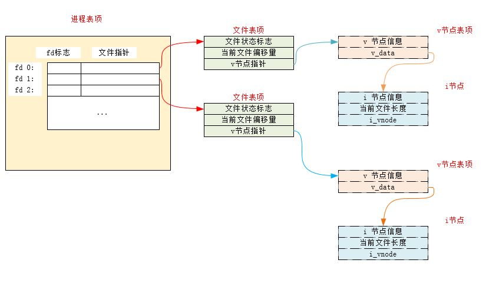
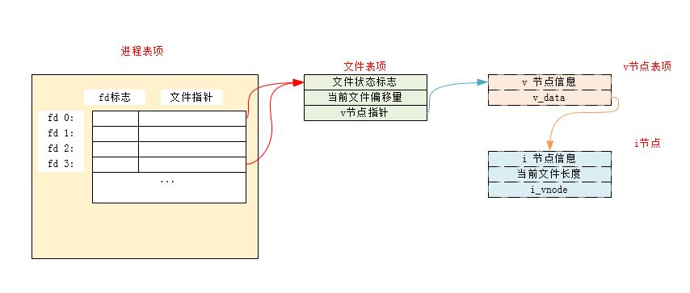

# 文件IO：不带缓冲的IO

### 1、进程创建时，默认打开的文件描述符有哪些？

   - 0： 标准输入
   - 1： 标准输出
   - 2： 标准错误输出

### 2、创建文件时，参数 `oflag` 的可选值有哪些？

   - `O_RDONLY`常量：文件只读打开
   - `O_WRONLY`常量：文件只写打开
   - `O_RDWR`常量：文件读、写打开
   - `O_EXEC`常量：只执行打开
   - `O_SEARCH`常量：只搜索打开（应用于目录）。本文涉及的操作系统都没有支持该常量
	
在上面五个常量中必须指定且只能指定一个。下面的常量是可选的（进行或运行）：
			
  - `O_CREAT`：若此文件不存在则创建它。在使用此选项时，需要同时说明参数`mode`（指定该文件的访问权限）
  -  `O_EXCL`：若同时指定了`O_CREAT`时，且文件已存在则出错。根据此可以测试一个文件是否存在。若不存在则创建此文件。这使得测试和创建两者成为一个原子操作
  - `O_APPEND`：每次写时都追加到文件的尾端
  - `O_TRUNC`： 如果此文件存在，且为`O_WRONLY`或者`O_RDWR`成功打开，则将其长度截断为0
  - `O_CLOEXEC`：
	  - 调用 `open` 函数 `O_CLOEXEC` 模式打开的文件描述符在执行 `exec` 调用新程序中关闭，且为原子操作。
	  - 调用 `open` 函数不使用 `O_CLOEXEC` 模式打开的文件描述符，然后调用 `fcntl` 函数设置`FD_CLOEXEC` 选项，效果和使用 `O_CLOEXEC` 选项 `open` 函数相同，但分别调用 `open`、`fcnt` 两个函数，不是原子操作，多线程环境中存在竞态条件，故用 `open` 函数 `O_CLOEXEC` 选项代替之。
	  - 调用 `open` 函数 `O_CLOEXEC` 模式打开的文件描述符，或是使用 `fcntl` 设置 `FD_CLOEXEC` 选项，这二者得到（处理）的描述符在通过 `fork` 调用产生的子进程中均不被关闭。
	  - 调用 `dup` 族类函数得到的新文件描述符将清除 `O_CLOEXEC` 模式。
  - `O_DIRECTORY`：若`path`引用的不是目录，则出错
  - `O_NOCTTY`：若`path`引用的是终端设备，则不将该设备分配作为此进程的控制终端
  - `O_NOFOLLOW`：若`path`引用的是一个符号链接，则出错
  - `O_NONBLOCK`：如果`path`引用的是一个`FIFO`、一个块特殊文件或者一个字符特殊文件，则文件本次打开操作和后续的 I/O 操作设为非阻塞模式。
  - `O_SYNC`：每次 `write` 等待物理 I/O 完成，包括由 `write` 操作引起的文件属性更新所需的 I/O 
  - `O_RSYNC`：使每一个`read`操作等待，直到所有对文件同一部分挂起的写操作都完成。
  - `O_DSYNC`：每次 `write` 等待物理 I/O 完成，但不包括由 `write` 操作引起的文件属性更新所需的 I/O ,`write` 完成后，某些文件属性也不会同步更新。

### 3、创建文件时，文件的权限( `mode` )设置有哪些选项？

   - `S_IRUSR`：用户读
   - `S_IWUSR`：用户写
   - `S_IXUSR`：用户执行
   - `S_IRGRP`：组读
   - `S_IWGRP`：组写			
   - `S_IXGRP`：组执行			
   - `S_IROTH`：其他读
   - `S_IWOTH`：其他写
   - `S_IXOTH`：其他执行 

### 4、文件定位时， `whence` 的选项有哪些？

```
off_t lseek(int fd, off_t offset,int whence);

```

SEEK_SET、SEEK_CUR、SEEK_END 三个常量之一 
    
参数 offset 的含义取决于参数 whence：

1. 如果 whence 是 SEEK_SET，文件偏移量将被设置为 offset。
2. 如果 whence 是 SEEK_CUR，文件偏移量将被设置为 cfo 加上 offset，
   offset 可以为正也可以为负。
3. 如果 whence 是 SEEK_END，文件偏移量将被设置为文件长度加上 offset，
   offset 可以为正也可以为负。
         
### 5、lseek 的注意事项：

   - 打开一个文件时，默认的偏移量是多少？
     
     > 除非指定 O_APPEND 选项，否则系统默认将该偏移量设为 0
     
   - 如果文件描述符指定的是一个管道、FIFO、或者网络套接字，`lseek` 的结果是什么？

     > 返回 -1 ，并且将 errno 设置为 ESPIPE
     
   - lseek 获得的文件偏移量一定是非负数吗？
     > 对于普通文件，其当前文件偏移量必须是非负值。但是某些设备运行负的偏移量出现。因此比较lseek的结果时，不能根据它小于0 就认为出错。要根据是否等于 -1 来判断是否出错。
   - 当前文件偏移量可以大于文件的当前长度吗？
     > 当前文件偏移量可以大于文件的当前长度。此时对该文件的下一次写操作将家常该文件，并且在文件中构成一个空洞。空洞中的内容位于文件中但是没有被写过，其字节被读取时都被读为0
 
 
### 6、哪些情况会造成 `read` 函数实际读到的字节数少于期望读到的字节数？

   - 读普通文件时，在读到期望字节数之前到达了文件尾端
   - 当从终端设备读时，通常一次最多读取一行（终端默认是行缓冲的）
   - 当从某些面向记录的设备（如磁带）中读取时，一次最多返回一条记录
   - 当从网络读时，网络中的缓存机制可能造成返回值小于期望读到的字节数
   - 当从管道或者` FIFO `读时，若管道包含的字节少于所需的数量，则 `read`只返回实际可用的字节数
   - 当一个信号造成中断，而已读了部分数据时。
 
### 7、进程表现、文件表现、v节点之间的关系？

   - 一个进程打开多个文件：

     

   - 多个进程打开同一个文件：
   
   
   
   - 一个进程多次打开同一个文件：

    
   
   > `lseek` 函数只是修改文件表项中的当前文件偏移量，不进行任何 I/O 操作
   
### 8、如何解决多个进程追加一个文件时的竞争关系？

   - 追加一个文件时，不能通过`lseek`到末尾然后`write`。要用`O_APPEND`选项打开文件，然后直接`write`(通过 `O_APPEND` 选项打开文件，然后直接`write`时，内核每一次在写操作之前，都会将进程的当前偏移量设置为 v 节点的偏移量，于是就不需要执行`lseek`定位操作)
   - `pread/pwrite`可以执行原子性的定位读/定位写

### 9、`dup2` 中如果 `fd`、`fd2` 相同或者 `fd` 已经被打开了会发生什么？

   - 如果 `fd2` 等于 `fd`，则直接返回 `fd2`（也等于 `fd` ），而不作任何操作
   - 如果 `fd2` 已经是被打开的文件描述符且不等于 `fd`，则先将其关闭，然后再打开（注意关闭再打开是一个原子操作）

### 10、`sync`、`fsync`、`fdatasync` 的区别？

   -  `sync`：将所有修改过的块缓冲区排入写队列，然后返回，它并不等待时机写磁盘结束
   - `fsync`：只对由`fd`指定的单个文件起作用，等待写磁盘操作结束才返回
   - `fdatasync`：只对由`fd`指定的单个文件起作用，等待写磁盘操作结束才返回，但是它只影响文件的数据部分（`fsync`会同步更新文件的属性）

### 11、`fcntl` 中 `cmd` 的选项有哪些？

   - `F_DUPFD`常量：复制文件描述符 `fd`。新文件描述符作为函数值返回。它是尚未打开的文件描述符中大于或等于`arg`中的最小值。新文件描述符与`fd`共享同一个文件表项，但是新描述符有自己的一套文件描述符标志，其中`FD_CLOEXEC`文件描述符标志被清除
   - `F_DUPFD_CLOEXEC`常量：复制文件描述符。新文件描述符作为函数值返回。它是尚未打开的个描述符中大于或等于`arg`中的最小值。新文件描述符与`fd`共享同一个文件表项，但是新描述符有自己的一套文件描述符标志，其中`FD_CLOEXEC`文件描述符标志被设置
   - `F_GETFD`常量：对应于`fd`的文件描述符 **标志** 作为函数值返回。当前只定义了一个文件描述符标志`FD_CLOEXEC`
   - `F_SETFD`常量：设置`fd`的文件描述符标志为`arg`
   - `F_GETFL`常量：返回`fd`的文件状态标志。文件状态标志必须首先用屏蔽字 `O_ACCMODE` 取得访问方式位，然后与`O_RDONLY`、`O_WRONLY`、`O_RDWR`、`O_EXEC`、`O_SEARCH`比较（这5个值互斥，且并不是各占1位）。剩下的还有：`O_APPEND`、`O_NONBLOCK`、`O_SYNC`
			、`O_DSYNC`、`O_RSYNC`、`F_ASYNC`、`O_FSYNC`
   - `F_SETFL`常量：设置`fd`的文件状态标志为 `arg`。可以更改的标志是：
		  `O_APPEND`、`O_NONBLOCK`、`O_SYNC`、`O_DSYNC`、`O_RSYNC`、`F_FSYNC`、`O_ASYNC`
   - `F_GETOWN`常量：获取当前接收 `SIGIO`和`SIGURG`信号的进程 `ID`或者进程组 `ID`
   - `F_SETOWN`常量：设置当前接收 `SIGIO`和`SIGURG`信号的进程 `ID`或者进程组 `ID`为`arg`。若 `arg`是个正值，则设定进程 `ID`；若 `arg`是个负值，则设定进程组`ID`	
   - `F_GETLK`、`F_SETLK`、`F_SETLKW`：获取/设置文件记录锁

### API

```
int open(const char* path,int oflag,.../*mode_t mode*/);
int openat(int fd,const char*path,int oflag,.../*mode_t mode */);

int creat(const char*path,mode_t mode);//open(path,O_WRONLY|O_CREAT|O_TRUNC,mode)
int close(int fd);

off_t lseek(int fd, off_t offset,int whence);

ssize_t read(int fd,void *buf,size_t nbytes);
ssize_t write(int fd,const void *buf,size_t nbytes);

ssize_t pread(int fd,void*buf,size_t nbytes,off_t offset);
ssize_t pwrite(int fd,const void*buf,size_t nbytes,off_t offset);

int dup(int fd); //返回的新的文件描述符一定是当前可用的文件描述符中最小的数字
int dup2(int fd,int fd2);

int fsync(int fd);
int fdatasync(int fd);
void sync(void);

int fcntl(int fd,int cmd,.../* int arg */);

```

