# 操作系统原理——内存管理(上)

## 概论

### 冯·诺依曼体系结构

数学家冯·诺依曼提出了计算机制造的三个基本原则，即采用二进制逻辑、程序存储执行以及计算机由五个部分组成（运算器、控制器、存储器、输入设备、输出设备），这套理论被称为冯·诺依曼体系结构。

### PCI

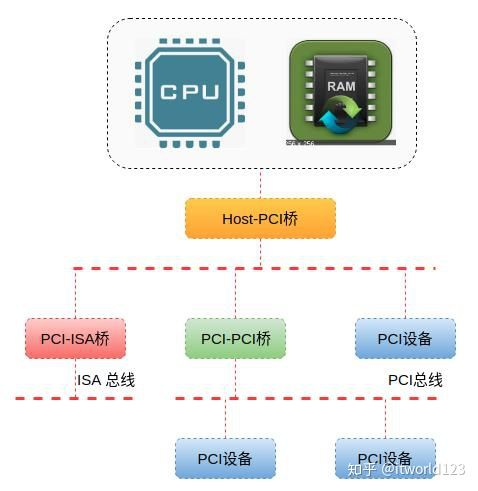

总线： 我们知道计算机通常包括几大件，CPU、内存、输入设备和输出设备等。这些设备之间进行通信需要依赖一种通道，这个通道就是总线。说的直白写，总线就是传输数据的通道，可以类比日常生活中的马路，各个不同的城市通过马路来交换物资。总线有很多种，比如常见的PCI总线，ISA总线和I2C总线等等，我们这里就不相信介绍。

PCI桥： PCI桥是连接PCI总线的纽带，其作用与网络领域的网桥类似。其实我们平时说的北桥，就包含PCI桥。PCI桥主要分3种，3种桥的具体含义如下：

- HOST/PCI桥：提供CPU和PCI设备相互访问的通道，实现CPU空间和PCI空间的映射。
- PCI-PCI桥：实现PCI设备的级联。当一条 PCI 总线的承载量不够时，可以用新的 PCI 总线进行扩展，而 PCI 桥则是连接 PCI 总线之间的纽带。
- PCI/ISA或LPC桥：实现对ISA设备的兼容。
- 设备：设备就是具体的设备了，比如网卡、键盘和鼠标等等。

### 多道批处理、分时、实时
- 多道程序设计技术允许多个程序同时进入内存并运行。即同时把多个程序放入内存，并允许它们交替在CPU中运行，它们共享系统中的各种硬、软件资源。当一道程序因I/O请求而暂停运行时，CPU便立即转去运行另一道程序。

- 在操作系统中釆用分时技术就形成了分时系统。所谓分时技术就是把处理器的运行时间分成很短的时间片，按时间片轮流把处理器分配给各联机作业使用。若某个作业在分配给它的时间片内不能完成其计算，则该作业暂时停止运行，把处理器让给其他作业使用，等待下一轮再继续运行。

- 为了能在某个时间限制内完成某些紧急任务而不需时间片排队，诞生了实时操作系统。这里的时间限制可以分为两种情况：如果某个动作必须绝对地在规定的时刻（或规定的时间范围）发生，则称为硬实时系统。例如，飞行器的飞行自动控制系统，这类系统必须提供绝对保证，让某个特定的动作在规定的时间内完成。如果能够接受偶尔违反时间规定，并且不会引起任何永久性的损害，则称为软实时系统，如飞机订票系统、银行管理系统。

### OS的主要功能

- 资源管理功能：处理机管理、存储器管理、设备管理、文件管理
- 操作系统和用户之间的接口：用户接口：联机用户接口，脱机用户接口和图形用户接口；程序接口：该接口是为用户程序在执行中访问系统资源而设置的，它是由一组系统调用组成。

## 内存管理概论

内存管理涉及的领域有：

- 进程的地址空间。
- 虚拟地址的寻址映射机制
- 内存中的物理内存页的管理。
	- 分配大块内存的伙伴系统。
	- 分配较小内存的slab、slub和slob分配器。
	- 分配非连续内存块的vmalloc机制。
- 内存物理页框的回收

## 内核进程的地址空间

### 虚拟内存

所有的新的Linux系统都提供了一种有用的抽象，叫做虚拟内存（virtual memory）。虚拟内存作为一种逻辑层，处于应用程序的内存请求与硬件管理单元（Memory Management Unit，MMU）之间，虚拟内存有很多用途和优点：

- 若干进程可以并发地执行。
- 应用程序所需内存大于物理内存的时候也可以运行2。
- 进程可以共享函数库或程序的一个单独内存映象。
- 程序是可重定位的，可以把程序放在物理内存的任何地方。
- 程序员可以编写机器无关代码，无需关系物理内存的组织结构。
- 程序只有部分代码装入内存时进程可以执行它。
- 允许每个进程访问可用物理内存的子集。

Linux将虚拟地址空间划分为两个部分，分别称为内核空间和用户空间。

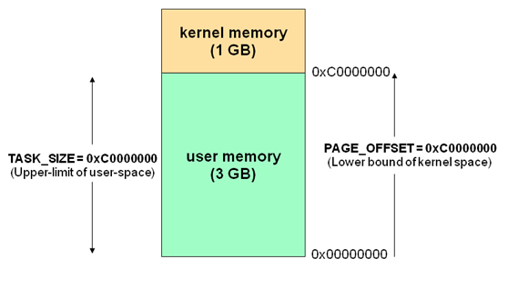

系统中每个用户进程都有自身的虚拟地址范围，从0到TASK_SIZE。其中内核空间保留给内核专用，用户的进程不能访问。TASK_SIZE是一个特定于计算机体系结构的常数。

### 内核镜像

在32位系统中，内核地址空间是指虚拟地址3GB~4GB的部分。在3GB~(3GB+896MB)这段线性映射区域，包含了内核初始化页表swapper_pg_dir，内核镜像等。内核也是由一个elf文件（比如vmlinux）加载启动的，加载后也有text段，data段，bss段等。

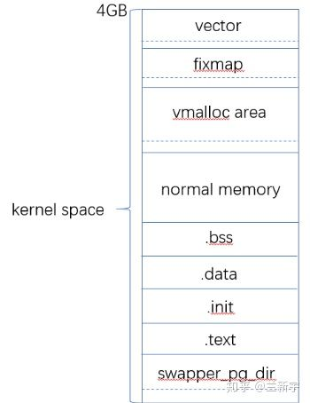


### 内核内存申请

在虚拟内存空间的normal memory区域，内核使用kmalloc()来分配内存，kmalloc()返回的也是虚拟地址，但是分到的内存在物理地址上是连续的（因为是线性映射，在虚拟地址上自然也是连续的）。

在`VMALLOC_START`和`VMALLOC_END`之间的区域为vmolloc area，它和normal memory中有8MB的间隔。这部分间隔不作任何地址映射，相当于一个空洞，主要用做安全保护，防止不正确的越界内存访问，因为此处没有进行任何形式的映射，如果进入到空洞地带，将会触发处理器产生一个异常。

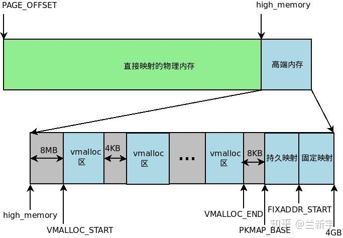

在vmolloc area中使用vmalloc()分配内存，具体的分配过程是：

- 根据要分配的内存大小，调用`get_vm_area( )`，获取vmlist_lock锁以扫描vmlist链表，在vmolloc area中找到一块大小满足要求的空闲内存；
- 调用`__vmalloc_area_pages() --> alloc_page()`，通过内核的buddy系统获得相应大小的物理页面，关于物理页面的分配请参考这篇文章；
- vmalloc area中的地址映射不再是简单的3GB偏移，因此需要调用map_vm_area()，建立虚拟地址和物理页面的映射关系，并添加到内核页表中。

同kmalloc()相比，vmalloc()分配的内存只能保证在虚拟地址上连续，不能保证在物理地址上连续。在物理地址上连续有什么好处呢？可以更好的根据空间局部性原理利用cache，增加数据访问的速度啊。由于增加了建立映射关系和添加内核页表的操作，vmalloc()的分配速度是比不上kmalloc()的。访问vmalloc()分配的内存，需要查找TLB和内核页表，效率自然比访问kmalloc()分配的内存也是差一截。


### 非连续内存区管理

vmalloc 映射到的线性地址空间，位于内核地址空间后面 128MB 中的开始部分，范围是 `VMALLOC_START ~ VMALLOC_END`。

该空间的开始，与物理内存直接映射的空间的结尾（即3GB+896MB）之间，有一个8MB的安全间隔。

为了管理这段空间，Kernel必须知道其中哪些区域已经使用了，哪些还未使用。为此，Kernel提供了一个数据结构 vm_struct，来描述已经使用了的非连续内存区域。


```
struct vm_struct {
    
    struct vm_struct    *next;
    void            *addr;
    unsigned long       size;
    unsigned long       flags;
    truct page     **pages;
    unsigned int        nr_pages;

}

```

- addr：该区域的起始地址；
- size：该区域的大小，加上4096（区域之间的安全间隔）。
- flags：该区域的标志。
- VM_ALLOC: 该区域是由 vmalloc 创建的。
- VM_MAP: 该区域是由 vmap 创建的。
- VM_IOREMAP: 由 ioremap 使用。
- pages：指向一个page指针数组的指针。每一项元素都表示一个映射到该区域的物理页面。
- nr_pages：该区域映射的物理页面的个数。

所有的 vm_struct 结构体都链接在一个链表上，链表的头为vmlist。该链表由锁vmlist_lock保护

Kernel提供了函数 get_vm_area() 来寻找一块空闲区域，并创建一个vm_struct结构体

vmalloc要映射的物理页面，当然也是从buddy system中分配出来的。该工作由函数__vmalloc_area_node()来完成。

这里需要注意的一点是，物理页面是按单个页面，逐次分配出来的。这正是vmalloc的一个核心思想所在，正因如此，vmalloc才能够把物理上不连续的页面映射到连续的线性地址空间中。

至此，我们有了一块连续的线性地址空间，也有了足够的物理页面，那接下来的工作就是把两者映射起来。该工作是由函数map_vm_area()完成的。

该函数通过修改页表来完成具体的映射操作。这里需要注意的一点是，该函数只是修改了kernel page tables, 而当前进程的页表并没有改变。

好了，把以上三个元素组装起来，就是函数vmalloc()的实现了。该函数最终通过函数__vmalloc_node()来完成工作。

刚才我们强调过，函数vmalloc()只是修改了kernel page tables，当前进程的page tables并没有改变。因此，当一个处于内核态的进程P访问vmalloc区域时，就会产生一个page fault，因为在进程P的页表中，该vmalloc区域所对应的页表项为空。然而，page fault handler会检查master kernel Page Global Directory里面对应于出错线性地址的页目录项。如果该页目录项不为空，那就会把其内容copy到进程P的Page Global Directory里对应的页目录项中。这样，page fault handler返回后，进程P就可以继续执行并正常访问该vmalloc区域了。

正如函数vmalloc()，函数vfree()也是只修改了kernel page tables，而并没有修改进程的页表。那它是怎么工作的呢？

假设，一个处于内核态的进程P，访问一个vmalloc区域。按照我们上面讲的，page fault handler会把kernel page tables中对应的页目录项copy到进程P的页表对应的页目录项中，从而使得进程P可以正常访问该vmalloc区域。也就是说，针对于该vmalloc区域中的地址，进程P的Page Global Directory和master kernel Page Global Directory中的页目录项相同，它们都指向相同的Page Upper Directories, Page Middle Directories和Page Tables。如果此时，vfree()释放了该区域，清除了这些page tables里面对应的内容。进程P再访问这个vmalloc区域时就会产生一个page fault。而page fault handler发现kernel page tables中也不包含出错地址所对应的页表项，因此就会把这次访问看作为bug。

## 内核虚拟地址的寻址映射机制

### 低端内存与线性映射

用户空间的地址都是虚拟地址，都要经过 MMU 的翻译，变成物理地址。用户空间的虚拟地址，就是按前面所述的走四级页表来翻译。

内核空间虚拟地址是所有进程共享的，重要的是，从效率角度看， 如果同样走四级页表翻译的流程，速度太慢；于是，内核在初始化时，就创建内核空间的映射（因为所有进程共享，有一份就够了），并且，采用的就是线性映射，而不是走页表翻译这种类似哈希表的方式。这样，内核地址的翻译，简化为一条偏移加减指令就行，相比走页表，效率大大提高。


当内核模块代码或线程访问内存时，代码中的内存地址都为逻辑地址，而对应到真正的物理内存地址，需要地址一对一的映射，如逻辑地址0xc0000003对应的物理地址为0×3，0xc0000004对应的物理地址为0×4，… …，逻辑地址与物理地址对应的关系为

物理地址 = 逻辑地址 – 0xC0000000：

这是内核地址空间的地址转换关系，注意内核的虚拟地址在“高端”，但是ta映射的物理内存地址在低端。

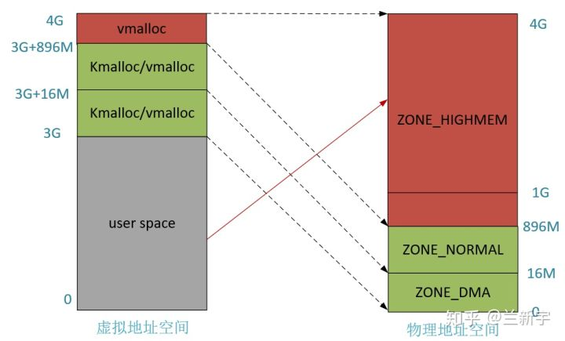

### 高端内存与动态映射（非连续内存区域）

假设按照上述简单的地址映射关系，那么内核逻辑地址空间访问为0xc0000000 ~ 0xffffffff，那么对应的物理内存范围就为0×0 ~ 0×40000000，即只能访问1G物理内存。若机器中安装8G物理内存，那么内核就只能访问前1G物理内存，后面7G物理内存将会无法访问，因为内核 的地址空间已经全部映射到物理内存地址范围0×0 ~ 0×40000000。即使安装了8G物理内存，那么物理地址为0×40000001的内存，内核该怎么去访问呢？代码中必须要有内存逻辑地址 的，0xc0000000 ~ 0xffffffff的地址空间已经被用完了，所以无法访问物理地址0×40000000以后的内存。

1G 内核空间，只能映射 1G 物理地址空间，这对内核来说，太掣肘了。所以，折衷方案是， Linux 内核只对 1G 内核空间的前 896 MB 按前面所说的方法线性映射, 剩下的 128 MB 的内核空间， 采用动态映射的方式，即按需映射的方式 ，这样，内核态的访问空间更多了。 这个直接映射的部分， 就是题主所说的 NORMAL 区， 就是所谓低端内存。到了 64 位时代， 内核空间大大增大， 这种限制就没了，内核空间可以完全进行线性映射

动态映射不全是为了内核空间可以访问更多的物理内存，还有一个重要原因： 当内核需要连续多页面的空间时，如果内核空间全线性映射，那么，可能会出现内核空间碎片化而满足不了这么多连续页面分配的需求。基于此，内核空间也必须有一部分是非线性映射，从而在这碎片化物理地址空间上，用页表构造连续虚拟地址空间,这就是所谓vmalloc空间。

因此x86架构中将内核地址空间划分三部分：ZONE_DMA、ZONE_NORMAL和 ZONE_HIGHMEM。ZONE_HIGHMEM即为高端内存，这就是内存高端内存概念的由来。

高端内存是指物理地址空间超过896M的内存地址，跟虚拟空间上的(3G+896M ~ 4G]没有任何关系。

在x86结构中，三种类型的区域（从3G开始计算）如下：

- ZONE_DMA 内存开始的16MB

- ZONE_NORMAL 16MB~896MB

- ZONE_HIGHMEM 896MB ~ 结束

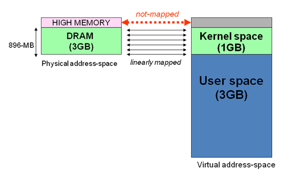


地址空间范围为 0xF8000000 ~ 0xFFFFFFFF（896MB～1024MB）, 那么是如何借助128MB高端内存地址空间是如何实现访问可以所有物理内存？

当内核想访问高于896MB物理地址内存时，从0xF8000000 ~ 0xFFFFFFFF地址空间范围内找一段相应大小空闲的逻辑地址空间，借用一会。借用这段逻辑地址空间，建立映射到想访问的那段物理内存（即填充内核PTE页面表），临时用一会，用完后归还。这样别人也可以借用这段地址空间访问其他物理内存，实现了使用有限的地址空间，访问所有所有物理内存。如下图。

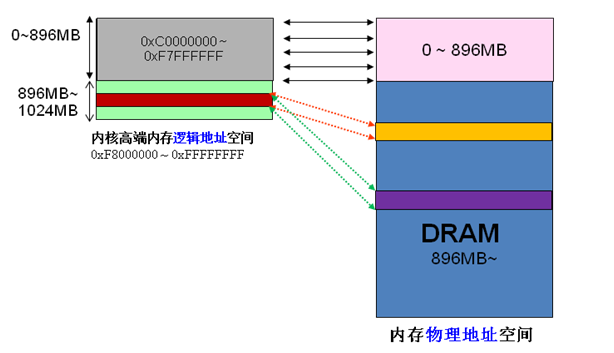

从上面的描述，我们可以知道高端内存的最基本思想：借一段地址空间，建立临时地址映射，用完后释放，达到这段地址空间可以循环使用，访问所有物理内存。

看到这里，不禁有人会问：万一有内核进程或模块一直占用某段逻辑地址空间不释放，怎么办？若真的出现的这种情况，则内核的高端内存地址空间越来越紧张，若都被占用不释放，则没有建立映射到物理内存都无法访问了。

>
内存分配与内存映射
>
- 映射跟分配是两回事，他们是不相关的。
- 但是如果能做到 分配后才映射，释放后就解映射，从运行安全的角度来说是最好的，可惜这个很难做到。
>
整个内核，由buddy管理算法来管理所有物理页，只有经过它分配出去的物理页，OS和应用程序才能使用。映射是指建好页表，即某块虚拟地址空间到物理地址空间的映射，有了这个映射，处理器就可以访问这块虚拟地址空间。所以，分配是管哪些物理地址可使用，而映射是管哪些虚拟地址可访问
>
如果某个物理页没有被分配出来，但已有某个虚拟地址映射到这个物理页上，这就是内核lowmem
>
高端内存是满足分配后才映射，释放后就解映射 这个原则的，这个空间主要给用户态进程（比如用户态代码段，数据段，栈，堆，匿名映射）或者用户态业务相关功能使用（访问文件产生的pagecache）。
>
但是lowmem却不是这样的


与直接映射的物理内存末端，高端内存的始端所对应的线性地址存放在high_memory变量中，它被设置为896MB。896MB边界以上的页框并不映射再内核线性地址空间的第4个GB，因此，内核不能直接访问它们。这就意味着，返回所分配页框线性地址的页分配器函数不适用于高端内存，即不适用于ZONE_HIGHMEM内存管理区的页框。

之前也提到过，假定内核调用 `__get_free_pages(GFP_HIGHMEM, 0)`，则在高端内存区确实申请并分配了一个页框，但是 `__get_free_pages()` 不能返回它的线性地址，因为它根本就不存在，所以返回 NULL

对于 64 位硬件平台不存在这个问题，因为高端内存不存在。

内核可以采用三种不同的机制将页框映射到高端内存，分别叫做永久内核映射、临时内核映射和非连续内存分配。

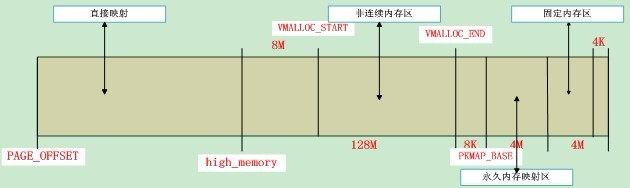

对于 64 位系统来说，内核空间的映射变的简单了，因为这时内核的虚拟地址空间已经足够大了，即便它要访问所有的物理内存，直接映射就是，不再需要ZONE_HIGHMEM那种动态映射机制了。

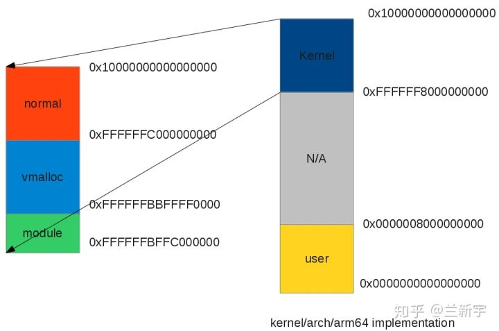

### 高端内存与永久内核映射

永久内核映射允许内核建立高端页框到内核地址空间的长期映射，页表映射的线性地址从 `PKMAP_BASE` 开始，到 FIXADDR_START, 为了记录高端内存页框与永久内核映射包含的线性地址之间的联系，内核使用 `page_address_htable` 做散列表。使用 kmap() 函数用来建立高端内存区的永久内核映射

同样是临时映射，但还是可以区分一下。vmalloc()主要用于分配物理内存，并建立和虚拟地址的映射，如果已经分配好了物理内存（比如alloc_page()后），只是想建立映射，则可以使用vmap()，这两个都是非连续内存空间映射的 api

通常呢，vmap()用于相对长时间的映射，可同时映射多个pages，`kmap()` 和 `kmap_atomic()` 则用于相对短时间的映射，只能映射单个page。kmap()跟kmalloc()没有半毛钱关系。

### 高端内存与临时内存映射

内核在 FIXADDR_START 到 FIXADDR_TOP 之间保留了一些线性空间用于特殊需求。这个空间称为”固定映射空间”在这个空间中，有一部分用于高端内存的临时映射。

这里固定映射是指虚拟地址是固定的，而被映射的物理地址并不固定。采用固定虚拟地址的好处是它相当于一个指针常量（常量的值在编译时确定），指向物理地址，如果虚拟地址不固定，则相当于一个指针变量。指针常量相比指针变量的好处是可以减少一次内存访问，因为指针变量需要通过内存访问才可以获得指针本身的值。

为何有fixmap这个概念？动态分配虚拟地址以及建立地址映射是一个复杂的过程，在内核完全启动之后，内存管理可以提供各种丰富的API让内核的其他模块可以完成虚拟地址分配和建立地址映射的功能，但是，在内核的启动过程中，有些模块需要使用虚拟内存并mapping到指定的物理地址上，而且，这些模块也没有办法等待完整的内存管理模块初始化之后再进行地址映射。因此，linux kernel固定分配了一些fixmap的虚拟地址，这些地址有固定的用途，使用该地址的模块在初始化的时候，讲这些固定分配的地址mapping到指定的物理地址上去。

临时内核映射比永久内核映射要简单，此外，它们可以用在中断处理程序和可延迟函数的内部，因为它们从不阻塞当前进程。在高端内存的仁一页框都可以通过一个『窗口』映射到内核地址空间。留给临时内核映射的窗口是非常少的。

每个CPU都有它自己包含的13个窗口集合，它们用enum km_type数据结构表示。为了建立临时内核映射，内核调用kmap_atomic()函数


## 进程的地址空间

### 进程的地址空间

进程的地址空间由允许进程使用的全部线性地址组成。每个进程看到的线性地址集合是不同的。内核可通过增加或删除某些线性地址区间来动态地修改进程的地址空间。

内核通过线性区来表示线性地址区间，由起始线性地址、长度和一些访问权限描述。为效率起见，起始地址和长度都必须是 4096 的倍数，这样线性区的数据就可以完全填满分配给它的页框。下面是获得新线性区的一些典型情况：

- 用户在控制台输入一条命令时，shell 进程创建一个新进程区执行该命令，一组线性区会分配给新进程。
- 正在运行的进程可能会装入一个完全不同的程序，进程标识符保持不变，但该程序使用的线性区会替换。
- 正在运行的进程可能对一个文件（或它的一部分）执行”内存映射“，内核会给该进程分配一个新的线性区来映射该文件。
- 进程可能持续向它的用户态堆栈增加数据，直到映射该堆栈的线性区用完，这时，内核也许会扩展该线性区的大小。
- 进程可能创建一个 IPC 共享线性区来与其他何作进程共享数据，这时，内核会给该进程分配一个新的线性区。
- 进程可能通过调用类似 malloc() 的函数扩展自己的动态区（堆），这时，内核可能决定扩展分配给该堆的线性区。

确定一个进程当前所拥有的线性区（即进程的地址空间）是内核的基本任务，因为可让缺页异常处理程序有效地区分两种不同的无效线性地址：

- 由编程错误引发的无效线性地址。
- 由缺页引发的无效线性地址：即使该线性地址属于进程的地址空间，但对应于该地址的页框仍有待分配。

### 内存描述符

内存描述符包含与进程地址空间有关的全部信息，该结构类型为 `mm_struct`，进程描述符的 `mm` 字段指向它。每个进程拥有唯一一个内存描述符。

所有的内存描述符存放在一个双向链表。每个描述符的 `mmlist` 字段存放链表相邻元素的地址。链表的第一个元素是 `init_mm` 的 mmlist 字段，`init_mm` 是初始化阶段进程 0 所使用的内存描述符。

`mm_users` 字段存放共享 `mm_struct` 数据结构的轻量级进程的个数。
`mm_count` 字段是内存描述符的主使用计数器，值为 0 时，解除该内存描述符。
多个轻量级的 `mm_users` 对应于 `mm_count` 中一个单位。

mm_alloc() 获得一个新的内存描述符。由于内存描述符被保存在 slab 分配器高速缓存中，因此，`mm_alloc()` 调用 `kmem_cache_alloc()` 初始化新的内存描述符，并将 `mm_count` 和 `mm_users` 都设为 1。

### 内核线程的内存描述符

因为大于 `TASK_SIZE` 线性地址的相应页表项应该总是相同的，所以，一个内核线程使用什么样的页表都可以。
为了避免无用的 TLB 和高速缓存刷新，内核线程使用一组最近运行的普通进程的页表。
因此，每个进程描述符中包含了两种内存描述符指针：mm 和 active_mm。

进程描述符中的 mm 字段指向进程所拥有的内存描述符，active_mm 字段指向进程运行时所使用的内存描述符。
对于普通进程，这两个字段存放相同的指针。
但对于内核线程，不拥有内存描述符，mm 字段总为 NULL。
内核线程运行时，active_mm 字段被初始化为前一个运行进程的 active_mm 值。

### 线性区

#### 进程中的线性区

一个进程通常由加载一个elf文件启动，而elf文件是由若干segments组成的，同样的，进程地址空间也由许多不同属性的segments组成。linux进程中的segment是虚拟地址空间中用于保存数据的区域，只在虚拟地址上连续。

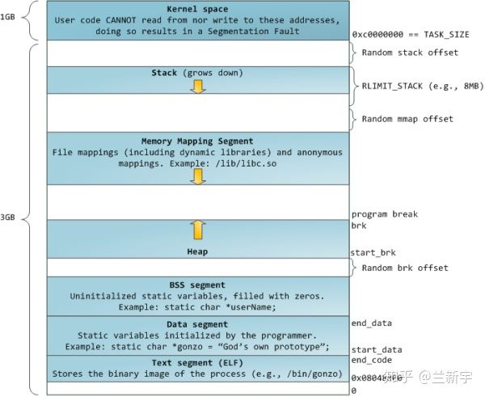

text段包含了当前运行进程的二进制代码，其起始地址在IA32体系中中通常为0x08048000，在IA64体系中通常为0x0000000000400000（都是虚拟地址哈）。data段存储已初始化的全局变量，bss段存储未初始化的全局变量。从上图可以看出，这3个segments是紧挨者的，因为它们的大小是确定的，不会动态变化。

与之相对应的就是heap段和stack段。heap段存储动态分配的内存中的数据，stack段用于保存局部变量和实现函数/过程调用的上下文，它们的大小都是会在进程运行过程中发生变化的，因此中间留有空隙，heap向上增长，stack向下增长，因为不知道heap和stack哪个会用的多一些，这样设置可以最大限度的利用中间的空隙空间。

还有一个段比较特殊，是mmap()系统调用映射出来的。mmap映射的大小也是不确定的。3GB的虚拟地址空间已经很大了，但heap段, stack段，mmap段在动态增长的过程还是有重叠（碰撞）的可能。为了避免重叠发生，通常将mmap映射段的起始地址选在TASK_SIZE/3（也就是1GB）的位置。如果是64位系统，则虚拟地址空间更加巨大，几乎不可能发生重叠。

如果stack段和mmap段都采用固定的起始地址，这样实现起来简单，而且所有linux系统都能保持统一，但是真实的世界不是那么简单纯洁的，正邪双方的较量一直存在。对于攻击者来说，如果他知道你的这些segments的起始地址，那么他构建恶意代码（比如通过缓冲区溢出获得栈内存区域的访问权，进而恶意操纵栈的内容）就变得容易了。一个可以采用的反制措施就是不为这些segments的起点选择固定位置，而是在每次新进程启动时（通过设置PF_RANDOMIZE标志）随机改变这些值的设置。

那这些segments的加载顺序是怎样的呢？以下图为例，首先通过execve()执行elf，则该可执行文件的text段，data段，stack段就建立了，在进程运行过程中，可能需要借助ld.so加载动态链接库，比如最常用的libc，则libc.so的text段，data段也建立了，而后可能通过mmap()的匿名映射来实现与其他进程的共享内存，还有可能通过brk()来扩大heap段的大小。

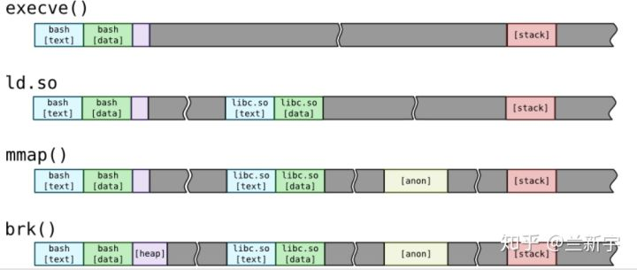

#### 线性区数据结构

`vm_area_struct` 对象实现线性区。

每个线性区描述符表示一个线性地址区间。
`vm_start` 字段包含区间的第一个线性地址。
`vm_end` 字段包含区间之外的第一个线性地址。
`vm_mm` 字段指向拥有该区间的进程的 `mm_struct` 内存描述符。也就是说一个内存描述符 `mm_struct` 对应多个 `vm_area_struct`

进程所拥有的线性区从不重叠，且内核尽力把新分配的线性区与紧邻的现有线性区进行合并。如果两个相邻区的访问权限相匹配，就能把它们合并在一起。

进程所拥有的所有线性区是通过一个简单的链表链接在一起的。链表中的线性区按照内存地址升序排列，但每两个线性区可由未用的内存地址区隔开。`vm_area_struct` 的 `vm_next` 字段指向链表的下一个元素。内核通过进程的内存描述符的 `mmap` 字段指向链表中的第一个线性区描述符。内存描述符的 map_count 字段存放所有进程所拥有的线性区数目。默认，一个进程最多可拥有 65536 个不同的线性区

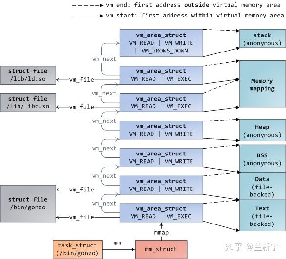

但是，当进程的线性区非常少时，比如一二十个，使用链表才比较法方便，为提高效率，存放进程的线性区时，Linux 既使用了链表，也使用了红黑树。红黑树的首部由内存描述符的 mm_rb 字段指向。一般，红黑树用来确定含有指定线性地址的线性区，而链表通常用于扫描整个线性区集合。

#### VMA 的权限

`vm_flags` 描述的是 `vma` 的属性，`flag` 可以是 `VM_READ`、`VM_WRITE`、`VM_EXEC`、`VM_SHARED`，分别指定 `vma` 的内容是否可以读、写、执行，或者由几个进程共享。前面介绍的页表PTE中也有类似的 `Read/Write` 权限限制位，那它和 `vma` 中的这些标志位是什么关系呢？

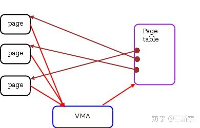

vma由许多的虚拟pages组成，每个虚拟page需要经过page table的转换才能找到对应的物理页面。PTE中的Read/Write位是由软件设置的，设置依据就是这个page所属的vma，因此一个vma设置的VM_READ/VM_WRITE属性会复制到这个vma所含pages的PTE中。之后，硬件MMU就可以在地址翻译的过程中根据PTE的标志位来检测访问是否合法，

#### 分配线性地址区间

页和线性区之间的关系：每个线性区都由一组号码连续的页构成。

do_mmap() 为当前进程创建并初始化一个新的线性区。分配成功后，可与进程已有的其他线性区进行合并。

加载一个动态链接库或者通过mmap创建映射时，都需要在进程地址空间中增加一个vma。具体过程是首先通过get_unmapped_area()找到虚拟地址空间中一块空闲且大小满足要求的区域（根据你上报的你家的人数，给你街道中一个住的下你家所有人的空房子），分配给新vma并设置其flag属性（限制你家对这个房子的使用，比如只能住，不能私自改建），返回该vma起始处的虚拟地址（告诉你这个房子的门牌号）。当然，你出于某种目的，也可以指定就街道上的某间房子（调用mmap()时指定参数addr），如果这间房子正好是空的，就可以分配给你。

这里的房子有点特殊，街道上房间的总数是固定的，每个房间的大小是4平方米（页面大小4KB），只要是相邻的空房间，就可以组成一个空房子。房间总数也是有限的（3GB内存的话差不多是75万个房间），你来晚了，或者你狮子大开口，要一个50万房间的空房子（比如通过malloc(2G)），那就有可能出现分配不到的情况（可用虚拟地址空间不足）。

如果新建的vma和它地址上紧挨着的vma有相同的属性，且基于相同的映射对象（比如是同一个文件），则还会产生vma的合并（上下两层楼打通，做成一个跃层）。减少vma的数量有利于减轻内核的管理工作量，降低系统开销。如果没有发生合并，则需要调用insert_vm_struct( )在vma链表和vma红黑树中分别插入代表新vma的节点（给你家的房子被街道办事处登记，方便日后管理）。

要注意的是，房子的分配是按照你上报的人数，但具体给你几个房间的钥匙（分配几个物理页面），取决于你家实际住进来的人数，比如你申请的是10个房间，但只住进来3个人，就只有3个房间的钥匙，剩下的钥匙等真正有人搬进来再给，房间资源有限，占着不住不是浪费么。分配的vma只是这段虚拟地址的使用权，而不是物理地址的使用权。

那是不是我申请成功10个房间，就可以保证10个人都能住进来呢？这个嘛，街道（进程）最开始也是这样以为的，后来出现了房间申请成功，结果拿钥匙开不了门的情况，街道就向上级管理者（内核）反映啊，这才被告知了一个残酷的现实：除了本条街道，还有很多条其他街道，大家处在一个平行空间中（虚拟地址空间都是0~3GB），这70多万个房间，其实是被所有街道共享的，谁先拿到一个房间的钥匙（使用物理页面），谁才真正拥有这个房间。一切都是假象……然后街道问上级：那你为啥一直允许我们街道上的人一口气申请那么多房间呢？上级若有所思的说：我当时设计这个制度啊，主要是考虑到很多人可能申请的多，但实际用不了那么多（比如malloc(2G)，但实际只用了1M）,我也不知道实际谁会用的多一点，为了让资源（这些房间）得到最充分的利用，我只能先允许他们申请着。以后这种事情多了，大家也渐渐明白，别一下申请那么多，不合理的需求，到了上级那里是通不过的，这种申请超过实际可用物理内存的现象，被称为memory overcommit。

### 缺页异常处理程序


#### 请求调页

是一种动态内存分配技术，它将页框的分配推迟到进程要访问的页不在 RAM 中时为止，由此引起一个缺页异常。

被访问的页可能不在主存中，原因或者是进程从没访问过该页，或者内核已经回收了相应的页框。

缺页处理程序为进程分配新的页框后，如何初始化该页框取决于哪一种页以及页是否被进程访问过。特殊情况下：

- 该页从未被进程访问到且没有映射磁盘文件，或者页映射了磁盘文件。
    
    内核识别该种情况的依据：页表相应的表项被填充为 0，说明其页表从来就没有被初始化过，即 pte_none 宏返回 1。

- 页属于一个非线性磁盘文件映射。
    
    内核识别该种情况的依据：Present 标志被清 0 且 Dirty 标志被置 1，即 `pte_file` 宏返回 1。

- 进程已经访问过该页，但其内容被临时保存在磁盘上。
    
    内核识别该种情况的依据：相应的页表项没被填充为 0，但 Present 和 Dirty 标志被清 0。

第 1 种情况下，调用 do_no_page()。有两种方法装入所缺的页，取决于该页是否被映射到一个磁盘文件。
通过检查 vma 线性区描述符的 nopage 字段来确定，如果页被映射到一个文件，nopage 就指向一个函数，该函数将所缺的页从磁盘装入到 RAM。
可能的情况是：

- `vma->vm_ops->nopage != NULL`，说明线性区映射了一个磁盘文件，nopage 指向装入页的函数。
- `vma->vm_ops == NULL || vma->ops->nopage == NULL`， 说明线性区没有映射磁盘文件，即它是一个匿名映射。因此，调用 `do_anonymous_page()` 获得一个新的页框.


### 写时复制

现在的 Unix 实现了写时复制。父进程和子进程共享页框。无论父进程还是子进程何时试图写一个共享的页框，就产生一个异常，这时内核就把该页复制到一个新的页框中并标记为可写。原来的页框仍然是写保护的，当其他进程试图写入时，内核检查写进程是否是该页框的唯一属主，如果是，就把该页框标记为对该进程是可写的。


### 堆的管理

进程调用以下 API 请求和释放动态内存：

- malloc(size) 请求 size 个字节的动态内存。分配成功则返回所分配内存单元的第一个字节的线性地址。
- calloc(n, size) 请求含有 n 个大小为 size 的元素的一个数组。分配成功则将数组元素初始化为 0，并返回第一个元素的线性地址。
- realloc(ptr, size) 改变由 malloc() 或 calloc() 分配的内存区字段的大小。
- free(addr) 释放由 malloc() 或 calloc() 分配的起始地址为 addr 的线性区。
- brk(addr) 直接修改堆的大小。addr 指定 current->mm->brk 的新值，返回线性区新的结束地址。
- sbrk(incr) 类似于 brk()，但 incr 指定是增加还是减少以字节为单位的堆的大小。

brk() 是唯一以系统调用的方式实现的函数，而其他函数是使用 brk() 和 mmap() 系统调用实现的 C 语言库函数。

o_brk() 实际上是 do_mmap() 的进化版，仅处理匿名线性区

### mmap 映射

除了传统的read()和write()系统调用，linux还提供了另一种读写文件数据的方式，那就是mmap()。

先来看下用户进程调用read()在linux中是怎样实现的。比如要读取磁盘上某个文件的8192个字节数据，那么这8192个字节会首先拷贝到内存中作为page cache（方便以后快速读取），然后再从page cache拷贝到用户指定的buffer中，也就是说，在数据已经加载到page cache后，还需要一次内存拷贝操作和一次系统调用。

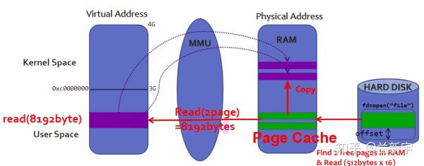

如果使用mmap()，则在磁盘数据加载到page cache后，用户进程可以通过指针操作直接读写page cache，不再需要系统调用和内存拷贝。看起来mmap()好像完胜read()有没有？其实，mmap()在数据加载到page cache的过程中，会触发大量的page fault和建立页表映射的操作，开销并不小，因为 mmap 只是建立了 VMA 与文件的映射关系，并没有真正的建立页表，因此每次访问线性地址，其页表都是空的，需要通过请求调页建立页表映射关系。另一方面，随着硬件性能的发展，内存拷贝消耗的时间已经大大降低了。所以啊，很多情况下，mmap()的性能反倒是比不过read()和write()的。

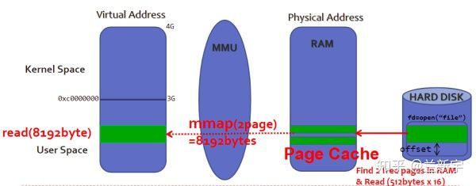

mmap()其实只是将一个文件的一部分内容映射到了进程虚拟地址空间中的一个VMA区域（关于VMA请参考这篇文章），并没有真正分配物理内存，只有等到进程真正访问这个VMA的时候，才会触发page fault，将这部分文件内容从磁盘拷贝到内存中。

linux中的文件是一个抽象的概念，并不是所有类型的文件都可以被mmap映射，比如目录和管道就不可以。一个文件可能被多个进程通过mmap映射后访问并修改，根据所做的修改是否对其他进程可见，mmap可分为共享映射和私有映射两种。

对于共享映射，修改对所有进程可见，也就是说如果进程A修改了其中某个page上的数据，进程B之后读取这个page得到的就是修改后的内容。有共享就有竞态（race condition），mmap本身并没有提供互斥机制，需要调用者在使用的过程中自己加锁。共享文件映射的一个应用场景就是两个进程共同读写一个文本文件.

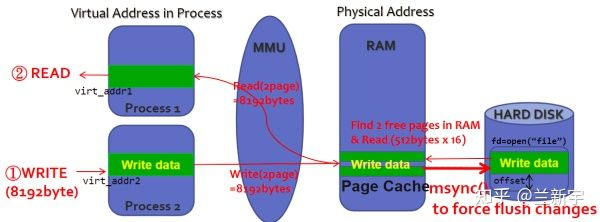

对于私有映射，进程A的修改对进程B是不可见的，都是同一份数据，这是如何做到的呢？这里利用的是 Copy On Write(COW)机制。当进程A试图修改某个page上的数据时，内核会将这个page的内容拷贝一份，之后A的写操作实际是在这个拷贝的page上进行的（进程A中对应这个page的页表项也需要被修改，以指向新拷贝的page），这样进程B看到的这个page还是原来未经改动的。这种修改只会存在于内存中，不会同步到外部的磁盘文件上（事实上也没法同步，因为不同进程所做的修改是不同的）。私有文件映射最典型的应用就是进程对动态链接库（比如libc.so）的使用。

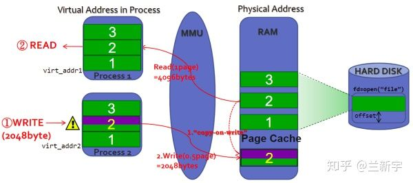

以上介绍了的是mmap基于文件的映射（file-backed），其实mmap还可以用于对没有文件关联的内容进行映射，也就是匿名映射（anonymous）。同文件映射一样，匿名映射也有共享映射和私有映射两种。

共享匿名映射的一个典型应用是作为进程间通信机制的POSIX共享内存。在linux中，POSIX共享内存是通过挂载在/dev/shm下的tmpfs内存文件系统实现的，创建的每一个共享内存都对应tmpfs中的一个文件，因此POSIX共享内存也可视为共享文件映射。

而私有匿名映射可以用来实现glibc中的malloc()。传统的malloc()实现靠的是brk，通常brk用于分配小块内存，mmap则用于分配大块内存，这个分界的阈值默认是128KB（可通过mallopt函数调整）。

#### mmap 函数

```
#include <sys/mman.h>
void *mmap(void *addr, size_t length, int prot, int flags, int fd, off_t offset);

```

看起来参数好像比较多，但对照着下面这张图看，应该会清晰不少。

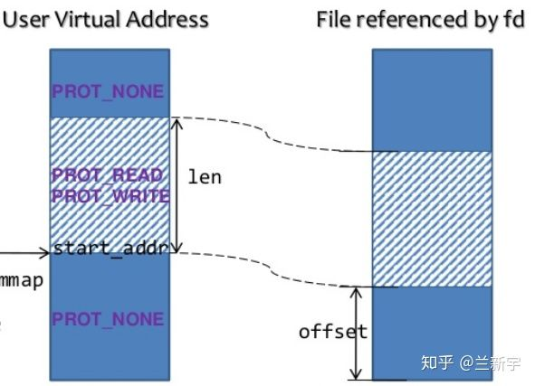

其中fd, offset和length都是用来描述要映射的文件区域的，fd是文件描述符，对于匿名映射，fd应该是-1（如果是通过打开/dev/zero这个特殊的文件来创建匿名映射，则它也是有正常的fd值的）。offset是文件中映射的起始位置，length是映射的长度。如果访问了超出映射的区域，则有可能触发SIGSEGV异常(segmentation fault)。为什么说是有可能呢？因为只有访问的地址没有落在进程的任何VMA（关于VMA请参考这篇文章）里，才应该触发SIGSEGV，如果超出映射的这段区域正好落在另一个VMA里，那就可以侥幸逃过SIGSEGV。其实这样更糟糕，触发SIGSEGV可以让你及时知道事故的第一现场，如果继续运行，然后在某个不可预知的地方崩溃，那这bug排查起来就困难了。

linux是以page为单位管理内存的，mmap也是以page为单位建立映射的，因此offset必须是按page size对齐的（不对齐的话就会映射失败）。文件是有长度的，offset和offset+length的值都应该小于被映射文件的长度，然而，mmap()并不会对此作出检查，所以有可能建立的映射区域并不完全在文件的长度范围内。比如一个文件的长度是4KB，而你映射了8KB，那么在访问后面的这4KB内存的时候，就会触发SIGBUS异常，表明你访问的这段内存区域，没有对应的文件。

你以为只要保证映射的区域完全落在文件的长度范围内就可以高枕无忧了么？事务都是变化的，被映射的文件也不例外，比如它可以通过truncate()/ftruncate()截断，截断之后文件的长度如果减小了（truncate()是可以增大的），然后你刚好访问了被截断的这段区域，依然会触发SIGBUS。

flags用于指定映射是基于文件的还是匿名（MAP_ANONYMOUS）的，是共享的（MAP_SHARED）还是私有的（MAP_PRIVATE）。上文介绍过，共享映射和私有映射在写操作上是有区别的，前者是直接写，后者是COW，先copy再写。

addr用于指定映射到的VMA的起始地址，也必须按page size对齐。映射是由内核完成的，但进程可以通过addr参数建议一个它认为的最佳地址（没有这种要求就设置addr为NULL），毕竟进程最了解它自身的应用场景嘛，但这对内核来说不是强制的，如果addr和addr+length之间的虚拟内存空间恰好是可用的，那么内核会满足进程的这一要求。如果flags中加上MAP_FIXED，那就是进程要求必须映射到这个addr起始的区域，当然，这会增加映射失败的概率。

## 内存分段寻址

### 内存地址

- 逻辑地址 logical address 

    包含在机器语言指令中用来指定一个操作数或一条指令的地址。每一个逻辑地址都由一个段segment和偏移量offset或displacement组成，偏移量指明了从段开始的地方到实际地址之间的距离。 
    
    早期的8086处理器寄存器宽度只有16位，16位的寄存器只能进行 64 KB 的寻址，而 8086 有 20 根地址线，按照地址线来计算可以进行 1 MB 的寻址，所以16 位宽度的寄存器是显然不能满足需求的，为了解决这个问题，聪明的程序员想出了用 段基址：段内偏移 的方式来扩展寻址空间。
    
    在实模式下，段寄存器直接存放的就是段基址，比如 CPU 中用来存放当前指令地址的 CS：IP 寄存器，CS 中存放的便是代码段的基址。

- 线性地址 linear address， virtual address 

    一个32位无符号整数，可以用来高达4GB的地址。通常使用十六进制表示，范围从0x00000000到0xffffffff。 

- 物理地址 physical address 

    用于内存芯片级内存单元寻址。他们与从微处理器的地址引脚发送到内存总线上的电信号相对应。物理地址由32位或64位无符号整数表示。

内存管理单元MMU通过一种称为分段单元 segmentation unit 的硬件电路把一个逻辑地址转换为现行地址；接着，第二个称为分页单元paging unit的硬件电路把线性地址转换为一个物理地址。 

分段可以给每一个进程分配不同的线性地址空间，而分页可以把同一线性地址空间映射到不同的物理空间。

### 实模式与保护模式

计算机中实模式就是要求计算机操作系统给每一个正在运行的程序访问所有内存的权利，而我们知道电脑中的某些内存是不能被访问的，因为这些内存关乎到电脑是否能够稳定的运行；因此我们必须将访问特定内存块的权利牢牢的掌握在操作系统的手中。

在实模式转换到保护模式的过程中就是权利交接的过程，将电脑中访问特定内存的权利牢牢交到操作系统的手中。当程序运行在保护模式下的时候，某个特定的程序要访问相应的内存的时候将要访问的地址交到操作系统的手中，然后操作系统会对要申请的地址进行转换或者进行检查并返回相应的地址以供程序使用；这样就能保证电脑的稳定运行。

在实模式下，段寄存器直接存放的就是段基址，比如 CPU 中用来存放当前指令地址的 CS：IP 寄存器，CS 中存放的便是代码段的基址。

在保护模式下，很重要的一点就是段寄存器不是直接存放段基址了，而是存放着段选择子。

### 段选择符和段寄存器 

一个逻辑地址由两部分组成：一个段标识符和一个指定段内相对地址的偏移量。段标识符是一个16位长的字段，称为段选择符segment selector，偏移量是一个32位长的字段。 

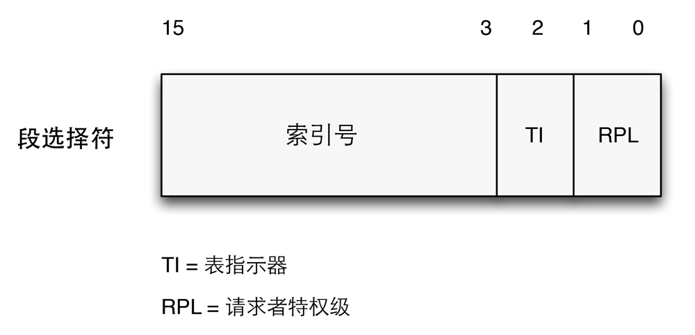

为了快速方便地找到段选择符，处理器提供段寄存器，段寄存器的唯一目的是存放段选择符。这些段寄存器称为cs，ss，ds，es，fs和gs。程序可把一个段寄存器用于不同的目的，先将值保存到内存中，用完之后再恢复。 

6个寄存器中3个有专门的用途： 

- cs 代码段寄存器，指向包含程序指定的段。
- ss 栈段寄存器，指向包含当前程序栈的段。 
- ds 数据段寄存器，指向包含静态数据或者全局数据段。

cs寄存器还有一个很重要的功能，它包含一个两位的字段，用以指明CPU的当前特权等级Current Privilege Level，CPL。0表示最高优先级，3表示最低优先级。Linux使用0和3来表示内核态和用户态。 


|字段名	 | 说明
| ------ | ------ | 
|index	| 指定了放在GDT或LDT中的相应段描述符的入口
|TI	 | TI（Table Indicator）标志，指明了段描述符是在GDT中或是在LDT中1。
|RPL |  请求者特权级，当相应的段选择符装入到cs寄存器中时指示出CPU当前的特权级，它还可以用于访问数据段时由选择地削弱处理器的特权级


### 段描述符

每个段由一个8字节的段描述符（Segment Descriptor）表示，它描述了段的特征。段描述符放在全局描述符表（Global Descriptor Table，GDT）或局部描述符表（Local Descriptor Table，LDT）中。

通常只定义一个GDT，而每个进程除了存放在GDT中的段之外如果还需要创建附加的段，可以拥有自己的LDT。GDT在主存中的地址和大小存在gdtr控制寄存器中，当前正被使用的LDT地址和大小放在ldtr控制寄存器中。

|字段名	 | 说明
| ------ | ------ | 
| Base | 包含段的首字节的线性地址
| S | 系统标志，如果被置为0，则这是一个系统段，否则为普通的代码段或者数据段
| Type | 描述了段的类型特征和它的存取权限
| DPL | 描述符特权等级字段，用于限制这个段的存取。它表示为访问这个段而要求的CPU最小的优先级，因此DPL设置为0的段只能当CPL为0时，也就是内核态才可以访问。DPL设为3则堆任何CPL值都是可访问的

### 快速访问段描述符

每当一个段选择符被装入段寄存器时，相应的段描述符就由内存装入到对应的非编程CPU寄存器。从那时起，针对那个段的逻辑地址转换就可以不访问主存中的GDT或LDT。处理器只需直接引用存放段描述符的CPU寄存器即可。只有当段寄存器的内容改变时，才有必要访问GDT或LDT。

由于一个段描述符是8字节长，因此它在GDT或LDT内的相对地址是由段选择符的最高13位的值乘以82得到的。例如如果GDT在0x000200003，且由段选择符所指定的索引号为2，即段选择符中的index值为2.那么相应的段描述符地址是0x00020000 + (2*8)。能够保存在GDT中的段描述符的最大数目是8191，即2^13-1。

这样就可以在GDT中找到段描述符的地址。

### 分段单元

分段单元（segmentation）执行下列操作：

- 先检查段选择符中的TI字段，以决定段描述符保存在哪一个描述符表中，TI=1则在LDT中，TI=0则在GDT中。如果在GDT中，分段单元从gdtr寄存器中得到GDT的线性地址，否则从ldtr寄存器中得到LDT的线性地址。

- 从段选择符的index字段计算段描述符的地址，index字段的值乘以8，这个结果与gdtr或ldtr的内容相加。

- 把逻辑地址的偏移量与段描述符的Base字段的值相加就得到了线性地址。

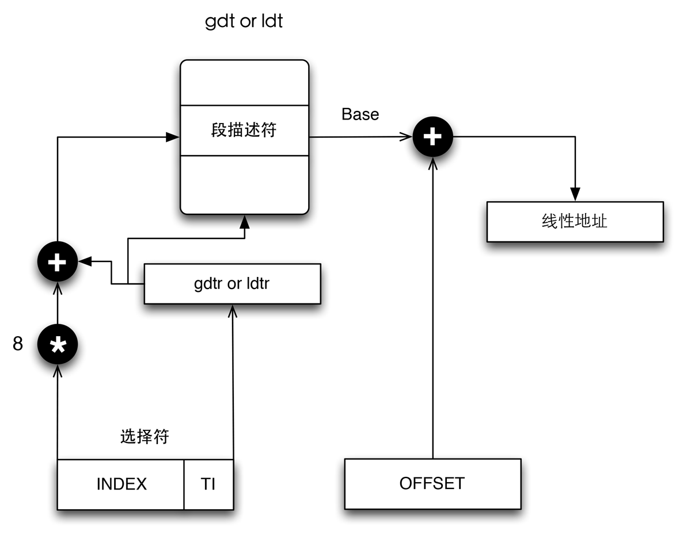

### DPL、RPL、CPL 的联系与区别

CPL是当前进程的权限级别(Current Privilege Level)，是当前正在执行的代码所在的段的特权级，存在于cs寄存器的低两位。 
 
RPL 说明的是进程对段访问的请求权限(Request Privilege Level)，是对于段选择子而言的，每个段选择子有自己的RPL，它说明的是进程对段访问的请求权限，有点像函数参数。而且RPL对每个段来说不是固定的，两次访问同一段时的RPL可以不同。RPL可能会削弱CPL的作用，例如当前CPL=0的进程要访问一个数据段，它把段选择符中的RPL设为3，这样虽然它对该段仍然只有特权为3的访问权限。

DPL 存储在段描述符中，规定访问该段的权限级别(Descriptor Privilege Level)，每个段的DPL固定。
当进程访问一个段时，需要进程特权级检查，一般要求DPL >= max {CPL, RPL}

下面打一个比方，中国官员分为6级国家主席1、总理2、省长3、市长4、县长5、乡长6，假设我是当前进程，级别总理（CPL=2）,我去聊城市(DPL=4)考察(呵呵),我用省长的级别(RPL=3 这样也能吓死他们:-))去访问,可以吧，如果我用县长的级别，人家就不理咱了(你看看电视上的微服私访，呵呵)，明白了吧！为什么采用RPL，是考虑到安全的问题，就好像你明明对一个文件用有写权限，为什么用只读打开它呢，还不是为了安全！


### Linux中的分段

与分段相比，Linux更喜欢分页的方式：

- 当所有进程使用相同的段寄存器时，内存管理变得简单，它们可以共享同一组线性定制。
- Linux设计目标之一时可以把它移植到绝大多数留下的处理器平台上，然而RISC1体系结构对分段的支持有限

运行在用户态的所有Linux进程都使用一对相对的段来对指令和数据寻址。这两个段就是所谓的用户代码段和用户数据段，类似地，运行在内核态的所有Linux进程都使用一对相同的段对指令和数据寻址：它们分别叫做内核代码段和内核数据段。

相应的段选择符由宏__USER_CS，__USER_DS，__KERNEL_CS和__KERNEL_DS分别定义。如果为了对内核代码段寻址，内核只需要把__KERNEL_CS装进cs段寄存器就好。而对内核数据段寻址，则将__KERNEL_DS装进ds段寄存器。

所有与段相关的线性地址从0开始，到达2^32-1的寻址限长。所以用户态或内核态下的所有进程可以使用相同的逻辑地址。而所有段从0开始，可以得出，在Linux下逻辑地址与线性地址是一致的，即逻辑地址的偏移量字段的值与相应的线性地址的值总是一致的。

当对指向指令或者数据结构指针进行保存时，内核根本不需要为其设置逻辑地址的段选择符。因为cs寄存器就含有当前的段选择符。例如，当内核调用一个函数时，它执行一条call汇编语言指令，该指令仅仅指定其逻辑地址的偏移量部分。而段选择符不用设置，它已经隐含在cs寄存器中了。因为在内核态执行的段只有一种，叫做代码段，由宏__KERNEL_CS定义。

CPU当前的特权级（CPL）反映了进程是在用户态还是内核态，并由存放在cs寄存器中的段选择符的RPL字段指定。只要当前特权级被改变，一些段寄存器必须相应地更新。例如CPL=3时，说明在用户态，ds寄存器必须含有用户端的段选择符，如果进入内核态，则CPL=0，ds寄存器则必须含有内核数据段的段选择符。

这种情况也出现在ss寄存器中，当CPL为3时，它必须指向一个用户数据段中的用户栈。当CPL=0时，它必须指向内核数据段中的一个内核栈。当状态转换时，Linux总是确保ss寄存器中装有相应权限的数据段的段选择符。

所以只要当CPU切换到内核态时将__KERNEL_CS装载到cs就足够了。同样的道理也适用于指向内核数据结构的指针以及指向用户结构的指针。实际上这里只需要了解，每当CPU特权级更新，内核就应该保证相应的寄存器存放相应的段选择符。

### Linux GDT

在单处理器系统只有一个全局描述符表（GDT），在多处理器中每个CPU对应一个GDT。

每一个GDT中包含的18个段描述符指向下列的段：

用户态和内核态下的代码段和数据段，如__USER_CS，__USER_DS，__KERNEL_CS和__KERNEL_DS。

任务状态段（TSS），每个处理器有1个，每个TSS相应的线性地址空间都是内核数据段相应线性地址空间的一个小子集。所有的任务状态段都是顺序地存放在init_tss数组中。

3个局部线程存储（Thread-Local Storage，TLS）段：这种机制允许多线程应用程序使用最多3个局部线程的数据段。系统调用set_thread_area和get_thread_area分别为正在执行的进程创建和撤销一个TLS段

## 内存分页寻址

### 硬件中的分页

分页单元（paging unit）把线性地址转换成物理地址，其中一个关键任务是把所请求的访问类型与线性地址的访问权限相比较，如果这次访问是无效的，就产生一个缺页异常。

为了效率起见，线性地址被分成以固定长度为单位的组，称为页（page）。页内部连续的线性地址被映射到连续的物理地址中。这样，内核可以指定一个页的物理地址和其存取权限，而不用指定页所包含的全部线性地址的存取权限。

我们使用『页』既指一组线性地址，又指包含在这组地址中的数据。

分页单元把所有的RAM分成固定长度的页框（page frame），有时候页叫做物理页。每一个页框包含一个页，也就是说一个页框的长度与一个页的长度一致。页框是主存的一部分因此也是一个存储区域。

区分一个页和一个页框1很重要，页只是一个数据块，可以存放在任何页框或磁盘中。

把线性地址映射到物理地址的数据结构称为页表（page table），页表存放在主存中，并在启动分页单元之前必须由内核对页表进行适当的初始化。从80386开始，所有的80x86处理器都支持分页，它通过设置cr0寄存器的PG标志启用。当PG=0时，线性地址就被解释成物理地址。

### 常规分页

从80386开始，Intel处理器的分页单元处理4KB的页。32位的线性地址被氛围3个域：

- Directory（目录）：最高10位。
- Table（页表）：中间10位。
- Offset（偏移量）：最低12位。

线性地址的转换分两步完成，每一步都基于一种转换表，第一种转换表称为页目录表（page directory），第二种转换表称为页表（page table）。

使用这种二级模式的目的在于减少每个进程页表所需RAM的数量。如果使用简单的一级页表，那将需要高达2^20个表项来表示每个进程的页表。即使一个进程并不使用那个范围内的素有地址。二级模式通过置位进程实际使用的哪些虚拟内存区请求页表来减少内存的使用量。

每个活动进程必须有一个分配给它的页目录。不过，没有必要马上位进程的所有页表都分配RAM，只有进程在实际需要一个页表是才给该页表分配RAM会更有效率。正在使用的页目录的物理地址存放在控制寄存器cr3中。线性地址内的Directory字段决定页目录中的目录项，而目录项指向适当的页表。

地址的Table字段依次又决定页表中的表项，而表项含有页所在页框的物理地址。Offset字段决定页框内的相对位置，如下图。

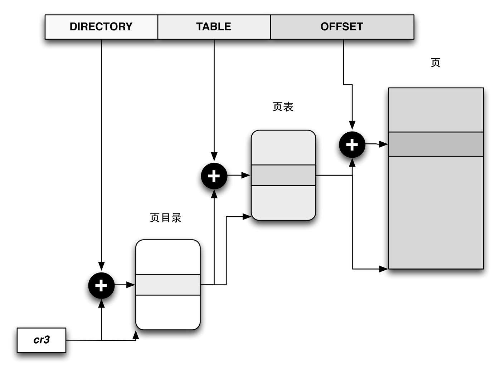

|字段名	 | 说明
| ------ | ------ | 
|Field	|由于每个页框有4KB的容量，那么它的物理地址必须是4096的倍数，因此物理地址的最低12位总是为0.如果这个字段指向一个页目录，相应的页框就含有一个页表，如果它指向一个页表，相应的页框就含有一页数据
|Present	|Present=1则说明所指的页或页表就在主存中，如果为0，则这一页不在主存中。这个表项的剩余的位可由操作系统用于自己的目的。如果执行一个地址转换所需的页表项或页目录项中的Present标志为0，那么分页单元就把该线性地址存放在寄存器cr2中，并产生缺页异常
|Dirty	|只应用于页表项中，每当对一个页框进行写操作时就设置这个标志，与Accessed标志一样，当选中的页被交换出去时，这个标志就可以由操作系统使用
|Accessed	|每当分页单元对相应页框进行寻址时就设置这个标志。当选中的页被交换出去时，这个标志就可以由操作系统使用
|User/Supervisor	|含有访问页或页表所需的特权级
|Read/Write	|含有页或页表的存取权限
|Page Size	|值应用于页目录项，如果设置为1，则页目录指定的是2MB或4MB的页框
|PCD/PWT	|控制硬件高速缓存处理页或页表的方式
|Global	|只应用于页表项，这个标志是在Pentium Pro引入的，用来防止常用页从TLB告诉缓存中刷新出去。只有在cr4寄存器的页全局启用（PGE）标志置位时这个标志才起作用。

### 扩展分页

从Pentinum模型开始，80x86微处理器引入了扩展分页（extended paging），它允许页框大小为4MB而不是4KB。扩展分页用于把大段连续的线性地址转换成相应的物理地址。在这些情况下，内核可以不用中间页表进行转换

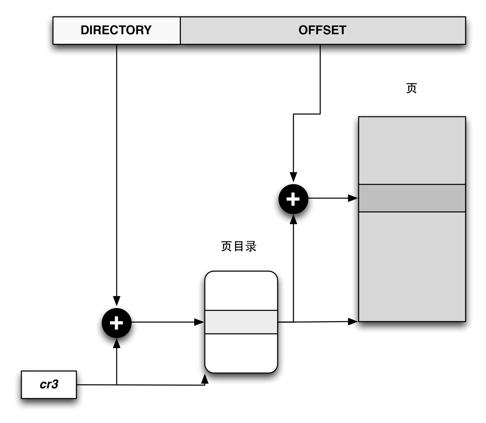

如上图所述，通过设置页目录项的Page Size标志启用扩展分页乖哦能，在这种情况下，分页单元把32位线性地址分成两个字段：

- Directory: 最高10位。
- Offset: 其余22位。
扩展分页和正常分页的页目录基本相同，除了以下两点：

- Page Size标志必须被设置。
- 20位物理地址字段只有最高10位时有意义的，因为每一个物理地址都是在以4MB为辩解的地方开始，所以这个地址的低22位为0.

通过设置cr4处理器寄存器的PSE标志能使扩展分页与常规分页共存。

### 常规分页举例

这里有一个简单的例子阐明常规分页是如何工作的，假定内核已给一个正在运行的进程分配的线性地址空间范围是0x200000000到0x2003ffff，这个空间正好由64个页组成3。

我们从分配给进程的线性地址的最高10位，也就是Directory字段开始，这两个地址都以2开头后面跟着0，所以高10位有相同的值：0010 0000 00，即0x080或十进制的128。因此，这两个地址的Directory字段都指向进程页目录的第129项。相应的目录项中必须包含分配给该进程的页表的物理地址。如果没有，则页目录的其余1023项都填0.

中间10位的值，也就是Table字段，其范围从0到0x03f，十进制的从0到63，因而只有页表的前64项是有意义的，其余的960个表项都填0.

假设进程需要读线性地址0x20021406中的字节，这个地址由分页单元按下面方法处理：

- Directory字段的0x80用于选择页目录的0x80目录项，此目录项指向和该进程的页相关的页表。
- Table字段0x21用于选择页表的第0x21表项，指向了包含所需页的页框。
- Offset字段0x406用于在目标页框中度偏移量位0x406中的字节。

如果0x21表项的Present标志为0，则说明此页不在主存当中，这种情况会产生一个缺页异常。当然，当进程试图访问任何超过0x200000000到0x2003ffff地址空间的范围之外的线性地址时，都会产生一个缺页异常。

### 硬件高速缓存

为了缩小CPU和RAM之间的速度不匹配，引入了硬件高速缓存（hardware cache memory）

为此，80x86体系结构中引入了一个叫行（line）的单位。行由几十个连续的字节组成，它们以脉冲突发模式在慢速DRAM和快速的用来实现高速缓存的片上静态RAM（SRAM）之间传送，用来实现高速缓存。

高速缓存再被细分为行的子集，在一种极端情况下，高速缓存可以是直接映射的，这时主存中的一个行总是存放在高速缓存中完全相同的位置。在另一种极端的情况下，高速缓存是充分关联的，这意味着主存中的任意一个行可以存放在高速缓存中的任意位置。但大多数高速缓存在某种成都上是N-路关联的，意味着主存中的任意一个行可以存放在高速缓存N行中的任意一行中。

高速缓存单元插在分页单元和主内存之间，它包含一个硬件高速缓存内存和一个高速缓存控制器。高速缓存内存存放内存中真正的行。高速缓存控制器存放一个表项数组，每个表项对应高速缓存内存中的一个行。每个表项有一个标签和描述高速缓存状态的几个标志

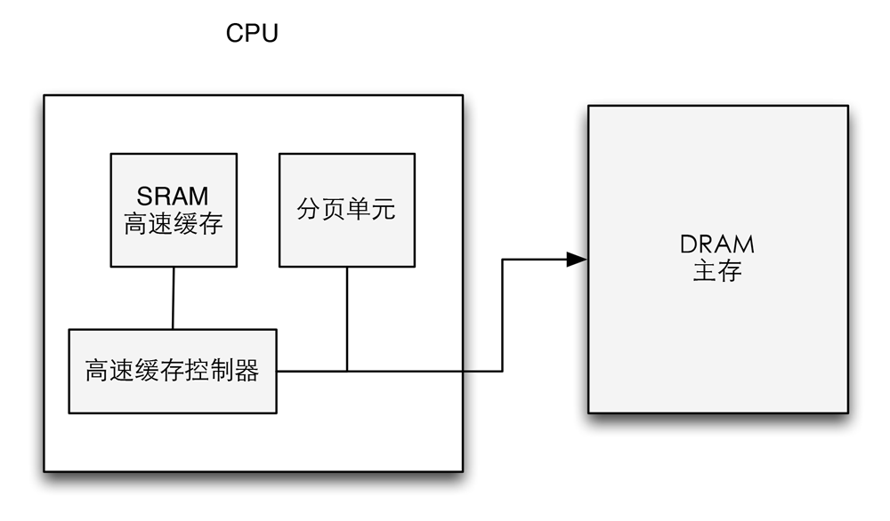

当访问一个RAM存储单元时，CPU从物理地址中提取出子集的索引号并把子集中所有行的标签与物理地址的高几位比较，如果发现某个行标签与这个物理地址的高位相同，则CPU命中一个高速缓存。

### MMU

MMU是处理器/核（processer）中的一个硬件单元，通常每个核有一个MMU。

MMU由两部分组成，TLB（Translation Lookaside Buffer）和table walk unit。

### TLB

除了通用硬件高速缓存之外，80x86处理器还包含了另一个称为转换后援缓冲期或TLB（Translation Lookaside Buffer）的高速缓存用于存储物理地址，从而加快了线性地址的转换。当一个地址被第一次使用时，通过慢速访问RAM中的页表计算出相应的物理地址，同时物理地址被存放在一个TLB表项中。以便以后使用。

在多处理器系统中，每个CPU都有自己的本地TLB，TLB中的对应项不必同步，因为运行在现有的CPU上的进程可以使用同一线性地址与不同的物理地址发生联系。当CPU的cr3控制寄存器被修改时，硬件自动使本地的TLB中的所有项都无效，这是因为新的一组页表被启用而TLB指向的是旧数据。

如果在TLB中找到了含有该虚拟地址的entry（TLB hit），则可从该entry【2】中直接获取对应的物理地址，否则就不幸地TLB miss了，就得去查找当前进程的page table

如果在page table中找到了该虚拟地址对应的entry的p（present）位是1，说明该虚拟地址对应的物理页面当前驻留在内存中，也就是page table hit。找到了还没完，接下来还有两件事要做：

- 既然是因为在TLB里找不到才找到这儿来的，自然要更新TLB
- 进行权限检测，包括可读/可写/可执行权限，user/supervisor模式权限等。如果没有正确的权限，将触发SIGSEGV（Segmantation Fault）

如果该虚拟地址对应的entry的p位是0，就会触发page fault，可能有这几种情况：

- 这个虚拟地址被分配后还从来没有被access过（比如malloc之后还没有操作分配到的空间，则不会真正分配物理内存）。触发page fault后分配物理内存，也就是demand paging，有了确定的demand了之后才分，然后将p位置1。
- 对应的这个物理页面的内容被换出到外部的disk/flash了，这个时候page table entry里存的是换出页面在外部swap area里暂存的位置，可以将其换回物理内存，再次建立映射，然后将p位置1。

### 地址转换案例分析

假设当前CPU支持的虚拟地址是14位，物理地址是12位，page size为64字节。

这里要说明一下，通常情况下呢，虚拟地址和物理地址的位数是一样的，但其实并不一定需要一样，因为本来就可以多个虚拟地址指向同一个物理地址嘛。

不管是虚拟地址还是物理地址，因为最小管理单位都是page，在转换过程中，代表page内的偏移地址（offset）的低位bits部分是不需要参与的，需要转换的只是代表page唯一性标识的高位bits部分，称作page number。由此产生了4个概念：VPN（virtual page number），PPN（physical page number），VPO（virtual page offset）和PPO（physical page offset）

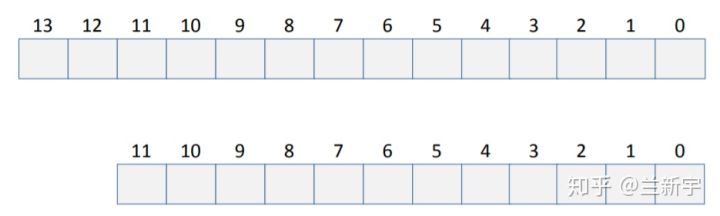

VPO和PPO占的bit位数为 [公式] ，p为page size大小，即64，因而VPO和PPO的值为6。

因为所有pages都是同样大小的，所以VPO始终等于PPO。

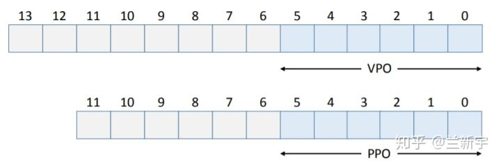

虚拟地址中剩下的bit位就成了VPN，物理地址中剩下的bit位就成了PPN。

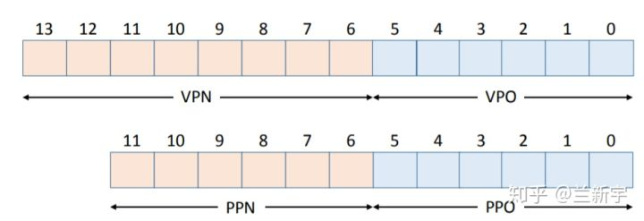

假设我们的TLB一共有16个entries，是4路组相关（4-way set associative）的，则有16/4=4个sets。TLB本身就是一个hardware cache

TLB Index（以下简称TI）的值为 [公式] =2，剩下的bit位就成了TLB Tag（以下简称TT）。

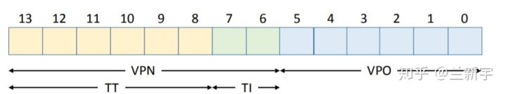

下面，我们准备读取虚拟地址为0x0334处的内容。

- 将这一地址分割成VPN和VPO

  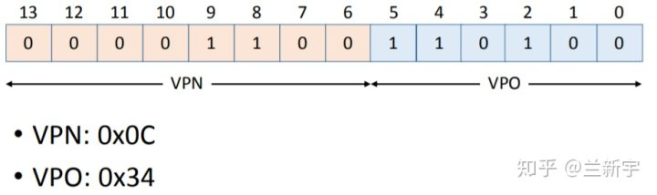

- 将VPN分割成TT和TI

 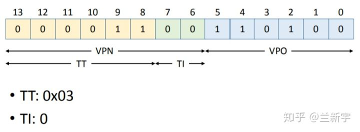

- 使用TT (0x03) 和TI (0) 在TLB中查找。

    作为cache，TLB index是用来索引的，不会存储在TLB entry中，TLB entry中存的只有tag, 权限位，有效位和内容（对于TLB来说就是PPN）。

    假设现在TLB中的内容是这样的（这里为了简化，省略了permission bits）：
 
    一个TLB entry的构成如下：
    
    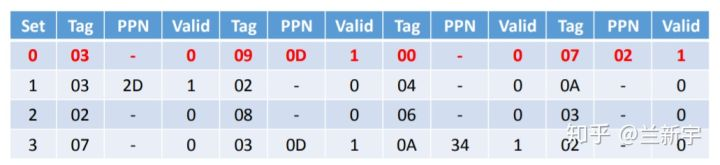
    
    虽然在set/index为0这一行，找到了tag为03的一个entry，但这个entry中PPN是不存在的，整个entry目前是invalid的，也就是说TLB miss了，需要去page table中找。
    
- 使用VPN (0x0C) 作为index在page table中查找。

    index作为索引，也是不会存储于page table entry中的，PTE存的只有权限位，有效位和内容（对于PTE来说也是PPN）。

    假设现在的page table是这样的（同样为了简化，省略了permission bits）：
    
    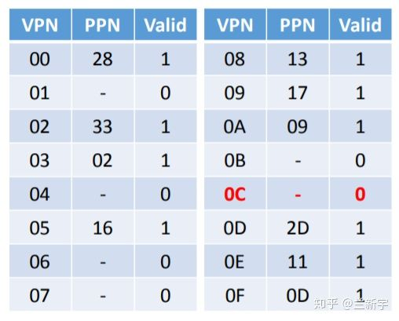
    
    
    对应的PTE（page table entry）中的PPN不存在，依然是invalid的，这将触发一个page fault。

### Linux中的分页

Linux采用了一种兼容32位和64位系统的普通分页模型。在32位系统模型中，两级分页已经足够了，但在64位系统中需要更多的分页级别。直到2.6.10版本，Linux采用三级分页模型，从2.6.11之后，采用了四级分页模型1。这4种页表分别为：

- 页全局目录（Page Global Directory）
- 页上级目录（Page Upper Directory）
- 页中间目录（Page Middle Directory）
- 页表（Page Table）

页全局目录包含若干页上级目录的地址，页上级目录又包含页中间目录的地址，依次类推，页中间目录则包含页表的目录地址。而每个页表指向一个页框。线性地址因此被划分成五个部分。下图的线性地址并没有显示位数，因为每一部分的大小跟具体的计算机体系结构相关。

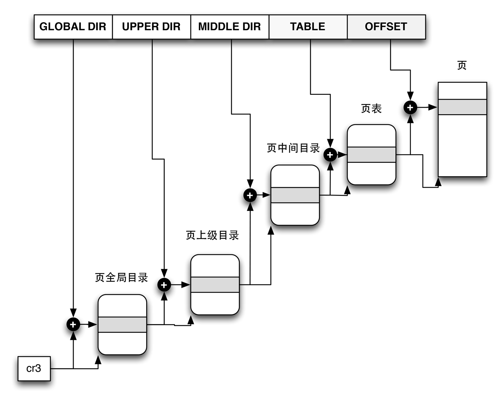

上图显示了一个Linux的四级分页中是如何通过页目录找到页表然后寻址到相应的页。实际上，和之前两级分页的概念一样。针对32位系统。Linux取消了上级页目录和中间页目录字段。不过，页上级目录和页中间目录在指针中的位置被保留，以便同样的代码在32位系统和64位系统下都能使用。

最后，64位系统使用三级还是四级目录取决于硬件对线性地址的划分。

Linux的进程处理依赖于分页，实际上，线性地址到物理地址的自动转换使得下面的设计目标得以实现：

- 给每一个进程分配一块不同的物理地址空间，确保了可以有效地防止寻址错误。
- 区别页和页框2的不同，就允许存放在某个页框中的一个页，然后保存到磁盘上，以后重新装入这一页时又可以被装在不同的页框中。这是虚拟内存机制的基本要素。

每一个进程有它自己的页全局目录和自己的页表集，当发生进程切换时，Linux把cr3寄存器的内容保存在前一个执行进程的描述符中，然后把下一个要执行进程的描述符的值装入到cr3寄存器中。因此当新进程重新开始在CPU上执行时，分页单元指向一组正确的页表。

### 进程切换分析：TLB处理

CPU上运行了若干的用户空间的进程和内核线程，为了加快性能，CPU中往往设计了TLB和Cache这样的HW block。Cache为了更快的访问main memory中的数据和指令，而TLB是为了更快的进行地址翻译而将部分的页表内容缓存到了Translation lookasid buffer中，避免了从main memory访问页表的过程。

假如不做任何的处理，那么在进程A切换到进程B的时候，TLB和Cache中同时存在了A和B进程的数据。对于kernel space其实无所谓，因为所有的进程都是共享的，但是对于A和B进程，它们各种有自己的独立的用户地址空间，也就是说，同样的一个虚拟地址X，在A的地址空间中可以被翻译成Pa，而在B地址空间中会被翻译成Pb，如果在地址翻译过程中，TLB中同时存在A和B进程的数据，那么旧的A地址空间的缓存项会影响B进程地址空间的翻译，因此，在进程切换的时候，需要有tlb的操作，以便清除旧进程的影响，具体怎样做呢？我们下面一一讨论。

#### 绝对没有问题，但是性能不佳的方案

当系统发生进程切换，从进程A切换到进程B，从而导致地址空间也从A切换到B，这时候，我们可以认为在A进程执行过程中，所有TLB和Cache的数据都是for A进程的，一旦切换到B，整个地址空间都不一样了，因此需要全部flush掉（注意：我这里使用了linux内核的术语，flush就是意味着将TLB或者cache中的条目设置为无效，对于一个ARM平台上的嵌入式工程师，一般我们会更习惯使用invalidate这个术语，不管怎样，在本文中，flush等于invalidate）。

这种方案当然没有问题，当进程B被切入执行的时候，其面对的CPU是一个干干净净，从头开始的硬件环境，TLB和Cache中不会有任何的残留的A进程的数据来影响当前B进程的执行。当然，稍微有一点遗憾的就是在B进程开始执行的时候，TLB和Cache都是冰冷的（空空如也），因此，B进程刚开始执行的时候，TLB miss和Cache miss都非常严重，

#### 如何提高TLB的性能？

对一个模块的优化往往需要对该模块的特性进行更细致的分析、归类，上一节，我们采用进程地址空间这样的术语，其实它可以被进一步细分为内核地址空间和用户地址空间。对于所有的进程（包括内核线程），内核地址空间是一样的，因此对于这部分地址翻译，无论进程如何切换，内核地址空间转换到物理地址的关系是永远不变的，其实在进程A切换到B的时候，不需要flush掉，因为B进程也可以继续使用这部分的TLB内容（上图中，橘色的block）。对于用户地址空间，各个进程都有自己独立的地址空间，在进程A切换到B的时候，TLB中的和A进程相关的entry（上图中，青色的block）对于B是完全没有任何意义的，需要flush掉。

在这样的思路指导下，我们其实需要区分global和local（其实就是process-specific的意思）这两种类型的地址翻译，因此，在页表描述符中往往有一个bit来标识该地址翻译是global还是local的，同样的，在TLB中，这个标识global还是local的flag也会被缓存起来。有了这样的设计之后，我们可以根据不同的场景而flush all或者只是flush local tlb entry。

#### 特殊情况的考量

我们考虑下面的场景：进程A切换到内核线程K之后，其实地址空间根本没有必要切换，线程K能访问的就是内核空间的那些地址，而这些地址也是和进程A共享的。既然没有切换地址空间，那么也就不需要flush 那些进程特定的tlb entry了，当从K切换会A进程后，那么所有TLB的数据都是有效的，从大大降低了tlb miss。此外，对于多线程环境，切换可能发生在一个进程中的两个线程，这时候，线程在同样的地址空间，也根本不需要flush tlb。

#### 进一步提升TLB的性能

还有可能进一步提升TLB的性能吗？有没有可能根本不flush TLB？

当然可以，不过这需要我们在设计TLB block的时候需要识别process specific的tlb entry，也就是说，TLB block需要感知到各个进程的地址空间。为了完成这样的设计，我们需要标识不同的address space，这里有一个术语叫做ASID（address space ID）。原来TLB查找是通过虚拟地址VA来判断是否TLB hit。有了ASID的支持后，TLB hit的判断标准修改为（虚拟地址＋ASID），ASID是每一个进程分配一个，标识自己的进程地址空间。TLB block如何知道一个tlb entry的ASID呢？一般会来自CPU的系统寄存器（对于ARM64平台，它来自TTBRx_EL1寄存器），这样在TLB block在缓存（VA-PA-Global flag）的同时，也就把当前的ASID缓存在了对应的TLB entry中，这样一个TLB entry中包括了（VA-PA-Global flag-ASID）。

有了ASID的支持后，A进程切换到B进程再也不需要flush tlb了，因为A进程执行时候缓存在TLB中的残留A地址空间相关的entry不会影响到B进程，虽然A和B可能有相同的VA，但是ASID保证了硬件可以区分A和B进程地址空间。

#### 多核的TLB操作

我们了解到地址翻译有global（各个进程共享）和local（进程特定的）的概念，因而tlb entry也有global和local的区分。如果不区分这两个概念，那么进程切换的时候，直接flush该cpu上的所有残余。这样，当进程A切出的时候，留给下一个进程B一个清爽的tlb，而当进程A在其他cpu上再次调度的时候，它面临的也是一个全空的TLB（其他cpu的tlb不会影响）。当然，如果区分global 和local，那么tlb操作也基本类似，只不过进程切换的时候，不是flush该cpu上的所有tlb entry，而是flush所有的tlb local entry就OK了。

对local tlb entry还可以进一步细分，那就是了ASID（address space ID）或者PCID（process context ID）的概念了（global tlb entry不区分ASID）。如果支持ASID（或者PCID）的话，tlb操作变得简单一些，或者说我们没有必要执行tlb操作了，因为在TLB搜索的时候已经可以区分各个task上下文了，这样，各个cpu中残留的tlb不会影响其他任务的执行。在单核系统中，这样的操作可以获取很好的性能。比如A---B--->A这样的场景中，如果TLB足够大，可以容纳2个task的tlb entry（现代cpu一般也可以做到这一点），那么A再次切回的时候，TLB是hot的，大大提升了性能。

不过，对于多核系统，这种情况有一点点的麻烦，其实也就是传说中的TLB shootdown带来的性能问题。在多核系统中，如果cpu支持PCID并且在进程切换的时候不flush tlb，那么系统中各个cpu中的tlb entry则保留各种task的tlb entry，当在某个cpu上，一个进程被销毁，或者修改了自己的页表（也就是修改了VA PA映射关系）的时候，我们必须将该task的相关tlb entry从系统中清除出去。这时候，你不仅仅需要flush本cpu上对应的TLB entry，还需要shootdown其他cpu上的和该task相关的tlb残余。而这个动作一般是通过IPI实现（例如X86），从而引入了开销。此外PCID的分配和管理也会带来额外的开销，因此，OS是否支持PCID（或者ASID）是由各个arch代码自己决定（对于linux而言，x86不支持，而ARM平台是支持的）。

### 扩展分页PAE机制

大型服务器需要大于4GB的RAM来同时运行上千的进程，Intel通过在它的处理器上把管脚数从32增加到36已经满足了这些需求。从Pentium Pro开始，Intel所有的处理器现在的寻址能力达2^36=64GB.不过，只有引入一种新的分页机制把32位线性地址转换为36位物理地址才能使用所增加的物理地址。

通过设置cr4控制寄存起中的物理地址扩展（PAE）标志激活PAE。页目录项中的页大小标志PS启动用大尺寸页，在PAE启用时，大小位2MB。当启用了PAE机制之后，系统的分页机制也做了相应的改变：

- 64GB的RAM，每个页框为 4k，因此被分为 2^36/2^12 = 2^24 个页框，想要定位到具体的某一个页框需要一个 24 位二进制数字，因此页表项的物理地址字段从20位扩展到了24位。
    
    因为PAE页表项必须包含12个标志位和24个物理地址位，总数之和位36，页表项向上取整占用 64 位，增加了一倍，结果一个4KB的页表包含512个表项而不是1024个表项。

- 引入一个叫做页目录指针表（Page Directory Pointer Table，PDPT）的页表新级别，它由4个64位表项组成。

- cr3控制寄存器包含一个27位的页目录指针表（PDPT）基地址字段。因为PDPT存放在RAM的前4GB中，并在32字节的倍数上对齐，因此27位足以表示这种表的基地址。

把线性地址映射到4KB的页时，页目录项中的PS标志清0，32位线性地址按下列方式解释：

|字段名	 | 说明
| ------ | ------ | 
|cr3	|指向一个PDPT
|31-30位	|指向PDPT中4个项中的一个
|29-21位	|指向页目录中512个项中的一个
|20-12位	|指向页表中512项中的一个
|11-0位	|4KB页中的偏移量

当把线性地址隐射到2MB的页时，页目录项中的PS标志为1，32位线性地址按下列方式解释：

|字段名	 | 说明
| ------ | ------ | 
|cr3	|指向一个PDPT
|31-30位	|指向PDPT中4个项中的一个
|29-21位	|指向页目录中512个项中的一个
|20-0位	|2MB页中的偏移量

显然，PAE并没有扩大进程的线性地址空间，因为它只能处理物理地址，