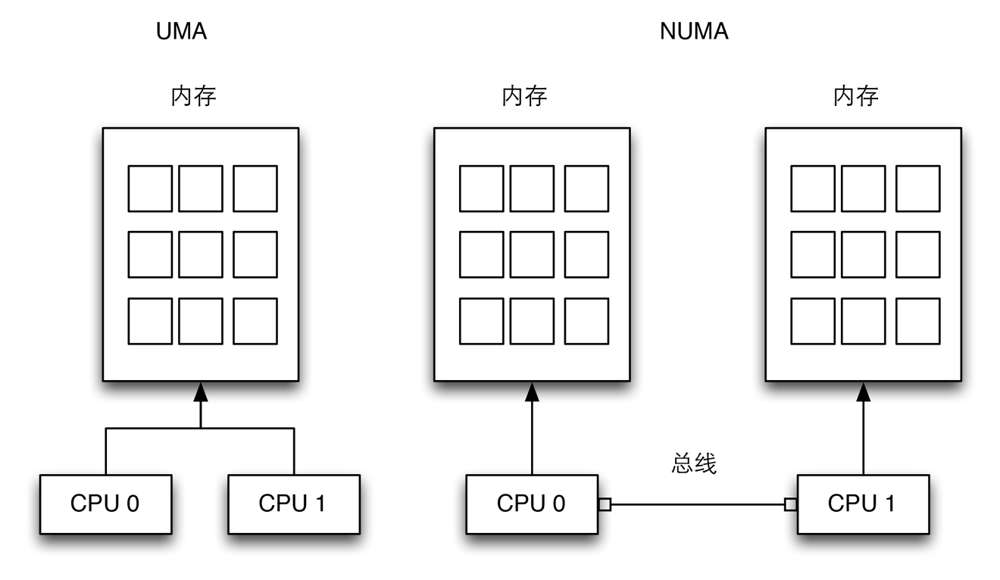

# 操作系统原理——内存管理(下)

[TOC]

## 物理内存页的管理

### 非一致内存访问



（1）：UMA计算机（一致内存访问，uniform memory access）将可用内存以连续方式组织起来，系统中的每个处理器访问各个内存都是同样的块。

（2）：NUMA计算机（非一致内存访问，non uniform memory access）总是多处理器计算机。系统的各个CPU都有本地内存，可支持特别快的访问，各个处理器之间通过总线连接起来。

### 结点

我们习惯性的认为计算机内存是一种均匀、共享的资源。在忽略硬件高速缓存作用的情况下，我们期望内存单元无论在何处，也不管CPU在何处，CPU对内存单元的访问都需要相同的时间。可惜事实并不如此。实际上，给定的CPU对不同内存单元的访问时间可能不一样。系统的物理内存被分为好几个结点。

内存划分为结点(node)，每个结点关联到系统中的一个处理器。各个结点又划分为内存域（Zone），这是内存的进一步细分。大致结构如下：


当linux内核收到内存分配的请求时，它会优先从发出请求的CPU本地或邻近的内存node中寻找空闲内存，这种方式被称作local allocation，local allocation能让接下来对被分配内存的访问相对底层的物理资源是local的。

表示node的结构体pglist_data。

### 管理区

Linux把每个内存结点的物理内存划分为3个管理区，ZONE_DMA、ZONE_NORMAL、ZONE_HIGHMEM。

zone在linux中用zone_struct结构体表示。

每个node由一个或多个zone（我们经常在各种对虚拟内存和物理内存的描述中迷失，但以后你见到zone就知道指的是物理内存）组成，每个zone又由若干page frames（一般page frame都是指物理页面）组成。


### 页描述符

内核必须记录每个页框当前的状态，例如，内核必须能够区分哪些页框包含的是属于进程的页而哪些页框包含的是内核代码或内核数据。类似的，内核还必须能够确定动态内存中的页框是否空闲。如果动态内存中的页框不包含有用的数据，那么这个页框就是空的。

页框的状态信息保存在一个类型为page的页描述符中.

其中重要的两个字段为_count和flags。

- _count是页的引用计数器，如果字段为-1，则相应的页框空闲，并可以被分配给任意一个进程甚至内核本身，如果该字段大于或等于 0，则说明页框被分配给了一个或多个进程，用于存放一些内核数据结构。
- flags包含多大32个用来描述页框标志的状态，对于每个PG_xxx标志内核都定义了操作其值的一些宏。

所有的页描述符存放在mem_map数组中。virt_to_page(addr)宏产生线性地址addr对应的页描述符地址。

### 获取物理内存

- 分区页框分配器

    内核有一个子系统，称之为分区页框分配器（zoned page frame allocator），这个子系统处理对连续页框组的内存分配请求，其主要组成如下。
    
    

    在每个管理区内，页框被名为『伙伴系统』的部分来处理，为大刀更好的系统性能，一小部分页框保留在高速缓存中用于快速地满足对单个页框分配的请求。
    
- 分配函数

	```
	struct page * alloc_pages(gfp_t gfp_mask, unsigned int order)
	unsigned long __get_free_pages(gfp_t gfp_mask, unsigned int order) 
	
	```

    两者的参数是一模一样的，区别体现在返回值上，alloc_pages(）返回的是指向第一个page的struct page的指针，__get_free_pages()返回的是第一个page映射后的虚拟地址。

- GFP标志位
    
    系统运行一段时间后，内存逐渐被分配出去，这时申请物理内存，可能就没有现成的空闲内存块。有的人（`__GFP_NOWAIT`）就是一秒钟都不愿意等，鬼知道还要多久才有桌位空出来啊。有的人（`__GFP_NOTRY`）心态很平和，即便这顿饭吃不上也没关系，基本不会去催促商家。有的人（`__GFP_RETRY_MAYFAIL`，4.7内核之前叫__GFP_REPEAT）会多询问商家几次，但态度也是友好的，不会给商家带来太大压力。有的人（`__GFP_NOFAIL`）非常执着，不管等多久，这顿饭非吃不可，在他们的字典里，就没有失败这两个字。

- 保留的页框池

    负责疏导道路拥堵的交警（__GFP_ATOMIC）也来了，人手不够，只能换班来吃饭，可不敢等（相当于中断上下文）。不吃也不行，回去还要执行任务呢，扛不住。那可怎么办呢，这要是把交警同志耽搁了，那等会儿不得堵的更厉害啊。还是商家有经验，预留了一部分桌位，专门用于大堂没有空桌的时候，留给这些有紧急需要的人用。

### 伙伴系统

然而，系统运行一段时间后，可能会出现以下尴尬的局面：系统想申请一块连续的内存空间，同时系统中也有足够多的空闲内存页，可惜这些内存页都分散开了，导致申请失败。

你领着女朋友去坐地铁，车厢里可能会有好多空座，但却都不挨着，结果你还是没法和女朋友在一块坐下。这才是两个人的情况，假设你再带上小三小四，想同时坐在一块是不是更难了。。

为了解决外碎片的问题，Kernel采用了大名鼎鼎的buddy system算法.

系统中的空闲内存块总是两两分组的，每组中的两个内存块被称作伙伴，伙伴的分配可以是彼此独立的，但如果两个伙伴都是空闲的，那么内核将会将其合并成一个更大的内存块，作为下一层次上某个内存块的伙伴。

举个例子，当有128KB个内存大小的时候，我们申请一个24KB的内存，这128KB的内存首先分开为两个64KB的大小，其中一个64KB的内存块保留，另一个64KB大小的内存会继续分裂成两个伙伴，变为两个32KB的内存大小，给我们申请使用。反之，当我们24KB的内存已经不再使用，那么这一个32KB的内存块就会返回，和之前保留的一个32KB的内存块合并成64KB内存块，再进行逆运算合并。

现在系统实现以上情况时，使用多个内存块链表来实现，例如128KB的内存块会有一个链表，64KB的内存块会有一个链表，当64KB的相邻的内存块已经不再使用，那么就合并成123KB的内存块，并且从64KB内存块链表中移除，返回给128KB内存块链表。

而链表的索引通常用阶来表示，例如2^1、2^2分别表示2和4单位的内存块的链表。

基于伙伴系统的内存管理专注于某个节点的某个内存域，例如DMA或高端内存域。但所有内存管理区和节点的伙伴系统都通过备用分配列表链接起来。在首选内存管理区或节点无法满足分配请求时，首先尝试用同一节点的另一个内存管理区分配，反复尝试下一个结点直到满足请求。

#### 伙伴系统的结构

在内存管理区里面：

```
struct zone {
    //...
    struct free_area    free_area[MAX_ORDER];
    //...
} ____cacheline_internodealigned_in_smp;

```

其中free_area是一个非常重要的辅助数据结构:

```
struct free_area {
    struct list_head    free_list[MIGRATE_TYPES];
    unsigned long       nr_free;
};

```

其中nr_free指定了当前内存区中空闲页块的数目。free_list是用于链接空闲页的链表，页链表包含大小相同的连续内存区。阶是伙伴系统里非常重要的概念，它描述了内存分配的数量单位，例如2^order，order就是阶，并且其范围从0到MAX_ORDER。order通常设置为11，这意味着一次分配可以请求的页的最大数是2^11=2048。

free_area[]数组中的各个元素索引也可以理解为索引，第0个链表代表内存管理区里的单页，第1个链表代表内存管理区里的两页。从下图可以看出，free_area[0]每个元素代表单个页帧，free_area[2]的每个元素代表4个页帧。


#### 伙伴系统分配内存

从buddy system中分配一个页块主要是由函数 __rmqueue_smallest 来完成的。

该函数从参数指定的 order 开始寻找页块，如果当前current_order对应的链表为空，则继续向下一级寻找。一个 2^(k+1) 页的页块中肯定包含 2^k 页的页块，对吧。

如果找到了一个页块，则把它从current_order链表中摘下来，相应的递减nr_free的值，更新该zone的统计信息中空闲页的计数。

清除该页块的起始内存页中的两个标志：PG_buddy标志和private字段。

如果当前current_order比参数指定的 order 大，则从buddy system中摘下链表的这个页块就要被分成若干小的页块，除去要分配的这一块，其他的还得放回buddy system。这个工作是通过函数 expand 来完成的。

背后的逻辑不难理解：假设一个请求申请分配大小为 2^h 的页块，最后拿到了一个大小为 2^k 的空闲页块 (k > h)，则该空闲页块前面 2^h 页会被分配出去，剩下的后面 (2^k - 2^h)页还需要再重新放回buddy system。

假设要分配一个2页的内存，现在取下了一个16页的页块。

16页的页块分成两个8页的页块，后面的8页放回order为3的链表中；

剩下的8页分成两个4页，后面的4页放回到order为2的链表中；

剩下的4页分成两个2页，后面的2页放回到order为1的链表中，前面的2页就是分配出去的页块了。

至此，分配完成，一个满足要求的页块不得不与它的小伙伴分离，离开buddy system。这个页块可能被用作page cache，可能被用作slab，可能被用来存放内核进程或用户进程的代码或数据。。。

#### 伙伴系统合并内存

要释放一个页块，首先要先解决两个问题，给定一个页块，其order为O，其起始内存页的索引为B1，B1 是起始页面的地址减去当前内存区第一个页框地址而来，我们可以知道伙伴系统 free_area[n] 某个元素的首个页框索引在第 n 位如果为 1，那么就是 free_area[n+1] 层的某个元素的后半部分，如果为 0，那么就是前半部分。那么：

- 它的buddy页块的起始内存页索引为： B2 = B1 ^ (1 << O) (这里是异或操作）, B1 比特在 (1 << O) 这个位数值为 0，代表当前页在分配的时候，属于前半部分，它的伙伴页在后半部分，因此 `B2 = B1 + order_size`; 否则当前页就在后半部分，因此伙伴页首地址为 `B2 = B1 - order_size` 

- 它和它的buddy合并，形成的新的页块的起始内存页索引为： P = B1 & ~(1 << O)

页块b一旦找到自己的buddy，便会与其合并成页块2b。这个2b再去寻找自己的buddy，合并成4b。。。直到某个页块发现 page_is_buddy 不满足，或是已经合并到了最大页块。

最后，合并完成之后的页块被放回到buddy system中与order对应的链表上。

#### 内存碎片

虽然伙伴系统的让内存管理变得简单，但是会造成另外一个问题，就是内存碎片。内存碎片是非常重要的问题因为如果长期占用不同大小的内存产生了内存碎片，则在申请内存的时候会引发缺页异常，但是实际上，依旧有很多的空闲的内存可供使用。


- 反碎片

	在2.6.24版本开发中，防止碎片的方法最终加入到内核，内核认为预防比治疗更加有效，所以内核使用反碎片（anti-fragmentation）的方法试图从最开始尽可能的防止碎片。
	
	内核已经将已分配的页划分为以下3种类型：
	
	- 不可移动的页：在内存中有固定位置，不能移动到其他地方，例如内核。
	- 可回收的页：不能直接移动，但可以删除，其内容可以从某些源重新生成，例如映射自文件系统的数据。
	- 可移动的页：可以随意地移动，属于用户空间和应用程序的页属于这个类别，它们是通过页表映射的，如果它们复制到新的位置，页表项可以相应的更新，而不会影响到应用程序。
	
	页的可移动性依赖页属于以上3种类别中的哪一种，内核使用的反碎片技术基于将具有相同可移动性分组的思想。也就是说可移动的页和可移动的页具有相同的分组，相同，不可移动的页和不可移动的页具有相同的分组。
	
	对伙伴系统数据结构的主要调整，是将空闲列表分解为MIGRATE_TYPES个列表：
	
	```
	struct free_area {
	    struct list_head    free_list[MIGRATE_TYPES];
	    unsigned long       nr_free;
	};
	
	```
	
- 虚拟可移动内存区

    依据可移动性组织页是防止物理内存碎片的一种可能方法，内核还提供了另一种组织该问题的手段，虚拟内存域ZONE_MOVABLE。
    
    ZONE_MOVABLE的基本思想很简单，可用的物理内存划分为两个内存域，一个用于可移动分配，一个用于不可移动分配。这会自动防止不可移动页向可移动内存域引入碎片。
    

### 每 CPU 页框高速缓存

#### 数据结构

buddy system算法虽然效率很高，但是要从buddy system中分配出一个内存页块来，还是要做不少工作的，有时想想都会觉得很累。

在系统运行过程中，Kernel经常会有单个页面的申请和释放操作。为了进一步提高性能，也为了让生活变得轻松一点，Kernel采用了这样一种cache机制：

Memory zone为每个CPU定义了page frame cache。Kernel会在适当的时机提前从buddy system中分配好若干单页，放在这些cache中。以后Kernel若要申请单个页面，直接从cache中拿一个就可以了，不用再去和buddy system打交道。

实际上，memory zone为每个CPU定义了两个page frame cache。一个hot cache，一个cold cache。hot还是cold，主要是相对于CPU的缓存来说的。

一般来说，从hot cache中分配页面可以提高系统性能，因为该页面的内容很可能还保存在CPU缓存中。

那cold cache有什么用呢？这个cache中的page frame一般用在DMA操作中。我们知道，DMA操作不涉及CPU，所以也就不涉及CPU缓存，因此用于DMA操作的page frame就没必要从hot cache中分配。从cold cache中为DMA分配page frame有助于保持hot cache中的页面还是hot的。

memory zone的描述符中，有这样一个成员变量：

```
struct zone {
    ...
    
    struct per_cpu_pageset  pageset[NR_CPUS];
    
    ...
}

struct per_cpu_pageset {
    struct per_cpu_pages pcp[2];    /* 0: hot.  1: cold */
    
    ...
} ____cacheline_aligned_in_smp;

```
可见每个CPU有两个cache: hot and cold。

```
struct per_cpu_pages {
    int count;      /* number of pages in the list */
    int high;       /* high watermark, emptying needed */
    int batch;      /* chunk size for buddy add/remove */
    struct list_head list;  /* the list of pages */
};

```

每个cache的结构非常简单。Kernel提前从buddy system中分配好的单个页面放在list中，list里包含的页面个数保存在count中。

每次申请和释放单个页面时，Kernel都会check一下count值：在申请单个页面时，如果发现count的值为0，则会填充cache；在释放单个页面后，如果发现count的值大于等于high watermark，则会缩减cache。每次填充或缩减一个batch的量。

#### 申请单个页面

分配一个页块是由函数buffered_rmqueue来完成的。它主要利用我们讲过的__rmqueue来从buddy system中申请内存页块，不过当申请单个页面时，它会利用per-cpu page frame cache。

是使用hot cache还是cold cache是由__GFP_COLD位来决定的。 migratetype是buddy system用来减少外碎片的机制，暂且忽略。

如果申请的是单个页面，那么Kernel就会使用per-cpu page frame cache。当然在从cache中拿page frame之前，会check一下，如果cache已经空了，就需要先填充cache。

填充的工作由函数rmqueue_bulk来完成。这个函数非常简单，就是利用__rmqueue从buddy system中申请batch个单个页面放进cache中。

如果填充过后cache依旧为空，说明内存已经非常短缺，返回NULL。

如果cache不为空，则从cache中拿出一个page frame。

上面是针对申请单个页面的情况。如果申请多个页面，则利用__rmqueue从buddy system中申请。

#### 释放单个页面

释放一个页块是由函数__free_pages来完成的。它主要利用我们讲过的__free_one_page来把内存页块放回到buddy system中，不过当释放单个页面时，它会把页面放回per-cpu page frame cache。

这个函数逻辑非常简单，把要释放的页面放到cache中。然后检查cache的大小。

如果cache的count值大于等于high watermark, 则利用函数free_pages_bulk来缩减cache。free_pages_bulk利用__free_one_page把batch个单个页面放回到buddy system中。

在操作per-cpu page frame cache时，有个小细节很有意思。在cache的list中拿出和放回一个page frame都是从链表的头部进行的，这样就形成了一个LIFO的stack。而free_pages_bulk缩减cache时，是从链表的尾部开始的，这个很像LRU的思想。这个小的细节可以尽量保证cache中page frame的hot。

### 管理区分配器

buffered_rmqueue()从指定zone的buddy system中分配内存页块，这个不复杂；但是能够确定从哪个zone中分配，以及确定某个zone什么情况下可以分配，这个就复杂多了。而这，正是zone allocator的核心所在。

#### `zonelist`

node_zonelists: 当我们要在某一个指定的zone中分配内存，而该zone中又没有足够多的空闲内存时，怎么办？正所谓狡兔三窟，我们得给自己留点后路，node_zonelists正是这种情况下的后路。它指定了所有的备选的zones。当然这些备选zones也是有优先顺序的，毕竟只有小三也不能满足需求时，才会再去找小四。

#### `zone_watermark_ok()`

一个zone在用来分配内存页块之前，得先有人把把关，姓甚名谁，家里几口人，人均几亩地，地里几头牛，总得检查检查。这个函数就是这样的把关函数。

该函数首先确定该zone中的空闲页面个数，以及用于threshold的变量min的值。

如果设置了ALLOC_HIGH 或 ALLOC_HARDER，min的值会进一步减少，这也就意味着把关条件放松，分配会更加aggressive。

1）除去要分配的页面个数外，该zone中至少要包含这么多空闲页面：

- min 个空闲页面，并不包括前面保留的页框数目：lowmem_reserve 中指定要预留的页面个数，也就是说要保留 `min+ lowmem_reserve` 个页框
- 除去要分配的页面个数外，从order k 到 order 10的空闲页面总数，至少得是 min/(2^k)。其中k 取值范围是从1 到 参数指定的order值。这个更不好理解了，还是举个例子。如果 k=2 的话，则从order 2 到order 10的空闲页面总数，至少得是 min/4。就是说拿出一个页框，要保证它伙伴系统中的上层也要有足够的 free 页框。

有了前面的准备，这个函数的工作就很轻松了。

它会按序遍历zonelist中所有的zone，对于每个zone，先用函数zone_watermark_ok()来把把关，如果把关通过，再用函数buffered_rmqueue()来从buddy system中申请内存页块。

#### `__alloc_pages`

_alloc_pages()的工作模式很清晰：利用函数get_page_from_freelist()多次遍历zonelist中所有的zones。遍历时把关条件会逐渐放宽，其中还可能会启动内存回收等机制。

- 第一次遍历

	第一次遍历，把关时要求相对较高：watermark选择了ALLOC_WMARK_LOW。这样可以尽量保护各个zone预留的空闲内存。
	
	如果第一次遍历没能申请到内存，说明系统中空闲内存不多了。放宽一下把关条件，进行第二次遍历。

- 第二次遍历

	在进行第二次遍历之前，Kernel做了两件事：
	
	1) 异步启动内存回收机制。内存回收机制是个大的topic，这里我们只需知道，该机制会释放出一些内存页面到buddy system中。
	
	2) 调整分配标志 alloc_flags，放宽把关条件：
	
	- 选择 `ALLOC_WMARK_MIN` 作为 `watermark`。`ALLOC_WMARK_MIN` 的 `watermark` 值(pages_min)比`ALLOC_WMARK_LOW` 的watermark值(pages_low)数值小，选用更小的watermark可以更多的动用预留的空闲内存。
	
	- 如果当前进程是实时优先级(real-time)进程且不是在中断上下文，或是这次内存申请不能被中断( `__GFP_WAIT` 没有置位)，则设置标志 `ALLOC_HARDER`。
	
	如果 `gfp_mask中__GFP_HIGH` 置位，则设置标志 `ALLOC_HIGH`。
	
	在上文里讲到，如果设置了 `ALLOC_HIGH` 或 `ALLOC_HARDER`，zone_watermark_ok()中使用的阈值会进一步减少，这也就意味着把关条件放松，分配会更加aggressive。

   这里有一点需要注意：`GFP_ATOMIC` 的内存申请，会同时设置 `ALLOC_HARDER` 和 `ALLOC_HIGH`。
   
   如果还是没能申请到内存，说明内存非常吃紧。此时，对于下面这种特殊情况，Kernel会特殊对待一下。
   
- 禁止中断特殊对待
   
    如果当前环境不是中断上下文，并且当前进程设置了 `PF_MEMALLOC` 或 `TIF_MEMDIE`，则会进行特殊对待。

	- 如果是 `__GFP_NOMEMALLOC` 的请求，表示禁止使用为紧急情况预留的内存，这种情况下Kernel再无它法，只能返回NULL。
	
	- 否则，Kernel会拿出家底，放手一搏，进行第三次遍历。这次遍历，Kernel使用了 `ALLOC_NO_WATERMARKS`，这就意味着跳过把关函数 `zone_watermark_ok()`，完全忽略 `watermark` 和 `lowmem_reserve` 的限制。这也是唯一能够动用全部的预留内存的地方。如果第三次遍历还是失败，苍天啊：
	
	    - 如果不是 `__GFP_NOFAIL` 的请求，则只能返回NULL。
	
	    - 如果是 `__GFP_NOFAIL` 的请求，想死又不让死，只能死抗着了。Kernel会进入一个死循环，不过每次循环之前会先等块设备层的写拥塞结束。

	 话说 `PF_MEMALLOC` 和 `TIF_MEMDIE` 到底表示啥东东呢？简单地讲，它们的出现一般表示当前的上下文是在回收内存。回收内存本身也是需要内存的，你先给我一点点空闲内存，我将回报给你更多的空闲内存。给我一滴水，我将还你一片海。所以它才有资格动用全部的预留内存。

- 中断特殊对待

    - 如果 `__GFP_WAIT` 没有置位，说明这次请求不允许被中断，那Kernel的那些手段就不能用了。此时只能返回NULL。
    
        >在拿出这些手段之前，Kernel先看看有没有其他人需要CPU。毕竟咱不能太自私，占着CPU太久。
    
    - 利用函数 `try_to_free_pages()` 进行同步的内存回收。这个函数很耗时，而且可能会睡眠。
        
        >注意在调用函数 `try_to_free_pages()` 之前，Kernel设置了 `PF_MEMALLOC`。一是表示接下来要进行内存回收操作了；二是防止函数 `try_to_free_pages()` 被递归调用，因为 `PF_MEMALLOC`的设置会让Kernel特殊对待。

    - 如果申请的是多个内存页，则把未雨绸缪准备的per-cpu page frame cache中的内存页面还给buddy system。哎，不要怪Kernel抠门啊，实在是资源太紧张。

- 成功回收

    如果成功释放了一些内存页面，则再来一次遍历（第三次）
    
    这次遍历使用了与第二次遍历相同的条件。

    如果还是没能申请到内存，Kernel就要做个决定了，是放弃？是坚持？
    
    - 设置了 `__GFP_NORETRY`，放弃，返回NULL。

    - 没有设置 `__GFP_NORETRY`，并且要分配的内存页块小于等于8页，或是设置了 `__GFP_REPEAT` 或`__GFP_NOFAIL`， 坚持！

    选择坚持的方法就是，先等一下块设备层的写拥塞结束，然后从第二次遍历结束的地方重新开始。
    
- 回收失败

    如果手段一没能释放出任何页面，Kernel遇到big trouble了。这时会拿出手段三：大义灭亲，选择一个进程，杀掉其人，霸占其内存资源。

    在杀人之前，先看两个标志：`__GFP_FS` 和 `__GFP_NORETRY`。如果 `__GFP_FS` 没有置位（不允许执行依赖于文件系统的操作），或是 `__GFP_NORETRY` 置位了（不允许重试），Kernel会立即放下屠刀，然后去思考前面“放弃还是坚持”的问题。

    否则，Kernel就真要杀人了！    
    
    在真的动刀杀人之前，Kernel再进行一次遍历（第三次）。不过这次遍历，Kernel选择了很严格的把关条件: `ALLOC_WMARK_HIGH`。所以这次遍历失败的可能性很大。
    
    有人会说，这不是假仁慈吗？内存已经这么紧张了，你还定这么高的把关条件，注定要失败啊。要杀就杀，直接来吧。。。

    其实这是Kernel的真仁慈。如果一个进程已经被其他人杀掉了，那么这次遍历就会成功，这样就能让一个无辜的生命幸免遇难。

    Kernel还有另一个仁慈的表现。如果发现申请的内存页面大于8页，则直接返回NULL。因为这时即使杀掉一个进程，也不大可能会满足要求，何必要多牺牲一个生命呢。

    好了，到了这个时候，命运是逃不过的了。Kernel召唤出杀手OOM，调用函数out_of_memory()，来杀掉一个进程，释放出其内存资源。然后回到第一次遍历之前，重新开始。
    
    大致流程如下：

    

### slab 

每当我们要分配内存的时候，我们会使用malloc，malloc是C语言中分配内存的函数，我们可以使用malloc及其在C标准库中的相关函数，大多数程序分配若干字节内存时，经常会调用这些函数。内核也必须经常分配内存，但无法借助于标准库的函数，之前描述的伙伴系统支持按页分配内存，但这个单位对于内核而言实在太大了。

如果需要为一个10个字符的字符串分配空间，分配一个4KB或更多空间的完整页面，不仅仅浪费而且完全不可接收，所以内核需要将页拆分为更小的单位，以便可以容纳大量的小对象。

为此，内核必须引入新的管理机制，这会给内核带来更大的开销，为了最小化这个额外的负担对系统性能的影响，该管理层的实现应该尽可能的紧凑，以便不要对处理器的高速缓存TLB带来特别的影响。同事，内核还必须保证内存利用的速度和效率。

提供小内存块不是slab分配器的唯一任务，由于结构上的特点，它也用作一个缓存，主要针对经常分配并释放的对象。通过建立slab缓存，内核能够存储一些对象，供后续使用。即便在初始化状态也是如此。

例如，为管理与进程关联的文件系统数据，内核必须经常生成struct fs_struct的新实例，此类型实例占据的内存块同样需要经常回收1。换句话说，内核趋向于非常有规律地分配并释放大小为sizeof(fs_struct)的内存块。

slab分配器将释放的内存块保存在一个内部列表中，并不能马上返回给伙伴系统。在请求为该类对象分配一个新实例时，会使用最近释放的内存块。这有两个有点，首先，由于内核不必使用伙伴系统算法，处理时间会变短，其次，由于该内存块仍然时新的，因此其仍然驻留在CPU高速缓存的概率较高。

通过slab着色（slab coloring），slab分配器能够均匀地分配对象，以实现均匀的缓存利用。着色这个术语时隐喻性的，它与颜色无关，只是表示slab中的对象需要移动的特定偏移量，以便使对象放置到不同的缓存行。


#### slob、slub

尽管slab分配器对许多可能的工作负荷都工作良好，但也有一些情形，它无法提供最优性能。如果某些计算机处于当前硬件尺度的边界上，这类计算机上使用slab分配会出现一些问题，例如微小的嵌入式系统，备有大量物理内存的大规模并行系统。在大规模系统中，slab分配器所需大量的元数据可能会成为更严重的问题2。

为了处理此类情况，内核版本在2.6开发期间，增加了slab分配器的两个替代品，分别为slob分配器和slub分配器。

slob分配器进行了特别的优化，以减少代码量，它围绕一个简单的内存块链表展开。

slub分配器通过将页帧打包为组，并通过struct page中未使用的字段来管理这些数组，试图最小化所需内存的开销，这样做不会简化该结构的定义，但是在大型计算机上，slub分配器比slab分配器提供了更好的性能。

#### slab 分配的原理

基本上slab缓存由下图所示的两部分组成：保存管理性数据的缓存对象和保存被管理对象的各个slab。


每个缓存只负责一种对象类型，或提供一般性的缓冲区。各个缓冲中slab的数目各有不同，这与已经使用的页的数目、对象长度和被管理对象的数目有关。另外，系统中所有的缓存都保存在一个双链表中。

#### slab 数据结构


每个高速缓存都是一个数据结构，kmem_cache_t:

- array: 每个 CPU 指针数组指向包含空闲对象的本地高速缓存
- lists
- next：高速缓存双向指针


用于管理slab链表的表头保存在一个独立的数据结构中，称为 kmem_list3:

- slabs_partial
- slabs_full
- slabs_free

slab 描述符, slab：

- list：根据slab的类型，通过list把slab挂在kmem_list3中的链表slabs_full, slabs_free 或 slabs_partial上。
- s_mem：slab 描述符内存地址
- free：该slab中下一个空闲的object的索引。如果没有空闲的object，该值为BUFCTL_END。

需要特别注意的是，slab 代表了连续几个页框，也就是 slab 描述符位于几个连续页框的最前方，而且仅仅只有一份！！！所以 `s_mem` 代表着 slab 中连续几个页框中实际缓存的对象内存地址，而 `free` 代表着连续页框中空闲的对象内存地址。

slab 描述符中的 list 代表着下一个 slab，也就是下一个连续页框中 slab 描述符的地址


Object描述符:

每个object也有一个描述符，类型为kmem_bufctl_t。这个描述符就简单多了，因为它实际上就是无符号整型。

所有的object描述符紧挨着slab描述符存放，两者总是基情满满的粘在一块。所以，和slab描述符一样，object描述符也有两个可能的存放位置：

- External object 描述符：存放在slab页面之外，具体位置由cache描述符中的slabp_cache指出。
- Internal object 描述符：存放在slab页面之内。


第 k 个object描述符描述第 k 个object，且只有该object为空闲时才有意义，此时它包含了该slab中下一个空闲object的索引。这样，同一个slab中所有的空闲object 就形成了一个简单的链表。该链表中最后一个object描述符值为BUFCTL_END，表示链尾。

#### slab 着色

如果不考虑slab coloring，一个cache中，由于所有的object大小相同，所以不同slab中相同索引的object，其offset相同。这本不是什么问题，但是如果考虑进hardware cache，具有相同offset的objects很可能会被放在同一个 cache line中，这个很影响性能的。

Slab coloring正是为了解决这个问题引入的。其思想是：在各个slab的开始位置，插入大小不等的一点空间，这样各个slab中相同索引的object就会有不同的offset了。而插入的这个空间，就称为该slab的color。


那要插入的这些空间又是从哪来的呢？一个slab，被分成一个个object后，很有可能会留下一点空间，这些空间不足够再分出一个object，所以只能浪费掉了。就像你拿一块布去做衣服，再好的裁缝，总也会留下点布头、下脚料啥的。

可是Kernel就连这点下脚料都不放过，把它们分成不同的color供slab使用。可见‘物尽其用’这四个字，Kernel真是做到极致了。

让我们来看一下cache中object是怎么存放的。假设一个cache中所有的object都是对齐的，也就是说所有object的内存地址是某个数 (假设为 aln) 的整数倍。

所谓slab coloring，其实就是把一部分free的空间，从slab的尾部移到slab头部，同时还要满足对齐要求。所以可用的color数为 (free/aln) 。cache描述符中的成员变量 colour，保存的正是这个值。


这些个color会在不同的slab之间平均地分布。下一个要使用的color值保存在结构体kmem_list3的成员变量colour_next中。当创建一个新的slab时，新slab会用colour_next作为自己的color，然后colour_next递增加1。如果增加到了最大值 cachep->colour，那么colour_next变成0，重新开始。这样可以保证，每个slab和其前一个slab，使用的是不同的color。

#### 申请一个object

- 第一板斧：per-cpu object cache.首先找到当前CPU的object cache，然后检查cache中有没有可用的object，有的话就拿出一个来。然后完活收工。
- 第二板斧：Slab中的空闲object。如果object cache中没有可用的object，那就要先填充object cache。如果不考虑 shared object cache，填充cache的object来自于Slab页面。
    
    该操作首先遍历所有partial的slab，然后再遍历所有free的slab。对每个slab，拿出其中的free objects，填充到object cache中。slab中所有空闲的object 的描述符组成了一个简单的链表。该函数从这个链表中取下头部的一个空闲object。
    
- 第三板斧：buddy system。如果所有的slab都满了，即每个slab都没有空闲object了，那怎么办？这个时候就得求助于buddy system了。

    从buddy system中申请新的page frame，创建新的slab，从而创建出一批新的object。该操作由函数 cache_grow() 完成。
    
#### 释放一个 object

- 第一板斧：per-cpu object cache。如果当前CPU的object cache没有满，则直接把要释放的object放到object cache中，然后完活收工。
- 第二板斧：Slab页面。如果object cache满了，则要刷一批object到slab页面中。该操作由函数 cache_flusharray() 完成。
- 第三板斧：buddy system    

#### 通用对象

有了Slab的数据结构和操作方法之后，就可以创建一个指定大小的cache，然后在这个cache中申请和释放object。这个做法很适合这种应用场景：频繁地使用一固定大小的内存空间。

如果只是偶尔使用某个大小的内存空间，为此新建一个cache就有点得不偿失。针对于这种应用场景，内核提供了一系列 general caches。

其思想很简单：这些general caches会在系统初始化时提前创建好，且其大小按照2的幂次方由小到大分布，即 2^5, 2^6, ..., 2^25，其上限由 KMALLOC_MAX_SIZE 决定。当申请某一大小 size 的内存空间时，只需找出比size大的最小的general cache，然后从中分配object就可以了。这样可以保证内碎片总是小于50%。

那这些已经创建好的general caches放在哪里了呢？它们放在了数组 malloc_sizes 中。


## 物理页框的回收

### 反向映射

要回收一个page，可不仅仅是释放掉那么简单，别忘了Linux中进程和内核都是使用虚拟地址的，多少个PTE页表项还指向这个page呢，回收之前，需要将这些PTE中P标志位设为0（not present），同时将page的物理页面号PFN也全部设成0，要不然下次PTE指向的位置存放的就是无效的数据了。可是struct page中好像并没有一个维护所有指向这个page的PTEs组成的链表。

前面的文章说过，struct page数量极其庞大，如果每个page都有这样一个链表，那将显著增加内存占用，而且PTE中的内容是在不断变化的，维护这一链表的开销也是很大的。那如何找到这些PTE呢？从虚拟地址映射到物理地址是正向映射，而通过物理页面寻找映射它的虚拟地址，则是reverse mapping（逆向映射）。page的确没有直接指向PTE的反向指针，但是page所属的文件是和VMA有mmap线性映射关系的啊，通过page在文件中的offset/index，就可以知道VMA中的哪个虚拟地址映射了这个page。

映射了某个address_space中至少一个page的所有进程的所有VMAs，就共同构成了这个address_space的priority search tree(PST)。

对比一下，一个进程所含有的所有VMAs是通过链表和红黑树组织起来的，一个文件所对应的所有VMA是通过基于红黑树的interval tree组织起来的。因此，一个VMA被创建之后，需要通过vma_link()插入到这3种数据结构中。

#### Page Cache 内存的反向映射

CPU如果要访问外部磁盘上的文件，需要首先将这些文件的内容拷贝到内存中，由于硬件的限制，从磁盘到内存的数据传输速度是很慢的，如果现在物理内存有空余，干嘛不用这些空闲内存来缓存一些磁盘的文件内容呢，这部分用作缓存磁盘文件的内存就叫做page cache。

用户进程启动read()系统调用后，内核会首先查看page cache里有没有用户要读取的文件内容，如果有（cache hit），那就直接读取，没有的话（cache miss）再启动I/O操作从磁盘上读取，然后放到page cache中，下次再访问这部分内容的时候，就又可以cache hit，不用忍受磁盘的龟速了（相比内存慢几个数量级）。

与匿名页相反，映射页经常是共享的，因为不同的进程常会共享同一个程序代码。每个文件对应一个优先搜索树。它存放在 address_space 对象的 i_mmap 字段，该对象包含在文件的索引节点对象中。
因为映射页描述符的 mapping 字段指向 address_space 对象，所以总能快速检索搜索树的根。

```
struct page {
    unsigned long flags;
    atomic_t count;  
    atomic_t _mapcount; 
    struct list_head lru;
    struct address_space *mapping;
    unsigned long index;         
    ...  
} 

```

对搜索树应用 vma_prio_tree_foreach() 宏，搜索树的根存放在 page->mapping->i_mmap 字段。
对宏发现的每个 vm_area_struct 描述符，调用 try_to_unmap_one() 对该页所在的线性区页表项清 0。
失败时返回 SWAP_FAIL，或者如果页描述符的 _mapcount 字段表明引用该页框的所有页表项都已找到，则搜索过程结束。

如果映射是非线性的，则 try_to_unmap_one() 可能无法清 0 某些页表项，因为页描述符的 index 不再对应线性区中的页位置，try_to_unmap_one() 就无法确定页的线性地址，也就无法得到页表项地址。

唯一的解决方法是对文件非线性区的穷尽搜索。
双向链表以文件的所有非线性区的描述符所在的 page->mapping 文件的 address_space 对象的 i_mmap_nonlinear 字段为根。
对每个这样的线性区，try_to_unmap_file() 调用 try_to_unmap_cluster() 扫描该线性区地址所对应的所有页表项，并尝试将它们清 0。


#### 匿名页的反向映射

内存中不光有基于文件的page cache，还有进程的heap, stack和通过mmap匿名映射的区域。这些区域在建立的时候只有对应的虚拟地址空间，只有等真正被访问到的时候，内核才会为其分配物理页面，这种方式被称作demand allocation，它和page cache的demand paging是对应的。这部分物理页面（以下统称anonymous pages）也是可以被回收的。


同page cache不同的是，anonymous pages没有对应的实体文件，因此在回收它们的时候，不能像上文提到的只读的page cache（比如text段）一样直接discard，或者像可读写的page cache（比如data段）一样flush同步后discard，而是需要保存这些anonymous pages的内容，这样才能在以后再次访问这些页面的时候获得它们被回收前所含有的数据。

为此，磁盘上会开辟专门的swap space作为这些页面内容的backing store，swap space由若干的swap areas（最大数目由MAX_SWAPFILES确定，默认为32）组成，swap area可以有两种类型：swap partition和swap file

每个swap area又由若干的slots（也叫swap entry）组成，每个slot的大小和内存页面的大小是相同的，其中第一个slot比较特殊，里面存放的是这个swap area的相关信息，用swap_header表示内核在回收anonymous pages前，会把它们的内容复制到一个swap area的某个slot中，这个过程叫做swap out。page在磁盘中的位置由它所在的swap area（用SWAP_OFFSET()表示）和slot（用SWP_TYPE()表示）决定，两者合在一起就构成了swp_entry_t，它和表示PTE的pte_t一样，就是一个整形数而已。

一个anonymous page被swap out之后，P(resent)位被置0，指向它的所有进程页表PTE里存的就不再是这个页面的物理地址了，而是表示swap area slot的swp_entry_t了。

这里面临和page cache一样的问题，就是需要通过reverse mapping找到指向一个page的所有PTEs。page cache使用的方法是通过page在文件中的偏移，找到对应的VMA（参考这篇文章），进而找到PTE。但是anonymous pages没有后备文件，因而不能采用这种方法。

将该页框所在的匿名线性区存放在一个双向循环链表 `anon_vma` 链表中。借助 `anon_vma` 链表，内核可快速定位引用同一匿名页框的所有页表项。

对于被多个进程共享的anonymous page，当进程A的访问触发了这个页面的swap in后，其他进程是不知道的，之后当进程B也试图访问这个页面时，因为它的PTE里存放的还是swap area中的slot号，如果它也去从swap area（交换区）中swap in这个页面，将造成无谓的时间消耗（访问磁盘是很慢的）和内存占用（同一份数据在内存中有多个拷贝）。为了解决这个问题，内核会将共享的anonymous page在swap in时获得的page frame统一放在swap cache（交换缓存）中。这样，进程在试图换入页面时，会首先从swap cache中查找，找不到说明还没有其他进程在此之前访问过该页面，那么内核就会对该页面进行swap in操作；如果找到了则填写对应的PTE，以指向swap cache中的这个page frame。

当共享一个anonymous page的所有进程都再次访问了这个页面的内容，也就是说它们都知道这个新分配的page frame的地址后，该page frame就可以从swap cache中移除了。swap cache只是一种用radix tree/xarray实现的数据结构.


### LRU 

Linux采用的方法是维护2个双向链表，一个是包含了最近使用页面的active list，另一个是包含了最近不使用页面的inactive list（struct page中的lru域含有指向所在链表中前后页面的指针），它们被统称为 LRU 链表。并且在struct page的page flags中使用了PG_referenced和PG_active两个标志位来标识页面的活跃程度。

如果页属于 LRU 链表，则设置页描述符的 PG_lru 标志。如果页属于活动链表，则设置 PG_active 标志，如果页属于非活动链表，则清 PG_active 标志。页描述符的 lru 字段存放指向 LRU 链表中下一个元素和前一个元素的指针。PG_active标志位决定page在哪个链表

不管是active list还是inactive list，都是采用FIFO(First In First Out)的形式，新的元素从链表头部加入，中间的元素逐渐向尾端移动。在需要进行内存回收时，内核总是选择inactive list尾端的页面进行回收。如果inactive list上PG_referenced为1的page在被回收之前再次被访问到，也就说它在inactive list中时被访问了2次，mark_page_accessed()会调用activate_page()将其置换到active list的头部，同时将其PG_active位置1，PG_referenced位清0（可以理解为两个PG_referenced才换来一个PG_active），这个过程叫做promotion（逆袭）。

当active list中的一个page在到达链表尾端时，如果其PG_referenced位为1，则被放回链表头部，但同时其PG_referenced会被清0。如果其PG_referenced位为0，那么就会被放入inactive list的头部，这个过程叫做demotion。可见，Linux采用的这种active list和inactive list并不是严格按照时间顺序来置换page的，所以是一种伪LRU算法。

### 回收算法

PFRA 采用的几个总的原则：

- 首先释放“无害”页。先回收没有被任何进程使用的磁盘与内存高速缓存中的页，不需要修改任何页表项。
- 将用户态进程的所有页定为可回收页。除了锁定页，PFRA 必须能窃得任何用户态进程页，包括匿名页。这样，睡眠时间较长的进程将逐渐失去所有页框。
- 同时取消引用一个共享页框的所有页表项的映射，清空引用该页框的所有页表项，就可以回收该共享页框。
- 只回收“未用”页。使用简化的最近最少使用（LRU）置换算法，PFRA 将页分为“在用”与“未用”。如果某页很长时间没有被访问，那么它将来被访问的可能性较小，可被看作未用；另一方面，如果某页最近被访问过，那么它将来被访问的可能性较大，被看作在用。PFRA 只回收未用页。


对于anonymous pages，总是需要先写入swap area才能回收，而对于page cache，有一些可以直接discard（比如elf的text段对应的页面和data段对应的页面中clean的部分），有一些dirty的页面需要先write back同步到磁盘。由于有flusher thread定期的write back，回收时还是dirty的page cache页面不会太多。而且，page cache中的页面有对应的文件和在文件中的位置信息，需要换入恢复的时候也更加容易。因此，内核通常更倾向于换出page cache中的页面，只有当内存压力变得相对严重时，才会选择回收 anonymous pages。

内存回收操作可被强制触发或定时触发，具体可分为以下几种情况：

- 调用alloc_pages()分配内存时发现空闲内存不够。
- 进入休眠（hibernation）之前，需要把内存里的运行数据保存到磁盘上（suspend to disk），以便之后恢复。
- 周期性的回收，这主要是由内核线程kswapd完成的。

两种情况都属于direct reclaim，调用的是try_to_free_pages。由于direct reclaim是在内存分配时进行的，如果这时才发现空闲内存不够，再去进行回收操作，无论是anonymous page的swap out，还是dirty page cache的write back，都要进行慢速的磁盘I/O操作，甚至可能阻塞，这无疑会增加内存分配的同步等待时间，影响系统性能。在某些场景下（比如在interrupt context或持有spinlock时），内存分配根本就是不能等待的。

所以，direct reclaim的触发是应该被尽力避免的，为此，我们需要一个和周期性地page write back类似的机制，可以异步地定期回收内存（这里的异步是指同内存分配的操作异步）。在NUMA系统中，每个node（对应数据结构pglist_data，参考这篇文章）会有一个kswapd，负责周期性的扫描内存并回收（background reclaim）。kswapd虽然名字中含有"swap"，但它不光处理anonymous page的swap out回收，同样处理page cache的回收，而且它还肩负着平衡active list和inactive list的重任，所以被它调用的函数叫做balance_pgdat。balance_pgdat()会根据node中各个zones的watermark判断是否需要回收

尽管kswapd是很努力的，但它毕竟是周期性进行的，难免出现某个时刻系统中剩余的内存极少，少到可能连回收内存操作本身需要的内存都不够了，这时候只能使出终极武器了，那就是OOM killer，做法是选择一个进程（out_of_memory --> select_bad_process），然后kill掉（oom_kill_process中发送SIGKILL信号），把它占用的内存释放出来，牺牲了这个进程，保全了整个系统。虽然OOM killer有时候可能导致严重的损失，但总比系统完全崩溃要好。这个无辜的bad process（其实应该是victim啦）可不是随便挑的，应该优先选择这些：

- 占有page frames比较多的，占有的多释放的才多，kill掉才有意义。
- 静态优先级比较低的。


