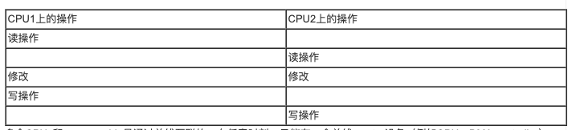
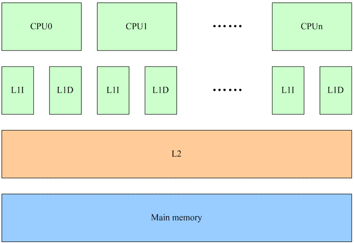
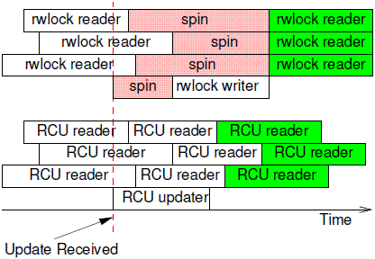
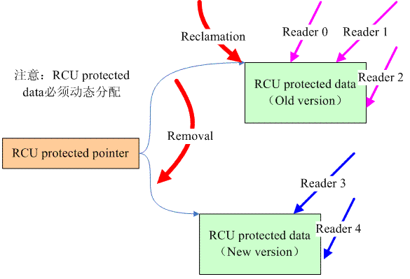

# 操作系统原理——内核同步

## 内核如何为不同的请求提供服务 

1. 老板提出请求时，如果侍者正空闲，则侍者开始为老板服务
2. 如果老板提出请求时侍者正在为顾客服务，那么侍者停止为顾客服务，开始为老板服务。
3. 如果一个老板提出请求时侍者正在为另一个老板服务，那么侍者停止为第一个老板提供服务，而开始为第二个老板服务，服务完毕再继续为第一个老板服务。
4. 一个老板可能命令侍者停止正在为顾客提供的服务。侍者在完成对老板最近请求的服务之后，可能会暂时不理会原来的顾客而去为新选中的顾客服务 

侍者提供的服务对应于CPU处于内核态时所执行的代码。如果CPU在用户态执行，则侍者被认为处于空闲状态。

老板的请求相当于中断，而顾客的请求相当于用户态进程发出的系统调用或异常，对应的是内核抢占。

注意：内核抢占与中断还是不相同的。

### 内核抢占

 如果进程执行内核函数时，即它的内核态运行时，允许发生内核切换（被替换的进程是正执行内核函数的进程），这个内核就是抢占的。

抢占内核的主要特点 是：一个在内核态运行的进程，可能在执行内核函数期间被另外一个进程取代 

使内核可抢占的目的是减少用户态进程的分配延迟，即从进程变为可执行状态到它实际开始运行之间的时间间隔。内核抢占对执行及时被调度的任务（如：电影播放器）的进程确实是有好处的，因为它降低了这种进程被另一个运行在内核态的进程延迟的风险 

以下原则告诉我们：只有内核正在执行异常处理程序（尤其是系统调用），而且内核抢占没有被显式地禁用时，才可能抢占内核。

thread_info描述符的preempt_count字段大于0时

- 内核正在执行中断服务例程
- 可延迟函数被禁止（当内核正在执行软中断或tasklet时经常如此）
- 通过把抢占计数器设置为正数而显式地禁用内核抢占

内核抢占会引起不容忽视的开销。因此Linux2.6独具特色地允许用户在编译内核时通过设置选项来禁用或启用内核抢占

### 什么时候同步是必需的 

当计算的结果依赖于两个或两个以上的交叉内核控制路径的嵌套方式时，可能出现竞争条件。临界区是一段代码，在其他的内核控制路径能够进入临界区前，进入临界区的内核控制路径必须全部执行完这段代码。

交叉内核控制路径使内核开发者的工作变得复杂：他们必须特别小心地识别出异常处理程序、中断处理程序、可延迟函数和内核线程中的临界区。一旦临界区被确定，就必须对其采用适当的保护措施，以确保在任何时刻只有一个内核控制路径处于临界区。

如果是单CPU的系统，可以采取访问共享数据结构时关闭中断的方式来实现临界区，因为只有在开中断的情况下，才可能发生内核控制路径的嵌套。

另外，如果相同的数据结构仅被系统调用服务例程所访问，而且系统中只有一个CPU，就可以非常简单地通过在访问共享数据结构时禁用内核抢占功能来实现临界区。

正如你们所预料的，在多处理器系统中，情况要复杂得多。由于许多CPU可能同时执行内核路径，因此内核开发者不能假设只要禁用内核抢占功能，而且中断、异常和软中断处理程序都没有访问过该数据结构，就能保证这个数据结构能够安全地被访问。

### 什么时候同步是不必需的 

所有的中断处理程序响应来自PIC的中断并禁用IRQ线。此外，在中断处理程序结束之前，不允许产生相同的中断事件

中断处理程序、软中断和tasklet既不可以被抢占也不能被阻塞，所以它们不可能长时间处于挂起状态。在最坏的情况下，它们的执行将有轻微的延迟，因此在其执行的过程中可能发生其他的中断（内核控制路径的嵌套执行）

执行中断处理的内核控制路径不能被执行可延迟函数或系统调用服务例程的内核控制路径中断

软中断和tasklet不能在一个给定的CPU上交错执行

同一个tasklet不可能同时在几个CPU上执行。

## 同步原语 

### 原子操作

我们的程序逻辑经常遇到这样的操作序列：

1、读一个位于memory中的变量的值到寄存器中

2、修改该变量的值（也就是修改寄存器中的值）

3、将寄存器中的数值写回memory中的变量值

如果这个操作序列是串行化的操作（在一个thread中串行执行），那么一切OK，然而，世界总是不能如你所愿。在多CPU体系结构中，运行在两个CPU上的两个内核控制路径同时并行执行上面操作序列，有可能发生下面的场景：



多个CPUs和memory chip是通过总线互联的，在任意时刻，只能有一个总线master设备（例如CPU、DMA controller）访问该Slave设备（在这个场景中，slave设备是RAM chip）。因此，来自两个CPU上的读memory操作被串行化执行，分别获得了同样的旧值。完成修改后，两个CPU都想进行写操作，把修改的值写回到memory。但是，硬件arbiter的限制使得CPU的写回必须是串行化的，因此CPU1首先获得了访问权，进行写回动作，随后，CPU2完成写回动作。在这种情况下，CPU1的对memory的修改被CPU2的操作覆盖了，因此执行结果是错误的。

不仅是多CPU，在单CPU上也会由于有多个内核控制路径的交错而导致上面描述的错误。

系统调用的控制路径上，完成读操作后，硬件触发中断，开始执行中断handler。这种场景下，中断handler控制路径的写回的操作被系统调用控制路径上的写回覆盖了，结果也是错误的。

对于那些有多个内核控制路径进行read-modify-write的变量，内核提供了一个特殊的类型atomic_t

从上面的定义来看，atomic_t实际上就是一个int类型的counter，不过定义这样特殊的类型atomic_t是有其思考的：内核定义了若干atomic_xxx的接口API函数，这些函数只会接收atomic_t类型的参数。这样可以确保atomic_xxx的接口函数只会操作atomic_t类型的数据。同样的，如果你定义了atomic_t类型的变量（你期望用atomic_xxx的接口API函数操作它），这些变量也不会被那些普通的、非原子变量操作的API函数接受。

### Per-CPU变量

我们在原子操作那篇文档中描述的read-modify-write的问题本质上是一个保持对内存read和write访问的原子性的问题。也就是说对内存的读和写的访问不能被打断。对该问题的解决可以通过硬件、软件或者软硬件结合的方法来进行。早期的ARM CPU给出的方案就是依赖硬件：SWP这个汇编指令执行了一次读内存操作、一次写内存操作，但是从程序员的角度看，SWP这条指令就是原子的，读写之间不会被任何的异步事件打断。具体底层的硬件是如何做的呢？这时候，硬件会提供一个lock signal，在进行memory操作的时候设定lock信号，告诉总线这是一个不可被中断的内存访问，直到完成了SWP需要进行的两次内存访问之后再clear lock信号。

lock memory bus对多核系统的性能造成严重的影响（系统中其他的processor对那条被lock的memory bus的访问就被hold住了），如何解决这个问题？最好的锁机制就是不使用锁，因此解决这个问题可以使用釜底抽薪的方法，那就是不在系统中的多个processor之间共享数据，给每一个CPU分配一个不就OK了吗。

当然，随着技术的发展，在ARMv6之后的ARM CPU已经不推荐使用SWP这样的指令，而是提供了LDREX和STREX这样的指令。这种方法是使用软硬件结合的方法来解决原子操作问题，看起来代码比较复杂，但是系统的性能可以得到提升。其实，从硬件角度看，LDREX和STREX这样的指令也是采用了lock-free的做法。OK，由于不再lock bus，看起来Per-CPU变量存在的基础被打破了。不过考虑cache的操作，实际上它还是有意义的。



每个CPU都有自己的L1 cache（包括data cache和instruction cache），所有的CPU共用一个L2 cache。L1、L2以及main memory的访问速度之间的差异都是非常大，最高的性能的情况下当然是L1 cache hit，这样就不需要访问下一阶memory来加载cache line。

我们首先看在多个CPU之间共享内存的情况。这种情况下，任何一个CPU如果修改了共享内存就会导致所有其他CPU的L1 cache上对应的cache line变成invalid（硬件完成）。虽然对性能造成影响，但是系统必须这么做，因为需要维持cache的同步。将一个共享memory变成Per-CPU memory本质上是一个耗费更多memory来解决performance的方法。当一个在多个CPU之间共享的变量变成每个CPU都有属于自己的一个私有的变量的时候，我们就不必考虑来自多个CPU上的并发，仅仅考虑本CPU上的并发就OK了。当然，还有一点要注意，那就是在访问Per-CPU变量的时候，不能调度，当然更准确的说法是该task不能调度到其他CPU上去。目前的内核的做法是在访问Per-CPU变量的时候disable preemptive，虽然没有能够完全避免使用锁的机制（disable preemptive也是一种锁的机制），但毫无疑问，这是一种代价比较小的锁。

per-cpu变量只是能够保护来自不同cpu的并发访问，并不能保护同一个cpu上，进程上下文和中断上下文中的并发，这时候，往往需要其他的同步原语，往往需要关闭中断才能有效。

### memory barrier

CPU的核心思想就是取指执行，对于in-order的单核CPU，并且没有cache（这种CPU在现实世界中还存在吗？），汇编指令的取指和执行是严格按照顺序进行的，也就是说，汇编指令就是所见即所得的，汇编指令的逻辑被严格的被CPU执行。然而，随着计算机系统越来越复杂（多核、cache、superscalar、out-of-order），使用汇编指令这样贴近处理器的语言也无法保证其被CPU执行的结果的一致性，从而需要程序员（看，人还是最不可以替代的）告知CPU如何保证逻辑正确。

综上所述，memory barrier是一种保证内存访问顺序的一种方法，让系统中的HW block（各个cpu、DMA controler、device等）对内存有一致性的视角。

有些共享资源可以通过禁止任务抢占来进行保护，因此临界区代码被preempt_disable和preempt_enable给保护起来。其实，我们知道所谓的preempt enable和disable其实就是对当前进程的struct thread_info中的preempt_count进行加一和减一的操作。具体的代码如下：

```
#define preempt_disable() \ 
do { \ 
    preempt_count_inc(); \ 
    barrier(); \ 
} while (0)

```

linux kernel中的定义和我们的想像一样，除了barrier这个优化屏障。barrier就象是c代码中的一个栅栏，将代码逻辑分成两段，barrier之前的代码和barrier之后的代码在经过编译器编译后顺序不能乱掉。也就是说，barrier之后的c代码对应的汇编，不能跑到barrier之前去，反之亦然。

### spin lock

在linux kernel的实现中，经常会遇到这样的场景：共享数据被中断上下文和进程上下文访问，该如何保护呢？如果只有进程上下文的访问，那么可以考虑使用semaphore或者mutex的锁机制，但是现在中断上下文也参和进来，那些可以导致睡眠的lock就不能使用了，因为中断是无法被抢占的，在单核处理器的状态下，其他程序无法释放锁。这时候，可以考虑使用spin lock。

值得注意的是，spin lock 进入临界区之后就不可抢占，而自旋的时候虽然是死等，但是确实是可以被抢占的。

我们可以总结spin lock的特点如下：

（1）spin lock是一种死等的锁机制。当发生访问资源冲突的时候，可以有两个选择：一个是死等，一个是挂起当前进程，调度其他进程执行。spin lock是一种死等的机制，当前的执行thread会不断的重新尝试直到获取锁进入临界区。

（2）只允许一个thread进入。semaphore可以允许多个thread进入，spin lock不行，一次只能有一个thread获取锁并进入临界区，其他的thread都是在门口不断的尝试。

（3）执行时间短。由于spin lock死等这种特性，因此它使用在那些代码不是非常复杂的临界区（当然也不能太简单，否则使用原子操作或者其他适用简单场景的同步机制就OK了），如果临界区执行时间太长，那么不断在临界区门口“死等”的那些thread是多么的浪费CPU啊（当然，现代CPU的设计都会考虑同步原语的实现，例如ARM提供了WFE和SEV这样的类似指令，避免CPU进入busy loop的悲惨境地）

（4）可以在中断上下文执行。由于不睡眠，因此spin lock可以在中断上下文中适用。


#### 无抢占内核情形

先看最简单的单CPU上的进程上下文的访问。如果一个全局的资源被多个进程上下文访问，这时候，内核如何交错执行呢？对于那些没有打开preemptive选项的内核，所有的系统调用都是串行化执行的，因此不存在资源争抢的问题。如果内核线程也访问这个全局资源呢？本质上内核线程也是进程，类似普通进程，只不过普通进程时而在用户态运行、时而通过系统调用陷入内核执行，而内核线程永远都是在内核态运行，但是，结果是一样的，对于non-preemptive的linux kernel，只要在内核态，就不会发生进程调度，因此，这种场景下，共享数据根本不需要保护（没有并发，谈何保护呢）。如果时间停留在这里该多么好，单纯而美好，在继续前进之前，让我们先享受这一刻。

#### 抢占内核进程上下文

当打开premptive选项后，事情变得复杂了，我们考虑下面的场景：

（1）进程A在某个系统调用过程中访问了共享资源R

（2）进程B在某个系统调用过程中也访问了共享资源R

会不会造成冲突呢？假设在A访问共享资源R的过程中发生了中断，中断唤醒了沉睡中的，优先级更高的B，在中断返回现场的时候，发生进程切换，B启动执行，并通过系统调用访问了R，如果没有锁保护，则会出现两个thread进入临界区，导致程序执行不正确。OK，我们加上spin lock看看如何：A在进入临界区之前获取了spin lock，同样的，在A访问共享资源R的过程中发生了中断，中断唤醒了沉睡中的，优先级更高的B，B在访问临界区之前仍然会试图获取spin lock，这时候由于A进程持有spin lock而导致B进程进入了永久的spin……怎么破？linux的kernel很简单，在A进程获取spin lock的时候，禁止本CPU上的抢占（上面的永久spin的场合仅仅在本CPU的进程抢占本CPU的当前进程这样的场景中发生）。如果A和B运行在不同的CPU上，那么情况会简单一些：A进程虽然持有spin lock而导致B进程进入spin状态，不过由于运行在不同的CPU上，A进程会持续执行并会很快释放spin lock，解除B进程的spin状态。

多CPU core的场景和单核CPU打开preemptive选项的效果是一样的，这里不再赘述。

#### 抢占内核进程与中断上下文

我们继续向前分析，现在要加入中断上下文这个因素。访问共享资源的thread包括：

（1）运行在CPU0上的进程A在某个系统调用过程中访问了共享资源R

（2）运行在CPU1上的进程B在某个系统调用过程中也访问了共享资源R

（3）外设P的中断handler中也会访问共享资源R

在这样的场景下，使用spin lock可以保护访问共享资源R的临界区吗？我们假设CPU0上的进程A持有spin lock进入临界区，这时候，外设P发生了中断事件，并且调度到了CPU1上执行，看起来没有什么问题，执行在CPU1上的handler会稍微等待一会CPU0上的进程A，等它立刻临界区就会释放spin lock的，但是，如果外设P的中断事件被调度到了CPU0上执行会怎么样？CPU0上的进程A在持有spin lock的状态下被中断上下文抢占，而抢占它的CPU0上的handler在进入临界区之前仍然会试图获取spin lock，悲剧发生了，CPU0上的P外设的中断handler永远的进入spin状态，这时候，CPU1上的进程B也不可避免在试图持有spin lock的时候失败而导致进入spin状态。为了解决这样的问题，linux kernel采用了这样的办法：如果涉及到中断上下文的访问，spin lock需要和禁止本CPU上的中断联合使用。

#### 抢占内核进程与中断下半部

inux kernel中提供了丰富的bottom half的机制，虽然同属中断上下文，不过还是稍有不同。我们可以把上面的场景简单修改一下：外设P不是中断handler中访问共享资源R，而是在的bottom half中访问。使用spin lock+禁止本地中断当然是可以达到保护共享资源的效果，但是使用牛刀来杀鸡似乎有点小题大做，这时候disable bottom half就OK了。

#### 中断上下文之间

最后，我们讨论一下中断上下文之间的竞争。同一种中断handler之间在uni core和multi core上都不会并行执行，这是linux kernel的特性。如果不同中断handler需要使用spin lock保护共享资源，对于新的内核（不区分fast handler和slow handler），所有handler都是关闭中断的，因此使用spin lock不需要关闭中断的配合。bottom half又分成softirq和tasklet，同一种softirq会在不同的CPU上并发执行，因此如果某个驱动中的sofirq的handler中会访问某个全局变量，对该全局变量是需要使用spin lock保护的，不用配合disable CPU中断或者bottom half。tasklet更简单，因为同一种tasklet不会多个CPU上并发

### Read/Write spin lock

在有了强大的spin lock之后，为何还会有rw spin lock呢？无他，仅仅是为了增加内核的并发，从而增加性能而已。spin lock严格的限制只有一个thread可以进入临界区，但是实际中，有些对共享资源的访问可以严格区分读和写的，这时候，其实多个读的thread进入临界区是OK的，使用spin lock则限制一个读thread进入，从而导致性能的下降。

### Seqlock

普通的spin lock对待reader和writer是一视同仁，RW spin lock给reader赋予了更高的优先级，那么有没有让writer优先的锁的机制呢？答案就是seqlock。

seqlock这种锁机制是倾向writer thread，也就是说，除非有其他的writer thread进入了临界区，否则它会长驱直入，无论有多少的reader thread都不能阻挡writer的脚步。writer thread这么霸道，reader肿么办？对于seqlock，reader这一侧需要进行数据访问的过程中检测是否有并发的writer thread操作，如果检测到并发的writer，那么重新read。通过不断的retry，直到reader thread在临界区的时候，没有任何的writer thread插入即可。这样的设计对reader而言不是很公平，特别是如果writer thread负荷比较重的时候，reader thread可能会retry多次，从而导致reader thread这一侧性能的下降。

### RCU基础

spin lock是互斥的，任何时候只有一个thread（reader or writer）进入临界区，rw spin lock要好一些，允许多个reader并发执行，提高了性能。不过，reader和updater不能并发执行，RCU解除了这些限制，允许一个updater（不能多个updater进入临界区，这可以通过spinlock来保证）和多个reader并发执行。我们可以比较一下rw spin lock和RCU，参考下图：



rwlock允许多个reader并发，因此，在上图中，三个rwlock reader愉快的并行执行。当rwlock writer试图进入的时候（红色虚线），只能spin，直到所有的reader退出临界区。一旦有rwlock writer在临界区，任何的reader都不能进入，直到writer完成数据更新，立刻临界区。绿色的reader thread们又可以进行愉快玩耍了。rwlock的一个特点就是确定性，白色的reader一定是读取的是old data，而绿色的reader一定获取的是writer更新之后的new data。RCU和传统的锁机制不同，当RCU updater进入临界区的时候，即便是有reader在也无所谓，它可以长驱直入，不需要spin。同样的，即便有一个updater正在临界区里面工作，这并不能阻挡RCU reader的步伐。由此可见，RCU的并发性能要好于rwlock，特别如果考虑cpu的数目比较多的情况，那些处于spin状态的cpu在无谓的消耗，多么可惜，随着cpu的数目增加，rwlock性能不断的下降。RCU reader和updater由于可以并发执行，因此这时候的被保护的数据有两份，一份是旧的，一份是新的，对于白色的RCU reader，其读取的数据可能是旧的，也可能是新的，和数据访问的timing相关，当然，当RCU update完成更新之后，新启动的RCU reader（绿色block）读取的一定是新的数据。

RCU的基本思路可以通过下面的图片体现：



RCU涉及的数据有两种，一个是指向要保护数据的指针，我们称之RCU protected pointer。另外一个是通过指针访问的共享数据，我们称之RCU protected data，当然，这个数据必须是动态分配的  。对共享数据的访问有两种，一种是writer，即对数据要进行更新，另外一种是reader。如果在有reader在临界区内进行数据访问，对于传统的，基于锁的同步机制而言，reader会阻止writer进入（例如spin lock和rw spin lock。seqlock不会这样，因此本质上seqlock也是lock-free的），因为在有reader访问共享数据的情况下，write直接修改data会破坏掉共享数据。怎么办呢？当然是移除了reader对共享数据的访问之后，再让writer进入了（writer稍显悲剧）。对于RCU而言，其原理是类似的，为了能够让writer进入，必须首先移除reader对共享数据的访问，怎么移除呢？创建一个新的copy是一个不错的选择。因此RCU writer的动作分成了两步：

（1）removal。write分配一个new version的共享数据进行数据更新，更新完毕后将RCU protected pointer指向新版本的数据。一旦把RCU protected pointer指向的新的数据，也就意味着将其推向前台，公布与众（reader都是通过pointer访问数据的）。通过这样的操作，原来read 0、1、2对共享数据的reference被移除了（对于新版本的受RCU保护的数据而言），它们都是在旧版本的RCU protected data上进行数据访问。

（2）reclamation。共享数据不能有两个版本，因此一定要在适当的时机去回收旧版本的数据。当然，不能太着急，不能reader线程还访问着old version的数据的时候就强行回收，这样会让reader crash的。reclamation必须发生在所有的访问旧版本数据的那些reader离开临界区之后再回收，而这段等待的时间被称为grace period。

顺便说明一下，reclamation并不需要等待read3和4，因为write端的为RCU protected pointer赋值的语句是原子的，乱入的reader线程要么看到的是旧的数据，要么是新的数据。对于read3和4，它们访问的是新的共享数据，因此不会reference旧的数据，因此reclamation不需要等待read3和4离开临界区。

### 信号量 

从本质上说，它们实现了一个枷锁原语，即让等待者睡眠，直到等待的资源变为空闲。

内核信号量类似于自旋锁，因此当锁关闭着时，它不允许内核控制路径继续进行。然而，当内核控制路径试图获取内核信号所保护的忙资源时，相应的进程被挂起。只有在资源被释放时，进程才再次变为可运行的。因此，只有可以睡眠的函数才能获取内核信号量；中断处理程序和可延续函数都不能使用内核信号量。 


### 禁止本地中断

确保一组内核语句被当作一个临界区处理的主要机制之一就是中断禁止。即使当硬件设备产生了一个IRQ信号时，中断禁止也让内核控制路径继续执行，因此，这就提供了一种有效的方式，确保中断处理程序访问的数据结构页受到保护。然而，禁止本地中断并不保护运行在另一个CPU上的中断处理程序对数据结构的并发访问，因此，在多处理器系统上，禁止本地中断经常与自旋锁结合使用。

宏local_irq_disable()使用cli汇编语言指令关闭本地CPU上的中断，宏local_irq_enable()使用sti汇编语言指令打开被关闭的中断

### 禁止和激活可延续函数 

可延续函数可能在不可预知的时间执行（实际上是在硬件中断处理程序结束时）。因此，必须保护可延续函数访问的数据结构使其避免竞争条件

禁止可延迟函数在一个CPU上执行的一种简单方式就是禁止在那个CPU上的中断。因为没有中断处理程序被激活，因此，软中断操作就不能异步地开始。

内核有时需要只禁止可延续函数而不禁止中断。通过操纵当前thread_info描述符preempt_count字段中存放的软中断计数器，可以在本地CPU上激活或禁止可延续函数。
        


## 对内核数据结构的同步访问 

同步原语的选取取决于访问数据结构的内核控制路径的种类。记住，只要内核控制路径获得自旋锁（还有读、写锁、顺序锁或RCU“读锁”），就禁用本地中断或本地软中断，自动禁用内核抢占

### 保护异常所访问的数据结构 

当一个数据结构仅由异常程序访问时，竞争条件通常是易于理解也易于避免的。最常见的产生同步问题的异常就是系统调用服务例程，在这种情况下，CPU运行在内核态而为用户态程序提供服务。因此，仅由异常访问的数据结构通常表示一种资源，可以分配给一个或多个进程。

竞争条件可以通过信号量避免，因为信号量原语允许进程睡眠到资源变为可用。注意，信号量工作方式在单处理器系统和多处理器系统上完全相同。

### 保护中断所访问的数据结构 

假定一个数据结构仅被中断处理程序的“上半部分”访问。中断处理程序本身不能同时多次运行 。因此，访问数据结构就无需任何同步原语。

但是，如果多个中断处理程序访问一个数据结构 ，情况就有所不同了。一个处理程序可以中断另一个处理程序，不同的中断处理程序可以在多个处理器系统上同时运行。没有同步，共享的数据结构就很容易被破坏 。

在单处理器系统上，必须通过在中断处理程序的所有临界区上禁止中断来避免竞争条件。只能用这种方式进行同步，因为其他的同步原语都不能完成这件事。

多处理器系统上，避免竞争条件最简单的方法是禁止本地中断，并获取保护数据结构的自旋锁或读、写自旋锁。注意，这些附加的自旋锁不能冻结系统，因为即使中断处理程序发现锁被关闭，在另一个CPU上拥有锁得中断处理程序最终也释放这个锁。

### 保护可延迟函数所访问的数据结构 

只被可延迟函数访问的数据结构需要那种保护呢？这主要取决于可延迟函数的种类。软中断和tasklet本质上有不同的并发度。

在单处理器系统上不存在竞争条件。这是因为可延迟函数执行总是在一个CPU上串行进行---也就是说，一个可延迟函数不会被另一个可延迟函数中断。因此，根本不需要同步原语。

在多处理器系统上，竞争条件的确存在，因为几个可延迟函数可以并发运行：表5-10*** 

由软中断访问的数据结构必须受到保护，通常使用自旋锁进行保护，因为同一个软中断可以在两个或多个CPU上并发运行。相反，仅有一种tasklet访问的数据结构不需要保护，因为同种tasklet不能并发运行。但是，如果数据结构被几种tasklet访问，那么，就必须对数据结构进行保护。 

### 保护异常和中断访问的数据结构 

在单处理器系统上，竞争条件的防止是相当简单的，因为中断处理程序不是可重入的且不能被异常中断。只要内核以本地中断禁止访问数据结构，内核在访问数据结构的过程中就不会被中断。不过，如果数据结构正好是被一种中断处理程序访问，那么，中断处理程序不用禁止本地中断就可以自由地访问数据结构。

在多处理器系统上，我们必须关注异常和中断在其他CPU上的并发执行。本地中断禁止还必须外加自旋锁，强制并发的内核控制路径进行等待，直到访问数据结构的处理程序完成自己的工作。

### 保护异常和可延迟函数访问的数据结构

异常和可延迟函数都访问的数据结构与异常和中断处理程序访问的数据结构处理方式类似。事实上，可延迟函数本质上是由中断的出现激活的，而可延迟函数执行时不可能产生异常。因此，把本地中断禁止与自旋锁结合起来就足够了。

### 保护中断和可延迟函数所访问的数据结构

类似于中断和异常处理程序访问的数据结构：本地中断禁用与自旋锁

### 保护异常、中断和可延迟函数所访问的数据结构 

类似于前面的情况，禁止本地中断和获取自旋锁几乎总是避免竞争条件所必需的。注意，没有必要显式地禁止可延迟函数，因为当中断处理程序终止执行时，可延迟函数才能被实质激活；因此，禁止本地中断中断就做够了。