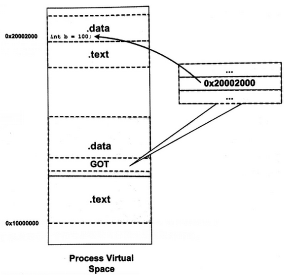
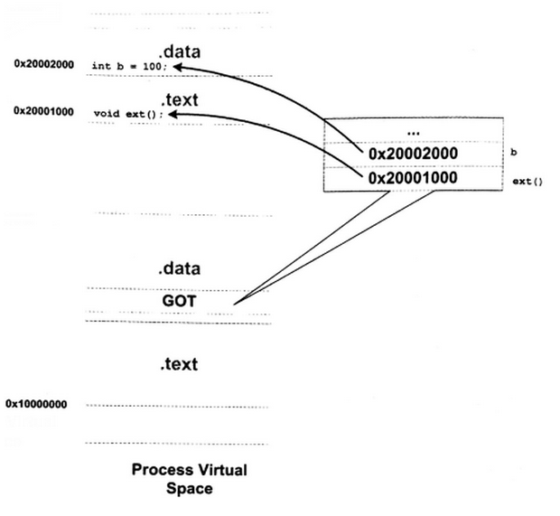

# 操作系统原理——动态链接

## 一些基本问题

### 为何会提出动态库的概念

引入静态库后，解决了一些问题，但是仍然存在下面的弊端：

（1）任何对静态库的升级都需要rebuild（或者叫做relink）的过程

（2）通用的函数（例如标准IO函数scanf和printf）存在于各个静态链接的程序中，导致编译后的静态可执行程序的size比较大，在各个可执行程序中，这些通用的函数代码是重复的，占用了磁盘和内存资源

### 动态库为何需要编译成PIC的代码？

简单的说，就是为了动态库给多个程序共享，一份在物理内存的代码可以映射到不同程序的虚拟空间中去。

无论是动态库还是静态库，其本质都是代码共享。对于静态库，其代码以及数据都是在各个静态链接的可执行文件中有一份copy，所有符号的地址已经确定，因此在loading的时候，OS会比较轻松。不过这种代码共享无法在run time的时候共享代码，从而导致了资源的浪费。当然，它的好处就是简单、速度快（无需dynamic linker来重定位符号）。对于静态编译，static linker将多个编译单元（.o文件和库文件）整合成一个模块，因此，进入run time，实际上只有一个执行模块。对于动态链接，在run time的时候，除了可执行文件这个模块，该可执行文件所依赖的各个动态库也是一个个的运行模块，这时候，可执行文件调用动态库的符号实际上是就是需要引用其他运行模块的符号了。对于可执行文件而言，loader将其加载到哪个地址并不关键，反正每个进程都有自己独一无二的地址空间，可执行文件可以mapping到各自virtual memory space的相同地址也无妨，不过对于动态库模块而言，就有些麻烦了。如果我们不将动态库编译成PIC的也就是意味着loader一定要把动态库加载到某个特定的地址（该地址编译的时候就确定了）上它才可以正确的执行。假设我们有A B C D四个动态库，假设程序P1依赖A B两个动态库，P2依赖C D两个动态库，那么A B和C D的动态库的加载地址有重叠也没有关系，P1和P2可以同时运行。但是如果有一个新的程序P3依赖A B C D四个动态库，那么前面为动态库分配的加载地址就不能正常工作了。当然，重新为这四个动态库分配load address（让地址不重叠）也是ok的，但是这样一来，P1虽然没有使用C D这两个动态库，但是P1的地址空间还是要保留C D动态库的那段地址，对于地址这样宝贵资源，这么浪费简直是暴殄天物。更重要的是：这样的机制实际上对进程虚拟地址的管理就变得非常复杂了，假设A B C D是分配了一段连续的地址，如果C动态库更新了，size变大了，原本分配的地址空间不够了，怎么办？我们必须再寻找一个新的地址段来加载C动态库。如果系统只有四个动态库起始还是OK的，如果动态库非常非常多……怎么办？更糟的是：不同的系统使用不同的动态库，管理起来更令人头痛

最好的方法就是将动态库编译成PIC（Position Independent Code），也就是说动态库可以被加载到任何地址并正确运行。

## 地址无关代码

### 装载时重定位

为了让共享对象在任意地址装载，所以对所有绝对地址的引用不做重定位，而是把这步推迟到装载的时候再完成，比如一旦模块的装载地址确定了也就是目标地址确定，那么系统对程序所有的绝对地址引用进行重定位，来实现任意地址装载。

比如前面的例子foorbar相对于代码段的其实位置是0x100，当模块被装载到0x10000000时，假设代码段在模块最开始的位置，则foobar的地址就是0x10000100。这个时候遍历所有模块中的重定位表，把所有对foorbar的地址引用都重定位为0x10000100

>
>静态链接的重定位叫做链接时重定位，而上面这种方式叫做装载时重定位。
>

虽然能够解决动态模块中有绝对地址引用的情况，还是没能解决上面的多个模块依赖一个共享库的指令，变量地址的问题（如何共用？）。动态链接模块被装载映射到虚拟空间，指令部分大部分都是进程之间共享的，因为指令被重定位后对每个进程来讲是不同的。

动态链接库中可以修改数据的部分对于不同进程来讲是由多个副本的，所以可以用装载时重定位的方法来解决。

### 地址无关代码的实现

上面虽然装载时重定位解决了动态模块中有绝对地址引用的情况，但是指令部分还是无法在多个进程之间共享。

归根结底希望程序模块中共享的指令部分在装载时不需要因为装载地址改变而改变。

思路就是把这些指令按照需要被修改的部分剥离处理，需要修改数据部分放在一起，不修改的指令放一起。这里指令部分就保持不变了，数据部分就可以在每个进程中有一个副本。这就是地址无关代码（PIC Positon-independent Code）。

- 模块内部函数调用、跳转等。
- 模块内部的数据访问。
- 模块外部的函数调用、跳转等。
- 模块外部的数据访问。

#### 模块内部调用或跳转

模块内部的跳转、函数调用都可以是相对地址调用，或者是基于寄存器的相对调用，所以对于这种指令是不需要重定位的。

#### 模块内部数据访问

指令中不能直接包含数据的绝对地址，那么唯一的办法就是相对寻址。

#### 模块间数据访问

模块间的数据访问目标地址要等到装载时才决定。ELF的做法是在数据段里面建立一个指向这些变量的指针数组，也被称为全局偏移表，当代码需要引用该全局变量时，可以通过GOT中相对的项间接引用。链接器在装载模块的时候会查找每个变量所在的地址，然后填充 GOT 中的各个项目。由于 GOT 是放在数据段的，所以它可以在模块装载时被修改，并且每个进程都有独立的副本。

#### 模块间调用、跳转

GOT中相应的项保存的是目标函数的地址，当模块要调用目标函数时，可以通过GOT中的项进行间接跳转。

### 遗留问题

#### 共享模块全局变量

定义在模块内的全局变量？当一个模块医用了一个定义在全局变量的时候，编译器无法判断这个变量在定义同一模块还是定义在另一个共享对象之中。

解决办法就是将所有使用这个变量的指令都指向位于可执行文件中的那个副本。ELF共享库在编译时，默认把定义在模块内部的全局变量当作定义在其他模块的全局变量，如果某个全局变量在可执行文件中有副本，那么动听库就会把GOT中相应地址指向该副本。这样变量在运行时就只有一个实例了。

#### 数据段地址无关性

始终记住，数据端在每个进程中都有一份独立的副本，所以并不会担心因为进程而改变。可以选择在装载时重定位的方法来解决数据端中绝对地址应用问题。
对于共享对象来讲，如果数据段有绝对地址的引用，那么链接器就会产生一个重定位表。这个重定位表里面包含了R_386_RELATIVE类型的重定位入口。当在装载的时候发现该共吸纳过对象有这样的重定位入口，动态链接器就会对该共享对象进行重定位。

>
>其实代码段也可以使用这种装载重定位，但是这样就不是地址无关了，就会造成多个副本，不能多个进程之间共享，于是就失去了节省内存的特点，因为没访问全局变量和函数的时候都需要做一次计算当期那地址及简介地址寻址的过程。。所以说地址无关根本目的是在于共享，在于节省内存。

## 延迟绑定

动态链接链接很多优势，但是相对之下性能比静态库要差一些。

主要原因是动态链接对群架和静态数据的访问都需要复杂的GOT定位，然后间接寻址，对于模块间的调用也要先GOT定位，再进行跳转，所以程序运行的速度回慢一些。而且在启动的时候动态链接器需要进行一次链接工作进行符号查找及重定位，所以启动速度也会慢下俩。

优化方式：用懒加载的方式，也就是函数第一次用到才进行绑定（符号查找，重定位等），如果没有用到则不进行绑定。

ELF使用PLT（Procedure Linkage Table）的方式实现，是一写很精巧的汇编指令实现。也是通过一个表来保存需要跳转的信息。

PLT基本原理：ELF将GOT拆为两个表.got和.got.plt。其中.got用来保存全局变量的引用地址，.got.ptl用来保存函数引用的地址，所有对于外部函数的引用全部放到.got.plt中。.got.plt的前三项有特殊含义。

## 动态链接相关结构

在动态链接情况下，操作系统不能再装载完可执行文件之后就把控制权交给可执行文件，因为可执行文件可能依赖很多共享对象，里面的很多外部符号还是无效地址，还没有跟相应的共享对象实际位置链接起来。在映射玩可执行文件之后，操作系统会先启动一个动态链接器。

操作系统将控制权交给动态链接器的入口，开始执行一系列自身的初始化操作，然后根据当前的环境参数对可执行文件进行动态链接工作，所有链接操作完成之后，动态链接器将控制权限转交给可执行文件的入口地址，程序开始执行。

### interp段

动态链接器不是由系统配置的，而是由ELF文件自己决定的，在动态链接的ELF可执行文件中，有一个专门的段.interp段（解释器）。保存的就是动态链接器的路径。

### .dynamic段

这个段里面保存了动态链接器的基本所需要的信息，比如依赖于哪些共享对象，动态连接符号表的位置，动态链接重定位表的位置，共享对象初始化代码的地址段。

### 动态符号表（dynsym）

类比静态链接中的符号表.symtab，里面保持了所有关与改目标文件的符号定义和引用。动态链接的符号表和静态链接非常相似。
这个段的段名叫.dynsym，简称动态符号表。只保存了与动态链接相关的符号。很多动态链接模块同时又dynsym和symtab两个表，后者包含了所有符号包含了dynsym中的符号。同样也有一些辅助表，比如字符串表.strtab，这里叫做.dynstr

### 动态链接重定位表

动态链接的可执行文件使用PIC方法，虽然其代码段不需要重定位（因为地址无关），但是数据端还是包含了绝对地址的引用，因为代码段中绝对地址相关部分被分离了出来，编程了GOT（全局偏移表），而GOT实际上是数据端的一部分，除了GOT，数据端还可以能包含绝对地址引用。

### 重定位相关数据结构

和静态链接类似，动态链接重定位表分为.rel.dyn和.rel.plt他们分别相当于.rel.text和.rel.data。.rel.dyn是对数据的修真，位于.got段，.rel.plt是对函数的修正位于.got.plt段。

