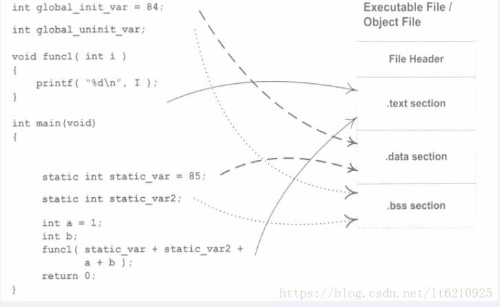
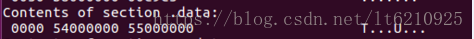
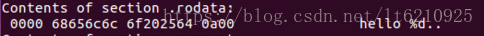
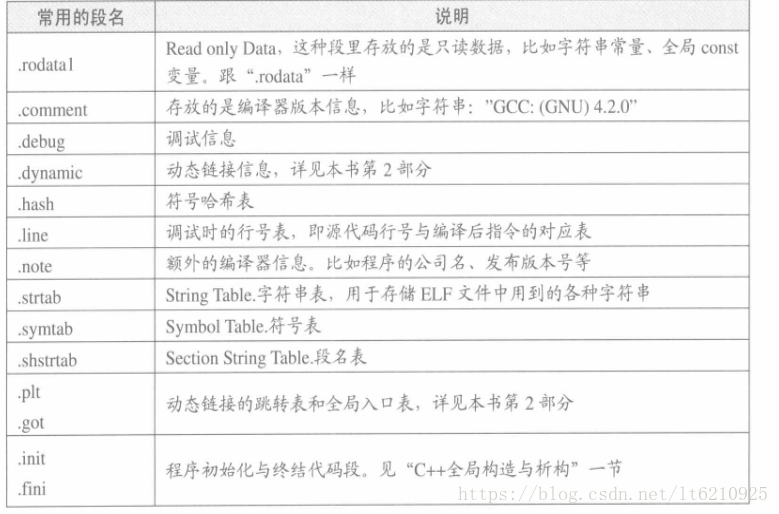
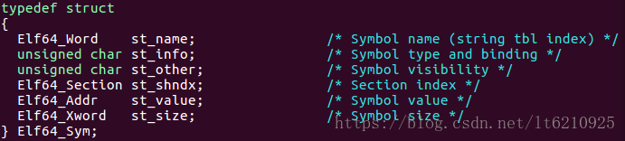
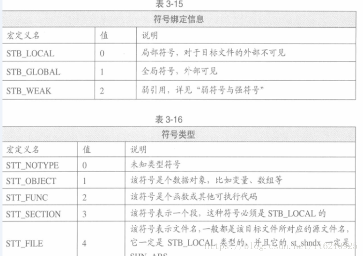
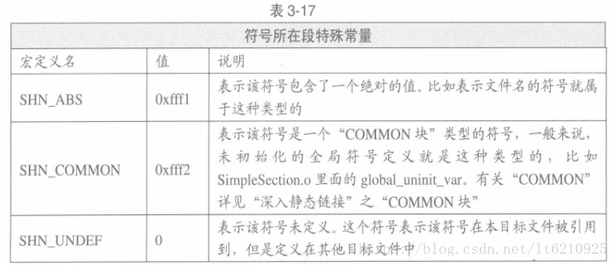
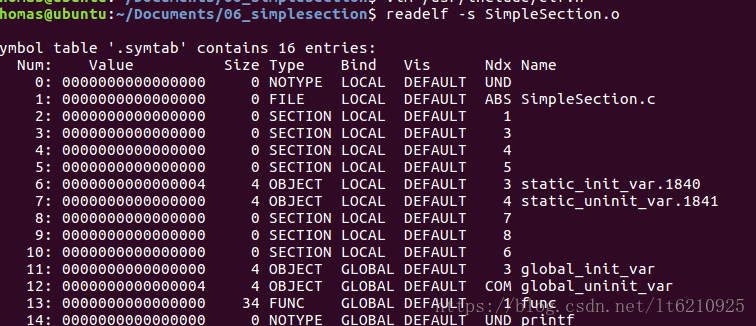

# 操作系统原理——可执行文件的格式

## 目标文件有什么

```

/* simpleSeciont.c */
int printf( const char* format, ...);
//#include <stdio.h>
int global_init_var = 84;
int global_uninit_var;
 
void func(int i)
{
  printf("hello %d\n", i);
}
 
int main(void)
{
  static int static_init_var = 85;
  static int static_uninit_var;
  int a = 1;
  int b;
  func(static_init_var + static_uninit_var +
      a + b);
  return 0;
}

```



```
Sections:
Idx Name          Size      VMA               LMA               File off  Algn
  0 .text         00000057  0000000000000000  0000000000000000  00000040  2**0
                  CONTENTS, ALLOC, LOAD, RELOC, READONLY, CODE
  1 .data         00000008  0000000000000000  0000000000000000  00000098  2**2
                  CONTENTS, ALLOC, LOAD, DATA
  2 .bss          00000004  0000000000000000  0000000000000000  000000a0  2**2
                  ALLOC
  3 .rodata       0000000a  0000000000000000  0000000000000000  000000a0  2**0
                  CONTENTS, ALLOC, LOAD, READONLY, DATA
  4 .comment      00000035  0000000000000000  0000000000000000  000000aa  2**0
                  CONTENTS, READONLY
  5 .note.GNU-stack 00000000  0000000000000000  0000000000000000  000000df  2**0
                  CONTENTS, READONLY
  6 .eh_frame     00000058  0000000000000000  0000000000000000  000000e0  2**3
                  CONTENTS, ALLOC, LOAD, RELOC, READONLY, DATA

```

`size` 为该段的长度，`File offset` 为段所在的位置，每个段第二行表示段的属性，例如 `CONTENTS`，代表该段在文件中存在。

### 代码段


### 数据段和只读数据段



一共是8个字节，我们可以看到里面内容就是0x54，0x55。至于为啥是0x54在前面，这个跟CPU的大小端有关系，CPU是小端
其实就是84，85；代码里面显示就是：

```
int global_init_var = 84;
static int static_init_var = 85;
 
```

每个变量4个字节，其实就是存放的全局变量和static静态变量。还有个数据段.rodata:



其实就是printf里面的字符串"hello %d\n"

### .bss段

.bss 段是未初始化的全局变量和局部静态变量，只要值未未初始化的全局变量都会在.bss段。

### 重定位表

这边有个.rela.text    就是重定位表段。

### 字符串表

这边字符串表讲的其实不是程序中的，而是ELF文件中的，例如有些段的名称，是用户自己定义的，有些说不定很长，所以ELF文件特定划了一段字符串的区域给这些字符串，而在使用的时候，只需要知道偏移就可以了。

所有的段名都在.shstrtab这个段里面。.strtab 还有个程序中的一些符号的名称，例如函数名之类的symbol的字符串

### 其他段




### 符号表

符号表最常用的符号有：

- 定义在本目标文件的全局符号，可以被其他目标文件引用
- 在本目标文件中引用的全局符号，缺没有定义在本目标文件，一般叫做外部符号。

ELF 中的符号表是 .symtab，符号表使用的是 .strtab 里面的字符串。



- st_name 是符号名
- st_info 是符号绑定信息。

    

- st_shndx 如果在本目标文件中，那么就是段表的下标；有些特殊值。
    
    
    
- st_value 
	- 在目标文件中，那么就是在段中的偏移
	- 如果是 COMMON 块的，那么就是对齐属性
	- 在可执行文件中，是虚拟地址
	


- func1、main是函数所有在代码段，代码段Ndx为1，所以.text为1.并且类型是STT_Func，并且是全局可见，所以是STB——GLOBAL。
- printf 这个符号，该符号在目标文件中引用，但是没变被定义，所以他的 Ndx 是 SHN_UNDEF
- global_uninit_var是一个SHN_COMMON类型的符号，本身并没有在BSS段。
- static_var和static_var2变成了static_var.1533和static_var.1534，是因为进行符号修正。其次绑定的属性是STB_LOCAL，表示只在编译单元可见。
- 类型是STT_SECTION类型的符号，表示下标为Ndx段的短名。但是符号没有显示。比如2号符号Ndx为1那么就是.text段。那么符号名字就是.text。可以使用objdump -t查看段名符号。

#### 符号修饰、函数签名（防止冲突）

最开始编译器产生目标文件的时候，符号名和相应的变量函数名一样。但是如果已经定义这些符号就会产生目标文件冲突。为了解决目标文件冲突，就在对应的符号名签名加一些字符以示区分。如在符号名前、后加上_。

如果模块较多，命名规范不严格，同样可能导致冲突。于是就增加了命名空间的方法来解决。

所以看到上面的static_var和static_var2变成了static_var.1533和static_var.1534。也就是进行了一次符号修饰。

#### 弱符号、强符号

经常在编程中将一个符号重复定义，如果出现定义错误则说明这种事强符号。有些符号可以定义为弱符号，比如未初始化的全局变量，也可以使用__attribut__((weak))定义一个强符号为弱符号。

它们的规则如下：

- 不允许强符号被多次定义，也就是不同目标文件不能有相当的强符号（iOS中经常出现的符号冲突就是这个意思）
- 如果符号在某个目标文件是强符号，其他文件是弱符号，那么选择强符号
- 如果在所有文件中都是弱符号则选择其中占空间最大的一个

#### 弱引用、强引用

如果没有找到该符号的定义，链接器就会报未定义错误这种成为强引用。与之相对的是弱引用，如果是弱引用，链接器不认为是个错误，一般对未定义的弱引用，链接器默认为0，或者其他值，以便程序识别。在动态库中使用到，和COMMON块概念联系很紧密

可以使用__attribute__((weakref))扩展自声明对一个外部函数为弱引用。如果把它编译为可执行文件，并不会报链接错误。但是当运行的时候，就会发生非法地址访问。


类型是STT_SECTION类型的符号，表示下标为Ndx段的短名。但是符号没有显示。比如2号符号Ndx为1那么就是.text段。那么符号名字就是.text。可以使用objdump -t查看段名符号。


## 静态链接

### 空间与地址分配

链接额过程就是将输入的目标文件合并为一个输出的可执行文件。如何将目标文件的各个段合并到可执行文件中，也就是空间如何分配，总体有如下两种方式，按序叠加与相似段合并。

相似段合并这种方式更加实际，比如讲.text段合并到可执行文件的.text段，各个段一次合并。

具体来讲链接器采用两步链接：

- 第一步：空间与地址分配——扫描所有目标文件，得到各个段的长度，将所有目标文件的符号表中的符号定义及引用信息统一放到一个全局符号表。可以根据目标文件的段长度，将他们合并，建立映射关系。
- 第二步：符号解析与重定位——根据上面的信息，读取文件中的段数据，重定位信息，进行符号解析与重定位，调整代码地址。这一步才是狠心，尤其是重定位。

```
$ objdump -h a.o

a.o:    file format Mach-O 64-bit x86-64

Sections:
Idx Name          Size      Address          Type
  0 __text        0000002e 0000000000000000 TEXT
  1 __compact_unwind 00000020 0000000000000030 DATA
  2 __eh_frame    00000040 0000000000000050 DATA

$ objdump -h b.o

b.o:    file format Mach-O 64-bit x86-64

Sections:
Idx Name          Size      Address          Type
  0 __text        0000002c 0000000000000000 TEXT
  1 __data        00000004 000000000000002c DATA
  2 __compact_unwind 00000020 0000000000000030 DATA
  3 __eh_frame    00000040 0000000000000050 DATA

$ objdump -h ab

ab: file format Mach-O 64-bit x86-64

Sections:
Idx Name          Size      Address          Type
  0 __text        0000005c 0000000000001f20 TEXT
  1 __eh_frame    00000080 0000000000001f80 DATA
  2 __data        00000004 0000000000002000 DATA

```

现在直接看VMA和SIZE，暂时忽略文件偏移。在链接之前虚拟地址都是零（MAC上起始的.text段为0），因为虚拟地址空间还没有分配，所以默认都是0，但是链接之后，可执行文件ab各个段都分配了相应的虚拟地址，所以可以看到text已经分配到地址。

#### 符号地址的确定

- 第一步过程中确定了在可执行文件中的空间分布。比如.text其实段0x08040894，.data段其实地址0x08049108.

- 第一步完成之后，链接器就开始计算各个符号的虚拟地址。符号在段内的位置是固定的，比如main、shared、wap地址已经是确定的了，只不过需要链接器给每个符号添加一个偏移量。


