# 操作系统原理——文件系统

[TOC]

## 为什么会有文件系统

当信息能存在硬盘中的时候，人类如获至宝，如此大的存储量，我们能装下全世界图书馆的馆藏，于是，我们想先放一套盗墓笔记进去。


好嘞，于是，我一个字一个字的将精彩的内容顺序存储在硬盘中，终于，全套的盗墓笔记被存储在硬盘中了，还没来得及高兴，就傻眼了，我不想看秦岭神树，怎么办，这并难不倒我，略加思索，就能想到解决方案，因为是顺序存储的，从开始的地方一直读下去，当恰好跳过秦岭神树章节内容的时候，就做一个标记，记录已经跳过的字节数，下次再看的时候，就直接读到硬盘对应的位置即可，经过一番努力，我找到了并把这个字节数写在了一张纸条上，以便下次可以直接读取，避免一次次的遍历。

后来，我开始有点不耐烦了，因为这张纸条里面的内容越来越多，比如最后一章的位置，终极第一次出现的位置等等，有时我甚至记不住我需要寻找的标记是否在纸条中了，终于有一天，这张纸条丢了，我只能呵呵并且从心底认为，仅仅是顺序存储无法满足我的需求，我需要管理这些内容。


我想，最起码我需要能把全套的盗墓笔记分为8本书吧，只要根据书名，比如邛楼石影，我就立刻能找到对应的内容，我立刻想到了最简单的解决方案，仍然使用顺序存储，只不过在内容录入的时候，给每本书分100MB的存储空间，这样我如果想看第7本，那么直接从600MB偏移开始即可，那么一套盗墓笔记只需要800MB就可以存储，但是，我很快又有了一个更优的方案，在每本书的100MB可用空间内，再进行细分，给每章节进行划分，假设每本书有50章，那么每章节就是2MB空间，这样每章节按照2MB对齐，我要找第6本书的第30章节，就是(500 + 29 * 2)MB 偏移，我甚至都有点洋洋自得了，简单的设计一下就可以再也不用依赖那张小纸条(已遗失)了。


但是，很快我又遇到了新的挑战，因为这块硬盘不是我的，开始说好的800MB没有了，我被要求只能使用8MB来存储全套的盗墓笔记，原先的设计继续使用，每章只能分到20KB，这样有些内容多的章节会越界，而有些内容少的章节又不够饱满，那些没有被利用起来的空间此时显得的是那么的珍贵，于是我开始了小心翼翼字斟句酌的重新设计。


看起来，顺序存储是最节约空间的，那么只有将小纸条(已遗失)的内容也存储在硬盘中了。于是，喝下一罐可乐后，我发觉将章节抽象成一个章节类是一个不错的注意，每个章节是该类的一个对象实例，类成员包括章节名称，章节起始位置，章节字数，每个对象都64字节对齐，这样400章的索引信息只需要25KB即可完成存储，我大大方方的将全部的章节类对象存储在8MB的前32KB区域，后面剩余的全部顺序存储内容，就这样，随着需求的不断增加，我的设计也渐渐开始有文件系统的影子了，尽管我并不知道，但是一切就这样发生了，是那么的自然。

距我将全套盗墓笔记成功保存在8MB空间里已经过去了19天58分钟32秒，我渐渐发觉更高、更快、更强的绝不限于奥运精神，也充分体现了人类贪婪的本质，无尽的需求催生出这光怪陆离的大千世界。

就在今天下午，我得到一个通知，要么继续使用连续的存储空间，但是只能有4MB，要么去使用不连续的存储空间，总量可以仍然是8MB，那一刻，我的内心反而是平静的，因为我知道，这就是现实，一个不够优秀的系统是无法满足各种刁钻的需求的，并且我并不想丢掉一半的盗墓笔记，所以我必须使用不连续的存储空间，一个不算坏的消息是，就算是不连续，但是每块最小也有2048字节，并且连续的存储空间是2048字节对齐的，还有什么好说的，撸起袖子加油干，这很2017。

当时我的脑海中，浮现出了星空的图像，天顶中每颗闪烁的星代表的就是一段文字，我要怎么将它们串在一起呢？我想，首先要解决的是识别问题，即眼前的这颗星属于哪本书？是的，我需要星的索引信息，每条索引信息对应着一段可存储的空间，记录空间在硬盘中的偏移，长度，内容是属于哪本书，对应内容在书内的偏移，这样通过索引信息就可以在硬盘中找到存储着的盗墓笔记的片段了，于是有了如下的设计，

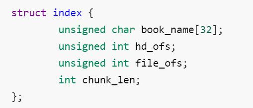

book_name用来存储书名，hd_ofs存储这段存储空间在硬盘中的偏移，file_ofs存储这段存储空间存储的内容在书中的偏移，chunk_len存储这段存储空间的长度，看起来是能工作的，那么这样的设计够不够好呢，答案显然是需要拿出工匠精神再来打磨一下了。

book_name，这里看起来很糟糕，如果书名很长则无法存储完整，如果书名很短则浪费了存储空间，这里真的需要存储一个书名吗？按照我的需求，盗墓笔记全套是8本书，那么第一本书，我这里记录1即可，依次则是2,3,4,...，我只需要数字就可以进行区分，于是新的设计出现了

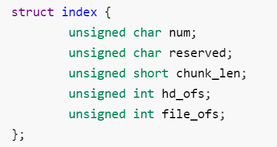

但是，新的问题又出现了，我能够通过一个个的index对象找到数据块，但是我该如何找到这些index对象呢？由于每个index对象占用12字节，那么将index搓堆存在一个只存储index的数据块内，那么一个块能存170个index，就像下面这样


很好，现在有了一个index块，那么170个index最多只能映射(170 * 2048)字节(340KB)的内容，可我要存储的盗墓笔记不止这么点内容，所以还需要更多的index块

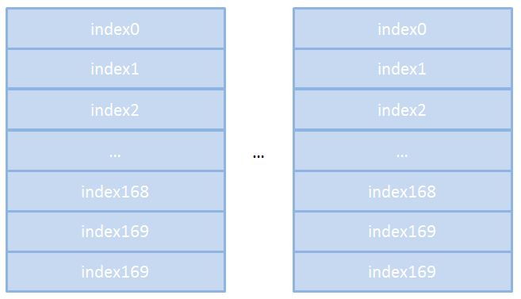

很好，现在有了更多的index块，我能通过index找到想要看的内容，但是index块也是不连续的，我要如何找到index块在哪里呢？其实，我对之前每个数据块填充170个index对象已经感觉难受了，因为170个index对象只使用了2040字节，这样一个数据块就有8字节的浪费，如果这8字节用来存储另一个index块在硬盘中的偏移位置，那么index块之间就能串联在一起，而我要做的就是找到那个入口

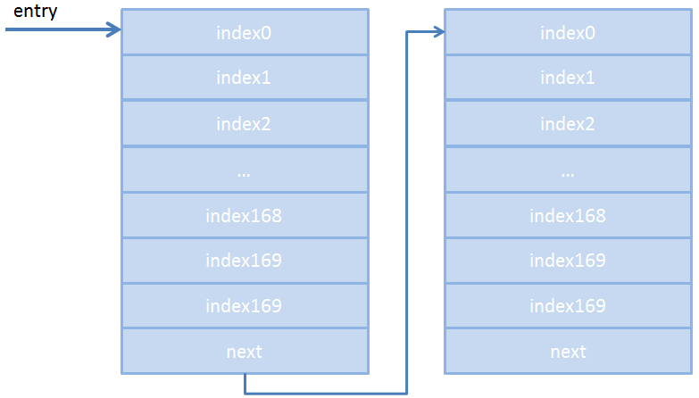


## 虚拟文件系统概述

### VFS简介

虚拟文件系统（Virtual File System，简称VFS）是Linux内核的子系统之一，它为用户程序提供文件和文件系统操作的统一接口，屏蔽不同文件系统的差异和操作细节。借助VFS可以直接使用open()、read()、write()这样的系统调用操作文件，而无须考虑具体的文件系统和实际的存储介质。

举个例子，Linux用户程序可以通过read() 来读取ext3、NFS、XFS等文件系统的文件，也可以读取存储在SSD、HDD等不同存储介质的文件，无须考虑不同文件系统或者不同存储介质的差异。

通过VFS系统，Linux提供了通用的系统调用，可以跨越不同文件系统和介质之间执行，极大简化了用户访问不同文件系统的过程。另一方面，新的文件系统、新类型的存储介质，可以无须编译的情况下，动态加载到Linux中。

"一切皆文件"是Linux的基本哲学之一，不仅是普通的文件，包括目录、字符设备、块设备、套接字等，都可以以文件的方式被对待。实现这一行为的基础，正是Linux的虚拟文件系统机制。

### VFS原理

VFS之所以能够衔接各种各样的文件系统，是因为它抽象了一个通用的文件系统模型，定义了通用文件系统都支持的、概念上的接口。新的文件系统只要支持并实现这些接口，并注册到Linux内核中，即可安装和使用。

举个例子，比如Linux写一个文件：

```
int ret = write(fd, buf, len);

```
调用了write()系统调用，它的过程简要如下：

- 首先，勾起VFS通用系统调用sys_write()处理。
- 接着，sys_write()根据fd找到所在的文件系统提供的写操作函数，比如op_write()。
- 最后，调用op_write()实际的把数据写入到文件中。

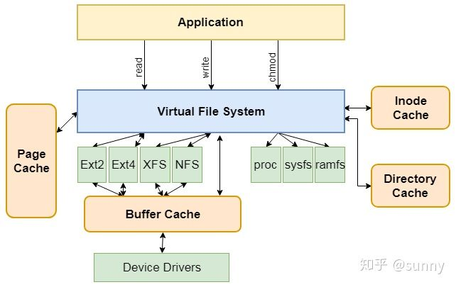

### 虚拟文件系统组成部分

Linux为了实现这种VFS系统，采用面向对象的设计思路，主要抽象了四种对象类型：

- 超级块对象：代表一个已安装的文件系统。
- 索引节点对象：代表具体的文件。
- 目录项对象：代表一个目录项，是文件路径的一个组成部分。
- 文件对象：代表进程打开的文件。

每个对象都包含一组操作方法，用于操作相应的文件系统。

备注：Linux将目录当做文件对象来处理，是另一种形式的文件，它里面包含了一个或多个目录项。而目录项是单独抽象的对象，主要包括文件名和索引节点号。因为目录是可以层层嵌套，以形成文件路径，而路径中的每一部分，其实就是目录项。

接下来介绍一下各个对象的作用以及相关操作。

#### 超级块

超级块用于存储文件系统的元信息，由super_block结构体表示，定义在<linux/fs.h>中，元信息里面包含文件系统的基本属性信息，比如有：

- 文件系统类型、大小、区块数
- 索引节点信息
- 操作方法 s_op
- 等等等等

其中操作方法 s_op 对每个文件系统来说，是非常重要的，它指向该超级块的操作函数表，包含一系列操作方法的实现，这些方法有：

- 分配inode
- 销毁inode
- 读、写inode
- 文件同步
- 等等

Linux支持众多不同的文件系统，file_system_type结构体用于描述每种文件系统的功能和行为，包括：

- 名称、类型等
- 超级块对象链表
- 等

当向内核注册新的文件系统时，其实是将file_system_type对象实例化，然后加入到Linux的根文件系统的目录树结构上。

#### 索引

索引节点对象包含Linux内核在操作文件、目录时，所需要的全部信息，这些信息由inode结构体来描述，定义在<linux/fs.h>中，主要包含：

- 文件大小、访问时间、权限相关信息
- 目录相关信息
- 等等


一个索引节点inode代表文件系统中的一个文件，只有当文件被访问时，才在内存中创建索引节点。与超级块类似的是，索引节点对象也提供了许多操作接口，供VFS系统使用，这些接口包括：

- create(): 创建新的索引节点（创建新的文件）
- link(): 创建硬链接
- symlink(): 创建符号链接。
- mkdir(): 创建新的目录。


#### 目录项

前面提到VFS把目录当做文件对待，比如/usr/bin/vim，usr、bin和vim都是文件，不过vim是一个普通文件，usr和bin都是目录文件，都是由索引节点对象标识。

由于VFS会经常的执行目录相关的操作，比如切换到某个目录、路径名的查找等等，为了提高这个过程的效率，VFS引入了目录项的概念。一个路径的组成部分，不管是目录还是普通文件，都是一个目录项对象。/、usr、bin、vim都对应一个目录项对象。不过目录项对象没有对应的磁盘数据结构，是VFS在遍历路径的过程中，将它们逐个解析成目录项对象。

目录项由dentry结构体标识，定义在<linux/dcache.h>中，主要包含：

- 目录关联的索引节点对象/父目录项对象地址/目录项链表
- 目录项操作指针
- 等等

目录项有三种状态：

- 被使用：该目录项指向一个有效的索引节点，并有一个或多个使用者，不能被丢弃。
- 未被使用：也对应一个有效的索引节点，但VFS还未使用，被保留在缓存中。如果要回收内存的话，可以撤销未使用的目录项。
- 负状态：没有对应有效的索引节点，因为索引节点被删除了，或者路径不正确，但是目录项仍被保留了。

将整个文件系统的目录结构解析成目录项，是一件费力的工作，为了节省VFS操作目录项的成本，内核会将目录项缓存起来。

#### 文件

文件对象是进程打开的文件在内存中的实例。Linux用户程序可以通过open()系统调用来打开一个文件，通过close()系统调用来关闭一个文件。由于多个进程可以同时打开和操作同一个文件，所以同一个文件，在内存中也存在多个对应的文件对象，但对应的索引节点和目录项是唯一的。

文件对象由file结构体表示，定义在<linux/fs.h>中，主要包含：

- 打开文件时的读写标识/文件指针的偏移/文件对象的引用计数
- 文件操作方法
- 等等等等

类似于目录项，文件对象也没有实际的磁盘数据，只有当进程打开文件时，才会在内存中产生一个文件对象。

#### 文件与进程的关系

每个进程都有自己打开的一组文件，由file_struct结构体标识，该结构体由进程描述符中的files字段指向。

- fdt
- fd_array[NR_OPEN_DEFAULT]
- 引用计数
- 等

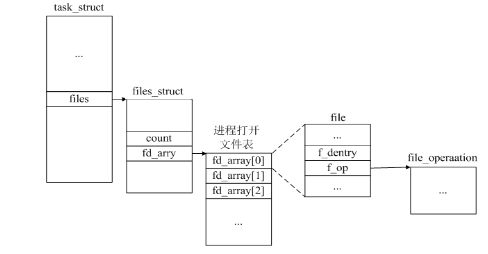

fd_array数组指针指向已打开的文件对象，如果打开的文件对象个数 > NR_OPEN_DEFAULT，内核会分配一个新数组，并将 fdt 指向该数组。

除此之外，内核还为所有打开文件维持一张文件表，包括：

- 文件状态标志
- 文件偏移量
- 等

每个文件都会有一个唯一的inode，这个inode是存储在磁盘中的，当访问到这个文件的时候，这个inode的信息就会被读取到内存中，从而产生所谓的i节点，也就是inode在内存中的表示，这个i节点对应的是文件的inode，保存了文件长度，文件的数据块、文件几个时间等内容。但是每一个打开的文件都需要在内存中保存一定的信息，例如当前的偏移量，open操作时使用的flags等信息，当然最终的信息还是与该文件i节点之间的指针，这个打开的文件的结构被称为v节点，通过与之关联的i节点就能够找到具体的文件的数据和元数据信息了。

但是同一个文件可能被不同的进程打开，甚至会被同一个进程多次打开，每次打开会产生一个fd，这个fd只是该进程v节点表的一个索引，如果fork出来一个子进程，子进程会共享父进程打开的文件，也就是会产生两个fd指向同一个v节点的情况，这个通过v节点中的引用计数标示。

在Linux操作系统中，文件表项对应的是struct file对象，是所有进程共享的，每次 open 都会产生一个新的文件表项。文件表中的一个表项可能会被多个描述符指向，引用计数用来表示当前有多少个描述符指向该文件表表项。当调用 close() 函数时，系统会将描述符对应的文件表表项的引用计数减1，然后如果引用计数已经为0，则系统会删除此文件表表项。

当程序调用 fork() 函数时， 则会出现（不同进程的）多个描述符对应于同一个文件表表项的情况：

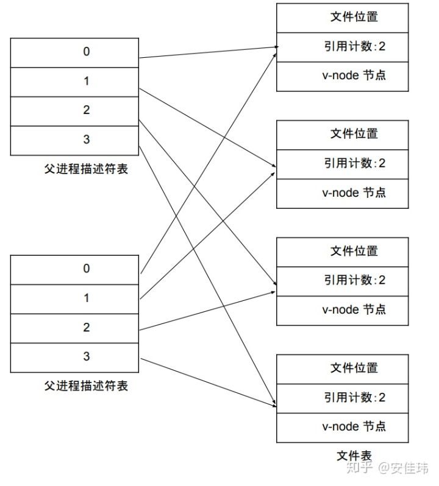

v 节点在 linux 中相当于 i 节点。

i节点对应的是inode对象，一个i节点只与文件是一一对应的，但是v节点对应的是一个进程的一次open操作，所以会出现一个v节点与多个i节点关联的情况，但是每一个进程打开同一个文件中的偏移量是不一样的，所以会出现多个进程写同一个文件出现混乱的情况。


- 一个进程打开多个文件：

    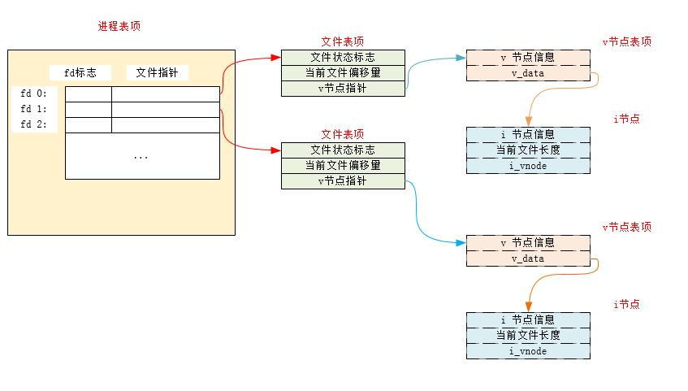 

   - 多个进程打开同一个文件：
   
   
   
   - 进程 fork() 打开同一个文件：

   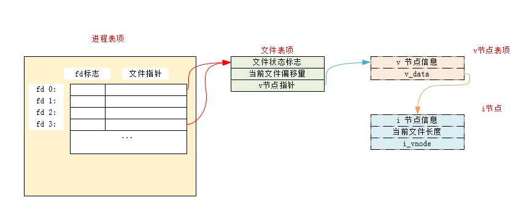 


## EXT 文件系统

### 整体布局

Ext2文件系统将磁盘划分为大小相等的逻辑块进行管理，其默认大小是4KB（不做特殊说明，本文后续内容都采用该默认值）。文件系统逻辑块的大小在格式化的时候可以指定的。文件系统将磁盘划分为逻辑块就好像一个大厦划分为若干个房间，或者超市规划为若干货架一样。同时为了便于管理和避免访问冲突，其将若干个逻辑块组成一个大的逻辑块，称为块组（Block Group）。块组是Ext2文件系统的管理单元，块组中又包含若干管理数据（元数据）实现对块组中的逻辑块的管理，比如那些逻辑块是什么功能，那些逻辑块已经被使用等等。


如图是Ext2文件系统的磁盘布局图。如中间蓝色为磁盘的逻辑空间，它被划分为若干个块组。每个块组的大小相等。如果我们在格式化的时候采用的是默认参数，此时块组的大小是128MB（后面介绍为什么是128MB），每个逻辑块的大小是4KB。


每个块组内部都有相关的元数据对该块组进行管理。如图3所示，第一个块组中的元数据包括引导块、超级块、块组描述符、预留GDT块、数据块位图、inode位图、inode表和其它数据块。后续块组中有些是对超级块的备份，有些则没有第一个块组这么完整的元数据信息，而只有数据块位图、inode位图和inode表等元数据信息。也就是说块组其实分为两种，一种是有超级块的，比较复杂的块组（如图3下面淡棕色所示），另外一种是没有超级块的，比较简单的块组（如图3上面淡绿色所示）。

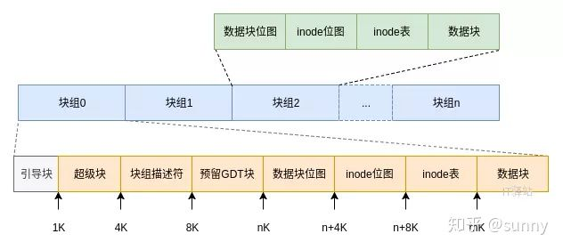

引导块是作为引导操作系统用的，在文件系统作为根文件系统时使用。在系统加电启动是，其内容有BIOS自动装载并执行。它包含一个启动装载程序，用于从计算机安装的操作系统中选择一个启动，还负责继续启动过程。因此Ext2文件系统把这个区域预留出来，不作为文件系统管理的磁盘区域。

超级块是文件系统起始位置，用于整个文件系统，它作为文件系统的入口，记录了整个文件系统的关键信息。而上面提到的其它元数据则只针对本块组。

#### 超级块（SuperBlock）

超级块记录了整个文件系统的各种信息，包括逻辑块的数量、inode数量、支持的特性和维护信息等内容。为了保证整个文件系统的完整性，例如突然断电或者系统崩溃等场景，文件系统出现元数据损坏的情况，Ext2文件系统对超级块进行了备份。这样可以保证即使在第一个超级块出现损坏的情况下，仍然可以通过其它块组中的超级块进行恢复，不至于整个文件系统都不可访问。

超级块位于第1个逻辑块内，由于第一个块组预留了1KB的内容作为系统引导，因此在该块组超级块的位置在1KB偏移处，而其它备份块组中的超级块都在该块组偏移为0的地方。超级块会占用1个逻辑块的空间（实际占用空间要小于该值），也就是说块组描述符（ext2_group_desc）是在4KB偏移的地方。

#### 块组描述符

块组描述符，顾名思义是对该块组的描述，其中包括该块组中数据块位图的位置、inode位图位置和inode表位置等信息。另外，还包括数据块和inode的剩余情况等信息。块组描述符位于第2个逻辑块，占用一个逻辑块的空间。

#### 数据块位图

数据块位图标识了块组中那个数据块被使用了，那个没有被使用。磁盘中每个被管理的逻辑块在该位图中用1bit进行表示，0为未使用，1为已经使用。数据块位图占用1个逻辑块，对于默认块大小(4KB)情况，可以管理40968个逻辑块，也即40968*4096=128MB的空间。当然如果格式化的时候块大小为8KB，则管理的空间会更大一些。

#### inode位图

inode位图与逻辑块位图类似，描述inode的使用情况。inode用于唯一标识一个文件，其为一个编号。文件系统根据这个编号查找具体的问题。在inode位图中每一位标识inode表中的个inode是否被使用。

#### inode表

inode表一列表的形式保存了文件的元数据信息，包括文件大小、扩展属性和时间等内容。由于inode结构的大小根据格式化文件系统的属性而有差异，因此该表占用的磁盘空间不定，大概若干个逻辑块的大小。关于文件名称与inode数据结构的关系是通过inode的id确定的，在文件夹中的文件存储包含文件名和inode的id信息，而通过该id可以计算出inode数据结构位于的块组位置和inode表位置。

### 目录与文件

先我们需要意识到的是目录本质上也是一个文件，只不过其中存储的数据是关于子目录和文件的名称信息。理解到这一层面对理解后续内容来说很重要。在逻辑层面上，文件就是一个线性空间，可以理解为一个大的数组（物理层面可能是分散的，暂时不考虑）。 那么这个大数组中的元素是什么呢？就是图6所示的这个结构体。从该结构体可以看出，每一项内容包括inode的id、该结构体的大小、文件（子目录）名大小和文件名等信息。在检索目录内容的时候，其实就是根据文件名获得inode的id，然后在根据该id从inode表中获得inode（文件）的详细信息。

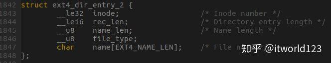

为了便于理解上述数据结构，我们看一个具体的例子。我们在一个目录中创建文件名为test-0到test-2000等几千个文件，然后把目录中一部分数据导出到某个文件中，图7是这个文件的局部数据。可以对照这图7的数据和图6的数据结构理解一下，图中test-223文件的inode是0X800E1（524513），文件名长度为0X8，结构体长度为0X10（16）。

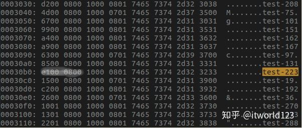

#### 文件读取流程

文件系统需要链接到目录树才能被我们使用，也就是所谓的挂载，挂载点一定是目录，该目录是文件系统的入口。假设我们想要读取文件/etc/paswd的内容，那么一般需要从根目录的inode内容开始往下读，直到找到正确的文件名

- 寻找/的inode：通过挂载点信息找到inode号码为2的inode，且其权限可以让我们读取block的内容；
- /的block：根据block的内容找到含有etc/目录的inode号码261633；
- etc/的inode：根据261633号inode内容中的权限值，知道可以读取etc/的block内容；
- etc/的block：根据block号码找到含有passwd文件的inode号码261846；
- passwd的inode：根据261846号inode内容中的权限值，知道可以读取passwd的block内容；
- passwd的block：读取block中的内容至内存缓冲区。


#### 目录查询加速

对于大目录，如何提升查询性能。在Ext4文件系统中实现了一个名为目录索引的特性，通过索引可以极大的提升性能。

在Ext4文件系统中这个索引是通过一个成为哈希树（多叉树）的方式实现的，其中Key为文件名的哈希值，而Value则是具体的数据位置（磁盘块位置）。由于Key是有序的，因此查找非常方便，也就是可以通过文件名快速的找到ext4_dir_entry_2，然后可以找到inode信息。 如图9是关于哈希树的一个简单示意图，例如其中hash1和hash2之间的值的文件名都存储在hash1所指向的块中，而hash2和hash3之间的内容则存储在hash2存储的块中，以此类推。当然，这里给出的是一个一层的哈希树，实际上可以是二层。

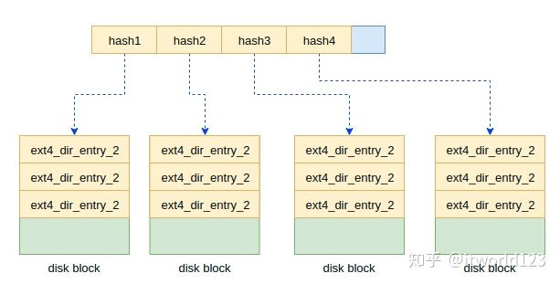

我们结合Ext4文件系统的数据结构可以将哈希树调整为图11所示。从这个图上可以看出inode节点并没有任何变化，而是其中i_block指针发生了变化。这里从原来的Extent B树变成了现在的哈希树。

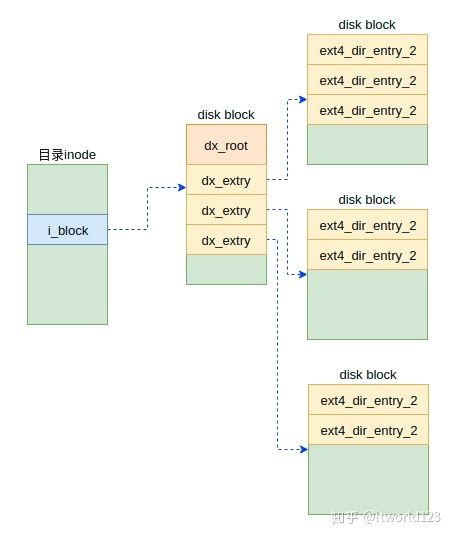

#### 分配磁盘块

前文我们看到了在inode里面有一个i_zone的数组，其大小为9。这个数组就是用来存储文件数据的位置信息的。在这个数组中，其前7个元素直接存储文件数据的位置信息。而第8个元素存储的不是文件的数据位置信息，但也是一个磁盘块，而在该磁盘块中存储的文件的位置信息。以此类推，第9个元素通过2级块来记录文件的数据位置信息。这种中间有1级或者2级磁盘块存储文件位置信息的方式称为间接块的方式。如下是文件系统文件存储数据的示意图。

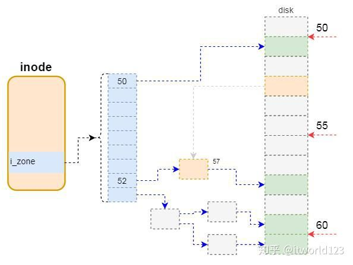

为了更加容易理解，我们举几个例子（文件系统的块大小为1KB）。假设文件比较小，只有几十个字节，此时通过一个块就可以存储这些数据，因此通过i_zone中的第一个元素就可以表示该文件的数据。如上图中，第一个元素为50，表示数据存储在磁盘偏移为50个块的位置。

如果文件的数据大于7KB，比如最简单的位于8KB的位置。此时前7个元素只能存储7KB的数据，因此需要用到第8个元素。而第8个元素存储的是一个间接块的位置信息，比如上图中52是间接块的位置。而在该间接块中会依次存储文件逻辑偏移对应的数据的位置。比如该间接块中第一个数据为57，表示文件8KB偏移的数据存储在磁盘57KB的位置。

### Ext2/Ext3/Ext4的区别和比较

#### Ext2与Ext3的比较

ext3和ext2的主要区别在于，ext3引入Journal（日志）机制，Linux内核从2.4.15开始支持ext3，它是从文件系统过渡到日志式文件系统最为简单的一种选择，ext3提供了数据完整性和可用性保证。

- ext2和ext3的格式完全相同，只是在ext3硬盘最后面有一部分空间用来存放Journal的记录；
- 在ext2中，写文件到硬盘中时，先将文件写入缓存中，当缓存写满时才会写入硬盘中；
- 在ext3中，写文件到硬盘中时，先将文件写入缓存中，待缓存写满时系统先通知Journal，再将文件写入硬盘，完成后再通知Journal，资料已完成写入工作；
- 在ext3中，也就是有Journal机制里，系统开机时检查Journal的内容，来查看是否有错误产生，这样就加快了开机速度；

#### Ext3与Ext4的比较

Linux内核从2.6.28开始支持ext4文件系统，相比于ext3提供了更佳的性能和可靠性。下面先简单罗列出二者的差异，后续文章再来深入探索。

1. 与 Ext3 兼容。 执行若干条命令，就能从 Ext3 在线迁移到 Ext4，而无须重新格式化磁盘或重新安装系统。原有 Ext3 数据结构照样保留，Ext4 作用于新数据，当然，整个文件系统因此也就获得了 Ext4 所支持的更大容量。 

2. 更大的文件系统和更大的文件。 较之 Ext3 目前所支持的最大 16TB 文件系统和最大 2TB 文件，Ext4 分别支持 1EB的文件系统，以及 最大16TB 的文件。 
3. 无限数量的子目录。 Ext3 目前只支持 32,000 个子目录，而 Ext4 支持无限数量的子目录。 
4. Extents。 Ext3 采用间接块映射，当操作大文件时，效率极其低下。比如一个 100MB 大小的文件，在 Ext3 中要建立 25,600 个数据块（每个数据块大小为 4KB）的映射表。而 Ext4 引入了现代文件系统中流行的 extents 概念，每个 extent 为一组连续的数据块，上述文件则表示为“该文件数据保存在接下来的 25,600 个数据块中”，提高了不少效率。 
5. 多块分配。 当写入数据到 Ext3 文件系统中时，Ext3 的数据块分配器每次只能分配一个 4KB 的块，写一个 100MB 文件就要调用 25,600 次数据块分配器，而 Ext4 的多块分配器“multiblock allocator”（mballoc） 支持一次调用分配多个数据块。 


## 块设备驱动程序

### 块设备驱动整体框架

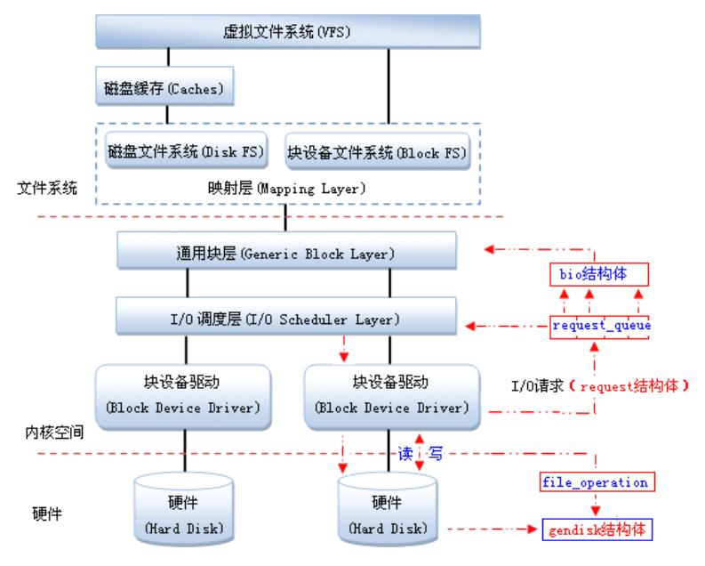

在Linux中，驱动对块设备的输入或输出(I/O)操作，都会向块设备发出一个请求，在驱动中用request结构体描述。但对于一些磁盘设备而言请求的速度很慢，这时候内核就提供一种队列的机制把这些I/O请求添加到队列中（即：请求队列），在驱动中用request_queue结构体描述。在向块设备提交这些请求前内核会先执行请求的合并和排序预操作，以提高访问的效率，然后再由内核中的I/O调度程序子系统来负责提交  I/O 请求，  调度程序将磁盘资源分配给系统中所有挂起的块 I/O  请求，其工作是管理块设备的请求队列，决定队列中的请求的排列顺序以及什么时候派发请求到设备。

由通用块层(Generic Block Layer)负责维持一个I/O请求在上层文件系统与底层物理磁盘之间的关系。在通用块层中，通常用一个bio结构体来对应一个I/O请求。

Linux提供了一个gendisk数据结构体，用来表示一个独立的磁盘设备或分区，用于对底层物理磁盘进行访问。在gendisk中有一个类似字符设备中file_operations的硬件操作结构指针，是block_device_operations结构体。

当多个请求提交给块设备时，执行效率依赖于请求的顺序。如果所有的请求是同一个方向（如：写数据），执行效率是最大的。内核在调用块设备驱动程序例程处理请求之前，先收集I/O请求并将请求排序，然后，将连续扇区操作的多个请求进行合并以提高执行效率（内核算法会自己做，不用你管），对I/O请求排序的算法称为电梯算法（elevator algorithm）。

### 磁盘数据页的典型构造

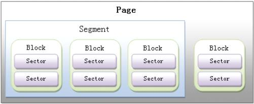

#### 扇区

块设备的每次数据传输都作用于一组称为扇区的相邻字节。

大部分磁盘设备中，扇区大小为 512 字节。

#### 块

扇区是硬件设备传输数据的基本单位，而块是 VFS 和文件系统传输数据的基本单位。

Linux 中，块大小必须是 2 的幂，且不能超过一个页框。
此外，它必须是扇区大小的整数倍，因为每个块必须包含整个扇区。

每个块都需要自己的块缓冲区，它是内核用来存放内容的 RAM 内存区。
缓冲区的首部是一个与每个缓冲区相关的 buffer_head 类型的描述符。

buffer_head 中的某些字段：

- b_page：块缓冲区所在页框的页描述符地址。如果页框位于高端内存中，那么 b_data 字段存放页中块缓冲区的偏移量；
否则，存放缓冲区本身的起始线性地址。
- b_blocknr：存放逻辑块号（如磁盘分区中的块索引）。
- b_bdev：标识使用缓冲区首部的块设备。


#### 段

对磁盘的每个 I/O 操作就是在磁盘与一些 RAM 单元间相互传送一些相邻扇区是内容。
大多数情况下，磁盘控制器之间采用 DMA 方式进行数据传送。
块设备驱动程序只要向磁盘控制器发送一些适当的命令就可以触发一次数据传送，完成后，控制器会发出一个中断通知块设备驱动程序。

新的磁盘控制器支持所谓的分散-聚集 DMA 传送方式：磁盘可与一些非连续的内容区相互传送数据。

启动一次分散-聚集 DMA 传送，块设备驱动程序需要向磁盘控制器发送：

- 要传送的起始磁盘扇区号和总的扇区数
- 内存区的描述符链表，其中链表的每项包含一个地址和一个长度

磁盘控制器负责整个数据传送。

为了使用分散-聚集 DMA 传送方式，块设备驱动程序必须能处理称为段的数据存储单元。
一个段就是一个内存页或内存页中的一部分，它们包含一些相邻磁盘扇区中的数据。
因此，一次分散-聚集 DMA 操作可能同时传送几个段。

如果不同的段在 RAM 中相应的页框正好是连续的且在磁盘上相应的数据块也是相邻的，那么通用块层可合并它们，产生更大的物理段。


### 通用块层

#### 作用

通用块层是一个内核组件，它处理来自系统中的所有块设备发出的请求。
由于该层提供的函数，内核可容易地做到：

- 将数据缓冲区放在高端内存：仅当 CPU 访问时，才将页框映射为内核中的线性地址空间，并在数据访问后取消映射。
- 通过一些附加的手段，实现一个所谓的“零-复制”模式，将磁盘数据直接存放在用户态地址空间而不是首先复制到内核内存区；事实上，内核为 I/O 数据传送使用的缓冲区所在的页框就映射在进程的用户态线性地址空间中。例如 mmap

#### Bio 结构

bio 描述符，通用块的核心数据结构，描述了块设备的 I/O 操作。
每个 bio 结构都包含一个磁盘存储区标识符（存储区中的起始扇区号和扇区数目）和一个或多个描述符与 I/O 操作相关的内存区的段。

bio 中的某些字段：

- bi_sector: 数据的起始扇区号
- bi_bdev: 块设备描述符的地址
- bio_vec：描述 bio 中的每个段。
- bi_idx：bio_vec 数组中段的当前索引。块 I/O 操作器间 bio 描述符一直保持更新，例如，如果块设备驱动程序在一次分散-聚集 DMA 操作中不能完成全部的数据传送，则 bio 中的 bi_idx 会不断更新来指向待传送的第一个段。为了从索引 bi_idx 指向当前段开始不断重复 bio 中的段，设备驱动程序可以执行 bio_for_each_segment。

#### 磁盘和磁盘分区表示

磁盘由 gendisk 对象描述。

通常硬盘被划分成几个逻辑分区。每个块设备文件要么代表整个磁盘，要么代表磁盘中的某个分区。

如果将一个磁盘分成几个分区，则分区表保存在 hd_struct 结构的数组中。

#### 提交请求

当向通用块层提交一个 I/O 操作请求时，内核所执行的步骤：

- bio_alloc() 分配一个新的 bio 描述符，然后，内核通过设置一些字段初始化 bio 描述符
- 调用 generic_make_request()
- 获取与块设备请求相关的请求队列 q
- 调用 q->make_request_fn 方法将 bio 请求插入请求队列 q 中。

#### I/O 调度程序

只要可能，内核就试图把几个扇区合并在一起，作为一个整体处理，以减少磁头的平均移动时间。

块设备驱动程序是中断驱动的：

- 通用块层调用 I/O 调度程序产生一个新的块设备请求，或扩展一个已有的块设备请求，然后终止。
- 激活的块设备驱动程序会调用一个策略例程来选择一个待处理的请求，并向磁盘控制器发出一条命令以满足该请求。
- 当 I/O 操作终止时，磁盘控制器就产生一个中断，相应的中断处理程序就又调用策略例程去处理队列中的另一个请求。

每个块设备的待处理请求都是用一个请求描述符表示的，存放于 request 数据结构。bio、biotail：每个请求包含一个或多个 bio 结构。最初，通用层创建一个仅包含一个 bio 结构的请求。然后，I/O 调度程序要么向初始 bio 中增加一个新段，要么将另一个 bio 结构链接到请求，从而“扩展”该请求。bio 字段指向第一个 bio 结构，biotail 指向最后一个 bio 结构。

请求队列由一个大的数据结构 request_queue 表示。

### I/O 调度算法

#### “Noop”算法

最简单的 I/O 调度算法。没有排序的队列。

#### “CFQ”算法

目标是在触发 I/O 请求的所有进程中确保磁盘 I/O 带宽的公平分配。
为此，算法使用多个排序队列（缺省为 64）存放不同进程发出的请求。
当处理一个请求时，内核调用一个散列函数将当前进程的线程组标识符换为队列的索引值，然后将一个新的请求插入该队列的末尾。

算法采用轮询方式扫描 I/O 输入队列，选择第一个非空队列，然后将该队列中的一组请求移动到调度队列的末尾。


#### “最后期限”算法

除了调度队列外，还使用了四个队列。其中的两个排序队列分别包含读请求和写请求，请求根据起始扇区数排序。另外两个最后期限队列包含相同的读和写请求，但根据“最后期限”排序。引入这些队列是为了避免请求饿死。

如果当前没有I/O请求过期，则会按照扇区顺序执行I/O请求；如果发现过期的I/O请求，则会处理按照过期时间排序的队列，直到所有过期请求都被发射为止。在处理请求时，该算法会优先考虑读请求.

DEADLINE在CFQ的基础上，解决了IO请求饿死的极端情况。除了CFQ本身具有的IO排序队列之外，DEADLINE额外分别为读IO和写IO提供了FIFO队列。读FIFO队列的最大等待时间为500ms，写FIFO队列的最大等待时间为5s。FIFO队列内的IO请求优先级要比CFQ队列中的高，，而读FIFO队列的优先级又比写FIFO队列的优先级高。优先级可以表示如下：

FIFO(Read) > FIFO(Write) > CFQ

#### “预期”算法

它是“最后期限”算法的一个演变：两个最后期限队列和两个排序队列；I/O 调度程序在读和写请求之间交互扫描排序队列，不过更倾向于读请求。

CFQ和DEADLINE考虑的焦点在于满足零散IO请求上。对于连续的IO请求，比如顺序读，并没有做优化。为了满足随机IO和顺序IO混合的场景，Linux还支持ANTICIPATORY调度算法。ANTICIPATORY的在DEADLINE的基础上，为每个读IO都设置了6ms的等待时间窗口。如果在这6ms内OS收到了相邻位置的读IO请求，就可以立即满足。


## 页高速缓存

几乎所有的文件读写操作都依赖于高速缓存，只有在 O_DIRECT 标志被置位，而进程打开文件的情况下才会出现例外。

页高速缓存中的信息单位是一个完整的页。
一个页包含的磁盘块在物理上不一定相邻，所以不能用设备号和块号标识，而是通过页的所有者和所有者数据中的索引来识别。

### address_space 对象

页高速缓存的核心数据结构是 address_space 对象，它是一个嵌入在页所有者的索引节点对象中的数据结构。

- 高速缓存中的许多页可能属于同一个所有者，从而可能被链接到同一个 address_space 对象
- 该对象还在所有者的页和对这些页的操作之间建立起链接关系。

每个页描述符都包含把页链接到页高速缓存的两个字段 mapping 和 index。

- mapping 指向拥有页的索引节点的 address_space 对象；
- index 表示所有者的地址空间中以页大小为单位的偏移量，即页中数据在所有者的磁盘映像中的位置。

在页高速缓存中查找页时使用这两个字段。

页高速缓存可包含同一磁盘数据的多个副本。因此，两个不同 address_space 对象所引用的两个不同的页中出现了相同的磁盘数据。


address_space 的一些字段：

- host：如果页高速缓存中页的所有者是一个文件，address_space 对象就嵌入在 VFS 索引节点对象的 i_data 字段中。索引节点的 i_mapping 字段总是指向索引节点的数据页所拥有的 i_data 对象。address_space 对象的 host 字段指向其所有者的索引节点对象。

### 基树

为实现页高速缓存的高效查找，每个 address_space 对象对应一棵搜索树。

address_space 的 page_tree 字段是基树的根，包含指向所有者的页描述符的指针。

给定的页索引表表示页在所有者磁盘映像中的位置，内核能通过快速搜索操作确定所需要的页是否在页高速缓存中。

当查找所需要的页时，内核把页索引转换为基树中的路径，并快速找到页描述符所在的位置。

如果找到，内核可从基树获得页描述符，并很快确定所找的页是否为脏页，以及其数据的 I/O 传送是否正值进行。

#### 基树的标记

页高速缓存不仅允许内核能快速获得含有块设备中指定数据的页，还允许内核从高速缓存中快速获得给定状态的页。

页高速缓存不仅允许内核能快速获得含有块设备中指定数据的页，还允许内核从高速缓存中快速获得给定状态的页。

### 把块存放在页高速缓存中

VFS（映射层）和各种文件系统以“块”的逻辑单位组织磁盘数据。

页高速缓存用来存放访问磁盘文件内容时生成的磁盘数据页，而块高速缓存用来存放通过 VFS 访问的快的内容。

每个块缓冲区都有 buffer_head 类型的缓冲区首部描述符，包含内核必须了解的、有关如何处理块的所有信息。

buffer_head 的一些字段：

- b_dev：包含块的块设备，通常是磁盘或分区。
- b_blocknr：逻辑块号，即块在磁盘或分区中的编号。
- b_data：块缓冲区在缓冲区页中的位置。
如果页在高端内存，则 b_data 存放的是块缓冲区相对于页的起始位置的偏移量，否则，b_data 存放块缓冲区的线性地址。

#### 缓冲区页

只要内核必须单独地访问一个块，就要涉及存放块缓冲区的缓冲区页，并检查相应的缓冲区首部。

一个缓冲区页内的所有块缓冲区大小必须相同。

如果一个页作为缓冲区页使用，那么与它的块缓冲区相关的所有缓冲区首部都被收集在一个单向循环链表中。缓冲区页描述符的 private 字段指向页中第一个块的缓冲区首部；每个缓冲区首部存放在 b_this_page 字段，该字段是指向链表中下一个缓冲区首部的指针。每个缓冲区首部把缓冲区页描述符的地址存放在 b_page 字段。

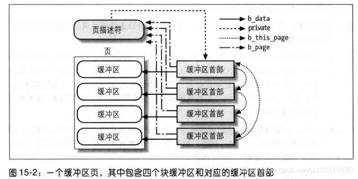

#### 在页高速缓存中搜索块

在页高速缓冲中搜索指定的块缓冲区（由块设备描述符的地址 bdev 和逻辑块号 nr 表示）：

- 获取一个指针，让它指向包含指定块的的块设备的 address_space 对象（bdev->bd_inode->i_mapping）。
- 获得设备的块大小（bdev->bd_block_size），并计算包含指定块的页索引。
如，如果块的大小为 1024 字节，每个缓冲区包含四个块缓冲区，则页的索引为 nr/4。
- 在块设备的基树中搜索缓冲区页。获得页描述符后，内核访问缓冲区首部，它描述了页中块缓冲区的状态。


### 把脏页写入磁盘

只要进程修改了数据，相应的页就被标记为脏页，其 PG_dirty 标志置位。

在下列条件下把脏页写入磁盘：

- 页高速缓存变得太满，但还需要更多的页，或脏页的数据已经太多。
- 自从页变成脏页以来已经过去太长时间。
- 进程请求对块设备或特定文件任何带动的变化都进行刷新。通过调用 sync()、fsync() 或 fdatasync() 实现。

#### pdflush 内核线程

根据以下原则控制 pdflush 线程的产生和消亡：

- 必须有至少两个，最多八个 pdflush 内核线程。
- 如果到最近的 1s 期间没有空闲 pdflush，就应创建新的 pdflush。
- 如果最近一次 pdflush 变为空闲的时间超过了 1s，就删除一个 pdflush。

#### 回写陈旧的脏页

sync()：允许进程把所有脏缓冲区刷新到磁盘。

fsync()：允许进程把属于特定打开文件的所有块刷新到磁盘。

fdatasync()：与 fsync() 相似，但不刷新文件的索引节点块。


## 访问文件

访问文件的模式有多种：

- 规范模式：规范模式下文件打开后，标志 O_SYNC 和 O_DIRECT 清 0，且它的内容由 read() 和 write() 存取。
read() 阻塞调用进程，直到数据被拷贝进用户态地址空间。
但 write() 在数据被拷贝到页高速缓存（延迟写）后马上结束。
- 同步模式：同步模式下文件打开后，标志 O_SYNC 置 1 或稍后由系统调用 fcntl() 对其置 1。
该标志只影响写操作（读操作总是会阻塞），它将阻塞系统调用，直到数据写入磁盘。
- 内存映射模式：内存映射模式下文件打开后，应用程序发出系统调用 mmap() 将文件映射到内存中。
因此，文件就成为 RAM 中的一个字节数组，应用程序就可直接访问数组元素，而不需要调用 read()、write() 或 lseek()。
- 直接 I/O 模式：直接 I/O 模式下文件打开后，标志 O_DIRECT 置 1。
任何读写操作都将数据在用户态地址空间与磁盘间直接传送而不通过页高速缓存。
- 异步模式：异步模式下，文件的访问可以有两种方法，即通过一组 POSIX API 或 Linux 特有的系统调用实现。
所谓异步模式就是数据传输请求并不阻塞调用进程，而是在后台执行，同时应用程序继续它的正常执行。

### 读写文件

read() 和 write() 的服务例程最终会调用文件对象的 read 和 write 方法，这两个方法可能依赖文件系统。
对于磁盘文件系统，这些方法能确定被访问的数据所在物理块的位置，并激活块设备驱动程序开始数据传送。

读文件文件是基于页的，内核总是一次传送几个完整的数据页。
如果进程发出 read() 后，数据不在 RAM 中，内核就分配一个新页框，并使用文件的适当部分填充该页，把该页加入页高速缓存，最后把请求的字节拷贝到进程地址空间中。
对于大部分文件系统，从文件中读取一个数据页等同于在磁盘上查找所请求的数据存放在哪些块上。
该过程完成后，内核通过向通用块成提交适当的 I/O 操作来填充这些页。
大多数磁盘文件系统 read 方法由 generic_file_read() 通用函数实现。

对基于磁盘的文件，写操作比较复杂，因文件大小可改变，因此内核可能会分配磁盘上的一些物理块。
很多磁盘文件系统通过 generic_file_write() 实现 write 方法。

### 直接 I/O 传送

绕过了页高速缓存，在每次 I/O 直接传送中，内核对磁盘控制器进行编程，以便在应用程序的用户态地址空间中自缓存的页与磁盘之间直接传送数据。

当应用程序直接访问文件时，它以 O_DIRECT 标志置位的方式打开文件。
调用 open() 时，dentry_open() 检查打开文件的 address_space 对象是否已实现 direct_IO 方法，没有则返回错误码。

