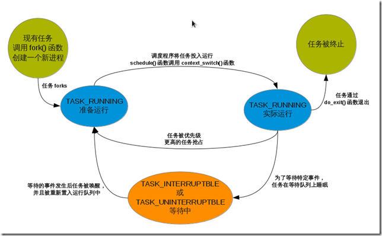
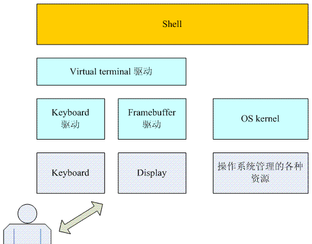
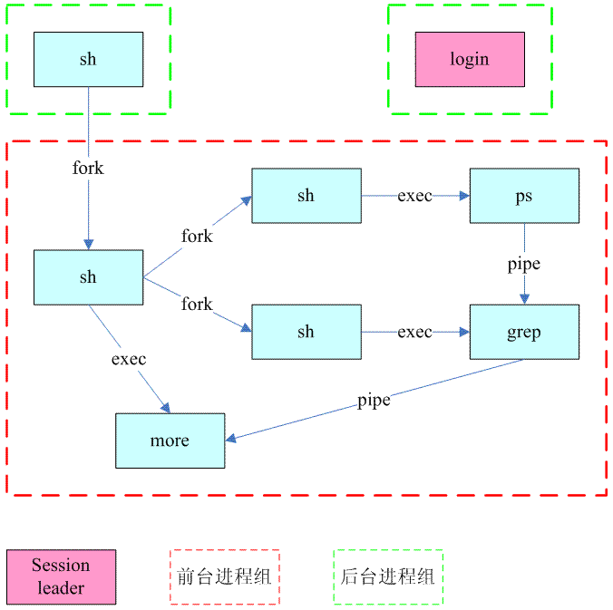
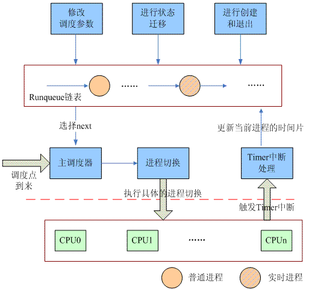
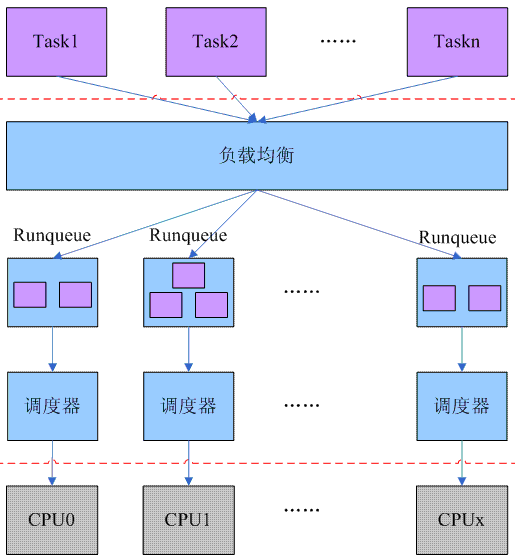
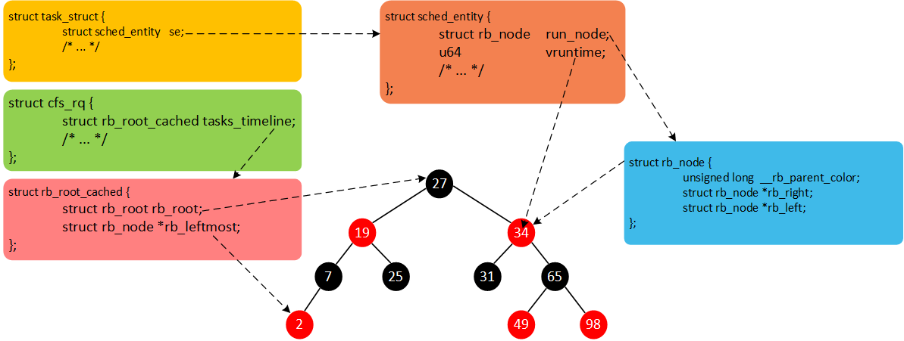
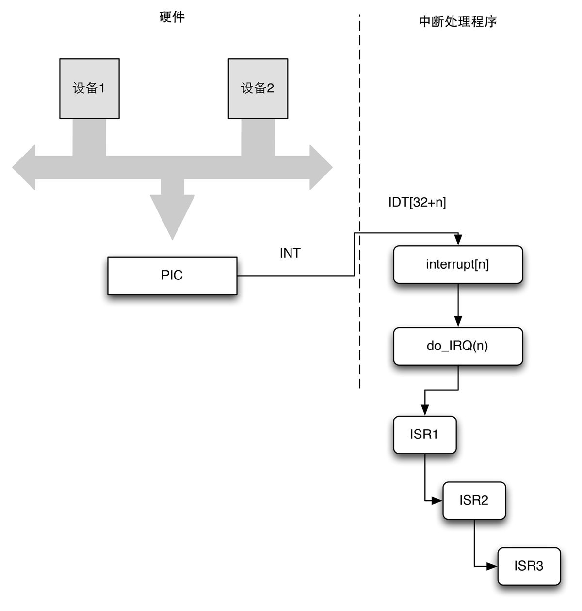
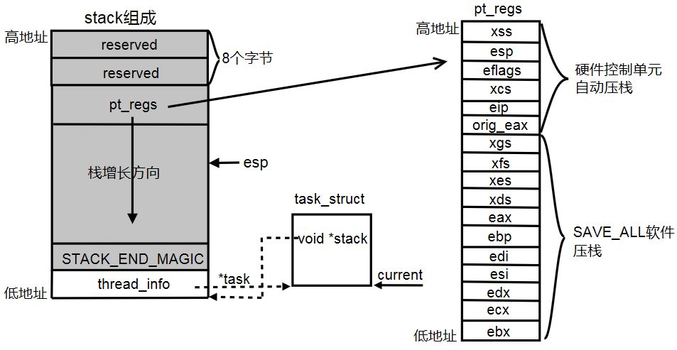
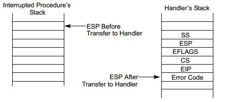
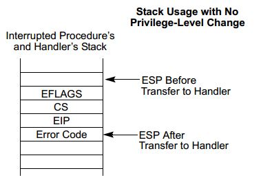

# 操作系统原理——进程管理

## 进程

### 什么是进程？

- 进程：处理执行期的程序以及相关的资源的总称。（可执行代码、打开的文件、挂起的信号、内核内部数据、处理器状态、内存地址空间、执行线程、数据段）
- 线程: 进程中活动的对象，内核最小的调度对象。（独立的程序计数器、进程栈、进程寄存器）
linux线程实现非常特别：不区分线程和进程。
- 进程上下文: 一般程序在用户空间执行，当程序执行系统调用或触发异常，它就陷入内核空间，此时，内核"代表进程执行”并处于进程上下文。（系统调用和异常处理程序是对内核明确定义的接口）
- 进程家族树: 所有进程都是PID为1的init进程的后代。进程间的关系存放在task_struct中。parent指针指向父进程，children保存子进程链表。

### 进程的状态



-  `TASK_RUNNING`（运行）：进程可执行的；或正在执行，或在运行队列中等待执行。这是进程在用户空间中执行的唯一可能的状态。（可执行和正在执行都是这个状态）
- `TASK_INTERRUPTIBLE`（可中断）：进程正在睡眠，等待某些条件的达成，此状态进程可接收信号而被提前唤醒并准备投入运行
- `task_unniterruptible`（不可中断的）：同上，但接收到信号也不会被唤醒
- `__task_traced`：被其他进程跟踪的进程，如ptrace对调试进程进行跟踪。
- `__task_stopped`（停止）

### 线程

线程的创建与普通进程的创建类似，不过在调用clone()的时候需要传递一些参数。
`clone(CLONE_VM | CLONE_FS | CLONE_FILES | CLONE_SIGHAND, 0)`

表明父子共享地址空间、文件系统资源、文件描述符和信号处理程序。

UNIX 程序员希望同一组的线程有共同的 PID，LINUX 引入了线程组的概念，存放在进程描述符的 tgid 中，`getpid()` 系统调用返回当前进程的 tgid 的值而不是 pid 的值。

### 进程之间的关系

#### 什么是终端？

TTY是TeleTYpe的缩写，直译成中文就是电传打字机。随着计算机工业的发展，teletype设备中的印字机构或者穿孔机构模块被显示器取代。使用一台DEC VAX的大型机（mainframe computer），当然，不是独占，这台大型机接出了30多台终端，每个同学拥有一个终端。而终端设备会从每个同学那里接收键盘输入，并且将这些输入通过串行通信的手段发送给VAX大型机，VAX大型机会处理每个用户的键盘输入和命令，然后输出返回并显示在每个终端的屏幕上。

#### 虚拟终端（Virtual Terminal）

传统的终端设备随着时代的进步而消失了，但是我们仍然可以通过个人PC上的图形显示系统（SDRAM中的frame buffer加上LCD controller再加上display panel）和键盘来模拟传统的字符终端设备



由于已经不存在物理的终端设备了，因此Vitual Terminal不可能直接和硬件打交道，它要操作Display和Keyboard的硬件必须要通过Framebuffer的驱动和Keyboard driver。

虚拟终端不是实际的物理终端设备，之所以称为Virtual是因为可以在一个物理图形终端（键盘加上显示器）上同时运行若干个虚拟终端。

#### 什么是控制台（Console）

控制台（console）或者系统控制台（system console）也是一种终端设备，但是又有其特殊性，如下：

（1）可以支持single user mode进行登录

（2）接收来自内核的日志信息和告警信息

#### 什么是伪终端（pseudo terminal或者PTY）

在linux中，伪终端是在无法通过常规终端设备（显示器和keyboard）登录系统的情况下（例如本主机的显示器和keyboard被GUI程序控制，疑惑本主机根本没有显示器和keyboard设备，只能通过网络登录），提供一种模拟终端操作的机制，它包括master和slave两部分。Slave device的行为类似物理终端设备，master设备被进程用来从slave device读出数据或者向slave device写入数据。

#### 什么是shell，什么是登录系统？

终端只是接受用户发来的字符，或者接受系统发来的字符，并没有解析命令的功能。

如果OS kernel是乌龟的身体，，那么shell就是保护乌龟身体的外壳。shell提供访问OS kernel服务的用户接口，用户通过shell可以控制整个系统的运行（例如文件移动、启动进程，停止进程等）。目前的shell主要有两种，一种就是大家熟悉的桌面环境，另外一种就是基于文本command line类型的，主要for业内人事使用。

上面说过了，shell是人类访问、控制计算机服务的接口，不过这个接口有些特殊，shell自己有自己的要求：用户不能通过任意的设备和shell交互，必须是一个终端设备

init进程会创建6个getty进程，这六个getty进程会分别监听在tty1～tty6这六个虚拟终端上，等待用户登录。用户登录之后会根据用户的配置文件（/etc/passwd）启动指定shell程序（例如/bin/bash）。因此，shell其实就是一个命令解析器，运行在拥有计算资源的一侧，通过tty驱动和对端tty设备（可能是物理的终端设备，也可能是模拟的）进行交互。

#### 什么是Job control

实际上一个 JOB 就是一个多个进程构成的进程组。

和终端一样，Job control在现代操作系统中的需求已经不是那么明显，以至于很多工程师都不知道它的存在，不理解Job control相关的概念。在过去，计算机还是比较稀有的年代，每个工程师不可能拥有自己的计算机，工程师都是通过字符终端来登录计算机系统（当然，那个年代没有GUI系统），来分享共同的计算资源。在自己的终端界面上，任务一个个的串行执行，有没有可能让多个任务一起执行呢？（例如后台运行科学运算相关的程序，前台执行了小游戏放松一下）这就是job control的概念了。Job control功能其实就是在一个terminal上可以支持多个job（也就是进程组，后面会介绍）的控制（启动，结束，前后台转换等）。当然，在引入虚拟终端，特别是在GUI系统流行之后，Job control的需求已经弱化了，工程师在有多个任务需求的时候，可以多开一些虚拟终端，或者直接多开几个Termianl窗口程序就OK了，但是，Job control是POSIX标准规定的一个feature，因此，各种操作系统仍然愿意服从POSIX标准，这也使得job control这样的“历史功能”仍然存在现代的操作系统中。

如果不支持Job control，那么登录之后，可以通过终端设备和shell进行交互，执行Job A之后，用户可以通过终端和该进程组（也就是Job A）进行交互，当执行完毕之后，终端的控制权又返回给shell，然后通过用户在终端的输入，可以顺序执行Job B、Job C……在引入Job control概念之后，用户可以并行执行各种任务，也就是说Job A、Job B、Job C……都可以并行执行，当然前台任务（Job）只能有一个，所有其他的任务都是在后台运行，用户和该前台任何进行交互。

通过上面的描述，我们已经了解到了，在用户的操作下，多个Job可以并行执行，但是终端只有一个，而实际上每一个运行中的Job都是渴望和user进行交互，而要达成这个目标，其实核心要解决的问题就是终端的使用问题：

（1）终端的输入要递交给谁？

（2）各个进程是否能够向终端输出？

对于第一个问题，答案比较简单，用户在终端的输入当然是递交给前台Job了，但是那些后台任务需要终端输入的时候怎么办呢？这时候就需要任务控制（Job control）了，这里会涉及下面若干的动作：

（1）后台Job（后者说是后台进程组）对终端进行读访问的时候，终端驱动会发送一个SIGTTIN的信号给相应的后台进程组。

（2）该后台进程组的所有的进程收到SIGTTIN的信号会进入stop状态

（3）做为父进程的shell程序可以捕获该后台进程组的状态变化（wait或者waitpid），知道它已经进入stopped状态

（4）用户可以通过shell命令fg讲该后台进程组转入前台，从而使得它能够通过终端和用户进行交互。这时候，原来的前台任务则转入后台执行。

对于输入，我们严格限定了一个进程组做为接收者，但是对于输出的要求则没有那么严格，你可以有两种选择：

（1）前台任务和后台任务都可以向终端输出，当然，大家都输出，我估计这时候输出屏幕有些混乱，呵呵～～～

（2）前台任务可以输出，但是后台任务不可以。如果发生了后台任务对终端的写访问动作，终端驱动将发送SIGTOUT信号给相应的后台进程组。

除此之外，为了支持job control，终端驱动还需要支持信号相关的特殊字符，包括：

a) Suspend key（缺省control-Z），对应SIGTSTP信号

b) Quit key（缺省control-\），对应SIGQUIT信号

c) Interrupt key（缺省control-C），对应SIGINT信号，

当终端驱动收到用户输入的这些特殊字符的时候，会转换成相应的信号，发送给session中（后面会介绍该术语）的前台进程组，当然，前提是该终端是session的控制终端。因此，为了让那么多的进程组（Job）合理的、有序的使用终端，我们需要软件模块协同工作，具体包括：

（1）支持Job control的shell

（2）终端驱动需要支持Job control

（3）内核必须支持Job control的信号

#### 什么是进程组？

简单的说，进程组就是一组进程的集合，当然，我们不会无缘无故的把他们组合起来，一定是有共同的特性，一方面，这些进程属于同一个Job，来自终端的信号可以送达这一进程组的每一个成员（是为了job control）。此外，我们可以通过killpg接口向一个进程组发送信号。任何一个进程都不是独立存在的，一定是属于某个进程组的，当fork的时候，该进程归入创建者进程所属的进程组，父进程在子进程exec之前可以设定子进程的进程组。比如说shell程序属于进程组A，当用户输入aaa程序fork一个新进程的时候（是shell创建了该进程，没有&符号，是前台进程），aaa进程则归属与进程组A（和shell程序属于同一个进程组），在exec aaa之前，会将其放入一个新的前台进程组，自己隐居幕后。如果用户输入aaa &，整个过程类似之前的描述，只不过shell保持在前台进程组。

通过上面的描述，很多工程师可能认为Shell可以同时运行一个前台进程和任意多个后台进程，其实不然，shell其实是以进程组（也就是Job了）来控制前台和后台的。我们给一个具体的例子：用户通过终端输入的一组命令行，命令之间通过管道连接，这些命令将会形成一个进程组，例如下面的命令：

```
$ proc1 | proc2 & 
$ proc3 | proc4 | proc5

```

对于第一行命令，shell创建了一个新的后台进程组，同时会创建两个进程proc1和proc2，并把这两个进程放入那个新创建的后台进程组（不能访问终端）。执行第二行命令的时候，shell创建了proc3、proc4和proc5三个进程，并把这三个进程加入shell新创建的前台进程组（可以访问终端）。

如何标识进程组呢？这里借用了进程ID来标识进程组。对于任何一个进程组，总有一个最开始的加入者，第一个加入者其实就是该进程组的创始者，我们称之为该进程组的Leader进程，也就是进程ID等于进程组ID的那个进程，或者说，我们用process leader的进程ID来做为process group的ID。当然，随着程序的执行，可能会有进程加入该进程组，也可能程序执行完毕，退出该进程组，对于进程组而言，即便是process group leader进程退出了，process group仍然可以存在，其生命周期直到进程组中最后一个进程终止, 或加入其他进程组为止。

通过getpgid接口函数，我们可以获取一个进程的进程组ID。通过setpgid接口函数，我们可以加入或者新建一个进程组。当然，进程组也不是任意创建或者加入的，一个进程只能控制自己或者它的子进程的进程组。而一旦子进程执行了exec函数之后，其父进程也无法通过setpgid控制该子进程的进程组。还需要注意的是：调用setpgid的进程、设定process group的进程和指定的process group必须在一个sesssion中。最后需要说的一点是：根据POSIX标准，我们不能修改session leader的进程组ID。

#### 什么是Session？

从字面上看，session其实就是用户和计算机之间的一次对话，通俗的概念是这样的：你想使用计算机资源，当然不能随随便便的使用，需要召开一个会议，参加的会议双方分别是用户和计算机，用户把自己的想法需求告诉计算机，而计算机接收了用户的输入并把结果返回给用户。就这样用户和计算机之间一来一去，不断进行交互，直到会议结束。用户和计算机如何交互呢？用户是通过终端设备和计算机交互，而代表计算机和用户交互则是shell进程。每次当发生这种用户和计算机交互过程的时候，操作都会创建一个session，用来管理本次用户和计算机之间的交互。

如果支持job control，那么用户和计算机之间的session可能并行执行多个Job，而Job其实就是进程组的抽象，因此，session其实就是进程组的容器，其中容纳了一个前台进程组（只能有一个）和若干个后台进程组（当然，没有连接的控制终端的情况下，session也可能没有前台进程组，由若干后台进程组组成）。创建session的场景有两个：

（1）一次登录会形成一个session（我们称之login session，大部分的场景都是描述login session的）。

（2）系统的daemon进程会在各自的session中（我们称之daemon session）。

无论哪一个场景，都是通过setsid函数建立一个新的session（注意：调用该函数的进程不能是进程组的leader），由于创建了session，该进程也就成为这个新创建session的leader。之后，session leader创建的子进程，以及进程组也都属于该session。为何process group leader不能调用setsid来创建session呢？我们假设没有这个限制，process group leader（ID等于A）通过setsid把把自己加入另外一个新建的session，有了session就一定要有进程组，创建了sesssion的那个process group leader就成了该session中的第一个进程组leader，标识这个新建的进程组的ID就是A。而其他进程组中的成员仍然在旧的session中，在旧的session中仍然存在A进程组，这样一个进程组A的成员，部分属于新的session，部分属于旧的session，这是不符合session-process group2级拓扑结构的。我了满足这个要求，我们一般会先fork，然后让父进程退出，子进程执行setsid，fork之后，子进程不可能是进程组leader，因此满足上面的条件。

因此，setsid创建了新的session，同时也创建了新的process group，创建session的那个进程ID被用来标识该process group。新创建的sesssion没有控制终端，如果调用setsid的进程有控制终端，那么调用setsid之后，新的session和那个控制终端失去连接关系。如何标识session呢？我们往往使用session leader的process ID来标识。

#### 控制终端（controlling terminal）

通过上面的描述，我们已经知道了：为了进行job control，我们把若干的进程组放入到了session这个容器进行管控。但是，用户如何来管控呢？必须要建立一个连接的管道，我们把和session关联的那个终端称为控制终端，把建立与控制终端连接的session首进程（session Leader）叫做控制进程（controlling process）。session可以有一个控制终端，不能有多个，当然也可以没有。而一个终端也只能和一个session对应，不能和多个session连接。

对于login session，我们登录的那个终端设备基本上就是该session的controlling terminal，而shell程序就是该session的leader，也是该session的controlling process。之所以会有controlling process的概念主要用来在终端设备断开的时候（例如网络登录的场景下，网线被拔出），终端驱动会把hangup signal送到对应session的controlling process。

session可以有一个前台进程组和若干个后台进程组（很好理解，占有控制终端的就是前台，没有的就是后台。当然可以一个前台进程组都没有，例如daemon session）。对于前台进程组，共同占有控制终端。在控制终端键入ctrl+c产生终止信号（或者其他可以产生信号的特殊字符组合）会被递交给前台进程组所有的进程（不会递交给后台进程）。虽然终端被前台进程组掌管，但是通过shell、内核和终端驱动的交互，后台进程组可以被推入到前台，也就是说：所有的session内的进程组可以分时复用该controlling terminal。

当创建一个session的时候，往往没有controlling terminal，当session leader open了一个终端设备，除非在open的时候指明O_NOCTTY，否则该terminal就会称为该session的controlling terminal，当然，该终端也不能是其他session的controlling terminal，否则就会有一个控制终端对应两个session的状况发生了。一旦拥有了控制终端之后，session leader的子进程都会继承这个controlling terminal。除了上面说的隐含式的设定，程序也可以通过ioctl来显示的配置（TIOCSCTTY）controlling terminal，或者通过TIOCNOTTY来解除该终端和session的联系，变成一个普通的终端。

对于login session，session leader会建立和终端的连接，同时把标准输入、输出和错误定向到该终端。因此，对于后续使用shell运行的普通程序而言，我们不需要直接访问控制终端，一般是直接访问标准输入、输出和错误。如果的确是有需要（例如程序的标准输入、输出被重定向了），那么可以通过打开/dev/tty设备节点（major＝5，minor＝0）来访问控制终端，/dev/tty就是当前进程的控制终端。

#### 系统初始化

在系统启动的时候，swapper进程在启动过程中会创建非常多的内核线程，所有内核线程都是在一个session中，属于一个进程组，随着内核线程的不断创建，其process ID从2开始，不断递增。Process ID等于1的那个进程保留给了init进程，这也是内核空间转去用户空间的接口，刚开始，init进程继承了swapper进程的sid和pgid，不过，init进程会在启动过程中调用setsid，从而创建新的session和process group。

#### 虚拟终端登录

对于linux而言，/etc/inittab包括了登录信息，也就是说，init进程需要在哪些终端设备上执行fork动作，并执行（exec）getty程序，因此getty拥有自己的Process ID，并且是一个普通进程，不是session leader，也不是process group leader，在getty程序中会调用setsid，创建新的session和process group，同时，该程序会打开做为参数传递给它的终端设备（对应这个场景应该是ttyx），因此ttyx这个虚拟终端就成了该session的controlling terminal，gettty进程也就是controlling process。一旦正确的打开了终端设备，文件描述符0、1、2都定向到该终端设备。完成这些动作之后，通过标准输出向用户提示登录信息（例如login:）。在用户输入用户名之后，getty进程已经完成其历史使命，它会调用exec加载login程序（PID、PGID、SID都没有变化）。

login进程最重要的任务当然是鉴权了，如果鉴权失败，那么login进程退出执行，而其父进程（也就是init进程）会侦听该事件并重复执行getty。如果鉴权成功，那么login进程会fork子进程并执行shell。刚开始，login进程和shell进程属于一个session，同时也属于同一个前台进程组，共享同一个虚拟终端，也就是说两个进程的controlling terminal都是指向该登录使用的那个虚拟终端。shell进程并非池中之物，最终还是要和login进程分道扬镳的。shell进程会执行setpgid来创建一个新的进程组，然后调用tcsetpgrp将shell所在的进程组设定为前台进程组。

#### shell执行命令

在虚拟终端登陆后，我们可以执行下面的命令：

```
#ps –eo stat,comm,sid,pid,pgid,tty | grep tty | more

```



在/dev/tty1完成登录之后，系统存在两个进程组，前台进程组是shell，后台进程组是login，两个进程组都属于一个session，所有进程的控制终端都是虚拟终端tty1。执行上述命令之后，shell创建了3个进程ps、grep和more，并将这三个进程放到一个新创建的进程组中（ps是进程组leader），同时把该进程组推向前台，shell自己隐居幕后。一旦程序执行完毕，后台的shell收到子进程的信号后，又把自己推到前台来，等待用户输入的下一条命令。

我们假设用户输入下面的命令：

```
#ps –eo stat,comm,sid,pid,pgid,tty | grep tty | more &

```

&符号其实就是后台执行的命令，shell执行这条命令的过程和上图类似，不过这时候并不把新建立的进程组推到前台，shell自己仍然是前台进程组。由于有pipe，输出信息沿着ps—>grep--->more的路径来到了more进程，more进程输出到标准输出，也就是tty1这个虚拟终端的时候，悲剧发生了，后台进程组不能write控制终端，从而引发了SIGTOUT被发送到该后台进程组的每一个进程组，因此，ps，grep和more都进入stop状态。这时候只要在shell执行fg的操作，就可以把ps那个后台进程组推到前台，这时候虚拟终端的屏幕才会打印出相关的进程信息。

### 进程描述符

- `task list`：内核把进程的列表(task_struct)存放在任务队列(task list) 的双向循环链表中。
- 进程描述符(`task_struct`):结构定义<linux/sched.h>,完整地描述一个正在执行的程序（打开的文件、进程地址空间、挂起的信号、进程的状态等）。linux通过slab分配器分配task_struct结构.
- `thread_info` ：由于slab分配器动态生成task_struct,所以只需要在栈底(对于向下增长的栈)或栈顶(对于向上增长的栈)创建一个新的结构struct thread_info。其结构中 task 存放的是实际的 task_struct
- 进程描述符的获取：在内核栈尾部通过thread_info，计算偏移间接查找task_struct。

### 进程切换

#### 任务状态段


80x86体系结构包含了一个特殊的段类型，叫任务状态段（Task State Segment，TSS）来存放硬件上下文，尽管Linux并不使用硬件上下文切换，但是强制它为系统中每个不同的CPU创建一个TSS，这样当80x86的一个CPU从用户态切换到内核态时，它就从TSS中后去内核态堆栈的地址。

#### thread 字段

在每次进程切换时，被替换的进程的硬件上下文必须保存在别处。不能像Intel原始设计那样保存在TSS中，因为Linux为每个处理器而不是为每个进程使用TSS。

因此，每个进程描述符包含一个类型为thread_struct的thread字段，只要进程被切换出去，内核就把其硬件上下文保存在这个结构中。随后可以看到，这个数据结构包含的字段涉及大部分CPU寄存器，但不包括eax、ebx等等这些通用寄存器。它们的值保留在内核堆栈中。

#### 基本流程

```


static inline struct rq * context_switch(struct rq *rq, struct task_struct *prev, 
           struct task_struct *next)－－－－－－－－－－－－－－－－－－（1） 
{ 
    struct mm_struct *mm, *oldmm;

    mm = next->mm; 
    oldmm = prev->active_mm;－－－－－－－－－－－－－－－－－－－（2）

    if (!mm) {－－－－－－－－－－－－－－－－－－－－－－－－－－－（3） 
        next->active_mm = oldmm; 
        atomic_inc(&oldmm->mm_count); 
        enter_lazy_tlb(oldmm, next);－－－－－－－－－－－－－－－－－（4） 
    } else 
        switch_mm(oldmm, mm, next); －－－－－－－－－－－－－－－（5）

    if (!prev->mm) {－－－－－－－－－－－－－－－－－－－－－－－－（6） 
        prev->active_mm = NULL; 
        rq->prev_mm = oldmm; 
    }

    switch_to(prev, next, prev);－－－－－－－－－－－－－－－－－－（7） 
    barrier();

    return finish_task_switch(prev); 
}

```

#### `switch_mm`

每一个进程都有自己独立的一组用于翻译用户空间虚拟地址的Translation table，这些信息保存在内存描述符中，具体位于struct mm_struct中的pgd成员中。以pgd为起点，可以遍历该内存描述符的所有用户地址空间的Translation table。

当发生进程切换的时候，会把 pgd 的值替换 cr3 寄存器中，这样就可以正确的分页解析线性地址。

#### switch_to为什么需要三个参数呢？

一个switch_to将代码分成两段：

```
AAA

switch_to(prev, next, prev);

BBB

```

一次进程切换，涉及到了三个进程，prev和next是大家都熟悉的参数了，对于进程A（下图中的右半图片），如果它想要切换到B进程，那么： 
    
- prev＝A 
- next＝B 


这时候，在A进程中调用 switch_to 完成A到B进程的切换。但是，当经历万水千山，A进程又被重新调度的时候，我们又来到了switch_to返回的这一点（下图中的左半图片），这时候，我们是从哪一个进程切换到A呢？谁知道呢（在A进程调用switch_to 的时候是不知道的）？在A进程调用switch_to之后，cpu就执行B进程了，后续B进程切到哪个进程呢？随后又经历了怎样的进程切换过程呢？当然，这一切对于A进程来说它并不关心，它唯一关心的是当切换回A进程的时候，该cpu上（也不一定是A调用switch_to切换到B进程的那个CPU）执行的上一个task是谁？这就是第三个参数的含义（实际上这个参数的名字就是last，也基本说明了其含义）。也就是说，在AAA点上，prev是A进程，对应的run queue是CPUa的run queue，而在BBB点上，A进程恢复执行，last是X进程，对应的run queue是CPUx的run queue。

简单的说，执行 `switch_to` 函数后，代码就停滞不前了（类似协程转换被切走了，具体发生在 `_switch_to()`），等到 A 进程重新回来后(X 进程暂停到了 `_switch_to()`, A 进程的 `_switch_to()` 函数开始返回，这个时候 X 的描述符在 eax 寄存器中，需要被存放到 last 参数里面去)，`pre`、`next` 也被恢复了，这时候需要 C 存放着 X 进程的描述符，以供后面 `finish_task_switch` 来使用。

#### 在内核线程切换过程中，内存描述符的处理

我们上面已经说过：如果切入内核线程，那么其实进程地址空间实际上并没有切换，该内核线程只是借用了切出进程使用的那个地址空间（active_mm）。对于内核中的实体，我们都会使用引用计数来根据一个数据对象，从而确保在没有任何引用的情况下释放该数据对象实体，对于内存描述符亦然。因此，在context_switch中有代码如下：

```
if (!mm) { 
    next->active_mm = oldmm; 
    atomic_inc(&oldmm->mm_count);－－－－－增加引用计数 
    enter_lazy_tlb(oldmm, next); 
}

```

既然是借用别人的内存描述符（地址空间），那么调用atomic_inc是合理的，反正马上就切入B进程了，在A进程中提前增加引用计数也OK的。话说有借有还，那么在内核线程被切出的时候，就是归还内存描述符的时候了。

这里还有一个悖论，对于内核线程而言，在运行的时候，它会借用其他进程的地址空间，因此，在整个内核线程运行过程中，需要使用该地址空间（内存描述符），因此对内存描述符的增加和减少引用计数的操作只能在在内核线程之外完成。假如一次切换是这样的：…A--->B（内核线程）--->C…，增加引用计数比较简单，上面已经说了，在A进程调用context_switch的时候完成。现在问题来了，如何在C中完成减少引用计数的操作呢？我们还是从代码中寻找答案，如下（context_switch函数中，去掉了不相关的代码）：

```
if (!prev->mm) { 
    prev->active_mm = NULL; 
    rq->prev_mm = oldmm;－－－在rq->prev_mm上保存了上一次使用的mm struct 
}

```

借助其他进程内存描述符的东风，内核线程B欢快的运行，然而，快乐总是短暂的，也许是B自愿的，也许是强迫的，调度器最终会剥夺B的执行，切入C进程。也就是说，B内核线程调用switch_to（执行了AAA段代码），自己挂起，C粉墨登场，执行BBB段的代码。具体的代码在finish_task_switch，如下：

```
static struct rq *finish_task_switch(struct task_struct *prev) 
{ 
    struct rq *rq = this_rq(); 
    struct mm_struct *mm = rq->prev_mm;――――――――――――――――（1）

    rq->prev_mm = NULL;

    if (mm) 
        mmdrop(mm);――――――――――――――――――――――――（2） 
}

```

（1）我们假设B是内核线程，在进程A调用context_switch切换到B线程的时候，借用的地址空间被保存在CPU对应的run queue中。在B切换到C之后，通过rq->prev_mm就可以得到借用的内存描述符。

（2）已经完成B到C的切换后，借用的地址空间可以返还了。因此在C进程中调用mmdrop来完成这一动作。很神奇，在A进程中为内核线程B借用地址空间，但却在C进程中释放它。

## 进程调度

- 多任务：非抢占式和抢占式
- 进程类型：I/O消耗型和处理器消耗型。linux更倾向于优先调度I/O消耗型。
- 关于进程的优先级: 进程的优先级有2种度量方法，一种是nice值，一种是实时优先级。
	- nice值的范围是-20～+19，值越大优先级越低，也就是说nice值为-20的进程优先级最大。
	- 实时优先级的范围是0～99，与nice值的定义相反，实时优先级是值越大优先级越高
	- 实时优先级高于nice值
	- 一个进程不可能有2个优先级。一个进程有了实时优先级就没有Nice值，有了Nice值就没有实时优先级。
- 时间片: 进程在被抢占前能持续运行的时间。linux的CFS调度器不是直接将时间片分给进程，而是将处理器的使用比划分给进程。是否将一个进程投入运行，完全由进程优先级和是否有时间片决定。CFS调度器的抢占时机取决于新的可执行程序消耗了多少处理器使用比，如果消耗的使用比比当前进程小，则新进程立刻投入运行，抢占当前进程。

### O(n)、O(1)和 CFS调度器

#### O(n) 调度器



nice成员就是普通进程的静态优先级，通过NICE_TO_TICKS宏可以将一个进程的静态优先级映射成缺省时间片，保存在counter成员中。因此在一次调度周期开始的时候，counter其实就是该进程分配的CPU时间额度（对于睡眠的进程还有些奖励，后面会描述），以tick为单位，并且在每个tick到来的时候减一，直到耗尽其时间片，然后等待下一个调度周期从头再来。

Linux2.4版本的进程调度器使用了非常简陋的方法来管理可运行状态的进程。调度器模块定义了一个runqueue_head的链表头变量，无论进程是普通进程还是实时进程，只要进程状态变成可运行状态的时候，它会被挂入这个全局runqueue链表中。随着系统的运行，runqueue链表中的进程会不断的插入或者移除。例如当fork进程的时候，新鲜出炉的子进程会挂入这个runqueue。当阻塞或者退出的时候，进程会从这个runqueue中删除。但是无论如何变迁，调度器始终只是关注这个全局runqueue链表中的task，并把最适合的那个任务丢到CPU上去执行。由于整个系统中的所有CPU共享一个runqueue，为了解决同步问题，调度器模块定义了一个自旋锁来保护对这个全局runqueue的并发访问

除了这个runqueue队列，系统还有一个囊括所有task（不管其进程状态为何）的链表，链表头定义为init_task，在一个调度周期结束后，重新为task赋初始时间片值的时候会用到该链表。

计算动态优先级的策略如下：

- 如果该进程的时间片已经耗尽，那么动态优先级是0，这也意味着在本次调度周期中该进程已经再也没有机会获取CPU资源了。
- 如果该进程的时间片还有剩余，那么其动态优先级等于该进程剩余的时间片和静态优先级之和。之所以用（20-nice value）表示静态优先级，主要是为了让静态优先级变成单调上升。之所以要考虑剩余时间片是为了奖励睡眠的进程，因为睡眠的进程剩余的时间片较多，因此动态优先级也就会高一些，更容易被调度器调度执行。

调度器是根据动态优先级来进行调度，谁大就先执行谁: 遍历runqueue_head链表上的所有的进程，临时变量p就是本次需要检查的进程描述符。如何判断哪一个进程是最适合调度执行的进程呢？我们需要计算进程的动态优先级,动态优先级最大的那个进程就是当前最适合调度到CPU执行的进程。一旦选中，调度器会启动进程切换，运行该进程以替换之前的那个进程。

#### O(n) 调度器的问题

- 算法复杂度问题：对runqueue队列的遍历，当系统中runnable进程不多的时候，遍历链表的开销还可以接受，但是随着系统中runnable状态的进程数目增多，那么调度器select next的运算量也随之呈线性的增长，这也是我们为什么叫它O（n）调度器的原因。此外，调度周期结束后，调度器会为所有进程的时间片进行“充值“的动作。在大型系统中，同时存在的进程（包括睡眠的进程）可能会有数千个，为每一个进程计算其时间片的过程太耗费时间。
- SMP扩展性问题：O（n）调度器是通过一个链表来管理系统中的所有的等待调度的进程，访问这个runqueue链表的场景很多，在访问runqueue这个链表的时候，我们都会首先会上自旋锁，在大型系统中，CPU数目非常多，这时候runqueue spin lock就成为系统的性能瓶颈。
- CPU空转问题：在runqueue队列中的全部进程时间片被耗尽之前，系统总会处于这样一个状态：最后的一组尚存时间片的进程分分别调度到各个CPU上去。我们以4个CPU为例，T0～T3分别运行在CPU0~CPU3上。随着系统的运行，CPU2上的T2首先耗尽了其时间片，但是这时候，其实CPU2上也是无法进行调度的，因为遍历runqueue链表，找不到适合的进程调度运行，因此它只能是处于idle状态。也许随后T0和T3也耗尽其时间片，从而导致CPU0和CPU3也进入了idle状态。现在只剩下最后一个进程T1仍然在CPU1上运行，而其他系统中的处理器处于idle状态，白白的浪费资源。唯一能改变这个状态的是T1耗尽其时间片，从而启动一个重新计算时间片的过程，这时候，正常的调度就可以恢复了。随着系统中CPU数目的加大，资源浪费会越来越严重。
- task bouncing issue：假如它运行在系统中的某个CPU中，那么在其处于可运行状态的过程中，最好是一直保持在该CPU上运行。不过在O（n）调度器下，很多人都反映有进程在CPU之间跳来跳去的现象。其根本的原因也是和时间片算法相关。
- RT进程调度性能问题: 实时进程和普通进程挂在一个链表中。当调度实时进程的时候，我们需要遍历整个runqueue列表，扫描并计算所有进程的调度指数，从而选择出心仪的那个实时进程。
- 时间片粒度问题：runqueue中的进程数目会比较多，一次调度周期的时间就会比较长，

#### O（1）调度器



O（n）调度器中只有一个全局的runqueue，严重影响了扩展性，因此在O（1）调度器中引入了per-CPU runqueue的概念。系统中所有的可运行状态的进程首先经过负载均衡模块挂入各个CPU的runqueue，然后由主调度器和tick调度器驱动该CPU上的调度行为。

在调度器中，runqueue是一个很重要的数据结构，它最重要的作用是管理那些处于可运行状态的进程。O（1）调度器引入了优先级队列的概念来管理task

由于支持140个优先级，因此queue成员中有140个分别表示各个优先级的链表头，不同优先级的进程挂入不同的链表中。bitmap 是表示各个优先级进程链表是空还是非空。nr_active表示这个队列中有多少个task。在这些队列中，100～139是普通进程的优先级，其他的是实时进程的优先级。因此，在O（1）调度器中，RT进程和普通进程被区分开了，普通进程根本不会影响RT进程的调度。

Runqueue中有两个优先级队列（struct prio_array）分别用来管理active（即时间片还有剩余）和expired（时间片耗尽）的进程。Runqueue中有两个优先级队列的指针，分别指向这两个优先级队列。随着系统的运行，active队列的task一个个的耗尽其时间片，挂入到expired队列。当active队列的task为空的时候，切换active和expired队列，开始一轮新的调度过程。

#### 传统调度器时间片悖论
	
假设我们调度策略就是根据进程静态优先级确定一个固定大小的时间片，这时候我们在如何分配时间片上会遇到两难的状况：想要给用户交互型进程设定高优先级，以便它能有更好的用户体验，但是分配一个大的时间片是毫无意义的，因为这种进程多半是处于阻塞态，等待用户的输入。而后台进程的优先级一般不高，但是根据其优先级分配一个较小的时间片往往会影响其性能，这种类型的进程最好是趁着cache hot的时候狂奔。

传统调度器固定分配时间片这个设计概念就是错误的。

### Linux中有哪些调度类

Linux中主要包含dl_sched_class、rt_sched_class、fair_sched_class及idle_sched_class等调度类。每一个进程都对应一种调度策略，每一种调度策略又对应一种调度类（每一个调度类可以对应多种调度策略）。例如实时调度器以优先级为导向选择优先级最高的进程运行。每一个进程在创建之后，总是要选择一种调度策略。针对不同的调度策略，选择的调度器也是不一样的。不同的调度策略对应的调度类如下表。

|调度类|	描述|	调度策略
|---|---|---
|dl_sched_class	|deadline调度器	|SCHED_DEADLINE
rt_sched_class	|实时调度器	|SCHED_FIFO、SCHED_RR
fair_sched_class	|完全公平调度器	|SCHED_NORMAL、SCHED_BATCH
idle_sched_class	|idle task	|SCHED_IDLE

优先级为：

```
sched_class_highest----->stop_sched_class
                         .next---------->dl_sched_class
                                         .next---------->rt_sched_class
                                                         .next--------->fair_sched_class
                                                                        .next----------->idle_sched_class
                                                                                         .next = NULL 


```

Linux调度核心在选择下一个合适的task运行的时候，会按照优先级的顺序便利调度类的pick_next_task函数。因此，SCHED_FIFO调度策略的实时进程永远比SCHED_NORMAL调度策略的普通进程优先运行。

### 完全公平调度CFS

CFS的做法是允许每个进程运行一段时间、循环轮转、选择运行最少的进程作为下一个运行进程，而不再采用分配给每个进程时间片的做法，CFS在所有可运行进程总数基础上计算出一个进程应该运行多久，而不是靠nice值计算时间片。nice值在CFS中被作为进程获得处理器运行比的权重。

例如：2个相同优先级的进程在一个cpu上运行，那么每个进程都将会分配50%的cpu运行时间。这就是要实现的公平。例如：2个进程A和B。A的权重是1024，B的权重是2048。那么A获得cpu的时间比例是1024/(1024+2048) = 33.3%。B进程获得的cpu时间比例是2048/(1024+2048)=66.7%。我们可以看出，权重越大分配的时间比例越大

任何进程所获得的处理器时间是由它自己和其他所有可运行进程nice值得相对差值决定的。时间记账公式如下：

>
vruntime = 总的cpu时间 * 进程的权重/就绪队列（runqueue）所有进程权重之和

也就是说，CFS 再也不是给每个进程一个时间片，让进程跑完这个时间片。而是给所有进程一个大时间片，然后让各个进程轮流按照相应的比例去分配这个时间片。

为了方便，调度程序把大时间片转化为虚拟时间大时间片，然后平分给各个进程。进程也把自己的运行时间转化为虚拟运行时间 vruntime，调度的时候去比较 vruntime 和平分后的大时间片，如果还小就继续执行，如果大了就被调度。

而大时间片也是会不断变化的，当进程数量变多的时候，大时间片也会动态变大，这样 vruntime 就会继续增加。

#### 调度延迟

什么是调度延迟？调度延迟就是保证每一个可运行进程都至少运行一次的时间间隔。例如，每个进程都运行10ms，系统中总共有2个进程，那么调度延迟就是20ms。如果有5个进程，那么调度延迟就是50ms。如果现在保证调度延迟不变，固定是6ms，那么系统中如果有2个进程，那么每个进程运行3ms。如果有6个进程，那么每个进程运行1ms。如果有100个进程，那么每个进程分配到的时间就是0.06ms。

随着进程的增加，每个进程分配的时间在减少，进程调度过于频繁，上下文切换时间开销就会变大。因此，CFS调度器的调度延迟时间的设定并不是固定的。当系统处于就绪态的进程少于一个定值（默认值8）的时候，调度延迟也是固定一个值不变（默认值6ms）。当系统就绪态进程个数超过这个值时，我们保证每个进程至少运行一定的时间才让出cpu。这个“至少一定的时间”被称为最小粒度时间。在CFS默认设置中，最小粒度时间是0.75ms。用变量 `sysctl_sched_min_granularity` 记录。因此，调度周期是一个动态变化的值。调度周期计算函数是`__sched_period()`。

#### 时间记账虚拟时间（virtual time）
 
- CFS使用调度器实体结构(<linux/sched.h>中的strcut sched_entity)来追踪进程运行记账。调度器实体结构作为一个名为se的成员变量，嵌入在task_struct中。
- se中vruntime变量存放进程的虚拟运行时间，该运行时间的计算是经历了所有可运行进程总数的标准化。虚拟时间以ns为单位。
    
CFS调度器的目标是保证每一个进程的完全公平调度。CFS调度器就像是一个母亲，她有很多个孩子（进程）。但是，手上只有一个玩具（cpu）需要公平的分配给孩子玩。假设有2个孩子，那么一个玩具怎么才可以公平让2个孩子玩呢？简单点的思路就是第一个孩子玩10分钟，然后第二个孩子玩10分钟，以此循环下去。CFS调度器也是这样记录每一个进程的执行时间，保证每个进程获取CPU执行时间的公平。因此，哪个进程运行的时间最少，应该让哪个进程运行。

例如，调度周期是6ms，系统一共2个相同优先级的进程A和B，那么每个进程都将在6ms周期时间内内各运行3ms。如果进程A和B，他们的权重分别是1024和820（nice值分别是0和1）。进程A获得的运行时间是6x1024/(1024+820)=3.3ms，进程B获得的执行时间是6x820/(1024+820)=2.7ms。进程A的cpu使用比例是3.3/6x100%=55%，进程B的cpu使用比例是2.7/6x100%=45%。计算结果也符合上面说的“进程每降低一个nice值，将多获得10% CPU的时间”。很明显，2个进程的实际执行时间是不相等的，但是CFS想保证每个进程运行时间相等。因此CFS引入了虚拟时间的概念，也就是说上面的2.7ms和3.3ms经过一个公式的转换可以得到一样的值，这个转换后的值称作虚拟时间。这样的话，CFS只需要保证每个进程运行的虚拟时间是相等的即可。虚拟时间vriture_runtime和实际时间（wall time）转换公式如下：

```
                                 NICE_0_LOAD
vriture_runtime = wall_time * ----------------
                                    weight 
```

进程A的虚拟时间3.3 * 1024 / 1024 = 3.3ms，我们可以看出nice值为0的进程的虚拟时间和实际时间是相等的。进程B的虚拟时间是2.7 * 1024 / 820 = 3.3ms。我们可以看出尽管A和B进程的权重值不一样，但是计算得到的虚拟时间是一样的。因此CFS主要保证每一个进程获得执行的虚拟时间一致即可。在选择下一个即将运行的进程的时候，只需要找到虚拟时间最小的进程即可。

Linux通过struct task_struct结构体描述每一个进程。但是调度类管理和调度的单位是调度实体，并不是task_struct。在支持组调度的时候，一个组也会抽象成一个调度实体，它并不是一个task。所以，我们在struct task_struct结构体中可以找到以下不同调度类的调度实体。

```
struct task_struct {
    struct sched_entity		    se;
	struct sched_rt_entity		rt;
	struct sched_dl_entity		dl;
    /* ... */
} 

```

>
se、rt、dl分别对应CFS调度器、RT调度器、Deadline调度器的调度实体。

struct sched_entity结构体描述调度实体，包括struct load_weight用来记录权重信息。除此以外我们一直关心的时间信息，肯定也要一起记录。struct sched_entity结构体简化后如下：

```
struct sched_entity {
	struct load_weight		load;
	struct rb_node		run_node;
	unsigned int		on_rq;
	u64			sum_exec_runtime;
	u64			vruntime;
};

```

>
>load：权重信息，在计算虚拟时间的时候会用到inv_weight成员。

>`run_node`：CFS调度器的每个就绪队列维护了一颗红黑树，上面挂满了就绪等待执行的task，run_node就是挂载点。

>on_rq：调度实体se加入就绪队列后，on_rq置1。从就绪队列删除后，on_rq置0。

>sum_exec_runtime：调度实体已经运行实际时间总合。

>vruntime：调度实体已经运行的虚拟时间总合。


#### 就绪队列（runqueue）

系统中每个CPU都会有一个全局的就绪队列（cpu runqueue），使用struct rq结构体描述，它是 `per-cpu` 类型，即每个 `cpu` 上都会有一个 `struct rq` 结构体。每一个调度类也有属于自己管理的就绪队列。例如，struct `cfs_rq` 是 `CFS` 调度类的就绪队列，管理就绪态的 `struct sched_entity` 调度实体，后续通过 `pick_next_task` 接口从就绪队列中选择最适合运行的调度实体（虚拟时间最小的调度实体）。`struct rt_rq` 是实时调度器就绪队列。`struct dl_rq` 是 `Deadline` 调度器就绪队列。

```
struct rq {
    struct cfs_rq cfs;
	struct rt_rq rt;
	struct dl_rq dl;
};
 
struct rb_root_cached {
	struct rb_root rb_root;
	struct rb_node *rb_leftmost;
};
 
struct cfs_rq {
	struct load_weight load;
	unsigned int nr_running;
	u64 min_vruntime;
	struct rb_root_cached tasks_timeline;
}; 
```

>load：就绪队列权重，就绪队列管理的所有调度实体权重之和。

>nr_running：就绪队列上调度实体的个数。

>min_vruntime：跟踪就绪队列上所有调度实体的最小虚拟时间。

>tasks_timeline：用于跟踪调度实体按虚拟时间大小排序的红黑树的信息（包含红黑树的根以及红黑树中最左边节点）。


CFS维护了一个按照虚拟时间排序的红黑树，所有可运行的调度实体按照p->se.vruntime排序插入红黑树。

CFS选择红黑树最左边的进程运行。随着系统时间的推移，原来左边运行过的进程慢慢的会移动到红黑树的右边，原来右边的进程也会最终跑到最左边。因此红黑树中的每个进程都有机会运行。

现在我们总结一下。Linux中所有的进程使用 `task_struct` 描述。`task_struct` 包含很多进程相关的信息（例如，优先级、进程状态以及调度实体等）。但是，每一个调度类并不是直接管理 `task_struct`，而是引入调度实体的概念。CFS调度器使用 `sched_entity` 跟踪调度信息。CFS调度器使用 `cfs_rq` 跟踪就绪队列信息以及管理就绪态调度实体，并维护一棵按照虚拟时间排序的红黑树。`tasks_timeline->rb_root` 是红黑树的根，`tasks_timeline->rb_leftmost` 指向红黑树中最左边的调度实体，即虚拟时间最小的调度实体（为了更快的选择最适合运行的调度实体，因此 `rb_leftmost` 相当于一个缓存）。每个就绪态的调度实体 `sched_entity` 包含插入红黑树中使用的节点 `rb_node`，同时 `vruntime` 成员记录已经运行的虚拟时间。我们将这几个数据结构简单梳理，如下图所示。



### 进程调度源码分析

#### 进程的创建 `place_entity`

进程的创建是通过do_fork()函数完成。新进程的诞生，我们调度核心层会通知调度类，调用特别的接口函数初始化新生儿。我们一路尾随do_fork()函数。do_fork()---->_do_fork()---->copy_process()---->sched_fork()

```
int sched_fork(unsigned long clone_flags, struct task_struct *p)
{
	p->state = TASK_NEW;
	p->prio = current->normal_prio;
	p->sched_class = &fair_sched_class;         /* 1 */
 
	if (p->sched_class->task_fork)
		p->sched_class->task_fork(p);           /* 2 */
 
	return 0;
}

```

task_fork 实际上就是 task_fork_fair, 实现如下：

```
static void task_fork_fair(struct task_struct *p)
{
	struct cfs_rq *cfs_rq;
	struct sched_entity *se = &p->se, *curr;
	struct rq *rq = this_rq();
	struct rq_flags rf;
 
	rq_lock(rq, &rf);
	update_rq_clock(rq);
 
	cfs_rq = task_cfs_rq(current);
	curr = cfs_rq->curr;                     /* 1 */
	if (curr) {
		update_curr(cfs_rq);                 /* 2 */
		se->vruntime = curr->vruntime;       /* 3 */
	}
	place_entity(cfs_rq, se, 1);             /* 4 */
 
	se->vruntime -= cfs_rq->min_vruntime;    /* 5 */
	rq_unlock(rq, &rf);
}

```

>
>- cfs_rq是CFS调度器就绪队列，curr指向当前正在cpu上运行的task的调度实体。
 
>- update_curr()函数是比较重要的函数，在很多地方调用，主要是更新当前正在运行的调度实体的运行时间信息。
初始化当前创建的新进程的虚拟时间。

>
- place_entity()函数在进程创建以及唤醒的时候都会调用，创建进程的时候传递参数initial=1。主要目的是更新调度实体得到虚拟时间（se->vruntime成员）。要和cfs_rq->min_vruntime的值保持差别不大，如果非常小的话，岂不是要上天（疯狂占用cpu运行）。

>- 这里为什么要减去cfs_rq->min_vruntime呢？因为现在计算进程的vruntime是基于当前cpu上的cfs_rq，并且现在还没有加入当前cfs_rq的就绪队列上。等到当前进程创建完毕开始唤醒的时候，加入的就绪队列就不一定是现在计算基于的cpu。所以，在加入就绪队列的函数中会根据情况加上当前就绪队列cfs_rq->min_vruntime。为什么要“先减后加”处理呢？假设cpu0上的cfs就绪队列的最小虚拟时间min_vruntime的值是1000000，此时创建进程的时候赋予当前进程虚拟时间是1000500。但是，唤醒此进程加入的就绪队列却是cpu1上CFS就绪队列，cpu1上的cfs就绪队列的最小虚拟时间min_vruntime的值如果是9000000。如果不采用“先减后加”的方法，那么该进程在cpu1上运行肯定是“乐坏”了，疯狂的运行。现在的处理计算得到的调度实体的虚拟时间是1000500 - 1000000 + 9000000 = 9000500，因此事情就不是那么的糟糕。


下面就对update_curr()一探究竟。

```
static void update_curr(struct cfs_rq *cfs_rq)
{
	struct sched_entity *curr = cfs_rq->curr;
	u64 now = rq_clock_task(rq_of(cfs_rq));
	u64 delta_exec;
 
	if (unlikely(!curr))
		return;
 
	delta_exec = now - curr->exec_start;                    /* 1 */
	if (unlikely((s64)delta_exec <= 0))
		return;
 
	curr->exec_start = now;
	curr->sum_exec_runtime += delta_exec;
	curr->vruntime += calc_delta_fair(delta_exec, curr);    /* 2 */
	update_min_vruntime(cfs_rq);                            /* 3 */
}

```

>
>- delta_exec计算本次更新虚拟时间距离上次更新虚拟时间的差值。

>- 更新当前调度实体虚拟时间，calc_delta_fair()函数根据上面说的虚拟时间的计算公式计算虚拟时间（也就是调用__calc_delta()函数）。

>- 更新CFS就绪队列的最小虚拟时间min_vruntime。min_vruntime也是不断更新的，主要就是跟踪就绪队列中所有调度实体的最小虚拟时间。如果min_vruntime一直不更新的话，由于min_vruntime太小，导致后面创建的新进程根据这个值来初始化新进程的虚拟时间，岂不是新创建的进程有可能再一次疯狂了。这一次可能就是cpu0创建，在cpu0上面疯狂。


我们继续place_entity()函数。

```
static void
place_entity(struct cfs_rq *cfs_rq, struct sched_entity *se, int initial)
{
	u64 vruntime = cfs_rq->min_vruntime;
 
	/*
	 * The 'current' period is already promised to the current tasks,
	 * however the extra weight of the new task will slow them down a
	 * little, place the new task so that it fits in the slot that
	 * stays open at the end.
	 */
	if (initial && sched_feat(START_DEBIT))
		vruntime += sched_vslice(cfs_rq, se);               /* 1 */
 
	/* sleeps up to a single latency don't count. */
	if (!initial) {
		unsigned long thresh = sysctl_sched_latency;
 
		/*
		 * Halve their sleep time's effect, to allow
		 * for a gentler effect of sleepers:
		 */
		if (sched_feat(GENTLE_FAIR_SLEEPERS))
			thresh >>= 1;
 
		vruntime -= thresh;                                 /* 2 */
	}
 
	/* ensure we never gain time by being placed backwards. */
	se->vruntime = max_vruntime(se->vruntime, vruntime);    /* 3 */
}

```

>
>- 如果是创建进程调用该函数的话，参数initial参数是1。因此这里是处理创建的进程，针对刚创建的进程会进行一定的惩罚，将虚拟时间加上一个值就是惩罚，毕竟虚拟时间越小越容易被调度执行。惩罚的时间由sched_vslice()计算。

>- 这里主要是针对唤醒的进程，针对睡眠很久的的进程，我们总是期望它很快得到调度执行，毕竟人家睡了那么久。所以这里减去一定的虚拟时间作为补偿。

>- 我们保证调度实体的虚拟时间不能倒退。为何呢？可以想一下，如果一个进程刚睡眠1ms，然后醒来后你却要奖励3ms（虚拟时间减去3ms），然后他竟然赚了2ms。作为调度器，我们不做亏本生意。你睡眠100ms，奖励你3ms，那就是没问题的。


新创建的进程惩罚的时间是多少
有上面可知，惩罚的时间计算函数是sched_vslice()函数。calc_delta_fair()函数上面已经分析过，计算实际运行时间delta对应的虚拟时间。这里的delta是sched_slice()函数计算。所以实际上就是一个调度延迟周期。

```
static u64 sched_vslice(struct cfs_rq *cfs_rq, struct sched_entity *se)
{
	return calc_delta_fair(sched_slice(cfs_rq, se), se);
}

static u64 sched_slice(struct cfs_rq *cfs_rq, struct sched_entity *se)
{
	u64 slice = __sched_period(cfs_rq->nr_running + !se->on_rq);    /* 1 */
 
	for_each_sched_entity(se) {                                     /* 2 */
		struct load_weight *load;
		struct load_weight lw;
 
		cfs_rq = cfs_rq_of(se);
		load = &cfs_rq->load;                                       /* 3 */
 
		if (unlikely(!se->on_rq)) {
			lw = cfs_rq->load;
 
			update_load_add(&lw, se->load.weight);
			load = &lw;
		}
		slice = __calc_delta(slice, se->load.weight, load);         /* 4 */
	}
	return slice;
}
```

>
>- `__sched_period()` 前面已经提到了，根据就绪队列调度实体个数计算调度周期。

>- 针对没有使能组调度的情况下，for_each_sched_entity(se)就是for (; se; se = NULL)，循环一次。
得到就绪队列的权重，也就是就绪队列上所有调度实体权重之和。

>- `__calc_delta()` 函数有两个功能，除了上面说的可以计算进程运行时间转换成虚拟时间以外，还有第二个功能：计算调度实体se的权重占整个就绪队列权重的比例，然后乘以调度周期时间即可得到当前调度实体应该运行的时间（参数weught传递调度实体se权重，参数lw传递就绪队列权重cfs_rq->load）。例如，就绪队列权重是3072，当前调度实体se权重是1024，调度周期是6ms，那么调度实体应该得到的时间是6*1024/3072=2ms。


#### 新进程加入就绪队列 `enqueue_entity`

经过do_fork()的大部分初始化工作完成之后，我们就可以唤醒新进程准别运行。也就是将新进程加入就绪队列准备调度，`wake_up_new_task()` 负责唤醒新创建的进程。简化一下函数如下。

```
void wake_up_new_task(struct task_struct *p)
{
	struct rq_flags rf;
	struct rq *rq;
 
	p->state = TASK_RUNNING;
#ifdef CONFIG_SMP
	p->recent_used_cpu = task_cpu(p);
	__set_task_cpu(p, select_task_rq(p, task_cpu(p), SD_BALANCE_FORK, 0));   /* 1 */
#endif
	rq = __task_rq_lock(p, &rf);
	activate_task(rq, p, ENQUEUE_NOCLOCK);                                   /* 2 */
	p->on_rq = TASK_ON_RQ_QUEUED;
	check_preempt_curr(rq, p, WF_FORK);                                      /* 3 */
}
```

>
>- 通过调用select_task_rq()函数重新选择cpu，通过调用调度类中select_task_rq方法选择调度类中最空闲的cpu。

>- 将进程加入就绪队列，通过调用调度类中enqueue_task方法。

>- 既然新进程已经准备就绪，那么此时需要检查新进程是否满足抢占当前正在运行进程的条件，如果满足抢占条件需要设置TIF_NEED_RESCHED标志位。

CFS调度类对应的enqueue_task方法函数是enqueue_task_fair():

```
static void
enqueue_task_fair(struct rq *rq, struct task_struct *p, int flags)
{
	struct cfs_rq *cfs_rq;
	struct sched_entity *se = &p->se;
 
	for_each_sched_entity(se) {                       /* 1 */
		if (se->on_rq)                                /* 2 */
			break;
		cfs_rq = cfs_rq_of(se);
		enqueue_entity(cfs_rq, se, flags);            /* 3 */
	}
 
	if (!se)
		add_nr_running(rq, 1);
 
	hrtick_update(rq);
}

```

>
>- 组调度关闭的时候，这里就是循环一次，不用纠结。

>- on_rq成员代表调度实体是否已经在就绪队列中。值为1代表在就绪队列中，当然就不需要继续添加就绪队列了。

>- enqueue_entity，从名字就可以看得出来是将调度实体加入就绪队列，我们称之为入队（enqueue）。
>

```
static void enqueue_entity(struct cfs_rq *cfs_rq, struct sched_entity *se, int flags)
{
	bool renorm = !(flags & ENQUEUE_WAKEUP) || (flags & ENQUEUE_MIGRATED);
	bool curr = cfs_rq->curr == se;
 
	/*
	 * If we're the current task, we must renormalise before calling
	 * update_curr().
	 */
	if (renorm && curr)
		se->vruntime += cfs_rq->min_vruntime;
 
	update_curr(cfs_rq);                        /* 1 */
 
	if (renorm && !curr)
		se->vruntime += cfs_rq->min_vruntime;   /* 2 */
 
	account_entity_enqueue(cfs_rq, se);         /* 3 */
 
	if (flags & ENQUEUE_WAKEUP)
		place_entity(cfs_rq, se, 0);            /* 4 */
 
	if (!curr)
		__enqueue_entity(cfs_rq, se);           /* 5 */
	se->on_rq = 1;                              /* 6 */
}

```

>
>- update_curr()顺便更新当前运行调度实体的虚拟时间信息。

>- 还记得之前在task_fork_fair()函数最后减去的min_vruntime吗？现在是时候加回来了。

>- 更新就绪队列相关信息，例如就绪队列的权。

>- 针对唤醒的进程（flag有ENQUEUE_WAKEUP标识），我们是需要根据情况给予一定的补偿。之前也说了place_entity()函数的两种情况下的作用。当然这里针对新进程第一次加入就绪队列是不需要调用的。

>- __enqueue_entity()才是将se加入就绪队列维护的红黑树中，所有的se以vruntime为key。
所有的操作完毕也意味着se已经加入就绪队列，置位on_rq成员。

抢占当前进程条件
当唤醒一个新进程的时候，此时也是一个检测抢占的机会。因为唤醒的进程有可能具有更高的优先级或者更小的虚拟时间。紧接上节唤醒新进程后调用check_preempt_curr()函数检查是否满足抢占条件。

```
void check_preempt_curr(struct rq *rq, struct task_struct *p, int flags)
{
	const struct sched_class *class;
 
	if (p->sched_class == rq->curr->sched_class) {
		rq->curr->sched_class->check_preempt_curr(rq, p, flags);   /* 1 */
	} else {
		for_each_class(class) {                                    /* 2 */
			if (class == rq->curr->sched_class)
				break;
			if (class == p->sched_class) {
				resched_curr(rq);
				break;
			}
		}
	}
}

```

唤醒的进程和当前的进程同属于一个调度类，直接调用调度类的check_preempt_curr方法检查抢占条件。毕竟调度器自己管理的进程，自己最清楚是否适合抢占当前进程。

如果唤醒的进程和当前进程不属于一个调度类，就需要比较调度类的优先级。例如，当期进程是CFS调度类，唤醒的进程是RT调度类，自然实时进程是需要抢占当前进程的，因为优先级更高。

wakeup_preempt_entity()函数可以返回3种结果。se1、se2、se3及curr调度实体的虚拟时间如下图所示。如果curr虚拟时间比se小，返回-1；如果curr虚拟时间比se大，并且两者差值小于gran，返回0；否则返回1。默认情况下，wakeup_gran()函数返回的值是1ms根据调度实体se的权重计算的虚拟时间。因此，满足抢占的条件就是，唤醒的进程的虚拟时间首先要比正在运行进程的虚拟时间小，并且差值还要大于一定的值才行（这个值是sysctl_sched_wakeup_granularity，称作唤醒抢占粒度）。这样做的目的是避免抢占过于频繁，导致大量上下文切换影响系统性能。


#### 周期性调度 `entity_tick`

周期性调度是指Linux定时周期性地检查当前任务是否耗尽当前进程的时间片，并检查是否应该抢占当前进程。一般会在定时器的中断函数中，通过一层层函数调用最终到scheduler_tick()函数。

```
void scheduler_tick(void)
{
	int cpu = smp_processor_id();
	struct rq *rq = cpu_rq(cpu);
	struct task_struct *curr = rq->curr;
	struct rq_flags rf;
 
	sched_clock_tick();
	rq_lock(rq, &rf);
	update_rq_clock(rq);
	curr->sched_class->task_tick(rq, curr, 0);        /* 1 */
	cpu_load_update_active(rq);
	calc_global_load_tick(rq);
	rq_unlock(rq, &rf);
	perf_event_task_tick();
#ifdef CONFIG_SMP
	rq->idle_balance = idle_cpu(cpu);
	trigger_load_balance(rq);                         /* 2 */
#endif
}
```

> 调用调度类对应的task_tick方法，针对CFS调度类该函数是task_tick_fair。
> 

entity_tick()是主要干活的。

```
static void task_tick_fair(struct rq *rq, struct task_struct *curr, int queued)
{
	struct cfs_rq *cfs_rq;
	struct sched_entity *se = &curr->se;
 
	for_each_sched_entity(se) {
		cfs_rq = cfs_rq_of(se);
		entity_tick(cfs_rq, se, queued);
	}
}

static void entity_tick(struct cfs_rq *cfs_rq, struct sched_entity *curr, int queued)
{
	/*
	 * Update run-time statistics of the 'current'.
	 */
	update_curr(cfs_rq);                      /* 1 */
 
	if (cfs_rq->nr_running > 1)
		check_preempt_tick(cfs_rq, curr);     /* 2 */
}

```

>- 调用update_curr()更新当前运行的调度实体的虚拟时间等信息。

>- 如果就绪队列就绪态的调度实体个数大于1需要检查是否满足抢占条件，如果可以抢占就设置TIF_NEED_RESCHED flag。


check_preempt_tick()函数如下。

```
static void
check_preempt_tick(struct cfs_rq *cfs_rq, struct sched_entity *curr)
{
	unsigned long ideal_runtime, delta_exec;
	struct sched_entity *se;
	s64 delta;
 
	ideal_runtime = sched_slice(cfs_rq, curr);    /* 1 */
	delta_exec = curr->sum_exec_runtime - curr->prev_sum_exec_runtime;    /* 2 */
	if (delta_exec > ideal_runtime) {
		resched_curr(rq_of(cfs_rq));              /* 3 */
		clear_buddies(cfs_rq, curr);
		return;
	}
 
	if (delta_exec < sysctl_sched_min_granularity)    /* 4 */
		return;
 
	se = __pick_first_entity(cfs_rq);             /* 5 */
	delta = curr->vruntime - se->vruntime;
 
	if (delta < 0)                                /* 6 */
		return;
 
	if (delta > ideal_runtime)                    /* 7 */
		resched_curr(rq_of(cfs_rq));
}
```

>
>- sched_slice()函数上面已经分析过，计算curr进程在本次调度周期中应该分配的时间片。时间片用完就应该被抢占。

>- delta_exec是当前进程已经运行的实际时间。

>- 如果实际运行时间已经超过分配给进程的时间片，自然就需要抢占当前进程。设置TIF_NEED_RESCHED flag。

>- 为了防止频繁过度抢占，我们应该保证每个进程运行时间不应该小于最小粒度时间sysctl_sched_min_granularity。因此如果运行时间小于最小粒度时间，不应该抢占。

>- 从红黑树中找到虚拟时间最小的调度实体。

>- 如果当前进程的虚拟时间仍然比红黑树中最左边调度实体虚拟时间小，也不应该发生调度。

>- 这里把虚拟时间和实际时间比较，看起来很奇怪。感觉就像是bug一样，然后经过查看提交记录，作者的意图是：希望权重小的任务更容易被抢占。


针对以上每一次周期调度（scheduling tick ）流程可以总结如下。

- 更新当前正在运行进程的虚拟时间。

- 检查当前进程是否满足被抢占的条件。

    if (delta_exec > ideal_runtime)，然后置位TIF_NEED_RESCHED。

- 检查TIF_NEED_RESCHED flag。

    - 如果置位，从就绪队列中挑选最小虚拟时间的进程运行。
    - 将当前被强占的进程重新加入就绪队列红黑树上（enqueue task）。
    - 从就绪队列红黑树上删除即将运行进程的节点（dequeue task）。

#### 如何选择下一个合适进程运行

当进程被设置TIF_NEED_RESCHED flag后会在某一时刻触发系统发生调度或者进程调用schedule()函数主动放弃cpu使用权，触发系统调度。我们就以schedule()函数为例分析。主要干活的还是__schedule()函数。

```
static void __sched notrace __schedule(bool preempt)
{
	struct task_struct *prev, *next;
	struct rq_flags rf;
	struct rq *rq;
	int cpu;
 
	cpu = smp_processor_id();
	rq = cpu_rq(cpu);
	prev = rq->curr;
 
	if (!preempt && prev->state) {
		if (unlikely(signal_pending_state(prev->state, prev))) {
			prev->state = TASK_RUNNING;
		} else {
			deactivate_task(rq, prev, DEQUEUE_SLEEP | DEQUEUE_NOCLOCK);    /* 1 */
			prev->on_rq = 0;
		}
	}
 
	next = pick_next_task(rq, prev, &rf);    /* 2 */
	clear_tsk_need_resched(prev);            /* 3 */
 
	if (likely(prev != next)) {
		rq->curr = next;
		rq = context_switch(rq, prev, next, &rf);    /* 4 */
	}
 
	balance_callback(rq);
}
```

>- 针对主动放弃cpu进入睡眠的进程，我们需要从对应的就绪队列上删除该进程。

>- 选择下个合适的进程开始运行，该函数前面已经分析过。

>- 清除TIF_NEED_RESCHED flag。

>- 上下文切换，从prev进程切换到next进程。

CFS调度类pick_next_task方法是pick_next_task_fair()函数。选择出来的调度实体se还需要继续加工一下才能投入运行，加工的活就是由set_next_entity()函数负责。

```
static void
set_next_entity(struct cfs_rq *cfs_rq, struct sched_entity *se)
{
	/* 'current' is not kept within the tree. */
	if (se->on_rq) {
		__dequeue_entity(cfs_rq, se);                   /* 1 */
		update_load_avg(cfs_rq, se, UPDATE_TG);         /* 2 */
	}
	cfs_rq->curr = se;                                  /* 3 */
    update_stats_curr_start(cfs_rq, se);                /* 4 */
	se->prev_sum_exec_runtime = se->sum_exec_runtime;   /* 5 */
} 

```

>- __dequeue_entity()是将调度实体从红黑树中删除，针对即将运行的进程，我们都会从红黑树中删除当前进程。当进程被强占后，调用

>- put_prev_entity()函数会重新插入红黑树。因此这个地方和put_prev_entity()函数中加入红黑树是个呼应。

>- 更新进程的负载信息。负载均衡会使用。

>- 更新就绪队列curr成员，昭告天下，“现在我是当前正在运行的进程”。

>- update_stats_curr_start()函数就一句话，更新调度实体exec_start成员，为update_curr()函数统计时间做准备。

>- check_preempt_tick()函数用到，统计当前进程已经运行的时间，以此判断是否能够被其他进程抢占。

#### 睡眠和唤醒

休眠或者说被阻塞的进程处于一个特殊的不可执行状态，否则调度程序就可能选出一个本不愿意执行的进程，进程休眠的原因有多种，但肯定都是为了等待一些事件。

无论哪种情况，内核操作都是：进程把自己标记为休眠状态，从可执行红黑树中移出，放入等待队列，然后调用schedule()选择和执行一个其他进程。唤醒则是进程被设置为可执行状态，然后再从等待队列中移到可执行红黑树中。

休眠的进程有两种状态：`TASK_INTERRUPTIBLE` 和 `TASK_UNINTERRUPTIBLE`，唯一的区别就是 `TASK_INTERRUPTIBLE` 如果接受信号会提取唤醒。

休眠通过等待队列来进行处理，内核通过wake_queue_head_t来代表等待队列。当与等待队列相关的事件发生后，队列上的进程就会被唤醒。唤醒后 vruntime 会有一些补偿。

#### 组调度

现在的计算机基本都支持多用户登陆。如果一台计算机被两个用户A和B使用。假设用户A运行9个进程，用户B只运行1个进程。按照之前文章对CFS调度器的讲解，我们认为用户A获得90% CPU时间，用户B只获得10% CPU时间。随着用户A不停的增加运行进程，用户B可使用的CPU时间越来越少。这显然是不公平的。因此，我们引入组调度（Group Scheduling ）的概念。我们以用户组作为调度的单位，这样用户A和用户B各获得50% CPU时间。用户A中的每个进程分别获得5.5%（50%/9）CPU时间。而用户B的进程获取50% CPU时间。这也符合我们的预期。

### 抢占和上下文切换

- 用户抢占发生在 （1）从内核返回用户空间时 （2）中断处理程序返回用户空间时

- 内核就可以在任何时间抢占正在执行的任务。即，只要没有持有锁，内核就可以进行抢占。
	- 中断处理程序正在执行，且返回内核空间之前
	- 内核代码再次具有可抢占性时，如解锁及使能软中断等。
	- 内核中的任务显式调用schedule()
	- 内核中的任务阻塞（会导致调用schedule()）
- 什么情况下不允许内核抢占？
	- 内核正进行中断处理。在Linux内核中进程不能抢占中断（中断只能被其他中断中止、抢占，进程不能中止、抢占中断），在中断例程中不允许进行进程调度。
	- 内核的代码段正持有spinlock自旋锁、writelock/readlock读写锁等锁，处干这些锁的保护状态中。
	- 内核正在执行调度程序Scheduler。
	- 内核正在对每个CPU“私有”的数据结构操作（Per-CPU date structures）。

### 实时调度

linux提供两种实时调度策略：`SCHED_FIFO` 和 `SCHED_RR`。普通的非实时的调度是 `SCHED_NORMAL`。

`SCHED_FIFO`：无时间片，可以一直执行下去，仅高优先级 `SCHED_FIFO` 或者 `SCHED_RR` 可抢占

`SCHED_RR`：仅在同一优先级中带时间片，仅高优先级可抢占


系统中既有分时调度，又有时间片轮转调度和先进先出调度

1. RR调度和FIFO调度的进程属于实时进程，以分时调度的进程是非实时进程。
2. 当实时进程准备就绪后，如果当前cpu正在运行非实时进程，则实时进程立即抢占非实时进程。
3. RR进程和FIFO进程都采用实时优先级做为调度的权值标准，RR是FIFO的一个延伸。FIFO时，如果两个进程的优先级一样，则这两个优先级一样的进程具体执行哪一个是由其在队列中的位置决定的，这样导致一些不公正性(优先级是一样的，为什么要让你一直运行?),如果将两个优先级一样的任务的调度策略都设为RR,则保证了这两个任务可以循环执行，保证了公平。


所谓静态优先级就是task固有的优先级，不会随着进程的行为而改变。对于实时进程，静态优先级就是rt_priority，而对于普通进程，静态优先级就是（20 – nice）。然而实际上调度器在进行调度的时候，并没有采用静态优先级，而是比对动态优先级来决定谁更有资格获得CPU资源，当然动态优先级的计算是基于静态优先级的。

实时优先级从 0 到 `MAX_RT_PRIO`（100）,`SCHED_NORMAL` 的 nice 值共享了这个取值空间，-20-40，对应了 100-139。之所以这么做是为了将实时进程和普通进程区别开，这样的操作也保证了实时进程会完全优先于普通进程的调度。


## 中断与异常

### 中断和异常

#### 什么是中断和异常

- 同步中断指的是当指令执行时由CPU控制单元产生的，之所以称为同步，是因为只有在一条指令终止执行后CPU才会发出中断。
- 异步中断是由其他硬件设备依照CPU时钟信号随机产生的。

在Intel处理器中，把同步中断和异步中断分别称为异常（exception）和中断（interrupt）

中断信号提供了一种特殊的方式，使处理器转而去运行正常的控制流之外的代码。当一个中断信号到达时，CPU必须停止它当前正在做的事情，保留上下文2，并切换产生中断后的一个空间，由中断或异常处理程序执行的代码不是一个进程，更确切的说，它是一个内核执行路径

#### 中断和异常的分类

中断：

- 可屏蔽中断，I/O设备发出的所有中断请求（IRQ）都产生可屏蔽中断，一个屏蔽的中断只要还是屏蔽的，控制单元就可以忽略它。
- 非屏蔽中断，有一些危险的事件才能引起非屏蔽中断，例如硬件故障，非屏蔽中断总是由CPU辨认。

异常：

- 故障（fault），通常可以纠正，一旦纠正，程序就可以重新开始，保存在eip寄存器中的值是引起故障的指令地址。例如缺页异常。

- 陷阱（trap）在陷阱指令执行后立即报告，内核把控制权烦给程序后就可以继续它的执行而不失连续性。保存在eip中的值是一个随后要执行的指令地址。陷阱的主要作用是为了调试程序。

- 异常中止（abort），发生一个严重的错误，控制单元出了问题，不能在eip寄存器中保存引起异常的指令所在的确切位置。异常中止用于报告严重的错误，例如硬件故障或系统表中无效的值或者不一致的值。这种异常会强制中止进程。

- 编程异常（programmed exception），在编程者发出的请求时发送，是由int或int3指令触发的。

每个中断和异常是由0～255之间的一个数来标识的，Intel把这个8位无符号整数叫做一个向量（vector）。非屏蔽中断的向量和异常的向量是固定的，而可屏蔽中断的向量是可以通过对中断控制器的编程来改变。

#### 中断处理的时机

- 当内核正打算去完成一些别的事情时，中断会随时到来。
- 因为中断随时到来，所以内核可能正在处理其中一个中断的时候，另一个中断又会到来
- 在临界区中，中断必须被禁止。

#### 可屏蔽中断

可以有选择地禁止每条IRQ线，因此，可以对PIC编程从而禁止IRQ，也就是说，可以高速PIC停止对给定的IRQ线发布中断，或者激活它们。禁止的中断是丢失不了的，它们一旦被激活，PIC就又把它们发送到CPU，这个特点被大多数中断处理程序使用，因为这允许中断处理程序逐次地处理同一类型的IRQ。

有选择地激活或禁止IRQ线不同于可屏蔽中断的全局屏蔽和非屏蔽。当eflags寄存器的IF标志被清0时，由PIC发布的每个可屏蔽中断都由CPU暂时忽略。cli和sti汇编指令分别清除和设置该标志位。

IRQ共享：

- 中断处理程序执行多个中断服务例程（interrupt service routine，ISR），每个ISR是一个与单独设备相关的函数，因为不可能预先直到哪个特定的设备产生IRQ，因此，每个ISR都被执行，以验证它的设备是否需要关注，如果是，当设备产生中断时，就执行需要执行的所有操作。

IRQ动态分配

- 一条IRQ线在可能的最后时刻才与一个设备驱动程序关联，例如光驱里的IRQ线只有在用户需要访问的时候才被分配，这样，即使几个硬件设备并不共享IRQ线，同一个IRQ向量页可以由这几个设备在不同时刻使用。

#### 高级可编程中断控制器

为了充分发挥SMP体系结构的并行性，能够把中断传递给系统中的每个CPU就非常重要，因此Intel从Pentiun III引入了一种名为I/O高级可编程控制器的新组件，用以代替老式的可编程中断控制器。一个本地定时设备以及为本地APIC中断保留的两条额外的IRQ线LINT0和LINT1，所有本地APIC都连接到一个外部I/O APIC，形成一个多APIC系统。

当一个CPU希望把一个中断发送给另一个CPU时，它就在自己本地APIC的中断指令寄存器中存放这个中断向量和目标本地APIC的标识符，然后通过APIC总线向目标本地APIC发送一条消息，从而向自己的CPU发出一个相应的中断。处理器之间的中断简称IPI，时SMP体系结构定义非常重要的一部分，并由Linux有效地用来在CPU之间交换信息。

### 中断描述符表

中断描述符表（Interrupt Descriptor Table，IDT）是一个系统表，它与每一个中断或异常向量相联系，每一个向量在表中有相应地中断或异常处理程序地入口地址，内核在允许中断发生前，必须适当地初始化IDT。

IDT包含三种类型地描述符：

- 任务门（task gate），当中断信号发生时，必须取代当前进程地那个进程地TSS选择符存放在任务门中。
- 中断门（interrupt gate），包含段选择符和中断或异常处理程序地段内偏移量，当控制权转移到一个适当地段时，处理器清IF标志，从而关闭将来会发生的可屏蔽中断。
- 陷阱门（trap gate），和中断门类似，只是控制权传递到一个适当地段处理器不修改IF标志。

#### 中断和异常的硬件处理

在执行了一条指令之后，cs和eip这对寄存器包含下一条将要执行的指令的逻辑地址，在处理了那条指令之后，控制单元会检查在运行前一条指令时是否已经发生了一个中断异或异常1。如果发生了一个中断或者异常，那么控制单元执行下列操作：

- 确定与中断或异常的关联向量i。
- 读由idtr寄存器指向的IDT表中的第i项门描述符。
- 从gdtr寄存器获得GDT的基地址，并在GDT中查找，以读取IDT表项中的选择符所标识的段描述符，这个描述符指定只哦你果断或异常处理程序所在的段的基地址。
- 检查是否发生了特权等级变化。
- 如果故障已经发生，用引起异常的指令地址装载cs和eip寄存器2，从而使这条指令能够再次被执行。
- 在栈中保存eflags、cs以及eip的内容。
- 装载cs和eip寄存器，其值分别是IDT表中的第i项门描述符的段选择符和偏移量，这些值给出了中断或者异常处理程序的第一条指令的逻辑地址。


#### IRQ数据结构


在linux kernel中，对于每一个外设的IRQ都用struct irq_desc来描述，我们称之中断描述符（struct irq_desc）.通过IRQ number就可以获取对应的中断描述符。调用中断描述符中的highlevel irq-events handler来进行中断处理就OK了。而highlevel irq-events handler主要进行下面两个操作：

- 调用中断描述符的底层irq chip driver进行mask，ack等callback函数，进行interrupt flow control。
- 调用该中断描述符上的action list中的specific handler


#### 中断软件处理



### 软中断和tasklet

在由内核执行的几个任务之间有些不是紧急的，在必要的情况下它们可以被推迟一段时间。Linux 2.6通过可延迟函数和工作队列来执行的函数来实现以上问题。

软中断和tasklet有密切的关系，tasklet是在软中断之上的实现，

软中断的分配是静态的，即在编译时定义的，而tasklet的分配和初始化可以在运行时进行。软中断可以并发地运行在多个CPU上，因此软中断是可重入函数并且必须明确地使用自旋锁保护其数据结构。但tasklet不必担心这些问题，因为内核对tasklet的执行进行了更加严格的控制。相同类型的tasklet总是被串行地执行，所以说不能在两个CPU上同事运行相同类型的tasklet，但是类型不同的tasklet可以在几个CPU上并发执行。tasklet的串行化使tasklet函数不必是可重入的，因此简化了驱动设备程序开发者的工作。

我们知道如果不在中断上下文中调用raise_softirq方法，则调用wakeup_softirq来唤醒软中断守护进程，这个守护进程会执行软中断。软中断的守护进程的任务是，与其余内核代码异步执行软中断，为此，系统中每个处理分配器都有自己的守护进程，名为ksoftirqd。每次被唤醒时，守护进程首先检查是否有标记出的待决软中断，否则明确地调用调度器，将控制软中断交给其他进程。如果有标记出的软中断，那么守护进程接下来将处理软中断。

在Linux2.6中引入了工作队列，用来代替早期的任务队列，它们允许内核函数被激活，而且稍后由一种叫做工作者线程（worker thread）的特殊内核线程来执行。尽管可延迟函数和工作队列非常相似，但是它们的区别还是很大，主要的区别在于，可延迟函数运行在中断上下文中，而工作队列中的函数运行在进程上下文中。可延迟函数和工作队列中的函数都不能访问进程的用户空间态的地址.


## 系统调用

进程必须传递一个名为系统调用号的参数来识别所需的系统调用，eax寄存器就用作此目的。

系统调用处理程序与其他异常处理程序的结构类似，执行下列操作：

- 在内核态栈保存大多数寄存器的内容

- 调用名为系统调用服务例程

- 退出系统调用处理程序：用保存在内核栈中的值加载寄存器，CPU从内核态切换回到用户态

### 系统调用两种方式

通过两种不同的方式调用系统调用：

- 执行int$0x80汇编语言指令，在Linux内核的老版本中，这是从用户态切换到内核态的唯一方式

- 执行sysenter汇编语言指令。在Inter Pentium II微处理器芯片中引入了这条指令，现在Linux2.6内核支持这条指令。

通过两种不同的方式从系统调用退出，从而使CPU切换回到用户态：

- 执行iret汇编语言指令

- 执行sysexit汇编语言指令，它和sysenter指令同时在InterPentiumII微处理器中引入


### int$0x80

调用系统调用的传统方法是使用汇编语言指令int 向量128（十六进制0x80）对应于内核入口点。

步骤：

-  system_call()函数首先把系统调用号和这个异常处理程序可以用到的所有CPU寄存器保存到相应的栈中，不包括由控制单元已自动保存的eflags、cs、eip、ss和esp寄存器
- 然后，对用户态进程传递来的系统调用号进行有效性检查。如果这个号大于或等于系统调用分派表中的表项数，系统调用处理程序就终止
- 最后，调用与eax中所包含的系统调用号对应的特定服务例程：call*sys_call_table(0,%eax,4)


### sysenter

#### 需要的寄存器

 汇编语言指令int由于要执行几个一致性和安全性检查，所以速度较慢，在intel文档中被称为“快速系统调用”的sysenter指令，提供了一种从用户态到内核态的快速切换方法。
 
 汇编语言指令sysenter使用三种特殊的寄存器，它们必须装入下述信息：

    SYSENTER_CS_MSR:内核代码段的段选择符

    SYSENTER_EIP_MSR:内核入口点的线性地址

    SYSENTER_ESP_MSR:内核堆栈指针

执行sysenter指令时，CPU控制单元：

    把SYSENTGER_CS_MSR的内容拷贝到cs

    把SYSENTGER_EIP_MSR的内容拷贝到eip

    把SYSENTGER_ESP_MSR的内容拷贝到esp

    把SYSENTGER_CS_MSR的内容拷贝到ss

在内核初始化期间，一旦系统中的每个CPU执行函数enable_sep_cpu()，三个特定与模型的寄存器就由该函数初始化了。enable_sep_cpu()函数执行以下步骤：

    1、把内核代码(__KENNEL__CS)的段选择符写入SYSENTER_CS_MSR寄存器

    2、把下面要说明的函数sysenter_entry()的线性地址写入SYSENTER_CS_EIP寄存器

    3、计算本地TSS末端的线性地址，并把这个值写入SYSENTER_CS_ESP寄存器

在每次的进程切换的时候，TSS 中的 esp0 字段会存放当前进程的内核堆栈地址。这样系统调用的时候，就可以加载 esp0 的地址到 esp 寄存器。

#### 系统调用执行

当用sysenter指令发出系统调用时，依次执行下述步骤：

- 标准库中的封装例程把系统调用号装入eax寄存器，并调用__kernel_vsyscall()函数

- 函数__kernel_vsyscall()把ebp、edx和ecx的内容保存到用户态堆栈中（系统调用处理程序将使用这些寄存器），把用户栈指针拷贝到ebp中，然后执行sysenter指令

- CPU从用户态切换到内核态，内核开始执行sysenter_entry()函数（由SYSENTER_EIP_MSR寄存器指向）

- sysenter_entry()汇编语言函数执行下述步骤：

    - 建立内核堆栈指针：开始时 esp 寄存器指向本地 TSS 的第一个位置，因此需要调整为偏移量为 4 的位置，也就是 esp0 的位置。

    - 打开本地中断

    - 把用户数据段的段选择符、当前用户栈指针、eflags寄存器、用户代码段的段选择符以及从系统调用退出时要执行的指令的地址保存到内核态堆栈中：

    - 把原来由封装例程传递的寄存器的值恢复到ebp中

    - 通过执行一系列指令调用系统调用处理程序。


## 进程切换的内核栈

### 中断与异常的硬件上下文转换

每个task的栈分成用户栈和内核栈两部分。每个task的内核栈是8k。内核栈与current宏紧密相关，栈低地址是thread_info，栈高地址是task可以实际使用的栈空间。这样设计的目的在于屏蔽栈指针esp的低13位就可以得到thread_info，从而得到thread_info->task，也就是我们的current宏。从上面的描述可以看出，这8k栈必须在物理上连续，并且要8k地址对齐（注1）。linux内核栈与current宏的关系:




下面通过图2分析一下栈是如何切换的。当cpu由ring3（用户态）变成ring0（内核态）时，用户栈切换到内核栈。过程如下：

- 在发生中断、异常时前，程序运行在用户态，ESP指向的是Interrupted Procedure's Stack，即用户栈。
- 运行下一条指令前，检测到中断（x86不会在指令执行没有指向完期间响应中断）。从TSS中取出esp0字段（esp0代表的是内核栈指针，特权级0）赋给ESP，所以此时ESP指向了Handler's Stack，即内核栈。
- cpu控制单元将用户堆栈指针（TSS中的ss，sp字段，这代表的是用户栈指针）压入栈，ESP已经指向内核栈，所以入栈指的的是入内核栈。
- cpu控制单元依次压入EFLAGS、CS、EIP、Error Code（如果有的话）。此时内核栈指针ESP位置见图4中的ESP After Transfer to Handler。



这里需要做个额外说明，我们这里的场景是从用户态进入内核态，所以图4是描绘得是有特权级变化时硬件控制单元自动压栈的一些寄存器。如果没有特权级变化，硬件控制单元自动压栈的寄存器见图3。



图2、3区别在于如果没有发生特权级变化，硬件控制单元不会压栈SS、ESP寄存器，这2个寄存器共占用8个内存单元，如果不在内核栈高端地址处保留8个bytes，将会导致pt_regs->SS、pt_regs->ESP访问到内核栈顶端以外的地址处，也就是与内核栈高端地址相邻的另一个页中，导致缺页异常，这是一个内核bug。高端地址保留8个bytes，pt_regs->SS、pt_regs->ESP会访问到保留的8个字节单元，虽然其中的值是无效的，但是不会触发内核异常。

其他的寄存器是软件方式保存到栈上的，软件压栈的代码在linux-2.6.24/arch/x86/kernel/entry_32.S中，见SAVE_ALL宏。

### 系统调用的硬件上下文转换

- 建立内核堆栈指针：开始时 esp 寄存器指向本地 TSS 的第一个位置，因此需要调整为偏移量为 4 的位置，也就是 esp0 的位置。
- 把用户数据段的段选择符、当前用户栈指针、eflags寄存器、用户代码段的段选择符以及从系统调用退出时要执行的指令的地址保存到内核态堆栈中：
- 把原来由封装例程传递的寄存器的值恢复到ebp中
- 通过执行一系列指令调用系统调用处理程序。


### 进程切换的硬件上下文转换

当前用户栈的指针已经被保存到了内核栈，例如 XSS、ESP 等

- 将prev和next的值分别拷贝到eax寄存器和edx寄存器！也就是两个task_struct的地址
- 保存eflags，ebp到当前栈中
- 将当前的esp写到prev->thread.sp中。
- 从next->thread.sp恢复next进程的esp寄存器。

其实到这里，就已经完成了进程的切换CPU在执行next进程了，因为此时的esp已经是next的内核栈而current已经指向next的task_struct了。但是需要注意的是此时的ebp还在prev的栈中，也就是所有的局部变量还是prev中的局部变量。如果用A，B来表示prev和next就是：此时已经在执行B进程了，但是对所有的局部变量的引用仍时A进程中的，也就是next实质上是%n(%ebp_A)，还是指向B的进程描述符。

- 将1:标志所在的代码地址保存到prev->thread.ip，也就是保存到A进程里。
- 将next->thread.ip保存到next的内核栈中，此时已经完成栈切换了，也就是保存到了B进程栈里。

这里将next->thread.ip保存到栈上是因为下一行代码是jmp __switch_to，而不是使用call。导致的结果就是从__switch_to返回后就会执行next->thread.ip所指向的代码，也就是恢复了eip寄存器。

- jmp __switch_to
- 如果next不是新创建的进程就会进入这里，恢复从堆栈上恢复ebp和eflags。完成全部切换任务。此时局部变量空间已经变成B进程的了！！
- 最后将eax中的值写入到last中，注意eax的值为prev，也就是A进程的描述符地址。而ebp已经恢复到B进程，那么last也就是B进进程中的last了