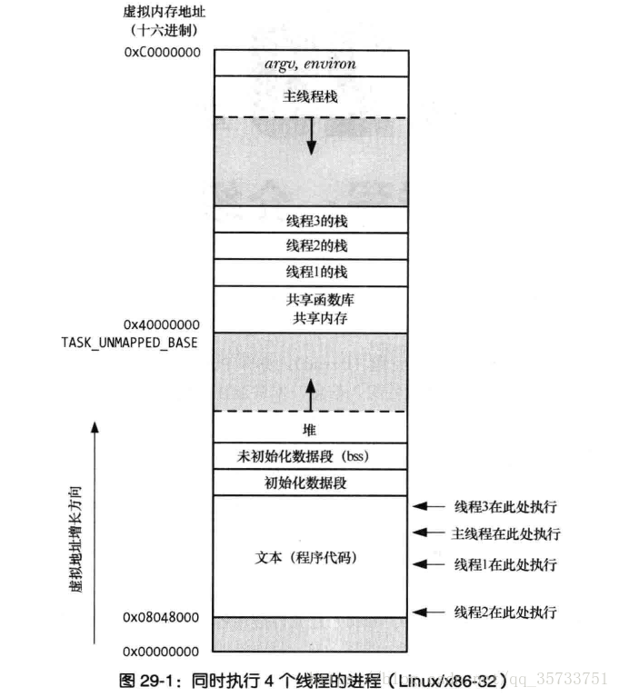

# 操作系统原理——面试常见问题总结

## 操作系统的发展

* 多道程序设计技术允许多个程序同时进入内存并运行。即同时把多个程序放入内存，并允许它们交替在CPU中运行，它们共享系统中的各种硬、软件资源。当一道程序因I/O请求而暂停运行时，CPU便立即转去运行另一道程序。
* 在操作系统中釆用分时技术就形成了分时系统。所谓分时技术就是把处理器的运行时间分成很短的时间片，按时间片轮流把处理器分配给各联机作业使用。若某个作业在分配给它的时间片内不能完成其计算，则该作业暂时停止运行，把处理器让给其他作业使用，等待下一轮再继续运行。
* 为了能在某个时间限制内完成某些紧急任务而不需时间片排队，诞生了实时操作系统。这里的时间限制可以分为两种情况：如果某个动作必须绝对地在规定的时刻（或规定的时间范围）发生，则称为硬实时系统。例如，飞行器的飞行自动控制系统，这类系统必须提供绝对保证，让某个特定的动作在规定的时间内完成。如果能够接受偶尔违反时间规定，并且不会引起任何永久性的损害，则称为软实时系统，如飞机订票系统、银行管理系统。

## OS的主要功能是什么？
* 资源管理功能：处理机管理、存储器管理、设备管理、文件管理
* 操作系统和用户之间的接口：用户接口：联机用户接口，脱机用户接口和图形用户接口；程序接口：该接口是为用户程序在执行中访问系统资源而设置的，它是由一组系统调用组成。

## 什么是进程？

* 计算机中正在运行的程序实例；可以分配给处理器并由处理器执行的一个实体。
* 由程序段、相关的数据段和PCB三个部分便构成了进程实体。进程实质是进程实体的一次执行过程
* PCB中主要包括下述四方面的信息：进程标识符（内部标识符，外部标识符）、处理机状态进程、调度信息、进程控制信息

## 进程和程序区别

- 进程是一个动态概念，强调执行的过程，每个进程中包含了程序段和数据段两个部分，以及进程控制块PCB；而程序是一个静态概念，程序是指令的有序集合，无执行含义；
- 一个进程可以执行多个程序（如Linux中通过exec调用），同一程序的多次执行将产生多个不同的进程。同一个程序的一次执行也可产生多个进程（如在程序中多次调用Linux中的fork）。

## 进程的三种基本状态

就绪状态，执行状态，阻塞状态

## 什么是线程

线程，有时称为轻量级进程，是CPU使用的基本单元；它由线程ID、程序计数器、寄存器集合和堆栈组成。它与属于同一进程的其他线程共享其代码段、数据段和其他操作系统资源（如打开文件和信号）。

## 线程与进程的联系区别

* 都有并发性
* 线程是进程的一部分，所以线程有的时候被称为是轻权进程或者轻量级进程。
* 系统在运行的时候会为每个进程分配不同的内存区域，但是不会为线程分配内存（线程所使用的资源是它所属的进程的资源），线程组只能共享资源。那就是说，出了CPU之外（线程在运行的时候要占用CPU资源），计算机内部的软硬件资源的分配与线程无关，线程只能共享它所属进程的资源。
* 进程是系统所有资源分配时候的一个基本单位，线程是独立调度的基本单位，拥有一个完整的虚拟空间地址，独立存在，而线程必须依赖程序无法独立存在

但线程解决了这个问题，线程之所以能够方便，快速的共享数据，是因为进程调用fork创建子进程所需复制的诸多进程属性在线程间本来就是共享的，无需复制内存页，页表等（因为复制内存页和页表花费的开销不少），这对线程来说，效率提高了不少。当然这是有代价的：不过这要避免出现多个线程同时修改同一份数据的情况，这需要使用线程同步机制。

## 进程间通信方式

* 管道（pipe）及有名管道（named pipe）： 管道可用于具有亲缘关系的父子进程间的通信，有名管道除了具有管道所具有的功能外，它还允许无亲缘关系进程间的通信。
* 信号（signal）： 信号是在软件层次上对中断机制的一种模拟，它是比较复杂的通信方式，用于通知进程有某事件发生，一个进程收到一个信号与处理器收到一个中断请求效果上可以说是一致的。
* 消息队列（message queue）： 消息队列是消息的链接表，它克服了上两种通信方式中信号量有限的缺点，具有写权限得进程可以按照一定得规则向消息队列中添加新信息；对消息队列有读权限得进程则可以从消息队列中读取信息。
* 共享存储（shared memory）： 可以说这是最有用的进程间通信方式。它使得多个进程可以访问同一块内存空间，不同进程可以及时看到对方进程中对共享内存中数据得更新。这种方式需要依靠某种同步操作，如互斥锁和信号量等。
* 信号量（semaphore）： 主要作为进程之间及同一种进程的不同线程之间得同步和互斥手段。
* 套接字（socket）；这是一种更为一般得进程间通信机制，它可用于网络中不同机器之间的进程间通信，应用非常广泛。

## 虚拟内存的优点

- 若干进程可以并发地执行。
- 应用程序所需内存大于物理内存的时候也可以运行2。
- 进程可以共享函数库或程序的一个单独内存映象。
- 程序是可重定位的，可以把程序放在物理内存的任何地方。
- 程序员可以编写机器无关代码，无需关系物理内存的组织结构。
- 程序只有部分代码装入内存时进程可以执行它。
- 允许每个进程访问可用物理内存的子集。