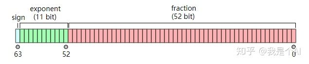

# 信息的表示

## 原码、反码与补码

从前有一群异想天开的欧洲人，整天想能不能用机器来思考问题。他们发现生活中的很多问题都可以转换成加法，本着征服了国王的女人就征服了天下的原则，他们想到只要能做出一个能计算加法的机器就可以了。

这个东西并不难做，找一堆电池导线和灯泡就可以，难的是这玩意是不是真的什么问题都能解决。很快就有人站出来问这玩意怎么做减法？

这个问题把大家都难住了，加法和减法这两个完全相反的东西怎么能用同一方法计算呢？减法的目的是要让一个数字变小，而加法只能让它变大。

这帮家伙苦思不得其解。有人想改进原来的电路，有人想重新设计一个专门算减法的电路。这些方案都存在这样那样的问题，所有的人都在想寻找一个完美的解决办法。

这天一个教授在图书馆乱逛，发现了一本中国的成语词典。他随手一翻，找到了一个成语——南辕北辙，讲的是一个应该南下去楚国的人车子却在往北走。这位教授心想这个人好傻，不过要是他一直走下去的话也是能到的，因为地球是圆的嘛。

既然往北走到南方这种看似不可能的事理论上都能实现，那加上一个数让它变小为什么不可以呢。他开始仔细比较这两个问题有什么不一样，很快的除了结论：地球是圆的，但数轴是平的，而且往正负极无限延伸。

他并没有因此而懊恼，既然没有条件那就创造条件嘛，既然数轴是直线，那就截取一段然后首尾相接弯成圆形呗。这样想着他截取了一段0-999的数轴，因为这个自创的数轴是圆的，所以999加1就会变成0而不是1000，这样不就实现了加上一个数还能变小了嘛！

光有灵感是不够的，他还要设计一套完整的计算法则。不过既然规则是由人制定的就意味着可能会有漏洞，我们不得不去讨论所有的情况以确保万无一失，否则只要有一个反例就能让我们辛辛苦苦搭建的高楼轰然倒塌。

他赶紧完善这套自创的计算方法。从0到999一共有1000个整数，所以就称这段数轴的模长为1000。如果要做减法，那么就加上一个数，让结果超过这段数轴能表示的最大的数，这样就不得不从0开始重新计算。也就是说，每当要减去一个数，就要想办法找到应该加上的那个数。比如说模长是1000，那么减去200就可以变成加上800，减去300就可以变成加上700。他发现要减去的数和要加上的数有一种关系，就是他们的和总是1000，这有点像几何里面的补角的概念，所以他就给这两种数分别取了一个名字，要减去的数叫原码，要加上的数叫补码。如果想要减去200，那么要加上的800就是200的补码，如果想减300，那么要加上的700就是300的补码。根据补码的求法可以发现补码是和模的取值有很大关系。

想出了这个办法后他赶紧验证。他随便做一个运算：

694-246=448

那么用补码运算法就应该先寻找要减去的这个数的补码，补码为：

1000-246=754

把减去246转成加上246的补码：

694+754=1448

因为超过了最大能表示的数999，所以取余数：

1448-1000=448

和结果正好吻合！

这个方法似乎有点美中不足，因为它的缺点很明显，他能表示的数是有限制的。也就是说他只能计算结果在0-999这个范围内的运算，如果运算结果超过了这个范围就不对了，我们成为溢出。不过这个长度是随意取的，如果想要进行很大的数据运算的话就把长度取长一点就行了。取0-999就只能进行百位数的运算，取0-9999999的话就可以进行百万位数的运算，不够的话还可以取更大的。这个方法叫做扩增位数。

他赶紧找来一张纸写下了如今长居于我们组原课本里的一句话：

用减法减去一个数可以转换成加上这个数的补码。

到了这里就结束了吗?当然没有，他还要进行很多次试验确认这种方法万无一失。有一个问题很明显，我们在计算补码的时候用的就是减法，用减法将减法转换成加法，听起来就挺讽刺。

那该怎么解决呢？这就要回到书本上让人匪夷所思的二进制了。我们都知道二进制里只有两个数字0和1，正是因为这样的特性让它不用减法也可以进行求补运算。比如在二进制数轴上取0-11111111这一段，那么模长就是100000000。

随便找一个数10110010求补码：

100000000-10110010=01001110

刚刚不是说不用减法了吗，为什么还在减呢？先别急，我们换一个思路来理解。100000000可以看成11111111加1，也就是说上面求补码的过程可以转换成：

100000000-10110010
=11111111+1-10110010
=11111111-10110010+1
=01001101+1
=01001110

大家一看还是有减法啊，治标不治本嘛！别急，这个减法有点特殊，被减数是11111111，我们只要把减数里的1全部换成0，0全部换成1就行了。过程叫做取反，得到的结果叫做反码。因为被减数减了1，所以结果要加上1，这就是为什么书上总是说补码的求法是取反加一。

通过这个方法就可以不借助减法也能求补了，多亏了几百年前莱布尼茨发明了这种神奇的计数进制，真可谓前人种树后人乘凉。

他欣喜若狂地想要将这个方法应用到实践中去，直到他开始用这种方法计算自己的工资。

有一次他刚刚拿到薪水就考虑出国度假，但是预算不足所以超支了，他想算算看自己超了预算多少，结果算出来的结果却让他大跌眼镜。算出来的结果竟然是正数？

看来革命尚未成功，也不能高兴地太早。这个问题不太容易发现，那就是结果是负数的情况，举个例子：

300-700=-400

如果他继续用自己发明的方法计算的话就要先求减数的补码：

1000-700=300

然后将减法转换成加法：

300+300=600

因为没有超过模长所以不用进行求余运算，最后的结果就是600，计算得到的答案和真实的答案不一样。

于是它又陷入了郁闷，看来自己设计出来的运算方法不能适用于所有的情况。他开始寻找错误的原因，先来看看计算得到的答案和真实结果的关系。600和-400刚好相差1000，又是这个1000。上一次我们用到1000的地方是求补的时候，仔细一看，600不是正好可以理解为-400的补码吗！

柳暗花明又一村。原来答案没有错，只是对答案的理解方式有错，他得到的不是结果本身，而是结果的补码。于是他把补码的适用范围从减数扩展到减数和差。那么他很容易就联想到了是不是被减数也可以用补码来表示？当然可以，举个例子：

-300-400=-700

对400求补码：

1000-400=600

对300求补码：

1000-300=700

原式转换成：

600+700=1300

1300-1000=300

而300恰好是-700的补码。虽然看着有点奇怪，但从某种意义上来讲确实算出了答案。

于是他又在刚刚那句话下面加了一句话：

所有的数都应该用补码来表示，正数的补码是它自身，而负数的补码是取反后加一。

正当他以为问题圆满解决的时候，却没想到自己其实捅了一个更大的篓子，很快他就遇到了麻烦。

我们先计算两道算数题：

100+300=400

200-800=-600

结果没什么问题，但是用计算机来计算的话会怎么样呢？第一道很简单，甚至不需要补码转换，直接加就好。第二道的话因为涉及到减法所以要进行补码转换，-800的补码是200，所以转换成：

200+200=400

按照之前的理解，400是-600的补码，答案并没有任何问题，但是这是在知道正确答案的情况下我们可以理解计算得到的答案，如果不知道正确答案仅仅得到计算的答案400，它到底是400的原码，还是-600的补码呢？换句话说，-600的补码是400，而400不一定是-600的补码，他可能是400本身的原码。

这下他傻眼了，补码的求法是他自己定义的，正是因为这种求法才会导致所有的结果都会有歧义。他竟然亲手毁了自己的发明。

这是一个无法忽视的问题。求补的方式是我们自己定义的，如果要改变求补的方式就要把之前的工作全部推倒重来，否则就必须找到一种能够区分正负数的办法。为了不让之前的努力变为沉没成本，他决定继续往前走。

人们在数字前面加上一个+表示正数，加上一个-表示负数，本质上只是一种区分用的符号，是人为规定的。只要我们愿意的话，也可以自己规定在数字前面加-表示正数，加+表示负数。对于只认死理计算机来说，除了0和1以外一概不认。同样非此即彼的特性倒是有几分相似之处，于是他萌生了用数字表示符号位的念头。

我们规定每个二进制数的第一位为符号位，0为正数1为负数。而后面的所有位都是数值位，和原来的表示方法一样。这样的话我们无论看到什么数都先检查它的第一位确定它的符号，这样就知道该如何解读它。

可是他心里还是有一丝担忧，这样大刀阔斧的改革会不会出问题？毕竟计算机是分不清符号位和数值位的，即便是符号位也会被当做数值位一起运算，万一把正数算成负数，负数算成正数怎么办？

想到这里他已经有点头晕了，他必须好好梳理一下自己的思路。他的目的是想通过加法来表示减法，于是他发明了一个叫做补码的东西。不过这个东西会产生歧义，为了区分正负补码，他决定用一个二进制位表示符号。可是计算机会将符号位当做数值位一起运算，这样做的计算结果会不会导致符号出问题？如果想要证明符号位不会出现错误，就要考虑到所有的情况，并且保证用自己的方法计算出来的结果和真实的结果相同。

他罗列出了一级四则运算所有的情况：


生活中遇到的所有加减法都可以归结到以上几种情况当中，而这几种情况又有重复。所以只要证明上述四种情况用自己发明的方法运算得到的结果和正确结果一致，那么就可以用自己发明的方法取代原来的方法。

于是我们得出了一个结论，当减法的结果为正数，计算过程会发生溢出，并且答案就是原码本身。当结果为负数，则不会发生溢出，但是我们只能得到答案的补码，需要进行求补运算才能得到正确答案。这个特性非常重要，对证明符号位即使参与运算也不会产生错误结果有很大帮助。

正数加正数的情况是这样的：

0xxxxxxx+0xxxxxxx=0xxxxxxx

两个符号位都是0，相加之后仍为0。但是要警惕的一种情况就是数值运算的结果溢出产生进位到符号位改变符号位。这种情况的解决办法就是扩增位数使得进位无法传到符号位，将符号位“保护”起来。

如果一个正数减另一个正数答案也是正数的话是这种形式：

0xxxxxxx-0xxxxxxx=0xxxxxxx即

0xxxxxxx+1xxxxxxx=0xxxxxxx

因为答案是正数，所以后面数值位的运算会发生溢出（前面提到的特性）。不过这里的溢出不会再因为模长有限而消失，而是传到了符号位。符号位的运算结果为1，加上数值位的进位变成了10，但是符号位本已经是最高位，它的进位便消失了只剩下0。符号位便“阴差阳错”地得到了正确的结果。

一个正数减另一个正数为负数的情况呢？它的形式是这样的：

0xxxxxxx-0xxxxxxx=1xxxxxxx即

0xxxxxxx+1xxxxxxx=1xxxxxxx

因为结果为负数，所以不会产生溢出，那么数值位的运算结果也不会产生到符号位的进位。符号位运算的结果也刚好符合我们假设的情况。

最后一种情况是负数减正数：

1xxxxxxx-0xxxxxxx=1xxxxxxx即

1xxxxxxx+1xxxxxxx=1xxxxxxx

这样的情况两个加数的符号位都是1，他们的和应该是10去掉进位也就是0，也就是说计算的结果是正数，但是负数加负数是不可能为正数的，所以这种情况要讨论。两个负数相加，如果结果不会溢出，这说明他们的补码之和一定会溢出，产生进位到符号位，使符号位变回1。如果两个负数和会溢出，那么他们的补码之和就不会溢出，无法产生进位纠正符号位的错误。这时候就得再次用到扩增位数的方法，保证他们的和不会溢出而补码和会溢出。

到此为止我们终于解决了补码的运算问题，总结一下的话就是：

1.所有的数都以补码的形式保存，正数的补码是它自身，负数的补码为绝对值取反加一。

2.每一个数前面都要加上一个符号位，0表示正数，1表示负数。

3.减去一个数可以转换成加上求补之后的减数。


tip1：补码和求补是两回事，补码表示的是一种存储数据的方法，而求补是一种运算，千万不能弄混。

tip2：对于计算机来说，加上一个正数和减去一个负数的运算原理不同。前一种情况可以直接相加，而后一种情况需要对减数进行求补然后相加，多了一个运算步骤。


## 字符串 UNICODE

### 字符集

在计算机系统中，所有的数据都以二进制存储，所有的运算也以二进制表示，人类语言和符号也需要转化成二进制的形式，才能存储在计算机中，于是需要有一个从人类语言到二进制编码的映射表。这个映射表就叫做字符集。

### ASCII

最早的字符集叫 American Standard Code for Information Interchange（美国信息交换标准代码），简称 ASCII，由 American National Standard Institute（美国国家标准协会）制定。在ASCII 字符集中，字母 A 对应的字符编码是 65，转换成二进制是 0100 0001，由于二进制表示比较长，通常使用十六进制 41。

### GB2312、GBK

ASCII 字符集总共规定了 128 种字符规范，但是并没有涵盖西文字母之外的字符，当需要计算机显示存储中文的时候，就需要一种对中文进行编码的字符集，GB 2312 就是解决中文编码的字符集，由国家标准委员会发布。同时考虑到中文语境中往往也需要使用西文字母，GB 2312 也实现了对 ASCII 的向下兼容，原理是西文字母使用和 ASCII 中相同的代码，但是 GB 2312 只涵盖了 6000 多个汉字，还有很多没有包含在其中，所以又出现了 GBK 和 GB 18030，两种字符集都是在 GB 2312 的基础上进行了扩展。

### Unicode

可以看到，光是简体中文，就先后出现了至少三种字符集，繁体中文方面也有 BIG5 等字符集，几乎每种语言都需要有一个自己的字符集，每个字符集使用了自己的编码规则，往往互不兼容。同一个字符在不同字符集下的字符代码不同，这使得跨语言交流的过程中双方必须要使用相同的字符编码才能不出现乱码的情况。为了解决传统字符编码的局限性，Unicode 诞生了，Unicoide 的全称是 Universal Multiple-Octet Coded Character Set（通用多八位字符集，简称 UCS）。Unicode 在一个字符集中包含了世界上所有文字和符号，统一编码，来终结不同编码产生乱码的问题。


### 字符编码 UTF-8

Unicode 统一了所有字符的编码，是一个 Character Set，也就是字符集，字符集只是给所有的字符一个唯一编号，但是却没有规定如何存储，一个编号为 65 的字符，只需要一个字节就可以存下，但是编号 40657 的字符需要两个字节的空间才可以装下，而更靠后的字符可能会需要三个甚至四个字节的空间。

这时，用什么规则存储 Unicode 字符就成了关键，我们可以规定，一个字符使用四个字节存储，也就是 32 位，这样就能涵盖现有 Unicode 包含的所有字符，这种编码方式叫做 UTF-32（UTF 是 UCS Transformation Format 的缩写）。UTF-32 的规则虽然简单，但是缺陷也很明显，假设使用 UTF-32 和 ASCII 分别对一个只有西文字母的文档编码，前者需要花费的空间是后者的四倍（ASCII 每个字符只需要一个字节存储）。

在存储和网络传输中，通常使用更为节省空间的变长编码方式 UTF-8，UTF-8 代表 8 位一组表示 Unicode 字符的格式，使用 1 - 4 个字节来表示字符。

UTF-8 的编码规则如下（U+ 后面的数字代表 Unicode 字符代码）：

```
U+ 0000 ~ U+ 007F: 0XXXXXXX
U+ 0080 ~ U+ 07FF: 110XXXXX 10XXXXXX
U+ 0800 ~ U+ FFFF: 1110XXXX 10XXXXXX 10XXXXXX
U+10000 ~ U+1FFFF: 11110XXX 10XXXXXX 10XXXXXX 10XXXXXX

```

可以看到，UTF-8 通过开头的标志位位数实现了变长。对于单字节字符，只占用一个字节，实现了向下兼容 ASCII，并且能和 UTF-32 一样，包含 Unicode 中的所有字符，又能有效减少存储传输过程中占用的空间。

### utf8没有字节序，utf16、utf32有字节序

第一，编码单元与编码单元在网络中传输的顺序是确定的。即使是多字节编码方案，在网络层传输是没有问题的。比如 a b c，分别代表三个字节，发送时顺序是abc，那么接收时，仍然是abc，这个顺序不会错乱。我们经常会想utf8是多字节编码，怎么就不会存在字节序问题，这一条就很好的解答这个问题了。

 

第二，字节序指的是编码单元内部的字节顺序。

1、因为utf8是变长编码，而且是单字节为编码单元，不存在谁在高位、谁在低位的问题，所以不存在顺序问题！顺便说一下解码，由于utf8的首字节记录了总字节数（比如3个），所以读取首字节后，再读取后续字节（2个），然后进行解码，得到完整的字节数，从而保证解码也是正确的。

2、utf16是变长编码，使用1个16-bit编码单元或者2个16-bit编码单元，utf32是定长编码，这里拿utf16举例，在基本平面总是以2个字节为编码单元，鉴于“第一条”编码单元与编码单元之间的顺序是正确的，问题只能在编码单元内部中字节与字节的顺序，由于硬件cpu的不同，编码单元内部字节与字节的顺序不确定。假如cpu是大端序那么高位在前，如果cpu是小端序那么低位在前，为了区分，所以有了BOM（byte order mark），然后计算机才能知道谁是高位，谁是低位，知道了高低位，从而能正确组装，然后才能解码正确。

例如，一个“奎”的Unicode编码是594E，“乙”的Unicode编码是4E59。如果我们收到UTF-16字节流“594E”，那么这是“奎”还是“乙”？如果BOM是大端序，那么代码点就应该是594E，那么就是“奎”，如果BOM是小端序，那么代码点就应该是4E59，就是“乙”了。

 

综上所述，因为utf8是单字节为编码单元，在网络传输时，不存在字节序列问题。在解码时，由于首字节记录了总字节数，所以能正确解码。

因为utf16是定长编码，总是以2个字节为编码单元，在网络传输时，不存在字节序列问题。在解码时，由于cpu硬件差异，存在字节序问题，所以通过BOM来标记字节顺序；

### UTF-8、UTF-16 


UTF-16 并不是一个完美的选择，它存在几个方面的问题：


- UTF-16 存在大小端字节序问题，这个问题在进行信息交换时特别突出——如果字节序未协商好，将导致乱码；如果协商好，但是双方一个采用大端一个采用小端，则必然有一方要进行大小端转换，性能损失不可避免（大小端问题其实不像看起来那么简单，有时会涉及硬件、操作系统、上层软件多个层次，可能会进行多次转换）
- 另外，容错性低有时候也是一大问题——局部的字节错误，特别是丢失或增加可能导致所有后续字符全部错乱，错乱后要想恢复，可能很简单，也可能会非常困难。（这一点在日常生活里大家感觉似乎无关紧要，但是在很多特殊环境下却是巨大的缺陷）

目前支撑我们继续使用 UTF-16 的理由主要是考虑到它是双字节的，在计算字符串长度、执行索引操作时速度很快。当然这些优点 UTF-32 都具有，但很多人毕竟还是觉得 UTF-32 太占空间了。

反过来 UTF-8 也不完美，也存在一些问题：

- 文化上的不平衡——对于欧美地区一些以英语为母语的国家 UTF-8 简直是太棒了，因为它和 ASCII 一样，一个字符只占一个字节，没有任何额外的存储负担；但是对于中日韩等国家来说，UTF-8 实在是太冗余，一个字符竟然要占用 3 个字节，存储和传输的效率不但没有提升，反而下降了。所以欧美人民常常毫不犹豫的采用 UTF-8，而我们却老是要犹豫一会儿
- 变长字节表示带来的效率问题——大家对 UTF-8 疑虑重重的一个问题就是在于其因为是变长字节表示，因此无论是计算字符数，还是执行索引操作效率都不高。为了解决这个问题，常常会考虑把 UTF-8 先转换为 UTF-16 或者 UTF-32 后再操作，操作完毕后再转换回去。而这显然是一种性能负担。

当然，UTF-8 的优点也不能忘了：

- 不存在大小端字节序问题，信息交换时非常便捷
- 容错性高，局部的字节错误（丢失、增加、改变）不会导致连锁性的错误，因为 UTF-8 的字符边界很容易检测出来，这是一个巨大的优点（正是为了实现这一点，咱们中日韩人民不得不忍受 3 字节 1 个字符的苦日子）


## 浮点数的表示

浮点数是用二进制的科学计数法来表示的，在计算机上是以二进制来进行存储的，单精度浮点数占用32位，双精度浮点数占用64位。以下都用64位双精度浮点数来解释。



最高位是符号位(sign)，0表示正数，1表示负数。接下来的11位储存的是的指数(exponent)，最后是52位储存的是小数(fraction)。浮点数的值可以用下面这个式子算出，类似于十进制的科学计数法。


需要注意的是exponent和fraction并不是直接储存的，图中 exponent 计算公式错误，应该是 c-1023，c 代表 11 位的二进制值。

其中偏移量 1023 是 2^(k-1) - 1 计算而来，代表 2^k 的一半。

实际上62位到52位存的是c，长度为11位，所以c可以表示10进制 [0-2047] 区间里的整数，0和2047有特殊的含义。1023是64位浮点数的指数偏移量（exponent bias），32位浮点数的偏移量是127。在这里 [-1023-1024] 可以表示 [公式] 区间里的整数。不考虑c=0和2047的情况，指数exponent的取值范围是 [2^-1022, 2^1023] 。

因为要保证 [1 < fraction < 2] ，小数点前的数字总是1，就不用存了，所以51位到0位存的值称为尾数（mantissa），是用二进制表示的小数点后的数字